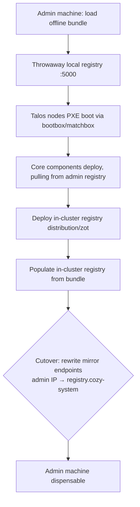

# Self-hosted in-cluster registry for air-gapped Cozystack

- **Title:** `Self-hosted in-cluster registry for air-gapped Cozystack (bundle bootstrap → in-cluster source of truth)`
- **Author(s):** `@gecube`
- **Date:** `2026-06-24`
- **Status:** Draft

> Migrated from discussion [cozystack/cozystack#3029](https://github.com/cozystack/cozystack/discussions/3029) to the design-proposal process for review.

## Overview

Cozystack's current air-gap story is "bring your own registry": operators must stand up and populate a mirror themselves, and mirror creation is explicitly out of scope. This proposal evolves that into a bundled, self-hosted flow. We ship an **offline bundle** (~4–10 GB per flavor/version) containing OCI images and Talos OS assets, bootstrap from a **throwaway local registry** on the admin machine, and then stand up a **self-hosted in-cluster registry** (`distribution` or `zot`) that becomes the persistent source of truth. Image pulls are redirected through the existing Talos/containerd registry-mirror mechanism, so after a single cutover the admin machine becomes dispensable.

The key insight: a Cozystack cluster already runs the storage it needs (LINSTOR/Piraeus, SeaweedFS), so the in-cluster registry needs no new external dependency.

## Scope and related proposals

- Migrated together with the **[Coroot eBPF observability](../coroot-ebpf-observability/)** proposal (from discussion [#3028](https://github.com/cozystack/cozystack/discussions/3028)). The two are independent in substance; they are submitted as a pair.
- **Tenant-owned registries are out of scope.** Cozystack already ships Harbor (system component and tenant-deployable app) with RBAC, projects, and robot accounts for multi-tenant push/pull. The in-cluster `registry.cozy-system` proposed here is read-mostly and digest-pinned, not a tenant build registry.

## Context

Air-gap delivery spans two artifact classes across two cluster tiers:

**Artifact classes**
- OCI container images — pulled by containerd at runtime.
- Talos OS assets — kernel, initramfs, ISO, metal images (bare-metal) and the nocloud disk image (VMs).

**Cluster tiers**
- Management (root) cluster on bare-metal Talos nodes.
- Tenant (leaf) clusters as Kamaji control planes and KubeVirt VMs running Talos.

Today's docs only cover OCI images via mirrors, leaving Talos asset delivery fragmented and the bootstrap chicken-and-egg unaddressed.

### The problem

An operator with no internet egress cannot install or upgrade Cozystack without manually assembling a mirror, and even then has no guidance for delivering Talos boot media or for day-2 upgrades. The result is bespoke, error-prone per-site tooling.

## Goals

- A single offline bundle per flavor/version carries every OCI image and Talos asset required for a full install.
- Bootstrap works from a throwaway registry on the admin machine, with no internet egress.
- A self-hosted in-cluster registry becomes the persistent source of truth after bootstrap; the admin machine is no longer required.
- Image redirection uses the Talos/containerd mirror mechanism, affecting system components, node images, and tenants alike.
- Day-2 upgrades have a defined, preflight-guarded sequence.

### Non-goals

- Tenant-facing build/push registry (Harbor already covers this).
- Cryptographic image signing/verification (deferred to Phase 2).
- `paas-hosted` air-gap support (deferred to Phase 3 — no node-level containerd control).

## Design

**Rule 1 — Standardized tagging.** Cozystack publishes images consistently to `ghcr.io/cozystack/…` plus known upstream registries, so the image set is enumerable for a deterministic bundle.

**Rule 2 — Air-gap requires a private registry.** Accepted as a given; this proposal specifies whose and where.

**Rule 3 — Bootstrap with a local registry.** The admin loads the bundle into a temporary Docker registry:

```bash
docker run -d -p 5000:5000 --name cozy-bootstrap-registry \
  -v /srv/cozy-registry:/var/lib/registry registry:2
cozystack images push --bundle cozystack-airgap-paas-full-v1.5.0.tar \
  --to http://ADMIN_IP:5000
```

**Rule 4 — In-cluster registry post-bootstrap.** Once core components stabilize, the platform deploys a lightweight registry (`distribution` or `zot`) backed by SeaweedFS S3 or a LINSTOR PVC. After it is populated, the mirror endpoints are rewritten from the admin IP to the internal registry domain (e.g. `registry.cozy-system`), and the admin machine becomes dispensable.

**Rule 5 — Redirection via containerd mirrors.** We favor the existing Talos/containerd `machine.registries.mirrors` mechanism over admission-based approaches (Kyverno or native CEL). Mirrors operate below Kubernetes and affect all image pulls — system components, node images, and tenants — making them more reliable for air-gap than Pod-spec-level mutation.

```yaml
machine:
  registries:
    mirrors:
      ghcr.io:
        endpoints:
          - https://registry.cozy-system     # internal, preferred
          - https://ghcr.io                   # fallback
```

### Bootstrap → cutover



Management cluster nodes and tenant VM workers converge on `registry.cozy-system` for OCI pulls. Talos boot media (management only) remains an irreducible bootstrap responsibility served via bootbox/matchbox. Tenant VMs import the Talos nocloud disk image via KubeVirt CDI from the in-cluster source.

### Compatibility across distributions

| Bundle        | Owns node OS?   | Mirror mechanism                  | Air-gap story |
|---------------|-----------------|-----------------------------------|---------------|
| `paas-full`   | ✅ Talos        | ✅ `machine.registries.mirrors`   | **Full**      |
| `distro-full` | ✅ Talos        | ✅                                | **Full**      |
| `paas-hosted` | ❌ External K8s | ❌ Cannot set host containerd     | **Partial**   |

Phase 1 targets `paas-full` and `distro-full`. `paas-hosted` lacks node-level containerd control and is deferred.

## User-facing changes

- A `cozystack images` CLI surface (or equivalent) for building, pushing, and verifying bundles.
- Per-release air-gap bundles published as release assets (proposed — see open questions).
- Documented air-gap install and upgrade runbooks.

## Upgrade and rollback compatibility

Day-2 upgrades require pre-loading the new version's artifacts into the live in-cluster registry **before** bumping the platform version:

1. Generate the new-version bundle on a connected machine.
2. Transfer via removable media.
3. Push OCI images and Talos assets to the in-cluster registry.
4. Run a preflight verification confirming all required digests are present.
5. Only then trigger the platform version bump and Flux reconciliation.

Critical sequencing: bumping before pre-loading triggers immediate `ImagePullBackOff`. The preflight check guards against incomplete transfers. Old images are garbage-collected post-verification as a deliberate step, never automatically. Rollback re-seeds from the retained offline bundle.

## Security

Phase 1 is explicitly a PoC posture:

**Provided**
- Transport-level tamper protection via TLS with a baked-in root CA distributed to all nodes.
- Containerd validation of registry certificates.

**Not provided (deferred to Phase 2)**
- Cryptographic image signing/verification (cosign/sigstore).
- Provenance/SBOM attestation.
- At-rest encryption (a storage-layer concern).

The bootstrap registry may use `tls.insecureSkipVerify: true` temporarily; the persistent in-cluster registry must use proper TLS with CA trust.

## Failure and edge cases

- **Bump before pre-load** → immediate `ImagePullBackOff`; preflight check is the guard.
- **Total registry outage** → blocks new pulls only; already-running pods keep their cached images. Mitigated by multi-replica HA backing storage.
- **Incomplete bundle transfer** → caught by preflight digest verification before any version bump.
- **DNS for `registry.cozy-system` unresolvable at containerd level** → node cannot pull; the registry domain must resolve on every node, not just in-cluster.
- **Admission policies (Kyverno/CEL) cannot rewrite system/node images** → only see Pod specs, so they are unsuitable for air-gap redirection.

## Testing

- Unit: bundle manifest enumeration and digest verification.
- Integration: throwaway-registry bootstrap on a `paas-full` cluster with egress firewalled off.
- e2e: full offline install, then a day-2 upgrade via pre-load → preflight → bump.
- Manual: cutover (mirror endpoint rewrite) with no half-migrated nodes.

## Rollout

- **Phase 0** — Community discussion and direction validation (this proposal).
- **Phase 1 (PoC)** — Bundle tooling, offline bootbox seeding, throwaway admin registry, in-cluster `distribution`/`zot`, tenant Talos nocloud + images from in-cluster source, TLS with baked-in CA. Targets `paas-full` and `distro-full`.
- **Phase 2** — Native CEL `ValidatingAdmissionPolicy` for cheap provenance constraints; cosign/sigstore integration; at-rest encryption.
- **Phase 3** — `paas-hosted` support; tenant cluster hardening; upgrade/garbage-collection tooling.

## Open questions

1. In-cluster registry implementation: `distribution` vs. `zot` vs. reusing Harbor?
2. Addressing strategy: Service/VIP vs. DNS name?
3. Bundle granularity: per-flavor or single superset?
4. Acceptable to defer `paas-hosted` support?
5. Tooling location: `cozystack` CLI, separate repo, or installer?
6. Should the project publish per-release air-gap bundles as release assets?
7. Worth implementing delta bundles for smaller upgrade transfers?

## Alternatives considered

- **Admission-based redirection (Kyverno / native CEL).** Rejected as the primary mechanism: admission webhooks only see Pod specs and cannot rewrite system-component or node-image pulls, so they cannot cover the air-gap surface. CEL constraints may still serve a Phase 2 provenance role.
- **Bring-your-own registry only (status quo).** Rejected: leaves Talos asset delivery and the bootstrap chicken-and-egg unsolved, and pushes bespoke tooling onto every operator.
- **Reusing Harbor as the platform mirror.** Possible but heavier than needed for a read-mostly, digest-pinned source of truth; kept as an open question rather than the default.
