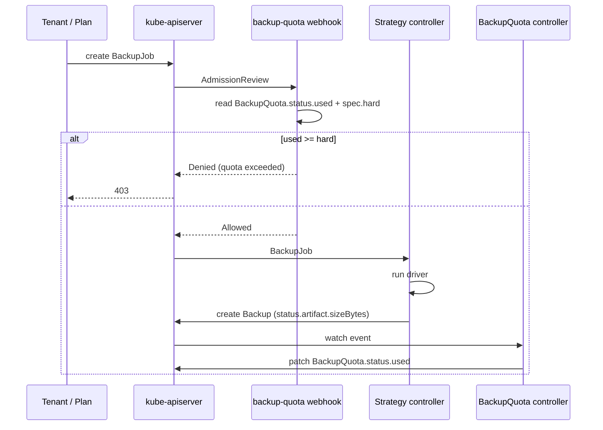

# Quota and accounting for backup storage

- **Title:** `Quota and accounting for backup storage`
- **Author(s):** `@lllamnyp`
- **Date:** `2026-08-04`
- **Status:** Draft

## Overview

Cozystack can back up managed applications, but it cannot limit how much backup
storage a tenant consumes, nor tell anyone how much has been consumed. A tenant
with a cron `Plan` and a large database fills the operator's object storage
without ever meeting a limit or seeing a number.

This proposal adds a size- and count-aware backup quota. It has three parts,
and the interesting one is not the part people expect: enforcement is
straightforward, while *accounting* is the hard problem, because the set of
`Backup` objects in a namespace is not a faithful record of the bytes a tenant
occupies.

## Context

The backup API (`api/backups/v1alpha1`) is driven by four objects:

- `Plan` — a cron schedule. `internal/backupcontroller/plan_controller.go`
  creates one `BackupJob` per tick.
- `BackupJob` — a request for one run, resolved against a `BackupClass` to a
  driver-specific strategy.
- `Backup` — the record of a completed artifact. Created *by the strategy
  controller*, not by the user: see `etcdstrategy_controller.go`,
  `mariadbstrategy_controller.go`, `foundationdbstrategy_controller.go`. It
  carries `status.artifact.sizeBytes` (optional — "if known").
- `RestoreJob` — the reverse path.

Tenant quotas today are helm-driven: `packages/apps/tenant/templates/quota.yaml`
renders `.Values.resourceQuotas` through `cozy-lib.resources.flatten` into a
single `corev1.ResourceQuota`. Every dimension it can express is one
kube-apiserver already knows how to count.

### The problem

**Tenant:** "How much backup storage am I using? Am I close to a limit?" There
is no answer. The first feedback is an operator email.

**Operator:** "Tenant X is consuming 40 TB of object storage in backups." There
is no mechanism to cap it, and no per-namespace figure short of querying the
storage backend and reverse-engineering key prefixes.

## Goals

- Cap total backup storage per namespace, and refuse new backup runs once the
  cap is reached.
- Publish current backup consumption where a tenant can read it.
- Work for every driver, including those whose artifacts Cozystack does not
  own or delete.
- Never break an already-admitted run, and never block a restore.

### Non-goals

- **Capping an individual backup's size at admission.** The size of a backup is
  unknown until the artifact exists; `status.artifact.sizeBytes` is written
  afterwards. Any gate is therefore a stop-signal, not a ceiling — see
  "Overshoot is unbounded" below.
- **Purging artifacts to make room.** Retention belongs to each driver's own
  policy (barman `RetentionPolicy`, mariadb-operator `MaxRetention`, …).
- **Pricing or billing.** This proposal produces a number; charging for it is
  out of scope.

## Design

### 1. Why a quota Evaluator is not an option

The natural design is a `quota.Evaluator` for `backups.cozystack.io`, matching
how native resources are counted. It cannot be built. Evaluators are compiled
into kube-apiserver's ResourceQuota admission plugin and into
kube-controller-manager; there is no extension point that lets an out-of-tree
component contribute a *scalar* dimension derived from a custom resource's
status. A CRD gets exactly one thing for free: the generic object-count
dimension, `count/backups.backups.cozystack.io`.

And that freebie is a trap. Enforcing it means kube-apiserver rejects `Backup`
CREATE — which is issued by the strategy controller when a run finishes, not by
the tenant. A tenant at their limit would see backup *jobs* start, run to
completion, and then fail to record their result, leaving orphaned artifacts in
object storage with no CR referencing them. Exactly the wrong failure.

This yields the central rule of the design:

> **Gate the request, account the artifact.** Enforcement attaches to
> `BackupJob` CREATE, which the tenant (or their `Plan`) initiates. Accounting
> reads `Backup`, which the controller writes.

### 2. The accounting problem

The obvious ledger — sum `status.artifact.sizeBytes` over live `Backup` objects
in the namespace — is wrong in both directions, and this is the part of the
design that deserves review attention.

**Deleting a `Backup` usually does not free storage.** `backup_controller.go`'s
cleanup dispatch is explicit about this, per driver: the Altinity branch notes
that deletion "does NOT purge the upstream clickhouse-backup archive in object
storage"; MariaDB likewise "does not own the archive, so it does not delete it
on CR removal"; FoundationDB says the same of the operator-side CR that drives
a streaming agent. Both branches were written specifically to *avoid* falling
through to the Velero default — which does clean up, and is the one driver for
which deleting a `Backup` genuinely releases bytes.

So the behaviour is not uniform, and it is not incidental: it is a per-driver
property that the code already knows and no other component can see. A tenant
at their quota using any non-Velero driver can `kubectl delete backup --all`,
reclaim their entire allowance, and occupy exactly as many bytes as before.
That is not a leak to be documented — it is a one-command bypass of the feature.

**Driver-side retention frees storage without deleting the CR.** The inverse:
barman or `MaxRetention` prunes an archive on its own schedule while the
`Backup` object remains, so the ledger overcounts and the tenant is charged
quota for bytes that no longer exist.

The two failures share a cause: **the `Backup` CR tracks a record, not an
allocation.** Whether deleting it releases anything depends on which driver
produced it.

#### Artifact ownership as a first-class strategy property

Each strategy declares whether Cozystack owns the artifact's lifecycle:

```go
// StrategyStatus (or the BackupClass resolution result)
type StrategyCapabilities struct {
    // OwnsArtifact is true when deleting the Backup CR also deletes the
    // stored artifact, so the bytes are released with the object.
    OwnsArtifact bool `json:"ownsArtifact"`

    // ReportsSize is true when the driver populates
    // status.artifact.sizeBytes. When false, this strategy's backups are
    // invisible to the size dimension and only count toward the count one.
    ReportsSize bool `json:"reportsSize"`
}
```

This is not new information — it is the per-driver knowledge already encoded as
prose in `backup_controller.go`'s cleanup switch, promoted to a field the
accounting controller can read. Making it explicit also forces each new driver
to answer the question at review time.

Usage then splits in two:

- **Attributed** — bytes of `Backup` objects that exist now. Released when the
  CR is deleted, but only for `OwnsArtifact: true` strategies.
- **Retained** — bytes belonging to deleted CRs whose strategy does *not* own
  the artifact. These stay charged until the driver reports the archive gone.

`used = attributed + retained`. A tenant deleting CRs to dodge the cap moves
bytes from one bucket to the other and frees nothing, which is the correct
answer.

Retained bytes need a reconciliation path or they become permanent. Two
mechanisms, both worth having:

1. **Driver-reported reconciliation.** Where a driver can enumerate its stored
   archives (barman, clickhouse-backup's HTTP API, Velero's backup list), the
   strategy controller periodically reports the true set and the retained
   bucket is recomputed from it. This is the accurate path and should be the
   goal for every driver that can support it.
2. **Explicit release.** An operator (not the tenant) can zero the retained
   bucket for a namespace after purging storage by hand, for drivers with no
   enumeration API.

### 3. Where the numbers live

Backup quota does **not** extend `corev1.ResourceQuota`. Two reasons:

- `ResourceQuota.status` is owned by kube-controller-manager's quota
  controller, which recomputes it from its own evaluators. Co-writing a
  dimension it does not know about is at best undefined and at worst a flapping
  write war between two controllers. (See "Open questions" — if it turns out
  upstream reliably preserves foreign dimensions, mirroring becomes attractive
  and this decision should be revisited.)
- The `used` figure here is not a simple function of live objects. Modelling
  `retained` inside a `ResourceQuota` status has nowhere to go.

Instead, a namespaced CR:

```yaml
apiVersion: backups.cozystack.io/v1alpha1
kind: BackupQuota
metadata:
  name: default
  namespace: tenant-acme
spec:
  hard:
    size: 500Gi      # total stored bytes; omit for unlimited
    count: 200       # number of Backup objects; omit for unlimited
status:
  used:
    size: 412Gi
    count: 137
  attributed:
    size: 380Gi
  retained:
    size: 32Gi       # deleted CRs whose artifacts the driver still holds
  conditions:
    - type: SizeExceeded
      status: "False"
    - type: UsageStale        # reconciliation is behind; gate fails closed
      status: "False"
  observedGeneration: 3
  lastReconcileTime: "2026-08-04T09:12:00Z"
```

Absent `spec.hard` dimension means unlimited, matching `ResourceQuota`
semantics. Multiple `BackupQuota` objects in a namespace sum per dimension, so
a platform baseline and a per-tenant grant can coexist.

The tenant chart gains a values passthrough alongside `resourceQuotas`:

```yaml
backupQuota:
  size: 500Gi
  count: 200
```

### 4. Enforcement

A validating admission webhook on `backups.cozystack.io/BackupJob` CREATE,
scoped by `namespaceSelector` to tenant namespaces:



The webhook reads the published `status.used` rather than recomputing from
`Backup` objects, so the ledger has exactly one producer and admission cannot
disagree with what the tenant sees. The cost is staleness, addressed below.

In-flight runs must be counted or a tenant can submit fifty jobs at once and
have them all admitted before any records a `Backup`. The controller therefore
adds non-terminal `BackupJob`s to `count`, and — where the strategy can supply
one — an estimate of their eventual size.

### 5. Overshoot is unbounded, deliberately

Because size is unknown at admission, a namespace at 499 GiB of a 500 GiB cap
can still start a job that writes 5 TB. The gate stops the *next* run, not this
one. This is inherent, and worth stating in tenant-facing docs rather than
hiding: the cap bounds how far a tenant can go *after* being over, not the peak.

Reducing the overshoot is possible but out of scope here: the size of the
application's volumes is knowable at admission and could seed a per-run
estimate. Deferred as a follow-up so that the ledger lands first.

## User-facing changes

- New CRD `BackupQuota` (namespaced), readable by tenants — a tenant can finally
  answer "how much am I using".
- New tenant chart values `backupQuota.size` / `backupQuota.count`.
- `BackupJob` CREATE can now be rejected with a quota message naming the
  dimension and the figures.
- A denied scheduled run surfaces on `Plan` status and as an event; the
  requester is the controller's service account, so nothing reaches the tenant
  unless we put it there.
- Strategy authors must declare `OwnsArtifact` / `ReportsSize`.

## Upgrade and rollback compatibility

Additive. No `BackupQuota` object means no enforcement, so existing clusters
behave exactly as before until an operator opts in — the same posture as
`resourceQuotas` today.

The webhook is the one risky component: registering it adds a dependency to
`BackupJob` CREATE that did not exist. Rollback is removing the
`ValidatingWebhookConfiguration` and the CRD; nothing else observes them, and
no `Backup` data is mutated by this proposal at any point.

Existing `Backup` objects predate any ledger. On first reconcile the controller
attributes every live `Backup` it can size and starts `retained` at zero — so
bytes already orphaned before rollout are invisible until the driver-reported
reconciliation path (design §2) covers that driver.

## Security

- **New admission dependency.** A webhook on `BackupJob` CREATE can prevent
  backups from being taken. `failurePolicy` is the whole trade-off: `Fail`
  means an outage of the webhook stops all backups; `Ignore` means it silently
  stops enforcing. Recommended `Fail` with a short timeout, because silently
  not backing up is worse than loudly not backing up — but this is a genuine
  choice and operators should be able to set it.
- **No new tenant-supplied input reaches a privileged path.** The webhook reads
  cluster state; it does not parse the `BackupJob` payload.
- **`BackupQuota` must be tenant-readable and tenant-writable-never.** A tenant
  able to edit `spec.hard` has no quota. RBAC must grant `get`/`list`/`watch`
  in the tenant role and `update` only to the platform.
- Restores are not gated, deliberately: a tenant over quota must still be able
  to recover.

## Failure and edge cases

- **Driver never sets `sizeBytes`** → those backups contribute 0 to the size
  dimension. Silent under-counting, which is why `ReportsSize` is declared
  rather than inferred: a strategy that does not report size should be visible
  as such in `BackupQuota.status`, not quietly free.
- **Ledger is stale** (controller down, reconciliation behind) → `UsageStale`
  condition; the webhook denies while stale rather than admitting on an
  unknown figure. Fails closed, consistent with `failurePolicy: Fail`.
- **Webhook unavailable** → per `failurePolicy`; with `Fail`, scheduled runs
  fail and retry on the next tick.
- **Tenant deletes `Backup` CRs to free quota** → bytes move to `retained`;
  nothing is freed. The intended behaviour, and the main thing to test.
- **Driver retention prunes an archive** → `retained` (or `attributed`)
  decreases on the next driver-reported reconciliation; until then the tenant
  is over-charged. Bounded by the reconciliation interval.
- **`BackupQuota` deleted while over quota** → enforcement stops; treated as an
  operator action, same as deleting a `ResourceQuota`.
- **Two `BackupQuota` objects** → dimensions sum.
- **Namespace has jobs in flight when a quota is first applied** → they
  complete; the gate applies from the next CREATE.

## Testing

- **Unit** — ledger arithmetic: attribution, the attributed→retained
  transition on CR deletion for a non-owning strategy, release for an owning
  one, multi-object summation, absent-dimension-means-unlimited.
- **Unit** — webhook decision table: under, at, and over each dimension;
  stale ledger; missing `BackupQuota`.
- **Integration (envtest)** — create `Backup` objects, assert published
  `status.used`; delete them, assert the figure does *not* drop for a
  non-owning strategy.
- **E2E** — a tenant with a 1 GiB cap: take backups until denied; delete every
  `Backup` CR; assert the next `BackupJob` is still denied. This is the test
  that proves the feature is not bypassable, and it should exist before the
  feature is called done.
- **E2E** — restore succeeds while over quota.

## Rollout

1. **`BackupQuota` CRD + accounting controller, no enforcement.** Publishes
   `status.used` only. Operators get visibility and can size limits against
   real data before anything is refused.
2. **Strategy capability declarations** (`OwnsArtifact`, `ReportsSize`) across
   the shipped drivers, plus driver-reported reconciliation for those that can
   enumerate archives.
3. **Enforcement webhook**, off by default, opt-in per installation.
4. **Tenant chart values** and dashboard surfacing.

Phase 1 is independently useful and carries no risk of refusing a backup, which
argues for shipping it on its own even if the rest stalls in review.

## Open questions

- **Does kube-controller-manager's quota controller preserve foreign dimensions
  in `ResourceQuota.status.used`?** If it reliably does, mirroring
  `backups.cozystack.io/size` into the tenant `ResourceQuota` would put backup
  usage where users already look, and §3's separate-CR decision should be
  revisited. This needs an experiment, not an opinion.
- **Should `count` use the native `count/backups.backups.cozystack.io`
  dimension after all?** It is free and correct for counting, but it fires on
  `Backup` CREATE (the controller), not `BackupJob` CREATE (the tenant) — the
  orphaned-artifact failure in §1. Rejecting it costs a duplicate mechanism;
  accepting it costs a bad failure mode.
- **Where do capability declarations belong** — on the `Strategy` CRs, on
  `BackupClass`, or in a controller-side registry keyed by strategy kind? A
  registry cannot be extended by out-of-tree drivers; a CR field can be set
  wrongly by whoever installs the strategy.
- **Is `retained` per-namespace enough**, or does it need per-strategy
  breakdown to be actionable when an operator has to purge by hand?

## Alternatives considered

**Sum live `Backup` CRs and accept the bypass.** Far simpler: no ownership
model, no retained bucket, roughly a hundred lines. Rejected because `kubectl
delete backup --all` resets the counter while the bytes remain, which makes the
quota decorative — and a decorative quota is worse than none, since operators
will provision against it.

**Query the storage backend for true usage.** Most accurate, and immune to both
failure directions. Rejected as the primary mechanism: it requires per-backend
credentials and enumeration code in the quota path, couples admission latency
to object-storage availability, and does not generalise across the drivers that
write to operator-managed destinations. It remains the right implementation of
the driver-reported reconciliation in §2 wherever a driver can do it cheaply.

**Native `count/backups.backups.cozystack.io` only, no size dimension.** Free,
zero code. Rejected because backup consumption is a size problem — a hundred
2 GiB backups and a hundred 2 TiB backups are the same number of objects — and
because of the `Backup`-CREATE failure mode in §1.

**Enforce in the strategy controllers instead of admission.** Every driver
checks quota before running. Rejected: the check would be duplicated per driver
and drift, and refusal would surface as a failed run rather than a rejected
request, which is harder for a tenant to distinguish from a real backup
failure.

**A mutating webhook that annotates `BackupJob` with an estimated size.** Would
reduce overshoot, and is a plausible follow-up. Rejected for the first pass
because it needs a per-driver size estimator, and getting the ledger right is
the prerequisite for anything that consumes it.
