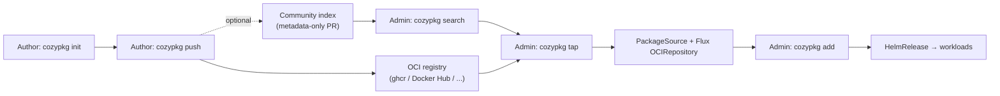

# Community Package Index and `cozypkg` authoring workflow

- **Title:** `Community Package Index and cozypkg authoring workflow (tap / init / push)`
- **Author(s):** `@kvaps, @IvanHunters`
- **Date:** `2026-05-26`
- **Status:** Draft

## Overview

Cozystack already distributes its own applications as OCI artifacts that are consumed through `PackageSource`/`Package` resources and installed with `cozypkg`. Today this machinery is wired to a single vendor-controlled source (`cozystack-packages`): there is no standard way for an external author to publish a package, no index for others to discover one, and no one-command way to make a third-party package installable in a cluster.

This proposal extends the existing packaging stack into a community ecosystem. It adds `cozypkg` subcommands to register external repositories (`tap`), scaffold a new package (`init`), and publish one (`push`), plus a lightweight community index that lists known packages for discovery. Artifacts keep living in ordinary OCI registries (ghcr, Docker Hub, etc.); the index stores metadata only. The end state is analogous to Homebrew taps, Cargo/crates.io, or Nix flakes: anyone can publish a Cozystack package over OCI, discover it, and install it the same way official packages are installed.

## Scope and related proposals

This proposal builds directly on the current `PackageSource` / `Package` / `OCIRepository` model and the existing `cozypkg add | list | del` commands. It does not change those resources; it adds tooling and conventions around them.

Deliberately out of scope and tracked separately:

- `cozyctl` — a high-level, dashboard-shaped cluster CLI (different idea discussed in the same sync).
- Declarative whole-cluster install sets (a `flake.nix`-style pinned manifest). This is already achievable through Kubernetes/GitOps and is not a packaging-index concern.
- Multi-cluster fleet distribution of packages.

## Context

Cozystack's application lifecycle is driven by two cluster-scoped CRDs:

- **`PackageSource`** references a Flux source (`OCIRepository` or `GitRepository`) that polls an external registry, and declares the variants, dependencies, libraries, and components of each application.
- **`Package`** selects a variant from a `PackageSource`, supplies per-component overrides, and triggers a `HelmRelease`.

Distribution today flows through OCI: the `cozystack-operator` creates an initial `OCIRepository` (`cozystack-platform`) from a source URL such as `oci://ghcr.io/cozystack/cozystack/cozystack-packages`; the platform chart then creates the secondary `cozystack-packages` `OCIRepository` that all official `PackageSource`s reference. `ArtifactGenerator` turns each component into an `ExternalArtifact` (an assembled Helm chart ready to install).

The `cozypkg` CLI already exists and operates on these resources: `add` (install with dependency resolution and variant selection), `list` (available `PackageSource`s and installed `Package`s), `del` (delete with reverse-dependency analysis), and `dependencies`.

The gap: every part of this is geared to official packages coming from one source the vendor controls. There is no publishing path for third parties, no discovery index, and no authoring scaffold.

### The problem

> "I wrote a useful operator/chart for Cozystack. How do I share it so other people can install it, and how do you adopt it if it's good?"

Today the answer is "there isn't a standard one." A community member who builds a module has no blessed way to publish it, no place for others to find it, and no single command to make it installable in a cluster. Conversely, maintainers cannot easily pull good community modules into the project. Ecosystem growth is bottlenecked on the absence of an authoring + discovery + install loop — exactly the loop that `npm`, Cargo, and Homebrew taps provide for their ecosystems.

## Goals

- A community member can publish a package to any OCI registry with `cozypkg push`.
- A community member can scaffold a correct package layout with `cozypkg init`.
- A cluster admin can register an external package repository with one command — `cozypkg tap <oci-ref>` — which creates a `PackageSource` (and its Flux source) pointing at the OCI artifact; its packages then appear in `cozypkg list` and install with `cozypkg add`.
- A lightweight community index lists known packages for discovery (`cozypkg search`), holding metadata only — name, OCI ref, description, maintainer, homepage.
- No new central registry service to operate: artifacts stay in existing OCI registries; the index is just metadata in a git repo and/or an OCI artifact.
- The change is purely additive: official packages keep working unchanged as the "core tap".

### Non-goals

- Running a hosted package registry or CDN.
- Vetting or curating the contents of third-party packages (see Security).
- Replacing Helm/Flux as the underlying mechanism.
- Multi-cluster fleet distribution.

## Design

### 1. A package is an OCI artifact

Reuse the existing OCI flow. A community package is the same shape `cozystack-packages` already uses: a chart/bundle pushed as an OCI artifact that a `PackageSource` can consume. No new artifact format is introduced. `cozypkg push` wraps the `helm`/`oras` push so authors do not hand-roll registry plumbing.

### 2. `tap` = registering an external `PackageSource`

`cozypkg tap oci://ghcr.io/<org>/<repo>[:tag]` creates a cluster-scoped `PackageSource` (and the underlying Flux `OCIRepository`) pointing at the external artifact. It mirrors `brew tap`: it only adds a source, nothing is installed until `cozypkg add`. `cozypkg untap <name>` removes it.

Generated resource (illustrative):

```yaml
apiVersion: cozystack.io/v1alpha1
kind: PackageSource
metadata:
  name: community.<org>.<repo>   # namespaced under "community." to avoid shadowing official sources
spec:
  source:
    kind: OCIRepository
    url: oci://ghcr.io/<org>/<repo>
    ref:
      tag: <tag>
  # variants, dependencies, components come from the artifact itself
```

Because `PackageSource` already supports `OCIRepository`/`GitRepository`, `tap` is mostly UX sugar plus naming conventions and safety: community `PackageSource`s are namespaced (e.g. a `community.` prefix) so a third-party package can never silently shadow an official package name.

### 3. Community index

A dedicated repository — e.g. `cozystack/packages-index` — holds a flat list of known packages: name, OCI ref, description, maintainer, homepage, and (optionally) expected signing identity. This is analogous to the Homebrew core formula list or a Cargo sparse index. It can be a git repo (simple PR-based curation) and/or be published as an OCI artifact so the tool can read the catalog directly without cloning.

- `cozypkg search <term>` queries the index and shows discoverable packages without tapping them first.
- `cozypkg tap <name>` can resolve a short name through the index to its OCI ref.
- Index entries are added via PRs with CODEOWNERS review. The index never stores chart bytes — only metadata — so indexing executes no code.
- Official packages remain the implicit "core tap"; community taps are additive.

### 4. Authoring workflow: `cozypkg init`

`cozypkg init <name>` scaffolds a package directory: chart skeleton, `values`, a `PackageSource` manifest skeleton with variants and `dependsOn`, and the formalized layout an author would otherwise have to reverse-engineer. This is the `kubebuilder` / `operator-sdk` / `flux init` analog for packages (scaffold, not cluster bootstrap).

### 5. `cozypkg push`

Packages the local directory and pushes it to the target OCI registry, then optionally opens or updates a PR against the index. Before publishing it validates the manifest (lint + schema check, reusing `cozyvalues-gen`/OpenAPI tooling) so broken packages do not reach a registry.

### Command summary

| Command | Status | Purpose |
| --- | --- | --- |
| `cozypkg add` | exists | Install packages with dependency resolution |
| `cozypkg list` | exists (extended) | Installed/available packages; gains an "available from index" view |
| `cozypkg del` | exists | Delete with reverse-dependency analysis |
| `cozypkg init <name>` | new | Scaffold a new package directory |
| `cozypkg push <oci-ref>` | new | Publish a package artifact to an OCI registry |
| `cozypkg tap <oci-ref\|name>` | new | Register an external repository as a `PackageSource` |
| `cozypkg untap <name>` | new | Remove a tapped repository |
| `cozypkg search <term>` | new | Discover packages via the community index |

### Flow



## User-facing changes

- New `cozypkg` subcommands: `init`, `push`, `tap`, `untap`, `search`.
- `cozypkg list` gains an "available from index" view.
- New docs: "Publishing a community package" and "Adding a community tap".
- The dashboard could later surface tapped sources and community packages; that is a follow-up, not part of this proposal.

## Upgrade and rollback compatibility

Purely additive. Existing `PackageSource`/`Package` resources are untouched, and the official "core" source keeps working. Removing a tap removes only its `PackageSource`; already-installed `Package`s are unaffected unless explicitly deleted. No migration is required. Rollback means dropping the new subcommands — cluster state is defined by the same CRDs and stays valid.

## Security

Tapping a third-party source means trusting arbitrary Helm charts that run in the management cluster. This is a real trust boundary and the proposal treats it as one:

- `tap` creates a cluster-scoped resource and therefore requires cluster-admin.
- Community `PackageSource`s are namespaced/prefixed so they cannot shadow official package names.
- The index is metadata-only; adding or reading an index entry executes no code.
- Recommend (and surface) cosign signature verification — Flux `OCIRepository` supports artifact verification; index entries can carry the expected signing identity, and `cozypkg search`/`tap` can display and optionally enforce it.
- Community packages are unvetted by default; docs must say so plainly. An opt-in `verified` flag in index entries is a possible later curation step.

## Failure and edge cases

- Tap of an unreachable/invalid OCI ref → the `PackageSource` reports `NotReady`; `cozypkg tap` surfaces the Flux error and does not leave a half-created source.
- Name collision with an official package → namespacing prevents shadowing; `cozypkg` warns.
- Index entry points to a moved/deleted artifact → `search` still lists it, `tap` fails cleanly with the registry error.
- Duplicate `tap` → idempotent; updates the existing source instead of erroring.
- `untap` while packages from that source are installed → warn and require confirmation, reusing the reverse-dependency analysis from `cozypkg del`.

## Testing

- **Unit:** `tap`/`untap` generate the correct `PackageSource` YAML; `init` scaffold output matches the expected layout; `push` manifest validation rejects malformed packages.
- **Integration:** in an e2e cluster, tap a test OCI repo, `cozypkg add` a package from it, assert the `HelmRelease` becomes `Ready`, then `untap` and assert cleanup.
- **e2e:** the full author → `push` → `tap` → `add` loop against a local registry.

## Rollout

1. **Phase 1:** `cozypkg tap`/`untap` + docs. Lowest risk — it leans entirely on the existing `PackageSource` machinery.
2. **Phase 2:** `cozypkg init` scaffold + `cozypkg push` + a publishing guide.
3. **Phase 3:** the `packages-index` repository + `cozypkg search`; seed it with a few example packages (e.g. `external-apps-example`).
4. **Phase 4 (optional):** dashboard surfacing, signature-verification UX, and a `verified` curation tier.

## Open questions

- Index as a git repo, an OCI artifact, or both? The sync leaned toward OCI so the tool can read the catalog directly; git is simpler for PR-based curation. Both may coexist.
- Exact namespacing scheme for community `PackageSource`s to guarantee no collisions (prefix by org? by tap name? by index entry name?).
- Is signature verification required for index inclusion, or only recommended?
- Where should the OCI `push` logic live relative to `cozyhr` (the former `cozypkg`, now a Helm/Flux wrapper)?

## Alternatives considered

- **Central hosted registry (crates.io-style).** Rejected: operational burden and CDN cost, and a single point of control contradicts the community goal. The sync explicitly steered away from "making our own registry". OCI + a metadata index keeps hosting decentralized in registries authors already use.
- **Git-based taps (Homebrew-style git tap).** Viable, but the sync preferred OCI so the tool can read the artifact/catalog directly without clone/pull/push churn. OCI also lets authors reuse any container registry they already have.
- **Imperative install only (no index).** Rejected as insufficient: without discovery there is no ecosystem growth, which is the whole point.
- **Declarative whole-cluster manifest (`flake.nix`-style pinning) as the primary interface.** Deferred: already achievable via Kubernetes/GitOps, and orthogonal to a packaging index.

---

<!--
Inspired by KubeVirt enhancement proposals
(https://github.com/kubevirt/enhancements) and Kubernetes Enhancement
Proposals (KEPs).
-->
