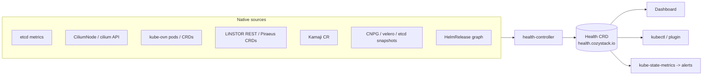

# Cluster and component health reporting API

- **Title:** `Unified health reporting for core components, nodes, and backups via a native CRD`
- **Author(s):** `@IvanHunters`
- **Date:** `2026-08-21`
- **Status:** Draft

## Overview

Cozystack ships a rich set of core components (Cilium, kube-ovn, LINSTOR/DRBD, etcd, Kamaji, CNPG, cert-manager, backups), but their health is scattered across HelmRelease conditions, pod readiness, per-component CRDs, component REST APIs, and Prometheus metrics. When something breaks, an operator has to know six different places to look and then correlate across them by hand.

This proposal introduces a **health-reporting controller** that periodically collects health from each component's native source and materializes it into a **namespace-scoped `Health` CRD** (`health.cozystack.io`). The result is a single, `kubectl`-native, per-node and per-tenant view of "what is broken and where" that the dashboard, `kubectl`, and the alerting stack all read from the same place.

Scope is deliberately narrow: report **facts** ("linstor: pvc-x Inconsistent on node cp1", "backup keycloak-db: last success 3d ago, SLA 24h"), not automated cross-layer root-cause analysis, and not time-series (that stays in Grafana).

## Scope and related proposals

- Complements the existing metrics stack (VictoriaMetrics + Grafana). This is not a replacement: metrics answer "how did it trend", this answers "what is broken right now".
- Backups reporting overlaps with any future backup-policy proposal; this proposal only *reports* backup freshness, it does not manage backup schedules.
- Per-tenant scoping aligns with the tenant model used elsewhere (Kamaji tenant control planes, per-namespace resources).

## Decisions

<!-- Filled in as implementation proceeds; records live under this
proposal's decisions/ directory, numbered from 0001, linked newest first.
Empty while the proposal is still intent. -->

## Context

Today, to assess cluster health an operator combines:

- `kubectl get hr -A` — HelmRelease readiness and `dependsOn` chains
- `kubectl get pods -A` / CRD conditions — `CiliumNode`, LINSTOR `LinstorSatellite`, CNPG `Cluster`
- component APIs — `linstor node list` / `resource list --faulty`, `cilium status`, `kubectl ko diagnose`
- Prometheus metrics — `etcd_disk_wal_fsync_duration_seconds`, DRBD state, `cilium_*`
- Talos API — for management etcd, which is a static pod outside the Kubernetes API

There is no single object that says "component X is degraded on node Y because Z".

### The problem

A real incident that motivated this proposal (paraphrased operator experience on a 3-node cluster):

- Platform stuck at 9/98 HelmReleases ready. Root cause: `kube-ovn` HelmRelease stuck in upgrade because ~30 orphaned `ovs-ovn` pods on one node blocked the DaemonSet rollout. Finding this meant reading HR conditions, then the DS, then per-node pods.
- Dashboard returned 503. Root cause chain: one control-plane node's etcd fell behind (slow disk) → node NotReady → `postgres-operator` pod stranded on it → CNPG failover never happened → `keycloak-db-rw` endpoint empty → Keycloak down → dashboard OIDC 503. Five layers, correlated by hand.
- `kubectl logs`/`exec` hung for pods on two of three nodes. Root cause: one node registered with a public nodeIP while others used internal IPs; Cilium host-firewall then dropped cross-node traffic to kubelet `:10250`.

None of these were visible in one place. Every diagnosis was a manual walk across component boundaries. An operator staring at a single health page would have seen "kube-ovn: degraded on cp3 (ovs-ovn not ready)", "etcd: cp1 fsync p99 6s", "backups: keycloak-db stale" immediately.

## Goals

- A single namespace-scoped CRD `Health` (`health.cozystack.io`) reporting per-component health, refreshed by a controller.
- Per-node breakdown in `status` (most real problems are node-local).
- Two scopes via namespaces: infra/management health in `cozy-system`, tenant health per tenant namespace.
- Native `kubectl` access: `get` / `describe` / `-w` / `-o yaml` / `printerColumns` / `shortNames`, no client code required.
- Backup freshness reporting (CNPG, etcd snapshots, and any velero-style backups) as a first-class component.
- A stable machine-readable shape the dashboard and `kube-state-metrics`-based alerts both consume.

### Non-goals

- **No automated cross-layer root-cause correlation.** Reporting states facts; it does not infer "A caused B" across components. A bounded set of rule-based hints may be added later, out of scope here.
- **No time-series / graphs.** Trends stay in Grafana. This CRD holds only current actionable state.
- **No remediation.** Read-only reporting; it never restarts, deletes, or reconfigures anything.
- Not a replacement for component-native tooling (`linstor`, `cilium status`, `kubectl ko`).

## Design

### Data model

A namespace-scoped CRD, one object per component per scope:

```yaml
apiVersion: health.cozystack.io/v1alpha1
kind: Health
metadata:
  name: etcd            # component name
  namespace: cozy-system  # scope: cozy-system = infra; tenant-* = that tenant
spec:
  component: etcd
  sla: {}               # optional per-component thresholds (e.g. backup maxAge)
status:
  overall: Degraded     # Healthy | Degraded | Down | Unknown
  observedAt: "2026-08-21T18:16:00Z"
  nodes:
    cp1: Degraded
    cp2: Healthy
    cp3: Healthy
  conditions:
    - type: FsyncLatency
      status: "False"
      node: cp1
      reason: SlowDisk
      message: "wal fsync p99 6.2s (>1s)"
      lastTransitionTime: "2026-08-21T18:10:00Z"
    - type: QuorumHealthy
      status: "True"
      message: "3/3 voting members"
```

- **Namespace = scope.** `cozy-system/etcd` is the Talos management etcd; `tenant-foo/etcd` is that tenant's Kamaji-managed etcd. `kubectl get health.cozystack.io -A` shows everything; `-n tenant-foo` shows one tenant. RBAC per namespace comes for free (a tenant sees only its own).
- **`status.nodes`** gives the per-node rollup; **`status.conditions`** carry specific problems, each optionally pinned to a node.
- `overall` is a simple rollup the dashboard and alerts key off.

### Controller

A dedicated `health-controller` Deployment (separate from `cozystack-api`), with its own reconcile loop:

- Polls each component's native source on an interval, with caching and retry. **Health is never collected in request-time** — the dashboard and `kubectl` read the materialized CRD, so a slow component (e.g. a stalled LINSTOR controller) never blocks the health view. This is deliberate: request-time fan-out to three components is exactly the failure mode that produced cascading timeouts in the motivating incident.
- Per-component **adapters** encapsulate "where does this component keep its truth":
  - **etcd (management)** — Prometheus metrics (`etcd_*`); it is a Talos static pod outside the k8s API.
  - **Cilium** — `CiliumNode` CRD, agent readiness, health API, `cilium_*` metrics.
  - **kube-ovn** — DaemonSet/pod state, `ovn-central` quorum, kube-ovn CRDs.
  - **LINSTOR** — controller REST API and/or Piraeus `LinstorCluster`/`LinstorSatellite` conditions (`resource --faulty`).
  - **Kamaji tenant control plane** — Kamaji CR + pods in the tenant namespace.
  - **Backups** — CNPG `Backup`/`ScheduledBackup` status, etcd snapshot age, velero-style backups; compared against SLA to flag `Stale`/`Failed`.
  - **Platform** — HelmRelease graph: report the first not-ready node in the `dependsOn` chain (the root), not the whole cascade.
- Adapters are versioned with the components they read (component CRD/output shapes drift between versions). A broken adapter degrades one `Health` object to `Unknown`; it never takes down `cozystack-api` or the dashboard (isolated blast radius, independent release cadence).

### Isolation rationale

The controller is a separate component, not an extension of `cozystack-api`, because: (1) different domain (read-only polling of external sources vs resource CRUD), (2) blast radius (a failing adapter must not break the core API), (3) independent release cycle for per-version adapters.



## User-facing changes

Native `kubectl`, no client code:

```
kubectl get health.cozystack.io -A            # everything, infra + all tenants
kubectl get health.cozystack.io -n cozy-system
kubectl get health.cozystack.io etcd -n cozy-system
kubectl describe health.cozystack.io etcd -n cozy-system
```

With `additionalPrinterColumns` and `shortNames: [chz]`:

```
$ kubectl get chz -n cozy-system
NAME       OVERALL    DEGRADED-NODES   ISSUES   AGE
cilium     Degraded   cp3              1        40d
kube-ovn   Healthy                     0        40d
linstor    Degraded   cp1              2        40d
etcd       Degraded   cp1              1        40d
backups    Degraded                    1        40d
```

- **Dashboard**: a single "Cluster health" page listing components by scope, each with overall status and the specific problems (with a per-node breakdown and a "details" link into Grafana/the resource). Backups are a first-class row (last successful backup vs SLA per CNPG cluster / etcd). The page is empty/green when healthy — an inbox of problems, not a metrics wall.
- **Optional `kubectl-cozystack` plugin**: `kubectl cozystack health [component]` for a tree/root-first terminal view. Thin sugar reading the same CRD.
- **Alerts**: `kube-state-metrics` custom-resource metrics over `status.conditions` → default `VMRule`s for known failure modes (etcd fsync latency, DRBD not UpToDate, cilium agent down, stale backups).

## Upgrade and rollback compatibility

- Purely additive: a new CRD and a new controller Deployment. No existing CRD, manifest, or API changes.
- No migration. Existing clusters gain the `Health` objects once the controller runs.
- Rollback: remove the controller and CRD; nothing else depends on them. Read-only, so removal cannot corrupt state.

## Security

- Controller is **read-only** against component sources and only writes its own `Health` CRD. It never mutates managed resources.
- RBAC: needs read access across component CRDs/metrics and write on `health.cozystack.io`. Namespace-scoped `Health` means tenants can be granted read on only their own namespace — no infra health leaks to tenants.
- No new tenant-supplied inputs, no new secrets. Adapters that call component REST APIs (e.g. LINSTOR) reuse existing in-cluster credentials.

## Failure and edge cases

- **Source unavailable** (slow/stalled LINSTOR, metrics gap): the component's `Health` goes `Unknown` with `observedAt` stale, not a false `Healthy`. The dashboard shows "stale/unknown", never silent green.
- **Adapter breaks on a new component version**: degrades that one object to `Unknown`; other components and the core API are unaffected.
- **Management etcd**: reachable only via metrics/Talos, not the k8s API — the adapter must not assume a pod exists.
- **Node churn** (reboot, reset): per-node entries reflect current membership; stale nodes are pruned on reconcile.

## Testing

- Unit: each adapter against recorded fixtures of its source (CRD samples, metric snapshots, REST payloads), asserting the produced `conditions`.
- Integration: spin a kind/dev cluster, inject known-bad states (faulty DRBD resource, cordoned node, expired backup), assert `Health` objects report them.
- e2e/manual: reproduce a subset of the motivating incident (stalled kube-ovn DS, stale backup) and confirm the health page/`kubectl` surfaces the root fact.

## Rollout

- Phase 1: CRD + controller + adapters for the highest-value set (platform HR graph, etcd, LINSTOR, cilium, kube-ovn, backups). `kubectl`-native only.
- Phase 2: dashboard "Cluster health" page consuming the CRD.
- Phase 3: default `VMRule`s via kube-state-metrics; optional `kubectl-cozystack health` plugin.
- Phase 4 (optional, separate proposal): bounded rule-based root-cause hints for known failure chains.

## Open questions

- CRD kind/name: `Health` (object-per-component) vs a single aggregate object per scope. Object-per-component gives cleaner `kubectl get`, per-object RBAC, and smaller writes; the aggregate gives one-shot reads. Leaning object-per-component.
- Reconcile interval and staleness threshold defaults per component.
- Should backup SLA thresholds live in this CRD's `spec` or be sourced from the backup policy owner?
- Whether the HelmRelease "root of cascade" logic belongs in this controller or a separate platform-status adapter.

## Alternatives considered

- **Extend `cozystack-api` to serve health directly.** Rejected: couples release cycles, request-time fan-out to components reintroduces cascading-timeout failures, and a failing adapter would take down the core API. A dedicated controller isolates all three.
- **A standalone REST health service.** Rejected as the primary interface: not reachable via `kubectl`, needs its own auth/RBAC/ingress, and duplicates what a CRD gives natively. A thin read-only REST facade over the CRD remains possible later for consumers outside the k8s API (external status page).
- **Dashboards/alerts in Grafana only.** Rejected as sufficient: Grafana answers "how did it trend", not "what is broken right now"; backup freshness and dependency-cascade roots render poorly as time-series; and there is no `kubectl`-native surface.
- **Parse component logs.** Rejected: brittle across versions. Adapters read structured sources (CRDs, APIs, metrics) only.
