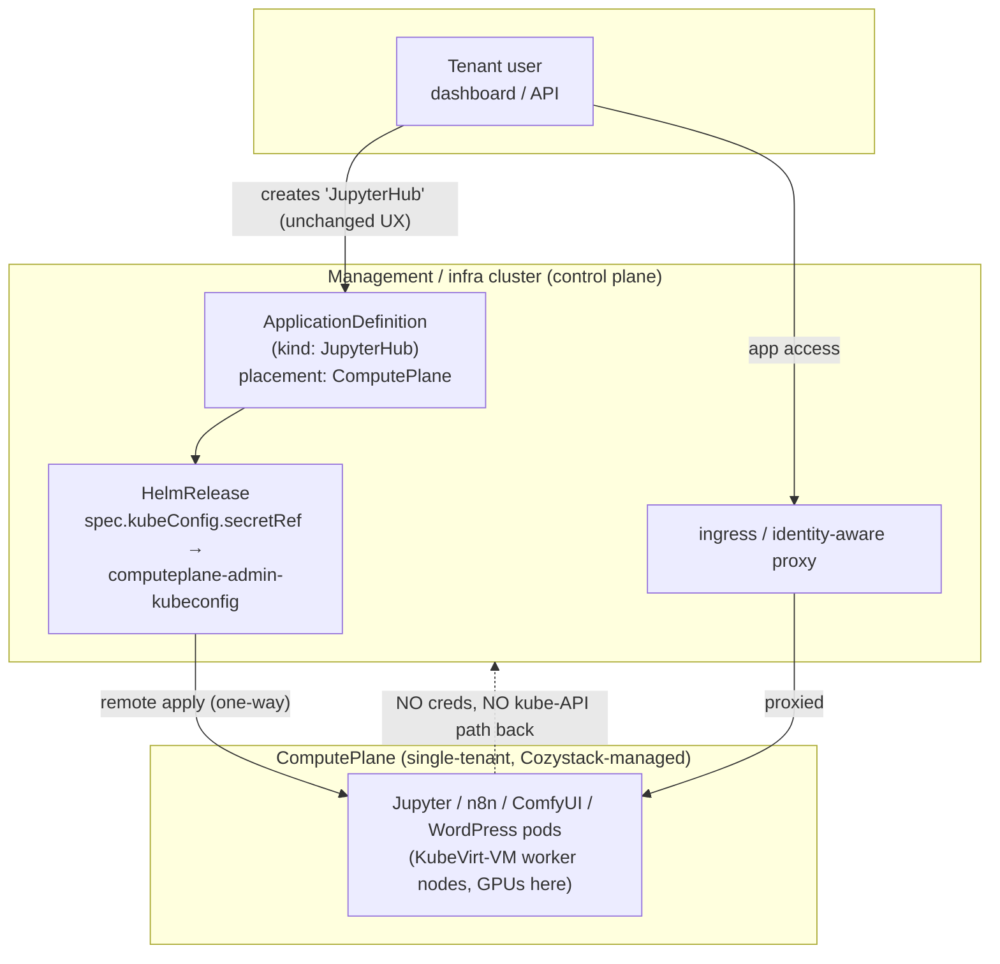

<!-- Place this file at design-proposals/compute-plane/README.md -->
# ComputePlane: a managed, isolated environment for running code-executing apps

- **Title:** `ComputePlane: a managed, isolated environment for running code-executing apps`
- **Author(s):** `@kvaps`
- **Date:** `2026-06-23`
- **Status:** Draft

## Overview

Cozystack's tenant model treats a managed application as a single-purpose service: a tenant can *use* a managed Postgres, but cannot turn it into a primitive for running arbitrary binaries that could escalate toward the management/infra cluster. That "you can't run an arbitrary binary inside your managed Postgres" property is a load-bearing part of the security model — managed services are a barrier the tenant cannot cross.

A growing class of applications breaks that property by design: their core feature *is* arbitrary code execution (notebooks, workflow "code" nodes, plugin systems, custom Python components). An operator who wants to *offer* these from the catalog has, today, only one delivery path — deploy them as ordinary pods into the tenant namespace **on the shared management cluster**, where they run on the management nodes' shared host kernel. For code-executing apps that is the unsafe part: a kernel-level container escape — the recurring vulnerability class, e.g. Copy Fail (CVE-2026-31431) — turns the app's untrusted user code into root on a management node and across every co-located tenant. Cloud platforms answer this by running untrusted compute behind a virtualization boundary (the reason Kata, gVisor and sandboxed runtimes exist); Cozystack already runs *tenant-owned* compute that way, on KubeVirt-VM clusters. ComputePlane brings catalog apps onto that same boundary instead of onto the shared management nodes.

This proposal introduces a **ComputePlane**: a Cozystack-managed Kubernetes cluster onto which untrusted-code workloads are placed instead of into the tenant namespace on the management cluster. The name parallels "control plane": the management cluster is the *control plane*; the **ComputePlane** is the separate, Cozystack-managed cluster where (untrusted) workloads actually run.

ComputePlane rests on two principles, and neither is a new isolation boundary it invents:

- **Separation of responsibility.** The compute cluster stays under the operator's control: the tenant never touches the management control plane and cannot block platform updates, while the operator's management never breaks the tenant's deployed workloads. This clean split — operator owns the substrate and the hardening, tenant owns their app — is what makes this a *managed service* rather than "provision your own cluster and install it yourself."
- **Defense in depth.** Untrusted code runs behind a KubeVirt-VM boundary with its own guest kernel, so a kernel-level escape like Copy Fail is contained to a disposable VM rather than the shared host kernel of a management node.

Both properties come from the managed-`kubernetes` substrate — from the management plane's view a ComputePlane and a regular managed cluster are the same object (Kamaji control plane, KubeVirt-VM workers whose `virt-launcher` pods sit in the tenant namespace under the existing egress policy, operator-held kubeconfig). ComputePlane's own contribution is **packaging**: placement routing that puts a catalog app on that cluster automatically, platform-owned safe defaults the tenant does not assemble, and an operator-retained lifecycle — delivered through the unchanged create-an-app UX, with access proxied back through the normal ingress entry point. (Whether the tenant can *see* the cluster is a separate UX default, not part of the boundary — see [Security](#security).)

The capability is generic and intended to live in Cozystack core as a reusable primitive — not as an LLM-specific feature. Any catalog of code-executing applications (the immediate driver is `cozyllm`; WordPress-with-plugins and future application-platform offerings are the same shape) consumes it through a pluggable interface.

## Scope and related proposals

- **`design-proposals/tenant-module-overrides`** (PR #4): the ComputePlane is delivered as a **Tenant module**, the same mechanism that delivers `etcd` / `monitoring` / `ingress` / `seaweedfs`. Note a deliberate divergence: existing modules today are single scalar toggles in `values.yaml`, and the ComputePlane module follows that scalar shape (see Design §2) rather than introducing a per-module `{ enabled, valuesOverride }` blob. The profile it references is defined once at the tenant/platform level — that single-source-of-truth choice is the resolution to the "two sources of truth" concern that the tenant-module-overrides proposal grapples with, not a dependency on it.
- **`design-proposals/cross-cluster-tenant-mesh`** (PR #7): establishes the trust model for Cozystack-managed clusters — one-way (host → tenant), tenants have no host-cluster API access. The ComputePlane reuses that exact directionality for the **kube-API plane**. It diverges on the **data plane**: rather than a node-to-node mesh, ComputePlane→tenant-service reachability is a narrow, per-service `CiliumNetworkPolicy` (see Design §5). The path already exists — ComputePlane nodes sit on the management Cilium network — so no mesh is required.
- **`design-proposals/kubernetes-nodes-split`** / **`kubernetes-nodes-hybrid-clusters`** (PR #8/#9): the ComputePlane is built on the existing managed-`kubernetes` app (Kamaji control plane + CAPI/KubeVirt nodes). Changes to how `kubernetes` worker nodes are provisioned apply transparently here.
- **Deferred:** per-application ComputePlanes; billing/metering of ComputePlane resource and API consumption; a tenant-facing scoped read/observability view of the ComputePlane; secret delivery of managed-service connection strings into ComputePlane workloads. (Cross-tenant *sharing* of a ComputePlane is **not** deferred — it is rejected by design; see Non-goals.) Each is called out under Open questions.

## Context

Today Cozystack already has every primitive needed *except* the glue that ties them into "deploy this app to a separate, Cozystack-managed cluster the tenant does not administer":

- **Tenants** (`packages/apps/tenant/`) are the unit of isolation: a hierarchical namespace with its own Cilium network policies, RBAC, and quotas. Cluster services are opt-in **Tenant modules** exposed as single scalar toggles in `values.yaml` — `etcd`, `monitoring`, `ingress`, `gateway`, `seaweedfs` (booleans today) — each rendered as a conditional `HelmRelease` in the tenant namespace. Module enablement is set by the **parent** tenant at child-creation time; module values flow down through a per-namespace `cozystack-values` Secret.

- **Managed Kubernetes** (`packages/apps/kubernetes/`, user-facing `kind: Kubernetes`) provisions a tenant cluster with a **Kamaji-hosted control plane** (`KamajiControlPlane`, backed by the tenant's `etcd`) and **CAPI + KubeVirt** worker nodes. `values.yaml` exposes `nodeGroups` with `minReplicas` / `maxReplicas` (autoscaling), `instanceType`, `roles`, `resources`, and `gpus` (e.g. `nvidia.com/AD102GL_L40S`). GPU node groups and the cluster-autoscaler are already supported. It also ships the cross-cluster plumbing the ComputePlane reuses: `exposeMethod: Proxied` (management ingress → tenant NodePort), a KubeVirt cloud-controller-manager (`kubevirt-cloud-provider`) that provisions `Service type: LoadBalancer` from the management cluster, and the `kubevirt-csi-driver` for persistent storage.

- **Remote Flux apply already works.** The `kubernetes` app deploys its own in-cluster addons (cert-manager, ingress-nginx, CNI, monitoring agents, …) by creating `HelmRelease` objects *on the management cluster* that carry `spec.kubeConfig.secretRef`, pointing at the freshly-provisioned cluster's admin kubeconfig. Kamaji writes that kubeconfig to a Secret named `<cluster-name>-admin-kubeconfig` (key `super-admin.svc`). This is the exact mechanism a ComputePlane needs: a management-side `HelmRelease` whose `kubeConfig` targets the ComputePlane.

- **ApplicationDefinition** (`api/v1alpha1/applicationdefinitions_types.go`, CRD in `packages/system/application-definition-crd/`) maps a user-facing `kind` to a `HelmRelease`. `spec.release.chartRef` (an `ExternalArtifact`) + `spec.release.prefix` define the chart and the release-name prefix; `spec.application.openAPISchema` validates user input; `spec.dashboard` (with `module: true`) controls UI presentation, including marking a resource as a tenant module. The aggregated `cozystack-api` apiserver (`pkg/registry/apps/application/rest.go`) serves these as `apps.cozystack.io/*` kinds and, on write, converts the resource into a `HelmRelease` via `ConvertApplicationToHelmRelease()`.

- **Network isolation** (`packages/apps/tenant/templates/networkpolicy.yaml`): per-tenant `CiliumNetworkPolicy` denies pod egress to the kube-apiserver by default. A pod reaches the API only if it carries `policy.cozystack.io/allow-to-apiserver: "true"` (and analogously `allow-to-etcd`). This is the enforcement point the isolation guarantee — and the scoped data-plane egress of Design §5 — build on.

What does **not** exist yet (grep confirms): anything named "ComputePlane", a separate-cluster placement concept on `ApplicationDefinition`, or a scoped ComputePlane→tenant-service egress policy. The pieces are present; the assembly is new.

### The problem

> "I want to offer JupyterHub (or n8n, or ComfyUI, or WordPress) from the Cozystack dashboard. Each of these runs arbitrary user code as a feature. If I deploy them into the tenant namespace on my shared infra cluster, a single container-escape CVE turns a notebook into host root and then into every tenant's secrets. Today my only safe option is to not ship them at all, or to tell users to first provision a full managed Kubernetes cluster and install the app themselves — which is neither the dashboard one-click experience nor something I can bill and operate cleanly."

The platform already isolates *tenant-owned* untrusted compute — a managed `kind: Kubernetes` or a VM runs behind the same VM boundary. What it lacks is a way to offer code-executing apps **from the catalog**, as managed services with safe defaults, without dropping them as shared-kernel pods on the management cluster. ComputePlane is that delivery path: the operator keeps control of the cluster (so the app is guaranteed to run and stay maintained), and the untrusted code sits behind the VM boundary — keeping the dashboard one-click UX intact.

## Goals

- A tenant can run an untrusted-code application through the normal dashboard/API flow, with no change to how they create it.
- The application's pods run on a Cozystack-managed cluster — the same VM-isolated substrate as any managed `kind: Kubernetes`: no kubeconfig/ServiceAccount token for and no kube-API path to the management/infra kube-apiserver, and untrusted code confined behind a per-VM guest kernel. This isolation is **inherited from the managed-cluster model, not introduced by ComputePlane**; ComputePlane's job is to route catalog apps onto it automatically instead of onto shared-kernel management nodes.
- The management cluster reconciles workloads *into* the ComputePlane (one-way remote Flux apply); the ComputePlane never receives credentials pointing back.
- The operator retains control of the cluster (the tenant gets no admin/write), so the platform owns and maintains the hardening profile — restricted PSA, egress policy, admission — the way it owns a managed Postgres config: correct by default and not the tenant's to assemble or accidentally undo. This protects the tenant's environment from the tenant's *own* app users (notebook code, LLM-generated code) and keeps the operator's managed guarantees; it is **not** a boundary against the tenant themselves, who could run the same code on an unhardened self-service cluster. Read/observability access for the tenant is a separate, allowable extension.
- A ComputePlane serves **exactly one tenant**; it is never an isolation domain shared between tenants.
- The mechanism is generic (a Cozystack-core primitive) and reusable by any code-executing app catalog through a pluggable interface, not bolted to one product.

### Non-goals

- This proposal does **not** make Kubernetes itself multi-tenant or claim container isolation is sufficient; ComputePlane places code-executing *catalog* apps on the existing VM-isolated managed-cluster substrate rather than as shared-kernel pods on the management cluster.
- It does **not** share a ComputePlane across tenants — parent or child. A ComputePlane is single-tenant **by design** (Design §2 explains why inheriting one re-creates the very escalation it prevents). Sharing the **physical node pool / capacity** across tenants is fine (infra-layer pooling); sharing a **ComputePlane** (a cluster / isolation domain) is not.
- It does **not** present invisibility, or the tamper-proof hardening, as a *platform* security boundary. Withholding tenant admin is about separation of responsibility and keeping the platform-managed hardening intact for the tenant's own benefit (protecting their environment from their app's users); it is not what keeps the management plane safe — see Security.
- It does **not** design billing/metering, nor the secret delivery of managed-service connection strings into ComputePlane workloads. Those are acknowledged as adjacent work.
- It does **not** propose gVisor / sandboxed-runtime isolation as the primary boundary (evaluated under Alternatives; considered too immature to be the trust boundary, and it does not address kernel-panic blast radius).

## Design

### 1. The ComputePlane is a managed Kubernetes cluster, owned by Cozystack rather than the tenant

Reuse the existing `kubernetes` app as the cluster substrate. A ComputePlane is a `kind: Kubernetes`-equivalent resource — a Kamaji control plane plus CAPI/KubeVirt worker node groups — provisioned and owned by Cozystack on the tenant's behalf, but **not surfaced to the tenant as a manageable `Kubernetes` resource**: the tenant gets no admin kubeconfig for it (Security → Visibility). Because the worker nodes are KubeVirt VMs (kubelet-in-a-VM), untrusted code runs behind a virtualization boundary, and a kernel panic provoked by the workload takes down a VM, not a physical node.

To keep the user-facing API unambiguous, the ComputePlane is exposed as a **distinct kind**, `kind: ComputePlane`. It is *not* the same as `kind: Kubernetes`, precisely so users do not confuse "a cluster I administer" with "the Cozystack-managed cluster my apps run on." The name mirrors "control plane" (management cluster) vs. "compute plane" (where workloads run).

GPU and autoscaling come for free: the ComputePlane's `nodeGroups` carry `gpus` and `minReplicas: 0` / `maxReplicas: N`, so the cluster sits idle (one small node for system workloads) until a GPU-hungry app is created, then the cluster-autoscaler adds GPU nodes on demand.



### 2. The ComputePlane is delivered as a Tenant module (single-string profile reference), single-tenant by design

A ComputePlane fits the existing Tenant-module logic exactly: it is a dependency a tenant's apps consume at deploy time, the same way `kubernetes` clusters consume the tenant's `etcd`/`monitoring`/`ingress`. We add a new module to the Tenant chart that mirrors how existing modules are **single scalars** — not a nested `{ enabled, valuesOverride }` object. The field is a single string naming a ComputePlane profile/class:

```yaml
# packages/apps/tenant/values.yaml (proposed)
computePlane: ""   # name of a ComputePlane profile/class; empty = disabled
```

An empty string means disabled; a non-empty value names a ComputePlane **profile/class**. The profile — node groups, GPU types, Kubernetes version, autoscaling bounds — is defined **once** at the tenant/platform level and referenced by name. There is deliberately **no per-module `valuesOverride` blob**: that would re-create the two-sources-of-truth problem (the module spec living both in the profile and inline on the tenant). Keeping the module a bare profile reference makes the profile definition the single source of truth.

When set (by the parent tenant, as with all modules today), the Tenant chart renders the ComputePlane `HelmRelease` (using the named profile) into the tenant namespace, and Cozystack records the ComputePlane's admin-kubeconfig Secret reference for use by `placement: ComputePlane` apps in that tenant.

**A ComputePlane serves exactly one tenant — there is no parent-walk and no inheritance.** A `placement: ComputePlane` app in a tenant that has its own `computePlane` set deploys into *that* ComputePlane; a tenant with no ComputePlane of its own gets the app **rejected**, not deployed onto an ancestor's ComputePlane. Inheriting a ComputePlane would put a child's untrusted code into the parent's isolation domain — the parent then stands to the child exactly as the management cluster stands to a tenant, and a container escape on the shared ComputePlane lands in the parent's compute environment. That re-creates the same cross-tenant escape one level down the tenant tree — exactly what the substrate's per-tenant isolation otherwise gives you — so it is excluded **by design** rather than blocked-for-now. (Sharing the underlying **node pool / capacity** across tenants is a separate, acceptable infra-layer optimization — comparable to many managed databases sharing instance types; sharing the **cluster / isolation domain** is not.)

### 3. `placement: ComputePlane` apps deploy *into* the ComputePlane via remote Flux apply

This is where the design leans entirely on an existing, proven mechanism. An application that must be isolated declares `placement: ComputePlane` on its `ApplicationDefinition`. When a tenant creates the app:

1. As today, the `cozystack-api` REST layer converts the resource into a `HelmRelease` on the management cluster.
2. **Unlike** a `placement: ManagementPlane` app, the generated `HelmRelease` carries `spec.kubeConfig.secretRef` pointing at the tenant's ComputePlane admin kubeconfig (the `<computeplane-name>-admin-kubeconfig` Secret, key `super-admin.svc`, written by Kamaji) — exactly the pattern the `kubernetes` app already uses for its in-cluster addons. It also sets `spec.install.createNamespace: true`, since the target namespace does not exist on a freshly provisioned ComputePlane.
3. Flux on the management cluster therefore applies the chart **into the ComputePlane**, never into the tenant namespace on the management cluster.

```yaml
# Generated HelmRelease for a placement: ComputePlane app (illustrative)
apiVersion: helm.toolkit.fluxcd.io/v2
kind: HelmRelease
metadata:
  name: jupyterhub-<instance>
  namespace: tenant-<name>      # lives on the management cluster
spec:
  chartRef:
    kind: ExternalArtifact
    name: cozystack-jupyterhub-application
    namespace: cozy-system
  kubeConfig:                   # <-- injected only when placement == ComputePlane
    secretRef:
      name: computeplane-<tenant>-admin-kubeconfig
      key: super-admin.svc
  install:
    createNamespace: true       # the target ns does not exist on a fresh ComputePlane
  values: { ... }
```

The routing decision is driven by the `placement` enum on the `ApplicationDefinition` — `ManagementPlane` (default) applies into the tenant namespace on the management cluster as today; `ComputePlane` injects the ComputePlane `kubeConfig.secretRef`. The two values name the two symmetric planes. This keeps the routing policy declarative and out of per-app charts.

### 4. Access is proxied back through the tenant's normal entry point

Workloads expose themselves on the ComputePlane via standard Ingress/Gateway, and the ComputePlane's ingress is wired back to the tenant's existing entry point so the user reaches the app at a normal hostname. Concretely this reuses the managed-`kubernetes` plumbing: the management cluster's ingress proxies to the ComputePlane's `exposeMethod: Proxied` NodePort on the KubeVirt-VM nodes (or to a `Service type: LoadBalancer` that kubevirt-ccm provisions from the management cluster). This is an **inbound data path only** — HTTP(S) app traffic crosses back through the proxy/ingress path; no reverse kube-API path is opened, and the user never receives ComputePlane credentials.

### 5. Connectivity to tenant services

The headline workloads are nearly useless in isolation — a notebook, an LLM, an n8n flow exist to reach the tenant's data ("my Jupyter notebook talks to my managed Postgres"). But the tenant's managed Postgres runs as a Service in the tenant namespace **on the management cluster**, so reaching it is a ComputePlane→management flow — the direction Security §2 otherwise restricts. The resolution is to be precise about *which* plane is restricted.

**The guarantee is "no kube-API access / no creds to escalate," not "no packets ever."** Those are different planes. A database connection (ComputePlane → `postgres-pod:5432`) is a *data-plane* flow and can be allowed while ComputePlane → kube-apiserver stays denied.

**No mesh is required.** ComputePlane worker nodes are KubeVirt VMs attached to the management cluster's Cilium pod network (`packages/apps/kubernetes/templates/cluster.yaml` → `networks: - name: default; pod: {}`), so L3 adjacency already exists and is gated by `CiliumNetworkPolicy`. Connectivity is therefore a **scoping** problem, expressed with machinery already in the platform:

- **Egress to a tenant service** is granted by a narrow, per-service `CiliumNetworkPolicy`: allow ComputePlane workloads → a specific endpoint (the tenant's Postgres Service), deny ComputePlane → kube-apiserver. This is the same shape as the existing `policy.cozystack.io/allow-to-apiserver` label policy, pointed at a data-plane endpoint instead of the API. Per-service egress is narrower by construction than a node-to-node mesh, so untrusted workloads never get broad reach into the infra network.
- **Exposing a ComputePlane workload outward** reuses what the managed `kubernetes` app already ships (Design §4): `exposeMethod: Proxied` and kubevirt-ccm `Service type: LoadBalancer`; persistent storage uses the `kubevirt-csi-driver` path.

Open: who authorizes each tenant-service endpoint and how the per-service policy is generated (a tenant-scoped allowlist vs. an explicit "expose this service to my ComputePlane" action). The remaining secret-delivery half — getting the Postgres connection string into the workload — is tracked under Open questions; the **network** half is solved by the scoped policy above, and every such opening is narrow and audited by construction.

### 6. Pluggable, core-level primitive

The ComputePlane (cluster provisioning + module wiring + remote-apply routing) belongs in **Cozystack core**. Consumers — `cozyllm`, a future WordPress catalog, the application-platform work — depend on it through the `ApplicationDefinition` `placement` enum and the module field, without re-implementing remote apply. This keeps the LLM product and any future code-executing catalog on one isolation mechanism.

## User-facing changes

- **Tenant admins (parent tenants):** a new module field `computePlane` (a string naming a profile) when creating/configuring a child tenant, alongside `etcd`/`monitoring`/`ingress`/`seaweedfs`. A non-empty value provisions the cluster.
- **Tenant users:** *no change* to how they create an app. They do not administer the ComputePlane and hold no admin credentials to it; a scoped read/observability view of their own workloads is a possible extension (Security → Visibility), but they never receive a cluster they manage.
- **App authors:** set `placement: ComputePlane` on an `ApplicationDefinition` (default is `ManagementPlane`). No per-app remote-apply plumbing.
- **CRD shape:** a new user-facing kind `ComputePlane` registered via `ApplicationDefinition`, intentionally distinct from `Kubernetes`. New `placement` enum (`ManagementPlane` | `ComputePlane`, default `ManagementPlane`) on `ApplicationDefinitionApplication`.

## Upgrade and rollback compatibility

- Additive. Existing Tenant manifests and existing apps are unaffected — the `computePlane` module field defaults to empty (disabled), and apps default to `placement: ManagementPlane`, so they keep deploying on the management cluster.
- The new `placement` enum on `ApplicationDefinition` is optional and defaults to `ManagementPlane`; older `ApplicationDefinition`s are valid unchanged.
- Disabling the ComputePlane module / reverting the feature: `placement: ComputePlane` apps stop being routed remotely. Because their workloads live *only* on the ComputePlane, removing the module must be treated like deleting a managed cluster (data on the ComputePlane is lost) — flag this clearly in the module's delete path; it is the one not-cheaply-reversible operation.
- Remote-apply via `spec.kubeConfig` is already a supported Flux feature in use by the `kubernetes` app, so no Flux/CRD upgrade is required.

## Security

ComputePlane does **not** introduce a new isolation boundary, and the design should not be read as one. From the management plane's point of view, a ComputePlane and a regular managed `kind: Kubernetes` cluster are the same object — Kamaji control plane, KubeVirt-VM workers, operator-held super-admin kubeconfig, and the tenant-namespace egress policy. Its security value is two pre-existing properties of that substrate, plus a managed-service contract on top — not a boundary it invents.

**Inherited from the managed-`kubernetes` substrate** (each verified by tests):

1. **No management credentials in the cluster.** The kubeConfig lives management-side and is never copied in — true of any managed cluster.
2. **No kube-API path to the management plane.** The existing `<tenant>-egress` `CiliumClusterwideNetworkPolicy` already selects every pod in the tenant namespace — including the KubeVirt `virt-launcher` pods that are the cluster's nodes — and denies egress to the management kube-apiserver. Narrow, per-service **data-plane** egress to specific tenant Services may still be granted (Design §5); the kube-API plane stays denied. No ComputePlane-specific policy is required.
3. **Virtualization boundary (defense in depth).** Untrusted code runs on KubeVirt-VM nodes with their own guest kernel, so a kernel-level container escape — the recurring class, e.g. Copy Fail (CVE-2026-31431), which corrupts a *shared* page cache to cross from container to host — is contained to a disposable VM instead of reaching a management node's shared host kernel. This is the reason the platform puts untrusted compute in VMs at all; ComputePlane simply ensures code-executing catalog apps land there rather than as bare pods on the management cluster.
4. **Separate identity domain.** Its own Kamaji control plane and RBAC — identical to any managed cluster.
5. **Single-tenant.** A ComputePlane serves exactly one tenant (Design §2 removes module inheritance so it cannot be shared down the tenant tree). A regular managed cluster is single-tenant too; the design work here is only to ensure the *module* does not re-introduce sharing.
6. **No new tenant-supplied input to the management plane.** Tenants still only write `apps.cozystack.io/*`; placement is decided by platform-owned `ApplicationDefinition` metadata.

**Separation of responsibility (the managed-service contract).** The compute cluster stays under operator control: the tenant never touches the management control plane and cannot block platform updates, and the operator's management never breaks the tenant's deployed workloads. The operator owns the substrate and the hardening profile, the tenant owns their app. This is what distinguishes ComputePlane from "the tenant provisions their own `kind: Kubernetes` and installs the app" — the operator can guarantee the app runs, keep it patched, and bill for it.

### What the hardening does and does not protect

The one thing a ComputePlane has that a tenant-run cluster does not is **tamper-proof hardening**: the tenant is not cluster-admin, so platform-applied PSA / network policy / admission cannot be stripped. This is **not** a platform boundary against the tenant, and the doc does not sell it as one. A tenant who actually holds a management-hijacking payload does not run it in the hardened ComputePlane — they provision a regular managed `kind: Kubernetes` (same substrate, one click, but they are admin and the hardening is absent) and run it there. The hardened venue is optional for that attacker, so it adds nothing against them; the substrate (per-VM guest kernel + the `<tenant>-egress` policy over the VM pods) is what contains arbitrary tenant code, ComputePlane or not.

The hardening's real and sufficient scope is **intra-cluster**: it protects the tenant's environment from the tenant's *own* app users — JupyterHub students, LLM-generated code, n8n flows — who are confined to whichever cluster the tenant deployed, and from the tenant's own misconfiguration. Combined with separation of responsibility, that is a genuine managed-service guarantee (safe defaults the tenant cannot accidentally undo, on a cluster the operator keeps correct), just not a multi-tenant or management-plane boundary.

### What ComputePlane actually changes

It changes **where operator-shipped code-executing catalog apps run**: from shared-kernel pods in the tenant namespace on the management cluster (today's only delivery path) to an operator-controlled VM cluster the tenant does not administer. The isolation that makes that safe is the pre-existing managed-Kubernetes + VM + tenant-egress model; ComputePlane is the routing and the managed, safe-by-default packaging that lets an operator offer such apps from the catalog without putting untrusted user code on the management nodes. There is no known exploit being patched in the management plane — this is about how the operator *delivers* code-executing catalog apps, plus defense in depth for the app's own users.

### Visibility

Tenant *visibility* of the ComputePlane is a separable UX/operability default, not a security mechanism — an opaque cluster is no safer than a visible one. Today Kamaji provisions an admin kubeconfig held by cluster-admins, so operators can debug a stuck workload; a tenant-facing **scoped read/observability** view (logs, events, `describe` of the tenant's own workloads) is a worthwhile extension so users are not operating a black box, and the security model allows it. Full opacity is a default, not a requirement.

## Failure and edge cases

- **ComputePlane not yet ready when a `placement: ComputePlane` app is created** → the generated `HelmRelease` reconciliation waits on the kubeConfig Secret; Flux surfaces a not-ready condition on the HelmRelease status, same as any dependency-ordering today.
- **ComputePlane kubeconfig Secret missing/rotated** → remote apply fails closed (no fallback to local apply on the management cluster); status reflects the error. Failing closed is the security-correct behavior.
- **App declares `placement: ComputePlane` but the tenant has no ComputePlane** → reject at admission with a clear status error. **Never climb to an ancestor's ComputePlane** — that would breach single-tenant isolation (Design §2).
- **GPU exhaustion** → cluster-autoscaler adds GPU node groups up to `maxReplicas`; beyond that the workload pends, as in any autoscaled cluster.
- **Tenant deletion** → the ComputePlane and its workloads are torn down with the tenant; the remote `HelmRelease`s must be deleted *before* the ComputePlane is deprovisioned. This ordering is enforced by a finalizer on the ComputePlane resource that blocks teardown until its remote `HelmRelease`s are cleaned up — otherwise Flux's `HelmRelease` finalizers would block indefinitely once the target API is gone.

## Testing

- **Unit:** the app→HelmRelease conversion correctly injects `spec.kubeConfig.secretRef` (and `spec.install.createNamespace`) when `placement == ComputePlane`, and omits the kubeConfig for `placement: ManagementPlane`.
- **Integration (kind, two clusters):** a HelmRelease on cluster A with a kubeConfig for cluster B applies the chart on B and nowhere on A.
- **Security assertions (e2e):** from a pod on the ComputePlane, the management kube-apiserver is unreachable (network) and unauthenticated (no token); a scoped per-service egress policy permits reaching only the allowlisted tenant Service and nothing else; no Secret in the ComputePlane contains management credentials; a workload-triggered node panic is contained to one KubeVirt VM.
- **E2E (real cluster):** create a tenant with the `computePlane` module set, create a JupyterHub app, confirm pods land on the ComputePlane, confirm the app is reachable through the tenant's ingress, confirm the tenant holds no admin kubeconfig for it; confirm a sibling/child tenant cannot deploy onto this ComputePlane.

## Rollout

1. **Phase 1 — core primitive.** Ship the ComputePlane as a managed-Kubernetes-backed Tenant module (one ComputePlane per enabling tenant, single-tenant by design), plus the `placement` routing enum in the app→HelmRelease path and the scoped per-service egress policy of Design §5.
2. **Phase 2 — first consumer (`cozyllm`).** Set `placement: ComputePlane` on the code-executing apps (JupyterHub, n8n, ComfyUI, Langflow, code-exec features of Open WebUI); keep vLLM/LiteLLM at the default `placement: ManagementPlane` (inference-only, no code execution). See the cozyllm-specific technical design.
3. **Phase 3 — extensions (deferred).** Tenant-facing scoped read/observability view of the ComputePlane; additional consumers (WordPress / application-platform); billing/metering hooks; secret delivery of managed-service connection strings into ComputePlane workloads.

## Open questions

- **Naming.** `ComputePlane` is chosen (parallels "control plane"). Alternatives considered and set aside: `Compute Dataplane`, `Isolated Compute`. The kind must stay clearly distinct from `kind: Kubernetes` to avoid user confusion.
- **Capacity sharing vs. cluster sharing.** Single-tenant *clusters* are settled (Design §2). The open optimization is sharing the underlying **node pool / capacity** across tenants' ComputePlanes (infra-layer, acceptable) — how that is modelled without ever sharing an isolation domain.
- **Placement target.** The routing mechanism (`HelmRelease` + `kubeConfig.secretRef`) is generic — `placement` could name *any* target cluster, not only a dedicated ComputePlane. Two shapes worth weighing: **(a)** let a tenant target their **own** existing managed `Kubernetes` cluster — appealing (visibility for free, no second cluster) but the tenant holds full admin there, so we cannot guarantee SLA, automate updates, or keep platform hardening tamper-proof; **(b)** a `spec.managedDataplane: true` mode on the `Kubernetes` app where Cozystack withholds the admin kubeconfig — effectively the ComputePlane as a *mode* of the managed-Kubernetes app, recovering the managed guarantees. Either way the dependencies provisioned into such a cluster (ingress-nginx, cert-manager, …) need defining. Open which to adopt; the design should not hard-code ComputePlane as the only non-management target. Framed this way, a ComputePlane is essentially `kind: Kubernetes` + `managedDataplane: true` + a hardened profile + placement routing; keeping it a distinct *user-facing* kind is a UX choice (don't conflate "a cluster I administer" with "the managed environment my apps run on"), even if the implementation is a mode of the managed-`kubernetes` app.
- **Scoped tenant observability.** What read access the tenant gets to their own ComputePlane workloads (logs/events/describe) and how it is delivered (a scoped read-only kubeconfig vs. surfacing through the dashboard) — see Security → Visibility.
- **Per-service authorization (Design §5).** Who authorizes a ComputePlane→tenant-service path and how the `CiliumNetworkPolicy` is generated.
- **Credential delivery.** How a managed Postgres (created in the tenant) delivers its connection secret into a workload running on the ComputePlane (the network reachability is handled by Design §5; this is the remaining secret-plumbing half).
- **Billing.** Metering ComputePlane resources and (for LLM apps) API/token consumption — adjacent product work, noted so the design leaves room for it.

## Alternatives considered

- **Harden containers in the tenant namespace (drop capabilities, no-privilege-escalation, restricted PSA).** Rejected as the primary boundary: hardening does not make container isolation a multi-tenancy boundary, and it breaks the very apps in scope — a heavily-restricted JupyterHub/agent loses its purpose, and many such workloads are stateful and behave badly in locked-down ephemeral sandboxes.
- **gVisor / sandboxed container runtime.** Rejected as the trust boundary for now: incomplete syscall coverage risks breaking workloads, maturity is insufficient to bet the isolation guarantee on, and it does not address the kernel-panic blast radius that VM isolation does.
- **Run each app directly in a VM via cloud-init (no Kubernetes inside).** Rejected: re-creates the lifecycle/reconcile/update machinery Kubernetes already provides ("you've just reinvented Kubernetes"); the kubelet-in-VM model gives the same VM boundary while keeping GitOps lifecycle and autoscaling.
- **Target the tenant's own managed `Kubernetes` cluster instead of a dedicated ComputePlane.** Attractive — no second cluster, and visibility comes for free — but the tenant holds full admin on their own cluster, so the platform cannot guarantee SLA, automate updates, or keep hardening tamper-proof. Captured as a placement-target option (Open questions) rather than the default; the `managedDataplane`-mode variant withholds the admin kubeconfig to recover the managed guarantees.
- **A node-to-node mesh (e.g. Kilo / the cross-cluster-tenant-mesh) for ComputePlane↔tenant connectivity.** Not needed: ComputePlane nodes already share the management Cilium pod network, so reachability is a per-service `CiliumNetworkPolicy` scoping problem (Design §5), which is also narrower than a node mesh — important precisely because the consumer here is untrusted code.
- **A single shared execution cluster for the whole install.** Considered; it concentrates GPU scheduling and reduces idle overhead, but it weakens per-tenant isolation. Rejected in favor of one single-tenant ComputePlane per enabling tenant (shared node-pool capacity remains an acceptable optimization).
- **Per-module `{ enabled, valuesOverride }` shape (à la tenant-module-overrides).** Rejected for this module: an inline override blob would duplicate the ComputePlane spec on every tenant that enables it, re-creating two sources of truth. A single-string profile reference keeps one definition.

---

<!-- Inspired by KubeVirt enhancement proposals and Kubernetes Enhancement Proposals (KEPs). -->
