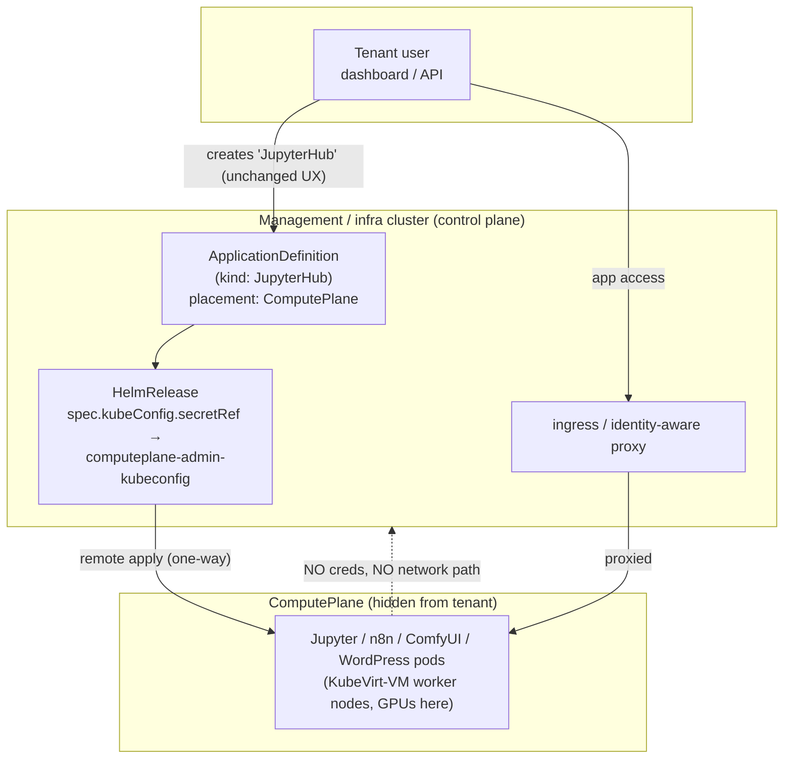

<!-- Place this file at design-proposals/compute-plane/README.md -->
# ComputePlane: isolating untrusted-code workloads on a hidden, Cozystack-managed cluster

- **Title:** `ComputePlane: isolating untrusted-code workloads on a hidden, Cozystack-managed cluster`
- **Author(s):** `@kvaps`
- **Date:** `2026-06-23`
- **Status:** Draft

## Overview

Cozystack's tenant model treats a managed application as a single-purpose service: a tenant can *use* a managed Postgres, but cannot turn it into a primitive for running arbitrary binaries that could escalate toward the management/infra cluster. That "you can't run an arbitrary binary inside your managed Postgres" property is a load-bearing part of the security model — managed services are a barrier the tenant cannot cross.

A growing class of applications breaks that property by design: their core feature *is* arbitrary code execution (notebooks, workflow "code" nodes, plugin systems, custom Python components). Co-locating such workloads with the management plane on a shared cluster is exactly the thing the platform avoids elsewhere, because container isolation alone is not a multi-tenancy boundary — a container escape becomes host root, host root becomes management-API access, and management-API access leaks every tenant's credentials.

This proposal introduces a **ComputePlane**: a Cozystack-managed Kubernetes cluster that a tenant *does not see and does not manage*, onto which untrusted-code workloads are placed instead of into the tenant namespace on the management cluster. The name parallels "control plane": the management cluster is the *control plane*; the **ComputePlane** is the separate, Cozystack-managed cluster where (untrusted) workloads actually run — invisible to, and unmanaged by, the tenant. The ComputePlane has **no credentials to** and **no network path to** the management/infra control plane; the management cluster reaches *into* it (one-way) to apply workloads via Flux, and tenant access is proxied back through the normal ingress entry point. The tenant UX is unchanged: they create an application as usual; Cozystack transparently places it on the ComputePlane.

The capability is generic and intended to live in Cozystack core as a reusable primitive — not as an LLM-specific feature. Any catalog of code-executing applications (the immediate driver is `cozyllm`; WordPress-with-plugins and future application-platform offerings are the same shape) consumes it through a pluggable interface.

## Scope and related proposals

- **`design-proposals/tenant-module-overrides`** (PR #4): the ComputePlane is delivered as a **Tenant module**, the same mechanism that delivers `etcd` / `monitoring` / `ingress` / `seaweedfs`. Note a deliberate divergence: existing modules today are single scalar toggles in `values.yaml`, and the ComputePlane module follows that scalar shape (see Design §2) rather than introducing a per-module `{ enabled, valuesOverride }` blob. The profile it references is defined once at the tenant/platform level — that single-source-of-truth choice is the resolution to the "two sources of truth" concern that the tenant-module-overrides proposal grapples with, not a dependency on it.
- **`design-proposals/cross-cluster-tenant-mesh`** (PR #7): establishes the trust model for Cozystack-managed clusters — one-way (host → tenant), tenants have no host-cluster API access. The ComputePlane reuses that exact directionality. Note the difference in intent: that proposal connects a tenant cluster *to* host services (e.g. Ceph); a ComputePlane is the inverse — it deliberately denies the workload any path back to the host.
- **`design-proposals/kubernetes-nodes-split`** / **`kubernetes-nodes-hybrid-clusters`** (PR #8/#9): the ComputePlane is built on the existing managed-`kubernetes` app (Kamaji control plane + CAPI/KubeVirt nodes). Changes to how `kubernetes` worker nodes are provisioned apply transparently here.
- **Deferred:** multi-tenant *sharing* of a single ComputePlane across child tenants; per-application ComputePlanes; billing/metering of ComputePlane resource and API consumption; automatic propagation of managed-service credentials (e.g. a managed Postgres connection string) into ComputePlane workloads. Each is called out under Open questions.

## Context

Today Cozystack already has every primitive needed *except* the glue that ties them into "deploy this app to a cluster the tenant cannot see":

- **Tenants** (`packages/apps/tenant/`) are the unit of isolation: a hierarchical namespace with its own Cilium network policies, RBAC, and quotas. Cluster services are opt-in **Tenant modules** exposed as single scalar toggles in `values.yaml` — `etcd`, `monitoring`, `ingress`, `gateway`, `seaweedfs` (booleans today) — each rendered as a conditional `HelmRelease` in the tenant namespace. Module enablement is set by the **parent** tenant at child-creation time; module values flow down through a per-namespace `cozystack-values` Secret.

- **Managed Kubernetes** (`packages/apps/kubernetes/`, user-facing `kind: Kubernetes`) provisions a tenant cluster with a **Kamaji-hosted control plane** (`KamajiControlPlane`, backed by the tenant's `etcd`) and **CAPI + KubeVirt** worker nodes. `values.yaml` exposes `nodeGroups` with `minReplicas` / `maxReplicas` (autoscaling), `instanceType`, `roles`, `resources`, and `gpus` (e.g. `nvidia.com/AD102GL_L40S`). GPU node groups and the cluster-autoscaler are already supported.

- **Remote Flux apply already works.** The `kubernetes` app deploys its own in-cluster addons (cert-manager, ingress-nginx, CNI, monitoring agents, …) by creating `HelmRelease` objects *on the management cluster* that carry `spec.kubeConfig.secretRef`, pointing at the freshly-provisioned cluster's admin kubeconfig. Kamaji writes that kubeconfig to a Secret named `<cluster-name>-admin-kubeconfig` (key `super-admin.svc`). This is the exact mechanism a ComputePlane needs: a management-side `HelmRelease` whose `kubeConfig` targets the ComputePlane.

- **ApplicationDefinition** (`api/v1alpha1/applicationdefinitions_types.go`, CRD in `packages/system/application-definition-crd/`) maps a user-facing `kind` to a `HelmRelease`. `spec.release.chartRef` (an `ExternalArtifact`) + `spec.release.prefix` define the chart and the release-name prefix; `spec.application.openAPISchema` validates user input; `spec.dashboard` (with `module: true`) controls UI presentation, including marking a resource as a tenant module. The aggregated `cozystack-api` apiserver (`pkg/registry/apps/application/rest.go`) serves these as `apps.cozystack.io/*` kinds and, on write, converts the resource into a `HelmRelease` via `ConvertApplicationToHelmRelease()`.

- **Network isolation** (`packages/apps/tenant/templates/networkpolicy.yaml`): per-tenant `CiliumNetworkPolicy` denies pod egress to the kube-apiserver by default. A pod reaches the API only if it carries `policy.cozystack.io/allow-to-apiserver: "true"` (and analogously `allow-to-etcd`). This is the enforcement point the isolation guarantee builds on.

What does **not** exist yet (grep confirms): anything named "ComputePlane", a hidden cluster, or a remote-apply placement concept on `ApplicationDefinition`. The pieces are present; the assembly is new.

### The problem

> "I want to offer JupyterHub (or n8n, or ComfyUI, or WordPress) from the Cozystack dashboard. Each of these runs arbitrary user code as a feature. If I deploy them into the tenant namespace on my shared infra cluster, a single container-escape CVE turns a notebook into host root and then into every tenant's secrets. Today my only safe option is to not ship them at all, or to tell users to first provision a full managed Kubernetes cluster and install the app themselves — which is neither the dashboard one-click experience nor something I can bill and operate cleanly."

The platform already answers this for stateful services (run Postgres as a barrier the tenant can't cross). It has no answer for "the app's *purpose* is to run the tenant's code." Cloud providers solve the general case by putting untrusted compute in VMs; Cozystack needs an equivalent boundary that fits its GitOps/operator model and keeps the dashboard UX intact.

## Goals

- A tenant can run an untrusted-code application through the normal dashboard/API flow, with no change to how they create it.
- The application's pods run on a Cozystack-managed cluster that has **no kubeconfig/ServiceAccount token for** and **no network path to** the management/infra kube-apiserver.
- The management cluster reconciles workloads *into* the ComputePlane (one-way remote Flux apply); the ComputePlane never receives credentials pointing back.
- The tenant never receives a kubeconfig or API access to the ComputePlane — they see an application, not a cluster.
- The mechanism is generic (a Cozystack-core primitive) and reusable by any code-executing app catalog through a pluggable interface, not bolted to one product.
- A first iteration is shippable with a single ComputePlane per enabling tenant, with room to generalize later without breaking the API.

### Non-goals

- This proposal does **not** make Kubernetes itself multi-tenant or claim container isolation is sufficient; the whole point is to push untrusted code off the management cluster.
- It does **not** introduce sharing a single ComputePlane across child tenants in the first iteration (architecturally left open, programmatically blocked at first).
- It does **not** design billing/metering, nor the automatic injection of managed-service credentials into ComputePlane workloads. Those are acknowledged as adjacent work.
- It does **not** propose gVisor / sandboxed-runtime isolation as the primary boundary (evaluated under Alternatives; considered too immature to be the trust boundary, and it does not address kernel-panic blast radius).

## Design

### 1. The ComputePlane is a managed Kubernetes cluster the tenant cannot see

Reuse the existing `kubernetes` app as the cluster substrate. A ComputePlane is a `kind: Kubernetes`-equivalent resource — a Kamaji control plane plus CAPI/KubeVirt worker node groups — provisioned and owned by Cozystack on the tenant's behalf, but **not surfaced to the tenant as a manageable `Kubernetes` resource**. Because the worker nodes are KubeVirt VMs (kubelet-in-a-VM), untrusted code runs behind a virtualization boundary, and a kernel panic provoked by the workload takes down a VM, not a physical node.

To keep the user-facing API unambiguous, the ComputePlane is exposed as a **distinct kind**, `kind: ComputePlane`. It is *not* the same as `kind: Kubernetes`, precisely so users do not confuse "a cluster I manage" with "the hidden cluster Cozystack runs my apps on." The name mirrors "control plane" (management cluster) vs. "compute plane" (where workloads run).

GPU and autoscaling come for free: the ComputePlane's `nodeGroups` carry `gpus` and `minReplicas: 0` / `maxReplicas: N`, so the cluster sits idle (one small node for system workloads) until a GPU-hungry app is created, then the cluster-autoscaler adds GPU nodes on demand.



### 2. The ComputePlane is delivered as a Tenant module (single-string profile reference)

A ComputePlane fits the existing Tenant-module logic exactly: it is a dependency a tenant's apps consume at deploy time, the same way `kubernetes` clusters consume the tenant's `etcd`/`monitoring`/`ingress`. We add a new module to the Tenant chart that mirrors how existing modules are **single scalars** — not a nested `{ enabled, valuesOverride }` object. The field is a single string naming a ComputePlane profile/class:

```yaml
# packages/apps/tenant/values.yaml (proposed)
computePlane: ""   # name of a ComputePlane profile/class; empty = disabled
```

An empty string means disabled; a non-empty value names a ComputePlane **profile/class**. The profile — node groups, GPU types, Kubernetes version, autoscaling bounds — is defined **once** at the tenant/platform level and referenced by name. There is deliberately **no per-module `valuesOverride` blob**: that would re-create the two-sources-of-truth problem (the module spec living both in the profile and inline on the tenant). Keeping the module a bare profile reference makes the profile definition the single source of truth.

When set (by the parent tenant, as with all modules today), the Tenant chart renders the ComputePlane `HelmRelease` (using the named profile) into the tenant namespace, and Cozystack records the ComputePlane's admin-kubeconfig Secret reference for use by untrusted-code apps in that tenant.

Reconciliation semantics mirror existing cluster services: if the current tenant has `computePlane` set, its `placement: ComputePlane` apps deploy into *its* ComputePlane; otherwise the chain walks up to the parent (the same inheritance pattern as ingress/monitoring today). **First iteration restriction:** the ComputePlane serves only the tenant that owns it (no cross-tenant reuse). This is a **programmatic block**, lifted later if needed — at which point **child** tenants (not the owning tenant's siblings) would be allowed to reuse an ancestor's ComputePlane, matching the existing service-inheritance direction.

### 3. Untrusted-code apps deploy *into* the ComputePlane via remote Flux apply

This is where the design leans entirely on an existing, proven mechanism. An application that must be isolated declares `placement: ComputePlane` on its `ApplicationDefinition`. When a tenant creates the app:

1. As today, the `cozystack-api` REST layer converts the resource into a `HelmRelease` on the management cluster.
2. **Unlike** a `placement: ManagementPlane` app, the generated `HelmRelease` carries `spec.kubeConfig.secretRef` pointing at the tenant's ComputePlane admin kubeconfig (the `<computeplane-name>-admin-kubeconfig` Secret, key `super-admin.svc`, written by Kamaji) — exactly the pattern the `kubernetes` app already uses for its in-cluster addons.
3. Flux on the management cluster therefore applies the chart **into the ComputePlane**, never into the tenant namespace on the management cluster.

```yaml
# Generated HelmRelease for a placement: ComputePlane app (illustrative)
apiVersion: helm.toolkit.fluxcd.io/v2
kind: HelmRelease
metadata:
  name: jupyterhub-<instance>
  namespace: tenant-<name>      # lives on the management cluster
spec:
  chartRef:
    kind: ExternalArtifact
    name: cozystack-jupyterhub-application
    namespace: cozy-system
  kubeConfig:                   # <-- injected only when placement == ComputePlane
    secretRef:
      name: computeplane-<tenant>-admin-kubeconfig
      key: super-admin.svc
  values: { ... }
```

The routing decision is driven by the `placement` enum on the `ApplicationDefinition` — `ManagementPlane` (default) applies into the tenant namespace on the management cluster as today; `ComputePlane` injects the ComputePlane `kubeConfig.secretRef`. The two values name the two symmetric planes. This keeps the routing policy declarative and out of per-app charts.

### 4. Access is proxied back through the tenant's normal entry point

Workloads expose themselves on the ComputePlane via standard Ingress/Gateway, and the ComputePlane's ingress is wired back to the tenant's existing entry point so the user reaches the app at a normal hostname. The user never receives ComputePlane credentials; only HTTP(S) app traffic crosses back, through the proxy/ingress path — not the kube-API path.

### 5. Pluggable, core-level primitive

The ComputePlane (cluster provisioning + module wiring + remote-apply routing) belongs in **Cozystack core**. Consumers — `cozyllm`, a future WordPress catalog, the application-platform work — depend on it through the `ApplicationDefinition` `placement` enum and the module field, without re-implementing remote apply. This keeps the LLM product and any future code-executing catalog on one isolation mechanism.

## User-facing changes

- **Tenant admins (parent tenants):** a new module field `computePlane` (a string naming a profile) when creating/configuring a child tenant, alongside `etcd`/`monitoring`/`ingress`/`seaweedfs`. A non-empty value provisions the hidden cluster.
- **Tenant users:** *no change*. They create an untrusted-code application from the dashboard exactly as any other app. They do not see, and cannot address, the ComputePlane — there is no `Kubernetes` resource for it in their view, no kubeconfig, no API endpoint.
- **App authors:** set `placement: ComputePlane` on an `ApplicationDefinition` (default is `ManagementPlane`). No per-app remote-apply plumbing.
- **CRD shape:** a new user-facing kind `ComputePlane` registered via `ApplicationDefinition`, intentionally distinct from `Kubernetes`. New `placement` enum (`ManagementPlane` | `ComputePlane`, default `ManagementPlane`) on `ApplicationDefinitionApplication`.

## Upgrade and rollback compatibility

- Additive. Existing Tenant manifests and existing apps are unaffected — the `computePlane` module field defaults to empty (disabled), and apps default to `placement: ManagementPlane`, so they keep deploying on the management cluster.
- The new `placement` enum on `ApplicationDefinition` is optional and defaults to `ManagementPlane`; older `ApplicationDefinition`s are valid unchanged.
- Disabling the ComputePlane module / reverting the feature: `placement: ComputePlane` apps stop being routed remotely. Because their workloads live *only* on the ComputePlane, removing the module must be treated like deleting a managed cluster (data on the ComputePlane is lost) — flag this clearly in the module's delete path; it is the one not-cheaply-reversible operation.
- Remote-apply via `spec.kubeConfig` is already a supported Flux feature in use by the `kubernetes` app, so no Flux/CRD upgrade is required.

## Security

The isolation guarantees, all of which must be verified by tests:

1. **No management credentials in the ComputePlane.** ComputePlane workloads receive no ServiceAccount token, kubeconfig, or secret that authenticates to the management/infra kube-apiserver. The trust direction is one-way: management → ComputePlane only (the kubeConfig lives on the management side and is never copied into the ComputePlane).
2. **No network path to the management API.** ComputePlane pods are denied egress to the management/infra kube-apiserver. On the management side, the existing `policy.cozystack.io/allow-to-apiserver` default-deny posture already prevents tenant-namespace pods from reaching the API without an explicit opt-in label; the ComputePlane is a separate cluster whose nodes have no route to the management control plane in the first place.
3. **Virtualization boundary.** Untrusted code runs on KubeVirt-VM worker nodes (kubelet-in-VM), so a container escape lands inside a disposable VM, and a workload-induced kernel panic takes out a VM rather than a shared physical node — matching the platform's existing "untrusted compute belongs in VMs" stance.
4. **Separate identity domain.** The ComputePlane has its own control plane (Kamaji) and its own RBAC; it shares no identity with the management cluster.
5. **No new tenant-supplied input to the management plane.** Tenants still only write `apps.cozystack.io/*`; the placement routing is decided by platform-owned `ApplicationDefinition` metadata, not by tenant input.

This *strengthens* the existing model: it extends the "managed service is a barrier the tenant cannot cross" property to apps whose feature is code execution, rather than weakening it by co-locating them with the management plane. There is no known exploit being patched here — this closes a latent gap before such apps reach shared/production clusters.

## Failure and edge cases

- **ComputePlane not yet ready when a `placement: ComputePlane` app is created** → the generated `HelmRelease` reconciliation waits on the kubeConfig Secret; Flux surfaces a not-ready condition on the HelmRelease status, same as any dependency-ordering today.
- **ComputePlane kubeconfig Secret missing/rotated** → remote apply fails closed (no fallback to local apply on the management cluster); status reflects the error. Failing closed is the security-correct behavior.
- **App declares `placement: ComputePlane` but no ComputePlane module set in the tenant chain** → reject at admission / surface a clear status error rather than silently deploying locally (which would re-introduce the risk). Inheritance walk: use the nearest enabling ancestor; if none, reject.
- **GPU exhaustion** → cluster-autoscaler adds GPU node groups up to `maxReplicas`; beyond that the workload pends, as in any autoscaled cluster.
- **Tenant deletion** → ComputePlane and its workloads are torn down with the tenant; ordering must delete remote HelmReleases before deprovisioning the ComputePlane to avoid orphaned remote resources.

## Testing

- **Unit:** the app→HelmRelease conversion correctly injects `spec.kubeConfig.secretRef` when `placement == ComputePlane` and omits it for `placement: ManagementPlane`.
- **Integration (kind, two clusters):** a HelmRelease on cluster A with a kubeConfig for cluster B applies the chart on B and nowhere on A.
- **Security assertions (e2e):** from a pod on the ComputePlane, the management kube-apiserver is unreachable (network) and unauthenticated (no token); no Secret in the ComputePlane contains management credentials; a workload-triggered node panic is contained to one KubeVirt VM.
- **E2E (real cluster):** create a tenant with the `computePlane` module set, create a JupyterHub app, confirm pods land on the ComputePlane, confirm the app is reachable through the tenant's ingress, confirm the tenant has no `Kubernetes` resource and no kubeconfig for it.

## Rollout

1. **Phase 1 — core primitive.** Ship the ComputePlane as a managed-Kubernetes-backed Tenant module (single ComputePlane per enabling tenant), plus the `placement` routing enum in the app→HelmRelease path. Cross-tenant reuse programmatically blocked.
2. **Phase 2 — first consumer (`cozyllm`).** Set `placement: ComputePlane` on the code-executing apps (JupyterHub, n8n, ComfyUI, Langflow, code-exec features of Open WebUI); keep vLLM/LiteLLM at the default `placement: ManagementPlane` (inference-only, no code execution). See the cozyllm-specific technical design.
3. **Phase 3 — generalization (deferred).** Allow child tenants to reuse an ancestor's ComputePlane (lift the programmatic block); additional consumers (WordPress / application-platform); billing/metering hooks; managed-service credential propagation into ComputePlane workloads.

## Open questions

- **Naming.** `ComputePlane` is chosen (parallels "control plane"). Alternatives considered and set aside: `Compute Dataplane`, `Isolated Compute`. The kind must stay clearly distinct from `kind: Kubernetes` to avoid user confusion.
- **One ComputePlane per tenant vs one shared per install vs per-app.** First iteration: one per enabling tenant, cross-tenant reuse programmatically blocked. A single shared control plane with differentiated node types (the "managed RDS runs Postgres on instance types" analogy) is the long-term simplification; whether child tenants may reuse an ancestor's ComputePlane is left architecturally open but blocked initially.
- **Profile catalog.** Where ComputePlane profiles/classes are defined and how an admin authors/names them (platform-level list referenced by the `computePlane` string).
- **Module configurability UX.** Tenant modules today are enabled only by the *parent* at child-creation time, and a child cannot reconfigure its own modules. Modelling the ComputePlane module as a **single string that references a centrally-defined profile** is the resolution to the two-sources-of-truth concern: the module carries only a name, and the profile is the single source of truth — so there is no inline override to drift. (This deliberately does not adopt the tenant-module-overrides `{ enabled, valuesOverride }` shape.)
- **Credential propagation.** How does a managed Postgres (created in the tenant) deliver its connection secret into a workload running on the ComputePlane? Out of scope here, but the design should not preclude it.
- **Billing.** Metering ComputePlane resources and (for LLM apps) API/token consumption — adjacent product work, noted so the design leaves room for it.

## Alternatives considered

- **Harden containers in the tenant namespace (drop capabilities, no-privilege-escalation, restricted PSA).** Rejected as the primary boundary: hardening does not make container isolation a multi-tenancy boundary, and it breaks the very apps in scope — a heavily-restricted JupyterHub/agent loses its purpose, and many such workloads are stateful and behave badly in locked-down ephemeral sandboxes.
- **gVisor / sandboxed container runtime.** Rejected as the trust boundary for now: incomplete syscall coverage risks breaking workloads, maturity is insufficient to bet the isolation guarantee on, and it does not address the kernel-panic blast radius that VM isolation does.
- **Run each app directly in a VM via cloud-init (no Kubernetes inside).** Rejected: re-creates the lifecycle/reconcile/update machinery Kubernetes already provides ("you've just reinvented Kubernetes"); the kubelet-in-VM model gives the same VM boundary while keeping GitOps lifecycle and autoscaling.
- **Expose the execution cluster to the tenant as a normal managed `Kubernetes` cluster and have them install the app.** Rejected: loses the one-click dashboard UX, gives the tenant credentials we want to withhold, and conflates "a cluster I manage" with "the hidden place my app runs."
- **A single shared execution cluster for the whole install.** Considered; it concentrates GPU scheduling and reduces idle overhead, but it weakens per-tenant isolation. Deferred in favor of one ComputePlane per enabling tenant, with the shared model left open for later.
- **Per-module `{ enabled, valuesOverride }` shape (à la tenant-module-overrides).** Rejected for this module: an inline override blob would duplicate the ComputePlane spec on every tenant that enables it, re-creating two sources of truth. A single-string profile reference keeps one definition.

---

<!-- Inspired by KubeVirt enhancement proposals and Kubernetes Enhancement Proposals (KEPs). -->
