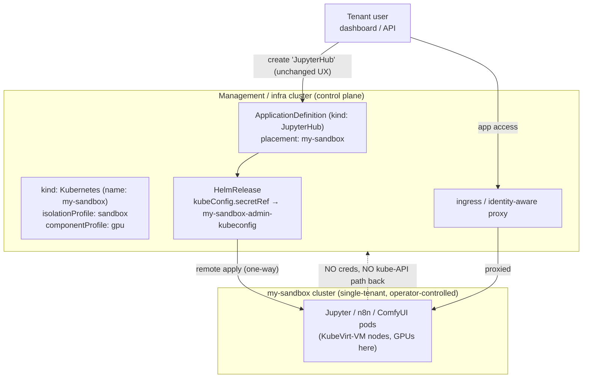

<!-- Place this file at design-proposals/compute-plane/README.md -->
# ComputePlane: a managed, isolated environment for running code-executing apps

- **Title:** `ComputePlane: a managed, isolated environment for running code-executing apps`
- **Author(s):** `@kvaps`
- **Date:** `2026-06-23`
- **Status:** Draft
- **Revision (this PR):** Per #26 (@myasnikovdaniil) and the #17 review (Timofei Larkin), ComputePlane is delivered as **composable presets on the existing `kind: Kubernetes`** — two orthogonal axes (`isolationProfile` × `componentProfile`) — **not a new top-level kind**. `placement` is generalized to target a **named cluster** (not just "ComputePlane"). A tenant-side **visibility/mutation control** in `cozystack-api` is added as the enforcement substrate for the hardened `sandbox` posture (and as a standalone intra-tenant privilege-separation feature). The mechanism settled in the merged first revision — remote Flux apply onto a Kamaji+KubeVirt cluster, untrusted code behind a per-VM kernel boundary — is unchanged; this revision is about the **user-facing surface**.

## Overview

Cozystack's tenant model treats a managed application as a single-purpose service: a tenant can *use* a managed Postgres, but cannot turn it into a primitive for running arbitrary binaries that could escalate toward the management/infra cluster. That "you can't run an arbitrary binary inside your managed Postgres" property is a load-bearing part of the security model — managed services are a barrier the tenant cannot cross.

A growing class of applications breaks that property by design: their core feature *is* arbitrary code execution (notebooks, workflow "code" nodes, plugin systems, custom Python components). An operator who wants to *offer* these from the catalog has, today, only one delivery path — deploy them as ordinary pods into the tenant namespace **on the shared management cluster**, where they run on the management nodes' shared host kernel. For code-executing apps that is the unsafe part: a kernel-level container escape — the recurring vulnerability class, e.g. Copy Fail (CVE-2026-31431) — turns the app's untrusted user code into root on a management node and across every co-located tenant. Cloud platforms answer this by running untrusted compute behind a virtualization boundary (the reason Kata, gVisor and sandboxed runtimes exist); Cozystack already runs *tenant-owned* compute that way, on KubeVirt-VM clusters. ComputePlane brings catalog apps onto that same boundary instead of onto the shared management nodes.

**ComputePlane is not a new kind.** From the management plane's view, the cluster a ComputePlane runs on and a regular managed `kind: Kubernetes` are *the same object* — Kamaji control plane, KubeVirt-VM workers whose `virt-launcher` pods sit in the tenant namespace under the existing egress policy, operator-held kubeconfig. So "ComputePlane" is a **configuration of `kind: Kubernetes`**, expressed as two orthogonal presets:

- **`isolationProfile`** — the trust/containment posture (drives credentials, hardening, network). The relevant value here is `sandbox`: the operator retains admin (the tenant gets no kubeconfig), the cluster is hardened (restricted PSA + admission), and egress to the management kube-API is denied with only scoped per-service data-plane egress allowed.
- **`componentProfile`** — what is preinstalled inside (CNI-only, the standard addon set, GPU drivers/operator, or a named app-runtime bundle), independent of the isolation posture.

A "ComputePlane" in the original sense is simply `kind: Kubernetes` with `isolationProfile: sandbox` (+ whatever `componentProfile` the app needs). The name is kept as the **product term** for "the managed, isolated environment my code-executing app runs on," but it is not a separate CRD or reconcile path.

ComputePlane rests on two principles, and neither is a new isolation boundary it invents:

- **Separation of responsibility.** The compute cluster stays under the operator's control: the tenant never touches the management control plane and cannot block platform updates, while the operator's management never breaks the tenant's deployed workloads. This clean split — operator owns the substrate and the hardening, tenant owns their app — is what makes this a *managed service* rather than "provision your own cluster and install it yourself."
- **Defense in depth.** Untrusted code runs behind a KubeVirt-VM boundary with its own guest kernel, so a kernel-level escape like Copy Fail is contained to a disposable VM rather than the shared host kernel of a management node.

Both properties come from the managed-`kubernetes` substrate; ComputePlane's own contribution is **packaging** — preset-driven safe defaults the tenant does not assemble, placement routing that puts a catalog app on such a cluster automatically, and an operator-retained lifecycle — delivered through the unchanged create-an-app UX, with access proxied back through the normal ingress entry point. (Whether the tenant can *see* the cluster is a separate UX default, not part of the boundary — see [Security](#security).)

The capability is generic and intended to live in Cozystack core as a reusable primitive — not as an LLM-specific feature. Any catalog of code-executing applications (the immediate driver is `cozyllm`; WordPress-with-plugins and future application-platform offerings are the same shape) consumes it through a pluggable interface.

## Scope and related proposals

- **#26 (@myasnikovdaniil)** and the **#17 review (Timofei Larkin)** converge on this revision's surface: don't introduce a distinct kind, deliver the posture as a preset/`managedDataplane` mode on `kind: Kubernetes`, and generalize `placement` to a named cluster. This PR folds that into the design.
- **`design-proposals/tenant-module-overrides`** (PR #4): presets are platform-defined profiles **referenced by name**, never an inline `{ enabled, valuesOverride }` blob on the tenant — the single-source-of-truth resolution to the "two sources of truth" concern.
- **`design-proposals/cross-cluster-tenant-mesh`** (PR #7): the trust model for managed clusters (one-way host → tenant, no host kube-API). It is the substrate for the **`cluster-meshed`** isolation preset (a *trusted* cluster wired into the data-plane mesh); the **`sandbox`** preset deliberately does **not** use a broad mesh — only narrow per-service egress (Design §6).
- **`design-proposals/kubernetes-nodes-split`** / **`kubernetes-nodes-hybrid-clusters`** (PR #8/#9): the substrate is the existing managed-`kubernetes` app (Kamaji + CAPI/KubeVirt); node-provisioning changes apply transparently.
- **Deferred:** billing/metering of cluster resource and API consumption; secret delivery of managed-service connection strings into sandbox workloads; the per-instance/label granularity of the visibility control (Design §8). (Cross-tenant *sharing* of a cluster is **not** deferred — it is rejected by design; see Non-goals.)

## Context

Today Cozystack already has every primitive needed *except* the glue that ties them into "deploy this catalog app onto a hardened, operator-controlled `kind: Kubernetes` the tenant does not administer":

- **Tenants** (`packages/apps/tenant/`) are the unit of isolation: a hierarchical namespace with its own Cilium network policies, RBAC, and quotas. Cluster services are opt-in **Tenant modules**; module enablement is set by the **parent** tenant at child-creation time; module values flow down through a per-namespace `cozystack-values` Secret.
- **Managed Kubernetes** (`packages/apps/kubernetes/`, `kind: Kubernetes`) provisions a tenant cluster with a **Kamaji-hosted control plane** and **CAPI + KubeVirt** worker nodes. `values.yaml` exposes `nodeGroups` (`minReplicas`/`maxReplicas` autoscaling, `instanceType`, `roles`, `resources`, `gpus`) and the addon set. It also ships the cross-cluster plumbing reused here: `exposeMethod: Proxied` (management ingress → tenant NodePort), `kubevirt-cloud-provider` (`Service type: LoadBalancer` from the management cluster), and `kubevirt-csi-driver`. **The two preset axes parameterize this app**; they are not a new component.
- **Remote Flux apply already works.** The `kubernetes` app deploys its own addons by creating `HelmRelease`s *on the management cluster* carrying `spec.kubeConfig.secretRef` → the cluster's `<name>-admin-kubeconfig` Secret (key `super-admin.svc`, written by Kamaji). This is exactly the mechanism placement routing uses to put a catalog app on a named cluster.
- **ApplicationDefinition** (`api/v1alpha1/applicationdefinitions_types.go`) maps a user-facing `kind` → a `HelmRelease` via `cozystack-api` (`pkg/registry/apps/application/rest.go`, `ConvertApplicationToHelmRelease()`). `spec.dashboard` already drives UI presentation (incl. `module: true`); the visibility control (Design §8) extends that path.
- **Network isolation** (`packages/apps/tenant/templates/networkpolicy.yaml`): the `<tenant>-egress` `CiliumClusterwideNetworkPolicy` selects every pod in the tenant namespace — including the KubeVirt `virt-launcher` node pods — and denies egress to the kube-apiserver by default. This is the enforcement point the `sandbox` posture and the scoped data-plane egress (Design §6) build on.

What does **not** exist yet: the two preset fields on `kind: Kubernetes`, a generalized `placement` field on `ApplicationDefinition`, the scoped ComputePlane→tenant-service egress policy, and the `cozystack-api` visibility/mutation control. The substrate is present; the assembly is new.

### The problem

> "I want to offer JupyterHub (or n8n, ComfyUI, WordPress) from the dashboard. Each runs arbitrary user code as a feature. Deployed as pods in the tenant namespace on the shared management cluster, one container-escape CVE turns a notebook into root on a management node and across every tenant. My only safe options today are to not ship them, or to tell users to provision a full managed cluster and install it themselves — neither is a one-click managed service."

The platform already isolates *tenant-owned* untrusted compute (a managed `kind: Kubernetes` runs behind the VM boundary). What it lacks is a way to offer code-executing apps **from the catalog**, as managed services with safe defaults, without dropping them as shared-kernel pods on the management cluster. ComputePlane — `kind: Kubernetes` + `isolationProfile: sandbox` + placement routing — is that delivery path.

## Goals

- A tenant runs an untrusted-code catalog app through the normal create-an-app flow, unchanged.
- The app's pods run on a managed cluster — the same VM-isolated substrate as any `kind: Kubernetes`: no kube-API path or credentials back to management, untrusted code behind a per-VM guest kernel. **Inherited from the managed-cluster model, not introduced here.**
- The cluster's posture and contents are selected by **two named presets**, not assembled by the tenant and not multiplied into a combinatorial set of kinds.
- The operator retains admin of the cluster (`sandbox` ⇒ no tenant kubeconfig), so platform-owned hardening cannot be stripped — protecting the tenant's environment from the tenant's *own* app users (notebook/LLM-generated code) and keeping the managed guarantee. (Not a boundary against the tenant themselves — see Security.)
- `placement` targets a **named cluster**; any number of single-tenant clusters per tenant is allowed.
- The visibility/mutation control lets the operator hide/withhold management of designated apps (and the cluster object) from a tenant's *regular* users while privileged subjects retain access — enforced at the API layer.
- Generic Cozystack-core primitive, reusable by any code-executing catalog.

### Non-goals

- Does **not** make Kubernetes multi-tenant or claim container isolation suffices; it places catalog apps on the existing VM-isolated substrate.
- Does **not** share a cluster across tenants (parent or child). Single-tenant **by design** (Design §9). Sharing the **node pool / capacity** is fine; sharing a **cluster** is not.
- Does **not** present invisibility, or the tamper-proof hardening, as a *platform* security boundary (it protects the tenant from their own app's users; it is not what keeps the management plane safe — see Security).
- Does **not** introduce a distinct top-level CRD for ComputePlane (the central change in this revision).
- Does **not** propose gVisor as the *primary* boundary (Alternatives) — though gVisor is a valid *inner* layer for ephemeral per-task sandboxes within a cluster (it sidesteps Kata nested-virt inside KubeVirt VMs), tracked as a future `componentProfile`/runtime option.

## Design

### 1. ComputePlane is `kind: Kubernetes` configured by presets — not a new kind

Reuse the `kubernetes` app as the substrate. A "ComputePlane" is `kind: Kubernetes` with `isolationProfile: sandbox` (Design §2) and a `componentProfile` (Design §3). Why a configuration rather than a new kind:

- **They are the same object.** From the management plane a hardened compute cluster and a regular managed cluster share all machinery (Kamaji, KubeVirt nodes, autoscaler, addon Flux apply). A distinct kind would be UX sugar over identical reconcile + RBAC paths. Make the variation a **field**, not a type.
- **Kinds don't compose; presets do.** "Isolation posture" and "what's preinstalled" are independent. As kinds you get a combinatorial explosion (sandbox-gpu, sandbox-minimal, meshed-gpu…); as two preset fields you get the whole matrix for free.
- **One substrate to maintain.** Every future isolation/connectivity need is a new *preset value*, not a new CRD + controller + RBAC surface.

"ComputePlane" remains a useful **product term** for "the managed isolated environment your app runs on," and may stay a distinct *dashboard presentation* so users don't conflate "a cluster I administer" with "the managed cluster my app runs on" — but the API object is `kind: Kubernetes`.



### 2. Axis 1 — isolation / trust posture (`isolationProfile`)

A field on `kind: Kubernetes` selecting where the cluster sits on the trust ↔ containment spectrum; drives credentials, hardening, and network policy. Platform-defined, referenced by name; `standard` is the default so every existing manifest stays valid.

| Preset | Tenant holds admin? | Network posture | For |
|---|---|---|---|
| `standard` (default) | yes — tenant administers | normal egress; tenant-trusted | today's behavior — clusters a tenant runs themselves |
| `sandbox` | **no — kubeconfig withheld** (`managedDataplane`) | hardened: restricted PSA + admission; **deny egress → management kube-apiserver**; scoped per-service egress only (Design §6) | the original "ComputePlane" — untrusted-code catalog apps; hardening is tamper-proof *because* the tenant can't get admin |
| `cluster-meshed` | yes — tenant-trusted | wired into the cross-cluster data plane (PR #7 mesh / `TenantMeshLink`) to reach shared/tenant services, still denied host kube-API | trusted tenant clusters that need tight coupling to tenant data |

`sandbox` vs `cluster-meshed` is exactly the distinction the #17 review (#4 thread) drew: a **broad** node-to-node mesh is fine for a *trusted* cluster, but untrusted sandbox code needs **narrow** per-service egress — never a wide mesh. Encoding it as two presets makes the connectivity contract explicit. `sandbox` implies `managedDataplane: true` (operator withholds the admin kubeconfig) — that withholding is what makes the hardening tamper-proof.

### 3. Axis 2 — component bundle (`componentProfile`)

A second, orthogonal field selecting what is preinstalled, independent of trust posture (the `kubernetes` app already deploys an addon set via remote Flux apply — a bundle preset parameterizes that set):

- `minimal` — CNI only
- `standard-addons` — current default (ingress-nginx, cert-manager, monitoring agents, autoscaler)
- `gpu` — adds GPU node groups + operator/drivers
- named app-runtime bundles — e.g. a notebook/code-exec stack

The matrix is free: `isolationProfile: sandbox` + `componentProfile: gpu` is a hardened GPU cluster for notebooks; `isolationProfile: standard` + `componentProfile: gpu` is a tenant-run GPU cluster — same substrate, two field values. Bundles are platform-level profiles referenced by name (single source of truth, per #4), never inlined on the tenant.

### 4. `placement` routes a catalog app onto a named cluster

`ApplicationDefinition` gains `placement` = `ManagementPlane` (default) | `<cluster name>`. `ManagementPlane` deploys into the tenant namespace on the management cluster, as today. A cluster name routes the generated `HelmRelease` onto that `kind: Kubernetes` cluster (typically one with `isolationProfile: sandbox`). The mechanism is generic — nothing ties it to a special hidden cluster; it can target any of the tenant's named clusters, which also gives the tenant-owned-cluster option (#17 review point 2) for free.

### 5. The app deploys *into* the target cluster via remote Flux apply

When a tenant creates a `placement: <cluster>` app:

1. `cozystack-api` converts it to a `HelmRelease` on the management cluster, as today.
2. **Unlike** a `ManagementPlane` app, the generated `HelmRelease` carries `spec.kubeConfig.secretRef` → the target cluster's `<cluster>-admin-kubeconfig` Secret (key `super-admin.svc`, written by Kamaji) and `spec.install.createNamespace: true`.
3. Flux applies the chart **into the target cluster**, never into the tenant namespace on management.

```yaml
# Generated HelmRelease for a placement: <cluster> app (illustrative)
spec:
  chartRef: { kind: ExternalArtifact, name: cozystack-jupyterhub-application, namespace: cozy-system }
  kubeConfig:                       # <-- injected when placement != ManagementPlane
    secretRef: { name: <cluster>-admin-kubeconfig, key: super-admin.svc }
  install: { createNamespace: true }
  values: { ... }
```

This is exactly what the merged first revision implemented; the only change is that the secret name derives from the **placement cluster name** rather than the fixed `computeplane-`.

### 6. Connectivity to tenant services (the `sandbox` data-plane contract)

A notebook/LLM/n8n flow is useless without the tenant's data ("my Jupyter → my managed Postgres"), but that Postgres runs in the tenant namespace **on the management cluster** — a target→management flow the `sandbox` posture otherwise restricts. The resolution: be precise about *which* plane is restricted. **The guarantee is "no kube-API access / no creds to escalate," not "no packets ever."**

No mesh is required for `sandbox`: the cluster's KubeVirt-VM node pods sit on the management Cilium pod network, so reachability is a **scoped per-service `CiliumNetworkPolicy`** — allow → the tenant's Postgres Service, deny → kube-apiserver (same shape as the existing `policy.cozystack.io/allow-to-apiserver` label). Per-service egress is narrower-by-construction than a node mesh, which matters because the consumer is untrusted code. (The `cluster-meshed` posture, for *trusted* clusters, is where the PR #7 broad mesh applies instead.) Exposing a workload outward reuses `exposeMethod: Proxied` / kubevirt-ccm (Design §7).

### 7. Access is proxied back through the tenant's normal entry point

Workloads expose themselves via Ingress/Gateway on the target cluster; the management ingress proxies to the cluster's `exposeMethod: Proxied` NodePort (or a kubevirt-ccm `Service type: LoadBalancer`). Inbound data path only — no reverse kube-API path, and the tenant never receives cluster credentials.

### 8. Tenant-side visibility / mutation control (`cozystack-api` extension)

The #17 review's "withhold admin/write, allow scoped read" deserves first-class treatment: it is both a general tenant feature **and** the enforcement substrate for `isolationProfile: sandbox`. Let managed apps (and the cluster object) be marked so a tenant's *regular* users cannot see or manage them while *privileged* subjects (tenant-admin / parent-tenant operator / superadmin) still can. Two separable controls:

- **Visibility** — whether the object appears in `kubectl get` / the dashboard for a subject.
- **Mutation** — whether a subject may create/update/delete it.

**Enforced in the aggregated `cozystack-api` apiserver** (`pkg/registry/apps/application/rest.go`), which already serves `apps.cozystack.io/*` and converts them to HelmReleases — **not UI-only** (a dashboard filter is bypassable by anyone holding a kubeconfig). Granularity:

- Per-**kind** ("regular users can't touch `Jupyter`") → plain Kubernetes RBAC (a tenant Role omitting the verbs).
- Per-**instance** / **label-driven** → cannot ride vanilla RBAC (`list`/`watch` can't filter by name/label); needs `cozystack-api` to filter responses by caller identity. Feasible since Cozystack owns the apiserver, but it is apiserver work, not a Role manifest. **(Deferred to a later iteration; v1 ships per-kind only.)**

Shape (early, names TBD): an annotation/field on `ApplicationDefinition` (likely extending `spec.dashboard`, which already drives presentation / `module: true`) marking an app restricted, plus a tenant-role tier (`regular` vs `privileged`) checked before listing/mutating. How it composes: for `sandbox` it is the mechanism behind "withhold the admin kubeconfig + hide the cluster CR from regular users" (note: hiding the app CR ≠ withholding the kubeconfig secret — different objects; sandbox needs both). Standalone, it is intra-tenant privilege separation (a parent/operator deploys sensitive apps into a child namespace the child's regular users shouldn't see or break).

### 9. Single-tenant by design; N clusters per tenant

Each `kind: Kubernetes` is already a single tenant's cluster, and presets don't change that. Because placement targets a *named* cluster, a tenant may have **any number** of sandbox clusters (the merged first revision's single-string `computePlane:` module capped it at one — that cap is dropped). There is **no module inheritance / parent-walk**: a `placement: <cluster>` app whose tenant has no such cluster is **rejected**, never routed onto an ancestor's cluster — inheriting one would put a child's untrusted code into the parent's isolation domain, re-creating the cross-tenant escape one level down. Sharing the underlying **node pool / capacity** across tenants stays fine; sharing a **cluster** does not.

### 10. Pluggable, core-level primitive

The presets, placement routing, and the visibility control live in **Cozystack core**. Consumers (`cozyllm`, a future WordPress catalog, the application-platform work) depend on them through the `placement` field and the `kind: Kubernetes` presets — no re-implementation.

## User-facing changes

- **App authors:** set `placement: <cluster>` on an `ApplicationDefinition` (default `ManagementPlane`). Optionally mark an app restricted (Design §8).
- **Tenant admins:** create a `kind: Kubernetes` with `isolationProfile: sandbox` + a `componentProfile` to get a ComputePlane; reference it from a child tenant the same way other modules are referenced. No new top-level kind to learn.
- **Tenant users:** *no change* to creating an app; they don't administer the sandbox cluster and (for restricted apps) may not see it.
- **API shape:** new `placement` field on `ApplicationDefinition`; new `isolationProfile` + `componentProfile` fields on `kind: Kubernetes`; a restricted-app marker + tenant-role tier consumed by `cozystack-api`. **No new CRD.**

## Upgrade and rollback compatibility

- Additive and backward-compatible. `placement` defaults to `ManagementPlane`; `isolationProfile` defaults to `standard`; `componentProfile` defaults to today's addon set — so every existing `ApplicationDefinition`, `Tenant`, and `Kubernetes` manifest is valid unchanged.
- Remote-apply via `spec.kubeConfig` is already a supported Flux feature, so no Flux/CRD upgrade is required.
- Removing a sandbox cluster is deleting a managed cluster (its data is lost) — the not-cheaply-reversible operation; gate it accordingly.

## Security

ComputePlane does **not** introduce a new isolation boundary. From the management plane, the cluster it runs on and a regular managed `kind: Kubernetes` are the same object. Its security value is two pre-existing substrate properties plus a managed-service contract — not a boundary it invents.

**Inherited from the managed-`kubernetes` substrate** (each verified by tests): (1) no management credentials in the cluster (the kubeConfig lives management-side); (2) no kube-API path to management — the `<tenant>-egress` policy already denies the node `virt-launcher` pods egress to the kube-apiserver, while scoped per-service data-plane egress (Design §6) may be granted; (3) the **virtualization boundary** (defense in depth) — a kernel-level escape like Copy Fail (CVE-2026-31431) is contained to a disposable VM, not a management node's shared host kernel; (4) separate identity domain (own Kamaji control plane + RBAC); (5) single-tenant (Design §9); (6) no new tenant-supplied input to the management plane.

**Separation of responsibility (the managed-service contract).** The cluster stays operator-controlled: the tenant cannot block platform updates, and management never breaks the tenant's app. The operator owns the substrate and hardening; the tenant owns their app.

### What the hardening does and does not protect

The one thing a `sandbox` cluster has that a tenant-run one does not is **tamper-proof hardening** (the tenant is not cluster-admin, so PSA / network policy / admission cannot be stripped). This is **not** a platform boundary against the tenant: an attacker holding a management-hijacking payload simply provisions a `standard` cluster (same substrate, one click, but they are admin and unhardened) and runs it there — the hardened venue is optional for them. The substrate (per-VM guest kernel + `<tenant>-egress`) is what contains arbitrary tenant code regardless. The hardening's real, sufficient scope is **intra-cluster**: protecting the tenant's environment from the tenant's *own* app users (JupyterHub students, LLM-generated code, n8n flows) and from the tenant's own misconfiguration. The visibility/mutation control (Design §8) is the enforcement layer for that scope.

### Visibility

Tenant *visibility* is a separable UX/operability default, not a security mechanism — an opaque cluster is no safer than a visible one. A tenant-facing **scoped read/observability** view (logs/events/`describe` of their own workloads) is allowed and worthwhile so users aren't operating a black box; full opacity is a default, not a requirement.

## Failure and edge cases

- **Target cluster not ready when a `placement: <cluster>` app is created** → the `HelmRelease` waits on the kubeConfig Secret; Flux surfaces not-ready, as with any dependency ordering.
- **kubeconfig Secret missing/rotated** → remote apply fails closed (no fallback to local apply); the security-correct behavior.
- **`placement: <cluster>` app but the tenant has no such cluster** → reject at admission. Never climb to an ancestor's cluster (Design §9).
- **GPU exhaustion** → cluster-autoscaler adds GPU nodes up to `maxReplicas`; beyond that the workload pends.
- **Tenant deletion** → remote `HelmRelease`s must be deleted *before* the cluster is deprovisioned (a finalizer on the cluster blocks teardown until they're cleaned up) — otherwise Flux's HelmRelease finalizers block once the target API is gone.

## Testing

- **Unit:** app→HelmRelease conversion injects `spec.kubeConfig.secretRef` (+ `createNamespace`) for `placement: <cluster>` and omits it for `ManagementPlane`; `cozystack-api` hides/blocks restricted apps for `regular` subjects and not for `privileged`.
- **Integration (kind, two clusters):** a HelmRelease on cluster A with a kubeConfig for B applies on B and nowhere on A.
- **Security (e2e):** from a `sandbox` cluster pod, the management kube-apiserver is unreachable + unauthenticated; only the allowlisted tenant Service is reachable; no Secret holds management creds; a workload-triggered node panic is contained to one VM.
- **E2E (real cluster):** create a `kind: Kubernetes` with `isolationProfile: sandbox`, create a JupyterHub app with `placement` to it, confirm pods land there + the app is reachable via tenant ingress + the tenant holds no admin kubeconfig + a regular tenant user cannot see the restricted app; confirm a sibling/child tenant cannot deploy onto it.

## Rollout

1. **Phase 1 — core primitive.** `placement` (named cluster) + `isolationProfile`/`componentProfile` presets on `kind: Kubernetes` (`sandbox` posture: managedDataplane + hardening + scoped per-service egress) + the per-kind visibility/mutation control.
2. **Phase 2 — first consumer (`cozyllm`).** `placement` the code-executing apps (JupyterHub, n8n, ComfyUI, Langflow, code-exec Open WebUI) onto a `sandbox` cluster; keep vLLM/LiteLLM on `ManagementPlane`.
3. **Phase 3 — extensions (deferred).** Per-instance/label visibility filtering; `cluster-meshed` posture; billing/metering; managed-service credential delivery into sandbox workloads; ephemeral per-task runtimes (gVisor RuntimeClass) as a `componentProfile`/runtime option.

## Open questions

- **Preset naming + defaults** (`standard` default keeps existing manifests valid).
- **Are axis-1 presets a single enum or composable flags?** e.g. can `sandbox` coexist with a *scoped* mesh-link (hardened cluster that still reaches one tenant service)? The matrix suggests posture might be better as composable flags.
- **How bundles/profiles are defined** — platform-level objects referenced by name (single source of truth), never inlined.
- **Visibility model granularity** — is the visibility/mutation split worth exposing, or is a single `restricted` flag enough for v1? Start per-kind (plain RBAC), defer per-instance/label filtering.
- **Per-service egress authorization** (Design §6) — who authorizes a sandbox→tenant-service path and how the `CiliumNetworkPolicy` is generated.
- **Credential delivery** — how a managed Postgres delivers its connection secret into a sandbox workload (network reachability handled by §6; this is the secret-plumbing half).
- **"ComputePlane" as a dashboard kind** — keep it as a distinct *presentation* (so users don't conflate "a cluster I administer" with "the managed environment my apps run on") even though the API object is `kind: Kubernetes`?

## Alternatives considered

- **A distinct `kind: ComputePlane` (the merged first revision).** Rejected per #26 / the #17 review: it is the same object as a managed `kind: Kubernetes`, kinds don't compose (combinatorial explosion vs a preset matrix), and it duplicates the CRD/reconcile/RBAC surface. Replaced by the two-axis preset model.
- **Single-string `computePlane:` tenant module (merged first revision).** Rejected: caps a tenant at one sandbox cluster and bakes the posture into a bespoke module. Replaced by `placement: <named cluster>` + presets, which allows N and reuses the `kubernetes` app.
- **Harden containers in the tenant namespace.** Rejected as the primary boundary: hardening doesn't make container isolation multi-tenant, and it breaks the apps in scope.
- **gVisor / sandboxed runtime as the primary boundary.** Rejected as the *primary* boundary (incomplete syscall coverage, no kernel-panic blast-radius containment) — but valid as an *inner* layer for ephemeral per-task sandboxes within a cluster (it avoids Kata nested-virt inside KubeVirt VMs); tracked as a future runtime/`componentProfile` option.
- **Run each app directly in a VM via cloud-init.** Rejected: re-invents Kubernetes lifecycle; kubelet-in-VM gives the same boundary with GitOps + autoscaling.
- **A node-to-node mesh for sandbox connectivity.** Rejected for `sandbox`: nodes already share the management Cilium network, so per-service `CiliumNetworkPolicy` (Design §6) suffices and is narrower — the broad mesh belongs to the `cluster-meshed` posture for *trusted* clusters.
- **A single shared execution cluster for the whole install.** Rejected: weakens per-tenant isolation; shared node-pool capacity remains an acceptable optimization.

---

<!-- Inspired by KubeVirt enhancement proposals and Kubernetes Enhancement Proposals (KEPs). -->
