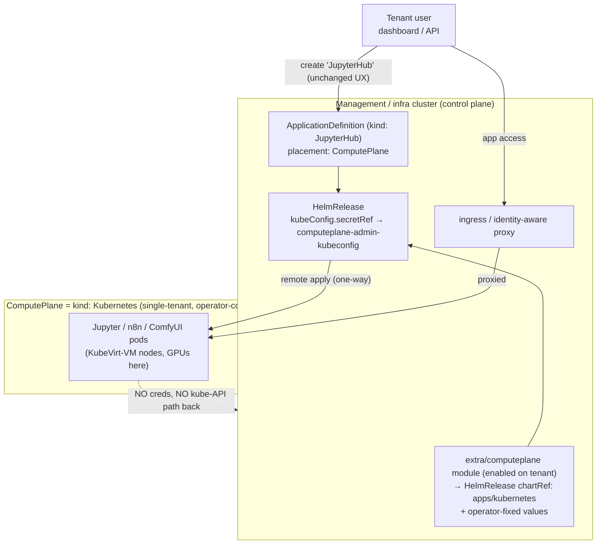

<!-- Place this file at design-proposals/compute-plane/README.md -->
# ComputePlane: a managed, isolated environment for running code-executing apps

- **Title:** `ComputePlane: a managed, isolated environment for running code-executing apps`
- **Author(s):** `@kvaps`
- **Date:** `2026-06-23`
- **Status:** Accepted
- **Revision (this PR):** Supersedes the preset-field revision (#27). ComputePlane is delivered as a Cozystack-owned **Tenant module** (`packages/extra/computeplane`) that, under the hood, deploys the ordinary `apps/kubernetes` chart with operator-fixed values, sourced through the existing PackageSource "source-only chart" mechanism (the same one NATS and SeaweedFS use — only the wrapped chart comes from `apps/` instead of `system/`). Like every Cozystack managed service, the module registers its **own `apps.cozystack.io` kind** (`ComputePlane`, via an `ApplicationDefinition` with `dashboard.module: true`) — its own API endpoint and input schema, served by `cozystack-api` and converted to a HelmRelease. So this is **not** the literal "no new kind" surface #27 aimed for; the honest positioning is: no new **CRD**, no new **controller / reconcile path**, and **no fields added to `kind: Kubernetes`** — the `ComputePlane` kind is a thin operator-owned wrapper over the unchanged `apps/kubernetes`. The tenant gets the *same* `kind: Kubernetes` cluster but owns none of its settings — only the knobs the operator exposes. The isolation mechanism (remote Flux apply onto Kamaji+KubeVirt, untrusted code behind a per-VM kernel boundary) is unchanged from the merged first revision; this revision is about the **delivery surface**.

## Overview

Cozystack's tenant model treats a managed application as a single-purpose service: a tenant can *use* a managed Postgres, but cannot turn it into a primitive for running arbitrary binaries that could escalate toward the management/infra cluster. That "you can't run an arbitrary binary inside your managed Postgres" property is a load-bearing part of the security model — managed services are a barrier the tenant cannot cross.

A growing class of applications breaks that property by design: their core feature *is* arbitrary code execution (notebooks, workflow "code" nodes, plugin systems, custom Python components). An operator who wants to *offer* these from the catalog has, today, only one delivery path — deploy them as ordinary pods into the tenant namespace **on the shared management cluster**, where they run on the management nodes' shared host kernel. For code-executing apps that is the unsafe part: a kernel-level container escape — the recurring vulnerability class, e.g. Copy Fail (CVE-2026-31431) — turns the app's untrusted user code into root on a management node and across every co-located tenant. Cloud platforms answer this by running untrusted compute behind a virtualization boundary (the reason Kata, gVisor and sandboxed runtimes exist); Cozystack already runs *tenant-owned* compute that way, on KubeVirt-VM clusters. ComputePlane brings catalog apps onto that same boundary instead of onto the shared management nodes.

**The cluster a ComputePlane runs on is the same object as a regular managed `kind: Kubernetes`** — Kamaji control plane, KubeVirt-VM workers whose `virt-launcher` pods sit in the tenant namespace under the existing egress policy, operator-held kubeconfig. ComputePlane adds no CRD and no controller for that cluster; it is a **packaging** of the existing app — a per-tenant enabler module the operator switches on, which provisions one hardened `kind: Kubernetes` cluster with values the operator controls. Delivered as a Tenant module, ComputePlane *does* register its own `apps.cozystack.io` kind (`ComputePlane`, `module: true`) — its own API endpoint and input schema — the same CRD-free way `SeaweedFS`, `Kubernetes` and every managed service is registered. That kind is a thin wrapper over `apps/kubernetes`, not a second cluster implementation, and it leaves `kind: Kubernetes` itself untouched.

Two consequences follow, and this is the whole point of the revision:

- **The user does not order a ComputePlane, and cannot edit it.** It is an enabler the tenant switches on to power a catalog of code-executing apps, not a cluster they administer — the same shape as the existing per-tenant enabler modules (`extra/etcd` → `apps/kubernetes`, `extra/seaweedfs` → `apps/bucket`; see [website#594](https://github.com/cozystack/website/pull/594)). The chart's current home in `packages/extra/` follows that convention, but the load-bearing argument for the shape is structural, not the directory — see Design §1.
- **The hardening is tamper-proof by construction.** Because the cluster's values live entirely in an operator-owned chart and the tenant holds no admin kubeconfig, there is no field for the tenant to weaken. "Withhold admin" and "own the config" are the same fact, not two features to reconcile.

ComputePlane rests on two principles, and neither is a new isolation boundary it invents:

- **Separation of responsibility.** The compute cluster stays under the operator's control: the tenant never touches the management control plane and cannot block platform updates, while the operator's management never breaks the tenant's deployed workloads. This clean split — operator owns the substrate and the hardening, tenant owns their app — is what makes this a *managed service* rather than "provision your own cluster and install it yourself."
- **Defense in depth.** Untrusted code runs behind a KubeVirt-VM boundary with its own guest kernel, so a kernel-level escape like Copy Fail is contained to a disposable VM rather than the shared host kernel of a management node.

The capability is generic and intended to live in Cozystack core as a reusable primitive — not as an LLM-specific feature. Any catalog of code-executing applications (the immediate driver is `cozyllm`; WordPress-with-plugins and future application-platform offerings are the same shape) consumes it through a pluggable interface.

## Scope and related proposals

- **#26 (@myasnikovdaniil)** and the **#17 review (Timofei Larkin)** argued ComputePlane should not be a distinct kind — the cluster it runs on is the same object as a managed `kind: Kubernetes`. This revision *partly departs* from that: it does register a `ComputePlane` module-kind (an `ApplicationDefinition`, not a CRD), but keeps the underlying substrate as the unchanged `apps/kubernetes` and puts the config in an operator-owned module rather than in user-facing fields on the app (see [Alternatives](#alternatives-considered) for the trade-off vs #27's field model).
- **[website#594](https://github.com/cozystack/website/pull/594)** (`apps` vs `extra`): the packaging convention the chart's current home follows — `apps` = first-class services the user orders; `extra` = per-tenant enabler modules under the hood. The convention picks the directory; the design's shape (own AD + wrapper chart) is justified structurally in Design §1 and does not depend on it.
- **#39 (fold `extra` into `apps` — tenant modules as declarative AD capabilities):** complementary, tracked as a separate work stream by team decision. #39's capability fields (`visibility`, `cardinality`, `protection`) are per-kind registration data, so they compose with the structure built here rather than replace it: under #39, ComputePlane becomes a directory move plus `visibility: module` and `cardinality: {scope: tenant, max: 1}` — the two-piece structure (own AD + wrapper chart) and the release-name invariant (Design §1) carry over unchanged, and any migration must preserve the `computeplane` release name.
- **`design-proposals/cross-cluster-tenant-mesh`** (PR #7): the trust model for managed clusters (one-way host → tenant, no host kube-API). A *trusted* variant of the module could wire the cluster into that data-plane mesh; the default `sandbox` module deliberately does **not** — only narrow per-service egress (Design §5).
- **`design-proposals/kubernetes-nodes-split`** / **`kubernetes-nodes-hybrid-clusters`** (PR #8/#9): the substrate is the existing managed-`kubernetes` app (Kamaji + CAPI/KubeVirt); node-provisioning changes apply transparently.
- **Deferred:** billing/metering of cluster resource and API consumption; secret delivery of managed-service connection strings into sandbox workloads; the per-instance/label granularity of the visibility control (Design §6). (Cross-tenant *sharing* of a cluster is **not** deferred — it is rejected by design; see Non-goals.)

## Context

Today Cozystack already has every primitive needed *except* the glue that ties them into "deploy this catalog app onto a hardened, operator-controlled `kind: Kubernetes` the tenant does not administer":

- **Tenants** (`packages/apps/tenant/`) are the unit of isolation: a hierarchical namespace with its own Cilium network policies, RBAC, and quotas. Cluster services are opt-in **Tenant modules** (`etcd`, `monitoring`, `ingress`, `seaweedfs`, …), each a chart under `packages/extra/` switched on per-tenant; enablement is set by the **parent** tenant at child-creation time, and module values flow down through a per-namespace `cozystack-values` Secret. ComputePlane is a new module of exactly this shape.
- **Managed Kubernetes** (`packages/apps/kubernetes/`, `kind: Kubernetes`) provisions a tenant cluster with a **Kamaji-hosted control plane** and **CAPI + KubeVirt** worker nodes. `values.yaml` exposes `nodeGroups` (`minReplicas`/`maxReplicas` autoscaling, `instanceType`, `roles`, `resources`, `gpus`) and the addon set. It also ships the cross-cluster plumbing reused here: `exposeMethod: Proxied` (management ingress → tenant NodePort), `kubevirt-cloud-provider` (`Service type: LoadBalancer` from the management cluster), and `kubevirt-csi-driver`. **The module wraps this app unchanged** — it is not a fork or a new component.
- **PackageSource "source-only" charts.** A `PackageSource` component with no `install:` block registers a chart as an available `ExternalArtifact` (named `cozystack-<source>-<variant>-<component>` in `cozy-system`) without installing it; a sibling component *with* `install:` (the `*-rd` resource-definition chart) is what registers the user-facing kind/module. This is how SeaweedFS (`extra/seaweedfs`) and NATS (`apps/nats`) are already delivered. `apps/kubernetes` is already registered source-only in `kubernetes-application`; the ComputePlane package re-declares it as its own source-only component (Design §2) so the module is self-contained.
- **Remote Flux apply already works.** The `kubernetes` app deploys its own addons by creating `HelmRelease`s *on the management cluster* carrying `spec.kubeConfig.secretRef` → the cluster's `<name>-admin-kubeconfig` Secret (key `super-admin.svc`, written by Kamaji). This is exactly the mechanism placement routing uses to put a catalog app onto the ComputePlane.
- **ApplicationDefinition** (`api/v1alpha1/applicationdefinitions_types.go`) maps a user-facing `kind` → a `HelmRelease` via `cozystack-api` (`pkg/registry/apps/application/rest.go`, `ConvertApplicationToHelmRelease()`). `spec.dashboard` already drives UI presentation (incl. `module: true`); the visibility control (Design §6) extends that path.
- **Network isolation** (`packages/apps/tenant/templates/networkpolicy.yaml`): the `<tenant>-egress` `CiliumClusterwideNetworkPolicy` selects every pod in the tenant namespace — including the KubeVirt `virt-launcher` node pods — and denies egress to the kube-apiserver by default. This is the enforcement point the `sandbox` posture and the scoped data-plane egress (Design §5) build on.

What does **not** exist yet: the `extra/computeplane` module chart and its `computeplane-application` PackageSource, a `placement` field on `ApplicationDefinition`, the scoped ComputePlane→tenant-service egress policy, and the `cozystack-api` visibility/mutation control. The substrate is present; the assembly is new.

### The problem

> "I want to offer JupyterHub (or n8n, ComfyUI, WordPress) from the dashboard. Each runs arbitrary user code as a feature. Deployed as pods in the tenant namespace on the shared management cluster, one container-escape CVE turns a notebook into root on a management node and across every tenant. My only safe options today are to not ship them, or to tell users to provision a full managed cluster and install it themselves — neither is a one-click managed service."

The platform already isolates *tenant-owned* untrusted compute (a managed `kind: Kubernetes` runs behind the VM boundary). What it lacks is a way to offer code-executing apps **from the catalog**, as managed services with safe defaults, without dropping them as shared-kernel pods on the management cluster. ComputePlane — a per-tenant `extra` module that provisions a hardened `kind: Kubernetes` and a `placement` field that routes catalog apps onto it — is that delivery path.

## Goals

- A tenant runs an untrusted-code catalog app through the normal create-an-app flow, unchanged.
- The app's pods run on a managed cluster — the same VM-isolated substrate as any `kind: Kubernetes`: no kube-API path or credentials back to management, untrusted code behind a per-VM guest kernel. **Inherited from the managed-cluster model, not introduced here.**
- The cluster's posture and contents are chosen by the **operator, in the module chart** — not assembled by the tenant, and not multiplied into a combinatorial set of kinds. The tenant sees only the curated knobs the module exposes.
- The operator retains admin of the cluster (the tenant gets no kubeconfig), so platform-owned hardening cannot be stripped — protecting the tenant's environment from the tenant's *own* app users (notebook/LLM-generated code) and keeping the managed guarantee. (Not a boundary against the tenant themselves — see Security.)
- Delivered through the standard `apps`/`extra` packaging, reusing the existing PackageSource + Tenant-module machinery — no new CRD, no new controller, no new reconcile path.
- Generic Cozystack-core primitive, reusable by any code-executing catalog.

### Non-goals

- Does **not** make Kubernetes multi-tenant or claim container isolation suffices; it places catalog apps on the existing VM-isolated substrate.
- Does **not** share a cluster across tenants (parent or child). Single-tenant **by design** (Design §7). Sharing the **node pool / capacity** is fine; sharing a **cluster** is not.
- Does **not** present invisibility, or the tamper-proof hardening, as a *platform* security boundary (it protects the tenant from their own app's users; it is not what keeps the management plane safe — see Security).
- Does **not** introduce a new **CRD** or controller for ComputePlane, nor new user-facing configuration fields on `kind: Kubernetes` (the configuration lives in the operator-owned module chart). It **does** register a `ComputePlane` `apps.cozystack.io` module-kind via its `ApplicationDefinition` — the standard CRD-free registration every managed service uses; that is intended, not avoided.
- Does **not** propose gVisor as the *primary* boundary (Alternatives) — though gVisor is a valid *inner* layer for ephemeral per-task sandboxes within a cluster (it sidesteps Kata nested-virt inside KubeVirt VMs), tracked as a future runtime option.

## Design

### 1. ComputePlane is an `extra` Tenant module that wraps `apps/kubernetes`

Reuse the `kubernetes` app as the substrate, unchanged. A ComputePlane is delivered as a new Tenant module, `packages/extra/computeplane`, of the same shape as `extra/etcd` / `extra/seaweedfs`. The packaging is **two-level** — the module chart is the wrapper, and the wrapper is what carries the operator-fixed values:

1. When a tenant has the module enabled, the **tenant chart** renders the module `HelmRelease` (name `computeplane`, in the tenant namespace on the management cluster) whose `chartRef` points at the **`extra/computeplane`** chart's `ExternalArtifact`. Its own Helm release takes the `-module` suffix so the canonical release name `computeplane` stays reserved for the cluster release below.
2. The **`extra/computeplane` chart** in turn renders the cluster `HelmRelease` (object name `computeplane-cluster`, `spec.releaseName: computeplane`) whose `chartRef` points at the **source-only re-sourced `apps/kubernetes`** `ExternalArtifact`, carrying the operator-fixed values. The release name `computeplane` is what makes Kamaji write the admin kubeconfig to the `computeplane-admin-kubeconfig` Secret — the contract `placement: ComputePlane` apps consume.

```yaml
# 1) tenant chart → module HelmRelease (illustrative)
apiVersion: helm.toolkit.fluxcd.io/v2
kind: HelmRelease
metadata:
  name: computeplane
  namespace: tenant-<name>            # management cluster, tenant namespace
spec:
  releaseName: computeplane-module    # frees the canonical name for the cluster release
  chartRef:
    kind: ExternalArtifact
    name: cozystack-computeplane-application-kubevirt-computeplane  # extra/computeplane
    namespace: cozy-system
  valuesFrom:
    - kind: Secret                    # only the curated knobs the module chooses to surface
      name: cozystack-values
---
# 2) extra/computeplane → cluster HelmRelease (illustrative)
apiVersion: helm.toolkit.fluxcd.io/v2
kind: HelmRelease
metadata:
  name: computeplane-cluster
  namespace: tenant-<name>
spec:
  releaseName: computeplane           # → Kamaji Secret computeplane-admin-kubeconfig
  chartRef:
    kind: ExternalArtifact
    name: cozystack-computeplane-application-kubevirt-kubernetes  # apps/kubernetes, re-sourced (Design §2)
    namespace: cozy-system
  values:                             # operator-owned; the tenant cannot edit these
    # hardened posture: restricted PSA + admission, deny egress → management kube-apiserver,
    # scoped per-service egress only, addon set, GPU node groups, autoscaling bounds …
  valuesFrom:
    - kind: Secret
      name: cozystack-values
```

**The release name `computeplane` is a stable external contract.** For every other tenant module (`etcd`, `monitoring`, `seaweedfs`) the Helm release name is *internal identity* — nothing outside the module resolves it by name. Here it is consumed by objects the module never sees: `apps/kubernetes` derives the Kamaji admin-kubeconfig Secret from its release name (`<release>-admin-kubeconfig`, key `super-admin.svc`), and every `placement: ComputePlane` HelmRelease references `computeplane-admin-kubeconfig` by that fixed name. No future repackaging, migration, or generic module-provisioning path may rename this release. A rename would, at best, dangle every routed app's `secretRef` (fail-closed, consistent with the missing-credential behaviour below); at worst, Helm treats the cluster as a *different release* and uninstalls the old one — a live Kamaji control plane plus KubeVirt-VM workers and their PVCs, i.e. tenant data. The implementation pins the release name and Secret name in helm-unittest; this paragraph is the *why* behind those pins.

Why a module wrapping the app, rather than a new kind or new fields on the app:

- **Same substrate, thin surface.** From the management plane a hardened compute cluster and a regular managed cluster share all machinery (Kamaji, KubeVirt nodes, autoscaler, addon Flux apply). The module registers its own `ComputePlane` kind (like any managed service), but it adds no CRD, no controller and no second cluster implementation — and it leaves `kind: Kubernetes` itself untouched (no `sandbox`/preset fields on it). The variation is *a set of values the operator picks* in the wrapping chart, not new config on the app's API.
- **Two postures over one chart require two kinds.** `ApplicationDefinition` properties — the input schema, dashboard presentation, and any per-kind marker — apply to *every* instance of the kind. Expressed on the `Kubernetes` AD, a hardened posture would apply to the ordinary tenant-ordered clusters a tenant is supposed to administer. A second posture over the same chart therefore needs a second AD — the `ComputePlane` module-kind is exactly that.
- **The AD cannot carry the hardening, so a wrapper chart must.** `ApplicationDefinitionSpec` has `application` (kind, `openAPISchema`), `release` (chartRef, labels, prefix) and `dashboard` — no fixed-values facility; the conversion is `Values: app.Spec`, so the tenant's spec *becomes* the values. Nor can a narrowed `openAPISchema` express "hardened and unreachable": a field present in the schema is both defaultable *and* tenant-overridable, while a field absent from it gets neither — the wrapped chart's own (unhardened) default would apply. Operator-fixed values can only live in a chart; the wrapper chart is that chart. This two-piece structure — own AD for the narrow schema, wrapper chart for the fixed values — is forced by the ApplicationDefinition model itself and holds wherever the chart lives (`packages/extra/` today, `packages/apps/` under a future re-foldering per #39).
- **Tamper-proof by construction.** The tenant never receives the admin kubeconfig and never sees a `Kubernetes` CR they can edit, so the hardening in the operator-owned `values` cannot be weakened. There is no user-facing field to reconcile against a profile — the chart *is* the profile.
- **The user still gets a real `kind: Kubernetes`.** It is the same cluster they would get from the catalog, with the same lifecycle, autoscaling and GPU support — they simply do not administer it and can change only what the module exposes.


```mermaid
flowchart TB
  U[Tenant user<br/>dashboard / API]
  subgraph mgmt["Management / infra cluster (control plane)"]
    MOD["extra/computeplane module (enabled on tenant)<br/>→ HelmRelease chartRef: apps/kubernetes<br/>+ operator-fixed values"]
    AD["ApplicationDefinition (kind: JupyterHub)<br/>placement: ComputePlane"]
    HR["HelmRelease<br/>kubeConfig.secretRef → computeplane-admin-kubeconfig"]
    IAP["ingress / identity-aware proxy"]
  end
  subgraph cp["ComputePlane = kind: Kubernetes (single-tenant, operator-controlled)"]
    WL["Jupyter / n8n / ComfyUI pods<br/>(KubeVirt-VM nodes, GPUs here)"]
  end
  MOD --> HR
  U -->|"create 'JupyterHub' (unchanged UX)"| AD
  AD --> HR
  HR -->|"remote apply (one-way)"| WL
  U -->|"app access"| IAP
  IAP -->|"proxied"| WL
  WL -.->|"NO creds, NO kube-API path back"| mgmt
```

### 2. Packaging: a `computeplane-application` PackageSource that re-sources `apps/kubernetes`

The module is registered by a `PackageSource` (`packages/core/platform/sources/computeplane-application.yaml`) built like `seaweedfs-application` / `nats-application`, with three components:

- `computeplane` → `path: extra/computeplane` — **source-only** (no `install:`); the module chart itself.
- `kubernetes` → `path: apps/kubernetes` — **source-only**, a deliberate **duplicate** of the component already in `kubernetes-application`, so the wrapped chart's `ExternalArtifact` is materialized within this package's own scope and the module is self-contained (it does not depend on the `kubernetes-application` source being independently enabled).
- `computeplane-rd` → `path: system/computeplane-rd` with `install:` — the resource-definition chart carrying the module's `cozyrd` (its `ApplicationDefinition` / dashboard presentation and the tenant-values wiring), the same role `seaweedfs-rd` / `kubernetes-rd` play.

The tenant chart gains a `computeplane` bool toggle alongside the existing module toggles (a profile-name string is a possible later extension if the operator ships more than one module variant); when set by the parent tenant, `packages/apps/tenant/templates/computeplane.yaml` renders the module `HelmRelease` (level 1 above). Kamaji writes the cluster's admin kubeconfig to `computeplane-admin-kubeconfig` (key `super-admin.svc`), which `placement: ComputePlane` apps consume (Design §4).

### 3. What the operator exposes vs fixes

Everything security-relevant is **fixed** in the module chart and unreachable by the tenant: the hardened PSA/admission profile, the deny-egress-to-management-kube-API policy, the scoped per-service egress contract (Design §5), the withheld-kubeconfig posture, and the addon set. The operator may **expose** a curated, safe subset as tenant-settable knobs through the module's `values.yaml` (e.g. GPU on/off and type, cluster size / autoscaling bounds, Kubernetes version) — the same "high-level API, operator-controlled" contract every other managed service follows. There is deliberately **no** general `valuesOverride` passthrough onto the wrapped `kind: Kubernetes`: that would re-open the tamper surface and re-create the two-sources-of-truth problem. Different postures (e.g. a future *trusted*/`cluster-meshed` variant) are separate module variants or separate `extra` charts, not a field on the app.

### 4. `placement` routes a catalog app onto the ComputePlane

`ApplicationDefinition` gains `placement` = `ManagementPlane` (default) | `ComputePlane`. `ManagementPlane` deploys into the tenant namespace on the management cluster, as today. `ComputePlane` routes the generated `HelmRelease` onto the tenant's ComputePlane by injecting `spec.kubeConfig.secretRef` → `computeplane-admin-kubeconfig` (the module's fixed secret) and `spec.install.createNamespace: true`. Because the module is a single per-tenant enabler, `ComputePlane` resolves unambiguously to *that* tenant's cluster — no cluster name to thread through the app.

*(Optional, advanced — deferred.)* The same routing generalizes to `placement: <named cluster>` for a tenant that deliberately runs its own `kind: Kubernetes` and wants apps placed there; that path reuses the identical `kubeConfig` injection with the cluster's own `<name>-admin-kubeconfig`. It is not the default delivery surface and is out of scope for v1.

### 5. Connectivity, remote apply, and inbound access

- **Remote apply (into the cluster).** For a `placement: ComputePlane` app, `cozystack-api` converts it to a `HelmRelease` on the management cluster carrying `spec.kubeConfig.secretRef` → `computeplane-admin-kubeconfig`; Flux applies the chart **into the ComputePlane**, never into the tenant namespace on management. This is exactly what the first revision implemented.
- **Connectivity to tenant services (`sandbox` data-plane contract).** A notebook/LLM/n8n flow needs the tenant's data ("my Jupyter → my managed Postgres"), which runs in the tenant namespace on the management cluster. The guarantee is "no kube-API access / no creds to escalate," **not** "no packets ever." No mesh is required: the ComputePlane's KubeVirt-VM node pods sit on the management Cilium pod network, so reachability is a **scoped per-service `CiliumNetworkPolicy`** — allow → the tenant's Postgres Service, deny → kube-apiserver (same shape as the existing `policy.cozystack.io/allow-to-apiserver` label). Per-service egress is narrower-by-construction than a node mesh — which matters because the consumer is untrusted code.
- **Inbound access.** Workloads expose themselves via Ingress/Gateway on the ComputePlane; the management ingress proxies to the cluster's `exposeMethod: Proxied` NodePort (or a kubevirt-ccm `Service type: LoadBalancer`). Inbound data path only — no reverse kube-API path, and the tenant never receives cluster credentials.

### 6. Tenant-side visibility / mutation control (`cozystack-api` extension)

The #17 review's "withhold admin/write, allow scoped read" deserves first-class treatment: it is both a general tenant feature **and** part of the enforcement for a ComputePlane (the tenant should not see or manage the module's underlying `HelmRelease`/cluster object as if it were their own cluster). Let managed apps (and the ComputePlane's backing objects) be marked so a tenant's *regular* users cannot see or manage them while *privileged* subjects (tenant-admin / parent-tenant operator / superadmin) still can. Two separable controls:

- **Visibility** — whether the object appears in `kubectl get` / the dashboard for a subject.
- **Mutation** — whether a subject may create/update/delete it.

**Enforced in the aggregated `cozystack-api` apiserver** (`pkg/registry/apps/application/rest.go`), which already serves `apps.cozystack.io/*` and converts them to HelmReleases — **not UI-only** (a dashboard filter is bypassable by anyone holding a kubeconfig). Granularity:

- Per-**kind** ("regular users can't touch `Jupyter`") → plain Kubernetes RBAC (a tenant Role omitting the verbs).
- Per-**instance** / **label-driven** → cannot ride vanilla RBAC (`list`/`watch` can't filter by name/label); needs `cozystack-api` to filter responses by caller identity. Feasible since Cozystack owns the apiserver, but it is apiserver work, not a Role manifest. **(Deferred to a later iteration; v1 ships per-kind only.)**

Shape (early, names TBD): an annotation/field on `ApplicationDefinition` (likely extending `spec.dashboard`, which already drives presentation / `module: true`) marking an app restricted, plus a tenant-role tier (`regular` vs `privileged`) checked before listing/mutating.

### 7. Single-tenant by design

Each `kind: Kubernetes` is a single tenant's cluster, and the module does not change that: a tenant's ComputePlane serves that tenant only. There is **no module inheritance / parent-walk** — a `placement: ComputePlane` app whose tenant has the module disabled is **rejected**, never routed onto an ancestor's ComputePlane. Inheriting one would put a child's untrusted code into the parent's isolation domain, re-creating the cross-tenant escape one level down. Sharing the underlying **node pool / capacity** across tenants stays fine; sharing a **cluster** does not.

### 8. Pluggable, core-level primitive

The module, the `placement` field, and the visibility control live in **Cozystack core**. Consumers (`cozyllm`, a future WordPress catalog, the application-platform work) depend on them by (a) requiring the `computeplane` module on the tenant and (b) setting `placement: ComputePlane` on their code-executing `ApplicationDefinition`s — no re-implementation of remote apply in the app charts.

## User-facing changes

- **App authors:** set `placement: ComputePlane` on a code-executing `ApplicationDefinition` (default `ManagementPlane`). Optionally mark an app restricted (Design §6).
- **Operators:** enable the `computeplane` module on a tenant (as with any other Tenant module); optionally set the curated knobs the module exposes (GPU, size). No cluster to hand-assemble.
- **Tenant users:** *no change* to creating an app; they don't administer the ComputePlane and (for restricted apps) may not see it.
- **API shape:** a new `ComputePlane` `apps.cozystack.io` module-kind (its own `ApplicationDefinition` / input schema, `dashboard.module: true`), served by `cozystack-api` like every managed service — **not a CRD**; a new `placement` field on `ApplicationDefinition`; the `extra/computeplane` + `computeplane-rd` + `computeplane-application` packaging; a restricted-app marker + tenant-role tier consumed by `cozystack-api`. **No new CRD/controller, and no new fields on `kind: Kubernetes`.**

## Upgrade and rollback compatibility

- Additive and backward-compatible. `placement` defaults to `ManagementPlane`; the `computeplane` module defaults to disabled — so every existing `ApplicationDefinition`, `Tenant`, and `Kubernetes` manifest is valid unchanged. `kind: Kubernetes` is untouched.
- Remote-apply via `spec.kubeConfig` is already a supported Flux feature, and source-only PackageSource components are already how SeaweedFS/NATS ship — no Flux/CRD upgrade is required.
- Disabling the module (removing the ComputePlane) is deleting a managed cluster (its data is lost) — the not-cheaply-reversible operation; gate it accordingly (Design §7 / Failure cases).

## Security

ComputePlane does **not** introduce a new isolation boundary. From the management plane, the cluster it runs on and a regular managed `kind: Kubernetes` are the same object. Its security value is two pre-existing substrate properties plus a managed-service contract — not a boundary it invents.

**Inherited from the managed-`kubernetes` substrate** (each verified by tests): (1) no management credentials in the cluster (the kubeConfig lives management-side); (2) no kube-API path to management — the `<tenant>-egress` policy already denies the node `virt-launcher` pods egress to the kube-apiserver, while scoped per-service data-plane egress (Design §5) may be granted; (3) the **virtualization boundary** (defense in depth) — a kernel-level escape like Copy Fail (CVE-2026-31431) is contained to a disposable VM, not a management node's shared host kernel; (4) separate identity domain (own Kamaji control plane + RBAC); (5) single-tenant (Design §7); (6) no new tenant-supplied input to the management plane.

**Separation of responsibility (the managed-service contract).** The cluster stays operator-controlled: the tenant cannot block platform updates, and management never breaks the tenant's app. The operator owns the substrate and hardening; the tenant owns their app.

### What the hardening does and does not protect

The one thing a ComputePlane has that a tenant-run cluster does not is **tamper-proof hardening** (the tenant is not cluster-admin and owns none of the values, so PSA / network policy / admission cannot be stripped). This is **not** a platform boundary against the tenant: an attacker holding a management-hijacking payload simply provisions a `standard` managed `kind: Kubernetes` (same substrate, one click, but they are admin and unhardened) and runs it there — the hardened venue is optional for them. The substrate (per-VM guest kernel + `<tenant>-egress`) is what contains arbitrary tenant code regardless. The hardening's real, sufficient scope is **intra-cluster**: protecting the tenant's environment from the tenant's *own* app users (JupyterHub students, LLM-generated code, n8n flows) and from the tenant's own misconfiguration. The visibility/mutation control (Design §6) is the enforcement layer for that scope.

### Visibility

Tenant *visibility* is a separable UX/operability default, not a security mechanism — an opaque cluster is no safer than a visible one. A tenant-facing **scoped read/observability** view (logs/events/`describe` of their own workloads) is allowed and worthwhile so users aren't operating a black box; full opacity is a default, not a requirement.

## Failure and edge cases

- **ComputePlane not ready when a `placement: ComputePlane` app is created** → the `HelmRelease` waits on the `computeplane-admin-kubeconfig` Secret; Flux surfaces not-ready, as with any dependency ordering.
- **kubeconfig Secret missing/rotated** → remote apply fails closed (no fallback to local apply); the security-correct behavior.
- **`placement: ComputePlane` app but the module is disabled on the tenant** → reject at admission. Never climb to an ancestor's ComputePlane (Design §7).
- **GPU exhaustion** → cluster-autoscaler adds GPU nodes up to the configured `maxReplicas`; beyond that the workload pends.
- **Tenant / module deletion** → remote `HelmRelease`s must be deleted *before* the cluster is deprovisioned (a finalizer on the module blocks teardown until they're cleaned up) — otherwise Flux's HelmRelease finalizers block once the target API is gone.

## Testing

- **Unit:** app→HelmRelease conversion injects `spec.kubeConfig.secretRef` (+ `createNamespace`) for `placement: ComputePlane` and omits it for `ManagementPlane`; `cozystack-api` hides/blocks restricted apps for `regular` subjects and not for `privileged`.
- **Chart:** `helm template` of `extra/computeplane` renders a `HelmRelease` whose `chartRef` is the source-only `apps/kubernetes` `ExternalArtifact` and whose security-relevant values (PSA, egress deny, withheld kubeconfig) are present and not overridable from tenant input.
- **Integration (kind, two clusters):** a HelmRelease on cluster A with a kubeConfig for B applies on B and nowhere on A.
- **Security (e2e):** from a ComputePlane pod, the management kube-apiserver is unreachable + unauthenticated; only the allowlisted tenant Service is reachable; no Secret holds management creds; a workload-triggered node panic is contained to one VM.
- **E2E (real cluster):** enable the `computeplane` module on a tenant, create a JupyterHub app with `placement: ComputePlane`, confirm pods land on the ComputePlane + the app is reachable via tenant ingress + the tenant holds no admin kubeconfig + a regular tenant user cannot see the restricted app; confirm a sibling/child tenant cannot deploy onto it.

## Rollout

1. **Phase 1 — core primitive.** The `extra/computeplane` module + `computeplane-rd` + `computeplane-application` PackageSource (source-only `apps/kubernetes` re-source), the `placement` field on `ApplicationDefinition` with `ManagementPlane | ComputePlane` routing, and the per-kind visibility/mutation control.
2. **Phase 2 — first consumer (`cozyllm`).** Require the `computeplane` module and set `placement: ComputePlane` on the code-executing apps (JupyterHub, n8n, ComfyUI, Langflow, code-exec Open WebUI); keep vLLM/LiteLLM on `ManagementPlane`.
3. **Phase 3 — extensions (deferred).** Per-instance/label visibility filtering; a *trusted*/`cluster-meshed` module variant and/or `placement: <named cluster>`; billing/metering; managed-service credential delivery into sandbox workloads; ephemeral per-task runtimes (gVisor RuntimeClass) as a module option.

## Open questions

- **Module / chart naming** — `computeplane` for the `extra` chart, `-rd`, and PackageSource. (Note: the name `cozyplane` is already used by the unrelated SDN work on `sdn.cozystack.io`; keep these distinct to avoid confusion.)
- **Module toggle shape** — a bool (`computePlane: true`), or a profile-name string if the operator ships more than one module variant (e.g. `sandbox` vs a future `trusted`).
- **Which knobs the module exposes** vs fixes (Design §3) — GPU/type, size/autoscaling, k8s version are candidates; the security posture is always fixed.
- **Visibility model granularity** — is the visibility/mutation split worth exposing, or is a single `restricted` flag enough for v1? Start per-kind (plain RBAC), defer per-instance/label filtering.
- **Per-service egress authorization** (Design §5) — who authorizes a ComputePlane→tenant-service path and how the `CiliumNetworkPolicy` is generated.
- **Credential delivery** — how a managed Postgres delivers its connection secret into a ComputePlane workload (network reachability handled by §5; this is the secret-plumbing half).
- **Multiple ComputePlanes per tenant** — the default module is a single per-tenant enabler; if a tenant needs several, is that the advanced `placement: <named cluster>` path, or multiple module instances?

## Alternatives considered

- **A distinct, heavyweight `kind: ComputePlane` with its own cluster implementation (the merged first revision).** The module-kind here still registers a `ComputePlane` kind, but as a thin `ApplicationDefinition` that wraps the unchanged `apps/kubernetes` — it does not duplicate the cluster reconcile/RBAC path, which was the #26 / #17-review objection to the first revision. (What #26 wanted — *no* new kind at all, only fields on `kind: Kubernetes` — is the #27 model, set aside in the next bullet.)
- **User-facing preset fields (`isolationProfile` × `componentProfile`) on `kind: Kubernetes` (revision #27).** Set aside in favor of the operator-owned module. Putting the posture on the app object adds user-facing API surface for a choice that is really the operator's, invites a tenant-editable tamper surface (the whole value of a sandbox is that the tenant *cannot* change it), and puts the posture on the one AD that must stay tenant-generic — a hardened posture needs its own kind and its own chart (Design §1), regardless of which directory that chart lives in. Baking the posture into an operator-owned module chart keeps `kind: Kubernetes` untouched, makes the hardening tamper-proof by construction, and reuses the existing Tenant-module + source-only-PackageSource machinery. (The presets' one advantage — several composable postures per tenant — is retained where it is actually wanted via separate module variants and the deferred `placement: <named cluster>` path.)
- **Single-string `computePlane:` tenant module rendered inline in `apps/tenant/templates` (first-revision implementation).** Right delivery shape, wrong packaging: the cluster HelmRelease was inlined into the tenant chart rather than shipped as a first-class `extra/computeplane` chart with its own PackageSource. This revision makes it a proper module (like `extra/seaweedfs`).
- **Harden containers in the tenant namespace.** Rejected as the primary boundary: hardening doesn't make container isolation multi-tenant, and it breaks the apps in scope.
- **gVisor / sandboxed runtime as the primary boundary.** Rejected as the *primary* boundary (incomplete syscall coverage, no kernel-panic blast-radius containment) — but valid as an *inner* layer for ephemeral per-task sandboxes within a cluster; tracked as a future runtime option.
- **Run each app directly in a VM via cloud-init.** Rejected: re-invents Kubernetes lifecycle; kubelet-in-VM gives the same boundary with GitOps + autoscaling.
- **A single shared execution cluster for the whole install.** Rejected: weakens per-tenant isolation; shared node-pool capacity remains an acceptable optimization.

---

<!-- Inspired by KubeVirt enhancement proposals and Kubernetes Enhancement Proposals (KEPs). -->
