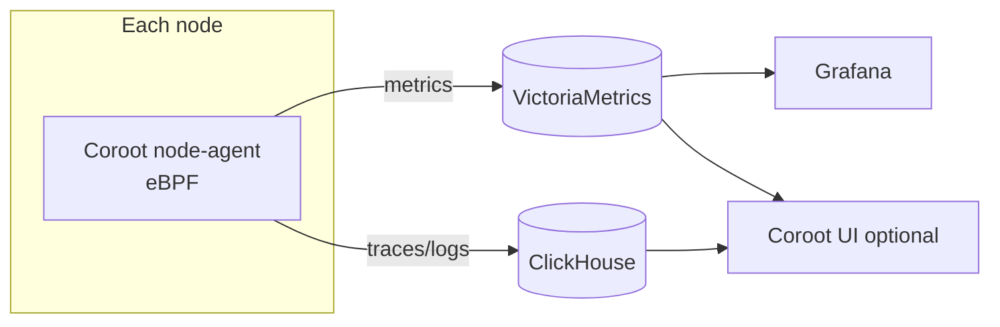

# Integrate Coroot as a zero-instrumentation (eBPF) observability option

- **Title:** `Integrate Coroot as a zero-instrumentation (eBPF) observability option for Cozystack`
- **Author(s):** `@gecube`
- **Date:** `2026-06-24`
- **Status:** Draft

> Migrated from discussion [cozystack/cozystack#3028](https://github.com/cozystack/cozystack/discussions/3028) to the design-proposal process for review.

## Overview

This proposal adds [Coroot](https://coroot.com/) — an Apache-2.0, open-source, eBPF-based observability platform — as a native option in Cozystack. Coroot auto-discovers workloads and generates telemetry from kernel-level events without requiring application code changes, which aligns with Cozystack's batteries-included philosophy.

The decisive fit: Cozystack already operates the backends Coroot needs — VictoriaMetrics and ClickHouse — so adding Coroot does not duplicate storage.

## Scope and related proposals

- Migrated together with the **[self-hosted in-cluster registry for air-gapped Cozystack](../airgap-in-cluster-registry/)** proposal (from discussion [#3029](https://github.com/cozystack/cozystack/discussions/3029)). The two are independent in substance; they are submitted as a pair.
- Overlaps to manage with existing components: **OpenCost** (cost monitoring) and the **OpenSearch** logging integration (vs. Coroot's ClickHouse-based logs). See open questions.

## Context

Cozystack ships a solid metrics/logging stack, but several observability capabilities are missing today:

- No automatic service mapping or dependency graphs.
- Distributed tracing requires manual application instrumentation.
- No continuous profiling.
- Hard to attribute latency/errors across services.

These gaps are particularly painful on a multi-tenant platform, where tenants frequently do not instrument their own applications.

### The problem

A platform operator (or a tenant) wanting a service map, traces, or profiles today has to instrument applications by hand — something tenants often will not do. The result is blind spots in cross-service latency and error attribution that the platform cannot fill on the tenant's behalf.

## Goals

- Offer eBPF-based, zero-instrumentation observability (service maps, tracing, profiling) as a native Cozystack option.
- Reuse existing backends (VictoriaMetrics, ClickHouse) rather than bundling duplicate storage.
- Follow the existing operator-driven deployment pattern used by other Cozystack components.
- Provide a low-commitment entry point that does not require adopting the full Coroot UI.

### Non-goals

- Replacing the existing metrics/logging stack.
- Mandating Coroot for all clusters; it is an option, not a default.
- Committing up front to the per-tenant eBPF privilege model (its feasibility is an open question).

## Design

**Why Coroot fits Cozystack**
- Fully open-source (Apache-2.0), no open-core restrictions.
- Operator-driven deployment, matching existing components.
- Reuses VictoriaMetrics and ClickHouse — no storage duplication.

**Dual deployment modes**
1. **Platform/operator mode** — fleet-wide visibility for the platform team.
2. **Tenant-app mode** — self-service, namespace-scoped observability for tenants.

**Low-commitment alternative**
Deploy only the Coroot node-agent, feeding metrics into the existing VictoriaMetrics + Grafana, bypassing the Coroot UI entirely. This is the cheapest way to validate value before committing to the full platform.

## User-facing changes

- A deployable Coroot option (platform component and/or tenant app), following existing Cozystack packaging.
- In the agents-only mode: new metrics in VictoriaMetrics and Grafana dashboards, with no new UI surface.
- In full mode: a Coroot UI (SSO/ingress addressed in Phase 2).

## Upgrade and rollback compatibility

Coroot is additive: it introduces no changes to existing CRDs or backends beyond writing telemetry into them. Rollback is removal of the component; existing VictoriaMetrics/ClickHouse data and the rest of the stack are unaffected.

## Security

eBPF agents run privileged on each node — a new trust boundary that must be evaluated, especially for the tenant-app mode where namespace-scoped tenants would gain access to kernel-level telemetry. The per-tenant eBPF privilege model is an explicit open question; tenant-app mode is deferred to a later phase partly for this reason. SSO and ingress hardening for the UI land in Phase 2.

## Failure and edge cases

- **Coroot UI / control plane down** → agents keep shipping to VictoriaMetrics/ClickHouse; dashboards in Grafana remain usable (agents-only mode is unaffected by UI availability).
- **eBPF unsupported on a node kernel** → agent should degrade/skip rather than crash-loop; document the minimum kernel.
- **Backend overlap** → Coroot writing logs to ClickHouse alongside the OpenSearch integration risks duplicate log pipelines; pick one per cluster (open question).

## Testing

- Unit/packaging: operator install/uninstall is clean and idempotent.
- Integration: agents-only mode emits expected metrics into VictoriaMetrics and renders in Grafana.
- e2e: full platform mode produces a correct service map and traces for a known multi-service workload.
- Manual: tenant-app mode privilege scoping (once that phase is in scope).

## Rollout

- **Phase 0** — Community discussion and consensus (this proposal).
- **Phase 1** — Agents-only PoC (or platform-mode PoC) reusing existing backends.
- **Phase 2** — Hardening: SSO, ingress, documentation.
- **Phase 3** — Tenant-app (namespace-scoped) mode.

## Open questions

1. Backend strategy: reuse existing VictoriaMetrics/ClickHouse vs. bundling dedicated instances?
2. How to manage overlap with OpenCost for cost monitoring?
3. ClickHouse logs vs. the existing OpenSearch integration — one or both?
4. Is a per-tenant eBPF privilege model feasible?
5. Phasing preference — platform-first?
6. Interest in an agents-only preliminary implementation as the entry point?

## Alternatives considered

- **Manual application instrumentation (status quo).** Rejected as the only option: tenants often will not instrument, leaving permanent blind spots the platform cannot fill.
- **Bundling dedicated VictoriaMetrics/ClickHouse for Coroot.** Possible but duplicates storage the cluster already runs; kept as an open question rather than the default.
- **Full Coroot UI from day one.** Heavier commitment than needed to validate value; the agents-only mode is offered as the low-risk entry point instead.
