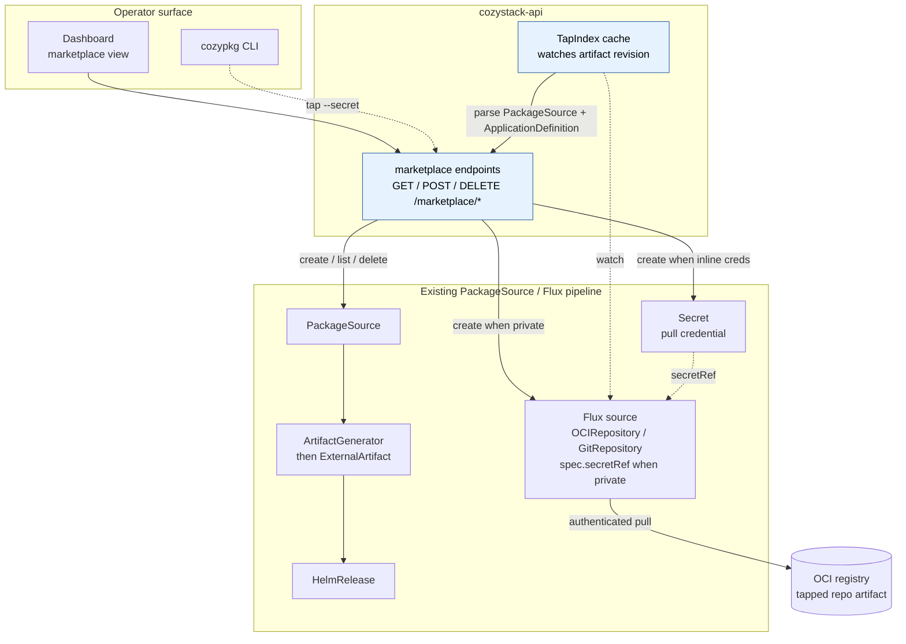
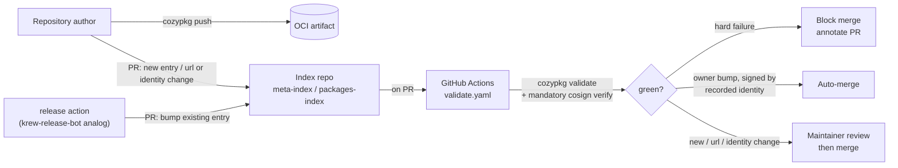

# Cozymarketplace: backend, private sources, and publication validation (supplementary to #18)

- **Title:** `Cozymarketplace — Phase 1 backend, private repository support, and publication validation`
- **Author(s):** `@IvanHunters`
- **Date:** `2026-06-25`
- **Status:** Draft
- **Supplements:** [`cozystack/community#18`](https://github.com/cozystack/community/pull/18) by `@kvaps`; builds on [`cozystack/community#12`](https://github.com/cozystack/community/pull/12) by `@kvaps` (`cozypkg tap` / `init` / `push` plus the community index)
- **Related code:** [`cozystack/cozystack#2472`](https://github.com/cozystack/cozystack/pull/2472) (merged), [`cozystack/cozystack#2455`](https://github.com/cozystack/cozystack/issues/2455)

## Overview

This proposal is supplementary, not competing, to `#18`. It accepts the repository-centric model — the install and version unit is the External-Apps repository as a versioned OCI artifact — and fills in three concrete pieces that `#18` lists as open questions or leaves implicit: the in-cluster backend the dashboard talks to, the credential plumbing that makes private repositories work in one command, and the publication validation that gates submissions to the meta-index. It also stays aligned with `#12`, which specifies the `cozypkg` authoring and tap workflow this proposal's backend and validator reuse rather than re-invent. Per-package version pinning remains out of scope, siding with `#18`.

## Scope and related proposals

`#18` defines the meta-index, the repository-as-unit model, and the `cozypkg` repository commands. `#12` defines the `cozypkg` authoring workflow (`init` / `push`), the `tap` / `untap` semantics, and the metadata-only community index. This proposal modifies neither. It specifies the backend that the dashboard view in `#18` implies, the credential plumbing private taps require, and the CI gate that lets the index accept community submissions safely — reusing `#12`'s `cozypkg tap` (which already creates both the `PackageSource` and its Flux source) and `#12`'s `cozypkg push` validation as the building blocks.

## Context

`#18` and `#12` already cover how Cozystack ships External Apps today: a `PackageSource` describes variants, components, and libraries; a `Package` selects a variant; the `PackageSource` reconciler builds an `ArtifactGenerator` that assembles each component into an `ExternalArtifact`; and Flux turns that into a `HelmRelease`. The Flux source itself is an `OCIRepository` (or `GitRepository`), and per `#12`, `cozypkg tap <oci-ref>` already creates both the `PackageSource` and that underlying Flux source in one command. Three pieces in that picture remain underspecified.

First, `#18` says the catalog should be visible inside Cozystack so operators can install apps from there, with the dashboard handling enable/disable in Phase 1. It does not specify how the dashboard obtains the catalog data — walking k8s resources from the browser is impractical, and an aggregating server-side component is required.

Second, both `#18` and `#12` list private repositories / pull credentials as a later refinement. `cozypkg tap` creates the Flux source, but neither proposal threads a pull `Secret` through to it, so tapping a private repository still means creating the `Secret` and the `OCIRepository`/`GitRepository` with `secretRef` by hand before the source can pull — which defeats the one-command tap UX. `cozystack/cozystack#2472` already solved exactly this for the *platform* source — the operator sets `spec.secretRef` on the source it generates — and the same treatment is simply missing for user taps.

Third, `#18` lists publication validation as an open question, and `#12`'s `cozypkg push` validates only at publish time on the author's machine. Without a gate on the index side, a community-submitted entry can point at an artifact that does not pull, ship a `PackageSource` that fails schema validation, or a chart that fails `helm lint`, and the failure surfaces only at install time in someone else's cluster.

## Goals

**In-cluster backend.** Provide an in-cluster backend that powers the dashboard marketplace view: a small set of endpoints in `cozystack-api`, a `TapIndex` cache controller, and well-defined RBAC for connecting and disconnecting taps. The backend is the in-cluster / dashboard equivalent of `#12`'s `cozypkg tap` / `untap`, creating and removing the same resources.

**One-command private taps.** Thread a pull credential through the one-command tap so connecting a private repository is a single operation, with the credential set as `spec.secretRef` on the Flux source that `cozypkg tap` (or the backend endpoint) already creates — exactly as `cozystack/cozystack#2472` does for the platform source. No CRD change is required.

**Publication validation.** Provide a `cozypkg validate` subcommand that lints a candidate repository offline — reusing the same `PackageSource` / schema / `helm lint` checks `#12`'s `cozypkg push` runs at publish time — and reuse it in a GitHub Actions workflow that gates PRs to the index repository.

**Strictly additive.** Keep the existing External-Apps pipeline unchanged. All additions are additive tooling and endpoints: existing public installs see zero behaviour change, and no CRD field is added or migrated.

## Non-goals

Per-package version pinning. Out of scope, deferred per `#18`.

A dynamic external catalog backend. The external browse surface — a public site that lists all submitted repositories — is designed as a static site generated from the meta-index. No database, no runtime API, no telemetry. The publication CI is a GitHub Actions workflow, not a service.

Commercial / paid-operator marketplace. Acknowledged in `#18` as a later, separate marketplace.

Cross-tap dependency resolution with version constraints. Within a single tapped repository `dependsOn` already works; cross-tap version-constrained resolution is not addressed here.

## Design

### Architecture

Two additions carry the design: the `cozystack-api` marketplace endpoints plus the `TapIndex` cache (blue, new here), and the credential threaded onto the Flux source that a tap already creates. Everything else is the existing `PackageSource` / Flux pipeline `#18` and `#12` describe.

### Backend endpoints in `cozystack-api`

The dashboard reads marketplace state through a small set of endpoints layered into `cozystack-api`, which already mediates dashboard access to platform CRs and existing auth/RBAC. No new component, no new CRDs — the marketplace state is fully derived from the `PackageSource` resources on the cluster plus the `ApplicationDefinition`s and chart metadata inside each tapped artifact (the shape `#18` and `#12` already define; no new `marketplace.yaml` file is introduced).

| Method | Path | Purpose |
|---|---|---|
| `GET` | `/marketplace/taps` | List connected taps with metadata, derived from `PackageSource` + `ApplicationDefinition`. |
| `GET` | `/marketplace/taps/{name}/packages` | Packages exposed by one tap. |
| `GET` | `/marketplace/search?q=<query>` | Search across all taps by name, tag, description. |
| `POST` | `/marketplace/taps` | Connect a tap: creates the Flux source (with `spec.secretRef` when a Secret is supplied), the `Secret` when inline credentials are given, and the `PackageSource` — the same resources `cozypkg tap` creates. |
| `DELETE` | `/marketplace/taps/{name}` | Disconnect a tap; mirrors `cozypkg untap`. Lifecycle of installed `Package` CRs follows `#12` (see below). |

A `TapIndex` cache controller in the same binary watches each tap's Flux source `status.artifact.revision`, pulls the assembled artifact on each revision change, parses the `PackageSource` + `ApplicationDefinition`s it carries, and serves the GET endpoints from memory. Without it, every search would hit OCI per request. Cluster-admin is required for `POST` and `DELETE`, matching both the cluster-scoped `PackageSource` model and `#12`'s "tap requires cluster-admin". `GET` returns catalog metadata only and is open to any authenticated user so tenant-admins can browse; it never returns Secret names or contents (see Security).

### Private repository support — credential on the Flux source, not a new CRD field

`cozypkg tap` and the `POST /marketplace/taps` endpoint already create the Flux source, so threading credentials is a change to that creation step, not to any CRD:

- `cozypkg tap <oci-ref> --secret <name>` (and a `secretRef` field on the POST body) sets `spec.secretRef` on the `OCIRepository`/`GitRepository` it creates.
- The Secret lives in the same namespace as that Flux source. Community taps place both the Flux source and its pull Secret in a single fixed, dotless namespace, `cozy-community`; the `community.` prefix stays only on the cluster-scoped `PackageSource` name (`community.<org>.<repo>`, per `#12`), for collision-avoidance. A namespace cannot carry that prefix: `PackageSource` is cluster-scoped and has no namespace of its own, and namespace names are RFC 1123 labels that forbid dots. Both the `POST /marketplace/taps` handler and `cozypkg tap --secret` create the Secret in `cozy-community`, so they agree on one place. Flux source-controller resolves `secretRef` in the source's own namespace, so there is no cross-namespace lookup to special-case.
- Secret format depends on source kind, matching what Flux source-controller documents and what `#2472` already wired for the platform source: `kubernetes.io/dockerconfigjson` for OCI; Opaque with `username`+`password` or `bearerToken` for Git over HTTPS; Opaque with `identity` (PEM private key) and `known_hosts` for Git over SSH.

This is exactly symmetric with `cozystack/cozystack#2472` (merged): that change made the operator set `spec.secretRef` on the platform source it generates; this makes `cozypkg tap` / the backend do the same for every user-tapped repository. No field is added to `PackageSourceRef`: it is a by-name reference to an already-created source, and the `PackageSource` reconciler only reads it to build the `ArtifactGenerator` — it never creates the Flux source, so a `secretRef` on the ref would have no reconcile path. Because nothing on the CRD changes, no migration is needed.

### Publication validation — `cozypkg validate` and CI gate

A new `cozypkg validate <repository-url>[@<tag>]` subcommand pulls the artifact (or fails); validates the `PackageSource` and each `ApplicationDefinition` against the published OpenAPI / `cozyvalues-gen` schema — the same validation `#12`'s `cozypkg push` runs at publish time, exposed as a standalone offline command; for each declared component, runs `helm lint` on every `Component.Path`; verifies that every `dependsOn` resolves either inside the same repository or in a known cozystack-shipped source; flags components with `install.privileged: true` so the operator sees a privileged badge in the dashboard before install; and, with `--require-signature`, performs cosign verification (Flux `OCIRepository` artifact verification, as `#12` recommends).

The same logic runs in a GitHub Actions workflow in the index repository (`#18`'s meta-index / `#12`'s `cozystack/packages-index`), triggered on PRs that add or modify an entry. The workflow resolves the entry's OCI ref and tag from the diff, runs the validator, annotates the PR with the report, and blocks merge on hard failures.

Following krew-index, the gate is two-lane rather than requiring a human on every submission:

- **A version bump of an existing entry by its owner** auto-merges on green validation, gated on the new tag being signed by the entry's *recorded* cosign identity, not merely by the PR author's GitHub account. This keeps the routine day-to-day path (a new release of an already-listed repository) fast.
- **A new entry, or any change to `source.url`, maintainer, or signing identity** requires maintainer review, because those are the security-relevant edits.

Three consequences follow. First, cosign verification is **mandatory on the gate**, not the opt-in `--require-signature` used at the author's desk: the trust anchor is the signing identity, so a bump fails if the new artifact is not signed by the originally approved identity (krew's "still the same plugin" invariant). Second, this bounds the arbitrary-outbound-fetch surface the CI otherwise exposes: on the auto-merge fast path `source.url` is unchanged and already approved, so only new-entry and url-change PRs reach an untrusted fetch, and those stay behind maintainer review with a scheme/host allowlist or a network-sandboxed validator. Third, each index entry carries an explicit **owner and signing identity/issuer**, and an author-side release action (a `krew-release-bot` analog) opens the bump PR, so authors never hand-edit the index.

The same `cozypkg validate` runs in both places: locally by the author and in CI on the index, so a submission fails fast at the author's desk rather than in someone else's cluster.

### External catalog (design only, deferred)

The public browse surface — a site at e.g. `marketplace.cozystack.io` — is designed as a static site generated from the meta-index on every meta-index merge. No runtime backend, no database. Hugo, Astro, or MkDocs all fit. Client-side search via Pagefind. Icons, screenshots, READMEs are served by reference into the OCI artifacts produced by repository authors. Implementation is explicitly deferred; flagged here only to confirm no dynamic backend is required.

## User-facing changes

CLI: a new `cozypkg validate` subcommand, and a `--secret` flag on `#12`'s `cozypkg tap`; existing `tap` / `add` / `list` / `del` semantics unchanged.

CRD: none. Private-repository support needs no CRD field — the credential is set on the Flux source at tap time. (This replaces an earlier draft's `PackageSourceRef.secretRef` field, which was the wrong layer: the `PackageSource` reconciler never creates the Flux source, so the field would have had no effect.)

Dashboard: a marketplace view backed by the new `/marketplace/*` endpoints. Tapped repositories are visible, packages browsable, installs flow through the existing Package-creation path.

Index repository: a new `validate.yaml` GitHub Actions workflow with a two-lane merge policy (owner version-bump auto-merges on signed validation; new entries and security-relevant edits go to maintainer review). Index entries gain an explicit owner and signing identity/issuer.

## Upgrade and rollback compatibility

Strictly additive, with no CRD change at all. The new endpoints are net-new paths under `/marketplace/*`; no existing route changes shape. The `TapIndex` cache starts empty and populates from existing `PackageSource` resources at startup; nothing else relies on its presence. `cozypkg tap --secret` only sets a field on a source it was already creating, so a tap without `--secret` produces exactly today's manifest. Rolling back to a `cozystack-api` version without the marketplace endpoints leaves the cluster fully functional — only the dashboard marketplace view goes blank. No migration script is required.

## Security

The trust boundary `#18` and `#12` describe — tapping a third-party repository runs that repository's charts in the operator's cluster — is preserved. The publication CI gate is the first line of defence on the index side, but it does not endorse content; it only checks structural validity. Maintainer review is required for new entries and for any change to `source.url`, maintainer, or signing identity, while owner version-bumps auto-merge on validation that is signed by the entry's recorded cosign identity (see Publication validation). Community taps keep the `community.` prefix on their cluster-scoped `PackageSource` name (per `#12`), so they cannot shadow official package names.

Privileged components are surfaced both at validation time (the CI workflow emits a warning and labels the entry) and at install time (`cozypkg add` prompts for confirmation unless `--allow-privileged` is passed).

Credentials never live on a CR field: the `secretRef` set at tap time names a `Secret` consumed by Flux source-controller under its existing RBAC; `cozypkg` and the backend never read or log the credential. The `GET` endpoints return catalog metadata only — package names, tags, descriptions, privileged badges — and never a Secret name, its contents, or the private source's credentials, so browsing cannot leak private-tap credentials across the tenant boundary.

## Failure and edge cases

`PackageSource` / `ApplicationDefinition` malformed inside the artifact → cache controller logs the parse error, marks the tap as `Degraded`, and returns the last-known-good payload. Operator sees a clear error in the dashboard.

Secret removed while still referenced → Flux surfaces the failed-pull condition on the source, which the marketplace endpoint forwards.

Tap removed while packages from it remain installed → handled per `#12`'s `cozypkg untap`: warn and require confirmation, reusing the reverse-dependency analysis from `cozypkg del`; already-installed `Package` resources are left in place until explicitly removed. The dashboard marks them `OrphanedSource` until the operator re-taps or removes them.

`POST /marketplace/taps` with a `secretRef` pointing at a non-existent Secret → endpoint accepts the request (Flux can recover later when the Secret appears), and the dashboard shows the `Secret not found` condition sourced from Flux.

## Testing

Unit: new endpoints against a fake k8s client; cache controller refresh logic against a fake OCI source; `cozypkg validate` golden-output tests against fixture repositories, both valid and intentionally broken. Integration: end-to-end test that taps a fixture private OCI repository with a `dockerconfigjson` Secret on a kind cluster and verifies the dashboard endpoint surfaces the parsed packages. CI workflow is exercised on a fixture entry pointing at `cozystack/external-apps-example`.

## Rollout

Independent PRs in cozystack, several landable in parallel. The `--secret` flag on `cozypkg tap` plus the `secretRef` handling in the backend `POST` (small; sets a field on the already-created Flux source, no CRD change, no migration) and `cozypkg validate` plus the CI workflow (~600 LOC Go and ~200 LOC YAML/shell) can land before or after `#18` / `#12`. The marketplace endpoints in `cozystack-api` (~400 LOC Go) and the `TapIndex` cache controller (~300 LOC Go) consume the `PackageSource` / `ApplicationDefinition` shape and depend on `#18` / `#12` landing first. The external static catalog is a separate proposal under Aenix maintenance; designed-only here.

## Open questions

Tap-remove lifecycle. `#12` already proposes warn-and-confirm reusing `cozypkg del` reverse-dependency analysis; this proposal adopts that and adds only the dashboard `OrphanedSource` marker. Whether disconnect should ever cascade-delete rather than orphan is left open. Default proposed: keep installed packages, mark orphaned.

Endpoint hosting. Marketplace endpoints inside `cozystack-api` versus a new `cozystack-marketplace-controller`. Default proposed: extend `cozystack-api`.

External catalog hostname. `marketplace.cozystack.io`, `apps.cozystack.io`, `hub.cozystack.io`. Aenix-side decision.

Privileged-tap policy. Should a cluster be configurable to refuse tapping any repository whose components declare `privileged: true`, regardless of operator approval? Deferred to a follow-up.

Verified-vs-community labelling. Who maintains the verified allowlist and on what criteria, building on `#12`'s opt-in `verified` flag in index entries. With the two-lane gate, the entry's recorded signing identity is a natural anchor for a `verified` badge (mandatory-signed and identity-stable), but who curates the allowlist remains a maintainer-side governance question.

## Alternatives considered

Building the marketplace surface entirely in the dashboard frontend against the existing `cozystack-api` CR proxy. Rejected because the catalog requires aggregation across multiple artifacts plus their parsed `PackageSource` / `ApplicationDefinition` content; doing this in the browser per page load is too slow and would re-implement caching client-side.

A dedicated CRD for marketplace state (`Tap`, `TapEntry`, ...). Rejected because all of the necessary state is derivable from `PackageSource` plus the parsed artifact; new CRDs raise migration cost without changing capability.

A dynamic external catalog backend (database plus API). Rejected as Phase 1 over-engineering. The meta-index is already a single source of truth; a static generator is sufficient and dramatically lower-cost.

Adding a `secretRef` field to `PackageSourceRef` (or any credential on the CR). Rejected: `PackageSourceRef` is a by-name reference to an already-created Flux source, and the `PackageSource` reconciler only reads it to build the `ArtifactGenerator` — it never creates the source, so a `secretRef` on the ref would have no reconcile path. Credentials belong on the Flux source's `Secret`, set at tap time, exactly as `cozystack/cozystack#2472` does for the platform source — encryptable at rest and flowing through existing Flux RBAC.

Per-package version pinning as part of this proposal. Out of scope to stay aligned with `#18`. A separate proposal may be revived if a concrete operational case emerges (CVE in a single package of a large repository, partner publishing on independent cadence).
