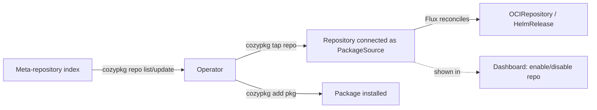

# Cozymarketplace: a community marketplace of External-Apps repositories

- **Title:** `Cozymarketplace — a meta-repository index of community External-Apps repositories`
- **Author(s):** `@kvaps`
- **Date:** `2026-06-23`
- **Status:** Draft

## Overview

Cozymarketplace is a community marketplace that lets anyone publish — and lets any Cozystack operator discover and install — curated repositories of External Apps. The central idea is that the unit an operator installs into Cozystack is **a repository of packages, not an individual package**. Cozystack's value is a ready, tested configuration of components known to work together, and a thematic repository is the natural carrier of that guarantee.

The mechanism is deliberately thin and mirrors `krew` (the kubectl plugin manager): a single **meta-repository** holds an index of available External-Apps repositories. Anyone — Aenix as a maintainer, or any third party — can list their repository in that index. An operator browses the index, taps a repository onto their cluster, and installs the packages it offers. The CLI is `cozypkg`, extended with repository-level operations.

This is Phase 1: the meta-repository index, the repository-as-unit model, and the `cozypkg` repository commands. Richer concerns (per-package version pinning, cross-repository dependency resolution, publication CI, private repositories) are deferred — see Non-goals and Open questions.

## Context

### How Cozystack ships apps today

Cozystack already has the primitives this marketplace builds on:

- **External Apps** are packaged as Helm charts and registered through a small set of CRDs. An `ApplicationDefinition` (cluster-scoped) is the catalog entry the dashboard renders — application `Kind`, the OpenAPI schema used for API validation, singular/plural names, the release `chartRef`, and dashboard metadata. See `api/v1alpha1/applicationdefinitions_types.go`.
- A **`PackageSource`** describes a source of charts and one or more **variants**; each variant lists `components`, `libraries`, and `dependsOn`. See `api/v1alpha1/packagesource_types.go`.
- A **`Package`** selects a variant from a `PackageSource` and can override or disable individual components. See `api/v1alpha1/package_types.go`.
- The operator translates `PackageSource`/`Package` into Flux **`HelmRelease`** objects; the platform creates an `OCIRepository` named `cozystack-packages` from which package sources are served.
- **`cozypkg`** (`cmd/cozypkg`) is the CLI for managing packages today, with `add`, `del`, `list`, and `dependencies`.
- A reference layout for third-party apps already exists in `cozystack/external-apps-example`.

Cozystack already knows how to take a repository of manifests, connect it via Flux as a package source, and let an operator install packages from it. The marketplace adds **discovery** on top of that, plus a way to publish the index of such repositories.

### The problem

There is no shared, browsable place that answers "which External-Apps repositories exist, and how do I connect one?" An operator who wants community apps has to know the repository URL out of band and wire it up by hand — no curated entry point, no way for the community to publish a repository for others to find, and no in-product surface showing what is available. The goal is for Cozystack to ship as an empty distribution / framework, with the marketplace as how operators light it up with thematic, pre-tested bundles of apps.

## Goals

- **A single meta-repository (index) of External-Apps repositories.** Maintainers — Aenix or anyone — submit a small descriptor (a YAML entry, `krew-index`-style) declaring that their repository exists and is available.
- **The repository is the installable unit.** The marketplace lists available repositories, optionally showing the packages inside each, but the thing an operator connects is the repository.
- **The repository is the versioned unit.** A repository *is* an OCI artifact bundling all of its applications, and that artifact carries a version/tag. The versioned, installable thing is the repository as a whole — not individual packages. This is free: External Apps already ship as versioned OCI artifacts, so a repository inherits versioning by construction. Per-package version pinning remains out of scope (see Non-goals).
- **`cozypkg` repository commands.** Extend `cozypkg` so an operator can list repositories from the index, refresh the index, and tap (connect) a chosen repository — after which the existing `cozypkg list` / `cozypkg add` flow installs packages from it.
- **Reuse the existing External-Apps mechanism.** A tapped repository becomes a Flux-connected `PackageSource` exactly like other External Apps — served from the OCI/Flux pipeline, with no new runtime machinery.
- **Surface the catalog in Cozystack itself**, so operators can install apps from there. In Phase 1 the dashboard's role is administrative — enable/disable a connected repository, not perform installs.
- **Room for a flatter view.** Nothing prevents also rendering one cross-repository list of which packages exist in which repositories, as a view on top of the index.

### Non-goals

- **Per-package version pinning.** Pinning an *individual package* to a concrete version is out of scope for Phase 1; there is no per-package pinning today and the design proceeds without it. This is distinct from repository-level versioning, which is **in** scope: a repository is a single versioned OCI artifact, so the repository as a whole is versioned even though its individual packages are not separately pinnable.
- **A commercial / operator marketplace** (Red Hat Marketplace-style, with paid operators). This is a separate, later marketplace, not designed here. The intent is two marketplaces — a community one first (this proposal), a commercial one later.
- **Automatic cross-repository dependency resolution** between arbitrary community packages. `PackageSource` already supports `dependsOn` within the platform's own sources; generalized community-wide resolution is not part of Phase 1.
- **Installing from the dashboard.** In Phase 1 installation happens via `cozypkg` under an administrator's authority; the dashboard only enables/disables repositories.

## Design

Three parts — the meta-repository (index), the repository contract, and the `cozypkg` repository commands — each mapping onto an existing Cozystack primitive.

### 1. The meta-repository (index)

A single git/OCI-hosted index repository, analogous to `krew`'s `krew-index`, with one descriptor per published External-Apps repository. A descriptor declares a name/identifier, where the repository lives (its OCI reference **including the artifact tag/version**), and human-facing metadata (title, description, maintainer) for listings. Because a repository is a single versioned OCI artifact, the index entry's source references a specific tag — that is how a repository is pinned to a version.

```yaml
# index entry — illustrative shape, not a fixed schema
apiVersion: marketplace.cozystack.io/v1alpha1
kind: RepositoryIndexEntry      # exact kind/CRD TBD
metadata:
  name: aenix-apps
spec:
  source:
    # An External-Apps repository served the same way as today's platform
    # sources (OCIRepository / package-source pipeline). The repository is one
    # versioned OCI artifact bundling all its apps; the tag pins the version.
    url: oci://ghcr.io/aenix-io/cozystack-apps
    tag: v1.5.0          # repository-artifact version (the versioned unit)
  maintainer: Aenix
  description: Curated infrastructure and LLM apps maintained by Aenix
```

Anyone, including Aenix, publishes a repository by adding such an entry to the index.

### 2. The repository contract

Each published repository follows the shape Cozystack already uses for External Apps: a `packages/core`-style set of manifests describing the package source — a `PackageSource` plus the `ApplicationDefinition`s and charts it offers, connected into the cluster by Flux. Tapping a repository wires it up as a package source (the same `OCIRepository` → `PackageSource` → Flux `HelmRelease` pipeline used for first-party apps); the operator then installs individual packages from it.

This is the point of "repository as the unit": the components inside a thematic repository are authored and tested together, so tapping the whole repository gives a configuration known to work as a set — comparable to a distribution's package repository (e.g. an Ubuntu PPA, or WAPT).

### 3. `cozypkg` repository commands

Extend the existing `cozypkg` CLI (`add`, `del`, `list`, `dependencies`) with repository-level operations, reusing a tap-style syntax:

- **list repositories** — read the index and show available repositories.
- **refresh the index** — re-pull the index.
- **tap `<repository>`** — connect a chosen repository to the current cluster, creating the package source. Tapping can target a **specific repository version** (the OCI artifact tag); upgrading means moving to a newer version, rollback means re-pinning to a previous tag.
- then the existing flow: `cozypkg list` shows packages from tapped repositories, `cozypkg add <package>` installs one.

```text
# illustrative — verb names to be finalized against existing cozypkg UX
cozypkg repo list                 # list repositories from the meta-index
cozypkg repo update               # refresh the index
cozypkg tap aenix-apps            # connect a repository (latest tag) to this cluster
cozypkg tap aenix-apps@v1.5.0     # pin the repository to a specific OCI artifact version
cozypkg list                      # packages available from tapped repos
cozypkg add <package>             # install a package
```

### Flow



## User-facing changes

- **CLI (`cozypkg`):** new repository-level commands (list/update the index, tap a repository) on top of the existing `add`/`del`/`list`/`dependencies`.
- **Dashboard:** a marketplace view listing available repositories, letting an administrator enable or disable a connected repository. No installs from the dashboard in Phase 1.
- **New public artifact:** the meta-repository index itself, which the community publishes into.
- **No change** to how tenants consume already-installed apps; this is an admin-facing discovery/installation surface.

## Upgrade and rollback compatibility

Additive. The marketplace builds on the existing `PackageSource` / `Package` / `OCIRepository` / Flux pipeline and the `cozypkg` CLI; clusters that never tap a community repository behave exactly as before. Tapping creates standard package-source manifests, so removing the feature degrades to "wire up a package source by hand," which already works. Disabling or removing a tapped repository disables its package source (dashboard control or `cozypkg del`).

Because a repository is a single versioned OCI artifact, upgrade and rollback are repository-level operations: upgrading points a tapped repository at a newer artifact version (tag), rollback re-pins it to a previous tag. There is no per-package upgrade/rollback in Phase 1 — the whole repository moves as a unit, consistent with the "tested together" guarantee.

## Security

- **New trust boundary:** tapping a third-party repository runs that repository's charts in the operator's cluster. The index is a discovery surface, not an endorsement — listing does not imply Aenix vouches for a repository's contents, and the UI must make that explicit.
- **Authority model:** installation happens via `cozypkg` under an administrator's authority; the marketplace surface is admin-only, consistent with today's admin-only package interface.
- **RBAC / access control:** who may add or enable repositories. Phase 1 keeps it simple — admin authority for install/enable — and defers fine-grained delegation. (Open question.)
- **Private repositories / credentials:** supporting private repositories (and threading a pull secret through to the connected package source) is a later refinement, not part of Phase 1. (Open question.)

## Failure and edge cases

- **Index entry points at an unreachable / invalid source →** tap fails; the resulting `PackageSource` / Flux source surfaces the error on its status, like a broken External App today.
- **Repository chart fails to template or install →** Flux `HelmRelease` reports the failure; no different from a normal External App install failure.
- **Operator disables a repository that has installed packages →** the connected source is disabled; already-installed packages remain until explicitly removed (`cozypkg del`). (Exact behavior to confirm.)
- **Two repositories expose a package with the same name →** name collision across repositories. With the repository as the unit, a package is addressed within its repository; a global flat view must disambiguate by repository. (Identifier namespacing is an open question.)

## Testing

- **Unit:** `cozypkg` index parsing; `repo list` / `update` / `tap` behavior against a fixture index.
- **Integration / e2e:** publish a fixture External-Apps repository into a test meta-index, tap it on a test cluster, install a package, confirm the resulting `PackageSource` → Flux `HelmRelease` reconciles to Ready. (Reuses existing External-Apps e2e patterns.)
- **Manual:** dashboard enable/disable of a tapped repository.

## Rollout

- **Phase 1 (this proposal):** meta-repository index, repository-as-unit model (repository = versioned OCI artifact, so repository-level versioning is included), `cozypkg` repository commands, admin-only dashboard enable/disable, reuse of the existing package-source pipeline. No per-package version pinning, no private-repo credentials, no publication CI gate.
- **Later phases:** per-package version pinning; private repositories with pull secrets; a publication/validation CI gate for submitted repositories; an AUR-style "anyone can create a repository" entry as just another entry in the index; and eventually a commercial operator-style marketplace.

## Open questions

- **Concrete index schema and resource kind.** What an index entry looks like, and whether the connected repository is a dedicated CRD or reuses `PackageSource` directly.
- **`cozypkg` verb naming.** Final names for the repository-level subcommands (`tap` vs `repo add`, etc.).
- **Per-package versioning.** Repository-level versioning is settled (a repository is a versioned OCI artifact — in scope). Whether Phase 1 ships without *per-package* pinning is the open point.
- **Publication validation.** Whether and what CI gate validates a submitted repository before it appears in the index (Helm template/lint, structure checks).
- **Private repositories and credentials.** How to support private repositories and thread a pull secret through `cozypkg` and the connected source.
- **Namespacing / identity for repositories.** How repository identifiers stay globally unique (e.g. anchoring on an external identity such as a GitHub org).
- **Dependencies across community packages.** Whether and how `dependsOn`-style dependencies generalize beyond a single repository.

## Alternatives considered

- **Marketplace of individual packages (package-centric, AUR-style).** Publish individual packages with a web form / JSON descriptor pointing at a git repo, collected into one flat catalog. This is a "repository of packages" rather than a "repository of repositories"; it could itself be one more entry in the index rather than the primary model, since the repository-as-unit gives a "tested together" guarantee a loose package catalog does not.
- **Standalone SaaS marketplace (Artifact Hub-style) vs. in-product.** A separate hosted site where users browse packages and copy install instructions, versus surfacing the marketplace inside Cozystack. This proposal prioritizes the in-product/CLI path so operators install directly; the two are not mutually exclusive — an external browsable view can sit on top of the same index.
- **Per-package version-pinned dependency graph up front.** Building per-package versioning and dependency resolution into Phase 1. Rejected: per-package pinning does not exist today and the design can proceed without it; adding it now expands scope before the core repository-index model is proven. Repository-level versioning is still adopted (a repository is a single versioned OCI artifact, pinned/upgraded/rolled back as a whole).
