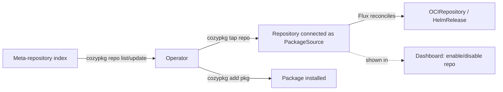

# Cozymarketplace: a community marketplace of External-Apps repositories

- **Title:** `Cozymarketplace — a meta-repository index of community External-Apps repositories`
- **Author(s):** `@kvaps`
- **Date:** `2026-06-23`
- **Status:** Draft

<!-- This proposal captures Andrei Kvapil's vision from the "cozymarketplace"
planning meeting (2026, Read AI meeting 01KVSWFWRA5PD9G3T3B2QP5X8W). A separate,
competing proposal authored by Ivan Okhotnikov (@IvanHunters) exists for the same
problem; the two are intended to be compared and the better approach chosen. -->

## Overview

Cozymarketplace is a community marketplace that lets anyone publish — and lets any Cozystack operator discover and install — curated repositories of External Apps. The central idea, as Andrei put it in the meeting, is that the unit you install into Cozystack is **a repository of packages, not an individual package**. The value Cozystack offers is a ready, tested configuration of components that are known to work together; a thematic repository is the natural carrier of that guarantee.

The mechanism is deliberately thin and mirrors `krew` (the kubectl plugin manager, which Andrei used as the reference design): a single **meta-repository** holds an index of available External-Apps repositories. Anyone — Aenix as maintainer, or any third party — can list their repository in that index. An operator browses the index, connects (taps) a repository to their cluster, and then installs the packages it offers. The CLI for this is `cozypkg`, extended with repository-level operations.

This proposal is explicitly the **first phase** Andrei asked for: stand up the meta-repository index, the repository-as-unit model, and the `cozypkg` repository commands. Richer concerns (versioning, dependency resolution, publication CI, private repositories) are noted but deferred — see Non-goals and Open questions.

## Scope and related proposals

- **Competing proposal (Ivan Okhotnikov, @IvanHunters):** a separate design for the same "cozymarketplace" problem exists and approaches it from a package-centric / `brew`-taps angle. These two proposals are meant to be evaluated side by side. This document represents Andrei's vision only.
- **Phase boundary:** this proposal covers Phase 1 (community marketplace of repositories). A later, commercial marketplace (operator-style, comparable to Red Hat Marketplace) is acknowledged as a future direction but is out of scope here. Andrei stated the team wants two marketplaces and that the commercial one is "where we want to get to" later, not now.

## Context

### How Cozystack ships apps today

Cozystack already has the primitives this marketplace builds on:

- **External Apps** are packaged as Helm charts and registered through a small set of CRDs. An `ApplicationDefinition` (cluster-scoped) is the catalog entry the dashboard renders — it carries the application `Kind`, the OpenAPI schema used for API validation, the singular/plural names, the release `chartRef`, and dashboard metadata. See `api/v1alpha1/applicationdefinitions_types.go`.
- A **`PackageSource`** describes a source of charts and one or more **variants**; each variant lists `components` (Helm releases), `libraries`, and `dependsOn` (dependencies on other package sources, e.g. `cozystack.networking`). See `api/v1alpha1/packagesource_types.go`.
- A **`Package`** selects a variant from a `PackageSource` and can override or disable individual components. See `api/v1alpha1/package_types.go`.
- The operator translates `PackageSource`/`Package` into Flux **`HelmRelease`** objects; Flux reconciles them, pulling chart artifacts. The platform creates an `OCIRepository` named `cozystack-packages` from which package sources are served.
- **`cozypkg`** (`cmd/cozypkg`) is the CLI for managing packages today, with subcommands `add`, `del`, `list`, and `dependencies`.
- A reference layout for third-party apps already exists in `cozystack/external-apps-example`, built on the `ApplicationDefinition` API.

In other words, Cozystack already knows how to take a repository of manifests, connect it via Flux as a package source, and let an operator install packages from it. The marketplace adds **discovery** on top of that, plus a way to publish the index of such repositories.

### The problem

Today there is no shared, browsable place that answers "which External-Apps repositories exist, and how do I connect one to my cluster?" An operator who wants community apps has to know the repository URL out of band and wire it up by hand. There is no curated entry point, no way for the community to publish a repository for others to find, and no in-product surface that shows what is available. Andrei's framing: Cozystack should be installable as an empty distribution / framework, and the marketplace is how operators light it up with thematic, pre-tested bundles of apps.

## Goals

- **A single meta-repository (index) of External-Apps repositories.** Maintainers — Aenix included, but anyone — submit a small descriptor (a YAML entry, krew-`krew-index`-style) declaring that their repository exists and is available. (Andrei said.)
- **Repository is the installable unit.** The marketplace lists available repositories, optionally showing the packages inside each, but the thing an operator connects is the repository. (Andrei said.)
- **Repository is the versioned unit.** A repository *is* an OCI artifact that bundles all of its applications, and that artifact carries a version/tag. The versioned, installable thing is therefore the repository as a whole — not individual packages. This is natural and free: Cozystack External Apps already ship as versioned OCI artifacts, so the repository inherits versioning by construction. (Grounding: Cozystack external-apps; consistent with Andrei's "repository as the unit" position. Per-package version pinning remains out of scope — see Non-goals.)
- **`cozypkg` repository commands.** Extend `cozypkg` so an operator can list the available repositories from the index, refresh the index, and tap (connect) a chosen repository to the current cluster — after which the existing `cozypkg list` / `cozypkg add` flow installs packages from it. (Andrei said.)
- **Reuse the existing External-Apps mechanism.** A tapped repository becomes a Flux-connected package source exactly like other External Apps — `PackageSource` served from the OCI/Flux pipeline, no new runtime machinery. (Andrei said: "примерно та же логика, что у нас используется для остальных External Apps".)
- **Surface the catalog in Cozystack itself.** Ideally the marketplace is visible inside Cozystack so operators can install apps from there. The dashboard's role in Phase 1 is administrative: enable/disable a connected repository (turn it on or off), not perform installs. (Andrei said.)
- **Room for a "repository of repositories" plus a flatter view.** Andrei noted nothing stops us from also rendering "one big list" of which packages exist across which repositories, as a separate view on top of the index.

### Non-goals

- **Per-package version pinning.** Pinning an *individual package* to a concrete version is out of scope. Andrei was explicit that today there is no way to pin a package to a concrete version, that this is a refinement to be solved "sooner or later," but **not now** — and that the design "can do without it" for this phase. *(This is a point where Andrei's view and the competing proposal differ: in the post-Andrei portion of the meeting, Ivan argued per-package versioning is mandatory. This proposal follows Andrei and rejects per-package version pinning for Phase 1.)* Note this is **distinct from repository-level versioning, which is IN scope**: a repository is a single versioned OCI artifact (see Goals and Design), so the repository as a whole is versioned even though its individual packages are not separately pinnable.
- **A commercial / operator marketplace** (Red Hat Marketplace-style, with paid operators). Acknowledged as a separate, later marketplace; not designed here.
- **Automatic cross-repository dependency resolution between arbitrary community packages.** The `PackageSource` model already supports `dependsOn` within the platform's own sources; generalized community-wide dependency resolution is not part of Phase 1.
- **Installing from the dashboard.** In Phase 1 installation happens via `cozypkg` under an administrator's authority; the dashboard only enables/disables repositories.

## Design

The design has three parts: the meta-repository (index), the repository contract, and the `cozypkg` repository commands. Each maps onto an existing Cozystack primitive.

### 1. The meta-repository (index)

A single git/OCI-hosted index repository, analogous to `krew`'s `krew-index`. It contains one descriptor per published External-Apps repository. A descriptor declares: a name/identifier for the repository, where the repository lives (its source URL / OCI reference, **including the artifact tag/version**), and human-facing metadata (title, description, maintainer) used to render it in listings. Because the repository is a single versioned OCI artifact bundling all its applications, the index entry's source can reference a specific tag — that is how a repository is pinned to a version.

```yaml
# index entry — illustrative shape, not a fixed schema
apiVersion: marketplace.cozystack.io/v1alpha1
kind: RepositoryIndexEntry      # connective inference: exact kind/CRD TBD
metadata:
  name: aenix-apps
spec:
  source:
    # points at an External-Apps repository served the same way as today's
    # platform sources (OCIRepository / package-source pipeline).
    # The repository is one versioned OCI artifact bundling all its apps;
    # the tag pins the whole repository to a version.
    url: oci://ghcr.io/aenix-io/cozystack-apps
    tag: v1.5.0          # repository-artifact version (the versioned unit)
  maintainer: Aenix
  description: Curated infrastructure and LLM apps maintained by Aenix
```

Anyone, including Aenix as maintainer, can publish their External-Apps repository by adding such an entry to the index. (Andrei said: "у нас есть мета-репозиторий, которым кто угодно, включая Aenix смогут публиковать свои репозитории External Apps для Cozystack".)

### 2. The repository contract (what a tapped repository contains)

Each published repository follows the same shape Cozystack already uses for External Apps: an installer / `packages/core`-style set of manifests describing the package source — effectively a `PackageSource` plus the `ApplicationDefinition`s and charts it offers, connected into the cluster by Flux. When an operator taps a repository, Cozystack wires it up as a package source (the same `OCIRepository` → `PackageSource` → Flux `HelmRelease` pipeline used for first-party apps). The operator can then install individual packages from it.

This is the crux of Andrei's "repository as the unit" position: because the components inside a thematic repository are authored and tested together, tapping the whole repository gives the operator a configuration that is known to work as a set — comparable to a distribution's package repository (Andrei's analogies: WAPT, Ubuntu PPA at the repository level).

### 3. `cozypkg` repository commands

Extend the existing `cozypkg` CLI (which already has `add`, `del`, `list`, `dependencies`) with repository-level operations, reusing a tap-style syntax:

- **list repositories** — read the meta-repository index and show available repositories.
- **refresh / update the index** — re-pull the index.
- **tap `<repository>`** — connect a chosen repository (selected from the index) to the current cluster, creating the package source. Andrei suggested reusing a brew-`tap`-style verb (e.g. `cozypkg tap`) against a repository from the index. Tapping can target a **specific repository version** (the OCI artifact tag); upgrading a tapped repository means moving it to a newer OCI artifact version, and rollback means re-pinning it to a previous tag.
- then the **existing flow**: `cozypkg list` shows packages available from the tapped repositories, and `cozypkg add <package>` installs one.

```text
# illustrative — verb names to be finalized against existing cozypkg UX
cozypkg repo list                 # list repositories from the meta-index
cozypkg repo update               # refresh the index
cozypkg tap aenix-apps            # connect a repository (latest tag) to this cluster
cozypkg tap aenix-apps@v1.5.0     # pin the repository to a specific OCI artifact version
cozypkg list                      # packages available from tapped repos
cozypkg add <package>             # install a package
```

### Flow



## User-facing changes

- **CLI (`cozypkg`):** new repository-level commands (list/update the index, tap a repository) layered on top of the existing `add`/`del`/`list`/`dependencies`.
- **Dashboard:** a marketplace view that lists available repositories and lets an administrator enable or disable a connected repository. Installs are not performed from the dashboard in Phase 1.
- **New public artifact:** the meta-repository (index) itself, which the community publishes into.
- **No change** to how tenants consume already-installed apps; this is an admin-facing discovery/installation surface.

## Upgrade and rollback compatibility

This is additive. The marketplace builds on the existing `PackageSource` / `Package` / `OCIRepository` / Flux pipeline and the `cozypkg` CLI; clusters that never tap a community repository behave exactly as before. Tapping a repository creates standard package-source manifests, so removing the marketplace feature degrades to "operator wires up a package source by hand," which already works today. Disabling or removing a tapped repository is a matter of disabling its package source (the dashboard enable/disable control, or `cozypkg del`).

Because a repository is a single versioned OCI artifact, upgrade and rollback are repository-level operations: **upgrading** a tapped repository means pointing it at a newer OCI artifact version (tag), and **rollback** means re-pinning it to a previous tag. There is no per-package upgrade/rollback in Phase 1 — the whole repository moves as a unit, which is consistent with the "tested together" guarantee.

## Security

- **New trust boundary:** tapping a third-party repository runs that repository's charts in the operator's cluster. The meta-index is a discovery surface, not an endorsement — listing in the index does not imply Aenix vouches for a repository's contents. This needs to be explicit in the UI.
- **Authority model:** installation happens via `cozypkg` under an administrator's authority (Andrei: install is an admin action). The dashboard's marketplace surface is admin-only, consistent with today's admin-only package interface.
- **RBAC / access control:** who may add or enable repositories is an access-control concern raised in the meeting (in the post-Andrei discussion). Phase 1 keeps it simple — admin authority for install/enable — and defers fine-grained delegation. (Inference: not specified by Andrei; flagged as Open question.)
- **Private repositories / credentials:** supporting private repositories (and threading a pull secret through to the connected package source) was raised as a needed refinement. It is not part of Phase 1. (Open question.)

## Failure and edge cases

- **Index entry points at an unreachable / invalid source →** tap fails; the resulting `PackageSource` / Flux source surfaces the error on its status, the same way a broken External App does today.
- **Repository chart fails to template or install →** Flux `HelmRelease` reports the failure; nothing different from a normal External App install failure.
- **Operator disables a repository that has installed packages →** the connected source is disabled; already-installed packages remain until explicitly removed (`cozypkg del`). (Inference; exact behavior to confirm.)
- **Two repositories expose a package with the same name →** name collision across repositories. Andrei's model keeps the repository as the unit, so a package is addressed within its repository; a global flat view must disambiguate by repository. (Naming/namespacing was debated only after Andrei left — see Open questions — so this proposal does not adopt the post-Andrei namespace proposals as Andrei's vision.)

## Testing

- **Unit:** `cozypkg` index parsing, `repo list`/`update`/`tap` command behavior against a fixture index.
- **Integration / e2e:** publish a fixture External-Apps repository into a test meta-index, tap it on a test cluster, install a package from it, confirm the resulting `PackageSource` → Flux `HelmRelease` reconciles to Ready. (Reuses the existing External-Apps e2e patterns.)
- **Manual:** dashboard enable/disable of a tapped repository.

## Rollout

- **Phase 1 (this proposal):** meta-repository index, repository-as-unit model (repository = versioned OCI artifact, so repository-level versioning is included), `cozypkg` repository commands, admin-only dashboard enable/disable, reuse of the existing package-source pipeline. No per-package version pinning, no private-repo credentials, no publication CI gate.
- **Later phases (not designed here):** per-package version pinning; private repositories with pull secrets; a publication/validation CI gate for submitted repositories; a possible AUR-style "anyone can create a repository" entry as just another entry in the index (Andrei explicitly welcomed this as an additional repository in the list); and eventually a commercial operator-style marketplace.

## Open questions

- **Concrete index schema and resource kind.** What exactly does an index entry look like, and is the connected repository represented by a dedicated CRD or by reusing `PackageSource` directly? (The shapes above are illustrative.)
- **`cozypkg` verb naming.** Final names for the repository-level subcommands (`tap` vs `repo add`, etc.).
- **Per-package versioning.** Repository-level versioning is settled (a repository is a versioned OCI artifact — IN scope). The open point is *per-package* pinning: Andrei deferred it, the competing proposal treats it as mandatory. Decide for the project whether Phase 1 truly ships without per-package pinning.
- **Publication validation.** Whether/what CI gate validates a submitted repository before it appears in the index (Helm template/lint, structure checks). Raised in the meeting after Andrei left; not part of Andrei's Phase-1 ask, listed here for the project to decide.
- **Private repositories and credentials.** How to support private repositories and thread a pull secret through `cozypkg` and the connected source.
- **Namespacing / identity for repositories.** How repository identifiers are kept globally unique (e.g. anchoring on an external identity such as a GitHub org). Discussed only after Andrei left; recorded here, not adopted as Andrei's design.
- **Dependencies across community packages.** Whether and how `dependsOn`-style dependencies generalize beyond a single repository.

## Alternatives considered

- **Marketplace of individual packages (package-centric, AUR-style).** Instead of publishing repositories, publish individual packages with a web form / JSON descriptor pointing at a git repo, collected into one flat catalog. Andrei recognized this as "a repository of packages" and called it a good idea — but distinct from his proposal, which is a "repository of repositories" (Ubuntu PPA, not AUR). Andrei's position: this could itself be *one more entry* in the index rather than the primary model, because the repository-as-unit gives the "tested together" guarantee that a loose package catalog does not. *(This package-centric direction is closer to the competing proposal.)*
- **Standalone SaaS marketplace (Artifact Hub-style) vs. in-product.** A separate hosted site where users browse packages and copy install instructions, versus surfacing the marketplace inside Cozystack. Andrei raised both and leaned toward surfacing it in Cozystack so operators can install directly, with the dashboard handling enable/disable. The two are not mutually exclusive — an external browsable view can sit on top of the same index — but Phase 1 prioritizes the in-product/CLI path.
- **Per-package version-pinned dependency graph up front.** Build *per-package* versioning and dependency resolution into Phase 1 (the competing proposal's direction). Rejected for Phase 1 per Andrei: per-package pinning does not exist today, and the design can proceed without it; adding it now would expand scope before the core repository-index model is proven. Note this rejects only *per-package* versioning — **repository-level versioning is adopted**, since a repository is a single versioned OCI artifact and is pinned/upgraded/rolled back as a whole (see Goals, Design, and Upgrade and rollback compatibility).
