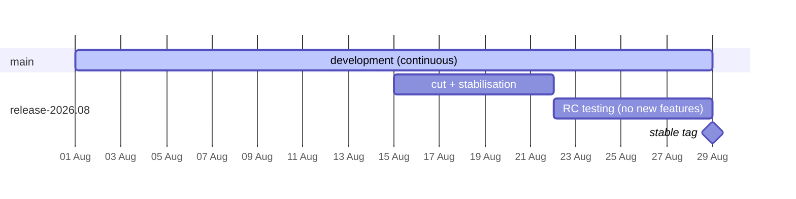

# Cozystack as a distribution

- **Title:** `Cozystack as a distribution — semver core, independently versioned packages, and a monthly CalVer release train`
- **Author(s):** `@myasnikovdaniil`
- **Date:** `2026-07-27`
- **Status:** Draft

## Overview

Cozystack has exactly one version number, and everything wears it. `COZYSTACK_VERSION` comes from `git describe --tags` in `hack/common-envs.mk` and every package Makefile reads it; the whole `packages/` tree is pushed as a single OCI artifact; a single digest in `packages/core/installer/values.yaml` selects it; and one `OCIRepository` fans that digest out to 98 `PackageSource` objects. A Postgres chart fix and a change to the aggregated apiserver are, as far as delivery is concerned, the same event.

The charts themselves carry no version at all. All 164 under `packages/` ship `version: 0.0.0 # Placeholder, the actual version will be automatically set during the build process`, and nothing in the pool build ever replaces it: `helm package --version $(COZYSTACK_VERSION)` appears only in the `repo` target of `packages/{apps,system,extra,library}/Makefile`, which builds the separate Helm repository under `_out/repos/`, while the neighbouring `fix-charts` target *resets* the field to `0.0.0`. The pool is `flux push artifact --path=../../../packages` over the source tree, so what ships is `version: 0.0.0`, 164 times. The placeholder comment describes a build step that does not exist.

This proposal replaces that single number with four, arranged the way an operating-system distribution arranges its own: a **core** on semantic versioning (the apiserver, controller, operator, CRDs, and the delivery contract itself), **packages** and **apps** each carrying their own semantic version, and a **distribution** — the thing users install and talk about — on calendar versioning, released monthly. A release stops being "the state of a git tree at a tag" and becomes what a distribution release has always been: a manifest that pins an exact set of component versions, tested together, shipped together, supported together.

The change is smaller than it sounds, because the platform is already most of the way there and nobody has been calling the pieces by their distribution names. `PackageSource` and `Package` are a package database. Bundles are metapackages. `helm.sh/resource-policy: keep` on the `Package` CRs means the installed set already diverges from the shipped set — that is `dpkg --get-selections`, implemented by accident. `cozypkg` is `apt` with the version, repository, and index code removed. The per-package pre-upgrade migration hook exists and is used by four packages already. And the delivery layer already does the hardest part: generated artifact revisions are content-derived, so helm-controller already skips a package whose content did not change. What defeats it is narrower and more embarrassing than a version scheme — a cosmetic version string vendored inside each chart's image reference, rewritten on every release even for images that were not rebuilt (see [§4](#4-the-versioned-pool)). What is genuinely missing is narrow: a versioned pool, an index, and eventually a version field on the source reference. This proposal specifies those and then connects the in-flight proposals that each assume some part of them.

The case is made from platform release engineering rather than from ecosystem ambition — the costs it addresses are paid every release cycle today, in a repository with no external catalogs at all. That framing is deliberate and is set out in [Why this is a release-engineering proposal](#why-this-is-a-release-engineering-proposal-not-a-marketplace-proposal), because it determines build order: the internal requirement can be satisfied with no discovery surface whatsoever, while a discovery surface cannot be satisfied without it.

## Scope and related proposals

This proposal is deliberately a joining piece. Several accepted or in-flight proposals each solve one axis of the same problem and each stop at the edge of the version question; the intent here is to supply the axis they share rather than to re-litigate any of them.

| Proposal | What it establishes | How this proposal relates |
|---|---|---|
| [community#43](https://github.com/cozystack/community/pull/43) — Out-of-tree application catalogs (`@lllamnyp`, Review) | Three application tiers (platform / curated catalog / external catalog), catalog repositories as OCI artifacts, e2e cost as the driver, a declared minimum platform version checked at `PackageSource` reconciliation | **Supplies the version axis #43 assumes.** #43 defines the *component structure* of the distribution (Debian's main/universe split); this proposal defines what a version means inside it and where the declared minimum platform version comes from. #43 is the stronger near-term motivator and should not wait on this |
| [community#18](https://github.com/cozystack/community/pull/18) — Cozymarketplace (`@kvaps`, **accepted**, merged 2026-08-24 as [`design-proposals/cozymarketplace`](https://github.com/cozystack/community/blob/main/design-proposals/cozymarketplace/README.md)) | Repository-as-unit, a krew-style meta-index, a repository is one versioned OCI artifact, `cozypkg` repository commands | **Adopted as-is for external repositories; extended, not replaced, for the platform's own.** #18 makes per-package pinning a non-goal **for its Phase 1**, which is the right call for the problem #18 is solving; it is a sequencing statement, not a permanent exclusion. This proposal is the Phase 2 it leaves room for, scoped to the first-party archive — see [§8](#8-repository-as-unit-versus-package-as-unit) |
| [community#12](https://github.com/cozystack/community/pull/12) — Community package index and `cozypkg` authoring (`@kvaps`, `@IvanHunters`, closed 2026-07-16) | `cozypkg tap` / `init` / `push` / `search`, metadata-only index, `community.` name prefixing, an optional expected-signing-identity per entry | **Its package-level axis is revived here, on a different justification.** #12 was package-centric; #18 superseded it with a repository-centric model and #12 was closed. That supersession is sound on ecosystem grounds. This proposal re-derives the package-level axis from platform release engineering instead, and reuses #12's `cozypkg` surface and index-entry shape rather than inventing new ones |
| [community#23](https://github.com/cozystack/community/pull/23) — Cozymarketplace supplementary (`@IvanHunters`, **accepted**, merged 2026-08-24 as [`design-proposals/cozymarketplace-supplementary`](https://github.com/cozystack/community/blob/main/design-proposals/cozymarketplace-supplementary/README.md)) | Marketplace endpoints in `cozystack-api`, a `TapIndex` cache, a pull credential set as `spec.secretRef` on the Flux source a tap already creates (no CRD change), `cozypkg validate` plus a two-lane index CI gate | **Consumed unchanged.** The `TapIndex` cache is the natural home for the release manifest / index reader described below. Note that #23 restates #18's position — "per-package version pinning remains out of scope, siding with `#18`" — so this proposal now differs from two accepted documents rather than one draft; see [§8](#8-repository-as-unit-versus-package-as-unit) |
| [community#6](https://github.com/cozystack/community/pull/6) — ApplicationDefinition multi-version conversion (`@kvaps`, Draft) | `versions[]` with a storage version, `to`/`from` conversion templates, a `_version` stamp, a background migration controller | **Orthogonal axis, and the thing that makes semver honest.** #6 versions the *API surface* of an app; this proposal versions the *package*. Their relationship is what gives "breaking change" a testable definition — see [What MAJOR means](#what-major-means) |
| [community#39](https://github.com/cozystack/community/pull/39) — Fold `extra` into `apps` (`@myasnikovdaniil`, Draft) | Retires the `extra` bucket; visibility / cardinality / protection / capability as declarative `ApplicationDefinition` fields | **Same direction, one tier down.** #39 removes a directory-as-metadata convention by moving the metadata onto the ApplicationDefinition; this proposal does the same for the version. Together they turn ApplicationDefinition into the package's control file |
| [cozystack#3448](https://github.com/cozystack/cozystack/pull/3448) — ApplicationGroupDefinition (MVP) | Dynamic API-group registration, reserved-namespace validation, restart-based pickup via the `cozystack.io/config-hash` rollout | **Prerequisite for tier 2, and the proof that the runtime is already data-driven.** The mechanism it extends is the reason per-package delivery is feasible at all |
| [cozystack#3276](https://github.com/cozystack/cozystack/pull/3276) — chainsaw-native release upgrade lane (`@myasnikovdaniil`, open) | Install previous stable → seed workloads with canary data → upgrade → verify survival, data integrity, all-HelmReleases-Ready, PVs Bound, migration stamp advanced | **Prerequisite, and the thing that makes "tested together" a fact.** Under this proposal the manifest is the unit of testing, so the lane that exercises an upgrade of the manifest stops being advisory — see [Testing](#testing) |
| [community#21](https://github.com/cozystack/community/pull/21) — Self-hosted in-cluster registry for air-gap (`@gecube`, Draft) | Offline bundle, in-cluster registry as source of truth | **Affected, and improved.** A per-package pool changes what an offline bundle contains; a release manifest is exactly the mirror list an air-gapped site needs. Flagged as an open question rather than solved here |
| [community#25](https://github.com/cozystack/community/pull/25) (Draft), [community#33](https://github.com/cozystack/community/pull/33) (**accepted**, merged 2026-07-18) | Per-cluster etcd; ComputePlane as an operator-owned module | Downstream consumers of the tiering; not blocked by this proposal |

**Deliberately out of scope:** the content of any specific tier assignment (that is #43's call), the API-conversion mechanism (that is #6's), the dashboard's marketplace information architecture (#18/#23), and anything about how Talos or the installer bootstraps a cluster.

## Context

### What the delivery chain actually does today

Every arrow in the chain below carries a *name*. The only version in the entire path is the digest at the very top, and there is exactly one of it.

```
packages/core/installer/values.yaml:18-19    platformSourceUrl + platformSourceRef: digest=sha256:…
  └─ cmd/cozystack-operator/main.go:564-602  one OCIRepository/cozystack-platform in cozy-system
     └─ packages/core/platform/templates/repository.yaml:19   spec cloned verbatim → OCIRepository/cozystack-packages
        └─ packages/core/platform/sources/*.yaml   98 PackageSource CRs, all sourceRef.name: cozystack-packages
           └─ internal/operator/packagesource_reconciler.go:261-278   one ArtifactGenerator per PackageSource
              │    sources[0] copied from spec.sourceRef — no revision selector
              │    copy: "@cozystack-packages/<component.path>/**" → "@artifact/<component>/"
              └─ source-watcher v2.1.0   slices the tree into per-component ExternalArtifacts
                 └─ internal/operator/package_reconciler.go:79-83   HelmRelease.chartRef → ExternalArtifact
                       CrossNamespaceSourceReference for ExternalArtifact carries no version field
```

The pool is built by `packages/core/installer/Makefile:37`, which does `flux push artifact oci://$(REGISTRY)/cozystack-packages:$(IMAGE_TAG) --path=../../../packages` — the entire `packages/` tree becomes one OCI artifact — and then writes the resulting digest back into `values.yaml` with `yq`.

There is no version field anywhere in the data model. `PackageSourceRef` (`api/v1alpha1/packagesource_types.go:97-116`) is `{Kind, Name, Namespace, Path}`. `Component` (`:168-189`) is `{Name, Path, Install, Libraries, ValuesFiles}`. `Package` (`api/v1alpha1/package_types.go:54-100`) is `{Variant, IgnoreDependencies, Components{Enabled, Values}}`. `path: apps/postgres` is a directory inside an immutable tarball, not a coordinate in a version space. The same path appears six times across the networking variants precisely *because* it always resolves to the same bytes — a property that per-component versioning would turn from a convenience into a hazard.

### Core is not low-churn

A natural instinct is that extracting core is easy because core rarely changes. Measured over the last twelve months on `main`, that is not true — the `cmd/` entrypoints are thin wrappers and the substance lives elsewhere:

| Area | Commits (12 months) |
|---|---|
| `cmd/cozystack-api` | 1 |
| `cmd/cozystack-controller` | 25 |
| `cmd/cozystack-operator` | 27 |
| `internal/` | 284 — of which `internal/controller` 125, `internal/backupcontroller` 53, `internal/operator` 34 |
| `pkg/` | 168 — of which `pkg/registry` 115 |
| `api/` | 171 — of which `api/apps` 95 |
| `packages/apps` | 768 |
| `packages/system` | 1345 |
| `packages/core/platform` | 337 |
| `packages/core/installer` | 112 |

Core as a body of code is roughly 620 commits a year — the second-most-churned area in the repository. This does not argue against the split; it argues that core will cut releases *more often than monthly*, which the design must accommodate rather than assume away. The consequence is spelled out in [Core releases between trains](#core-releases-between-trains).

### The runtime is already data-driven

The single most encouraging fact for this proposal: an app's served API is not compiled into the apiserver. `pkg/cmd/server/start.go` lists `ApplicationDefinition` objects at boot and registers served resources from them, with the OpenAPI schema carried as a string in `spec.application.openAPISchema` inside the package itself (`packages/system/<app>-rd/cozyrds/<app>.yaml`). `internal/controller/applicationdefinition_controller.go` watches those objects and rolls the `cozystack-api` DaemonSet by updating a config-hash on the pod template — the same mechanism cozystack#3448 extends for API groups.

So a package can already change its own API surface without a core rebuild. That property is what makes independent package versioning feasible at all, and it is shipping today.

One counter-fact to handle: `api/apps/v1alpha1/` is a **separate Go module** (`api/apps/v1alpha1/go.mod`) tagged in lockstep with the platform (`api/apps/v1alpha1/v1.6.0`, `/v1.5.3`, `/v1.4.6`), mirroring app schemas for external consumers — and `internal/backupcontroller/*app/types.go` duplicates several of them again. Under per-app versioning that module's version stops meaning anything.

### The problem

- **A release moves packages that did not change, and a decorative tag string is why.** Measured across `v1.6.1..v1.6.2`, 35 of the 164 packages have any changed file at all: 9 changed chart source, 13 had an image digest move, and **13 moved because the version substring inside an image reference was rewritten while the digest stayed byte-identical.** The remaining 129 are untouched. Since generated artifact revisions are content-derived (see [§4](#4-the-versioned-pool)), each of those 13 nevertheless gets a new artifact digest and a HelmRelease upgrade, for a change Kubernetes never reads — it pulls by digest. So the churn is neither total nor unavoidable; it is manufactured by one line of cosmetics per chart, and removing it is a smaller change than anything else in this proposal.
- **Breaking changes are held hostage.** A breaking change in one app forces either a platform major (which frightens users away from an upgrade that is mostly bug fixes) or an indefinite delay. There is no way to say "MongoDB 4.0 is breaking, the platform is not".
- **A package fix cannot ship without a platform release.** Today the only route to a released cluster is a backport, and the backport bot fails silently on conflict and imports whole files for files absent on the target branch. Security fixes inherit that latency.
- **Nothing can be tested or supported at package granularity,** because nothing *is* a package at release granularity. #43 wants catalog repositories with their own CI against a matrix of supported Cozystack releases; there is no version to put in that matrix except the whole platform's. The answer is not a matrix — it is a manifest that names the tested set, plus a declared range for anything that leaves it; see [Testing](#testing).
- **The word "version" has no defined meaning.** Nobody has had to decide what makes a chart change breaking, because no chart version has ever been read by anything.

### Why this is a release-engineering proposal, not a marketplace proposal

Per-package versioning has come up before in an ecosystem context — publishing, discovery, letting third parties ship apps — and in that context it was reasonably set aside. This proposal deliberately does not argue from ecosystem ambition, a roadmap item, or what other platforms have. It argues from four things that hurt today, in a repository with no external catalogs at all:

1. **A fix cannot reach a released cluster without a platform release.** The only route today is a backport, and the backport automation fails silently on conflict and imports whole files when the target branch lacks the file being modified. Security fixes inherit that latency and that failure mode.
2. **An upgrade is sized by the release, not by the change.** A patch release whose substance is nine chart-source fixes moves 35 packages, 13 of them for a rewritten tag string alone ([§4](#4-the-versioned-pool)), and the operator is asked for a maintenance window sized to the release rather than to the change — because nothing in the release tells them which 9 mattered.
3. **Breaking changes are structurally discouraged.** With one version, a breaking change in one app is a platform-level event. The rational response is to defer it, and deferred schema debt is why [#6](https://github.com/cozystack/community/pull/6) exists at all — the shapes it wants to fix (`users` as a map, `postgresql.parameters.max_connections`) have been wrong for a long time and stayed wrong because there was no way to charge the cost to one app.
4. **Release readiness is all-or-nothing.** `v1.6.0` needed four release candidates and a NO-GO on rc.1 for upgrade-only blockers in two components. With a single version, two blocked components block everything; with a manifest, they hold at their previous versions and the train ships.

None of those four require a marketplace, a community index, or a single external contributor. They are internal costs paid every release cycle by the people running the release. The relevant observation is that **the machinery which fixes them is the same machinery an ecosystem needs** — a versioned pool, a manifest, and a package manager that understands both. That coincidence is worth stating precisely, because it determines build order: the internal requirement demands a lockfile and per-package versions and can be satisfied with no discovery surface whatsoever, while a discovery index is optional sugar on top of it. If the ecosystem work never happens, everything in this proposal is still worth building. If it does happen, it lands on a foundation that already exists rather than requiring one.

## Goals

- A Cozystack release is a **manifest** naming a core version and an exact version for every package and app it ships, and that manifest is a published artifact users and tooling can read.
- Upgrading a release upgrades only the components whose versions changed. Unchanged components are not re-reconciled.
- A package or app can ship a breaking change on its own major version without a platform major.
- A security fix in one package can be released and consumed without a platform release.
- "Breaking" has a written, CI-enforceable definition for a Cozystack package.
- External catalogs (#43 tier 1/2) and community repositories (#18) are the same mechanism as first-party packages, differing only in origin and support level.
- Release cadence is predictable one to two months ahead, with a published support window.

### Non-goals

- **Arbitrary user-composed version mixing.** A release pins a tested set. Users select a release, not a basket of versions. Overrides exist (see [Holds and overrides](#holds-and-overrides)) but are explicitly unsupported territory, exactly as a distribution treats a pinned package from a foreign repository.
- Changing how Talos, the installer, or cluster bootstrap work.
- Designing the conversion mechanism for app APIs — that is #6.
- Deciding the tier of any specific application — that is #43.
- A hosted registry service. Artifacts live in ordinary OCI registries, as they do today.

## Design

### 1. Four tiers, one package model

| Tier | Contents | Versioning | Cadence |
|---|---|---|---|
| **Core** | The mechanism: the aggregated apiserver, the controllers that reconcile Cozystack's own API, the tenant machinery, the package and application system, the `cozystack.io` CRDs, and the delivery contract (`PackageSource`, `Package`, `ApplicationDefinition`, `ApplicationGroupDefinition`) | SemVer | On its own, as needed |
| **Packages** | Platform components — operators, CSI/CNI, monitoring, ingress; today's `packages/system` | SemVer, Cozystack's own, not upstream's | Continuous, released from `main` |
| **Apps** | User-facing managed applications; today's `packages/apps` (and `packages/extra` after #39) | SemVer | Continuous, released from `main` |
| **Distribution** | The thing users install and name | CalVer `YYYY.MM` | Monthly |

Mechanically, packages and apps are the **same object** — both are `PackageSource` + `Package` + charts, and both should stay that way. The distinction is a `section` on the package (Debian's `Section:` field), used for catalog presentation, tiering, and support policy, not for delivery. This mirrors #39's central argument one level up: a directory is not a mechanism, and behaviour that differs should be a declared field.

Core is the one genuine exception, and it must be defined by **contract, not by binary**. If core's version tracks the Go code, a controller bug fix and a CRD field removal both read as "core changed" and the number communicates nothing. Core's semver describes the compatibility of the CRD groups, the `PackageSource`/`Package`/`ApplicationDefinition` semantics, and the operator's artifact-resolution behaviour. The binaries are implementation.

#### Where the line falls

The governing analogy is Kubernetes itself: the apiserver, the controller manager and the API machinery *are* Kubernetes, while the CNI, the CSI driver and the ingress controller are things that run on it, however indispensable. Applied here, **core is the mechanism and a package is anything that runs a workload** — including storage and networking, which are load-bearing but are not the platform.

Eleven charts build their image from the repository root with `COPY api pkg cmd internal`, which makes them the set where the line is not obvious. Classified:

| Chart or binary | What it does | Tier |
|---|---|---|
| `cozystack-api` | aggregated apiserver | **core** |
| `cozystack-controller` | reconciles `Tenant` and `Application` | **core** |
| `cozystack-operator` (ships in `packages/core/installer`) | `PackageSource` / `Package` | **core** |
| `lineage-controller-webhook` | admits against `api/v1alpha1`, Cozystack's own CRDs | **core** |
| `cozypkg` | the package manager (released as a binary asset, not an image) | **core** |
| `packages/core/platform` | bundles, sources, the shape of the platform | **core** |
| `flux-plunger`, `flux-shard-operator` | keep Flux delivering packages | **core**, but see the open question below |
| `backup-controller`, `backupstrategy-controller` | own API group `api/backups/*`; a backup service | package |
| `securitygroup-controller`, `kubeovn-plunger` | networking | package |

Everything else under `packages/{system,apps,extra}` is a package without argument.

#### Two consequences the rest of this proposal depends on

**The delivery boundary is in the wrong place today, and moving it is real work.** Only two things currently ship outside the package pool: the CRDs, concatenated from `internal/crdinstall/manifests/*.yaml` into `_out/assets/cozystack-crds.yaml`, and the operator, rendered from `packages/core/installer` by the root `manifests` target. Flux itself comes from `internal/fluxinstall/manifests/fluxcd.yaml`. Everything else in the table above — the apiserver, the controller, the lineage webhook — travels through the pool as ordinary `packages/system/*` charts, on the same path as Cilium. Declaring them core therefore means moving three charts from the pool into the bootstrap lane, which changes how they are installed, upgraded and rolled back. This is the largest single piece of unscoped work in the proposal and it should be planned as its own change, not folded into the versioning work.

A naming collision comes with it: `packages/core/` today holds `flux-aio`, `installer`, `platform`, `talos` and `testing`, of which only `platform` and part of `installer` are core in the sense used here. The directory name will have to give way, most likely by the same argument #39 makes — the tier is a declared field, not a path.

**The Go tree stays one unit, so package versions must not be derived from image digests.** All eleven charts build from one `go.mod` and one build context, so a change anywhere in `internal/` invalidates the cache for every one of them and moves every digest. Splitting the module is explicitly not proposed: the coupling is real but the cost of severing it exceeds the benefit, and core being a single Go module is consistent with core being a single SemVer unit.

The consequence is that a package's version cannot be a function of its image digest, because that digest moves for reasons belonging to a different tier. `backup-controller` is a package whose image is rebuilt whenever the apiserver changes. Two things follow, and both are already required for other reasons: the digest must not live inside the chart (see [§4](#4-the-versioned-pool) — it moves to the release manifest, which is also what removes the tag-rewrite churn), and a package's version must be derived from changes to *its own* directory rather than from its build output.

### 2. The distribution mapping

Naming the analogy precisely is useful, because it makes each missing piece obvious and tells reviewers which prior art to argue from.

| Debian / Ubuntu | Cozystack today | Under this proposal |
|---|---|---|
| Release (`bookworm`, `24.04`) | a git tag → one OCI digest | CalVer release = a manifest pinning exact versions |
| `base-files` / base system | core | Core, semver, own cadence |
| Package pool (`pool/main`) | one OCI artifact holding all of `packages/` | one artifact per package per version |
| `Release` / `Packages` index | *does not exist* | the release manifest **is** the index |
| `main` / `universe` / `multiverse` | in-tree only | #43's tiers 0 / 1 / 2 |
| `control` file | scattered: `Chart.yaml`, the `-rd` ApplicationDefinition, the `PackageSource` entry | ApplicationDefinition, extended by #39 and this proposal |
| Metapackage (`ubuntu-desktop`) | `templates/bundles/{system,iaas,paas,naas}.yaml` | unchanged, now version-pinned |
| `dpkg --get-selections` | `Package` CRs with `helm.sh/resource-policy: keep` | **already correct, no change** |
| `apt` | `cozypkg add/del/list/dot` | + versions, repositories, search, upgrade, hold |
| Maintainer scripts (`preinst`) | 53 global numbered shell scripts | per-package pre-upgrade hooks |
| `apt-mark hold` | nothing | version override on the `Package` CR |
| PPA / third-party repo | `external-apps-example` (legacy path) | #18 taps, #43 catalogs |

Two of these already work and are simply unnamed. Bundles (`packages/core/platform/templates/bundles/*.yaml`, rendered through the four helpers in `_helpers.tpl:1,27,33,52`) are metapackages complete with opt-in and opt-out (`values.yaml:37-59` — `bundles.<name>.enabled`, `enabledPackages`, `disabledPackages`, plus per-component `Package.spec.components[<n>].enabled`). And because bundle-emitted `Package` CRs carry `helm.sh/resource-policy: keep` (`_helpers.tpl:17`), removing a package from values does not uninstall it — the installed set is already a separate thing from the shipped set, which is precisely the selections semantics a package manager needs.

### 3. The release manifest

The manifest is the central new artifact. It is what a release *is*.

```yaml
apiVersion: cozystack.io/v1alpha1
kind: Release                       # exact kind TBD — see Open questions
metadata:
  name: "2026.08"
spec:
  channel: stable                   # stable | rc | nightly
  core: 1.7.2
  supersedes: "2026.07"
  supportedUpgradeFrom: ["2026.07", "2026.06"]
  migrationFloor: 54                # see Migrations
  packages:
    - name: cozystack.linstor
      section: system
      version: 2.4.0
      digest: sha256:…
    - name: cozystack.postgres-application
      section: apps
      version: 3.2.1
      digest: sha256:…
      requiresCore: ">=1.7.0 <2.0.0"
    # …
  repositories:                     # additional origins shipped enabled-by-default
    - name: cozystack-catalog
      url: oci://ghcr.io/cozystack/catalog
      version: 2026.08
```

Properties that matter:

- **The manifest is the index.** #18's meta-index and #12's community index are the same object shape for a different origin. There is one reader.
- **It is a diffable artifact.** `2026.09` minus `2026.08` is the release notes, mechanically. This replaces changelog generation that today has to summarise "everything that landed".
- **It is the mirror list.** For #21's air-gapped bundle, the manifest enumerates exactly what must be pulled — currently that enumeration only exists inside `hack/lib/image-refs.sh` and its four consumers.
- **`requiresCore` is #43's "declared minimum platform version",** which #43 already assumes is checked at `PackageSource` reconciliation. This is where it comes from.

### 4. The versioned pool

**Option A — versioned paths in one artifact.** Keep publishing one OCI artifact per release, but version the paths inside it: `apps/postgres/3.2.1/…`. A partial upgrade means the new manifest points unchanged packages at unchanged paths. If the content copied by the `ArtifactGenerator` is byte-identical, the generated artifact is identical, helm-controller sees no new revision, and the HelmRelease is not upgraded. No API change; a build-system change and a path convention.

**Option B — one artifact per package per version.** `PackageSourceRef` (or `Component`) gains a `version`, and the reconciler emits one source alias per distinct `(repository, version)`. This is the true repository model, and it is what external catalogs need regardless.

An earlier draft of this proposal treated the choice as gated on an unknown — whether `ExternalArtifact` revision is content-derived or source-derived — and proposed a cluster experiment to settle it. **That question is settled from source, and the answer enables Option A.** The upstream `ArtifactGenerator` CRD documents `spec.artifacts[].revision` as follows (`internal/fluxinstall/manifests/fluxcd.yaml:522-528`):

> Revision is the revision of the generated artifact. If specified, it must point to an existing source alias in the format `"@<alias>"`. **If not specified, the revision is automatically set to the digest of the artifact content.**

The field is optional, and cozystack never sets it: `reconcileArtifactGenerators` constructs `OutputArtifact{Name, Copy}` at `internal/operator/packagesource_reconciler.go:241-244`, and the string `Revision` does not appear anywhere in that file. The `@<alias>` pattern constrains the field *when set*; it is not evidence that revisions track the source. So generated artifact revisions are already content-derived, on every cluster running today.

**This reframes the whole proposal.** Content-derived revisions mean helm-controller already ignores a package whose content did not change — so the question is not how to make partial upgrades possible, but what is currently preventing them. It is not the chart version, which never enters the pool (see [Overview](#overview)). It is a decorative version string vendored inside each chart's image reference.

#### What actually manufactures the churn

Every package Makefile writes its built image back into its own chart as `:$(IMAGE_TAG)@sha256:…`, and at promotion `hack/promote-rewrite-tags.sh` rewrites the rc substring to the stable one across every ref-bearing file — `packages/*/*/values.yaml`, `packages/*/*/images/*.tag`, and the files declared in `hack/lib/image-refs.sh`. Promotion deliberately does not rebuild; the script's own header says "only the cosmetic tag string moves from `1.6.0-rc.4` to `1.6.0`". The result, from the real `v1.6.1..v1.6.2` diff:

```
packages/system/metallb/values.yaml
-      tag: v1.6.1@sha256:9d8ba76cdb9c7c6221334ad05d706dee22b138b3e90c1fe8fc884925b7480c02
+      tag: v1.6.2@sha256:9d8ba76cdb9c7c6221334ad05d706dee22b138b3e90c1fe8fc884925b7480c02
```

Identical digest, different file. Kubernetes resolves this reference by digest and never reads the tag, but the chart's bytes changed, so its generated artifact digest changed, so its HelmRelease upgraded.

#### Measured on a cluster, not inferred from the diff

The above was worked out from `git diff`, which predicts 35 of 164 packages moving on that release. That prediction was then run: a three-node Talos stand, `cozy-installer` 1.6.1 with the `isp-full` variant (207 `ExternalArtifact` objects covering 157 of the 164 package directories), a baseline snapshot of every artifact digest and HelmRelease revision, `helm upgrade` to 1.6.2, and the same snapshot again once the platform re-converged at 95/95 HelmReleases Ready. Every artifact that moved was then attributed to a cause, with none left over:

| `v1.6.1` → `v1.6.2`, 207 artifacts | count | cause |
|---|---|---|
| **held** — digest unchanged | **134** | nothing in the package or its libraries changed |
| moved | 18 | **tag string only — the image is byte-identical** |
| moved | 25 | **`cozy-lib` fan-out** (see below) |
| moved | 18 | image digest genuinely moved (rebuild) |
| moved | 12 | chart source changed |

Downstream: 23 of 95 HelmReleases took a new revision, and **43 of 164 pods were replaced.**

Three conclusions, and the first two are the proposal's case.

**"Every release moves every chart" was never true.** 134 of 207 artifacts held. The delivery layer already skips what does not change; the question was only ever what makes things change.

**Of the 73 artifacts that moved, 43 moved for a reason that has nothing to do with the package.** 18 for a tag string, 25 for a library fan-out. Only 30 moved because something inside the package itself changed.

**The cosmetic case is not academic — it restarted the data plane.** Among the tag-only movers are `system/cilium` (in five variants), `system/linstor`, `system/metallb` and `system/objectstorage-controller`, and on this cluster they restarted 3, 8, 4 and 1 pods respectively. The metallb pods came back running `sha256:9d8ba76c…` and `sha256:87df3c82…` — the exact digests `packages/system/metallb/values.yaml` carries at **both** tags. The CNI and the storage layer were restarted to deliver a string no runtime reads.

#### The second cause: a library is vendored into every consumer

The 25 unattributed movers were the finding the `git diff` could not have produced, because it assumes a package directory is self-contained. It is not. The operator's `ArtifactGenerator` copies library charts into each consuming package's artifact — for `apps/redis`, verbatim from the cluster:

```yaml
copy:
- from: '@cozystack-packages/apps/redis/**'
  to:   '@artifact/redis/'
- from: '@cozystack-packages/library/cozy-lib/**'
  to:   '@artifact/redis/charts/cozy-lib/'
```

36 of the 207 artifacts bundle `cozy-lib` this way, and `packages/library/cozy-lib/templates/_barman.tpl` changed in this release. One edit to one library template therefore moved 25 packages, every one of which is otherwise untouched.

This is not cosmetic and cannot be deleted the way the tag can — the library genuinely is part of the rendered chart. It is a statement about what a package *is*: a package's version must be a function of its own directory **and** the libraries it vendors, and a `cozy-lib` change legitimately bumps every consumer. Which makes `cozy-lib` a de-facto part of 36 packages' interface with no version on it — the same undeclared-interface problem [Testing](#testing) raises for cross-package `lookup`, appearing inside the first-party archive rather than between catalogs. Partial upgrades will not isolate a `cozy-lib` fix, and the design should say so rather than discover it later.

#### The counterfactual, run on the same cluster

"Drop the tag and the churn goes away" is a claim, so it was run rather than asserted. Both release trees were rebuilt with the Cozystack version removed from every image reference — all five ref shapes, so the ref is `repo@sha256:…` alone — pushed as two pool artifacts, and the same stand was pointed at the first, allowed to settle, then pointed at the second. The measurement is that second transition, against the same 207 artifacts.

| | artifacts moved | held | HelmReleases moved | pods replaced |
|---|---|---|---|---|
| as shipped, `v1.6.1` → `v1.6.2` | 73 | 134 | 23 / 95 | **43 / 164** |
| version removed from every vendored ref | **59** | **148** | 16 / 95 | **21 / 164** |

Exactly 14 artifacts stopped moving, exactly the 14 predicted, with nothing newly moving: Cilium in all six of its artifacts, LINSTOR, linstor-gui, MetalLB, Multus, kubeovn-plunger, Kamaji, objectstorage-controller and seaweedfs-system. The residual splits as predicted too — 25 library fan-out, 18 image rebuilds, 12 changed sources, 4 tag-only.

**The data-plane restarts go to zero.**

| pods replaced | as shipped | tag removed |
|---|---|---|
| `cozy-cilium` | 3 | **0** |
| `cozy-linstor` | 8 | **0** |
| `cozy-metallb` | 4 | **0** |
| `cozy-multus` | 3 | **0** |
| `cozy-objectstorage-controller` | 1 | **0** |

The CNI, the storage layer, the load balancer and the CNI multiplexer are not restarted at all once the version stops being vendored into the chart, and total pod churn halves. One Kamaji pod still cycles, which its artifact no longer explains — an ordinary reschedule rather than a delivery event.

Four tag-only movers survive — `apps/clickhouse`, `apps/http-cache`, `apps/mariadb`, `extra/seaweedfs` — and the reason is instructive rather than a shortfall: they stop moving *for the tag* and keep moving because they vendor `cozy-lib`, which changed in this release.

Which reorders the remaining work. After the tag fix the 59 survivors are 29 library fan-out, 18 genuine image rebuilds and 12 changed chart sources — so **the library question is no longer a footnote, it is the largest single cause of churn left.** Fixing both would take the release from 73 moved artifacts to 30, every one of them for a reason inside the package.

One implementation note the experiment produced, and it is the trap this change will actually hit. A first attempt at the transform matched only `repo:tag@sha256:…` and recovered 4 of the 18, because `hack/lib/image-refs.sh` documents five ref shapes and two of the common ones put the tag elsewhere — a bare `tag: v1.6.1` with the digest in a sibling key (Cilium), and `tag: v1.6.1@sha256:…` as a YAML value. A digest-only change has to cover every shape that file enumerates, and `image-refs.sh` is the right and only place to enumerate them.

#### Stop vendoring the tag

**The tag fix is smaller than any other item in this proposal and independent of all of them.** Write `ghcr.io/cozystack/cozystack/metallb@sha256:…` and nothing else. The tag continues to exist in the registry — `hack/promote-retag.sh` pushes it — and the release manifest names it, so nothing that a human or a mirror needs is lost; only the copy that sits inside the chart and forces a reconcile goes away. `hack/promote-rewrite-tags.sh` and its bats suite are deleted outright, and the rc-leftover scan in `hack/verify-promoted-packages.sh` has nothing left to scan for. This is worth doing on its own merits whatever happens to the rest of the proposal, and its effect is measurable on the very next patch release.

#### The tarball determinism question is answered

An earlier draft listed as an open question whether the generated tarball is reproducible for identical input content, on the theory that unpack-time modification times could vary the digest. **It does not.** Flux normalises the archive: entries are written with mtime `1970-01-01`, uid/gid `0`, and fixed modes. Building the same directory twice with `flux build artifact` — pinned at 2.8.6, the version all three release workflows install — produces byte-identical output, `touch` in between included.

**The cluster run settles the residual too.** That local check exercises the `flux` CLI's archive path rather than source-watcher's re-tar inside `ArtifactGenerator`, which left a gap. The upgrade above closes it by observation: 134 artifacts held a byte-identical digest across two *different* pool revisions, which is only possible if source-watcher's re-tar normalises entry metadata exactly as the CLI's does. No code read and no kind cluster are needed; the question is answered.

A related loose end worth fixing in the same pass: `flux push artifact --reproducible` exists — it fixes the OCI created-timestamp at epoch — and `packages/core/installer/Makefile:37` does not pass it. That affects the pool manifest's own digest, not the per-component artifacts, so it does not cause the churn above; it is simply free determinism that is currently declined.

Option B remains the target for external catalogs, and the groundwork is favourable: `ArtifactGenerator.spec.sources[]` is **already a list with aliases** upstream, and the copy operations already address `@alias/path/**`. Cozystack always writes exactly one entry (`packagesource_reconciler.go:268-275`), so the change is confined to `reconcileArtifactGenerators`. The cost is object count — from 2 `OCIRepository` objects to roughly 100, each with a 5-minute poll interval, plus source-watcher's `emptyDir` unpack (`internal/fluxinstall/manifests/fluxcd.yaml:8287-8288`) rebuilding on every pod restart. That must be load-tested, not assumed. The recommended sequencing is therefore Option A for the first-party archive now, Option B when external catalogs land.

A third structural coupling to resolve under either option: `package_reconciler.go:131` looks up the `PackageSource` **by the same name as the `Package`**. That 1:1 naming is fine if version lives as a field on those objects, and blocks anything that would need parallel objects per version.

### 5. What MAJOR means

SemVer without a written rule is noise, and this is the item most likely to quietly kill the initiative. The definition proposed here anchors on #6, which is what makes a breaking change survivable rather than merely announced:

| Bump | Definition | Consequence |
|---|---|---|
| **PATCH** | No change to the values schema, no change to any resource identity | Upgrade in place, no migration, no notice |
| **MINOR** | Additive schema only (new optional keys with defaults); no removed or retyped keys; no immutable-field or selector change | Upgrade in place; may ship a per-package migration; release-note entry |
| **MAJOR** | Any of: a removed or retyped values key; a change of storage version under #6; a workload rename or immutable-field change requiring adoption or recreation; a change to a capability the package provides to others (#39) | Requires a conversion path (#6) or a documented manual action; may not be crossed by a partial upgrade without an explicit gate |

#### Computed, not hand-written

Maintaining 164 `Chart.yaml` versions by hand is not viable, so PATCH and MINOR are **derived**: a package's version is a function of the changes to its own directory since the last release, computed at build time. That keeps the number honest for free and removes an entire class of "forgot to bump" review comments.

What a computed number cannot do is recognise a breaking change — no diff of files tells you that removing a values key strands existing clusters. **MAJOR is therefore declared, not derived.** The author states it, and CI's job is to check the declaration is honest rather than to produce it.

Two CI gates make that real, and both must ship in the same phase as the version numbers:

1. **Content changed implies version moved.** A package whose rendered output differs from the previous release without a version change fails the build. With derivation this is close to tautological, which is the point — it is the check that derivation is actually wired up. Without it, an unchanged chart version over changed content becomes an OCI/Flux cache-poisoning bug.
2. **Schema-diff classifies the bump.** Compare the generated OpenAPI schema against the previous version and assert the declared bump is at least as large as the diff implies. Removal or retyping demands MAJOR, and a package that removed a key while declaring MINOR fails.

The prior art for gate 2 is already in the tree and should be reused rather than re-invented: `cmd/api-gate` compares the Cozystack API surface across two checkouts, reports whether the change is "sizeable" — a new group, a new resource, or a break to an existing one — and CI turns that verdict into a required review from a designated API owner. That is exactly the shape wanted here, one tier down and with the verdict compared against a declaration instead of routed to a human.

Gate 2 is also where #6 and this proposal meet: #6 gives an app the ability to *survive* a storage-form change, and this proposal gives it the number that *advertises* one. A MAJOR without a `to`/`from` pair is a manual-action release; with one, it is transparent.

### 6. Migrations: per-package, generalising a pattern that already exists

Today all 53 migrations live in `packages/core/platform/images/migrations/migrations/` as bare numbered shell scripts, are selected by `run-migrations.sh:39` walking `seq $CURRENT_VERSION $((TARGET_VERSION - 1))`, run as **cluster-admin** in one Job, and execute as a `pre-upgrade` hook on the `cozystack-platform` Helm release — which means *all* of them run before *any* component HelmRelease upgrades. The only state is `data.version` in the `cozy-system/cozystack-version` ConfigMap; there is no per-migration record, so every script must be idempotent, and that is convention rather than enforcement.

Under partial upgrades a single global counter has no defined meaning. But the redesign is less open-ended than it looks, for two reasons.

**First, the ordering requirements are already per-package.** Examining what the recent migrations actually need:

| Migration | Must run before | Owning package |
|---|---|---|
| 45, 46, 47 | the `kubernetes` chart re-renders (else Helm prunes live `KubeadmConfigTemplate`/`MachineDeployment` objects, or the chart `fail()`s on `v1.30`) | `packages/apps/kubernetes` |
| 48 | ClickHouse keeper GC hook selects PVCs | `packages/apps/clickhouse` |
| 51 | monitoring PVC selectors apply | `packages/system/monitoring` |
| 52 | the linstor release upgrades (immutable `spec.selector`) | `packages/system/linstor` |
| 43, 53 | the seaweedfs release re-renders (else the CNPG `Cluster` and all tenant S3 metadata are pruned) | `packages/extra/seaweedfs` |
| 49 | tenant namespace policies apply | `packages/apps/tenant` |
| 44 | (deferred by design — waits on runtime drain) | `packages/system/flux-shard-operator` |
| 50 | the etcd-operator HelmRelease reconciles | **cross-package**: etcd-operator, etcd-operator-crds, backupstrategy-controller, seaweedfs, extra/etcd |

Every one of those is "before *my own* package upgrades" — which a per-package `pre-upgrade` hook provides natively, with a stronger guarantee than today's implicit "the platform hook happens to run first". Nine of the last ten migrations attribute cleanly to exactly one package, and the commit messages already name the owner (`fix(monitoring):`, `fix(linstor-scheduler):`, `fix(clickhouse):`, `refactor(seaweedfs):`). Migration 50 is genuinely cross-cutting and stays global.

**Second, the per-package pattern is already implemented four times in-tree:**

- `packages/system/seaweedfs/templates/hook.yaml` + `templates/version.yaml` — a complete miniature of the platform mechanism, with its own `seaweedfs-deployed-version` ConfigMap and a `lookup`-gated `pre-upgrade` Job
- `packages/system/etcd-operator/templates/pre-upgrade-selector-fix.yaml` — conditional on the live object's state rather than a counter
- `packages/system/dashboard/templates/adopt-configmap-hook.yaml`
- `packages/apps/vm-disk/templates/pvc-resize-hook.yaml`, `packages/apps/vm-instance/templates/vm-update-hook.yaml`

The design is therefore: **promote that pattern into `packages/library/cozy-lib`**, which is already injected as a Helm subchart per component by the artifact generator (`packagesource_reconciler.go:212-219`), so every package gets a migration framework for free. Each package owns a counter in its own release; the global lane survives, owned by core, for the cross-cutting class (migration 50) and the platform-config migrations (7, 12, 21, 25, 31, 32, 42). `migrationFloor` in the release manifest records the global counter, so the two coexist.

Three details to carry across in the generalisation:

- The seaweedfs guard compares versions as **strings** (`ge $deployedVersion "3"`), which breaks at 10. Fix it in the library, not in each copy.
- Per-package hooks run in the package's own release with the package's own RBAC. This retires the cluster-admin blast radius for everything except the global lane — a hard requirement once external catalogs ship migrations (see [Security](#security)).
- Per-package counters retire the cross-branch hazard documented at `docs/release.md:357-367`, where backporting a migration into a maintenance branch burns that slot on `main` forever.

### 7. `cozypkg` is the package manager, and it is 80% unwritten

`cmd/cozypkg` is 1811 lines across five files, three commits, and reads or writes exactly two CRDs. It has `add`, `del`, `list`, `dot`. It has no concept of a version, a repository, an index, or a search. `cozypkg list` is effectively `kubectl get packagesources`. It is built for six platforms (`Makefile:96`), uploaded to every release (`hack/upload-assets.sh:15-16`), and mentioned in **zero lines of documentation** anywhere in the repository.

If Cozystack is a distribution, this is the user-facing surface of the entire proposal. The command surface needed is close to what #12 already specified, plus versions:

| Command | Status | Purpose |
|---|---|---|
| `cozypkg add` / `del` / `list` / `dot` | exists | unchanged semantics |
| `cozypkg list --available` | extend | packages from the release manifest, not only `PackageSource` objects already on the cluster |
| `cozypkg search <term>` | #12 | across manifest and tapped repositories |
| `cozypkg show <pkg>` | new | installed version, available version, section, tier, provenance |
| `cozypkg upgrade [pkg]` | new | move to the version in the current manifest |
| `cozypkg hold` / `unhold` | new | pin a package across releases; see below |
| `cozypkg tap` / `untap` | #12, #18 | register an external repository, optionally `--secret` (#23) |
| `cozypkg init` / `push` / `validate` | #12, #23 | authoring workflow |
| `-o yaml/json`, `--yes` | new | it is currently interactive-only, which blocks all automation |

Two existing defects to fix while touching it: `add -f` on an existing Package fails the create and the error is silently swallowed (`add.go:116-121`), falling through to the interactive path — it is create-only with no apply semantics; and the package dependency graph has **no cycle detection** in `package_reconciler.go`, so a cycle deadlocks both packages in `DependenciesNotReady` forever with no diagnostic. Acceptable with 98 curated packages; not acceptable with open repositories.

#### Holds and overrides

`Package.spec` gains an optional `version` that overrides the manifest. Setting it is `apt-mark hold`: supported as a mechanism, unsupported as a configuration. `cozypkg list` and the dashboard mark held packages, and the cluster's version vector reports them (see [Diagnostics](#diagnostics)). This is the escape hatch that makes a strict manifest tolerable in the field without turning the support matrix into a combinatorial space.

### 8. Repository-as-unit versus package-as-unit

This is the one place where this proposal could read as contradicting an accepted one, so it is set out in full rather than elided. The short version: it does not contradict #18, it continues it. #18 scopes its exclusion of per-package pinning to **Phase 1** — "out of scope for Phase 1; there is no per-package pinning today and the design proceeds without it" — which is a statement about sequencing, not a permanent property of the model. This proposal is the Phase 2 that sentence leaves room for, and it inherits #18's model wherever #18 has one.

**The history matters, because it is a considered position and not an oversight.** [#12](https://github.com/cozystack/community/pull/12) (2026-05-26) was package-centric: publish, index, and install individual packages. [#18](https://github.com/cozystack/community/pull/18) (2026-06-23) proposed the repository as the unit instead, listing the package-centric model under Alternatives considered and rejecting it on the grounds that a thematic repository carries a "tested together" guarantee that a loose package catalog does not. #12 was then closed on 2026-07-16, and both #18 and #23 were merged on 2026-08-24 — which under the [approval process](https://github.com/cozystack/community/blob/main/design-proposals/README.md#approval-process) makes them accepted, not merely proposed. This proposal therefore argues against a settled position rather than a competing draft, and the burden is correspondingly higher. For the problem #18 addresses — how a community publishes coherent, mutually-tested sets of applications that Cozystack maintainers have not reviewed — **that reasoning is correct, and this proposal adopts #18's model unchanged for that case.** A third-party repository is authored and tested as a set, its author owes Cozystack no compatibility guarantee, and a repository-level tag costs nothing because the OCI artifact already exists.

The extension proposed here comes from a requirement neither #12 nor #18 was scoped to weigh: **the platform's own release engineering.** #18's "tested together" argument is exactly the argument for a manifest — and a manifest that can only name whole repositories cannot express "these three packages moved and the other 155 did not". Shipping `2026.09` with the same core and three bumped apps is the entire value of the partial-upgrade goal, and it is unreachable if the finest addressable unit is the repository. So the divergence is narrow and does not touch #18's thesis: it is about whether the *first-party archive* is one repository or many packages, not about how community repositories should work. Nothing here asks #18 or #23 to be amended.

Both are true at different tiers, which is also how Debian works — the archive is versioned per package and resolved by a release; a third-party PPA is versioned as a unit and you take what it gives you.

Two practical notes for whoever reconciles these. First, adopting per-package versioning for the first-party archive costs #18 nothing and asks nothing of it: its meta-index, tap flow, and repository-level tags are unaffected, and the manifest reader this proposal needs is the same `TapIndex` cache [#23](https://github.com/cozystack/community/pull/23) already specifies. Second, #12's concrete surface — `tap` / `untap` / `init` / `push` / `search`, `community.`-prefixed source names, metadata-only index entries with an optional expected signing identity — is reusable as written; the package-level axis is being revived here on new grounds, not the specific ergonomics being re-litigated.

| Origin | Versioned unit | Rationale |
|---|---|---|
| Platform (tier 0, in-tree) | per package | partial upgrades; support matrix; migrations |
| Curated catalog (#43 tier 1) | per package, published in the catalog's own manifest | same guarantees, different maintainers |
| External catalog (#43 tier 2) / community tap (#18) | the repository (its OCI tag) | tested-together guarantee; no compatibility obligation |

### 9. ApplicationDefinition as the control file

Three proposals are independently adding fields to the same object, and it is worth naming what it is becoming. `ApplicationDefinition` already carries kind, plural/singular, the OpenAPI schema, the release prefix and `chartRef`, dashboard metadata, and secret/ingress projections. #39 adds visibility, cardinality, protection, and capability provides/consumes. #6 adds `versions[]` with a storage version and conversion templates. cozystack#3448 adds a group selector. This proposal adds the package version, its section, its dependency constraints, and `requiresCore`.

That is a Debian `control` file. Recognising it has one practical consequence worth acting on now: the object is accumulating fields from four directions at `v1alpha1`, external catalogs are about to depend on its shape across repository boundaries (#43 flags exactly this), and nobody owns its coherence. **This proposal recommends a single consolidating pass on `ApplicationDefinition` — one PR, one shape, all four proposals' fields reviewed together — before any of them ships its fields independently.** Otherwise the cross-repo contract that #43 needs stabilised gets four uncoordinated `v1alpha1` extensions first.

### 10. Bundles stay, and gain versions

No change to the bundle mechanism is proposed. `templates/bundles/{system,iaas,paas,naas}.yaml` keep emitting `Package` CRs through the `_helpers.tpl` helpers, `enabledPackages` / `disabledPackages` keep working, and `helm.sh/resource-policy: keep` keeps meaning "removing this from values does not uninstall it". What changes is that the versions the bundle installs come from the release manifest rather than from whatever happens to be in the tree.

Worth noting for reviewers that the bundle layer already carries the correct semantics for a distribution and is under-documented: it supports whole-bundle toggles, opt-in of optional packages (`nfs-driver`, `telepresence`, `external-dns`, `kuberture`, `external-secrets-operator`, `linstor-gui`, `hetzner-robotlb`, `bootbox`, `vm-default-images`, `hami`, `gpu-operator`), opt-out of anything, and per-component disable.

## Release cadence and branch model

The cadence change is separable from everything above and should ship first, because it delivers most of the operational benefit at almost no implementation cost and produces two or three cycles of evidence before the versioning work bets on it.

A four-week train:

| Week | Where work lands | What happens |
|---|---|---|
| 1–2 | `main` | Normal development. Features merge to `main` as today |
| 3 | `release-YYYY.MM` branch cut | Stabilisation. Bug fixes; plus features that must ship this month because they were promised or because they complete something already in the train. No speculative features |
| 4 | same branch, RC tags only | No new features. RCs are cut and tested on dev clusters and with bleeding-edge customers |
| end | tag | Stable release, or the month is skipped |



Three rules make it hold:

1. **A train that is not ready skips the month; it never extends.** A calendar name makes slipping impossible to hide, and v1.6.0 needed four release candidates with a NO-GO on rc.1 for upgrade-only blockers. `2026.09` not existing is a clean, legible outcome. `2026.08` shipping on 12 September is not.
2. **Packages do not get release branches.** Only the train does. Packages are released from `main` and referenced by version in the manifest. Otherwise the branch topology multiplies by the number of packages.
3. **The support window is published before the cadence changes.** Twelve releases a year cannot each be supported. The proposal recommends stating it explicitly — for example, the current release plus the two preceding, with security fixes only for the older two — and making `supportedUpgradeFrom` in the manifest the machine-readable form of that promise.

### Core releases between trains

Because core is not low-churn (see [Context](#core-is-not-low-churn)), core will be ready to release more often than monthly, and the design must say what happens then. Two options, and the proposal recommends the first:

- **Recommended — core ships only at train boundaries, but may bump more than one minor per train.** The manifest names one core version per release. Out-of-band core releases exist as artifacts (for testing and for catalog CI) but are not installed by a stable release. Simple to support; the cost is that a core fix waits up to four weeks.
- Core ships out of band, and a cluster's effective core version may be newer than its release stamp. Faster, but it makes the release stamp a partial description of the cluster and complicates every support conversation.

Either way, security fixes need an exception path: a patch release of the current train (`2026.08.1`) that changes only the affected component's version in the manifest. That is the mechanism the whole proposal buys, and it should be exercised deliberately at least once per quarter rather than discovered during an incident.

## User-facing changes

- **Version strings change.** A cluster is "Cozystack 2026.08" running "postgres 3.2.1 (PostgreSQL 16.2)". Three numbers where there was one. The dashboard, `cozypkg`, and the docs must render this coherently, and app cards should show the package version and the upstream `appVersion` distinctly — users already see `appVersion` today and will otherwise conflate the two.
- **`cozypkg` becomes a real CLI** with versions, search, upgrade, and repositories — and gains documentation, which it has never had.
- **Upgrades get smaller.** A monthly release that touched three packages upgrades three packages.
- **Release notes become mechanical** — a manifest diff.
- **A new artifact exists:** the release manifest, published per release and per channel.
- No change for tenants. Tenant-facing `Application` resources, their kinds, and their API groups are untouched by this proposal; API-surface evolution is #6's and #3448's territory.

## Upgrade and rollback compatibility

- **The first release under this model must be a no-op in behaviour.** Ship the manifest with every package version equal to the current platform version, resolve everything the way it resolves today, and change nothing else. This is the single most important sequencing rule in the proposal: it makes the machinery testable before it carries any semantics.
- **Existing clusters** keep working — all new fields are additive with today's behaviour as the default, exactly as #39 and #3448 do.
- **Rollback of a release** becomes rollback of a manifest, which is strictly better than today: currently rolling back means moving the whole platform digest.
- **Rollback across a package MAJOR** is not automatic and must be documented per package. Where #6's conversion templates exist and round-trip, it is; where a MAJOR involved a workload rename or an immutable-field change, it is not.
- **Downgrade of the global migration counter** keeps its current semantics; per-package counters follow the same rule — a package's migration does not run backwards.

## Security

- **Per-package migration hooks retire a large blast radius.** The current runner is one Job with `cluster-admin` (`migration-hook.yaml:62-86`) executing arbitrary shell from the platform image. Per-package hooks run inside the package's release with that package's RBAC.
- **External packages must never reach the global migration lane.** This is a hard boundary, not a guideline. The global lane is core-owned; a tapped repository ships per-package hooks only.
- **Installing a repository stays a cluster-admin action,** as #43 and #18 both state: a catalog causes the platform to render and apply arbitrary Helm charts.
- **A versioned pool makes signing worth standardising.** #43 lists artifact signing as an open question; with per-package artifacts the manifest is the natural place to carry expected signing identity per package, and #12 already anticipated an "expected signing identity" field in its index entries.
- **Private repositories** are handled by #23's credential threading — a `Secret` referenced as `spec.secretRef` on the Flux source that `cozypkg tap` already creates, with no CRD change; nothing here changes it.
- **No new tenant-facing surface.** Everything in this proposal is admin-facing or build-time.

## Failure and edge cases

- **A package version in the manifest does not exist in the registry** → the source reports not-ready and the release does not partially install. Validated at release-build time, not at install time.
- **`requiresCore` unsatisfied** → `PackageSource` reports not-ready with an explicit message rather than half-installing. This is #43's stated behaviour for catalogs, applied uniformly.
- **A held package blocks an upgrade** whose other components require a newer version of it → the upgrade refuses with the conflict named, rather than proceeding into an untested combination.
- **Content changed without a version bump** → build fails (CI gate 1). Without this gate the failure mode is a silently stale artifact served from cache.
- **A package graph cycle across repositories** → currently a silent permanent deadlock; cycle detection with a surfaced condition is required work in this proposal.
- **Two repositories ship the same package name** → `community.`-prefixed naming per #12; first-write-wins within an origin, as today.
- **A partial upgrade that skips a package with a pending migration** → the package's own counter is unchanged, so its migration runs whenever that package is next upgraded. This is the property the global counter cannot express.
- **Migration hook fails** → today this fails the platform HelmRelease and blocks the entire upgrade; per-package, it fails that package's release and the rest of the train proceeds. This is an improvement in blast radius and a change in behaviour that must be called out in release notes.

## Testing

The obvious reading of per-package versioning is that testing cost explodes: N packages against M core versions, and nobody can afford the matrix. #43 names that cost as its central driver, and it is the strongest practical objection to this proposal.

**The manifest is the answer, and it is the reason the manifest exists.** A release manifest is a tested-together set by definition — e2e runs against the pinned combination, and what it certifies is that combination, not each package in isolation. There is one combination per release, so the cost is what it is today. Per-package versions do not multiply the matrix; they give the manifest something to pin.

A package that ships between trains is the only case that leaves the certified set, and it is bounded by declaration rather than by re-testing everything: the package carries a `requiresCore` range and is exercised at that range's endpoints. That is the shape of Kubernetes' [version skew policy](https://kubernetes.io/releases/version-skew-policy/) — kubelet may trail the apiserver by three minors, and the project supports that because the skew is declared and exercised, not because every pair is tried. It is also the shape of a distribution release: Debian's `Release` file pins a set, and a package migrates into it only after its own tests and the tests of its reverse-dependencies pass.

### Three preconditions

Both precedents carry a piece Cozystack does not have yet, and the model is only as honest as these.

1. **The upgrade lane must land, and must stop being advisory.** [cozystack#3276](https://github.com/cozystack/cozystack/pull/3276) builds exactly the right harness — install the previous stable, seed real workloads with canary data, upgrade, then verify survival, data integrity, all-HelmReleases-Ready, PVs still Bound and the migration stamp advanced. It is currently opt-in by label and gates nothing, which is the correct setting for a lane nobody depends on and the wrong one for the lane that certifies a release. Under this proposal it becomes the mechanism that makes "tested together" a fact rather than a claim, so landing it is a prerequisite rather than an adjacent improvement. Its findings already argue for it: the lane is red on upgrade-only defects that no other suite reaches.

2. **A declared range must be exercised at its endpoints.** Kubernetes does not merely publish its skew policy; it runs skew jobs. A package released between trains with `requiresCore: ">=1.7.0 <2.0.0"` is tested against `1.7.0` and against the newest `1.x` in the manifest — two points, not a matrix. A range that no job ever exercises is documentation, and the first upgrade that violates it will be discovered by an operator.

3. **Package-to-package edges must become visible, or the guarantee has holes it cannot see.** This is the gap that has no precedent-supplied answer, and it is [an open question below](#open-questions) promoted to a prerequisite. Debian can compute which reverse-dependencies to re-test because `Depends: libfoo (>= 1.2)` is a versioned edge. Cozystack's equivalent is `DependsOn []string` (`api/v1alpha1/packagesource_types.go:74`, and the per-component form at `:135`) — 52 declared edges carrying names and no constraints, which orders installation and says nothing about compatibility.

   The larger part is not declared at all. Charts read each other's live state: of 267 `lookup` call sites across 35 charts, most are the ordinary self-referential idiom, but several reach into another package's CRDs — `postgresql.cnpg.io/v1` `Cluster` (5), `instancetype.kubevirt.io/v1beta1` `VirtualMachineClusterInstancetype` (5), `cozystack.io/v1alpha1` `Package` (2), plus `MachineSet`, `DataVolume`, `BucketClaim` and `StorageClass`. A chart's *rendering* therefore depends on a CRD version another package installs. `requiresCore` cannot express that — the dependency is not on core. A values-schema diff cannot detect a break in it — the schema did not change. The `lookup` simply returns empty and the template renders something else, silently.

   The first-party archive already has an instance of this, measured rather than hypothesised: `cozy-lib` is copied into 36 artifacts, and one edit to it moved 25 packages on a real upgrade ([§4](#4-the-versioned-pool)). That edge is at least *visible* in the `ArtifactGenerator`'s copy operations, which the `lookup` edges are not — so it is the tractable half of the same problem and the natural place to start.

   Either cross-package `lookup` is forbidden outside core, or a package declares the interfaces it consumes with a version. Until one of those lands, the manifest's guarantee covers the edges it can see, and the document should say so rather than imply completeness.

### The tests themselves

- **The acceptance test for the whole proposal, and the one negative assertion nothing makes today:** a manifest diff that moves one package must reconcile that package and leave an untouched neighbour's `ExternalArtifact` digest *and* HelmRelease revision unchanged. #3276 already asserts that every HelmRelease reconciled; partial upgrades need the complement — that the ones outside the diff did not. A synthetic package published at two versions is enough to pin it in-tree.
- **Upgrade e2e over a two-release chain** (`2026.08` → `2026.09`) with a partial manifest diff, asserting untouched workloads are not restarted. Hosted by #3276's lane once it lands.
- **Skew jobs at the declared endpoints,** per precondition 2, for any package released outside a train.
- **CI gates:** content-moved-implies-version-moved, and schema-diff-classifies-the-declared-bump — the second reusing `cmd/api-gate`'s verdict shape, which already computes "sizeable or breaking" for the API surface (see [§5](#5-what-major-means)).
- **Migration framework:** unit tests on the `cozy-lib` version helper including the string-vs-integer comparison at 10; per-package hook tests reusing the existing helm-unittest harness.
- **Manifest validation:** every package in a manifest resolves; `requiresCore` is satisfiable; `supportedUpgradeFrom` chains are acyclic and reachable.
- **Load:** if Option B is chosen, source-controller and source-watcher behaviour with ~100 `OCIRepository` objects, including source-watcher pod restart with a cold `emptyDir`.

## Rollout

The ordering is chosen so that each phase is independently valuable and independently revertible, and so that the cheapest item with the largest measurable effect comes first.

1. **Stop vendoring the tag.** Pin first-party images by digest alone in every chart — covering all five ref shapes `hack/lib/image-refs.sh` enumerates, not just the inline one — delete `hack/promote-rewrite-tags.sh` and its bats suite, and pass `--reproducible` to the pool push. No design commitment of any kind. Run end to end on a cluster ([§4](#4-the-versioned-pool)), it takes a patch release from 73 moved artifacts to 59 and from 43 replaced pods to 21, with the Cilium, LINSTOR, MetalLB, Multus and objectstorage-controller restarts going to zero.
2. **Cadence only.** Adopt the four-week train, publish the support window, cut `release-YYYY.MM` branches. No code changes. Two or three cycles of evidence before anything else depends on the cadence holding.
3. **Land the upgrade lane.** Get [cozystack#3276](https://github.com/cozystack/cozystack/pull/3276) merged and promote it from advisory to required for release PRs. Independently valuable — it is already finding upgrade-only defects nothing else reaches — and everything downstream of the manifest depends on being able to test an upgrade of one.
4. **Read the source-watcher archive path.** Confirm that `ArtifactGenerator`'s re-tar normalises entry metadata the way the `flux` CLI's does; the CLI half is already established in [§4](#4-the-versioned-pool). This is a code read, not a cluster experiment.
5. **Extract core.** Move `cozystack-api`, `cozystack-controller` and `lineage-controller-webhook` out of the package pool into the bootstrap lane alongside the operator and the CRDs, and resolve the `packages/core/` naming collision (see [§1](#1-four-tiers-one-package-model)). This is the largest piece of work in the list and it is deliberately placed before any versioning change, because a tier boundary that delivery does not honour cannot carry a version.
6. **Manifest, inert.** Publish the release manifest with all versions equal to the current platform version. Add `version` to the data model. Nothing resolves differently. Add the two CI gates.
7. **ApplicationDefinition consolidation.** One coordinated pass folding this proposal's fields with #39's, #6's, and #3448's, before external catalogs depend on the shape.
8. **Migration framework.** `cozy-lib` migration helper; port the four existing ad-hoc hooks onto it; new migrations are authored per-package; the global lane is frozen except for cross-cutting cases.
9. **First real partial upgrade.** One release where the manifest moves a small number of low-risk packages (`bucket`, `http-cache` — not `postgres`, not `kubernetes`) and everything else holds. Measure what the tooling misses.
10. **`cozypkg`.** Versions, search, show, upgrade, hold, non-interactive output, and documentation.
11. **Repositories.** #43's catalogs and #18's taps land on the now-versioned mechanism; the manifest's `repositories` list ships the org catalog enabled-by-default per #43's shim plan.
12. **CalVer switch.** Rename the release stream once the manifest, partial upgrades, and the support window are all proven. Last, not first.

## Open questions

- **~~Is the generated tarball reproducible?~~ Answered: yes.** 134 artifacts held a byte-identical digest across two different pool revisions on a live upgrade ([§4](#4-the-versioned-pool)). Kept here only so a reader of an earlier draft can see it was closed by measurement.
- **How is a library's version accounted for in its consumers'? This is now the largest open item.** `cozy-lib` is vendored into 36 artifacts, so one edit to it moved 25 otherwise-untouched packages — and once the tag fix lands it accounts for 29 of the 59 remaining moves, more than any other cause ([§4](#4-the-versioned-pool)). Does a consumer's version bump with its library, which is honest but moves 36 packages whenever `cozy-lib` does? Or does the library become a separately versioned package the consumer references rather than embeds, which is a delivery change and the only route to isolating a `cozy-lib` fix in a partial upgrade?
- **Do `flux-plunger` and `flux-shard-operator` belong to core?** They exist only to make Flux deliver packages, which argues core; they are also Flux-version-coupled plumbing that a future delivery change would replace wholesale, which argues package. The classification in [§1](#1-four-tiers-one-package-model) puts them in core provisionally.
- **Manifest kind and home.** A CRD applied to the cluster, a plain OCI artifact read by tooling, or both? #23's `TapIndex` cache is the obvious reader either way.
- **How does the CalVer name relate to the existing `v1.x` stream?** Is `2026.08` a rename of the same stream, or does a final `v1.x` release announce the switch? What do existing release branches and backport automation do at the boundary?
- **Support window length.** Three releases? Six? Security-only tail? This must be answered before the cadence changes in rollout phase 2, not after.
- **Does core ship between trains?** Recommendation above is no; maintainers should confirm.
- **Version reporting and diagnostics.** <a id="diagnostics"></a>With holds and partial upgrades, a cluster's state is a version vector rather than a single string. `cozypkg`, the dashboard, and the diagnostic bundle (`cozyreport` / crust-gather) must all carry it, or support gets harder rather than easier. Who owns that surface?
- **Inter-package compatibility — promoted to a prerequisite, still unanswered.** Debian works because packages have declared ABIs. Helm charts have none: `DependsOn` is a list of names with no version, and the real interface is the values schema plus what one chart `lookup`s about another's live state — which 35 charts do across 267 call sites, several of them reaching into another package's CRDs. Should cross-package `lookup` be forbidden outside core, or should packages declare the interfaces they consume with a version? [Testing](#testing) explains why the manifest's guarantee is incomplete until this is settled; it does not settle it.
- **Air-gap.** #21's bundle currently mirrors one artifact. With a per-package pool, what does the bundle contain, and does the manifest become the mirror spec? Coordinate with #21 rather than deciding here.
- **The `api/apps/v1alpha1` Go module** is tagged in lockstep with the platform and mirrors app schemas for external consumers. Per-app modules, or an explicit statement that the module tracks core rather than apps?
- **Naming.** "Variant" already means two different things — the installer's `talos|generic|hosted` and `PackageSource.spec.variants[]`. Adding "version", "section", "repository", and "channel" to the same vocabulary needs a glossary, or reviews will go sideways.

## Alternatives considered

- **Keep one version, improve the tooling.** Better changelogs and better test-impact analysis reduce the symptoms and leave the structure: a release still moves packages nothing changed in, a breaking app change still forces a platform decision, and a package fix still cannot ship without a platform release. Rollout phase 1 is the part of this alternative worth taking — it is cheap, it is real, and it is not a substitute for the rest.
- **SemVer for the distribution too, no CalVer.** Rejected because the distribution's version has no honest semantic meaning once components carry their own — a monthly release containing one app major and forty patches is neither major nor minor. A date is truthful. It also removes the perverse incentive to avoid necessary breaking changes because "we are not ready for 2.0".
- **CalVer everywhere, including packages.** Rejected: package consumers need compatibility information from the version, which is exactly what a date does not carry.
- **Repository-as-unit for everything (strict #18).** Adopted unchanged for community repositories, where its "tested together" reasoning holds. Not adopted for the first-party archive, for one reason: a repository-level version cannot express a partial upgrade, which is the proposal's primary goal. See [§8](#8-repository-as-unit-versus-package-as-unit) for why this extends #18 into its own Phase 2 rather than rejecting its model.
- **Wait for the marketplace work and take per-package versioning as a side effect of it.** Rejected on sequencing. The internal costs enumerated in [Why this is a release-engineering proposal](#why-this-is-a-release-engineering-proposal-not-a-marketplace-proposal) are paid every cycle now and do not depend on any ecosystem work landing; tying their fix to a discovery surface that is still under discussion delays it for reasons unrelated to it. The dependency runs the other way — the marketplace benefits from a versioned archive, not the reverse.
- **Per-package versions but no manifest — resolve with SemVer ranges at install time.** Rejected firmly. Ranges without a lockfile import npm's resolution problem into a platform with no lockfile and no ability to test the resolved set. The manifest *is* the lockfile.
- **Let users compose versions freely.** Rejected as a supported mode. A distribution decides the set; that is what makes it testable and supportable. Holds exist as an escape hatch and are labelled unsupported.
- **Split the repository first, version second** (i.e. do #43 before this). Not rejected — these are compatible and #43 has the more urgent driver in e2e cost. The note is only that #43's catalogs will need a version axis and will otherwise invent a local one per catalog.
- **Design a new migration framework from first principles.** Rejected in favour of generalising the four per-package hooks already in the tree. The existing pattern is proven, and its ordering guarantees are strictly better than the global counter's.

## Appendix A — measured facts

Collected from `main` on 2026-07-27 (post-`v1.6.0`) and re-measured on 2026-08-27 (post-`v1.6.2`). Line references are to the later state.

| Fact | Value | Source |
|---|---|---|
| Charts on the `0.0.0` placeholder | 164 of 164 at depth 2 (excluding vendored `charts/`) | `packages/*/*/Chart.yaml` |
| Anything that replaces that placeholder in the pool | nothing. `helm package --version` runs only in the `repo` target, which builds `_out/repos/`; `fix-charts` resets the field to `0.0.0` | `packages/{apps,system,extra,library}/Makefile` |
| Package directories | 23 apps, 126 system, 8 extra | `packages/` |
| `PackageSource` objects shipped | 98, all referencing `cozystack-packages` | `packages/core/platform/sources/*.yaml` |
| `OCIRepository` objects in play | 2 (`cozystack-platform`, its clone `cozystack-packages`) | `main.go:564-602`, `repository.yaml:19` |
| Version fields in the delivery data model | 0 | `packagesource_types.go`, `package_types.go` |
| Migrations | 53, contiguous, `targetVersion: 54` | `images/migrations/migrations/`, `platform/values.yaml:17` |
| Migrations attributable to one package (last 10) | 9 of 10 | commit history on those files |
| Existing per-package migration hooks | 4 | seaweedfs, etcd-operator, dashboard, vm-disk/vm-instance |
| `cozypkg` size / commits / documentation | 1811 lines / 3 commits / 0 lines of docs | `cmd/cozypkg/`, `git log` |
| Core code churn, 12 months | ~620 commits across `internal/`, `pkg/`, `api/` | `git log --since='12 months ago'` |
| Generated artifact revision derivation | content digest — the field is optional and cozystack never sets it | `fluxcd.yaml:522-528` (CRD doc), `packagesource_reconciler.go:241-244` (no `Revision`) |
| Packages moved by a patch release, from the diff | 35 of 164 — 9 chart source, 13 image digest, **13 tag string only** — 129 untouched | `git diff v1.6.1..v1.6.2 -- packages/` |
| Packages moved by a minor release, from the diff | 92 of 164 | `git diff v1.5.4..v1.6.0 -- packages/` |
| Artifacts moved by that patch release, **measured on a cluster** | 73 of 207 — 12 chart source, 18 image digest, **18 tag string only**, **25 `cozy-lib` fan-out** — 134 held | 3-node Talos stand, `isp-full`, 1.6.1 → 1.6.2, artifact digests before/after |
| HelmReleases and pods moved by it | 23 of 95 HelmReleases, **43 of 164 pods replaced** | same run |
| Pods restarted on a byte-identical image | Cilium 3, LINSTOR 8, MetalLB 4, objectstorage-controller 1 | same run; metallb pods came back on the digests both tags carry |
| Artifacts bundling a library chart | 36 of 207, all `cozy-lib`, copied in by the `ArtifactGenerator` | `kubectl get ag -A -o yaml` |
| source-watcher re-tar determinism | confirmed — 134 artifacts held a byte-identical digest across two pool revisions | same run |
| Counterfactual: version removed from every vendored ref | 59 moved / 148 held, 16/95 HelmReleases, **21/164 pods** (against 73 / 134 / 23 / 43); the 14 eliminated are Cilium (6 artifacts), LINSTOR, linstor-gui, MetalLB, Multus, kubeovn-plunger, Kamaji, objectstorage-controller, seaweedfs-system | same stand, two rebuilt pools pushed and applied in sequence |
| Data-plane pods restarted under that counterfactual | Cilium 0, LINSTOR 0, MetalLB 0, Multus 0, objectstorage-controller 0 | same run |
| Largest cause remaining after that fix | `cozy-lib` fan-out, 29 of 59 | same model |
| Charts building from the root Go context | 11 (`COPY api pkg cmd internal`), so one `internal/` change moves every one of their digests | `packages/*/*/Makefile`, `images/*/Dockerfile` |
| Flux archive determinism | byte-identical across builds; entries normalised to mtime `1970-01-01`, uid/gid `0` | `flux build artifact` twice on one tree, flux 2.8.6 |
| `--reproducible` on the pool push | available, not passed | `packages/core/installer/Makefile:37` |
| Consequence | the delivery layer already skips unchanged packages; what defeats it is the version substring vendored into image references and rewritten at promotion | `hack/promote-rewrite-tags.sh`, `hack/lib/image-refs.sh` |

## Appendix B — unrelated defects found while surveying

Not part of this proposal; recorded because they were found in the same pass and are cheap to fix independently.

- `packages/core/platform/templates/apps.yaml:3-4` assigns `$bundle` from `.Files.Get "bundles/<variant>.yaml"`, a path that does not exist in the chart root, and never reads the result. Vestigial from before the operator rewrite.
- `packages/core/platform/values.yaml:40` still advertises `"distro-full"` as a valid system variant. It was removed around v1.0.1 and is not in the operator's variant table (`main.go:678-686`); setting it produces an empty system bundle and a hard `fail` from the other three bundles.
- The second variant in `sources/capi-provider-{bootstrap-kubeadm,cp-kamaji,infra-kubevirt}.yaml` is byte-identical to `default` and unreachable — the bundles call the `.default` helper for all three.
- `packages/system/opencost/` is referenced by nothing under `packages/core/` or `hack/`.
- Six `PackageSource` objects are in no bundle and reachable only via `cozypkg add`: `monitoring`, `ingress-nginx`, `local-ccm`, `clustersecret-operator`, `cluster-autoscaler-hetzner`, `cluster-autoscaler-azure`.
- `cmd/cozypkg/cmd/add.go:116-121` swallows the create error when `add -f` targets an existing `Package`, silently falling back to the interactive flow, which then reports "already installed" and does nothing.
- `internal/operator/package_reconciler.go` has no cycle detection; a dependency cycle leaves both packages in `DependenciesNotReady` indefinitely with no surfaced diagnostic.
- `packages/system/seaweedfs/templates/version.yaml` compares its deployed version as a string (`ge $deployedVersion "3"`), which will misbehave at version 10.

---

<!--
Inspired by KubeVirt enhancement proposals
(https://github.com/kubevirt/enhancements) and Kubernetes Enhancement
Proposals (KEPs).
-->
