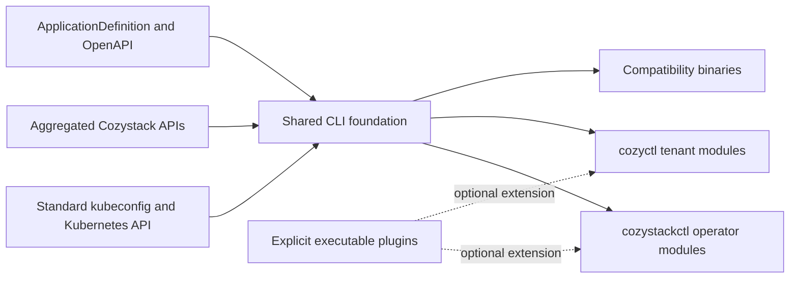

# Unified command-line interfaces for Cozystack

- **Title:** `Unified command-line interfaces for Cozystack`
- **Author(s):** `@myasnikovdaniil`
- **Date:** `2026-08-05`
- **Status:** Review

## Overview

Cozystack currently exposes several disconnected command-line tools: `cozypkg` manages platform packages, `check-readiness` reports platform reconciliation state, and an older `cozyctl` draft explored tenant and managed-application workflows. Each tool solves a real problem, but together they do not form a coherent interface, share common behavior, or give operators and tenants a clear entry point.

This proposal introduces two primary, modular CLIs: `cozystackctl` for platform operators and `cozyctl` for tenants. The binaries share Kubernetes client, discovery, schema, output, waiting, and plugin infrastructure, while exposing separate command trees and privilege boundaries. Existing tools remain as compatibility entry points backed by the same implementation during migration.

## Scope and related proposals

This proposal defines the product boundaries, command organization, discovery model, extension model, and migration path for Cozystack command-line interfaces. Exact leaf commands and service-specific workflows may evolve during implementation as long as they preserve these boundaries.

The proposal builds on the existing aggregated Cozystack API and `ApplicationDefinition` model. It does not require application packages to adopt a new API before generic tenant workflows can be implemented. Declarative metadata for service-specific actions, if needed, is follow-up API work.

## Context

Cozystack is Kubernetes-native, but its operational workflows are specific to Cozystack and are not generally portable to arbitrary Kubernetes clusters. Requiring users to understand the underlying `Package`, Flux, HelmRelease, namespace, Secret, and Service representations exposes implementation details and makes common workflows unnecessarily difficult.

The current tools cover separate parts of this surface:

- [`cozypkg`](https://github.com/cozystack/cozystack/tree/main/cmd/cozypkg) installs and removes `Package` resources, lists available and installed packages, and renders package dependency graphs. Future repository management naturally belongs beside these commands.
- [`check-readiness`](https://github.com/cozystack/cozystack/tree/main/cmd/check-readiness) checks Cozystack, Flux, and Kubernetes resources and supports one-shot, watch, and blocking wait modes.
- The older `cozyctl` draft explored tenant and managed-application actions, but it does not represent the current API or a maintained user interface.

The current implementation also provides the primitives needed for a dynamic user CLI:

- The [aggregated API server](https://github.com/cozystack/cozystack/blob/main/pkg/apiserver/apiserver.go) registers application resources dynamically under `apps.cozystack.io`.
- [`ApplicationDefinition`](https://github.com/cozystack/cozystack/blob/main/api/v1alpha1/applicationdefinitions_types.go) publishes kind, singular and plural names, OpenAPI schema, descriptions, categories, tags, and selectors for related resources.
- The API server publishes dynamic OpenAPI v2 and v3 schemas, so a client can validate and explain application specifications without compiling every application type into the binary.

### The problem

An operator has to know which independent tool or raw Kubernetes resource implements each task. The tools load cluster configuration and format output differently, cannot be extended through a common module system, and are released as unrelated interfaces even though they all target the same platform.

A tenant has the opposite problem: raw `kubectl` exposes too much Kubernetes and Cozystack implementation detail while providing too little application-oriented guidance. A user should be able to discover which managed services are available, create an instance from its schema, wait for it, and retrieve its endpoints or credentials without knowing how the application maps to HelmRelease, Service, Secret, or namespace objects.

Combining both audiences into one command tree would not solve this. Operators and tenants use different APIs, carry different privileges, need different safety defaults, and understand different nouns. A single binary would either expose irrelevant privileged commands to tenants or bury operator workflows below an artificial mode switch.

## Goals

- Provide one documented CLI entry point for Cozystack platform operators and one for Cozystack tenants.
- Make the operator CLI capable of absorbing `cozypkg`, readiness, diagnostics, tenant administration, and future package-repository workflows as modules.
- Make the tenant CLI discover application kinds available on the connected cluster at runtime and provide generic CRUD, validation, waiting, and related-resource inspection for them.
- Keep both CLIs scriptable through stable machine-readable output, predictable exit codes, and consistent global flags.
- Reuse the Kubernetes authentication and authorization model without introducing a parallel credential store or privilege mechanism.
- Preserve existing automation using `cozypkg` and `check-readiness` during a documented compatibility period.
- Allow first-party and external functionality to extend the command trees without adopting a platform-specific Go plugin ABI.

### Non-goals

- Replacing `kubectl` for arbitrary Kubernetes resource management.
- Replacing GitOps as the source of truth for platform configuration or upgrades.
- Hiding or bypassing Kubernetes RBAC.
- Generating arbitrary service-specific workflows such as database shells, VM consoles, or kubeconfig retrieval from JSON schema alone.
- Automatically downloading or executing plugins advertised by a cluster, `ApplicationDefinition`, package, or package repository.
- Defining every final command and flag before the first implementation proves the shared runtime.
- Making these tools portable to non-Cozystack clusters.

## Design

### 1. Two binaries and one shared foundation

The primary binaries are:

| Binary | Audience | Owns |
|---|---|---|
| `cozystackctl` | Platform operators | Platform health, packages, repositories, tenants, diagnostics, and operator-only workflows |
| `cozyctl` | Tenants and managed-service users | Context and tenant selection, service catalog, managed applications, endpoints, credentials, and user workflows |

Both binaries are built from the Cozystack repository and share internal modules rather than invoking each other or shelling out to legacy tools. A proposed source layout is:

```text
cmd/
├── cozystackctl/
├── cozyctl/
├── cozypkg/                 # compatibility entry point
└── check-readiness/         # compatibility entry point
internal/cli/
├── client/                  # kubeconfig, context, discovery clients
├── config/                  # local non-secret preferences
├── discovery/               # API resources and OpenAPI schemas
├── output/                  # table, JSON, YAML and terminal behavior
├── wait/                    # condition watching and timeout behavior
├── plugin/                  # executable plugin discovery
├── admin/                   # cozystackctl command modules
└── user/                    # cozyctl command modules
```

First-party modules register commands statically at build time. The source layout is internal because command-module APIs do not need to become a supported Go SDK.



### 2. Operator CLI

`cozystackctl` is the platform-level interface. Its interaction model should resemble `talosctl`: explicit cluster context, resource-oriented operations, deterministic output, strong status and watch behavior, and no assumption that an interactive dashboard is available.

The initial command organization is:

```text
cozystackctl
├── status
├── package
│   ├── list
│   ├── install
│   ├── uninstall
│   └── graph
├── repository
│   ├── list
│   ├── add
│   ├── remove
│   └── sync
├── tenant
│   ├── list
│   └── describe
├── diagnostics
│   └── collect
├── version
└── completion
```

`cozystackctl status` absorbs the behavior of `check-readiness`, including one-shot checks, `--watch`, `--wait`, `--timeout`, core-only checks, namespace and selector filters, and human-readable condition messages. The long-term implementation should use Kubernetes clients directly so the binary does not require a separate `kubectl` executable, while preserving sequential fetching as the safe default during upgrades.

`cozystackctl package` absorbs `cozypkg`. User-facing verbs become `install` and `uninstall`; compatibility aliases may retain `add` and `del`. Package dependency resolution, confirmation, file input, variants, installed/available views, and graph output are implemented once and shared with the `cozypkg` compatibility binary.

`cozystackctl repository` is reserved for registering and managing additional package repositories. Its resource and trust model must be designed with the package-repository feature; this proposal reserves the user-facing boundary but does not invent a repository API.

The operator CLI may understand platform implementation resources such as `Package`, `PackageSource`, Flux resources, and relevant Kubernetes internals. It should not reproduce generic `kubectl get`, `apply`, or `delete` behavior.

### 3. Tenant CLI

`cozyctl` is an application-oriented cloud CLI. It should expose tenant and managed-service concepts while using the same API and schemas as the dashboard.

The stable generic command tree is:

```text
cozyctl
├── context
│   ├── list
│   ├── use
│   └── current
├── tenant
│   ├── list
│   └── use
├── catalog
│   ├── list
│   └── describe <type>
├── app
│   ├── list [type]
│   ├── get <type> <name>
│   ├── create <type> <name>
│   ├── update <type> <name>
│   ├── delete <type> <name>
│   ├── wait <type> <name>
│   └── resources <type> <name>
├── version
└── completion
```

Example workflows are:

```console
cozyctl catalog list
cozyctl catalog describe postgresql
cozyctl app create postgresql production -f postgres.yaml
cozyctl app wait postgresql production
cozyctl app resources postgresql production
```

The CLI discovers available application types from Kubernetes API discovery and enriches them with `ApplicationDefinition` metadata and OpenAPI. Generic commands operate on unstructured objects through a dynamic client, so installing a package that adds a new application type makes it available without releasing a new CLI.

Discovered application types remain arguments below stable commands rather than becoming arbitrary root commands. This prevents collisions with built-in commands, keeps documentation and scripts stable across clusters with different catalogs, and lets completion query the active cluster only where dynamic values are expected.

Generic discovery provides:

- Catalog listing and descriptions.
- Kind, singular, plural, and alias resolution.
- Schema-aware input validation and field explanation.
- CRUD using the verbs advertised by API discovery.
- Readiness and workload-condition waiting.
- Inspection of related workloads, Services, ingresses, and tenant-visible Secrets selected by `ApplicationDefinition`.

The server remains authoritative. Client-side schema validation improves feedback but does not replace server-side validation, defaulting, admission, or RBAC.

### 4. Service-specific capabilities

Some workflows cannot be inferred safely from discovery and OpenAPI. Examples include opening a VM console, retrieving a managed Kubernetes kubeconfig, establishing a database shell, or selecting the correct credential and endpoint among multiple related resources.

These workflows are explicit capability modules. First-party capabilities are compiled into `cozyctl` and enabled only when their required application kind and API capability are present. Illustrative commands are:

```console
cozyctl virtual-machine console workstation
cozyctl kubernetes kubeconfig development
cozyctl postgresql connect production
```

Before adding per-application conditionals to the CLI, implementation should determine whether the workflow can be expressed through reusable capability metadata. If metadata is introduced, it describes declarative actions and referenced resources; it never contains executable code or shell fragments.

### 5. Configuration and context

Both CLIs use standard Kubernetes client loading, including `--kubeconfig`, `KUBECONFIG`, the default kubeconfig path, and `--context`. Authentication remains in kubeconfig and supported client-go authentication plugins.

CLI-specific configuration may store non-secret preferences such as the selected profile, context, tenant, default output format, and color behavior under the platform-appropriate XDG configuration directory. It references kubeconfig entries rather than copying tokens or client certificates.

`cozyctl tenant use` changes only the local selected tenant. Every command also accepts an explicit `--tenant` for scripts. The CLI resolves the selection to the tenant-facing API/namespace model and verifies access through normal API requests; it does not grant access or rewrite cluster RBAC.

### 6. Output and automation contract

Both CLIs follow one output contract:

- Human-readable tables are the default on an interactive terminal.
- `--output=json` and `--output=yaml` provide machine-readable representations sourced from API objects.
- Table columns may grow; scripts must use machine-readable output rather than parsing tables.
- Color is disabled automatically when output is not a terminal and can be disabled explicitly.
- Mutating commands support consistent confirmation and non-interactive flags.
- Wait commands use consistent duration syntax, condition reporting, and exit codes.
- Partial discovery or list failures are reported explicitly and produce a non-zero exit code; the CLI never silently omits an application type.
- Errors go to stderr and structured results go to stdout.

### 7. Extension model

First-party functionality uses statically compiled modules. If an external extension point is needed, the CLI follows the executable discovery model established by `kubectl`:

- `cozystackctl foo` may resolve an executable named `cozystackctl-foo` on `PATH`.
- `cozyctl foo` may resolve an executable named `cozyctl-foo` on `PATH`.
- Remaining arguments are passed to the executable without a Go ABI dependency.
- Plugin lookup never shadows a built-in command.
- Plugins are installed explicitly by the user or system administrator.

The initial implementation does not need to publish a broad plugin protocol beyond executable naming and argument forwarding. Context propagation, capability advertisement, completion, and version negotiation should be specified only when there is a real external plugin consumer.

Package repositories and `ApplicationDefinition` resources may extend the catalog through data and schemas, but they never trigger plugin download or execution. This separation prevents a cluster administrator or compromised repository from turning harmless CLI discovery into code execution on a user's workstation.

### 8. Compatibility binaries

`cozypkg` and `check-readiness` remain buildable and releasable during migration. They become thin entry points over shared command implementations rather than subprocess wrappers around `cozystackctl`.

Compatibility behavior includes existing command names, flags, exit codes, and output where scripts reasonably depend on them. New functionality is documented under `cozystackctl`; compatibility binaries receive fixes but need not expose every new module.

The older `cozyctl` draft is evaluated command by command. Useful user workflows may be ported, but its internal structure and command names are not automatically treated as a compatibility contract unless they were part of a supported release.

## User-facing changes

Operators gain one discoverable interface for platform-specific operations and no longer need to choose between unrelated utilities. The initial visible additions are `cozystackctl status` and `cozystackctl package`, with existing binaries continuing to work.

Tenants gain a cloud-style CLI that lists the catalog exposed by their cluster and manages applications using the same API, schema, and RBAC as the dashboard. Application packages added from extra repositories appear automatically in generic catalog and application commands.

Documentation presents `cozystackctl` as the operator interface, `cozyctl` as the tenant interface, and `kubectl` as the escape hatch for raw Kubernetes inspection.

## Upgrade and rollback compatibility

The first phases are client-only refactoring and new binaries; they do not change cluster APIs or persisted resources. Rolling back a CLI release restores the old client without requiring cluster migration.

`cozypkg` and `check-readiness` stay available for at least one documented deprecation window after equivalent `cozystackctl` commands become stable. Deprecation warnings must not corrupt machine-readable stdout. Removal requires release notes, documentation updates, and evidence that release packaging and common automation have migrated.

Generic `cozyctl` commands negotiate capabilities through API discovery. A newer client connected to an older cluster exposes only supported operations and reports missing required API groups clearly. An older client continues to operate on known resources because the server-side Kubernetes API remains the compatibility boundary.

If future service-specific capabilities require new API metadata, clients treat missing metadata as an unavailable optional action rather than failing generic application management.

## Security

- Neither CLI adds privileges. Every operation is authorized by Kubernetes RBAC using the caller's existing credentials.
- Operator-only commands live in a separate binary and fail normally when the caller lacks the required permissions.
- CLI profiles do not copy or persist bearer tokens, private keys, or client certificates outside kubeconfig.
- Tenant-visible related resources are obtained through tenant-facing APIs and existing `ApplicationDefinition` selectors; the CLI does not bypass Secret filtering by reading implementation namespaces directly.
- Discovery metadata, OpenAPI descriptions, resource names, and condition messages are treated as untrusted text and are never evaluated as shell code.
- External plugins are found only on the local `PATH`, never downloaded or executed because a cluster or repository advertises them.
- Built-in commands take precedence over plugin names, preventing a plugin from intercepting a security-sensitive built-in workflow.
- Diagnostics must redact Kubernetes Secrets, credentials, tokens, private keys, and kubeconfig payloads by default. Any opt-in inclusion of sensitive data requires an explicit warning and separate design review.

## Failure and edge cases

- **Cozystack API discovery is unavailable** → static help, version, and configuration commands remain usable; cluster-dependent commands fail with the affected API group and underlying error.
- **One discovered application kind cannot be listed** → `cozyctl app list` reports the kind-specific failure, returns non-zero, and marks output incomplete instead of silently omitting it.
- **An application type is removed between completion and execution** → the command returns a normal API not-found/discovery error and suggests refreshing the catalog.
- **Local OpenAPI is stale or differs from server admission** → server validation wins and its status/error is returned; client validation is advisory.
- **A caller can discover a kind but cannot perform the requested verb** → the API returns `Forbidden`; the CLI identifies the resource and requested operation without suggesting privilege bypasses.
- **The selected tenant no longer exists or access was revoked** → commands fail closed and require selecting another accessible tenant.
- **A plugin is absent** → the CLI reports an unknown command and the expected executable name; it does not attempt network installation.
- **A plugin name collides with a new built-in command after upgrade** → the built-in command wins; the CLI can provide a diagnostic command to show command resolution.
- **`cozystackctl status --wait` observes an API restart** → transient watch failures are re-established within the original deadline; the timeout is not reset.
- **A compatibility binary and `cozystackctl` are different versions** → each reports its own client version; no binary shells out to the other, avoiding path-dependent behavior.

## Testing

- **Unit:** command-module registration, global flag consistency, context selection, output encoders, exit-code mapping, duration parsing, condition evaluation, and plugin resolution precedence.
- **Compatibility golden tests:** existing `check-readiness` fixtures run against both the compatibility entry point and the shared status implementation; `cozypkg` command aliases and graph output retain their documented behavior.
- **Discovery integration:** a fake discovery/OpenAPI server adds and removes application kinds dynamically; catalog, completion, generic CRUD, validation, and incomplete-list errors are asserted without recompiling the client.
- **RBAC integration:** operator, tenant-admin, tenant-viewer, and unauthorized identities see successful and forbidden workflows matching their server permissions.
- **API compatibility:** newest client against supported older clusters and supported older client against newest cluster for generic operations.
- **Plugin tests:** built-ins cannot be shadowed, missing plugins do not trigger downloads, arguments are forwarded exactly, and malicious discovery strings are never executed.
- **E2E:** install an additional application package, verify it appears in `cozyctl catalog`, create an instance, wait for readiness, inspect related resources, and delete it using only tenant-facing APIs.

## Rollout

1. **Shared foundation.** Extract Kubernetes configuration, output, waiting, and reusable command logic from `cozypkg` and `check-readiness` without changing their supported interfaces.
2. **Operator CLI minimum viable product.** Ship `cozystackctl status`, `cozystackctl package`, version, completion, and common global flags. Continue publishing compatibility binaries.
3. **Tenant CLI minimum viable product.** Ship context and tenant selection, catalog discovery, generic application CRUD, schema validation, waiting, and related-resource inspection.
4. **Operator expansion.** Add repository management when its API is designed, tenant administration, and redacted diagnostics collection.
5. **Service capabilities.** Add the first explicit workflows such as VM console or managed Kubernetes kubeconfig retrieval and use them to validate any capability-metadata design.
6. **External extension point.** Publish the executable plugin contract only when a real external consumer requires it.
7. **Compatibility review.** After adoption and a documented deprecation window, decide separately whether `cozypkg` and `check-readiness` should remain focused aliases or be removed from release assets.

## Open questions

1. **Operator binary name.** This proposal recommends `cozystackctl` because it is explicit and pairs naturally with `talosctl`; is the length acceptable, or should a shorter operator-specific name such as `cozyadm` be preferred?
2. **Compatibility lifetime.** Should `cozypkg` remain a permanently supported focused package-manager entry point, or should it be removed after `cozystackctl package` adoption?
3. **Profiles versus kubeconfig namespaces.** Should `cozyctl tenant use` maintain an XDG profile independent of kubeconfig, or create/select kubeconfig contexts whose namespace represents the tenant?
4. **Capability metadata.** Which service-specific actions are common enough to represent declaratively in `ApplicationDefinition`, and which should remain compiled modules?
5. **Plugin timing.** Is executable plugin discovery needed in the first stable CLI release, or should command modularity remain internal until an external package repository demonstrates the need?

## Alternatives considered

**One binary with operator and tenant subcommands.** A single `cozyctl admin ...` and `cozyctl app ...` tree reduces the number of release assets but mixes privilege domains and user mental models. Tenants would discover irrelevant commands, while operator automation would inherit user-oriented context and safety behavior. Separate binaries with shared code provide reuse without conflating audiences.

**Keep independent tools.** Continuing to grow `cozypkg`, `check-readiness`, and application-specific tools avoids migration work but preserves duplicated configuration, output, release, and documentation behavior. It also gives future repository and diagnostic features no obvious home.

**Use only a `kubectl` plugin.** Publishing `kubectl-cozystack` would reuse the `kubectl` entry point, but it would make the Cozystack product surface subordinate to kubectl's command and flag conventions and would not solve the operator-versus-tenant split. An optional alias can be added later, but it should not be the primary interface.

**Generate every application type as a root command.** Commands such as `cozyctl postgresql` are attractive and cloud-like, but runtime-generated root commands collide with built-ins and make help, documentation, completion, and scripts cluster-dependent. A stable `catalog` and `app <type>` hierarchy preserves runtime discovery without destabilizing the command tree. Explicit high-value capability modules may still use service-oriented root commands.

**Compile all application schemas and clients into `cozyctl`.** Generated typed clients improve compile-time safety but require a CLI release for every catalog change, including applications from extra repositories. Dynamic clients plus server-published OpenAPI match the existing API architecture and keep the server authoritative.

**Use Go shared-object plugins.** Go plugins have platform, toolchain, and dependency compatibility constraints and are unsuitable for a cross-platform CLI contract. Executable plugins provide process isolation and independent implementation languages.

**Automatically install plugins from package repositories.** Coupling catalog discovery to workstation code execution creates a supply-chain boundary far larger than package installation in the cluster. Repositories may supply schemas and declarative metadata, while executable installation remains explicit and locally controlled.

---

<!-- Inspired by KubeVirt enhancement proposals and Kubernetes Enhancement Proposals (KEPs). -->
