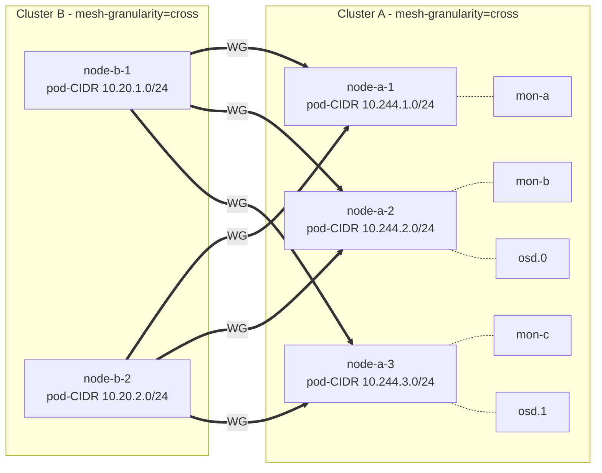

# Cross-cluster mesh for tenant access to host-cluster services

- **Title:** `Cross-cluster mesh for tenant access to host-cluster services`
- **Author(s):** `@kvaps`
- **Date:** `2026-05-04`
- **Status:** Draft
- **Upstream:** Implementation will live as an independent project under the [kilo-io](https://github.com/kilo-io) GitHub organization. Kilo maintainer [@squat](https://github.com/squat) has confirmed interest in upstreaming this functionality, on the condition that the controller and its CRD are framed as a generic *cluster-to-cluster mesh* primitive ("ClusterMesh") rather than as a Cozystack/tenant-specific construct. This proposal has been adjusted accordingly.

## Overview

This proposal describes a generic controller-driven approach for connecting two or more Kubernetes clusters into a flat node-to-node WireGuard mesh, using Kilo's `mesh-granularity=cross` topology. The controller — provisionally named **`kilo-clustermesh`** — is intended to live as an independent project in the `kilo-io` organization and to be reusable outside Cozystack.

The motivating use case for this design is exposing a Rook-managed Ceph cluster running in a Cozystack host cluster so that pods inside Cozystack-managed tenant clusters can consume RBD, CephFS, and Ceph Object Gateway storage as if it were local. However, the controller itself does not know about Cozystack tenants. From its point of view, a `ClusterMesh` resource declares a set of peer clusters (referenced via Secrets holding kubeconfigs) that should be linked together; tenancy semantics are entirely a concern of whatever system creates those resources.

The design favours a fully-meshed node-to-node topology over the conventional single-gateway model, because Ceph clients require direct L3 connectivity to many backend pods (monitors, OSDs, MDS) and the throughput profile is incompatible with funneling all traffic through one pair of gateways. The controller is responsible for keeping the mesh consistent: creating and removing `Peer` CRDs in every participating cluster as nodes come and go, validating address space, and enforcing trust boundaries through the choice of which kubeconfigs are held where.

## Context

### The problem

> *As a Cozystack operator, I have a cluster running Ceph (managed by Rook) and I want to make it available for consumption by pods inside the tenant Kubernetes clusters that Cozystack manages.*

Ceph access from outside the cluster is structurally different from accessing a typical microservice. A `ceph-csi` client needs simultaneous L3 connectivity to:

- Every monitor pod (typically 3–5), addressed individually — clients query monitors directly to obtain the cluster map.
- Every OSD pod — reads and writes are routed by the client to a specific OSD chosen by the CRUSH algorithm, not to a load balancer.
- Every MDS pod for CephFS workloads.

This is a stateful workload pattern with headless services and direct pod-IP access. Standard cross-cluster mechanisms designed around a single ingress (LoadBalancer Service, single gateway pair) either do not work at all (cannot expose all pod IPs) or introduce a throughput bottleneck on the gateway nodes.

Additionally, in deployments where one cluster is treated as the trusted side (e.g. a Cozystack host) and others are not (e.g. tenant clusters running on nodes outside the platform operator's control), the connectivity solution must preserve a strict trust boundary: a compromised remote node must not be able to manipulate routing in the trusted cluster, claim CIDRs it does not own, or affect other peers.

### Existing primitives

- A typical deployment already runs Kilo (in Cozystack: for intra-cluster encryption).
- Whoever creates `ClusterMesh` resources is expected to hold (or be able to fetch) admin-level kubeconfigs for every cluster that should join the mesh, and to materialise them as Secrets that the controller can consume. In the Cozystack case, the host control plane already has admin-level kubeconfig access to every tenant cluster.
- Kilo PR [#328](https://github.com/squat/kilo/pull/328) introduces a third mesh granularity, `cross`, in which each node is its own topology segment but WireGuard tunnels are only built between segments in different logical locations. Within the same location, traffic flows over the existing CNI without WG overhead. The PR is currently unmerged upstream; the upstreaming effort for the controller and for `mesh-granularity=cross` will be coordinated.

### Upstream collaboration

Following discussion with Kilo maintainer [@squat](https://github.com/squat), the controller will be developed in a dedicated repository under the [kilo-io](https://github.com/kilo-io) organization rather than as a Cozystack-internal component. The two key design consequences:

1. The CRD does not contain references to tenants. Instead it accepts a map of peer clusters, each referenced by a Secret holding that cluster's kubeconfig. The Cozystack-specific notion of "tenant" lives entirely outside the controller.
2. The Cozystack control plane integrates by translating its own tenant model into `ClusterMesh` objects (one per tenant connection, in the simple deployment shape) plus the corresponding kubeconfig Secrets. See [Cozystack integration](#cozystack-integration).

## Goals

- Pods in any peer cluster can reach selected services in another peer cluster as if they were on the local network. (Cozystack use case: tenant pods reach host Ceph monitors, OSDs and MDS daemons.)
- Nodes added to or removed from any participating cluster are wired into / detached from the mesh automatically, without per-node manual configuration.
- A compromise of a peer cluster (up to and including full root on a peer node) cannot affect routing in another peer cluster beyond the network surface that was explicitly granted, and cannot affect unrelated peers.
- Failure of a single node does not break connectivity to services running on other nodes — recovery is automatic and does not require operator action or controller intervention on the data path.
- Throughput scales linearly with cluster size: there is no single gateway whose NIC or CPU becomes the bottleneck.
- No additional cluster-wide IP address space needs to be allocated specifically for the mesh; existing pod-CIDRs are sufficient.

### Non-goals

- Cross-cluster service discovery (DNS, mirrored Services). This is a separate concern; for the Ceph use case it is unnecessary because Ceph clients receive endpoint lists from the monitors directly.
- Replacing the CNI in any participating cluster. Each cluster continues to run its preferred CNI; Kilo only adds the cross-cluster encryption fabric.
- Supporting peers whose pod-CIDR overlaps with another peer's pod-CIDR. Disjoint pod-CIDRs are a precondition.
- Cozystack-specific tenant policy. Whether and how a particular tenant gets a `ClusterMesh` object is decided by Cozystack control-plane logic outside the controller.

## Design

### Topology

Every participating cluster runs Kilo with `--mesh-granularity=cross`. In this mode every node is a topology segment of one. Within a single logical location (e.g. all nodes inside one cluster) traffic uses the underlying CNI without WireGuard. Across logical locations every node holds a direct WireGuard tunnel to every node in the other location.

For a `ClusterMesh` connecting two clusters, the result is a full bipartite mesh: every node in cluster A has a tunnel to every node in cluster B, and vice versa. The number of tunnels is `N × M` where N and M are the node counts of the two clusters; this is intentional and is what enables the throughput and HA properties described below. (For a `ClusterMesh` with more than two members the same relation holds pairwise: every node in every cluster has a tunnel to every node in every other cluster in the mesh.)

### Why cross-mesh works naturally for Ceph

Rook is configured to run Ceph daemons on the **pod network** (not the host network). Each Ceph monitor, OSD or MDS pod therefore has an IP allocated from the pod-CIDR of the specific node where the pod is currently running. Each node's per-node pod-CIDR slice is registered as the `allowedIPs` of that node's `Peer` object on the remote side.

WireGuard cryptokey routing on the remote side selects the correct Peer based on destination IP: a packet to a monitor on `host-node-3`'s pod-IP matches the Peer for `host-node-3` and is encrypted to that node's WG endpoint, sent there directly. Traffic flows remote-node-X → host-node-3 with no intermediate hop.

When `host-node-3` fails, Rook reschedules its Ceph daemons on a surviving node, say `host-node-7`. The new pods receive new IPs from `host-node-7`'s pod-CIDR. The remote side continues to send traffic for the new IPs through the live `host-node-7` Peer. There is no controller-driven failover step on the data path: the routing change is implicit in the IP allocation policy of Kubernetes itself.



### Controller (`kilo-clustermesh`)

A standalone controller, distributed by the `kilo-io` organization. It runs in one of the participating clusters (the "controller cluster") and uses kubeconfig Secrets to reach every other cluster listed in a `ClusterMesh`. It manages the lifecycle of `Peer` CRDs in every cluster in the mesh.

#### CRD: `ClusterMesh`

```yaml
apiVersion: kilo.squat.ai/v1alpha1
kind: ClusterMesh
metadata:
  name: example-mesh
  namespace: kilo
spec:
  clusters:
    cluster-a:
      # The controller's own cluster — no kubeconfig needed.
      local: true
      allowedNetworks:
        - 10.244.0.0/16        # pod-CIDR
        - 10.96.0.0/12         # service-CIDR (optional, if the cluster wants to expose it)
    cluster-b:
      kubeconfigSecretRef:
        name: cluster-b-kubeconfig
        key: kubeconfig
      allowedNetworks:
        - 10.20.0.0/16
status:
  clusters:
    cluster-a:
      registeredPeers: 5
      skippedNodes: 0
    cluster-b:
      registeredPeers: 12
      skippedNodes: 0
  conditions:
    - type: Ready
      status: "True"
    - type: NetworksNotAllowed
      status: "False"
    - type: NetworksOverlap
      status: "False"
```

WG-CIDRs are deliberately absent from the spec — they are validated against a separate controller-level allowlist (see [WireGuard address allowlist](#wireguard-address-allowlist)), not declared per-mesh.

The `spec.clusters` field is a map keyed by an arbitrary cluster identifier. Each entry references a Secret holding a kubeconfig (`kubeconfigSecretRef`) and declares `allowedNetworks` — the full set of CIDRs this cluster may bring into the mesh. The pod-CIDR, the service-CIDR, host-network ranges and any other reachable subnets all live in the same list; no separate `podCIDR` or `advertise` field is needed. Exactly one entry may have `local: true`, indicating the cluster the controller itself runs in (no kubeconfig required).

The CRD has no notion of tenants, hubs, spokes, owners, or trust direction. Asymmetric deployment shapes (e.g. one trusted cluster reachable by many less-trusted clusters) are expressed by the consumer of the controller through the choice of clusters they include in each `ClusterMesh` and through external RBAC on the kubeconfig Secrets.

#### Reconciliation

For each `ClusterMesh`, the controller performs validation in two layers — `ClusterMesh`-level checks that may halt the whole mesh, and per-Node checks that only skip the offending Node:

**Mesh-level (halts reconciliation on failure):**

1. Every CIDR in every `spec.clusters[*].allowedNetworks` is a subset of the controller's `--allowed-cidr` allowlist; otherwise `NetworksNotAllowed=True`.
2. The union of `allowedNetworks` across all `spec.clusters` is pairwise disjoint; otherwise `NetworksOverlap=True`.

**Per-Node (skips the Node, mesh stays Ready):**

3. `Node.Spec.PodCIDRs[0]` is a subset of that cluster's `allowedNetworks`. (Defensive validation against a tampered Node object on the remote side.)
4. `Node.kilo.squat.ai/wireguard-ip` is present, has prefix length `/32` (or `/128` for IPv6), and is a subset of the controller's `--allowed-wireguard-cidr` allowlist. (See [WireGuard address allowlist](#wireguard-address-allowlist).)
5. `Node.kilo.squat.ai/wireguard-ip` is unique among all Nodes of this cluster.

Failed per-Node checks emit a Kubernetes event on the `ClusterMesh` (`NodeOutOfRange`, `WGIPInvalid`, `WGIPDuplicate`) and increment `status.clusters[<id>].skippedNodes`. The Node simply does not appear as a `Peer` on remote sides. A tenant root that tampers with their own Node annotations can therefore only remove that one Node from the mesh — they cannot inject a Peer with arbitrary `allowedIPs` into another cluster, and they cannot affect other Nodes of the same tenant or any other `ClusterMesh`.

**Peer construction:**

6. For every ordered pair `(A, B)` of clusters in `spec.clusters`, ensure a `Peer` exists in B for each validated Node of A with: `publicKey` from `kilo.squat.ai/wireguard-public-key`, `endpoint` from `kilo.squat.ai/force-endpoint`, and `allowedIPs` = `Node.Spec.PodCIDRs[0]` ∪ `kilo.squat.ai/wireguard-ip` (the standard Kilo per-Node Peer shape). Cluster-wide CIDRs in `allowedNetworks` not covered by per-Node pod-CIDRs (e.g. service-CIDR) are attached to a single anchor Peer per cluster.
7. Remove orphaned Peer objects on every side using a label selector tied to the `ClusterMesh` name.

#### Watches

- Nodes in every cluster listed in a `ClusterMesh` (one watch per cluster, via the corresponding kubeconfig) → reconcile that `ClusterMesh`.
- `ClusterMesh` add/update/delete → reconcile that mesh.
- `Secret` referenced by `kubeconfigSecretRef` changes → re-establish the watch and reconcile.

### Key management

The controller does not generate or store WireGuard private keys. Each `kg-agent` generates its own keypair on first run, stores the private key locally, and publishes the public key as a Node annotation. The controller only reads annotations; private material never crosses the trust boundary or appears on the controller's reconcile path.

### IP allocation

No mesh-specific IP space is allocated. `Peer.allowedIPs` entries are constructed from per-Node `Node.Spec.PodCIDRs`, per-Node `kilo.squat.ai/wireguard-ip`, and any cluster-wide CIDRs declared in `spec.clusters[*].allowedNetworks` not already covered by per-Node values.

The address-related constraints are split between two allowlists, both controlled by the host-cluster operator at controller deploy time:

- `--allowed-cidr` — pools from which `spec.clusters[*].allowedNetworks` may draw (pod-CIDRs, service-CIDRs, host-network ranges).
- `--allowed-wireguard-cidr` — pools from which Kilo's `--wireguard-cidr` may draw on every participating cluster (i.e., the address space of `kilo0` interfaces).

These two allowlists must themselves be disjoint from each other. They are checked separately because the items they validate come from different sources: `allowedNetworks` is declared in the `ClusterMesh` spec, `wireguard-ip` is observed from Node annotations and reflects the actual WG-CIDR each cluster's Kilo is configured with.

The remaining constraints (already listed in [Reconciliation](#reconciliation)) are:

- All `allowedNetworks` entries across `spec.clusters` of a `ClusterMesh` must be pairwise disjoint.
- Every `Node.Spec.PodCIDRs[0]` in a cluster must be a subset of that cluster's `allowedNetworks`.
- Every `Node.kilo.squat.ai/wireguard-ip` (every cluster, every Node) must be a `/32` subset of `--allowed-wireguard-cidr` and unique within that cluster.

How disjoint CIDRs are allocated in the first place is the responsibility of whoever creates the `ClusterMesh`. In the Cozystack case, the tenant provisioning pipeline allocates a tenant pod-CIDR (from the same pool that backs `--allowed-cidr`) and a tenant WG-CIDR (from the same pool that backs `--allowed-wireguard-cidr`), then injects the tenant WG-CIDR into the tenant's `kg-agent` `--wireguard-cidr` flag at cluster-creation time.

### Subnet allowlist

The controller is configured at deploy time with two CIDR allowlists:

- **`--allowed-cidr`** (repeatable). Every CIDR appearing in `spec.clusters[*].allowedNetworks` of any reconciled `ClusterMesh` must be a subset of one of these. Out-of-allowlist entries surface `NetworksNotAllowed=True` and reconciliation halts.
- **`--allowed-wireguard-cidr`** (repeatable). Every `Node.kilo.squat.ai/wireguard-ip` (per-Node, per-cluster) must be a `/32` subset of one of these. Out-of-allowlist Nodes are skipped with `WGIPInvalid` events; the mesh stays Ready.

Rationale:

- Both allowlists live in the controller's deployment configuration, not in the `ClusterMesh` spec, so a user who can create `ClusterMesh` objects cannot widen the address surface — only the operator who owns the controller can.
- They are enforced by the controller itself, not by an admission webhook. This keeps the admission path simple and avoids webhook-availability as a dependency.
- Splitting the two allowlists separates concerns cleanly: `--allowed-cidr` bounds what services any participant can advertise (pod-CIDRs, service-CIDRs); `--allowed-wireguard-cidr` bounds where any Kilo `kilo0` interface may live across the mesh. They never overlap.

### WireGuard address allowlist

A separate allowlist for WG-IP addresses is necessary because the per-Node `kilo.squat.ai/wireguard-ip` annotation is set by `kg-agent` on the remote (potentially untrusted) side, and a compromised tenant root can tamper with it. Validating only against the cluster's own `allowedNetworks` is insufficient — it would let a tampered annotation claim addresses the host considers special (host pod-CIDR, host service-CIDR, host's own `kilo0` range) as long as those are not declared in the tenant's `allowedNetworks`.

By validating every observed `wireguard-ip` against `--allowed-wireguard-cidr` (a pool the host-admin reserved exclusively for `kilo0` interfaces of mesh participants), the host gains a hard guarantee:

> No `Peer` is ever written on the host side with `allowedIPs` containing an address outside the host-admin-approved address pools, regardless of what any tenant's `kg-agent` publishes.

This is the structural protection that lets us safely include WG-IP in `Peer.allowedIPs` (the standard Kilo workflow) while keeping cross-cluster diagnostics (e.g., pinging a remote `kilo0`) functional.

Allocation pattern in Cozystack:

- Host's Kilo runs with `--wireguard-cidr=<host-WG>`, where `<host-WG>` is one of the values passed to `--allowed-wireguard-cidr`.
- Tenant provisioning allocates a per-tenant `<tenant-WG>` from a tenant WG-pool and configures the tenant's `kg-agent --wireguard-cidr=<tenant-WG>`. The tenant WG-pool is also passed to `--allowed-wireguard-cidr`.
- Tenant pod-CIDRs are similarly allocated from the tenant pod-pool, which is passed to `--allowed-cidr`.

## Cozystack integration

This proposal describes the upstream controller that will live in `kilo-io`. Its consumption inside Cozystack is a separate concern.

This integration also has to fit alongside the [`kubernetes-nodes-split`](https://github.com/cozystack/community/pull/8) proposal, which reshapes a tenant cluster from a single `kubernetes` HelmRelease into `1 × kubernetes` (Kamaji control-plane only) + `N × kubernetes-nodes` HelmReleases (one per pool, possibly across different locations and backends — `kubevirt-kubeadm`, `kubevirt-talos`, `cloud-talos-hetzner`, `cloud-talos-azure`). The mesh must work uniformly across this layout.

The integration shape is:

- The host-cluster admin deploys `kilo-clustermesh` with two allowlists:
    - `--allowed-cidr` = host pod-CIDR + global tenant pod-CIDR pool + any other CIDRs Cozystack means to expose (e.g. host service-CIDR if in-cluster Vault is published).
    - `--allowed-wireguard-cidr` = host WG-CIDR + global tenant WG-CIDR pool.

  These two allowlists are the single chokepoint that bounds every Peer the controller will ever write, and they are owned by the host admin, not by tenant-provisioning code.
- RBAC in the host cluster grants `kilo.squat.ai/Peer` access **only** to the controller's ServiceAccount. Tenant-provisioning, the dashboard, and cluster admins can create and read `ClusterMesh` objects (high-level intent) but cannot write `Peer` directly.
- A tenant cluster is identified at the `kubernetes` HelmRelease level. The kubeconfig issued by the Kamaji control-plane is the single source of truth for that tenant, regardless of how many `kubernetes-nodes` HelmReleases are attached or which backends they use.
- The existing tenant provisioning pipeline (a) allocates a tenant pod-CIDR from the pod-pool that backs `--allowed-cidr`, (b) allocates a tenant WG-CIDR from the WG-pool that backs `--allowed-wireguard-cidr` and injects it into the tenant's `kg-agent --wireguard-cidr`, (c) fetches the Kamaji-issued kubeconfig scoped to a minimal Role (read `Node`, full access on `Peer`), and stores it as a Secret in the host cluster.
- For each tenant that should connect to host services, Cozystack creates **one** `ClusterMesh` object in the host cluster with two entries in `spec.clusters`: the host (with `local: true`) and the tenant (referencing the Secret). Each entry's `allowedNetworks` is filled from values guaranteed to be subsets of `--allowed-cidr` — for tenants, the pod-CIDR allocated by the provisioning pipeline; for host, the pre-approved host CIDR(s).
- One `ClusterMesh` per tenant is sufficient even when the tenant spans multiple locations and backends — the controller's per-cluster Node watch picks up every worker node regardless of which `kubernetes-nodes` pool created it (CAPI-managed KubeVirt VM, autoscaled Hetzner server, autoscaled Azure VMSS instance, etc.) as long as the worker is registered against the tenant kube-apiserver and runs `kg-agent`.
- New tenant pools added later (additional `kubernetes-nodes` HelmReleases for new locations) require no `ClusterMesh` changes: their nodes are observed by the same watch and reconciled into Peers automatically.
- A new managed-service entry exposes Ceph RBD/CephFS storage classes that work transparently inside connected tenant clusters.
- The dashboard surfaces the `ClusterMesh` state (Ready / NetworksNotAllowed / NetworksOverlap / partial connectivity) on the tenant cluster page.

No tenant-aware logic lives in the controller itself. All tenancy semantics — quotas, lifecycle, who is allowed to attach to which host — are enforced upstream of the `ClusterMesh` object by Cozystack.

### Implications for `kubernetes-nodes` backends

- **`kubevirt-kubeadm` / `kubevirt-talos`** — workers run as KubeVirt VMs on host nodes. Their pod-CIDRs are inside the tenant pod-CIDR; `kg-agent` runs as part of the tenant Kilo deployment; nothing backend-specific is needed.
- **`cloud-talos-hetzner` / `cloud-talos-azure`** — workers run as cloud VMs outside the host cluster. They join the tenant kube-apiserver over the public internet and run `kg-agent` like any other tenant node. The mesh reaches them via their `force-endpoint` annotation (cloud public IP); no special-casing in the controller.
- The Talos `machineconfig` template used by `cloud-talos-*` backends must include the bits needed for `kg-agent` (Kilo's kernel modules / WireGuard interface). This is a `kubernetes-nodes` concern, not a `ClusterMesh` concern, but it needs to be tracked alongside the mesh rollout.

## Upgrade and rollback compatibility

The feature is opt-in: clusters without a `ClusterMesh` are unaffected. Existing installations continue to operate identically until the controller and CRD are deployed.

Rollback path: deleting a `ClusterMesh` triggers the controller to remove all corresponding Peer objects in every participating cluster. Existing tunnels tear down cleanly within Kilo's reconcile interval.

The feature requires Kilo with `--mesh-granularity=cross`. The intent is to land that as part of the same upstream effort tracked in PR #328.

## Security

The trust model rests on a single primary boundary plus a set of supporting controls.

### Primary boundary: cryptokey routing on the host side

The host's exposure to any tenant peer is bounded **exclusively** by the `allowedIPs` field of the corresponding `Peer` object on the host side. WireGuard's cryptokey routing enforces this at kernel level:

- **On receive**: a packet decrypted with a peer's key is dropped before it reaches the network stack if its source IP is not in that peer's `allowedIPs`.
- **On send**: a packet leaves through the WG tunnel of the peer whose `allowedIPs` covers its destination, or via normal routing if no peer matches; the host never speaks WG with a destination outside the union of `allowedIPs` of its peers.

Anything a tenant root does to its own `kilo0` interface, local routing tables, kg-agent configuration, or post-reconcile annotations cannot widen this bound, because the host enforces it independently of any sender-side state. The entire job of the controller and its allowlists is therefore reduced to one question: *what `allowedIPs` does the host's `Peer` object end up with?*

### Supporting controls

- **Controller monopoly on `Peer`.** RBAC in every participating cluster grants `create/update/patch/delete` on `kilo.squat.ai/Peer` **only** to the controller's ServiceAccount (in the local cluster) or to the user the controller authenticates as via the cluster's kubeconfig (in remote clusters). No other principal — tenant-provisioning, dashboard, cluster admins, any other host-cluster component — has rights on `Peer`. A compromise of an unrelated host component therefore cannot directly write into the mesh routing surface.
- **In tenant clusters**, the kubeconfig stored in the host-cluster Secret is bound to a minimal Role: read on `Node`, full access on `kilo.squat.ai/Peer`, nothing else. A leaked tenant kubeconfig of this kind cannot exfiltrate tenant data or alter tenant workloads.
- **`--allowed-cidr` allowlist** bounds what `spec.clusters[*].allowedNetworks` can ever declare; a user who can author `ClusterMesh` objects cannot widen the address surface beyond what the host admin pre-approved.
- **`--allowed-wireguard-cidr` allowlist** bounds which addresses can appear in `kilo.squat.ai/wireguard-ip` annotations and therefore in `Peer.allowedIPs` for the per-Node WG-IP slot. This is what protects the host from a tenant root forging an annotation that points at, say, the host's service-CIDR.
- **Trust direction by kubeconfig placement.** Whichever cluster holds the controller and the kubeconfig Secrets is the side that drives writes; the side whose kubeconfig is held cannot write back. In Cozystack, only the host holds tenant kubeconfigs — trust flows host → tenant.
- **Cross-mesh isolation.** Each `ClusterMesh`'s Peers are labelled with the mesh name; the controller never deletes or modifies Peers belonging to a different mesh, and `allowedNetworks` overlap between meshes (not just within a single mesh) is rejected.

### Tenant-cluster compromise (full root on a tenant node)

A tenant attacker can do exactly the following, and no more:

- **Tamper with their own Node annotations.** A tenant Node whose `kilo.squat.ai/wireguard-ip` falls outside `--allowed-wireguard-cidr`, or whose `Node.Spec.PodCIDRs[0]` falls outside the cluster's `allowedNetworks`, is **skipped** by the controller — it does not appear as a `Peer` on the host side. The tenant has effectively removed *that one Node* from the mesh; no Peer with attacker-chosen `allowedIPs` is ever written on the host. Other Nodes of the same tenant continue to work.
- **Tamper with their own `kg-agent` post-reconcile.** Adding rogue IPs to `kilo0`, changing routes, modifying iptables — all confined to the tenant's own host. The host enforces `allowedIPs` independently (see [Primary boundary](#primary-boundary-cryptokey-routing-on-the-host-side)).
- **Rotate keypairs.** Republish a different `kilo.squat.ai/wireguard-public-key`. The controller will update the corresponding host-side Peer on the next reconcile. The result is equivalent to "the tenant generated a new legitimate keypair" — no escalation, only the (legitimate) ability to change one's own identity.
- **Lie about `force-endpoint`.** Point it at any public IP. Host nodes will WG-handshake that IP; without the matching private key the handshake fails. Worst case: a small CPU cost on host nodes attempting failed handshakes. Existing Kilo limitation, not new.

The tenant attacker **cannot**:

- Inject a `Peer` with `allowedIPs` containing host pod-CIDR, host service-CIDR, or host's `kilo0` range — those addresses are excluded by `--allowed-cidr` / `--allowed-wireguard-cidr`.
- Affect routing for other tenants — their Peers are scoped by `ClusterMesh` label and address-space-disjoint by allowlist construction.
- Forge another peer's identity — that would require the other peer's WG private key, which never leaves its kg-agent.

## Failure and edge cases

- **Service-bearing node failure** → workload schedulers (e.g. Rook) reschedule pods elsewhere; remote cryptokey routing follows the new pod IPs to live nodes; no data-path intervention required.
- **Remote node failure** → only that node loses connectivity; other nodes in the same cluster continue working through their independent tunnels.
- **Remote API unreachable** → controller backs off with exponential retry; existing Peers on other sides are not deleted speculatively. When the remote API returns, reconciliation catches up.
- **`allowedNetworks` outside `--allowed-cidr`** → controller sets `NetworksNotAllowed=True` on the `ClusterMesh`, halts reconciliation, surfaces the condition in status. No Peer is ever written.
- **`allowedNetworks` overlap, either within one `ClusterMesh` or across two** → controller sets `NetworksOverlap=True` on the affected meshes, halts reconciliation, surfaces the condition in status.
- **Tampered or out-of-range `kilo.squat.ai/wireguard-ip` annotation** (outside `--allowed-wireguard-cidr`, missing `/32`, or duplicated within the cluster) → that single Node is skipped, an event is surfaced, `status.clusters[<id>].skippedNodes` is incremented. The mesh stays Ready; other Nodes of the same cluster are unaffected.
- **Tenant Node with `Node.Spec.PodCIDRs[0]` outside the cluster's `allowedNetworks`** → Node skipped, event surfaced, mesh stays Ready.
- **Kilo PR #328 not merged upstream** → blocking dependency; the upstream effort for this controller and for `mesh-granularity=cross` will be coordinated.

## Testing

- Unit tests for reconcile logic: synthetic Node lists with various combinations of annotations, expected Peer object shape.
- Mesh-level validation tests: `allowedNetworks` outside `--allowed-cidr`, overlapping `allowedNetworks` within and across meshes — each must produce the corresponding status condition without writing any Peer.
- Per-Node validation tests: tampered `kilo.squat.ai/wireguard-ip` (out of `--allowed-wireguard-cidr`, wrong prefix length, duplicate within cluster), `Node.Spec.PodCIDRs` out of `allowedNetworks` — each must skip only the offending Node, leave the mesh Ready, and emit the corresponding event.
- RBAC tests: the controller's ServiceAccount is the only principal able to mutate `kilo.squat.ai/Peer` in any participating cluster; verify that other host-cluster components (tenant-provisioning controller, dashboard, cluster admins) are denied.
- Integration tests with `kind`: two clusters, install controller, validate end-to-end connectivity from a pod in one cluster to a pod in another.
- E2E in CI: full Cozystack stack with a real tenant cluster and Rook-managed Ceph; verify a `ceph rbd map` succeeds inside a tenant pod, verify a `ceph osd down` on a host node does not interrupt I/O on the tenant side beyond the normal Ceph recovery window.

## Rollout

- **Phase 1.** Implement the controller and `ClusterMesh` CRD in a `kilo-io` repository, alongside upstreaming `mesh-granularity=cross` in Kilo itself. Manual provisioning of `ClusterMesh` and kubeconfig Secrets; documentation.
- **Phase 2.** Cozystack integration: tenant provisioning automatically creates the kubeconfig Secret and `ClusterMesh` for opt-in tenants.
- **Phase 3.** Storage classes for Ceph RBD/CephFS that work transparently inside connected tenant clusters; samples and migration guide.
- **Future.** Use `allowedNetworks` to expose non-pod CIDRs (host-network ranges, service CIDR) for use cases beyond Ceph; this is already supported by the schema, but is gated on Cozystack adding the corresponding entries to the controller allowlist.

## Open questions

1. **Repository name and CRD group**: `kilo-clustermesh` and `kilo.squat.ai/v1alpha1` are placeholders. The final names will be agreed with the Kilo maintainer at repository-creation time under `kilo-io`.
2. **Cluster identifier scope**: should `spec.clusters` keys be free-form strings or follow a stricter schema (e.g. DNS-1123 labels) so they can be reused as label values? Likely the latter; to confirm during implementation.
3. **Transitive routing**: with three or more clusters in the same `ClusterMesh`, the controller currently builds a full mesh. Should it support partial topologies (e.g. star)? Out of scope for v1; the CRD shape allows it later.
4. **Multi-controller scenarios**: in a deployment where two clusters each run their own controller, how should they coordinate? Likely via a "leader" cluster identified in the CRD; deferred.
5. **Per-peer opt-in for received CIDRs**: today `allowedNetworks` is a unilateral declaration on the source side, plus a global allowlist on the controller. Should there additionally be a per-peer `acceptedNetworks` field, so a peer can refuse to accept some of what another peer publishes? Likely unnecessary given the controller-level allowlist, but worth revisiting once there are multi-tenant deployments with heterogeneous policies.

## Alternatives considered

**Single gateway pair (Submariner-style or Kilo `mesh-granularity=location`)**. Rejected because all traffic for a given peer connection funnels through one gateway pair, and Ceph throughput exceeds what a single node can sustain at scale. Failover requires either VRRP/keepalived at the network layer or a controller that mutates Peer objects on liveness signals — both are operationally heavier than the cross-mesh approach for the same outcome.

**Standalone WireGuard with VRRP/keepalived for HA**. Works for small deployments but does not scale to per-node connectivity, requires manual key rotation at scale, and does not naturally integrate with Kubernetes Node lifecycle events. The cross-mesh design uses kg-agent's existing per-node key generation and Kubernetes node watches as the source of truth.

**Cilium ClusterMesh**. Provides true node-to-node tunnels and excellent service discovery, but requires Cilium on both sides. Tenants in Cozystack are managed clusters whose CNI is the tenant's choice; we cannot mandate Cilium, so this is unsuitable as the default solution.

**Patching Kilo for health-aware peer selection**. Rejected because Kilo's design is explicitly declarative — kube-apiserver is the single source of truth, and runtime liveness is not consulted. Adding health-aware behaviour requires a substantial architectural change touching the reconcile loop, the Peer CRD, and the routes path. The maintenance burden of carrying such a fork outweighs the benefit when cross-mesh provides the desired property (no single point of failure on the data path) without any patch.

**A Cozystack-internal `TenantMeshLink` controller (earlier draft of this proposal)**. The first iteration of this design lived inside Cozystack as a tenant-aware controller with a `TenantMeshLink` CRD. After discussion with the Kilo maintainer ([@squat](https://github.com/squat)) we moved to the present, tenant-agnostic design: a tenant-aware CRD is harder to upstream and locks Cozystack into carrying the controller alone. Moving the tenant model out of the controller and into the layer that creates `ClusterMesh` objects both opens the door to upstreaming under `kilo-io` and lets non-Cozystack users benefit from the same controller.
