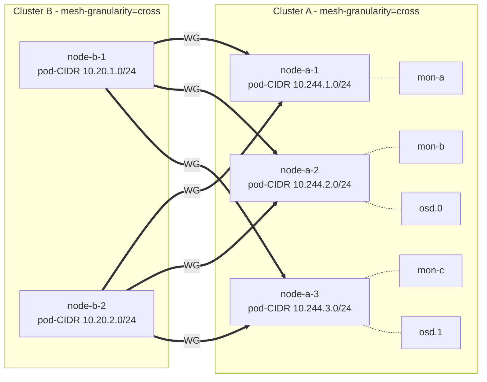

# Cross-cluster mesh for tenant access to host-cluster services

- **Title:** `Cross-cluster mesh for tenant access to host-cluster services`
- **Author(s):** `@kvaps`
- **Date:** `2026-05-04`
- **Status:** Draft
- **Upstream:** Implementation will live as an independent project under the [kilo-io](https://github.com/kilo-io) GitHub organization. Kilo maintainer [@squat](https://github.com/squat) has confirmed interest in upstreaming this functionality, on the condition that the controller and its CRD are framed as a generic *cluster-to-cluster mesh* primitive ("ClusterMesh") rather than as a Cozystack/tenant-specific construct. This proposal has been adjusted accordingly.

## Overview

This proposal describes a generic controller-driven approach for connecting two or more Kubernetes clusters into a flat node-to-node WireGuard mesh, using Kilo's `mesh-granularity=cross` topology. The controller — provisionally named **`kilo-clustermesh`** — is intended to live as an independent project in the `kilo-io` organization and to be reusable outside Cozystack.

The motivating use case for this design is exposing a Rook-managed Ceph cluster running in a Cozystack host cluster so that pods inside Cozystack-managed tenant clusters can consume RBD, CephFS, and Ceph Object Gateway storage as if it were local. However, the controller itself does not know about Cozystack tenants. From its point of view, a `ClusterMesh` resource declares a set of peer clusters (referenced via Secrets holding kubeconfigs) that should be linked together; tenancy semantics are entirely a concern of whatever system creates those resources.

The design favours a fully-meshed node-to-node topology over the conventional single-gateway model, because Ceph clients require direct L3 connectivity to many backend pods (monitors, OSDs, MDS) and the throughput profile is incompatible with funneling all traffic through one pair of gateways. The controller is responsible for keeping the mesh consistent: creating and removing `Peer` CRDs in every participating cluster as nodes come and go, validating address space, and enforcing trust boundaries through the choice of which kubeconfigs are held where.

## Context

### The problem

> *As a Cozystack operator, I have a cluster running Ceph (managed by Rook) and I want to make it available for consumption by pods inside the tenant Kubernetes clusters that Cozystack manages.*

Ceph access from outside the cluster is structurally different from accessing a typical microservice. A `ceph-csi` client needs simultaneous L3 connectivity to:

- Every monitor pod (typically 3–5), addressed individually — clients query monitors directly to obtain the cluster map.
- Every OSD pod — reads and writes are routed by the client to a specific OSD chosen by the CRUSH algorithm, not to a load balancer.
- Every MDS pod for CephFS workloads.

This is a stateful workload pattern with headless services and direct pod-IP access. Standard cross-cluster mechanisms designed around a single ingress (LoadBalancer Service, single gateway pair) either do not work at all (cannot expose all pod IPs) or introduce a throughput bottleneck on the gateway nodes.

Additionally, in deployments where one cluster is treated as the trusted side (e.g. a Cozystack host) and others are not (e.g. tenant clusters running on nodes outside the platform operator's control), the connectivity solution must preserve a strict trust boundary: a compromised remote node must not be able to manipulate routing in the trusted cluster, claim CIDRs it does not own, or affect other peers.

### Existing primitives

- A typical deployment already runs Kilo (in Cozystack: for intra-cluster encryption).
- Whoever creates `ClusterMesh` resources is expected to hold (or be able to fetch) admin-level kubeconfigs for every cluster that should join the mesh, and to materialise them as Secrets that the controller can consume. In the Cozystack case, the host control plane already has admin-level kubeconfig access to every tenant cluster.
- Kilo PR [#328](https://github.com/squat/kilo/pull/328) introduces a third mesh granularity, `cross`, in which each node is its own topology segment but WireGuard tunnels are only built between segments in different logical locations. Within the same location, traffic flows over the existing CNI without WG overhead. The PR is currently unmerged upstream; the upstreaming effort for the controller and for `mesh-granularity=cross` will be coordinated.

### Upstream collaboration

Following discussion with Kilo maintainer [@squat](https://github.com/squat), the controller will be developed in a dedicated repository under the [kilo-io](https://github.com/kilo-io) organization rather than as a Cozystack-internal component. The two key design consequences:

1. The CRD does not contain references to tenants. Instead it accepts a map of peer clusters, each referenced by a Secret holding that cluster's kubeconfig. The Cozystack-specific notion of "tenant" lives entirely outside the controller.
2. The Cozystack control plane integrates by translating its own tenant model into `ClusterMesh` objects (one per tenant connection, in the simple deployment shape) plus the corresponding kubeconfig Secrets. See [Cozystack integration](#cozystack-integration).

## Goals

- Pods in any peer cluster can reach selected services in another peer cluster as if they were on the local network. (Cozystack use case: tenant pods reach host Ceph monitors, OSDs and MDS daemons.)
- Nodes added to or removed from any participating cluster are wired into / detached from the mesh automatically, without per-node manual configuration.
- A compromise of a peer cluster (up to and including full root on a peer node) cannot affect routing in another peer cluster beyond the network surface that was explicitly granted, and cannot affect unrelated peers.
- Failure of a single node does not break connectivity to services running on other nodes — recovery is automatic and does not require operator action or controller intervention on the data path.
- Throughput scales linearly with cluster size: there is no single gateway whose NIC or CPU becomes the bottleneck.
- No additional cluster-wide IP address space needs to be allocated specifically for the mesh; existing pod-CIDRs are sufficient.

### Non-goals

- Cross-cluster service discovery (DNS, mirrored Services). This is a separate concern; for the Ceph use case it is unnecessary because Ceph clients receive endpoint lists from the monitors directly.
- Replacing the CNI in any participating cluster. Each cluster continues to run its preferred CNI; Kilo only adds the cross-cluster encryption fabric.
- Supporting peers whose pod-CIDR overlaps with another peer's pod-CIDR. Disjoint pod-CIDRs are a precondition.
- Cozystack-specific tenant policy. Whether and how a particular tenant gets a `ClusterMesh` object is decided by Cozystack control-plane logic outside the controller.

## Design

### Topology

Every participating cluster runs Kilo with `--mesh-granularity=cross`. In this mode every node is a topology segment of one. Within a single logical location (e.g. all nodes inside one cluster) traffic uses the underlying CNI without WireGuard. Across logical locations every node holds a direct WireGuard tunnel to every node in the other location.

For a `ClusterMesh` connecting two clusters, the result is a full bipartite mesh: every node in cluster A has a tunnel to every node in cluster B, and vice versa. The number of tunnels is `N × M` where N and M are the node counts of the two clusters; this is intentional and is what enables the throughput and HA properties described below. (For a `ClusterMesh` with more than two members the same relation holds pairwise: every node in every cluster has a tunnel to every node in every other cluster in the mesh.)

### Why cross-mesh works naturally for Ceph

Rook is configured to run Ceph daemons on the **pod network** (not the host network). Each Ceph monitor, OSD or MDS pod therefore has an IP allocated from the pod-CIDR of the specific node where the pod is currently running. Each node's per-node pod-CIDR slice is registered as the `allowedIPs` of that node's `Peer` object on the remote side.

WireGuard cryptokey routing on the remote side selects the correct Peer based on destination IP: a packet to a monitor on `host-node-3`'s pod-IP matches the Peer for `host-node-3` and is encrypted to that node's WG endpoint, sent there directly. Traffic flows remote-node-X → host-node-3 with no intermediate hop.

When `host-node-3` fails, Rook reschedules its Ceph daemons on a surviving node, say `host-node-7`. The new pods receive new IPs from `host-node-7`'s pod-CIDR. The remote side continues to send traffic for the new IPs through the live `host-node-7` Peer. There is no controller-driven failover step on the data path: the routing change is implicit in the IP allocation policy of Kubernetes itself.



### Controller (`kilo-clustermesh`)

A standalone controller, distributed by the `kilo-io` organization. It runs in one of the participating clusters (the "controller cluster") and uses kubeconfig Secrets to reach every other cluster listed in a `ClusterMesh`. It manages the lifecycle of `Peer` CRDs in every cluster in the mesh.

#### CRD: `ClusterMesh`

```yaml
apiVersion: kilo.squat.ai/v1alpha1
kind: ClusterMesh
metadata:
  name: example-mesh
  namespace: kilo
spec:
  clusters:
    cluster-a:
      # The controller's own cluster — no kubeconfig needed.
      local: true
      podCIDR: 10.244.0.0/16
      advertise:
        - 10.244.0.0/16        # extra CIDRs reachable through this cluster
    cluster-b:
      kubeconfigSecretRef:
        name: cluster-b-kubeconfig
        key: kubeconfig
      podCIDR: 10.20.0.0/16
status:
  clusters:
    cluster-a:
      registeredPeers: 5
    cluster-b:
      registeredPeers: 12
  conditions:
    - type: Ready
      status: "True"
    - type: PodCIDRConflict
      status: "False"
```

The `spec.clusters` field is a map keyed by an arbitrary cluster identifier. Each entry references a Secret holding a kubeconfig (`kubeconfigSecretRef`), declares the cluster's pod-CIDR, and optionally lists additional CIDRs (`advertise`) to be made reachable from other peers in the mesh. Exactly one entry may have `local: true`, indicating the cluster the controller itself runs in (no kubeconfig required).

The CRD has no notion of tenants, hubs, spokes, owners, or trust direction. Asymmetric deployment shapes (e.g. one trusted cluster reachable by many less-trusted clusters) are expressed by the consumer of the controller through the choice of clusters they include in each `ClusterMesh` and through external RBAC on the kubeconfig Secrets.

#### Reconciliation

For each `ClusterMesh`, the controller:

1. Validates that all `spec.clusters[*].podCIDR` values are pairwise disjoint; any overlap sets `PodCIDRConflict=True` and aborts further reconciliation for the affected mesh.
2. For every ordered pair `(A, B)` of clusters in `spec.clusters`, lists Nodes in A and ensures a `Peer` exists in B with: `publicKey` from the `kilo.squat.ai/wireguard-public-key` annotation on the A-node, `endpoint` from `kilo.squat.ai/force-endpoint`, and `allowedIPs` containing the A-node's per-node pod-CIDR plus any `advertise` CIDRs declared for cluster A.
3. Removes orphaned Peer objects on every side using a label selector tied to the `ClusterMesh` name.

#### Watches

- Nodes in every cluster listed in a `ClusterMesh` (one watch per cluster, via the corresponding kubeconfig) → reconcile that `ClusterMesh`.
- `ClusterMesh` add/update/delete → reconcile that mesh.
- `Secret` referenced by `kubeconfigSecretRef` changes → re-establish the watch and reconcile.

### Key management

The controller does not generate or store WireGuard private keys. Each `kg-agent` generates its own keypair on first run, stores the private key locally, and publishes the public key as a Node annotation. The controller only reads annotations; private material never crosses the trust boundary or appears on the controller's reconcile path.

### IP allocation

No mesh-specific IP space is allocated. All `Peer.allowedIPs` entries are taken from existing per-node pod-CIDRs (`Node.Spec.PodCIDRs`), plus optional explicit `advertise` CIDRs.

Kilo's internal `--wireguard-cidr` (default `10.4.0.0/16`) addresses the local `kilo0` interface inside each cluster and is never propagated outside that cluster, because the controller constructs Peer objects directly from pod-CIDRs and does not include the per-segment WG IP that `kgctl showconf` would otherwise emit. This means each cluster can use the default `--wireguard-cidr` without coordination across the mesh.

The constraints on pod-CIDRs are:

- All cluster pod-CIDRs in a `ClusterMesh` must be pairwise disjoint.
- Every `Node.Spec.PodCIDRs[0]` in a cluster must be a subset of that cluster's declared `podCIDR` (defensive validation against a misconfigured kube-controller-manager).

How non-overlapping CIDRs are allocated is the responsibility of whoever creates the `ClusterMesh`. In the Cozystack case, the tenant provisioning pipeline allocates from a global pool at cluster-creation time. The controller's admission validation backs this up at runtime.

## Cozystack integration

This proposal describes the upstream controller that will live in `kilo-io`. Its consumption inside Cozystack is a separate concern.

This integration also has to fit alongside the [`kubernetes-nodes-split`](https://github.com/cozystack/community/pull/8) proposal, which reshapes a tenant cluster from a single `kubernetes` HelmRelease into `1 × kubernetes` (Kamaji control-plane only) + `N × kubernetes-nodes` HelmReleases (one per pool, possibly across different locations and backends — `kubevirt-kubeadm`, `kubevirt-talos`, `cloud-talos-hetzner`, `cloud-talos-azure`). The mesh must work uniformly across this layout.

The integration shape is:

- A tenant cluster is identified at the `kubernetes` HelmRelease level. The kubeconfig issued by the Kamaji control-plane is the single source of truth for that tenant, regardless of how many `kubernetes-nodes` HelmReleases are attached or which backends they use.
- The existing tenant provisioning pipeline allocates a non-overlapping pod-CIDR for the tenant, fetches the Kamaji-issued kubeconfig, and stores it as a Secret in the host cluster.
- For each tenant that should connect to host services, Cozystack creates **one** `ClusterMesh` object in the host cluster with two entries in `spec.clusters`: the host (with `local: true`) and the tenant (referencing the Secret). One `ClusterMesh` per tenant is sufficient even when the tenant spans multiple locations and backends — the controller's per-cluster Node watch picks up every worker node regardless of which `kubernetes-nodes` pool created it (CAPI-managed KubeVirt VM, autoscaled Hetzner server, autoscaled Azure VMSS instance, etc.) as long as the worker is registered against the tenant kube-apiserver and runs `kg-agent`.
- New tenant pools added later (additional `kubernetes-nodes` HelmReleases for new locations) require no `ClusterMesh` changes: their nodes are observed by the same watch and reconciled into Peers automatically.
- A new managed-service entry exposes Ceph RBD/CephFS storage classes that work transparently inside connected tenant clusters.
- The dashboard surfaces the `ClusterMesh` state (Ready / PodCIDRConflict / partial connectivity) on the tenant cluster page.

No tenant-aware logic lives in the controller itself. All tenancy semantics — quotas, lifecycle, who is allowed to attach to which host — are enforced upstream of the `ClusterMesh` object by Cozystack.

### Implications for `kubernetes-nodes` backends

- **`kubevirt-kubeadm` / `kubevirt-talos`** — workers run as KubeVirt VMs on host nodes. Their pod-CIDRs are inside the tenant pod-CIDR; `kg-agent` runs as part of the tenant Kilo deployment; nothing backend-specific is needed.
- **`cloud-talos-hetzner` / `cloud-talos-azure`** — workers run as cloud VMs outside the host cluster. They join the tenant kube-apiserver over the public internet and run `kg-agent` like any other tenant node. The mesh reaches them via their `force-endpoint` annotation (cloud public IP); no special-casing in the controller.
- The Talos `machineconfig` template used by `cloud-talos-*` backends must include the bits needed for `kg-agent` (Kilo's kernel modules / WireGuard interface). This is a `kubernetes-nodes` concern, not a `ClusterMesh` concern, but it needs to be tracked alongside the mesh rollout.

## Upgrade and rollback compatibility

The feature is opt-in: clusters without a `ClusterMesh` are unaffected. Existing installations continue to operate identically until the controller and CRD are deployed.

Rollback path: deleting a `ClusterMesh` triggers the controller to remove all corresponding Peer objects in every participating cluster. Existing tunnels tear down cleanly within Kilo's reconcile interval.

The feature requires Kilo with `--mesh-granularity=cross`. The intent is to land that as part of the same upstream effort tracked in PR #328.

## Security

- The controller uses the kubeconfigs supplied via Secret references in `spec.clusters` to reach remote clusters. No additional credential exchange is introduced; how those kubeconfigs are issued is out of scope for the controller.
- The trust direction of a deployment is determined by which Secrets are populated where: a cluster whose kubeconfig is *not* held by any other cluster's controller cannot manipulate Peer objects on any other side. In the Cozystack deployment shape, only the host cluster holds tenant kubeconfigs, so trust flows in one direction (host → tenant).
- A peer cluster compromise can:
    - Modify its own `kg-agent` annotations (e.g. publish a different public key). The controller picks this up on the next reconcile and updates the corresponding remote Peer. The blast radius is limited to that cluster's own pod-CIDR; application-level authentication (e.g. cephx) is required to actually access data.
    - Forge or modify Node objects in its own cluster only to the extent allowed by local RBAC. The controller validates that `Node.Spec.PodCIDRs` falls within the declared `podCIDR` for that cluster; out-of-range entries are ignored.
- A peer cannot create or modify Peer objects in another cluster unless that cluster's kubeconfig has been deliberately handed to a controller with such rights.
- A peer cannot affect routing for unrelated `ClusterMesh` objects: each mesh's Peers are scoped by label selector tied to the `ClusterMesh` name.

## Failure and edge cases

- **Service-bearing node failure** → workload schedulers (e.g. Rook) reschedule pods elsewhere; remote cryptokey routing follows the new pod IPs to live nodes; no data-path intervention required.
- **Remote node failure** → only that node loses connectivity; other nodes in the same cluster continue working through their independent tunnels.
- **Remote API unreachable** → controller backs off with exponential retry; existing Peers on other sides are not deleted speculatively. When the remote API returns, reconciliation catches up.
- **Pod-CIDR overlap detected at admission time** → admission webhook on `ClusterMesh` rejects creation with a clear error pointing at the conflicting cluster.
- **Two `ClusterMesh` objects with overlapping pod-CIDRs** → controller sets `PodCIDRConflict=True` on both, halts reconciliation, surfaces the condition in status.
- **Kilo PR #328 not merged upstream** → blocking dependency; the upstream effort for this controller and for `mesh-granularity=cross` will be coordinated.

## Testing

- Unit tests for reconcile logic: synthetic Node lists with various combinations of annotations, expected Peer object shape.
- Admission webhook tests for pod-CIDR overlap detection.
- Integration tests with `kind`: two clusters, install controller, validate end-to-end connectivity from a pod in one cluster to a pod in another.
- E2E in CI: full Cozystack stack with a real tenant cluster and Rook-managed Ceph; verify a `ceph rbd map` succeeds inside a tenant pod, verify a `ceph osd down` on a host node does not interrupt I/O on the tenant side beyond the normal Ceph recovery window.

## Rollout

- **Phase 1.** Implement the controller and `ClusterMesh` CRD in a `kilo-io` repository, alongside upstreaming `mesh-granularity=cross` in Kilo itself. Manual provisioning of `ClusterMesh` and kubeconfig Secrets; documentation.
- **Phase 2.** Cozystack integration: tenant provisioning automatically creates the kubeconfig Secret and `ClusterMesh` for opt-in tenants.
- **Phase 3.** Storage classes for Ceph RBD/CephFS that work transparently inside connected tenant clusters; samples and migration guide.
- **Future.** Generalise `advertise` to cover non-pod CIDRs (host-IPs, service CIDR) for use cases beyond Ceph.

## Open questions

1. **Repository name and CRD group**: `kilo-clustermesh` and `kilo.squat.ai/v1alpha1` are placeholders. The final names will be agreed with the Kilo maintainer at repository-creation time under `kilo-io`.
2. **Cluster identifier scope**: should `spec.clusters` keys be free-form strings or follow a stricter schema (e.g. DNS-1123 labels) so they can be reused as label values? Likely the latter; to confirm during implementation.
3. **Transitive routing**: with three or more clusters in the same `ClusterMesh`, the controller currently builds a full mesh. Should it support partial topologies (e.g. star)? Out of scope for v1; the CRD shape allows it later.
4. **Multi-controller scenarios**: in a deployment where two clusters each run their own controller, how should they coordinate? Likely via a "leader" cluster identified in the CRD; deferred.
5. **Default deny vs explicit advertise**: should `advertise` be the only path by which peers see each other's non-pod CIDRs (current proposal), or should there be a per-peer opt-in for which advertised CIDRs to actually accept?

## Alternatives considered

**Single gateway pair (Submariner-style or Kilo `mesh-granularity=location`)**. Rejected because all traffic for a given peer connection funnels through one gateway pair, and Ceph throughput exceeds what a single node can sustain at scale. Failover requires either VRRP/keepalived at the network layer or a controller that mutates Peer objects on liveness signals — both are operationally heavier than the cross-mesh approach for the same outcome.

**Standalone WireGuard with VRRP/keepalived for HA**. Works for small deployments but does not scale to per-node connectivity, requires manual key rotation at scale, and does not naturally integrate with Kubernetes Node lifecycle events. The cross-mesh design uses kg-agent's existing per-node key generation and Kubernetes node watches as the source of truth.

**Cilium ClusterMesh**. Provides true node-to-node tunnels and excellent service discovery, but requires Cilium on both sides. Tenants in Cozystack are managed clusters whose CNI is the tenant's choice; we cannot mandate Cilium, so this is unsuitable as the default solution.

**Patching Kilo for health-aware peer selection**. Rejected because Kilo's design is explicitly declarative — kube-apiserver is the single source of truth, and runtime liveness is not consulted. Adding health-aware behaviour requires a substantial architectural change touching the reconcile loop, the Peer CRD, and the routes path. The maintenance burden of carrying such a fork outweighs the benefit when cross-mesh provides the desired property (no single point of failure on the data path) without any patch.

**A Cozystack-internal `TenantMeshLink` controller (earlier draft of this proposal)**. The first iteration of this design lived inside Cozystack as a tenant-aware controller with a `TenantMeshLink` CRD. After discussion with the Kilo maintainer ([@squat](https://github.com/squat)) we moved to the present, tenant-agnostic design: a tenant-aware CRD is harder to upstream and locks Cozystack into carrying the controller alone. Moving the tenant model out of the controller and into the layer that creates `ClusterMesh` objects both opens the door to upstreaming under `kilo-io` and lets non-Cozystack users benefit from the same controller.
