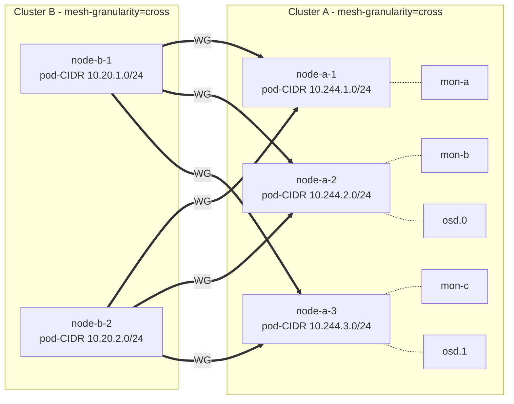

# ClusterMesh: a generic cluster-to-cluster mesh controller for Kilo

- **Title:** `ClusterMesh: a generic cluster-to-cluster mesh controller for Kilo`
- **Author(s):** `@kvaps`
- **Date:** `2026-05-04`
- **Status:** Draft
- **Upstream:** Implementation will live as an independent project under the [kilo-io](https://github.com/kilo-io) GitHub organization. Kilo maintainer [@squat](https://github.com/squat) has confirmed interest in upstreaming this functionality, on the condition that the controller and its CRD are framed as a generic *cluster-to-cluster mesh* primitive ("ClusterMesh") rather than as a Cozystack/tenant-specific construct. This proposal has been adjusted accordingly.

## Scope

**This proposal is scoped to the design of the upstream controller** (`kilo-clustermesh` in the `kilo-io` organization). It specifies the controller's CRD, reconciliation logic, validation model, and security boundary.

**Specifically out of scope of this proposal**: the question of how Cozystack will integrate the controller — which workloads consume it, with what address-plane shape (routed pod-CIDR vs NAT egress vs Service-mirror), whether it covers tenant↔host services (Ceph-style use cases) or tenant↔tenant-namespace applications (managed databases and other apps) or both, and what defaults and policies Cozystack applies on top. These decisions remain open and will be made in separate Cozystack-side design work once the upstream controller is shaped. The [Cozystack integration considerations](#cozystack-integration-considerations-deferred) section below sketches potential patterns for discussion only; it is **not** a committed integration plan.

## Overview

This proposal describes a generic controller-driven approach for connecting two or more Kubernetes clusters into a flat node-to-node WireGuard mesh, using Kilo's `mesh-granularity=cross` topology. The controller — provisionally named **`kilo-clustermesh`** — is intended to live as an independent project in the `kilo-io` organization and to be reusable outside Cozystack.

A motivating use case explored during design is exposing a Rook-managed Ceph cluster in one Kubernetes cluster so that pods in another cluster can consume RBD, CephFS, and Ceph Object Gateway storage as if it were local. Ceph illustrates the throughput and topology constraints that shaped the design (direct pod-IP connectivity to many backend pods, throughput incompatible with a single gateway pair), but the controller itself is agnostic to the workload that runs over the mesh.

The controller does not know about Cozystack tenants, hubs, spokes, or trust direction. From its point of view, a `ClusterMesh` resource declares a set of peer clusters (referenced via Secrets holding kubeconfigs) that should be linked together; tenancy semantics, who is allowed to create a `ClusterMesh`, and which use cases are served are entirely concerns of whatever system creates those resources.

The design favours a fully-meshed node-to-node topology over the conventional single-gateway model, because workloads of the Ceph kind require direct L3 connectivity to many backend pods and the throughput profile is incompatible with funneling all traffic through one pair of gateways. The controller is responsible for keeping the mesh consistent: creating and removing `Peer` CRDs in every participating cluster as nodes come and go, validating address space, and enforcing trust boundaries through the choice of which kubeconfigs are held where.

## Context

### The problem

> *As a Cozystack operator, I have a cluster running Ceph (managed by Rook) and I want to make it available for consumption by pods inside the tenant Kubernetes clusters that Cozystack manages.*

Ceph access from outside the cluster is structurally different from accessing a typical microservice. A `ceph-csi` client needs simultaneous L3 connectivity to:

- Every monitor pod (typically 3–5), addressed individually — clients query monitors directly to obtain the cluster map.
- Every OSD pod — reads and writes are routed by the client to a specific OSD chosen by the CRUSH algorithm, not to a load balancer.
- Every MDS pod for CephFS workloads.

This is a stateful workload pattern with headless services and direct pod-IP access. Standard cross-cluster mechanisms designed around a single ingress (LoadBalancer Service, single gateway pair) either do not work at all (cannot expose all pod IPs) or introduce a throughput bottleneck on the gateway nodes.

Additionally, in deployments where one cluster is treated as the trusted side (e.g. a Cozystack host) and others are not (e.g. tenant clusters running on nodes outside the platform operator's control), the connectivity solution must preserve a strict trust boundary: a compromised remote node must not be able to manipulate routing in the trusted cluster, claim CIDRs it does not own, or affect other peers.

### Existing primitives

- A typical deployment already runs Kilo (in Cozystack: for intra-cluster encryption).
- Whoever creates `ClusterMesh` resources is expected to hold (or be able to fetch) admin-level kubeconfigs for every cluster that should join the mesh, and to materialise them as Secrets that the controller can consume. In the Cozystack case, the host control plane already has admin-level kubeconfig access to every tenant cluster.
- Kilo PR [#328](https://github.com/squat/kilo/pull/328) introduces a third mesh granularity, `cross`, in which each node is its own topology segment but WireGuard tunnels are only built between segments in different logical locations. Within the same location, traffic flows over the existing CNI without WG overhead. The PR is currently unmerged upstream; the upstreaming effort for the controller and for `mesh-granularity=cross` will be coordinated.

### Upstream collaboration

Following discussion with Kilo maintainer [@squat](https://github.com/squat), the controller will be developed in a dedicated repository under the [kilo-io](https://github.com/kilo-io) organization rather than as a Cozystack-internal component. The two key design consequences:

1. The CRD does not contain references to tenants. Instead it accepts a list of peer clusters, each referenced by a Secret holding that cluster's kubeconfig. The Cozystack-specific notion of "tenant" lives entirely outside the controller.
2. The Cozystack control plane integrates by translating its own tenant model into `ClusterMesh` objects (one per tenant connection, in the simple deployment shape) plus the corresponding kubeconfig Secrets. See [Cozystack integration](#cozystack-integration).

## Goals

- Pods in any peer cluster can reach selected services in another peer cluster as if they were on the local network. (Representative workload: a Ceph cluster whose monitors, OSDs and MDS daemons must be reachable directly at pod-IP level from another cluster.)
- Nodes added to or removed from any participating cluster are wired into / detached from the mesh automatically, without per-node manual configuration.
- A compromise of a peer cluster (up to and including full root on a peer node) cannot affect routing in another peer cluster beyond the network surface that was explicitly granted, and cannot affect unrelated peers.
- Failure of a single node does not break connectivity to services running on other nodes — recovery is automatic and does not require operator action or controller intervention on the data path.
- Throughput scales linearly with cluster size: there is no single gateway whose NIC or CPU becomes the bottleneck.
- No additional cluster-wide IP address space needs to be allocated specifically for the mesh; existing pod-CIDRs are sufficient.

### Non-goals

- **Specifying the Cozystack integration shape.** Which Cozystack workloads consume this controller, with what address-plane (routed / NAT-egress / Service-mirror), and with what defaults — out of scope here. See [Cozystack integration considerations (deferred)](#cozystack-integration-considerations-deferred).
- Cross-cluster service discovery (DNS, mirrored Services). This is a separate concern; for Ceph-style workloads it is unnecessary because clients receive endpoint lists from the cluster map directly.
- Replacing the CNI in any participating cluster. Each cluster continues to run its preferred CNI; Kilo only adds the cross-cluster encryption fabric.
- Supporting peers whose pod-CIDR overlaps with another peer's pod-CIDR within the same routed `ClusterMesh`. Disjoint pod-CIDRs are a precondition for the controller as designed. A NAT-egress extension that lifts this restriction is one of the open Cozystack-integration patterns and is not part of this proposal.

## Design

### Topology

Every participating cluster runs Kilo with `--mesh-granularity=cross`. In this mode every node is a topology segment of one. Within a single logical location (e.g. all nodes inside one cluster) traffic uses the underlying CNI without WireGuard. Across logical locations every node holds a direct WireGuard tunnel to every node in the other location.

For a `ClusterMesh` connecting two clusters, the result is a full bipartite mesh: every node in cluster A has a tunnel to every node in cluster B, and vice versa. The number of tunnels is `N × M` where N and M are the node counts of the two clusters; this is intentional and is what enables the throughput and HA properties described below. (For a `ClusterMesh` with more than two members the same relation holds pairwise: every node in every cluster has a tunnel to every node in every other cluster in the mesh.)

### Why cross-mesh works naturally for Ceph

Rook is configured to run Ceph daemons on the **pod network** (not the host network). Each Ceph monitor, OSD or MDS pod therefore has an IP allocated from the pod-CIDR of the specific node where the pod is currently running. Each node's per-node pod-CIDR slice is registered as the `allowedIPs` of that node's `Peer` object on the remote side.

WireGuard cryptokey routing on the remote side selects the correct Peer based on destination IP: a packet to a monitor on `host-node-3`'s pod-IP matches the Peer for `host-node-3` and is encrypted to that node's WG endpoint, sent there directly. Traffic flows remote-node-X → host-node-3 with no intermediate hop.

When `host-node-3` fails, Rook reschedules its Ceph daemons on a surviving node, say `host-node-7`. The new pods receive new IPs from `host-node-7`'s pod-CIDR. The remote side continues to send traffic for the new IPs through the live `host-node-7` Peer. There is no controller-driven failover step on the data path: the routing change is implicit in the IP allocation policy of Kubernetes itself.



### Controller (`kilo-clustermesh`)

A standalone controller, distributed by the `kilo-io` organization. It runs in one of the participating clusters (the "controller cluster") and uses kubeconfig Secrets to reach every other cluster listed in a `ClusterMesh`. It manages the lifecycle of `Peer` CRDs in every cluster in the mesh.

#### CRD: `ClusterMesh`

```yaml
apiVersion: kilo.squat.ai/v1alpha1
kind: ClusterMesh
metadata:
  name: example-mesh
  namespace: kilo
spec:
  clusters:
    - name: cluster-a
      # The controller's own cluster — no kubeconfig needed.
      local: true
      allowedNetworks:
        - 10.4.0.0/16          # WG-CIDR
        - 10.244.0.0/16        # pod-CIDR
        - 10.96.0.0/12         # service-CIDR (optional, if the cluster wants to expose it)
    - name: cluster-b
      kubeconfigSecretRef:
        name: cluster-b-kubeconfig
        key: kubeconfig
      allowedNetworks:
        - 10.20.0.0/16         # pod-CIDR
        - 10.5.42.0/24         # WG-CIDR
status:
  clusters:
    - name: cluster-a
      registeredPeers: 5
      skippedNodes: 0
    - name: cluster-b
      registeredPeers: 12
      skippedNodes: 0
  conditions:
    - type: Ready
      status: "True"
    - type: NetworksOverlap
      status: "False"
```

`allowedNetworks` is the full list of CIDRs the cluster contributes to the mesh — pod-CIDR, WG-CIDR (the address space of `kilo0`), service-CIDR if exposed, and any other reachable subnet. The list is intentionally flat: there is no separate `podCIDR` or `wireguardCIDR` field. The controller treats every entry uniformly for both validation and Peer construction. This shape also formally bounds the mesh — nothing outside the union of `allowedNetworks` across all clusters can ever appear in a generated `Peer.allowedIPs`, which keeps the impact of `ClusterMesh` reconciliation predictable for the underlying routing.

The `spec.clusters` field is a list of named cluster entries, in line with Kubernetes convention for repeated structures (Pods/containers, Volumes, etc.). Each entry has a `name` (used as the cluster identifier in `status` and as a label value on generated Peer objects), an optional `kubeconfigSecretRef`, and an `allowedNetworks` list. Exactly one entry may have `local: true`, indicating the cluster the controller itself runs in (no kubeconfig required).

The CRD has no notion of tenants, hubs, spokes, owners, or trust direction. Asymmetric deployment shapes (e.g. one trusted cluster reachable by many less-trusted clusters) are expressed by the consumer of the controller through the choice of clusters they include in each `ClusterMesh` and through external RBAC on the kubeconfig Secrets.

#### Reconciliation

For each `ClusterMesh`, the controller performs validation in two layers — mesh-level checks that may halt the whole mesh, and per-Node checks that only skip the offending Node:

**Mesh-level (halts reconciliation on failure):**

1. The union of `allowedNetworks` across all `spec.clusters` is pairwise disjoint; otherwise `NetworksOverlap=True`. The same check is also applied across different `ClusterMesh` objects managed by the same controller (an `allowedNetworks` entry of mesh X must not overlap with an `allowedNetworks` entry of mesh Y), to prevent two meshes from claiming routing for the same address range.

**Per-Node (skips the Node, mesh stays Ready):**

2. `Node.Spec.PodCIDRs[0]` is a subset of that cluster's `allowedNetworks`. (Defensive validation against a tampered Node object on the remote side.)
3. `Node.kilo.squat.ai/wireguard-ip` is present, has prefix length `/32` (or `/128` for IPv6), and is a subset of that cluster's `allowedNetworks`.
4. `Node.kilo.squat.ai/wireguard-ip` is unique among all Nodes of this cluster.

Failed per-Node checks emit a Kubernetes event on the `ClusterMesh` (`NodeOutOfRange`, `WGIPInvalid`, `WGIPDuplicate`) and increment `status.clusters[<id>].skippedNodes`. The Node simply does not appear as a `Peer` on remote sides. A remote-side attacker who tampers with their own Node annotations can therefore only remove that one Node from the mesh — they cannot inject a Peer with arbitrary `allowedIPs` into another cluster, and they cannot affect other Nodes of the same cluster or any other `ClusterMesh`.

**Peer construction:**

5. For every ordered pair `(A, B)` of clusters in `spec.clusters`, ensure a `Peer` exists in B for each validated Node of A with: `publicKey` from `kilo.squat.ai/wireguard-public-key`, `endpoint` from `kilo.squat.ai/force-endpoint`, and `allowedIPs` = `Node.Spec.PodCIDRs[0]` ∪ `kilo.squat.ai/wireguard-ip` (the standard Kilo per-Node Peer shape). Cluster-wide CIDRs in `allowedNetworks` not covered by per-Node pod-CIDRs / WG-IPs (e.g. service-CIDR) are attached to a single anchor Peer per cluster.
6. Every generated Peer carries the labels `kilo-clustermesh.io/mesh: <ClusterMesh name>` and `kilo-clustermesh.io/source-cluster: <source cluster name>`. These labels disambiguate ownership when, for example, two controllers running on different "hub" clusters write Peers into the same remote cluster: each controller only ever touches Peers whose `source-cluster` label matches one of the clusters listed in its own `ClusterMesh`, and never modifies or deletes Peers belonging to a different source cluster, even if the mesh name happens to collide.
7. Remove orphaned Peer objects on every side using a label selector tied to both the mesh name and the source-cluster name.

#### Watches

- Nodes in every cluster listed in a `ClusterMesh` (one watch per cluster, via the corresponding kubeconfig) → reconcile that `ClusterMesh`.
- `ClusterMesh` add/update/delete → reconcile that mesh.
- `Secret` referenced by `kubeconfigSecretRef` changes → re-establish the watch and reconcile.

### Key management

The controller does not generate or store WireGuard private keys. Each `kg-agent` generates its own keypair on first run, stores the private key locally, and publishes the public key as a Node annotation. The controller only reads annotations; private material never crosses the trust boundary or appears on the controller's reconcile path.

### IP allocation

No mesh-specific IP space is allocated. `Peer.allowedIPs` entries are constructed from per-Node `Node.Spec.PodCIDRs`, per-Node `kilo.squat.ai/wireguard-ip`, and any cluster-wide CIDRs declared in `spec.clusters[*].allowedNetworks` not already covered by per-Node values.

`allowedNetworks` is the single declaration of what subnets a cluster brings into the mesh — pod-CIDR, the WG-CIDR (`kilo0` address space), and any other reachable ranges (service-CIDR, host-network) all live in the same list. The controller does not distinguish "kinds" of CIDRs; the same disjoint and containment checks apply uniformly.

Constraints (already listed in [Reconciliation](#reconciliation)):

- All `allowedNetworks` entries across `spec.clusters` of a `ClusterMesh` must be pairwise disjoint.
- `allowedNetworks` entries must also be disjoint across different `ClusterMesh` objects managed by the same controller.
- Every `Node.Spec.PodCIDRs[0]` in a cluster must be a subset of that cluster's `allowedNetworks`.
- Every `Node.kilo.squat.ai/wireguard-ip` (every cluster, every Node) must be a `/32` subset of that cluster's `allowedNetworks` and unique within the cluster.

How disjoint CIDRs are allocated in the first place is the responsibility of whoever creates the `ClusterMesh`. The controller relies on the fact that whatever principal authors `ClusterMesh` objects is trusted to set sensible `allowedNetworks` values; cluster-scoped guardrails against a rogue `ClusterMesh` author writing arbitrary CIDRs are out of scope here and discussed under [Alternatives considered](#alternatives-considered) as orthogonal future Kilo work.

## Cozystack integration considerations (deferred)

> **This section is exploratory, not a committed integration plan.** The upstream controller described above is the deliverable of this proposal. How Cozystack adopts it — which workloads it serves, what address-plane shape it takes, which defaults and policies apply, how it interacts with the [`kubernetes-nodes-split`](https://github.com/cozystack/community/pull/8) proposal — remains an open design question and will be addressed separately. The patterns sketched here are inputs to that future discussion.

Several distinct Cozystack integration patterns have been raised during design discussion. Each has different tradeoffs and none is committed; the right answer may even be a hybrid.

### Pattern A: routed pod-level mesh for tenant ↔ host services

For workloads in the host cluster that tenants need to consume directly at pod-IP level (Ceph monitors, OSDs, MDS), Cozystack provisions one `ClusterMesh` per tenant with `spec.clusters` containing the host and one tenant entry. `allowedNetworks` declares the actual pod-CIDR and WG-CIDR on each side. This is the most direct mapping of the controller's design but requires globally disjoint tenant pod-CIDRs, allocated from a Cozystack-managed pool at tenant-provisioning time. Tenants that bring their own clusters with pre-existing pod-CIDRs cannot participate unless their CIDR happens to fit the pool.

### Pattern B: NAT egress mode for tenants with arbitrary pod-CIDR

To support tenants whose pod-CIDR is not coordinated with Cozystack (BYO clusters, external clouds), an extension would introduce per-tenant *egress slices*: a small CIDR allocated from a controlled pool (e.g. CGNAT range 100.64.0.0/10), with per-node /32 SNAT on the tenant side. Only the egress slice appears in `allowedNetworks`; the tenant's real pod-CIDR is hidden from the mesh. Inspired by Submariner Globalnet. Loses end-to-end pod-IP visibility on the wire but is fine for cephx-authenticated traffic. Would require an extension to either the controller (new mode) or to a Cozystack-side companion component that materialises the SNAT configuration.

### Pattern C: Service-mirror via Outline for tenant ↔ tenant-namespace applications

For the common Cozystack case of tenant pods accessing the tenant's own managed apps (Postgres, Mongo, Kafka, …) that run in the tenant-namespace of the management cluster, the `ClusterMesh` controller is **not necessarily the right tool**. An alternative builds on the Outline (Shadowsocks) infrastructure already present in Cozystack: a per-tenant Outline server in the tenant namespace, a Service-mirror controller that materialises shadow Services in the tenant cluster, and a userspace SOCKS5-proxy DaemonSet on tenant nodes. Both sides are fully unprivileged (no TUN, no `CAP_NET_ADMIN`), the Outline server is genuinely stateless and HA-scalable. Limitations: L4 only, no forward secrecy, one direction (tenant → mgmt). Would coexist with this `ClusterMesh` controller rather than replace it.

### Open Cozystack questions

These are not asks of the upstream controller; they are reminders of what still has to be decided in Cozystack:

- Which of the patterns above (or which combination) Cozystack adopts. Patterns A and B are variants of consuming this controller; pattern C uses a different mechanism entirely.
- How `ClusterMesh` provisioning interacts with the [`kubernetes-nodes-split`](https://github.com/cozystack/community/pull/8) proposal, which can place tenant workers in multiple locations and backends (`kubevirt-kubeadm`, `kubevirt-talos`, `cloud-talos-hetzner`, `cloud-talos-azure`). The mesh design must work uniformly across this layout, but the Cozystack-side provisioning glue is non-trivial.
- For `cloud-talos-*` backends, whether the Talos `machineconfig` should ship Kilo's WireGuard / `kg-agent` bits as part of the platform-side template, and how that template is versioned and updated.
- Default deny vs explicit advertise: should tenants by default opt in to host-side advertised CIDRs, or get them automatically once they have a `ClusterMesh`? This is a Cozystack policy decision, not a controller capability.
- Whether to expose `ClusterMesh` to tenants as a user-facing resource or keep it admin-only (created by Cozystack on the tenant's behalf based on a higher-level Cozystack CR).
- Dashboard surfacing of mesh state per tenant.

None of these block the upstream controller from progressing.

## Upgrade and rollback compatibility

The feature is opt-in: clusters without a `ClusterMesh` are unaffected. Existing installations continue to operate identically until the controller and CRD are deployed.

Rollback path: deleting a `ClusterMesh` triggers the controller to remove all corresponding Peer objects in every participating cluster. Existing tunnels tear down cleanly within Kilo's reconcile interval.

The feature requires Kilo with `--mesh-granularity=cross`. The intent is to land that as part of the same upstream effort tracked in PR #328.

## Security

The trust model rests on a single primary boundary plus a set of supporting controls.

### Primary boundary: cryptokey routing on the host side

The host's exposure to any tenant peer is bounded **exclusively** by the `allowedIPs` field of the corresponding `Peer` object on the host side. WireGuard's cryptokey routing enforces this at kernel level:

- **On receive**: a packet decrypted with a peer's key is dropped before it reaches the network stack if its source IP is not in that peer's `allowedIPs`.
- **On send**: a packet leaves through the WG tunnel of the peer whose `allowedIPs` covers its destination, or via normal routing if no peer matches; the host never speaks WG with a destination outside the union of `allowedIPs` of its peers.

Anything a remote root does to its own `kilo0` interface, local routing tables, kg-agent configuration, or post-reconcile annotations cannot widen this bound, because each side enforces `allowedIPs` independently of any sender-side state. The entire job of the controller and its validation is therefore reduced to one question: *what `allowedIPs` does each cluster's `Peer` object end up with?*

### Supporting controls

- **Controller monopoly on `Peer`.** RBAC in every participating cluster grants `create/update/patch/delete` on `kilo.squat.ai/Peer` **only** to the controller's ServiceAccount (in the local cluster) or to the user the controller authenticates as via the cluster's kubeconfig (in remote clusters). No other principal — tenant-provisioning, dashboard, cluster admins, any other host-cluster component — has rights on `Peer`. A compromise of an unrelated host component therefore cannot directly write into the mesh routing surface.
- **In remote clusters**, the kubeconfig stored as a Secret on the controller side is bound to a minimal Role: read on `Node`, full access on `kilo.squat.ai/Peer`, nothing else. A leaked remote kubeconfig of this kind cannot exfiltrate workload data or alter unrelated resources in the remote cluster.
- **RBAC on `ClusterMesh` is the address-surface chokepoint.** Without an additional in-controller allowlist, the only thing standing between a `ClusterMesh` author and the routing of every participating cluster is who has rights on the `ClusterMesh` resource. Deployments are expected to grant `create/update` on `ClusterMesh` only to a small set of trusted principals (in Cozystack: the tenant-provisioning controller, not tenants themselves). Defense-in-depth against a rogue `ClusterMesh` author is discussed as orthogonal future Kilo work in [Alternatives considered](#alternatives-considered).
- **Per-Node containment** validates that every observed annotation (`Node.Spec.PodCIDRs`, `kilo.squat.ai/wireguard-ip`) lies within the cluster's own `allowedNetworks`. A remote-side attacker forging an annotation that points at another cluster's pod-CIDR, WG-CIDR, or any other CIDR the cluster did not declare itself is rejected — the offending Node is skipped and never appears as a Peer on any other side.
- **Trust direction by kubeconfig placement.** Whichever cluster holds the controller and the kubeconfig Secrets is the side that drives writes; a cluster whose kubeconfig is held by another controller cannot write back. In a Cozystack-style deployment, only the host holds remote kubeconfigs — trust flows host → remote.
- **Cross-mesh and cross-source isolation by label.** Every generated Peer is labelled with both the `ClusterMesh` name and the source-cluster name. The controller never deletes or modifies Peers belonging to a different mesh or a different source cluster, even when two controllers running on different "hub" clusters write into the same remote cluster. `allowedNetworks` overlap between meshes (not just within a single mesh) is rejected.

### Tenant-cluster compromise (full root on a tenant node)

A tenant attacker can do exactly the following, and no more:

- **Tamper with their own Node annotations.** A tenant Node whose `kilo.squat.ai/wireguard-ip` or `Node.Spec.PodCIDRs[0]` falls outside the cluster's own `allowedNetworks` is **skipped** by the controller — it does not appear as a `Peer` on the host side. The tenant has effectively removed *that one Node* from the mesh; no Peer with attacker-chosen `allowedIPs` is ever written on the host. Other Nodes of the same tenant continue to work.
- **Tamper with their own `kg-agent` post-reconcile.** Adding rogue IPs to `kilo0`, changing routes, modifying iptables — all confined to the tenant's own host. The host enforces `allowedIPs` independently (see [Primary boundary](#primary-boundary-cryptokey-routing-on-the-host-side)).
- **Rotate keypairs.** Republish a different `kilo.squat.ai/wireguard-public-key`. The controller will update the corresponding host-side Peer on the next reconcile. The result is equivalent to "the tenant generated a new legitimate keypair" — no escalation, only the (legitimate) ability to change one's own identity.
- **Lie about `force-endpoint`.** Point it at any public IP. Host nodes will WG-handshake that IP; without the matching private key the handshake fails. Worst case: a small CPU cost on host nodes attempting failed handshakes. Existing Kilo limitation, not new.

The remote-side attacker **cannot**:

- Inject a `Peer` with `allowedIPs` containing another cluster's pod-CIDR, service-CIDR, or `kilo0` range — those CIDRs live in *other* `spec.clusters` entries (the other cluster's own `allowedNetworks`), and per-Node containment rejects any annotation pointing into them.
- Affect routing for unrelated peers — their Peers are scoped by `ClusterMesh` and source-cluster labels and their `allowedNetworks` are required to be pairwise disjoint across meshes.
- Forge another peer's identity — that would require the other peer's WG private key, which never leaves its kg-agent.

## Failure and edge cases

- **Service-bearing node failure** → workload schedulers (e.g. Rook) reschedule pods elsewhere; remote cryptokey routing follows the new pod IPs to live nodes; no data-path intervention required.
- **Remote node failure** → only that node loses connectivity; other nodes in the same cluster continue working through their independent tunnels.
- **Remote API unreachable** → controller backs off with exponential retry; existing Peers on other sides are not deleted speculatively. When the remote API returns, reconciliation catches up.
- **`allowedNetworks` overlap, either within one `ClusterMesh` or across two** → controller sets `NetworksOverlap=True` on the affected meshes, halts reconciliation, surfaces the condition in status. No Peer with the offending CIDR is ever written.
- **Tampered or out-of-range `kilo.squat.ai/wireguard-ip` annotation** (outside the cluster's own `allowedNetworks`, missing `/32`, or duplicated within the cluster) → that single Node is skipped, an event is surfaced, `status.clusters[<id>].skippedNodes` is incremented. The mesh stays Ready; other Nodes of the same cluster are unaffected.
- **Tenant Node with `Node.Spec.PodCIDRs[0]` outside the cluster's `allowedNetworks`** → Node skipped, event surfaced, mesh stays Ready.
- **Kilo PR #328 not merged upstream** → blocking dependency; the upstream effort for this controller and for `mesh-granularity=cross` will be coordinated.

## Testing

- Unit tests for reconcile logic: synthetic Node lists with various combinations of annotations, expected Peer object shape and label set.
- Mesh-level validation tests: overlapping `allowedNetworks` within and across meshes — each must produce the `NetworksOverlap` status condition without writing any Peer with the offending CIDR.
- Per-Node validation tests: tampered `kilo.squat.ai/wireguard-ip` (out of `allowedNetworks`, wrong prefix length, duplicate within cluster), `Node.Spec.PodCIDRs` out of `allowedNetworks` — each must skip only the offending Node, leave the mesh Ready, and emit the corresponding event.
- Label-isolation tests: two controllers writing into the same remote cluster with the same mesh name but different source-cluster names — neither must touch the other's Peers, even on orphan cleanup.
- RBAC tests: the controller's ServiceAccount is the only principal able to mutate `kilo.squat.ai/Peer` in any participating cluster; verify that other components are denied.
- Integration tests with `kind`: two clusters, install controller, validate end-to-end connectivity from a pod in one cluster to a pod in another.

## Rollout

This rollout covers the upstream controller only. Cozystack adoption is a separate effort that picks up after Phase 1 (see [Cozystack integration considerations (deferred)](#cozystack-integration-considerations-deferred)).

- **Phase 1.** Implement the controller and `ClusterMesh` CRD in a `kilo-io` repository, alongside upstreaming `mesh-granularity=cross` in Kilo itself. Manual provisioning of `ClusterMesh` and kubeconfig Secrets; documentation.
- **Phase 2.** Soak in non-Cozystack deployments (e.g. paired test clusters, community contributors with their own multi-cluster needs). Gather feedback on the CRD shape, validation semantics, and operational ergonomics. Address gaps before any Cozystack-side commitment.
- **Phase 3 and beyond.** Cozystack adoption is shaped by the deferred design work referenced above. Possible follow-ups include automated `ClusterMesh` provisioning from a higher-level Cozystack CR, a NAT-egress extension to support BYO-CIDR tenants, and the orthogonal Service-mirror approach for tenant ↔ tenant-namespace traffic. None of these belong in this proposal.

## Open questions

1. **Repository name and CRD group**: `kilo-clustermesh` and `kilo.squat.ai/v1alpha1` are placeholders. The final names will be agreed with the Kilo maintainer at repository-creation time under `kilo-io`.
2. **Cluster identifier scope**: `spec.clusters[*].name` is used as a label value (`kilo-clustermesh.io/source-cluster`) and as a key in `status`. It needs DNS-1123 label-compatible validation. To confirm exact regex during implementation.
3. **Transitive routing**: with three or more clusters in the same `ClusterMesh`, the controller currently builds a full mesh. Should it support partial topologies (e.g. star)? Out of scope for v1; the CRD shape allows it later.
4. **Multi-controller scenarios**: in a deployment where two clusters each run their own controller, how should they coordinate? Label-based isolation (above) prevents them from stomping on each other's Peers, but does not prevent two controllers from authoritatively declaring different opinions about the same source-cluster. Either out of scope (operators avoid this configuration) or to be resolved via a "leader" cluster identified in the CRD; deferred.
5. **Per-peer opt-in for received CIDRs**: today `allowedNetworks` is a unilateral declaration on the source side. Should there additionally be a per-peer `acceptedNetworks` field, so a peer can refuse to accept some of what another peer publishes? Possibly relevant in deployments with heterogeneous trust policies; worth revisiting after the first round of usage.
6. **Structured `allowedNetworks` fields**: keep the current flat list (one homogeneous validation list) or migrate to typed fields (`podCIDR`, `wireguardCIDR`, `additionalCIDRs`)? Squat raised this on the original PR ([review](https://github.com/cozystack/community/pull/7)); the current flat shape is intentionally narrow ("nothing else than what's listed here can end up in a Peer") and easy to migrate later. Deferred to v1alpha2 if needed.

## Alternatives considered

**Single gateway pair (Submariner-style or Kilo `mesh-granularity=location`)**. Rejected because all traffic for a given peer connection funnels through one gateway pair, and Ceph throughput exceeds what a single node can sustain at scale. Failover requires either VRRP/keepalived at the network layer or a controller that mutates Peer objects on liveness signals — both are operationally heavier than the cross-mesh approach for the same outcome.

**Standalone WireGuard with VRRP/keepalived for HA**. Works for small deployments but does not scale to per-node connectivity, requires manual key rotation at scale, and does not naturally integrate with Kubernetes Node lifecycle events. The cross-mesh design uses kg-agent's existing per-node key generation and Kubernetes node watches as the source of truth.

**Cilium ClusterMesh**. Provides true node-to-node tunnels and excellent service discovery, but requires Cilium on both sides. Tenants in Cozystack are managed clusters whose CNI is the tenant's choice; we cannot mandate Cilium, so this is unsuitable as the default solution.

**Patching Kilo for health-aware peer selection**. Rejected because Kilo's design is explicitly declarative — kube-apiserver is the single source of truth, and runtime liveness is not consulted. Adding health-aware behaviour requires a substantial architectural change touching the reconcile loop, the Peer CRD, and the routes path. The maintenance burden of carrying such a fork outweighs the benefit when cross-mesh provides the desired property (no single point of failure on the data path) without any patch.

**A Cozystack-internal `TenantMeshLink` controller (earlier draft of this proposal)**. The first iteration of this design lived inside Cozystack as a tenant-aware controller with a `TenantMeshLink` CRD. After discussion with the Kilo maintainer ([@squat](https://github.com/squat)) we moved to the present, tenant-agnostic design: a tenant-aware CRD is harder to upstream and locks Cozystack into carrying the controller alone. Moving the tenant model out of the controller and into the layer that creates `ClusterMesh` objects both opens the door to upstreaming under `kilo-io` and lets non-Cozystack users benefit from the same controller.

**In-controller `--allowed-cidr` allowlist (earlier draft of this proposal)**. A previous iteration carried a deploy-time flag on the controller that bounded which CIDRs any `ClusterMesh` could declare in `allowedNetworks`. It was dropped after discussion: it functionally collapsed the "cluster admin" and "mesh admin" roles (every new mesh required editing the controller Deployment), and the defense it provided overlapped substantially with RBAC on `ClusterMesh` plus per-Node containment. The current design relies on RBAC as the address-surface chokepoint. Defense-in-depth at the *receiving* cluster's side (described next) is the better future direction.

**Cluster-side defense via a Kilo-level `PeerClass`** (future Kilo work, [suggested by @squat](https://github.com/cozystack/community/pull/7) during review). Today an attacker who somehow obtains write access to `Peer` in a cluster (e.g. a rogue ClusterMesh controller, a misconfigured kubeconfig) can write any `allowedIPs` they like. A future Kilo enhancement could introduce a cluster-level allowlist for Peer `allowedIPs` — either as a `kg-agent` flag or as a `PeerClass` CRD declaring which CIDRs are permissible — so each cluster individually guards against rogue Peer creation, independent of any cross-cluster controller. This is orthogonal to the `ClusterMesh` controller and would benefit Kilo administration in general; tracked here as future work rather than as part of this proposal.
