# Cross-cluster mesh for tenant access to host-cluster services

- **Title:** `Cross-cluster mesh for tenant access to host-cluster services`
- **Author(s):** `@kvaps`
- **Date:** `2026-05-04`
- **Status:** Draft

## Overview

This proposal describes a controller-driven approach for connecting tenant Kubernetes clusters managed by Cozystack to specific services in the host cluster (where Cozystack itself runs), using Kilo's `mesh-granularity=cross` topology. The motivating use case is exposing a Rook-managed Ceph cluster running in the host cluster so that pods inside tenant clusters can consume RBD, CephFS, and Ceph Object Gateway storage as if it were local.

The design favours a fully-meshed node-to-node topology over the conventional single-gateway model, because Ceph clients require direct L3 connectivity to many backend pods (monitors, OSDs, MDS) and the throughput profile is incompatible with funneling all traffic through one pair of gateways. A new operator running in the host cluster is responsible for keeping the mesh consistent: creating and removing `Peer` CRDs in both the host and tenant clusters as nodes come and go, validating address space, and enforcing trust boundaries on behalf of admins.

## Context

### The problem

> *As a Cozystack operator, I have a cluster running Ceph (managed by Rook) and I want to make it available for consumption by pods inside the tenant Kubernetes clusters that Cozystack manages.*

Ceph access from outside the cluster is structurally different from accessing a typical microservice. A `ceph-csi` client needs simultaneous L3 connectivity to:

- Every monitor pod (typically 3–5), addressed individually — clients query monitors directly to obtain the cluster map.
- Every OSD pod — reads and writes are routed by the client to a specific OSD chosen by the CRUSH algorithm, not to a load balancer.
- Every MDS pod for CephFS workloads.

This is a stateful workload pattern with headless services and direct pod-IP access. Standard cross-cluster mechanisms designed around a single ingress (LoadBalancer Service, single gateway pair) either do not work at all (cannot expose all pod IPs) or introduce a throughput bottleneck on the gateway nodes.

Additionally, tenant clusters in Cozystack typically run on nodes outside the platform operator's control. The connectivity solution must therefore preserve a strict trust boundary: a compromised tenant node must not be able to manipulate routing in the host cluster, claim CIDRs it does not own, or affect other tenants.

### Existing primitives

- The host cluster already runs Kilo, currently used for intra-cluster encryption.
- Cozystack has admin-level kubeconfig access to every tenant cluster's API server (tenants are provisioned and managed as Cozystack workloads).
- Tenants do not have any access to the host cluster API.
- Kilo PR [#328](https://github.com/squat/kilo/pull/328) introduces a third mesh granularity, `cross`, in which each node is its own topology segment but WireGuard tunnels are only built between segments in different logical locations. Within the same location, traffic flows over the existing CNI without WG overhead. The PR is currently unmerged upstream; a Kilo fork is maintained for Cozystack-specific patches.

## Goals

- Pods in any tenant cluster can reach Ceph monitors, OSDs and MDS daemons in the host cluster as if they were in the local network.
- New tenant clusters and new tenant nodes are wired into the mesh automatically without per-node manual configuration.
- A tenant cluster compromise (up to and including full root on a tenant node) cannot affect routing in the host cluster, cannot impersonate another tenant, and cannot expand the network surface beyond what was provisioned for that tenant.
- Failure of a single host node does not break Ceph access from any tenant — recovery is automatic and does not require operator action or controller intervention on the data path.
- Throughput scales linearly with cluster size: there is no single gateway whose NIC or CPU becomes the bottleneck.
- No additional cluster-wide IP address space needs to be allocated specifically for the mesh; existing pod-CIDRs are sufficient.

### Non-goals

- Tenant-to-tenant connectivity. Each tenant is a leaf connected only to the host cluster.
- Cross-cluster service discovery (DNS, mirrored Services). This is a separate concern; for Ceph it is unnecessary because Ceph clients receive endpoint lists from the monitors directly.
- Replacing the CNI in tenant clusters. Tenants continue to run their preferred CNI; Kilo only adds the cross-cluster encryption fabric.
- Supporting tenants whose pod-CIDR overlaps with the host pod-CIDR or with another tenant's pod-CIDR. Disjoint pod-CIDRs are a precondition.

## Design

### Topology

Both the host cluster and every participating tenant cluster run Kilo with `--mesh-granularity=cross`. In this mode every node is a topology segment of one. Within a single logical location (e.g. all nodes inside one cluster) traffic uses the underlying CNI without WireGuard. Across logical locations every node holds a direct WireGuard tunnel to every node in the other location.

For the host ↔ tenant pair, the result is a full bipartite mesh: every tenant node has a tunnel to every host node, and vice versa. The number of tunnels is `N × M` where N is the tenant node count and M is the host node count; this is intentional and is what enables the throughput and HA properties described below.

### Why cross-mesh works naturally for Ceph

Rook is configured to run Ceph daemons on the **pod network** (not the host network). Each Ceph monitor, OSD or MDS pod therefore has an IP allocated from the pod-CIDR of the specific host node where the pod is currently running. Each host node's per-node pod-CIDR slice is registered as the `allowedIPs` of that host node's `Peer` object on the tenant side.

WireGuard cryptokey routing on a tenant node selects the correct Peer based on destination IP: a packet to a monitor on `host-node-3`'s pod-IP matches the Peer for `host-node-3` and is encrypted to that node's WG endpoint, sent there directly. Traffic flows tenant-node-X → host-node-3 with no intermediate hop.

When `host-node-3` fails, Rook reschedules its Ceph daemons on a surviving node, say `host-node-7`. The new pods receive new IPs from `host-node-7`'s pod-CIDR. The tenant continues to send traffic for the new IPs through the live `host-node-7` Peer. There is no controller-driven failover step on the data path: the routing change is implicit in the IP allocation policy of Kubernetes itself.

```mermaid
flowchart LR
    subgraph Host[Host cluster - mesh-granularity=cross]
      H1[host-node-1<br/>pod-CIDR 10.244.1.0/24]
      H2[host-node-2<br/>pod-CIDR 10.244.2.0/24]
      H3[host-node-3<br/>pod-CIDR 10.244.3.0/24]
      H1 -.- M1[mon-a]
      H2 -.- M2[mon-b]
      H3 -.- M3[mon-c]
      H2 -.- O1[osd.0]
      H3 -.- O2[osd.1]
    end
    subgraph Tenant[Tenant cluster - mesh-granularity=cross]
      T1[tenant-node-1<br/>pod-CIDR 10.20.1.0/24]
      T2[tenant-node-2<br/>pod-CIDR 10.20.2.0/24]
    end
    T1 == WG ==> H1
    T1 == WG ==> H2
    T1 == WG ==> H3
    T2 == WG ==> H1
    T2 == WG ==> H2
    T2 == WG ==> H3
```



### Controller (`cozystack-meshlink-operator`)

A new operator runs in the host cluster. It manages the lifecycle of `Peer` CRDs on both sides of the connection.

#### CRD: `TenantMeshLink`

```yaml
apiVersion: cozystack.io/v1alpha1
kind: TenantMeshLink
metadata:
  name: tenant-foo
  namespace: cozystack-system
spec:
  tenantClusterRef:
    name: tenant-foo
  podCIDR: 10.20.0.0/16
  advertiseToTenant:
    - 10.244.0.0/16     # host pod-CIDR (advertises Ceph and any other host services)
status:
  registeredHostPeers: 12
  registeredTenantPeers: 5
  conditions:
    - type: Ready
      status: "True"
    - type: PodCIDRConflict
      status: "False"
```

The operator reconciles a `TenantMeshLink` for every tenant cluster that should participate in the mesh. The CR is created by the existing tenant provisioning pipeline at cluster-creation time, after the tenant pod-CIDR has been allocated.

#### Reconciliation

For each `TenantMeshLink`, the operator:

1. Validates `spec.podCIDR` against all other `TenantMeshLink` objects and the host cluster's pod-CIDR; any overlap sets `PodCIDRConflict=True` and aborts further reconciliation for that tenant.
2. Lists host cluster Nodes; for each node, ensures a `Peer` exists in the tenant cluster with: `publicKey` from the `kilo.squat.ai/wireguard-public-key` annotation, `endpoint` from `kilo.squat.ai/force-endpoint`, and `allowedIPs` containing the node's per-node pod-CIDR.
3. Lists tenant cluster Nodes; for each node, ensures a `Peer` exists in the host cluster with: `publicKey` from the tenant Node's annotation, `allowedIPs` containing the tenant per-node pod-CIDR, no `endpoint` (the tenant initiates).
4. Removes orphaned Peer objects on either side using a label selector tied to the `TenantMeshLink` name.

#### Watches

- Host cluster Node add/update/delete → reconcile every `TenantMeshLink`.
- Tenant cluster Node add/update/delete (per cluster, via the tenant kubeconfig) → reconcile that one `TenantMeshLink`.
- `TenantMeshLink` add/update/delete → reconcile that link.

### Key management

The operator does not generate or store WireGuard private keys. Each `kg-agent` generates its own keypair on first run, stores the private key locally, and publishes the public key as a Node annotation. The operator only reads annotations; private material never crosses the trust boundary or appears on the operator's reconcile path.

### IP allocation

No mesh-specific IP space is allocated. All `Peer.allowedIPs` entries are taken from existing per-node pod-CIDRs (`Node.Spec.PodCIDRs`).

Kilo's internal `--wireguard-cidr` (default `10.4.0.0/16`) addresses the local `kilo0` interface inside each cluster and is never propagated outside that cluster, because the operator constructs Peer objects directly from pod-CIDRs and does not include the per-segment WG IP that `kgctl showconf` would otherwise emit. This means each cluster can use the default `--wireguard-cidr` without coordination across the mesh.

The constraints on pod-CIDRs are:

- The host pod-CIDR and every tenant pod-CIDR must be pairwise disjoint.
- Every tenant `Node.Spec.PodCIDRs[0]` must be a subset of `TenantMeshLink.spec.podCIDR` (defensive validation against a misconfigured tenant kube-controller-manager).

Cozystack provisioning is responsible for allocating non-overlapping tenant pod-CIDRs from a global pool at cluster-creation time. The operator's admission validation backs this up at runtime.

## User-facing changes

- A new CRD `TenantMeshLink` in the `cozystack.io/v1alpha1` group.
- Cozystack tenant provisioning gains a "connect to host services" toggle that creates the corresponding `TenantMeshLink`.
- The dashboard surfaces the link state (Ready / PodCIDRConflict / partial connectivity) on the tenant cluster page.
- For Ceph specifically, a new managed-service entry exposes RBD/CephFS storage classes that work transparently inside connected tenant clusters.

## Upgrade and rollback compatibility

The feature is opt-in per tenant: clusters without a `TenantMeshLink` are unaffected. Existing Cozystack installations continue to operate identically until the operator and CRD are deployed.

Rollback path: deleting a `TenantMeshLink` triggers the operator to remove all corresponding Peer objects in both clusters. Existing tunnels tear down cleanly within Kilo's reconcile interval.

The feature requires Kilo with `--mesh-granularity=cross`. Until upstream PR #328 is merged, this is provided by the Cozystack Kilo fork.

## Security

- The operator runs in the host cluster and uses existing Cozystack-issued tenant kubeconfigs. No additional credential exchange is introduced.
- Tenants never receive any credential to the host cluster API. Trust flows in one direction only.
- A tenant compromise can:
    - Modify the tenant's own kg-agent annotations (e.g. publish a different public key). The operator picks this up on the next reconcile and updates the corresponding host-side Peer. The blast radius is limited to the tenant's own pod-CIDR; cephx authentication is required to actually access Ceph data.
    - Forge or modify Node objects in the tenant cluster only to the extent allowed by tenant RBAC. The operator validates that any tenant-side `Node.Spec.PodCIDRs` falls within the declared `TenantMeshLink.spec.podCIDR`; out-of-range entries are ignored.
- A tenant cannot create or modify Peer objects in the host cluster (no API access).
- A tenant cannot affect routing for other tenants (each tenant's host-side Peers are scoped strictly to that tenant's pod-CIDR).

## Failure and edge cases

- **Host node failure** → Rook reschedules Ceph daemons elsewhere; tenant cryptokey routing follows the new pod IPs to live host nodes; no data-path intervention required.
- **Tenant node failure** → only that node loses connectivity; other tenant nodes continue working through their independent tunnels.
- **Tenant API unreachable** → operator backs off with exponential retry; existing host-side Peers are not deleted speculatively. When the tenant API returns, reconciliation catches up.
- **Pod-CIDR overlap detected at tenant provisioning** → admission webhook on `TenantMeshLink` rejects creation with a clear error pointing at the conflicting tenant.
- **Two tenants with overlapping pod-CIDR somehow created** → operator sets `PodCIDRConflict=True` on both, halts reconciliation for both, surfaces the condition in the dashboard.
- **Kilo PR #328 not merged upstream** → Cozystack ships its existing Kilo fork until upstream catches up.

## Testing

- Unit tests for reconcile logic: synthetic Node lists with various combinations of annotations, expected Peer object shape.
- Admission webhook tests for pod-CIDR overlap detection.
- Integration tests with `kind`: two clusters, install operator, deploy a stub Rook substitute (or real Rook in an extended pipeline), validate end-to-end connectivity from a tenant pod to a host pod.
- E2E in CI: full Cozystack stack with a real tenant cluster and Rook-managed Ceph; verify a `ceph rbd map` succeeds inside a tenant pod, verify a `ceph osd down` on a host node does not interrupt I/O on the tenant side beyond the normal Ceph recovery window.

## Rollout

- **Phase 1.** Implement the operator and `TenantMeshLink` CRD; manual creation by admin; documentation.
- **Phase 2.** Integrate with Cozystack tenant provisioning so that opting into "connect to host Ceph" automatically creates the `TenantMeshLink`.
- **Phase 3.** Storage classes for Ceph RBD/CephFS that work transparently inside connected tenant clusters; samples and migration guide.
- **Future.** Generalise `advertiseToTenant` to expose other host-cluster services (in-cluster Vault, monitoring backends, etc.).

## Open questions

1. **Upstream Kilo PR #328**: should Cozystack push for upstream merge, contribute a polished version under a different name, or accept long-term divergence in the fork?
2. **Tenant Kilo requirement**: this proposal assumes tenant clusters run Kilo with `cross` granularity. Should we additionally support tenants whose CNI is incompatible with Kilo, by exposing a standalone WireGuard-client variant of the operator's tenant-side configuration?
3. **Multi-host federation**: this proposal connects each tenant to one host cluster. A future extension might let a tenant attach to multiple host clusters (e.g. one for Ceph, another for monitoring). Out of scope for now but should not be foreclosed by the CRD shape.
4. **Default deny vs explicit advertise**: should `advertiseToTenant` be the only path by which tenants see host CIDRs (current proposal), or should there be a tenant-side opt-in for which advertised CIDRs to actually accept?

## Alternatives considered

**Single gateway pair (Submariner-style or Kilo `mesh-granularity=location`)**. Rejected because all Ceph traffic for a tenant funnels through one tenant gateway and one host gateway, and Ceph throughput exceeds what a single node can sustain at scale. Failover requires either VRRP/keepalived at the network layer or a controller that mutates Peer objects on liveness signals — both are operationally heavier than the cross-mesh approach for the same outcome.

**Standalone WireGuard with VRRP/keepalived for HA**. Works for small deployments but does not scale to per-node connectivity, requires manual key rotation at scale, and does not naturally integrate with Kubernetes Node lifecycle events. The cross-mesh design uses kg-agent's existing per-node key generation and Kubernetes node watches as the source of truth.

**Cilium ClusterMesh**. Provides true node-to-node tunnels and excellent service discovery, but requires Cilium on both sides. Tenants in Cozystack are managed clusters whose CNI is the tenant's choice; we cannot mandate Cilium, so this is unsuitable as the default solution.

**Patching Kilo for health-aware peer selection**. Rejected because Kilo's design is explicitly declarative — kube-apiserver is the single source of truth, and runtime liveness is not consulted. Adding health-aware behaviour requires a substantial architectural change touching the reconcile loop, the Peer CRD, and the routes path. The maintenance burden of carrying such a fork outweighs the benefit when cross-mesh provides the desired property (no single point of failure on the data path) without any patch.

**`advertiseToTenant` covering host pod-CIDR vs per-node Peers covering it**. The proposal opts for the latter (each host-node Peer covers exactly that node's pod-CIDR). This makes `advertiseToTenant` redundant for Ceph-on-pod-network and only useful for non-pod CIDRs (host-IPs, service CIDR). The choice preserves the natural failover property: pod IPs that move between nodes follow the corresponding Peer automatically.
