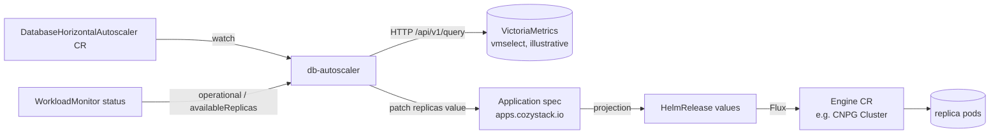

# Database Horizontal Autoscaler for Cozystack

- **Title:** `Database Horizontal Autoscaler for Cozystack`
- **Author(s):** `@scooby87`
- **Date:** `2026-07-08` (addressing review by `@IvanHunters`, Gemini, and CodeRabbit)
- **Status:** Draft

## Overview

Managed databases in Cozystack (`postgres`, `mariadb`, `redis`, `mongodb`, and others) are scaled only manually today: an operator edits the `replicas` value of the application and waits for the underlying operator to converge. This proposal introduces a dedicated operator, `db-autoscaler`, that automatically adjusts the number of **read replicas** of a managed database in response to load, driven by a new HPA-like custom resource `DatabaseHorizontalAutoscaler` (DHA).

The proposal is deliberately scoped to **horizontal scaling of read replicas**, because a stateful database primary cannot be scaled horizontally the way a stateless Deployment can. The autoscaler is topology-aware per engine, respects the synchronous-replica quorum, brakes on replication lag, and applies its decisions by patching the application's `replicas` value (the `Application` `spec`) — the same field a human would edit — so it never fights Flux/GitOps reconciliation.

## Scope and related proposals

This proposal covers **horizontal** autoscaling (read replicas) only. Two sibling axes are explicitly deferred to separate proposals:

- **Vertical autoscaling** — stepping the `resourcesPreset` ladder / in-place pod resize.
- **Storage autoscaling** — automatic PVC expansion when a volume fills up.

Write-path scaling that requires data rebalancing (Kafka broker addition with partition reassignment, ClickHouse/MongoDB sharding) is out of scope for this proposal — it is an orchestrated procedure, not a counter change.

## Context

A managed database in Cozystack is an `Application` in the aggregated `apps.cozystack.io` API. That `Application` is a **pure projection of a Flux `HelmRelease`**: `pkg/registry/apps/application/rest.go` converts both ways (`ConvertApplicationToHelmRelease` sets `Values: app.Spec`, and `ConvertHelmReleaseToApplication` does the reverse), with no separate backing store. Flux reconciles the `HelmRelease` values into the engine operator's custom resource (for example a CloudNativePG `Cluster`, where `packages/apps/postgres/templates/db.yaml` maps `instances: {{ .Values.replicas }}`). Every managed database already exposes a horizontal knob in its values — `replicas` (or `kafka.replicas`, etc.) — and Cozystack already runs the observability the autoscaler needs:

- A per-database `WorkloadMonitor` (`cozystack.io/v1alpha1`, reconciled by `internal/controller/workloadmonitor_controller.go`) reports `status.availableReplicas`, `status.observedReplicas`, and `status.operational`, and already queries VictoriaMetrics over the vmselect Prometheus API.
- Managed-app pods are labeled by the lineage webhook (`internal/lineagecontrollerwebhook/webhook.go`) with `apps.cozystack.io/application.{group,kind,name}` and `internal.cozystack.io/managed-by-cozystack: "true"`.
- VictoriaMetrics (`packages/system/monitoring`) scrapes per-database metrics via `PodMonitor` (for PostgreSQL, `enablePodMonitor: true` on the CNPG `Cluster`).

### The problem

> "My database is saturated with read traffic during business hours and idle at night, but I have to notice it, hand-edit `replicas`, and hope I picked the right number — and undo it later."

There is no automated way to add or remove read replicas under load. Manually reusing a stock `HorizontalPodAutoscaler` does not work here: HPA scales via the scale subresource on the operator CR, which **fights Flux** (reconciliation restores `replicas` from the application values), and HPA has no notion of database topology — it would happily remove a synchronous standby or scale while replication lag is unbounded.

## Goals

- Automatically scale the number of read replicas for primary-replica engines: PostgreSQL (CNPG), MariaDB, Redis, MongoDB (replica set).
- Apply all decisions by patching the `Application`'s `replicas` value (`spec`) — the Flux-compatible, tenant-facing write path — never the operator CR directly.
- Reuse existing telemetry (VictoriaMetrics + `WorkloadMonitor`); introduce no new exporters.
- Be safe for stateful workloads: respect the replica quorum, brake on replication lag, hand scale-down to the engine operator's graceful instance removal, use long stabilization windows, and honor tenant quotas.
- Provide HPA-like observability: status conditions, events, and a `dryRun` mode.

### Non-goals

- Vertical scaling (resources / presets).
- Autoscaling the write path / the primary.
- Engines that require data rebalancing (Kafka brokers, ClickHouse/MongoDB shards).
- Cluster-node autoscaling (that is cluster-autoscaler's job).

## Design

### 1. Replica model (instances vs read replicas)

The `replicas` value is the **total instance count** of the engine, not the read-replica count. For CNPG, `packages/apps/postgres/templates/db.yaml` sets `instances: {{ .Values.replicas }}` — that is `1` primary plus `replicas − 1` standbys, and read traffic is served only by the standbys via the `<release>-ro` endpoint. The autoscaler therefore separates the two counts explicitly through the adapter's `PrimaryCount()` (CNPG returns `1`):

- read-serving replicas now: `Rcur = currentReplicas − PrimaryCount`
- `desiredRead = ceil(Rcur × currentMetric / targetMetric)` (metric averaged over read-serving replicas only, i.e. divided by `replicas − 1`, never by the total)
- `desiredReplicas = desiredRead + PrimaryCount`

`minReplicas`/`maxReplicas` in the CRD count **total instances** (they map to the chart's `replicas` field). `minReplicas` must be `≥ QuorumFloor` and, to serve any reads at all, `≥ 2`.

### 2. Data flow



### 3. Topology adapters

Engine topology differs, so per-`kind` logic is isolated behind an adapter interface. Only primary-replica engines are scalable; sharded modes return `Scalable=false` with a reason.

```go
type TopologyAdapter interface {
    ReplicasPath() string                                         // "replicas" for pg/mariadb/redis/mongo
    PrimaryCount() int32                                          // CNPG: 1 (non-read-serving instances)
    QuorumFloor(appValues map[string]any) int32                  // CNPG: quorum.maxSyncReplicas + 1
    DriverQuery(app types.NamespacedName, k DriverKind) string    // PromQL for read load (per read replica)
    ReplicationLagQuery(app types.NamespacedName) string          // e.g. cnpg_pg_replication_lag gauge; write-activity gated
    Scalable(appValues map[string]any) (bool, reason string)      // false for sharded modes
}
```

MVP ships the `postgres` (CNPG) adapter. Follow-ups: `mariadb`, `redis`, `mongodb` (only when `sharding: false`). `clickhouse`, `kafka`, and sharded `mongodb` report `Scalable=false`.

### 4. Reconcile loop

1. Resolve `targetRef` → load the `Application` values and the linked `WorkloadMonitor`.
2. Ask the adapter `Scalable`? If not → set condition `ScalingActive=False(reason)` and stop.
3. If `operational=false` **or** a scale is still in flight (`availableReplicas != replicas`) → freeze (single-flight) and requeue.
4. Query VictoriaMetrics for the driver metric and the replication lag.
5. Compute `desiredReplicas` per the replica model in §1.
6. Apply guardrails (see below): clamp to `[min,max]`, quorum floor, lag brake, stabilization windows, step limit, tenant quota.
7. If `desiredReplicas != currentReplicas` and the decision passes → patch the `Application`'s `replicas` value (server-side apply, see Ownership). Scale-down is handed to the engine operator, which removes the highest-ordinal standby gracefully and stops routing it in `<release>-ro`.
8. Update `status`, set `lastScaleTime`, emit an Event.

### 5. Guardrails (normative)

- `min ≤ desired ≤ max`; at most `behavior.*.step` replicas per decision.
- `desired ≥ QuorumFloor(app)`. For CNPG the floor is `maxSyncReplicas + 1`: the chart documents `maxSyncReplicas` as "must be less than total replicas", and dropping to/below it makes CNPG cap/reject the change and can starve synchronous commits (writes stall). The floor also never leaves fewer than `minSyncReplicas` standbys available. Pin this to the CNPG version cozystack ships, since the sync-replica API changed across versions.
- **Precedence — quota > quorum floor > min/max.** `maxSyncReplicas` is tenant-mutable after the DHA is created, so at runtime `QuorumFloor` (`maxSyncReplicas + 1`) may exceed `minReplicas`/`maxReplicas`, and may even exceed what the tenant quota permits. The resolution order is fixed and unambiguous: (1) the **tenant quota is a hard ceiling and is never exceeded**; (2) subject to that, the **quorum floor wins** over `minReplicas`/`maxReplicas` — `desired` is clamped *up* to the floor (even above `maxReplicas`), never letting `min`/`max` push the cluster below a safe quorum. When these two rules collide irreconcilably — the quorum floor does not fit the quota (raised `maxSyncReplicas` + tight quota) — the operator does **not** patch and freezes with `ScalingLimited=True` reason `QuorumExceedsQuota` (alert), rather than exceeding quota (which would only hit the StuckScaling path) or scaling below a safe quorum.
- **Lag brake:** replication lag above `maxReplicationLagSeconds` forbids both scale-down and scale-up (`AbleToScale=False`). The signal is the CNPG-exported gauge **`cnpg_pg_replication_lag`** (seconds), already scraped into VictoriaMetrics and used by cozystack's own CNPG dashboards and alerts (`dashboards/db/cloudnativepg.json`, `packages/system/postgres-operator/alerts/`), so no custom query is added. Because that seconds value keeps climbing on a write-idle primary, the brake is **write-activity gated**: it is honoured only while the primary's WAL position is advancing (from CNPG's exported current-vs-`replay_lsn` LSN metrics), so an idle primary does not produce a false freeze during the low-load windows scale-down targets.
- **Cooldown / stabilization:** separate windows for scale-up and (longer) scale-down; scale-down only when the signal held for the whole window.
- **Single-flight with convergence deadline:** one change at a time; the next decision only after `operational=true && availableReplicas == replicas`. Because that gate can never clear if a scale-up cannot converge — a new standby rejected by ResourceQuota admission, an unbindable PVC, or an unschedulable pod — a patched change must reach convergence within `behavior.convergenceDeadlineSeconds` (default a small multiple of the scale-up window). On timeout the operator surfaces `AbleToScale=False` with reason `StuckScaling`, alerts, and **rolls `replicas` back to `status.lastConvergedReplicas`**, releasing single-flight so a subsequent scale-down (which may itself relieve the pressure) is not blocked. `status.lastConvergedReplicas` records the last count that reached `availableReplicas == replicas`. Note the tenant-quota pre-check is advisory (a concurrent allocation can consume quota between check and pod creation), so this stuck path is reachable in practice, not just in theory.
- **Tenant quota:** the new replica count × preset resources must fit the tenant quota; otherwise `ScalingLimited=True`.
- **Fail-safe freeze:** if vmselect is unreachable or the metric is missing, do not scale (never scale blind); alert.
- **dryRun:** decisions are written to status/events but no patch is applied.

## User-facing changes

A new namespaced CRD, `DatabaseHorizontalAutoscaler` (group `autoscaling.cozystack.io/v1alpha1`), created by a tenant next to their database application:

```yaml
apiVersion: autoscaling.cozystack.io/v1alpha1
kind: DatabaseHorizontalAutoscaler
metadata: { name: db, namespace: tenant-acme }
spec:
  targetRef: { kind: Postgres, name: db }   # apiGroup defaults to apps.cozystack.io
  minReplicas: 2                            # TOTAL instances (primary + standbys); >= 2 to serve reads
  maxReplicas: 6
  metrics:
    - type: ReadConnections                  # | ReadCPUUtilization  (fixed, safe set)
      target: { averageValue: "150" }        # per read-serving replica
  behavior:
    scaleUp:   { stabilizationWindowSeconds: 300,  step: 1 }
    scaleDown: { stabilizationWindowSeconds: 1800, step: 1 }
    convergenceDeadlineSeconds: 900          # patched scale must converge within this, else StuckScaling + roll back
  constraints:
    respectQuorum: true
    maxReplicationLagSeconds: 30
    gracefulScaleDown: true                  # operator-native; DHA does not terminate backends
  dryRun: false
status:
  currentReplicas: 3
  desiredReplicas: 4
  lastConvergedReplicas: 3                    # last count that reached availableReplicas == replicas
  lastScaleTime: "..."
  currentMetrics: [ { type: ReadConnections, averageValue: "210" } ]
  conditions: [ ScalingActive, AbleToScale, ScalingLimited ]   # reasons incl. StuckScaling, QuorumExceedsQuota
```

When several `metrics` are set, the desired count is the **maximum** of the per-metric desired counts (HPA semantics). The dashboard can surface the DHA status and scaling events like it does for other application sub-resources. When no DHA references an application, nothing changes.

## Upgrade and rollback compatibility

- **Opt-in and off by default.** The operator ships as an optional platform package, enabled via `bundles.enabledPackages`. Existing clusters, manifests, and APIs are unaffected until a tenant creates a DHA.
- **Ownership (enforced, not advisory).** While a DHA is active, the autoscaler is the **single explicit owner** of the application's `replicas` value. Enforcement: the operator writes `replicas` via **server-side apply with a dedicated field manager (`db-autoscaler`)** and stamps a marker annotation `autoscaling.cozystack.io/managed-by: <dha-name>` on the `Application`. A competing declarative writer (Flux from a tenant GitOps repo, a human edit) that also claims `replicas` produces an SSA field-manager conflict, which the operator surfaces as a `ScalingLimited`/conflict condition rather than silently fighting. `RetryOnConflict` handles only API-level write races on a single writer — it is **not** the ownership mechanism. **This SSA guarantee holds only against writers that do not force-apply:** a tenant GitOps Flux `Kustomization` with `spec.force: true` (a common setting) takes over the `replicas` managed-fields entry, so the autoscaler's next (non-force) apply is the one that hits the conflict — i.e. the autoscaler loses ownership rather than the competitor. Because SSA alone cannot win against a force-applier, a **validating admission webhook** that rejects conflicting `replicas` writes for DHA-managed applications is **recommended** to close this case deterministically (tracked in Open questions), not merely optional. **Caveat — field-level SSA is not yet confirmed for this API:** `Application` is served by a hand-written `rest.Patcher` (`pkg/registry/apps/application/rest.go`), not a CRD, and its existing conflict test (`rest_conflict_test.go`) covers only `RetryOnConflict` on the backing `HelmRelease` resourceVersion — not per-field managed-fields SSA. If the aggregated Patch handler does not track `.spec.replicas` at field granularity, this ownership model and the `lastConvergedReplicas` rollback silently degrade to advisory. A spike against a real API server (see Testing) must confirm field-level SSA before MVP; **if it does not hold, the admission webhook is mandatory, not merely recommended.**
- **Rollback.** Deleting the DHA stops all autoscaling immediately (and clears the marker), leaving the application at its current `replicas`. Disabling the package removes the operator; no data migration is involved and the change is fully reversible.

## Security

- **RBAC.** The operator needs: read DHA and read/patch `applications.apps.cozystack.io`; read `workloadmonitors.cozystack.io`; read `pods`; read `resourcequotas` (core) for the tenant-quota guardrail; and read-only HTTP to vmselect. The `resourcesPreset → resources` mapping is a static table compiled into the operator from the published cozy-lib preset ladder, so no cluster read of preset definitions is required. The operator has **no** write access to Pods, Services, or Endpoints, **no** exec, and **no** direct access to engine operator CRs or Flux `HelmRelease` objects — only the aggregated apps API.
- **Multi-tenancy.** DHA is namespaced and lives in the tenant namespace. Tenant access is granted through the platform's RBAC-aggregation mechanism: the DHA package **ships its own self-contained ClusterRoles** labelled `rbac.cozystack.io/aggregate-to-tenant[-view|-admin|-super-admin]: "true"` (per `packages/system/cozystack-basics/templates/clusterroles.yaml`) — it does **not** edit the shared `cozystack-basics` file, whose write tiers grant apps via a hard-coded per-kind allowlist rather than a wildcard. This gives the tenant ServiceAccount full access, human `view` read-only, and `admin`/`super-admin` write on `databasehorizontalautoscalers.autoscaling.cozystack.io`. A tenant can only autoscale its own applications, and scale-up is validated against the tenant quota.
- **Single active reconciler (HA).** The operator runs as `replicas: 1` with controller-runtime leader-election enabled; per-target reconcile state (the `managed-by` marker, single-flight, and the convergence rollback to `lastConvergedReplicas`) assumes exactly one active writer, so availability is active/standby via leader-election, never active/active — two live reconcilers would race on the annotation write and the rollback decision.
- **Bounded inputs.** All tenant-supplied DHA fields are enumerable and schema-validated: `minReplicas`/`maxReplicas` (integers), a fixed `metrics[].type` enum (`ReadConnections`, `ReadCPUUtilization`), numeric targets, and windows. Arbitrary tenant-supplied PromQL is **not** accepted (see Alternatives), so there is no path for a tenant query to read another tenant's series from shared vmselect. No new secrets are stored or transmitted.

## Failure and edge cases

- vmselect unreachable or metric missing → the autoscaler freezes (no scaling) and surfaces `AbleToScale=False`; alert fires.
- Replication lag above the configured threshold **and the primary is actively writing** → no scale-up and no scale-down until lag recovers. An idle primary does not trip the brake (write-activity gating).
- Scale still in flight (`availableReplicas != replicas`) → single-flight; the next decision waits for convergence, preventing thrashing.
- Scale-up patched but never converges (quota-rejected standby, unbindable PVC, unschedulable pod) → after `convergenceDeadlineSeconds` the operator surfaces `AbleToScale=False(StuckScaling)`, alerts, and rolls `replicas` back to `status.lastConvergedReplicas`, so the autoscaler is not frozen and a relieving scale-down can proceed.
- Target is a sharded engine (e.g. ClickHouse, or MongoDB with `sharding: true`) → `ScalingActive=False` with a clear reason; no action.
- Desired count would drop to/below the quorum floor (`maxSyncReplicas + 1`) → clamped to the floor; `ScalingLimited=True`.
- Tenant quota exceeded on scale-up → clamped; `ScalingLimited=True`.
- Quorum floor exceeds the tenant quota (raised `maxSyncReplicas` + tight quota) → no patch; freeze with `ScalingLimited=True(QuorumExceedsQuota)` and alert — quota is never exceeded and quorum is never violated.
- A competing writer claims `replicas` → SSA conflict surfaced as a condition; the autoscaler does not enter a write war.

## Testing

- **Unit:** reconcile decisions and each `TopologyAdapter` (including the `PrimaryCount`/`replicas − 1` math and `QuorumFloor = maxSyncReplicas + 1`) with mocked VictoriaMetrics and a mocked Application client (`go test ./internal/controller/...`).
- **Codegen:** `make generate` produces the CRD and deepcopy without errors.
- **envtest (apiserver-backed):** the ownership path is exercised against a real API server, since server-side-apply managed-fields conflict semantics do not exist with a mocked client. A competing writer claims `replicas` both without force and with `force: true`, and the test asserts the `autoscaling.cozystack.io/managed-by` marker, the surfaced conflict condition, and the absence of scaling thrash. This is the only layer that actually verifies the ownership guarantee — the mocked unit tests above cannot. The spike also confirms whether the aggregated `apps.cozystack.io` Patch handler tracks `.spec.replicas` managed-fields **at all** (see the Ownership caveat); if it does not, the ownership guarantee falls back to the admission webhook.
- **Manual (dev cluster, CNPG postgres):** create a DHA with `dryRun: true` → decisions appear in `status`/Events, replicas unchanged. Then disable `dryRun` under read load → the `Application`'s `replicas` grows, CNPG adds a standby, reads route to `<release>-ro`, and Flux does not revert; on load decrease and after the window, scale-down removes a standby gracefully and never drops to/below `maxSyncReplicas + 1`.
- **Negative:** vmselect down → freeze; lag above threshold with active writes → no scaling; idle primary with high lag-seconds → no false freeze; DHA targeting a sharded ClickHouse → `ScalingActive=False`; concurrent GitOps write to `replicas` → SSA conflict condition, no thrash (covered by the envtest above).

## Rollout

1. **PoC** — CNPG PostgreSQL on a dev cluster: DHA + `replicas` patch driven by `ReadConnections`; confirm Flux does not revert and reads route to `<release>-ro`.
2. **MVP** — the operator plus the `postgres` adapter, full guardrails (quorum, lag, cooldown, quota), `dryRun`, dashboard surface and events. Shipped as an optional `paas`-bundle package that declares a hard `PackageSource.dependsOn`-class dependency on the monitoring stack (VictoriaMetrics/vmselect + `WorkloadMonitor`) — the decision loop cannot function without it, the same cold-install ordering the platform already applies to cert-manager-dependent charts. The operator Deployment runs a **single active instance** (`replicas: 1` with controller-runtime **leader-election**), so two replicas never race on the `managed-by` annotation, single-flight, or the `lastConvergedReplicas` rollback.
3. **Adapter expansion** — `mariadb` → `redis` → `mongodb` (replica set).
4. **Observability & policy** — Grafana dashboard of scaling decisions, alerts for "limit reached / freeze".

## Open questions

- Adapter order after MVP: `mariadb` → `redis` → `mongodb`?
- Default driver metric: read connections, read QPS, or replica CPU (to be calibrated on real workloads)?
- Is scale-down enabled by default, or scale-up only (down conservative/manual)?
- Ownership enforcement: **does the aggregated `apps.cozystack.io` Patch handler support per-field managed-fields SSA at all** (spike required — see Testing)? If not, the SSA field-manager + marker is insufficient and the validating admission webhook that hard-rejects conflicting `replicas` writes for DHA-managed applications becomes mandatory (it is also the only thing that beats a `spec.force: true` writer).

## Alternatives considered

- **A controller inside `cozystack-controller`** instead of a standalone operator. It would reuse the existing binary, RBAC, and VictoriaMetrics helper, at the cost of coupling the autoscaler's lifecycle to the platform controller. Rejected in favor of a standalone operator for isolation and an independent release cadence; the logic can be moved later if desired.
- **Patching the engine CR / `HelmRelease` directly.** A direct patch to the operator CR is reverted by Flux. Patching `HelmRelease` values directly is possible but bypasses the supported surface. Note that the `Application` is a pure projection of the `HelmRelease` (rest.go converts both ways, `Values: app.Spec`), so patching the `Application`'s `replicas` **is** writing the same `HelmRelease` values — there is no background regeneration that would clobber it. The reasons to prefer the apps API are validation, label/lineage management, and it being the supported tenant surface, not clobber-avoidance.
- **Stock HPA + KEDA.** Rejected as the primary mechanism: it fights Flux, is topology-unaware, and offers no safe scale-down (quorum, lag, graceful removal). A KEDA/PromQL-style trigger could be reused *as a metric source inside* the operator only if the operator injects a mandatory tenant/namespace label matcher into every query and rejects any query it cannot constrain — never as raw tenant-supplied PromQL against shared vmselect.
- **Scaling the write path via sharding.** Out of scope: it requires data rebalancing (Cruise Control for Kafka, resharding for ClickHouse/MongoDB), which is an orchestrated procedure rather than a replica-count change.

---

<!--
Inspired by KubeVirt enhancement proposals
(https://github.com/kubevirt/enhancements) and Kubernetes Enhancement
Proposals (KEPs).
-->
