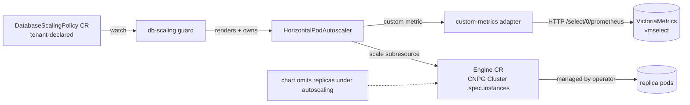

# Database Horizontal Autoscaler for Cozystack

- **Title:** `Database Horizontal Autoscaler for Cozystack`
- **Author(s):** `@scooby87`
- **Date:** `2026-07-08`; revised `2026-07-24` (mechanism) and `2026-07-29` (addressing @lllamnyp and @IvanHunters review on PR #44), with earlier review by @IvanHunters, Gemini, and CodeRabbit
- **Status:** Draft

## Overview

This proposal adds automatic horizontal scaling of a managed database's **read replicas** in response to load, using **the stock Kubernetes `HorizontalPodAutoscaler` (HPA) acting on the engine operator's `scale` subresource**, plus a one-line chart change so the replica field is no longer declared in Git, plus a thin engine-aware controller — the **`DatabaseScalingPolicy` guard** — that renders the HPA, encodes the two database-specific brakes HPA lacks (synchronous-quorum floor and replication-lag gate), and drives a custom metric that makes stock HPA arithmetic compute the correct read-replica count.

The proposal is deliberately scoped to **horizontal scaling of read replicas**: a stateful primary cannot be scaled horizontally the way a stateless Deployment can. The MVP targets **PostgreSQL (CloudNativePG)**; see [Scope](#scope-and-related-proposals) for the engine ladder.

### Why this changed

An earlier revision proposed a bespoke `db-autoscaler` operator that owned the application's `replicas` value and enforced that ownership against competing writers. An implementation spike disproved the enforcement premise it rested on — SSA field ownership does not hold on the aggregated apps API, admission webhooks cannot fire there, and the fallback HelmRelease webhook is advisory, bypassable, and platform-wide. The spike also showed the whole conflict is self-imposed: it exists only because our own chart unconditionally templates the replica field, so removing that declaration under autoscaling makes the ownership problem disappear rather than needing to be enforced. The full spike findings are preserved in the [Appendix](#appendix-findings-from-the-implementation-spike); this revision builds on their conclusion — reuse HPA, do not reimplement it.

## Scope and related proposals

This proposal covers **horizontal** autoscaling (read replicas) only. Two sibling axes are deferred to separate proposals: **vertical autoscaling** (stepping the `resourcesPreset` ladder / in-place resize) and **storage autoscaling** (automatic PVC expansion). Write-path scaling that requires data rebalancing (Kafka broker addition, ClickHouse/MongoDB sharding) is out of scope — it is an orchestrated procedure, not a counter change.

**Engine scope of the MVP.** The HPA-on-`scale`-subresource mechanism applies to engines whose operator CR exposes a `scale` subresource: PostgreSQL (CloudNativePG `Cluster.spec.instances`) and MariaDB (`MariaDB.spec.replicas`). The MVP ships **PostgreSQL**; MariaDB follows once its cozystack chart supports on-the-fly scale-out (today it does not — see [Failure and edge cases](#failure-and-edge-cases)). **Redis (spotahome RedisFailover) and MongoDB (Percona) expose no `scale` subresource**, so a stock HPA cannot drive them; they are deferred to a follow-up that adds a thin actuation shim (see [Alternatives considered](#alternatives-considered)).

## Context

A managed database in Cozystack is an `Application` in the aggregated `apps.cozystack.io` API — a **pure projection of a Flux `HelmRelease`** (`pkg/registry/apps/application/rest.go` converts both ways, no separate backing store). Flux reconciles the `HelmRelease` values into the engine operator's CR — for CNPG a `Cluster`, where `packages/apps/postgres/templates/db.yaml` maps `instances: {{ .Values.replicas }}`. Cozystack already runs the observability the autoscaler needs:

- A per-database `WorkloadMonitor` (`cozystack.io/v1alpha1`) reports `status.availableReplicas`, `status.observedReplicas`, and `status.operational`.
- Managed-app pods carry the lineage labels `apps.cozystack.io/application.{group,kind,name}` (via `internal/lineagecontrollerwebhook/webhook.go`), and kube-state-metrics exports `kube_pod_labels` (including CNPG's `cnpg.io/instanceRole` as `label_cnpg_io_instance_role`), so a metric can be scoped to one application's read-serving pods and to the standby role.
- VictoriaMetrics (`packages/system/monitoring`) scrapes per-database metrics; for PostgreSQL `enablePodMonitor: true` exports `cnpg_*` series, including the replication-lag gauge. vmselect is reachable at `vmselect-<name>.<ns>.svc:8481/select/0/prometheus`.

## Design

### 1. Replica model and metric encoding

The engine's total instance count is `1` primary plus `replicas − 1` standbys; read traffic is served only by the standbys via `<release>-ro`. The autoscaling target is per read-serving replica:

- read-serving replicas now: `Rcur = currentInstances − primaryCount` (CNPG `primaryCount = 1`)
- `desiredRead = ceil(Σ readLoad over standbys / targetPerStandby)`
- `desiredInstances = desiredRead + primaryCount`

A stock HPA has no `+ primaryCount` term and no notion of "standbys only" — for a metric it just computes a desired count. The choice of metric *type* is therefore the formula, and the two options are not interchangeable: an **External** metric is a single free-standing value (`desired = ceil(value / target)`, no pod divisor), whereas a **Custom (Pods)** metric (`custom.metrics.k8s.io`, `type: Pods`) is averaged by HPA over the scale target's pods (`desired = ceil(currentPods × avg / target)`). We use the **Custom (Pods)** encoding and synthesize the series so unmodified HPA arithmetic reproduces the model exactly:

> Each **standby** pod reports its own read load `Lᵢ`; the **primary** pod reports **exactly `targetPerStandby`**. With `N = currentInstances` pods, HPA computes `desired = ceil(N × avg / target) = ceil((target + ΣLᵢ) / target) = 1 + ceil(ΣLᵢ / target) = primaryCount + desiredRead`.

The `+1` for the primary and the "divide by standbys only" both fall out of the primary reporting the target value — no controller math, no external-metric offset hacks. Worked example, `target = 150` active read connections per standby, a 3-instance cluster (1 primary + 2 standbys): at `ΣLᵢ = 210` → `avg = (150+210)/3 = 120`, `desired = ceil(3×120/150) = ceil(2.4) = 3` (holds); at `ΣLᵢ = 600` → `avg = 250`, `desired = ceil(750/150) = 5` (scales up). Validating this encoding end-to-end against a real HPA is the first thing the PoC must do.

The two MVP metrics are the same read-load signals the platform already scrapes: active read connections (`cnpg_backends_total{state="active"}`) and read-path CPU (`rate(container_cpu_usage_seconds_total{container="postgres"}[5m])`), each joined to the standby role through `kube_pod_labels{label_cnpg_io_instance_role="replica"}`.

### 2. Data flow



The engine operator owns instance lifecycle: CNPG adds/removes the highest-ordinal standby gracefully, never the primary, and routes reads through `<release>-ro`. The autoscaler never decides *which* instance to remove.

### 3. Chart change: stop declaring `replicas` under autoscaling

Each autoscalable chart wraps its replica field so that, when autoscaling is enabled for that application, the field is omitted from the rendered engine CR:

```yaml
# packages/apps/postgres/templates/db.yaml (illustrative)
spec:
{{- if not .Values.autoscaling.enabled }}
  instances: {{ .Values.replicas }}
{{- end }}
```

With the field absent from the HelmRelease values, Flux neither sets nor reverts it, and the HPA is the sole writer of `.spec.instances` via the `scale` subresource. This is what deletes the entire ownership problem — no marker annotation, SSA field manager, admission webhook, or terminal-freeze conflict handling is needed, because there is no contested field.

The conditional keys off `autoscaling.enabled`, **not** off presence of the field: the aggregated apps API re-materializes `replicas: 2` from the values-schema default on every round-trip (`packages/apps/postgres/values.schema.json`), so a `hasKey`-style check would always see the field and reopen the conflict. This is harmless only because the chart *ignores* the value under autoscaling — the one sentence here exists to stop a later "simplification" from breaking it.

### 4. Custom-metrics adapter (shared platform infrastructure)

The HPA's Custom (Pods) metric is served by a **cluster-singleton adapter that registers the `custom.metrics.k8s.io` APIService** and reads from vmselect. Cozystack ships no custom/external metrics API today (only metrics-server's `metrics.k8s.io` resource metrics), so this adapter is **new shared infrastructure** other features will lean on — it warrants its own package and lifecycle, not an afterthought. Whatever backs it (prometheus-adapter, a KEDA metrics apiserver, or a purpose-built adapter), it must:

- serve the per-pod encoding from §1 (standbys report `Lᵢ`, primary reports `target`), selecting pods by the lineage labels `apps.cozystack.io/application.{group,kind,name}` (not an ad-hoc `app:` label);
- inject a mandatory namespace/label matcher into every query and reject any query it cannot constrain, so no tenant series crosses tenants;
- implement the lag brake as a metric-layer clamp (see §5).

The Custom-vs-External decision in §1 constrains this choice; it is a design commitment, not an open question.

### 5. The guard and the `DatabaseScalingPolicy`

The tenant declares a single namespaced CR, `DatabaseScalingPolicy`; the **guard renders and owns the HPA** as an implementation detail. This is deliberate: a controller must never edit a spec a tenant also declares (that recreates the revert war one level up, on the HPA's `min`/`maxReplicas`). Because the guard is the sole writer of the HPA it creates, there is no second writer to contend with; because the tenant never touches the HPA, no tenant RBAC on `autoscaling/v2` is required (there is none today). The guard encodes the brakes as follows:

- **Quorum floor** — the guard sets `minReplicas = max(2, maxSyncReplicas + 1)` on its HPA and reconciles it when `maxSyncReplicas` changes, so HPA can never drive the cluster below a safe synchronous quorum; CNPG rejects an unsafe count as a backstop. This is a defaulting/validation rule on a field HPA already has, not a reconcile loop fighting anyone.
- **Replication-lag brake (metric layer)** — while `cnpg_pg_replication_lag` exceeds `maxReplicationLagSeconds` **and the primary is actively writing** (gated on `rate(cnpg_pg_stat_replication_sent_diff_bytes[5m]) > 0`, so an idle primary does not trip it), the adapter clamps every standby's series to exactly `target`, which drives `desired = currentInstances` and **freezes scaling in both directions**. Freezing both ways (not just blocking scale-up, as `maxReplicas`-pinning would) matches the intended brake semantics — scaling down under high lag is equally unsafe. The clamp has **hysteresis**: it releases only after lag falls below a lower recovery threshold (e.g. `0.5 × maxReplicationLagSeconds`) sustained for a cooldown, so the brake does not flap around a single boundary.
- **Scale-down pacing** — the guard pins `behavior.scaleDown.policies: [{type: Pods, value: 1, periodSeconds: ~600}]` on its HPA, so at most one standby is removed per period (restoring the step-of-1 conservatism the design review fought for; the default HPA policy would allow removing 100% of pods in 15s). `periodSeconds` is a deliberate value on the order of minutes — sized against replica provisioning latency (see Failure and edge cases) — and calibrated on real workloads.
- **Dry-run / recommendation** — a mode where the guard computes and reports the recommendation (status, events, metrics, alerts) without creating or actuating the HPA, so behavior can be validated before enabling actuation.

Quota is not re-implemented: HPA scales the engine CR, pod creation passes through the tenant `ResourceQuota` admission, so an over-quota scale-up simply fails to create pods and is reflected in the CR/HPA status. The guard keeps an **alert on a persistently unmet desired count** so this does not fail silently.

## User-facing changes

A tenant enables autoscaling on the database and creates one `DatabaseScalingPolicy`. The HPA is rendered by the guard and shown here only for reference — the tenant does not author it:

```yaml
# tenant declares: turn on autoscaling + one policy
apiVersion: apps.cozystack.io/v1alpha1
kind: Postgres
metadata: { name: db, namespace: tenant-acme }
spec:
  autoscaling: { enabled: true }        # chart omits instances; HPA owns it
---
apiVersion: autoscaling.cozystack.io/v1alpha1
kind: DatabaseScalingPolicy
metadata: { name: db, namespace: tenant-acme }
spec:
  targetRef: { kind: Postgres, name: db }
  minReplicas: 2                        # total instances; guard raises to quorum floor if needed
  maxReplicas: 6
  metrics:
    - type: ReadConnections             # | ReadCPUUtilization
      target: { averageValue: "150" }   # per read-serving replica
  maxReplicationLagSeconds: 30
  dryRun: false
```

```yaml
# rendered + owned by the guard (reference only):
apiVersion: autoscaling/v2
kind: HorizontalPodAutoscaler
metadata: { name: db, namespace: tenant-acme, ownerReferences: [DatabaseScalingPolicy/db] }
spec:
  scaleTargetRef: { apiVersion: postgresql.cnpg.io/v1, kind: Cluster, name: postgres-db }
  minReplicas: 3                        # max(2, maxSyncReplicas+1)
  maxReplicas: 6
  metrics:
    - type: Pods
      pods:
        metric: { name: cozystack_db_read_load, selector: { matchLabels: { "apps.cozystack.io/application.name": db } } }
        target: { type: AverageValue, averageValue: "150" }
  behavior:
    scaleUp:   { stabilizationWindowSeconds: 300 }
    scaleDown: { stabilizationWindowSeconds: 1800, policies: [{ type: Pods, value: 1, periodSeconds: 600 }] }
```

When `autoscaling.enabled` is false and no policy exists, nothing changes — the chart templates `replicas` exactly as today.

## Upgrade and rollback compatibility

- **Opt-in and off by default.** The chart conditional is inert unless `autoscaling.enabled` is set; the guard and metrics adapter are optional platform packages. Existing clusters are unaffected.
- **Enabling autoscaling on an existing database — the one real migration, and it needs a deterministic two-phase order.** Flipping `autoscaling.enabled` removes `instances` from the rendered CR, and Helm's three-way merge deletes a key present in the old manifest and absent from the new one **regardless of who last wrote it** — so simply pre-setting `.spec.instances` through the scale subresource does **not** save it: the upgrade deletes the field, CNPG defaults to **1 instance**, and the HPA only re-raises it after CNPG has already begun removing standbys. A safe rollout therefore needs a real two-phase design — e.g. a transition window in which the chart templates `.spec.instances` as a floor (rendered in both the old and new manifest so three-way merge never sees it disappear) while the HPA takes over, then a second phase that drops the floor once the HPA is the established writer. The precise operation order must be worked out and exercised on a dev cluster before MVP; "must be tested" is a gate, not the mechanism.
- **Steady state after migration is correct.** With the field absent from both the previous and the current render, three-way merge leaves the HPA-set `.spec.instances` untouched.
- **Cold start.** Until the HPA takes its first sample it holds at `minReplicas`; a brief window at the floor is expected.
- **Enablement constraint — `minReplicas ≥ 2` changes single-instance footprint.** Enabling autoscaling on a current single-instance Postgres permanently doubles instances (a second replica's PVC and DRBD volume). This is legitimate but must be a conscious enablement decision, not a surprise.
- **Dependent objects.** Consumers that read `.Values.replicas` (dashboards, some tooling) must switch to the observed count. Note the two are distinct: the **engine CR** carries `.status.instances`; the **`WorkloadMonitor`** carries `availableReplicas`/`observedReplicas`/`operational` — do not read a nonexistent `WorkloadMonitor.status.instances`.
- **Rollback.** Set `autoscaling.enabled: false` and delete the policy: the chart resumes templating `replicas` and Flux reconciles it back. Fully reversible; no data migration.

## Security

- **RBAC (much reduced).** The guard needs: read/write its `DatabaseScalingPolicy` and status; create/update/own the rendered `HorizontalPodAutoscaler`; read `workloadmonitors`; read-only HTTP to vmselect. It needs **no** write to `Application`/`HelmRelease`, **no** admission webhook, **no** SSA field manager, and **no** engine-CR writes (the HPA does that through the scale subresource). The tenant needs RBAC only on `databasescalingpolicies`, granted through the platform's aggregated tenant ClusterRoles — **not** on `autoscaling/v2` (which cozystack-basics does not grant, and now need not).
- **Honest note on capability.** An HPA driving a CNPG `Cluster`'s `.spec.instances` scales a resource the tenant has no direct write access to. Because the guard owns the HPA and derives its target from the tenant's own database, this is bounded to the tenant's own workload — but it is a real, if narrow, elevation and is stated here on the record.
- **Multi-tenancy.** The policy and HPA are namespaced and live in the tenant namespace; the metrics adapter injects a mandatory namespace matcher, so no tenant query reads another tenant's series.
- **Blast radius.** No cluster-wide admission webhook — a key regression of the first design is gone; enabling the feature adds no admission hop to unrelated Flux reconciliation.

## Failure and edge cases

- **Replica provisioning latency (stateful reality).** A new CNPG standby does not serve reads immediately: PVC provisioning + base backup/clone + WAL catch-up can take minutes to hours for a large database. `scaleUp.stabilizationWindowSeconds` paces *decisions*, not *readiness*. Worse, cloning a new standby adds WAL-streaming load that *raises* replication lag exactly at scale-up, which can trip the lag brake and freeze further scaling — a feedback loop. The feature is therefore meaningful for read-heavy databases whose working set clones in minutes, not for very large datasets where a clone dominates the load window; during a clone the guard reports the in-progress scale and the brake behavior explicitly rather than issuing more scale-ups.
- vmselect unreachable or metric missing → HPA has no metric and holds the current count (`ScalingActive=False` on the HPA); the guard alerts. No blind scaling.
- Replication lag above threshold with an actively-writing primary → metric clamp freezes scaling both ways until lag recovers past the hysteresis band; an idle primary does not trip the brake.
- Desired count would drop to/below the quorum floor → `minReplicas` holds it; CNPG rejects an unsafe count as backstop.
- Over-quota scale-up → pods fail `ResourceQuota` admission; the CR/HPA surface the unmet count; the guard alerts on a persistently unmet desired.
- **Read disruption on scale-down.** Removing the highest-ordinal standby gracefully still severs read connections pinned to it through `<release>-ro`. Clients must tolerate reconnection; connection draining / graceful client failover is a known limitation to document for tenants (and a candidate follow-up).
- MariaDB whose chart lacks scale-out support (`replication.replica.bootstrapFrom` unset) → operator rejects on-the-fly scale-out (`MariaDBScaleOutError`); MariaDB stays out of the enabled set until the chart is fixed.
- Redis / MongoDB → no scale subresource; rejected by the guard with a clear reason (deferred to the shim follow-up).
- Sharded engine (ClickHouse, sharded MongoDB) → out of scope; not autoscalable.

## Testing

- **PoC first — validate the metric encoding (§1) against a real HPA:** confirm the standby-`Lᵢ` / primary-`target` Custom (Pods) series makes stock HPA compute `desiredInstances = desiredRead + 1`, and that `ceil` boundaries behave. This gates everything else.
- **Unit:** the replica-model math and the quorum/lag logic in the guard, with mocked VictoriaMetrics.
- **Chart:** `helm template` with `autoscaling.enabled: true` omits the replica field; with it false, renders `replicas` exactly as today (regression guard).
- **Migration (dev cluster, CNPG):** exercise the two-phase enable on a running multi-instance cluster and assert it does **not** collapse to 1 instance, then drive load and confirm HPA scales `.spec.instances`, reads route to `<release>-ro`, and Flux does not revert. This replaces the first revision's force-writer ownership envtest, which is no longer meaningful — there is no ownership to enforce.
- **Guard integration:** lag above threshold with active writes freezes scaling both ways and releases only past the hysteresis band; quorum floor tracks `maxSyncReplicas`; scale-down removes one standby per `periodSeconds`; `dryRun` reports without creating an HPA.
- **Negative:** vmselect down → no scaling; idle primary with high lag-seconds → no false brake; MariaDB without scale-out → rejected; Redis → rejected.

## Rollout

1. **PoC** — CNPG on a dev cluster: chart conditional + guard-rendered HPA on `.spec.instances` driven by the synthesized read-load metric; validate the arithmetic and that Flux does not revert.
2. **MVP** — PostgreSQL: the chart change, the custom-metrics adapter (namespace-scoped, lag-clamp), the guard + `DatabaseScalingPolicy` (quorum floor, lag brake, scale-down pacing, dry-run), dashboard surface and alerts.
3. **MariaDB** — once the cozystack mariadb chart supports on-the-fly scale-out.
4. **Redis / MongoDB** — a follow-up proposal for a thin actuation shim, since neither exposes a scale subresource.

## Open questions

- Which implementation backs the custom-metrics adapter (prometheus-adapter, a KEDA metrics apiserver, or purpose-built) — constrained by the Custom (Pods) choice in §1 and by the lag-clamp requirement.
- Exact two-phase migration mechanic (chart-templated floor during transition vs a staged operator-driven handover), to be settled on a dev cluster before MVP.
- Default driver metric (read connections vs read QPS vs replica CPU), to be calibrated on real workloads.
- `periodSeconds` for scale-down pacing and the hysteresis recovery band — deliberate defaults to be tuned.

## Alternatives considered

- **A bespoke `db-autoscaler` operator owning `replicas` (the first revision).** Rejected after the implementation spike (see Appendix). It re-drew HPA's API surface field-for-field and re-implemented its decision loop, and its ownership guarantee proved unbuildable on the aggregated apps API. This design keeps HPA's hardened loop and confines net-new code to the brakes HPA lacks.
- **HPA writing the `Application`'s `replicas` value (apps API) instead of the engine CR.** This is what the first revision did; it is the source of the whole ownership problem, because the apps values are declared in Git and reverted by Flux. Writing the engine CR's scale subresource while the chart omits the field avoids the conflict at its root.
- **A guard that pins `min`/`maxReplicas` on a tenant-declared HPA.** Rejected: it relocates the revert war from `replicas` to the HPA spec. Having the guard *own* the HPA (this design) removes the second writer entirely.
- **External metric instead of Custom (Pods).** Rejected: External `AverageValue` has no pod divisor, so it cannot express the read-replica model without off-by-primary errors; the Custom (Pods) encoding makes the model fall out of stock HPA arithmetic.
- **A thin actuation shim for engines without a scale subresource (Redis, MongoDB).** For these, HPA cannot act directly; a minimal shim watching a stock HPA's recommendation behind the same brakes is the honest path — deferred to a follow-up.
- **Stock HPA + KEDA with tenant-supplied PromQL.** Rejected for the metric layer: raw tenant PromQL against shared vmselect breaks isolation. A KEDA/prometheus-adapter trigger is acceptable only with a platform-injected mandatory namespace matcher.
- **Scaling the write path via sharding.** Out of scope: requires data rebalancing, an orchestrated procedure rather than a replica-count change.

## Appendix: Findings from the implementation spike

The first revision rested on one load-bearing claim: the autoscaler could be the *enforced* single owner of the application's `replicas` value, writing it through the aggregated apps API. Building it disproved that claim, and these findings are why the mechanism changed:

1. **SSA field-level ownership does not hold on the aggregated apps API.** The `Application` spec is an opaque JSON blob and its managed-fields are not round-tripped, so a dedicated field manager cannot claim `.spec.replicas`. The first revision's open question — "does the aggregated Patch handler support per-field SSA at all?" — is answered: no.
2. **Admission webhooks cannot fire on the aggregated API.** kube-apiserver proxies aggregated-API requests to the extension server, where admission does not run; enforcement had to move to the backing Flux `HelmRelease`.
3. **The HelmRelease webhook is neither cheap nor sufficient.** It must allowlist the apps-API ServiceAccount (so a tenant edit through the apps API bypasses the guard) and must not hard-fail Flux during an outage. What remains is advisory ownership plus a platform-wide admission hop — not the enforced guarantee promised.
4. **The root cause is self-imposed.** The autoscaler-vs-Flux conflict exists only because the chart unconditionally templates the replica field. Removing that declaration under autoscaling (§3) makes the entire ownership problem disappear.

---

<!--
Inspired by KubeVirt enhancement proposals
(https://github.com/kubevirt/enhancements) and Kubernetes Enhancement
Proposals (KEPs).
-->
