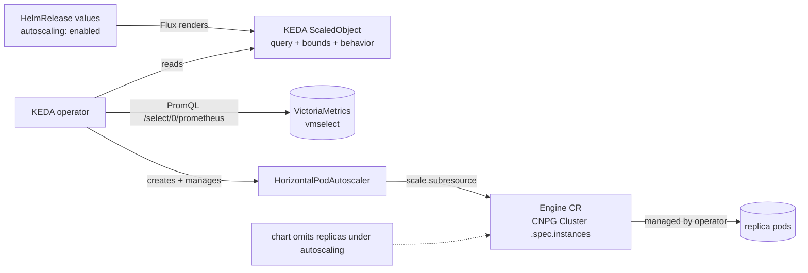

# Database Horizontal Autoscaler for Cozystack

- **Title:** `Database Horizontal Autoscaler for Cozystack`
- **Author(s):** `@scooby87`
- **Date:** `2026-07-08`; revised `2026-07-24` (mechanism), `2026-07-29` and `2026-07-31` (addressing @lllamnyp and @IvanHunters review on PR #44), with earlier review by @IvanHunters, Gemini, and CodeRabbit
- **Status:** Draft — mechanism reopened by the `2026-08-10` PoC finding below
- **PoC:** `2026-08-10` — live validation surfaced a blocking constraint in CNPG; see [PoC finding](#poc-finding-2026-08-10--blocking-the-cnpg-scale-subresource-exposes-no-selector)

## Overview

This proposal adds automatic horizontal scaling of a managed database's **read replicas** in response to load. The mechanism is **entirely stock**: the application chart renders a **KEDA `ScaledObject`** next to the database; KEDA queries VictoriaMetrics for the read load, computes the desired count with a plain `HorizontalPodAutoscaler` it manages, and drives the engine operator's **`scale` subresource** (CloudNativePG `Cluster.spec.instances`). There is **no bespoke operator and no new CRD** — the net-new surface of this proposal is a Helm helper, one `autoscaling` values block, one PromQL query, and KEDA added as a platform component.

The proposal is deliberately scoped to **horizontal scaling of read replicas**: a stateful primary cannot be scaled horizontally the way a stateless Deployment can. The MVP targets **PostgreSQL (CloudNativePG)**; see [Scope](#scope-and-related-proposals) for the engine ladder.

> **Note (2026-08-10):** a live PoC validated the metric side of this design but found that a stock HPA cannot drive the CNPG `Cluster` scale subresource (it exposes no selector), which reopens the actuation mechanism. See [PoC finding](#poc-finding-2026-08-10--blocking-the-cnpg-scale-subresource-exposes-no-selector) below; the sections after it describe the mechanism as it stood before that finding.

### Why this changed

This design converged over three revisions, each removing machinery the previous one thought it needed. Rev1 proposed a bespoke `db-autoscaler` operator that *owned* the application's `replicas` value and enforced that ownership; an implementation spike proved the enforcement premise unbuildable on the aggregated apps API, and showed the whole conflict was self-imposed — it exists only because the chart unconditionally templates the replica field (full findings in the [Appendix](#appendix-findings-from-the-implementation-spike)). Rev2/rev3 therefore moved to a stock HPA on the engine's `scale` subresource with the chart omitting the field, keeping only a thin controller and CRD to render the HPA and drive a synthesized metric. Review then showed even that is unnecessary: the metric can be *queried* into existence rather than emitted per-pod, and once the query exists, KEDA renders and manages everything declaratively — so the controller and CRD are gone too. The guiding principle throughout: reuse the platform Kubernetes ships, do not reimplement it. The PoC below shows that last step reused one thing Kubernetes cannot actually provide here.

## PoC finding (2026-08-10) — blocking: the CNPG scale subresource exposes no selector

A live PoC on a dev cluster (cozystack v45, CloudNativePG 1.27.3, Kubernetes 1.34.3) validated the metric side of this design but uncovered a constraint the mechanism above does not survive as written.

**What the PoC confirmed.** The single-value metric works on real data: for a live CNPG cluster the query `Σ(active read connections over the standby pods) + target` returned `151` at `target = 150` (one active connection on the replica), so `desired = ceil(151/150) = 2 = 1 primary + 1 read replica` — the §1 arithmetic holds. The required series and labels exist in VictoriaMetrics (`cnpg_backends_total{state="active"}`, and `kube_pod_labels` carrying `label_cnpg_io_cluster` and `label_cnpg_io_instance_role`). The KEDA package installs, its `external.metrics.k8s.io` APIService becomes Available, and KEDA renders the `ScaledObject` into a managed HPA.

**The blocker.** That HPA never scales: it reports `ScalingActive=False, reason=InvalidSelector` — *"the HPA target's scale is missing a selector"*. The CNPG `Cluster` `/scale` subresource returns only `status: {replicas: N}` — no `status.selector` — and the CRD declares no `labelSelectorPath`. The Kubernetes HPA controller requires `scale.status.selector` unconditionally, before any metric-type branching, so this fails for **every** target type (confirmed with both `AverageValue` and `Value`). It is not a calibration detail and not fixable by a version bump: upstream CNPG issue [#7923](https://github.com/cloudnative-pg/cloudnative-pg/issues/7923), which requested exactly this selector for HPA/KEDA, is **closed as not planned**, and the CNPG 1.30 docs explicitly recommend against HPA for a `Cluster`.

**Consequence.** The load-bearing mechanism of this revision — a stock HPA (via KEDA) driving the CNPG `Cluster` scale subresource — cannot be built on stock CNPG; an actuation bridge is required after all. Crucially, what returns is **not** the machinery that got rev1 rejected: the ownership/enforcement layer (SSA, marker annotation, HelmRelease webhook, terminal-freeze) existed only because the chart declared `replicas`, and §3 (the chart omitting the field under autoscaling) removes it regardless of mechanism. What returns is only the small write-the-count actuator.

**Two options to resolve (decision needed).**

- **Option A — KEDA + a thin mirror shim.** Keep KEDA's hardened decision loop by pointing its HPA at a proxy object that *does* expose a selector (a small owned CRD, or a placeholder workload), and add a tiny controller that mirrors the proxy's computed count into `Cluster.spec.instances`. Preserves the stock decision loop, but adds a shim, a proxy object, and the platform-wide KEDA dependency for a value KEDA cannot deliver end-to-end on its own.
- **Option B — a lean actuation controller, no KEDA.** A small controller reads the read-load metric from VictoriaMetrics and writes `Cluster.spec.instances` directly, applying the `min`/`max`/quorum-floor bounds and stabilization. This is close to rev1 **minus the ownership machinery** (which §3 already eliminates) and minus the aggregated-API enforcement — a much smaller component than the rejected operator, with no KEDA platform dependency, at the cost of a modest amount of stabilization logic KEDA would otherwise provide.

Both keep §1 (the validated metric encoding) and §3 (chart omits the field). The choice is where the desired-count computation lives — stock KEDA behind a proxy, or a lean purpose-built loop — and whether to take on KEDA as a platform dependency. This reopens the mechanism decision made in the previous revision; the sections below describe the pre-finding mechanism and stand until that decision is made.

## Scope and related proposals

This proposal covers **horizontal** autoscaling (read replicas) only. Two sibling axes are deferred to separate proposals: **vertical autoscaling** (stepping the `resourcesPreset` ladder / in-place resize) and **storage autoscaling** (automatic PVC expansion). Write-path scaling that requires data rebalancing (Kafka broker addition, ClickHouse/MongoDB sharding) is out of scope — it is an orchestrated procedure, not a counter change.

**Engine scope of the MVP.** The mechanism applies to engines whose operator CR exposes a `scale` subresource: PostgreSQL (CloudNativePG `Cluster.spec.instances`) and MariaDB (`MariaDB.spec.replicas`). The MVP ships **PostgreSQL**; MariaDB follows once its cozystack chart supports on-the-fly scale-out (today it does not — see [Failure and edge cases](#failure-and-edge-cases)). **Redis (spotahome RedisFailover) and MongoDB (Percona) expose no `scale` subresource**, so a stock HPA cannot drive them; they are deferred to a follow-up that adds a thin actuation shim (see [Alternatives considered](#alternatives-considered)).

## Context

A managed database in Cozystack is an `Application` in the aggregated `apps.cozystack.io` API — a **pure projection of a Flux `HelmRelease`** (`pkg/registry/apps/application/rest.go` converts both ways, no separate backing store). Flux reconciles the `HelmRelease` values into the engine operator's CR — for CNPG a `Cluster`, where `packages/apps/postgres/templates/db.yaml` maps `instances: {{ .Values.replicas }}`. Cozystack already runs the observability the autoscaler needs:

- A per-database `WorkloadMonitor` (`cozystack.io/v1alpha1`) reports `status.availableReplicas`, `status.observedReplicas`, and `status.operational`.
- Managed-app pods carry the lineage labels `apps.cozystack.io/application.{group,kind,name}` (via `internal/lineagecontrollerwebhook/webhook.go`), and kube-state-metrics exports `kube_pod_labels` (including CNPG's `cnpg.io/instanceRole` as `label_cnpg_io_instance_role`), so a query can be scoped to one application's read-serving pods and to the standby role.
- VictoriaMetrics (`packages/system/monitoring`) scrapes per-database metrics; for PostgreSQL `enablePodMonitor: true` exports `cnpg_*` series, including the replication-lag gauge. vmselect is reachable at `vmselect-<name>.<ns>.svc:8481/select/0/prometheus`.

## Design

### 1. Replica model and the single-value metric

The engine's total instance count is `1` primary plus `replicas − 1` standbys; read traffic is served only by the standbys via `<release>-ro`. The autoscaling target is per read-serving replica:

- read-serving replicas now: `Rcur = currentInstances − primaryCount` (CNPG `primaryCount = 1`)
- `desiredRead = ceil(Σ readLoad over standbys / targetPerStandby)`
- `desiredInstances = desiredRead + primaryCount`

The key realization is that **the metric need not be emitted per pod — it can be queried into existence.** An HPA only ever consumes the aggregate: for an External (or Object) metric with an `AverageValue` target, `desired = ceil(value / target)`, with no pod divisor. So it is enough to serve a single value `Σ + target`, where `Σ` is the summed standby read load and `target` is the per-standby target folded in as a constant (the chart knows it at render time):

> `desired = ceil((Σ + target) / target) = 1 + ceil(Σ / target) = primaryCount + desiredRead`.

Both the `+1` for the primary and the "divide by standbys only" fall out of adding `target` inside the query — no per-pod emission, no controller math, no external-metric offset. The whole expression is one PromQL query the chart authors:

```promql
sum(cnpg_backends_total{namespace="tenant-acme",state="active"}
  * on(namespace,pod) group_left() kube_pod_labels{namespace="tenant-acme",
    label_apps_cozystack_io_application_name="db",label_cnpg_io_instance_role="replica"})
+ 150
```

Worked example, `target = 150` active read connections per standby, a 3-instance cluster (1 primary + 2 standbys): at `Σ = 210` → `ceil((150+210)/150) = ceil(2.4) = 3` (holds); at `Σ = 600` → `ceil(750/150) = 5` (scales up); at `Σ = 60` → `ceil(210/150) = 2` (scales down). At `Σ = 0` the value is `target` and `desired = 1`, so the `minReplicas ≥ 2` floor (§5) is load-bearing. Validating that this single-value query drives a real HPA to `1 + ceil(Σ/target)` across the `ceil` boundaries is the first thing the PoC must do. The two MVP signals are the ones the platform already scrapes: active read connections (`cnpg_backends_total{state="active"}`) and read-path CPU (`rate(container_cpu_usage_seconds_total{container="postgres"}[5m])`).

### 2. Data flow



The engine operator owns instance lifecycle: CNPG adds/removes the highest-ordinal standby gracefully, never the primary, and routes reads through `<release>-ro`. Nothing in this design decides *which* instance to remove.

### 3. Chart change: stop declaring `replicas` under autoscaling

Each autoscalable chart wraps its replica field so that, when autoscaling is enabled for that application, the field is omitted from the rendered engine CR:

```yaml
# packages/apps/postgres/templates/db.yaml (illustrative)
spec:
{{- if not .Values.autoscaling.enabled }}
  instances: {{ .Values.replicas }}
{{- end }}
```

With the field absent from the HelmRelease values, Flux neither sets nor reverts it, and the HPA (via the `scale` subresource) is the sole writer of `.spec.instances`. This is what deletes the entire ownership problem — no marker annotation, SSA field manager, admission webhook, or terminal-freeze conflict handling is needed, because there is no contested field.

The conditional keys off `autoscaling.enabled`, **not** off presence of the field: the aggregated apps API re-materializes `replicas: 2` from the values-schema default on every round-trip (`packages/apps/postgres/values.schema.json`), so a `hasKey`-style check would always see the field and reopen the conflict. This is harmless only because the chart *ignores* the value under autoscaling — the one sentence here exists to stop a later "simplification" from breaking it.

### 4. Metric backend: KEDA

An HPA object cannot carry a query — its metric spec holds only a name and a selector — so the query must live where the metrics-API backend reads it, and the options differ sharply:

- **prometheus-adapter — ruled out.** Its queries live in one global ConfigMap, so a per-application query means per-application adapter config plus a reload — a registration step for every database. It also speaks to a single upstream URL, while every tenant's metrics live behind a different vmselect.
- **KEDA — recommended.** The query lives inline in a namespaced `ScaledObject` that the chart renders exactly where it would have rendered an HPA; there is no global config and no registration step, and KEDA generates and manages the HPA itself. Everything this design needs passes through: `scaleTargetRef` accepts any CR with a `scale` subresource (CNPG `Cluster` qualifies), `minReplicaCount`/`maxReplicaCount` take the template-computed bounds, `advanced.horizontalPodAutoscalerConfig.behavior` carries the scale-down policies verbatim, and `serverAddress` is per-object. In the MVP every `ScaledObject` reads the shared root vmselect (`vmselect-shortterm.tenant-root.svc`) with the query scoped by namespace/lineage labels; the per-object `serverAddress` is the property that lets a tenant with its own isolated monitoring stack point at its own vmselect later without any central reconfiguration — the thing a single-upstream adapter cannot do.
- **kube-metrics-adapter (Zalando)** is the lighter alternative — the query lives in annotations on the HPA — but it is a much smaller project and its per-tenant-server story is weaker.

Because the query is authored by the chart template (the tenant supplies only numbers through values), the mandatory-scoping rule — no raw tenant PromQL against shared vmselect — is satisfied by construction. The cost is that **KEDA becomes a new platform component**: a cluster-singleton that claims the `external.metrics.k8s.io` APIService (nothing serves it in Cozystack today), shared by any future feature that needs custom-metric autoscaling.

### 5. The `autoscaling` values block and the rendered `ScaledObject`

There is no controller and no CRD. The tenant sets an `autoscaling` block in the application's own values (validated by `values.schema.json`, like every other cozystack knob), and a cozy-lib Helm helper renders the `ScaledObject`. Each database-specific brake is expressed statically:

- **Quorum floor** — template arithmetic, not a reconcile loop: `minReplicaCount: max(.Values.autoscaling.minReplicas, .Values.quorum.maxSyncReplicas + 1, 2)`. Both values live in the same chart, so a tenant raising `maxSyncReplicas` re-renders the floor atomically in the same values write — strictly better than a controller converging on it. When the floor would exceed `maxReplicas`, the helper raises `maxReplicaCount` to the floor too (quorum wins, never clamp below a safe quorum) and the alert rules flag that the configured maximum was overridden. CNPG rejects an unsafe count as a final backstop.
- **Scale-down pacing** — a literal `behavior.scaleDown.policies: [{type: Pods, value: 1, periodSeconds: ~600}]` in the rendered object, so at most one standby is removed per period (restoring the step-of-1 conservatism; the default HPA policy would allow removing 100% of pods in 15s). `periodSeconds` is a deliberate value on the order of minutes, sized against replica provisioning latency (see [Failure and edge cases](#failure-and-edge-cases)).
- **Replication-lag brake** — a clamp inside the same query: while `cnpg_pg_replication_lag` exceeds the threshold **and the primary is actively writing** (`rate(cnpg_pg_stat_replication_sent_diff_bytes[5m]) > 0`, so an idle primary does not trip it), the query returns `currentInstances × target` (current instance count from a pod count or the HPA status series), which pins `desired = currentInstances` and **freezes scaling in both directions** — safer than `maxReplicas`-pinning, which would block only scale-up while silently allowing scale-down under lag. Hysteresis is expressed query-side: comparing `max_over_time(cnpg_pg_replication_lag[<cooldown>])` against a lower recovery threshold *is* a hysteresis band, so the brake does not flap around a single boundary.
- **Dry-run / recommendation** — render the dashboard and alert rules but not the `ScaledObject` (or use KEDA's pause annotation), so behavior can be observed before actuation is enabled.

Quota is not re-implemented: the HPA scales the engine CR and pod creation passes through the tenant `ResourceQuota` admission, so an over-quota scale-up simply fails to create pods and is reflected in the CR/HPA status. An **alert on a persistently unmet desired count** keeps that from failing silently.

Because the `ScaledObject` is rendered inside the HelmRelease, **Flux owns it declaratively and there is no runtime writer of its spec at all** — which closes the ownership question more completely than any controller-rendered object could.

## User-facing changes

A tenant turns on autoscaling in the application's own values — nothing else:

```yaml
apiVersion: apps.cozystack.io/v1alpha1
kind: Postgres
metadata: { name: db, namespace: tenant-acme }
spec:
  autoscaling:
    enabled: true
    minReplicas: 2                 # total instances; the chart raises to the quorum floor
    maxReplicas: 6
    target: 150                    # per read-serving replica
    maxReplicationLagSeconds: 30
    dryRun: false
```

The chart renders (reference only — the tenant never authors this):

```yaml
apiVersion: keda.sh/v1alpha1
kind: ScaledObject
metadata: { name: postgres-db, namespace: tenant-acme }   # both rendered from the release name
spec:
  scaleTargetRef: { apiVersion: postgresql.cnpg.io/v1, kind: Cluster, name: postgres-db }
  minReplicaCount: 3               # max(minReplicas=2, quorum.maxSyncReplicas+1, 2); =3 here with maxSyncReplicas=2
  maxReplicaCount: 6
  advanced:
    horizontalPodAutoscalerConfig:
      behavior:
        scaleUp:   { stabilizationWindowSeconds: 300 }
        scaleDown: { stabilizationWindowSeconds: 1800, policies: [{ type: Pods, value: 1, periodSeconds: 600 }] }
  triggers:
    - type: prometheus
      metadata:
        serverAddress: http://vmselect-shortterm.tenant-root.svc:8481/select/0/prometheus
        query: <the Σ + target expression from §1, with the lag clamp>
        threshold: "150"           # AverageValue ⇒ desired = ceil(value/150) = 1 + ceil(Σ/150)
```

When `autoscaling.enabled` is false, nothing changes — the chart templates `replicas` exactly as today.

## Upgrade and rollback compatibility

- **Opt-in and off by default.** The chart conditional is inert unless `autoscaling.enabled` is set; KEDA and the alert/dashboard bundle are optional platform packages. Existing clusters are unaffected.
- **Enabling autoscaling on an existing database — the one real migration.** The hazard: flipping `autoscaling.enabled` removes `instances` from the rendered CR, and Helm's three-way merge deletes a key present in the old manifest and absent from the new one **regardless of who last wrote it**, so a naive flip deletes the field, CNPG defaults to **1 instance**, and the HPA only re-raises it after CNPG has already begun removing standbys. The committed two-phase order that avoids this: **(phase 1 — stand up under a floor, no field removal)** the operator reads the live `.status.instances` (= N) and sets `.Values.replicas = N` (a no-op to the running cluster); then sets `autoscaling.enabled: true` with a transition sub-flag that keeps the chart rendering `instances: {{ .Values.replicas }}` (= N) **alongside** the new `ScaledObject` (whose `minReplicaCount` is pinned to N). The field never leaves the manifest, so three-way merge never deletes it; Flux and the HPA both target N, so neither fights; KEDA comes up healthy and begins observing load. **(phase 2 — hand the field off)** once the `ScaledObject`/HPA is Ready, clear the transition flag so the chart stops rendering `instances`. This is the single present→absent transition, and it is safe only if Flux relinquishes its claim on `.spec.instances` while the HPA keeps writing it — i.e. the handoff must ride on server-side-apply field-manager ownership (Flux drops the field from *its* managed-fields; the HPA's scale-subresource writes keep the value alive), not on Helm's classic three-way delete. Confirming that the platform's Flux/helm-controller path performs this as an SSA release rather than a hard delete — and, if it does not, pinning `.spec.instances` via the scale subresource across the phase-2 apply as a fallback — is the one migration detail the PoC must settle. Steady state after phase 2 is safe: with the field absent from every subsequent render, three-way merge leaves the HPA-managed value untouched.
- **Steady state after migration is correct.** With the field absent from both the previous and the current render, three-way merge leaves the HPA-set `.spec.instances` untouched.
- **Disabling must be count-preserving too — the mirror sequence.** Setting `autoscaling.enabled: false` re-introduces `instances: {{ .Values.replicas }}`, and `replicas` defaults to `2`, so a naive disable would shrink a live cluster the HPA had grown to, say, 6. The committed order: **(phase 1)** the operator reads the live `.status.instances` (= M, the count the HPA is currently holding) and sets `.Values.replicas = M`; **(phase 2)** clears `autoscaling.enabled` and deletes the `ScaledObject` in the same apply — the chart re-renders `instances: M`, which matches the live count, so Flux reasserts the current value rather than dropping to the default. Only with `.Values.replicas` staged to the live count first is the disable a no-op to the running cluster; no data migration is involved either way.
- **Cold start.** Until KEDA's HPA takes its first sample it holds at `minReplicaCount`; a brief window at the floor is expected.
- **Enablement constraint — `minReplicas ≥ 2` changes single-instance footprint.** Enabling autoscaling on a current single-instance Postgres permanently doubles instances (a second replica's PVC and DRBD volume). This is legitimate but must be a conscious enablement decision, not a surprise — and it is load-bearing, since at `Σ = 0` the formula yields `desired = 1`.
- **Dependent objects.** Consumers that read `.Values.replicas` (dashboards, some tooling) must switch to the observed count. Note the two are distinct: the **engine CR** carries `.status.instances`; the **`WorkloadMonitor`** carries `availableReplicas`/`observedReplicas`/`operational` — do not read a nonexistent `WorkloadMonitor.status.instances`.

## Security

- **RBAC.** No bespoke controller and no new CRD means no new operator RBAC and no tenant grant on `autoscaling/v2` (cozystack-basics grants none, and none is needed — the tenant edits only its own application values, which it already controls). KEDA ships with its own RBAC to read `ScaledObject`s and to write the engine CRs' `scale` subresource; it is a shared platform component, reviewed once, not per-database.
- **Query scoping by construction.** The PromQL is authored by the chart template with the tenant's namespace and application lineage labels baked in; the tenant supplies only numbers, so there is no path for raw tenant PromQL to read another tenant's series from shared vmselect.
- **Honest note on capability.** Autoscaling a CNPG `Cluster`'s `.spec.instances` moves a knob the tenant has no *direct* write access to; here it is driven only from the tenant's own database load and bounded by the chart-rendered min/max, so the elevation is real but narrow — stated here on the record.
- **Blast radius.** No cluster-wide admission webhook (a key regression of rev1 is gone). The one new platform-wide surface is KEDA claiming the `external.metrics.k8s.io` APIService — a deliberate, reviewed dependency rather than an incidental one.

## Failure and edge cases

- **Replica provisioning latency (stateful reality).** A new CNPG standby does not serve reads immediately: PVC provisioning + base backup/clone + WAL catch-up can take minutes to hours for a large database. `scaleUp.stabilizationWindowSeconds` paces *decisions*, not *readiness*. Worse, cloning a new standby adds WAL-streaming load that *raises* replication lag exactly at scale-up, which can trip the lag brake and freeze further scaling — a feedback loop. The feature is therefore meaningful for read-heavy databases whose working set clones in minutes, not for very large datasets where a clone dominates the load window; during a clone the metric/alerts reflect the in-progress scale rather than piling on more scale-ups.
- **Stuck scale-up (unschedulable pod, unbindable PVC, quota-rejected standby).** The HPA keeps `desired` high while the metric stays high; the extra standby sits in `Pending` and an **alert on the persistently unmet desired count** fires for an operator to resolve. Unlike rev1's bespoke operator, there is **no automatic rollback** to the last converged count — a conscious trade: active rollback is genuinely hard to do safely for a database (a slow-but-healthy multi-hour clone is indistinguishable from a stuck one without a fragile deadline), and it was a source of bugs. Pending-plus-alert is the same operator outcome without that machinery.
- vmselect unreachable or metric missing → the HPA has no metric and holds the current count (`ScalingActive=False`); the alert rules fire. No blind scaling.
- Replication lag above threshold with an actively-writing primary → the query clamp freezes scaling both ways until lag recovers past the hysteresis band; an idle primary does not trip the brake.
- Desired count would drop to/below the quorum floor → `minReplicaCount` holds it; CNPG rejects an unsafe count as backstop.
- **Read disruption on scale-down.** Removing the highest-ordinal standby gracefully still severs read connections pinned to it through `<release>-ro`. Clients must tolerate reconnection; connection draining / graceful client failover is a known limitation to document for tenants (and a candidate follow-up).
- MariaDB whose chart lacks scale-out support (`replication.replica.bootstrapFrom` unset) → operator rejects on-the-fly scale-out (`MariaDBScaleOutError`); MariaDB stays out of the enabled set until the chart is fixed.
- Redis / MongoDB → no scale subresource; the chart does not render a `ScaledObject` for them (deferred to the shim follow-up).
- Sharded engine (ClickHouse, sharded MongoDB) → out of scope; not autoscalable.

## Testing

- **PoC first — validate the single-value metric (§1) against a real HPA:** confirm the `Σ + target` query with an `AverageValue` threshold drives a KEDA-managed HPA to `1 + ceil(Σ/target)` across the `ceil` boundaries, including `Σ = 0 → 1` clamped up by `minReplicaCount`. Also confirm the pinned CloudNativePG version actually exposes `spec.subresources.scale` on `Cluster.spec.instances` (the assumption the whole mechanism rests on — present in the currently vendored CNPG, but version-sensitive). This gates everything else.
- **Chart:** `helm template` with `autoscaling.enabled: true` omits the replica field and renders a well-formed `ScaledObject` (bounds = `max(minReplicas, maxSyncReplicas+1, 2)`, scale-down policy present, query scoped to the app's namespace/labels); with it false, renders `replicas` exactly as today (regression guard).
- **Migration (dev cluster, CNPG):** exercise the two-phase enable on a running multi-instance cluster and assert it does **not** collapse to 1 instance; then drive load and confirm the HPA scales `.spec.instances`, reads route to `<release>-ro`, and Flux does not revert. Exercise the disable path and assert it does **not** shrink the live cluster to the default `replicas`.
- **KEDA integration:** lag above threshold with active writes freezes scaling both ways and releases only past the hysteresis band; raising `maxSyncReplicas` re-renders the floor; scale-down removes one standby per `periodSeconds`.
- **Negative:** vmselect down → no scaling; idle primary with high lag-seconds → no false brake; MariaDB without scale-out → no `ScaledObject`; Redis → no `ScaledObject`.

## Rollout

1. **PoC** — CNPG on a dev cluster: chart conditional + a `ScaledObject` with the `Σ + target` query; validate the arithmetic, the lag clamp, and that Flux does not revert.
2. **MVP** — PostgreSQL: KEDA added as a platform package, the chart change, the cozy-lib helper that renders the `ScaledObject`, the `autoscaling` values block + schema, and the dashboard/alert bundle.
3. **MariaDB** — once the cozystack mariadb chart supports on-the-fly scale-out.
4. **Redis / MongoDB** — a follow-up proposal for a thin actuation shim, since neither exposes a scale subresource.

## Open questions

- Final shape of the lag-clamp query (how `currentInstances` is sourced — pod count vs HPA status series) and the hysteresis recovery band / cooldown — deliberate defaults to be tuned at PoC.
- The two-phase enable/disable order is committed in §Upgrade; the one detail left for the PoC is whether the phase-2 field handoff rides on Flux/helm-controller SSA field-manager release (preferred) or needs the scale-subresource-pin fallback.
- Default driver metric (read connections vs read QPS vs replica CPU), to be calibrated on real workloads.
- KEDA packaging in cozystack (version, HA, which APIService/metrics-server coexistence concerns) — it is the one new platform singleton and needs an owner.

## Alternatives considered

- **A bespoke `db-autoscaler` operator owning `replicas` (rev1).** Rejected after the implementation spike (see Appendix): it re-drew HPA's API surface field-for-field, re-implemented its decision loop, and its ownership guarantee proved unbuildable on the aggregated apps API.
- **A thin guard controller + `DatabaseScalingPolicy` CRD rendering the HPA (rev3).** Rejected: even a guard that *owns* the HPA is still a runtime writer of an object's spec, and it re-grew most of the old CRD's fields. Rendering a KEDA `ScaledObject` from the chart is fully declarative (Flux-owned, no runtime spec writer) and needs no controller or API group at all.
- **HPA writing the `Application`'s `replicas` value (apps API) instead of the engine CR.** This is what rev1 did; it is the source of the whole ownership problem, because the apps values are declared in Git and reverted by Flux. Writing the engine CR's scale subresource while the chart omits the field avoids the conflict at its root.
- **prometheus-adapter as the metric backend.** Rejected (§4): global-ConfigMap queries need per-app registration + reload, and a single upstream cannot reach each tenant's vmselect.
- **kube-metrics-adapter (Zalando).** A lighter alternative to KEDA (query in HPA annotations), kept in reserve; smaller project and weaker per-tenant-server support.
- **A per-pod Custom (Pods) metric (rev3).** Correct but needless: it required the adapter to emit one sample per pod (primary = target, zero-filled standbys) purely to make the average equal `(Σ + target)/N`. Serving the aggregate `Σ + target` as an External/Object `AverageValue` is exactly equivalent and needs no per-pod emission — which is why an External metric is the mechanism here, not the off-by-primary hazard an earlier revision ascribed to it.
- **A thin actuation shim for engines without a scale subresource (Redis, MongoDB).** For these, an HPA cannot act directly; a minimal shim watching a stock HPA's recommendation behind the same brakes is the honest path — deferred to a follow-up.
- **Scaling the write path via sharding.** Out of scope: requires data rebalancing, an orchestrated procedure rather than a replica-count change.

## Appendix: Findings from the implementation spike

The first revision rested on one load-bearing claim: the autoscaler could be the *enforced* single owner of the application's `replicas` value, writing it through the aggregated apps API. Building it disproved that claim, and these findings are why the mechanism changed:

1. **SSA field-level ownership does not hold on the aggregated apps API.** The `Application` spec is an opaque JSON blob and its managed-fields are not round-tripped, so a dedicated field manager cannot claim `.spec.replicas`. The first revision's open question — "does the aggregated Patch handler support per-field SSA at all?" — is answered: no.
2. **Admission webhooks cannot fire on the aggregated API.** kube-apiserver proxies aggregated-API requests to the extension server, where admission does not run; enforcement had to move to the backing Flux `HelmRelease`.
3. **The HelmRelease webhook is neither cheap nor sufficient.** It must allowlist the apps-API ServiceAccount (so a tenant edit through the apps API bypasses the guard) and must not hard-fail Flux during an outage. What remains is advisory ownership plus a platform-wide admission hop — not the enforced guarantee promised.
4. **The root cause is self-imposed.** The autoscaler-vs-Flux conflict exists only because the chart unconditionally templates the replica field. Removing that declaration under autoscaling (§3) makes the entire ownership problem disappear.

---

<!--
Inspired by KubeVirt enhancement proposals
(https://github.com/kubevirt/enhancements) and Kubernetes Enhancement
Proposals (KEPs).
-->
