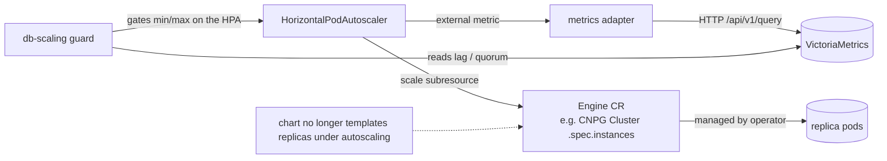

# Database Horizontal Autoscaler for Cozystack

- **Title:** `Database Horizontal Autoscaler for Cozystack`
- **Author(s):** `@scooby87`
- **Date:** `2026-07-08`; revised `2026-07-24` after the implementation spike, addressing review by `@IvanHunters`, `@lllamnyp`, Gemini, and CodeRabbit
- **Status:** Draft

## Overview

Managed databases in Cozystack (`postgres`, `mariadb`, `redis`, `mongodb`, and others) are scaled only manually today: an operator edits the `replicas` value of the application and waits for the underlying operator to converge. This proposal introduces automatic horizontal scaling of a managed database's **read replicas** in response to load.

The first revision of this proposal proposed a bespoke `db-autoscaler` operator that owned the application's `replicas` value and enforced that ownership against competing writers. An implementation spike (see [Findings from the implementation spike](#findings-from-the-implementation-spike)) disproved the enforcement premise that design rested on, and surfaced that the same outcome is reachable far more cheaply by reusing the platform Kubernetes already ships. **This revision therefore builds on the stock `HorizontalPodAutoscaler` (HPA) acting on the engine operator's `scale` subresource, combined with a one-line chart change so the autoscaled field is no longer declared in Git.** The only net-new component is a thin, engine-aware guard that adds the database-specific safety brakes HPA does not have (replication-lag gate, synchronous-quorum floor, recommendation/dry-run).

The proposal is deliberately scoped to **horizontal scaling of read replicas**, because a stateful database primary cannot be scaled horizontally the way a stateless Deployment can.

## Scope and related proposals

This proposal covers **horizontal** autoscaling (read replicas) only. Two sibling axes are explicitly deferred to separate proposals:

- **Vertical autoscaling** — stepping the `resourcesPreset` ladder / in-place pod resize.
- **Storage autoscaling** — automatic PVC expansion when a volume fills up.

Write-path scaling that requires data rebalancing (Kafka broker addition with partition reassignment, ClickHouse/MongoDB sharding) is out of scope — it is an orchestrated procedure, not a counter change.

**Engine scope of the MVP.** The HPA-on-`scale`-subresource mechanism applies to engines whose operator CR exposes a `scale` subresource: PostgreSQL (CloudNativePG `Cluster.spec.instances`) and MariaDB (`MariaDB.spec.replicas`). The MVP ships **PostgreSQL**; MariaDB follows once its cozystack chart supports on-the-fly scale-out (today it does not, see [Failure and edge cases](#failure-and-edge-cases)). **Redis (spotahome RedisFailover) and MongoDB (Percona) expose no `scale` subresource**, so they cannot be driven by a stock HPA; they are deferred to a follow-up that adds a thin actuation shim for them (see [Alternatives considered](#alternatives-considered)).

## Context

A managed database in Cozystack is an `Application` in the aggregated `apps.cozystack.io` API. That `Application` is a **pure projection of a Flux `HelmRelease`**: `pkg/registry/apps/application/rest.go` converts both ways, with no separate backing store. Flux reconciles the `HelmRelease` values into the engine operator's custom resource — for example a CloudNativePG `Cluster`, where `packages/apps/postgres/templates/db.yaml` maps `instances: {{ .Values.replicas }}`. Cozystack already runs the observability the autoscaler needs:

- A per-database `WorkloadMonitor` (`cozystack.io/v1alpha1`, reconciled by `internal/controller/workloadmonitor_controller.go`) reports `status.availableReplicas`, `status.observedReplicas`, and `status.operational`.
- Managed-app pods are labeled by the lineage webhook (`internal/lineagecontrollerwebhook/webhook.go`) with `apps.cozystack.io/application.{group,kind,name}` and by kube-state-metrics' `kube_pod_labels`, so metric queries can be scoped to a single application's read-serving pods.
- VictoriaMetrics (`packages/system/monitoring`) scrapes per-database metrics; for PostgreSQL, `enablePodMonitor: true` on the CNPG `Cluster` exports `cnpg_*` series, including the replication-lag gauge.

### The problem

> "My database is saturated with read traffic during business hours and idle at night, but I have to notice it, hand-edit `replicas`, and hope I picked the right number — and undo it later."

There is no automated way to add or remove read replicas under load. A stock HPA is the natural fit for the *decision* — it computes a desired replica count from a metric with stabilization, min/max, and multi-metric semantics — but on its own it is missing two database-specific safety properties: it has no synchronous-commit quorum floor (it can drive the count below `maxSyncReplicas + 1`, where CNPG rejects the change or starves commits), and no replication-lag gate (it would scale on the load metric alone while standbys are arbitrarily behind). This proposal keeps HPA as the decision engine and adds exactly those two brakes — nothing more.

### Findings from the implementation spike

The first design rested on one load-bearing claim: the autoscaler could be the *enforced* single owner of the application's `replicas` value, writing it through the aggregated apps API. Building it disproved that claim, step by step. These findings are what motivate the mechanism change in this revision:

1. **SSA field-level ownership does not hold on the aggregated apps API.** The `Application` spec is an opaque JSON blob and its managed-fields are not round-tripped, so a dedicated field manager cannot claim `.spec.replicas` (`internal/dbautoscaler/reconciler.go` `patchReplicas`). The Open question the first revision flagged — "does the aggregated Patch handler support per-field SSA at all?" — is answered: **no**.
2. **Admission webhooks cannot fire on the aggregated API.** kube-apiserver proxies aggregated-API requests to the extension server, where admission does not run. Enforcement therefore had to move to the backing Flux `HelmRelease`, a CRD served by kube-apiserver.
3. **The HelmRelease webhook is neither cheap nor sufficient.** It must intercept HelmRelease UPDATEs to guard `replicas`; it must allowlist the apps-API extension-server ServiceAccount (or every legitimate tenant edit breaks), which means a tenant edit through the apps API *bypasses* the guard; and it must not hard-fail Flux reconciliation during an outage. What remains is *advisory* ownership plus a platform-wide admission hop — not the enforced guarantee the design promised.
4. **The root cause is self-imposed.** The autoscaler-vs-Flux conflict exists only because our own chart *unconditionally* templates the replica field (`instances: {{ .Values.replicas }}`). Remove that declaration under autoscaling and there is nothing for Flux and the autoscaler to fight over — the entire ownership problem disappears, which is the basis for this revision.

## Design

### 1. Replica model (instances vs read replicas)

Unchanged from the first revision, and still relevant because HPA scales the **total** instance count. For CNPG, `instances` is `1` primary plus `replicas − 1` standbys, and read traffic is served only by the standbys via the `<release>-ro` endpoint. The load metric is averaged over the read-serving replicas only:

- read-serving replicas now: `Rcur = currentInstances − primaryCount` (CNPG `primaryCount = 1`)
- `desiredRead = ceil(Rcur × currentMetric / targetMetric)` (metric averaged over standbys, never the total; `targetMetric > 0` enforced)
- `desiredInstances = desiredRead + primaryCount`

`minReplicas`/`maxReplicas` on the HPA count **total instances** and map to the engine CR's replica field. `minReplicas` must be `≥ maxSyncReplicas + 1` and `≥ 2` to serve any reads. Because a stock HPA divides its target average by the number of pods matching the target's `scale` selector — which includes the primary — the read-serving metric is emitted **pre-averaged over standbys** by the metrics source (§4), so HPA's own averaging is a no-op and the `Rcur = instances − 1` semantics are preserved.

### 2. Data flow



The engine operator owns instance lifecycle: CNPG adds/removes the highest-ordinal standby gracefully, never the primary, and routes reads through `<release>-ro`. The autoscaler never decides *which* instance to remove.

### 3. Chart change: stop declaring `replicas` under autoscaling

The decisive change. Each autoscalable app chart wraps its replica field in a conditional so that, when autoscaling is enabled for that application, the field is **omitted** from the rendered engine CR:

```yaml
# packages/apps/postgres/templates/db.yaml (illustrative)
spec:
{{- if not .Values.autoscaling.enabled }}
  instances: {{ .Values.replicas }}
{{- end }}
```

With the field absent from the HelmRelease values, Flux neither sets nor reverts it, and the HPA is the sole writer of `.spec.instances` via the `scale` subresource. No ownership annotation, no SSA field manager, no admission webhook, and no terminal-freeze conflict handling are needed — they existed only to win a fight this change prevents.

Migration cost is real and chart-sized, not operator-sized (see [Upgrade and rollback compatibility](#upgrade-and-rollback-compatibility)).

### 4. Metric source for the HPA

The HPA consumes read-load metrics (`ReadConnections`, `ReadCPUUtilization`) from VictoriaMetrics through a **custom/external metrics adapter**. To preserve multi-tenant isolation, the platform-managed adapter configuration injects a mandatory namespace/label matcher into every query and rejects any query it cannot constrain — never raw tenant-supplied PromQL (the same rule the first revision established). Each series is pre-aggregated over the target's standby pods so the value HPA reads is already per-read-replica.

### 5. The thin guard (database-specific brakes)

The only net-new controller. It does **not** compute desired counts or write the engine CR — HPA does both. It watches the target and adjusts the **HPA's `minReplicas`/`maxReplicas`** (and surfaces status/events) to encode what HPA cannot:

- **Quorum floor** — hold `minReplicas ≥ maxSyncReplicas + 1` for CNPG so HPA can never drive the cluster below a safe synchronous quorum. Because `maxSyncReplicas` is tenant-mutable, the guard reconciles the floor into the HPA's `minReplicas` on change; CNPG independently rejects any unsafe count as a backstop.
- **Replication-lag brake** — when `cnpg_pg_replication_lag` exceeds `maxReplicationLagSeconds` **and the primary is actively writing** (write-activity gated off the exported LSN metrics, so an idle primary does not trip it), the guard pins `maxReplicas = currentInstances` to forbid further scale-up until lag recovers.
- **Recommendation / dry-run** — a mode where the guard computes and reports the recommendation (status, events, metrics, alerts) without ever unpinning the HPA, so operators can validate behavior before enabling actuation.

Quota is not re-implemented: because HPA scales the engine CR and pod creation passes through the tenant's `ResourceQuota` admission, an over-quota scale-up simply fails to create pods and is reflected in the CR/HPA status — no separate quota pre-check controller is required.

## User-facing changes

A tenant enables autoscaling on their database and creates a standard HPA next to it. The database-specific brakes are configured on a small guard resource (or, equivalently, annotations on the HPA — final form decided in implementation):

```yaml
# 1. turn off the static replica declaration for this app
apiVersion: apps.cozystack.io/v1alpha1
kind: Postgres
metadata: { name: db, namespace: tenant-acme }
spec:
  autoscaling: { enabled: true }     # chart omits instances; HPA owns it
---
# 2. stock HPA on the engine CR's scale subresource
apiVersion: autoscaling/v2
kind: HorizontalPodAutoscaler
metadata: { name: db, namespace: tenant-acme }
spec:
  scaleTargetRef: { apiVersion: postgresql.cnpg.io/v1, kind: Cluster, name: postgres-db }
  minReplicas: 2
  maxReplicas: 6
  metrics:
    - type: External
      external:
        metric: { name: cozystack_read_connections, selector: { matchLabels: { app: postgres-db } } }
        target: { type: AverageValue, averageValue: "150" }
  behavior:
    scaleUp:   { stabilizationWindowSeconds: 300 }
    scaleDown: { stabilizationWindowSeconds: 1800 }
---
# 3. database-specific brakes (thin guard)
apiVersion: autoscaling.cozystack.io/v1alpha1
kind: DatabaseScalingPolicy
metadata: { name: db, namespace: tenant-acme }
spec:
  targetRef: { kind: Postgres, name: db }
  hpaRef: { name: db }
  respectQuorum: true
  maxReplicationLagSeconds: 30
  dryRun: false
```

When no HPA references an autoscalable app, and `autoscaling.enabled` is false, nothing changes — the chart templates `replicas` exactly as today.

## Upgrade and rollback compatibility

- **Opt-in and off by default.** The chart conditional is inert unless `autoscaling.enabled` is set; existing clusters and manifests are unaffected. The guard and metrics adapter ship as optional platform packages.
- **Enabling autoscaling on an existing database (the one real migration).** Flipping `autoscaling.enabled` removes `instances`/`replicas` from the rendered CR. Helm's three-way merge deletes a previously-set field on omission, and CNPG defaults to **1 instance** when `.spec.instances` is unset — so a naive flip would collapse a running cluster to a single instance before the HPA raises it. The rollout must therefore either (a) have the HPA (or the guard) set `.spec.instances` to the current count *before* the field is dropped from the chart, or (b) template a floor via the `scale` subresource so the count never dips below `minReplicas`. This migration path must be exercised on a dev cluster before MVP.
- **Cold start.** Until the HPA takes its first sample it holds at `minReplicas`; a brief window at the floor is expected.
- **Dependent objects.** `WorkloadMonitor` and dashboards that read `.Values.replicas` must switch to the observed instance count (`status.instances` / metrics), since the values field is no longer authoritative under autoscaling.
- **Rollback.** Set `autoscaling.enabled: false` (and delete the HPA): the chart resumes templating `replicas` and Flux reconciles it back. Fully reversible; no data migration.

## Security

- **RBAC (much reduced vs the first revision).** The guard needs: read its own `DatabaseScalingPolicy`; read/update the referenced `HorizontalPodAutoscaler` (`min/maxReplicas`); read `workloadmonitors`; read-only HTTP to vmselect. It needs **no** write access to `Application`/`HelmRelease`, **no** admission webhook, **no** SSA field manager, and **no** engine-CR writes (HPA does that through the `scale` subresource under the tenant's existing RBAC). The metrics adapter is a standard read-only VictoriaMetrics client.
- **Multi-tenancy.** `DatabaseScalingPolicy` and the HPA are namespaced and live in the tenant namespace; the platform ships self-contained aggregated ClusterRoles (`rbac.cozystack.io/aggregate-to-tenant[-view|-admin]`). The metrics adapter injects a mandatory namespace matcher, so no tenant query can read another tenant's series.
- **Blast radius.** Because there is no cluster-wide admission webhook, enabling this feature adds no admission hop to unrelated Flux reconciliation — a key regression from the first design is gone.

## Failure and edge cases

- vmselect unreachable or metric missing → HPA has no metric and holds the current count (`ScalingActive=False` on the HPA); the guard alerts. No blind scaling.
- Replication lag above threshold **with an actively-writing primary** → guard pins `maxReplicas = current`, forbidding scale-up until lag recovers. An idle primary does not trip the brake (write-activity gating).
- Desired count would drop to/below the quorum floor → guard holds `minReplicas ≥ maxSyncReplicas + 1`; CNPG rejects an unsafe count as a backstop.
- Tenant quota exceeded on scale-up → pods fail `ResourceQuota` admission; the CR/HPA surface the unmet count; no separate freeze path needed.
- MariaDB target whose chart lacks scale-out support (`replication.replica.bootstrapFrom` unset) → the operator rejects on-the-fly scale-out (`MariaDBScaleOutError`); MariaDB stays out of the enabled set until the chart is fixed.
- Redis / MongoDB target → no `scale` subresource; rejected by the guard with a clear reason (deferred to the shim follow-up).
- Sharded engine (ClickHouse, sharded MongoDB) → out of scope; not autoscalable.

## Testing

- **Unit:** the replica-model math and each engine's quorum/lag logic in the guard, with mocked VictoriaMetrics.
- **Chart:** `helm template` with `autoscaling.enabled: true` omits the replica field; with it false, renders `replicas` exactly as today (regression guard).
- **Migration (dev cluster, CNPG):** flip `autoscaling.enabled` on a running multi-instance cluster and assert it does **not** collapse to 1 instance (the pre-set-before-omit path), then drive load and confirm HPA scales `.spec.instances`, reads route to `<release>-ro`, and Flux does not revert. This replaces the first revision's force-writer ownership envtest, which is no longer meaningful because there is no ownership to enforce.
- **Guard integration:** lag above threshold with active writes pins `maxReplicas`; quorum floor tracks `maxSyncReplicas` changes; `dryRun` reports without pinning.
- **Negative:** vmselect down → no scaling; idle primary with high lag-seconds → no false brake; MariaDB without scale-out → rejected; Redis → rejected.

## Rollout

1. **PoC** — CNPG on a dev cluster: chart conditional + a stock HPA on `.spec.instances` driven by `ReadConnections`; confirm Flux does not revert and reads route to `<release>-ro`.
2. **MVP** — PostgreSQL: the chart change, the metrics adapter (namespace-scoped), the thin guard (quorum floor + lag brake + dry-run), dashboard surface and alerts. Optional packages with a hard dependency on the monitoring stack.
3. **MariaDB** — once the cozystack mariadb chart supports on-the-fly scale-out.
4. **Redis / MongoDB** — a follow-up proposal for a thin actuation shim, since neither exposes a `scale` subresource.

## Open questions

- Final form of the database-specific brakes: a small `DatabaseScalingPolicy` CRD, or annotations on the HPA? The former is clearer; the latter avoids any new API surface (see Alternative 1).
- Which metrics adapter — prometheus-adapter, a KEDA `ScaledObject` external trigger, or a small purpose-built adapter — best fits VictoriaMetrics with mandatory namespace scoping?
- Migration mechanic for enabling autoscaling on a live cluster: set `.spec.instances` before omitting the chart field, or floor it via the `scale` subresource?
- Default driver metric (read connections vs read QPS vs replica CPU), to be calibrated on real workloads.

## Alternatives considered

- **A bespoke `db-autoscaler` operator owning `replicas` (the first revision of this proposal).** Rejected after the implementation spike. It required re-drawing HPA's API surface field-for-field (`metrics[].target.averageValue`, `behavior.*.stabilizationWindowSeconds`, the `ScalingActive`/`AbleToScale`/`ScalingLimited` conditions) and re-implementing HPA's decision loop; and its ownership guarantee proved unbuildable on the aggregated apps API ([Findings](#findings-from-the-implementation-spike)) — SSA does not hold, admission cannot fire there, and the fallback HelmRelease webhook is advisory, bypassable by tenant edits, and a platform-wide admission hop. The present design keeps HPA's hardened decision loop and confines net-new code to the two brakes HPA genuinely lacks.
- **HPA writing the `Application`'s `replicas` value (apps API) instead of the engine CR.** This is what the first revision did; it is the source of the whole ownership problem, because the apps values are declared in Git and reverted by Flux. Writing the engine CR's `scale` subresource while the chart omits the field (this design) avoids the conflict at its root.
- **Not creating any new API at all.** The brakes could be expressed as annotations on a stock HPA rather than a `DatabaseScalingPolicy` CRD, eliminating the new API group entirely. Kept as an open question; the CRD is proposed only for clarity, not necessity.
- **A thin actuation shim for engines without a `scale` subresource (Redis, MongoDB).** For these, HPA cannot act directly. A minimal shim that watches a stock HPA's recommendation and propagates it behind the same brakes is the honest path — deferred to a follow-up, since the MVP targets engines that already have a `scale` subresource.
- **Stock HPA + KEDA with tenant-supplied PromQL.** Rejected for the metric-source layer: raw tenant PromQL against shared vmselect breaks tenant isolation. A KEDA/prometheus-adapter trigger is acceptable **only** with a platform-injected, mandatory namespace matcher — the constraint carried over from the first revision.
- **Scaling the write path via sharding.** Out of scope: it requires data rebalancing, an orchestrated procedure rather than a replica-count change.

---

<!--
Inspired by KubeVirt enhancement proposals
(https://github.com/kubevirt/enhancements) and Kubernetes Enhancement
Proposals (KEPs).
-->
