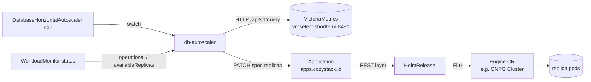

# Database Horizontal Autoscaler for Cozystack

- **Title:** `Database Horizontal Autoscaler for Cozystack`
- **Author(s):** `Alexey Artamonov <aleksei.artamonov@aenix.io>`
- **Date:** `2026-07-08`
- **Status:** Draft

## Overview

Managed databases in Cozystack (`postgres`, `mariadb`, `redis`, `mongodb`, and others) are scaled only manually today: an operator edits `replicas` in the application values and waits for the underlying operator to converge. This proposal introduces a dedicated operator, `db-autoscaler`, that automatically adjusts the number of **read replicas** of a managed database in response to load, driven by a new HPA-like custom resource `DatabaseHorizontalAutoscaler` (DHA).

The proposal is deliberately scoped to **horizontal scaling of read replicas**, because a stateful database primary cannot be scaled horizontally the way a stateless Deployment can. The autoscaler is topology-aware per engine, respects the synchronous-replica quorum, brakes on replication lag, and applies its decisions by patching the application's `replicas` value — so it never fights Flux/GitOps reconciliation.

## Scope and related proposals

This proposal covers **horizontal** autoscaling (read replicas) only. Two sibling axes are explicitly deferred to separate proposals:

- **Vertical autoscaling** — stepping the `resourcesPreset` ladder / in-place pod resize.
- **Storage autoscaling** — automatic PVC expansion when a volume fills up.

Write-path scaling that requires data rebalancing (Kafka broker addition with partition reassignment, ClickHouse/MongoDB sharding) is out of scope for this proposal — it is an orchestrated procedure, not a counter change.

## Context

A managed database in Cozystack is an `Application` in the aggregated `apps.cozystack.io` API. The REST layer (`pkg/registry/apps/application/rest.go`, `ConvertApplicationToHelmRelease`) stores the application values in a Flux `HelmRelease.Spec.Values`, which Flux reconciles into the engine operator's custom resource (for example a CloudNativePG `Cluster`). Every managed database already exposes a horizontal knob in its values — `replicas` (or `kafka.replicas`, etc.) — and Cozystack already runs the observability the autoscaler needs:

- A per-database `WorkloadMonitor` (`cozystack.io/v1alpha1`, reconciled by `internal/controller/workloadmonitor_controller.go`) reports `status.availableReplicas`, `status.observedReplicas`, and `status.operational`, and already queries VictoriaMetrics over the vmselect Prometheus API.
- Managed-app pods are labeled by the lineage webhook (`internal/lineagecontrollerwebhook/webhook.go`) with `apps.cozystack.io/application.{group,kind,name}` and `internal.cozystack.io/managed-by-cozystack: "true"`.
- VictoriaMetrics (`packages/system/monitoring`) scrapes per-database metrics via `PodMonitor` (for PostgreSQL, `enablePodMonitor: true` on the CNPG `Cluster`).

### The problem

> "My database is saturated with read traffic during business hours and idle at night, but I have to notice it, hand-edit `replicas`, and hope I picked the right number — and undo it later."

There is no automated way to add or remove read replicas under load. Manually reusing a stock `HorizontalPodAutoscaler` does not work here: HPA scales via the scale subresource on the operator CR, which **fights Flux** (reconciliation restores `replicas` from the application values), and HPA has no notion of database topology — it would happily remove a synchronous standby or scale while replication lag is unbounded.

## Goals

- Automatically scale the number of read replicas for primary-replica engines: PostgreSQL (CNPG), MariaDB, Redis, MongoDB (replica set).
- Apply all decisions by patching the `Application` values (Flux-compatible write path), never the operator CR directly.
- Reuse existing telemetry (VictoriaMetrics + `WorkloadMonitor`); introduce no new exporters.
- Be safe for stateful workloads: respect the replica quorum, brake on replication lag, drain read connections on scale-down, use long stabilization windows, and honor tenant quotas.
- Provide HPA-like observability: status conditions, events, and a `dryRun` mode.

### Non-goals

- Vertical scaling (resources / presets).
- Autoscaling the write path / the primary.
- Engines that require data rebalancing (Kafka brokers, ClickHouse/MongoDB shards).
- Cluster-node autoscaling (that is cluster-autoscaler's job).

## Design

### 1. Data flow



### 2. Topology adapters

Engine topology differs, so per-`kind` logic is isolated behind an adapter interface. Only primary-replica engines are scalable; sharded modes return `Scalable=false` with a reason.

```go
type TopologyAdapter interface {
    ReplicasPath() string                                         // "replicas" for pg/mariadb/redis/mongo
    QuorumFloor(appValues map[string]any) int32                   // CNPG: quorum.minSyncReplicas + 1
    DriverQuery(app types.NamespacedName, k DriverKind) string    // PromQL for read load
    ReplicationLagQuery(app types.NamespacedName) string          // PromQL for lag (brake)
    ReadReplicaSelector(app types.NamespacedName) labels.Selector // for connection draining
    Scalable(appValues map[string]any) (bool, reason string)      // false for sharded modes
}
```

MVP ships the `postgres` (CNPG) adapter. Follow-ups: `mariadb`, `redis`, `mongodb` (only when `sharding: false`). `clickhouse`, `kafka`, and sharded `mongodb` report `Scalable=false`.

### 3. Reconcile loop

1. Resolve `targetRef` → load the `Application` values and the linked `WorkloadMonitor`.
2. Ask the adapter `Scalable`? If not → set condition `ScalingActive=False(reason)` and stop.
3. If `operational=false` **or** a scale is still in flight (`availableReplicas != spec.replicas`) → freeze (single-flight) and requeue.
4. Query VictoriaMetrics for the driver metric and the replication lag.
5. Compute `desired = ceil(currentReplicas * currentMetric / targetMetric)` with a tolerance dead-zone.
6. Apply guardrails (see below): clamp to `[min,max]`, quorum floor, lag brake, stabilization windows, step limit, tenant quota.
7. If `desired != current` and the decision passes → PATCH `spec.replicas` on the `Application` (with `RetryOnConflict`); on scale-down, drain read connections first.
8. Update `status`, set `lastScaleTime`, emit an Event.

### 4. Guardrails (normative)

- `min ≤ desired ≤ max`; at most `behavior.*.step` replicas per decision.
- `desired ≥ QuorumFloor(app)` when `respectQuorum` is set (CNPG: `quorum.minSyncReplicas + 1`).
- **Lag brake:** replication lag above `maxReplicationLagSeconds` forbids both scale-down and scale-up; condition `AbleToScale=False`.
- **Cooldown / stabilization:** separate windows for scale-up and (longer) scale-down; scale-down only when the signal held for the whole window.
- **Single-flight:** one change at a time; the next decision only after `operational=true && availableReplicas == spec.replicas`.
- **Tenant quota:** the new replica count × preset resources must fit the tenant quota; otherwise `ScalingLimited=True`.
- **Fail-safe freeze:** if vmselect is unreachable or the metric is missing, do not scale (never scale blind); alert.
- **dryRun:** decisions are written to status/events but no patch is applied.

## User-facing changes

A new namespaced CRD, `DatabaseHorizontalAutoscaler` (group `autoscaling.cozystack.io/v1alpha1`), created by a tenant next to their database application:

```yaml
apiVersion: autoscaling.cozystack.io/v1alpha1
kind: DatabaseHorizontalAutoscaler
metadata: { name: db, namespace: tenant-acme }
spec:
  targetRef: { kind: Postgres, name: db }   # apiGroup defaults to apps.cozystack.io
  minReplicas: 2
  maxReplicas: 6
  metrics:
    - type: ReadConnections                  # | ReadCPUUtilization | CustomQuery
      target: { averageValue: "150" }        # per replica
  behavior:
    scaleUp:   { stabilizationWindowSeconds: 300,  step: 1 }
    scaleDown: { stabilizationWindowSeconds: 1800, step: 1 }
  constraints:
    respectQuorum: true
    maxReplicationLagSeconds: 30
    drainReadConnections: true
  dryRun: false
status:
  currentReplicas: 3
  desiredReplicas: 4
  lastScaleTime: "..."
  currentMetrics: [ { type: ReadConnections, averageValue: "210" } ]
  conditions: [ ScalingActive, AbleToScale, ScalingLimited ]
```

The dashboard can surface the DHA status and scaling events like it does for other application sub-resources. When no DHA references an application, nothing changes.

## Upgrade and rollback compatibility

- **Opt-in and off by default.** The operator ships as an optional platform package, enabled via `bundles.enabledPackages`. Existing clusters, manifests, and APIs are unaffected until a tenant creates a DHA.
- **Ownership.** While a DHA is active, `replicas` is considered owned by the autoscaler. This is mutually exclusive with managing `replicas` from a tenant GitOps repo for the same application; documented explicitly.
- **Rollback.** Deleting the DHA stops all autoscaling immediately and leaves the application at its current `replicas`. Disabling the package removes the operator; no data migration is involved and the change is fully reversible.

## Security

- **RBAC.** The operator needs: read DHA and read/patch `applications.apps.cozystack.io`, read `workloadmonitors.cozystack.io`, read `pods`, and read-only HTTP to vmselect. It has no direct access to engine operator CRs or Flux `HelmRelease` objects — only the aggregated apps API.
- **Multi-tenancy.** DHA is namespaced and lives in the tenant namespace. The `databasehorizontalautoscalers.autoscaling.cozystack.io` resource is granted in the tenant ClusterRole tiers exactly like `apps.cozystack.io` (ServiceAccount full, human `view` read-only, `admin`/`super-admin` write). A tenant can only autoscale its own applications, and scale-up is validated against the tenant quota.
- **New inputs.** The only tenant-supplied inputs are the DHA fields, all bounded and schema-validated (`minReplicas`/`maxReplicas`, metric targets, windows). No new secrets are stored or transmitted.

## Failure and edge cases

- vmselect unreachable or metric missing → the autoscaler freezes (no scaling) and surfaces `AbleToScale=False`; alert fires.
- Replication lag above the configured threshold → no scale-up and no scale-down until lag recovers.
- Scale still in flight (`availableReplicas != spec.replicas`) → single-flight; the next decision waits for convergence, preventing thrashing.
- Target is a sharded engine (e.g. ClickHouse, or MongoDB with `sharding: true`) → `ScalingActive=False` with a clear reason; no action.
- Desired count would drop below the quorum floor → clamped to the floor; `ScalingLimited=True`.
- Tenant quota exceeded on scale-up → clamped; `ScalingLimited=True`.

## Testing

- **Unit:** reconcile decisions and each `TopologyAdapter` with mocked VictoriaMetrics and a mocked Application client (`go test ./internal/controller/...`).
- **Codegen:** `make generate` produces the CRD and deepcopy without errors.
- **Manual (dev cluster, CNPG postgres):** create a DHA with `dryRun: true` → decisions appear in `status`/Events, replicas unchanged. Then disable `dryRun` under read load → the `Application`'s `spec.replicas` grows, CNPG adds a read replica, Flux does not revert; on load decrease and after the window, scale-down drains connections and never drops below quorum.
- **Negative:** vmselect down → freeze; lag above threshold → no scaling; DHA targeting a sharded ClickHouse → `ScalingActive=False`.

## Rollout

1. **PoC** — CNPG PostgreSQL on a dev cluster: DHA + `replicas` patch driven by `ReadConnections`; confirm Flux does not revert and reads route to `<release>-ro`.
2. **MVP** — the operator plus the `postgres` adapter, full guardrails (quorum, lag, cooldown, quota), `dryRun`, dashboard surface and events. Shipped as an optional `paas`-bundle package.
3. **Adapter expansion** — `mariadb` → `redis` → `mongodb` (replica set).
4. **Observability & policy** — Grafana dashboard of scaling decisions, alerts for "limit reached / freeze".

## Open questions

- Adapter order after MVP: `mariadb` → `redis` → `mongodb`?
- Default driver metric: read connections, read QPS, or replica CPU (to be calibrated on real workloads)?
- Is scale-down enabled by default, or scale-up only (down conservative/manual)?
- Ownership policy for `replicas` when the application is also managed from a tenant GitOps repo.

## Alternatives considered

- **A controller inside `cozystack-controller`** instead of a standalone operator. It would reuse the existing binary, RBAC, and VictoriaMetrics helper, at the cost of coupling the autoscaler's lifecycle to the platform controller. Rejected in favor of a standalone operator for isolation and an independent release cadence; the logic can be moved later if desired.
- **Patching the `HelmRelease` (or engine CR) directly.** Rejected: a direct patch to the operator CR is reverted by Flux, and a `HelmRelease.Spec.Values` patch can be clobbered when the Application REST layer regenerates the release. Patching the `Application` is the canonical, reconciliation-safe path.
- **Stock HPA + KEDA.** Rejected as the primary mechanism: it fights Flux, is topology-unaware, and offers no safe scale-down (draining, quorum, lag). A KEDA/PromQL trigger can still be reused *as a metric source inside* the operator (`CustomQuery`).
- **Scaling the write path via sharding.** Out of scope: it requires data rebalancing (Cruise Control for Kafka, resharding for ClickHouse/MongoDB), which is an orchestrated procedure rather than a replica-count change.

---

<!--
Inspired by KubeVirt enhancement proposals
(https://github.com/kubevirt/enhancements) and Kubernetes Enhancement
Proposals (KEPs).
-->
