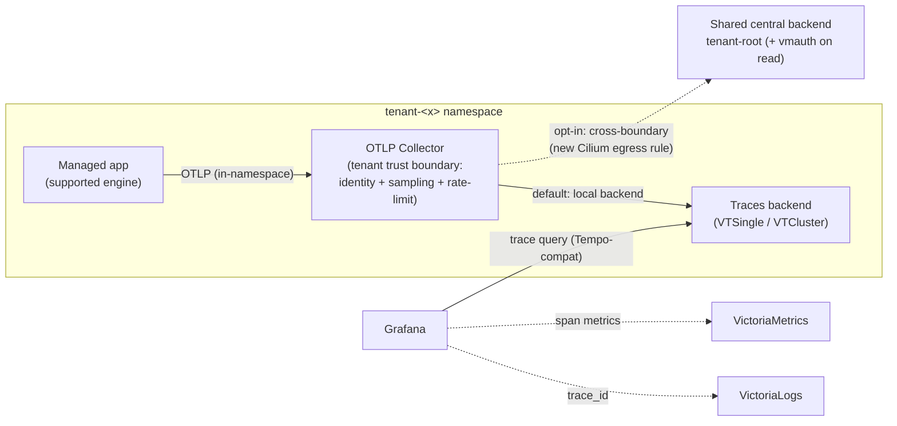

# Distributed tracing in the Cozystack monitoring stack

- **Title:** `Distributed tracing for managed applications via OTLP`
- **Author(s):** `@scooby87`
- **Date:** `2026-07-16` (revised 2026-07-29)
- **Status:** Review

## Overview

Cozystack ships two of the three observability signals out of the box — metrics (VictoriaMetrics) and logs (VictoriaLogs) — but has no supported way to collect distributed **traces**. An operator who wants to see how a request flows through a managed database or messaging cluster, or to correlate a slow span with the logs and metrics it produced, has nothing to turn on. This proposal adds the third signal.

The proposal is deliberately **architecture-first**: it settles the hard questions — multitenancy, network isolation, the trust boundary, and vendor neutrality — and leaves the exact Helm value shapes, field names, and port numbers to the implementation PRs in `cozystack/cozystack`. The three load-bearing decisions are:

1. **Tracing is ingested inside the tenant boundary.** Unlike metrics and logs, traces are *pushed* by the application, so the collection point is a per-tenant OpenTelemetry Collector that lives in the tenant's own namespace. This keeps traces from punching a hole through the Cilium tenant isolation that metrics/logs never had to cross (they are *scraped* centrally). See [Design §2](#2-multitenancy-and-network-model-the-core-decision).
2. **The backend is pluggable.** OTLP ingest plus a Grafana datasource is a backend-agnostic contract. VictoriaTraces is the recommended default (its `VTCluster`/`VTSingle` CRDs already ship in the victoria-metrics-operator Cozystack deploys, so no new operator), but Grafana Tempo and Jaeger are first-class alternatives an admin can select. See [Design §1](#1-backend-pluggable-victoriatraces-default).
3. **Enablement follows the metrics model, not a per-app toggle.** For a supported engine, tracing is configured by the platform the same way metric scrapes are — not gated behind a copied `enabled` flag. See [Design §4](#4-per-application-enablement).

This proposal does *not* mechanically mirror the logs/metrics stack. Where their conventions genuinely fit (grafana-operator datasources, the operator-driven readiness gate) it reuses them; where tracing is fundamentally different (push vs. scrape, and therefore the network path) it diverges on purpose and says why. One idea flows the other way, too: the `VTSingle` single-binary mode this proposal wants for edge/dev clusters is something the metrics and logs stacks could usefully adopt.

## Scope and related proposals

In scope: a traces backend (per-tenant and, as an opt-in, shared-central), an OTLP ingest path that respects tenant network isolation, a Grafana datasource with trace↔logs↔metrics correlation, and platform-side enablement for supported engines. Out of scope: automatic instrumentation of arbitrary tenant workloads, and tracing the internals of Virtual Machines or the Kubernetes control plane.

- **Sibling stack:** the platform monitoring stack `packages/system/monitoring` and the per-tenant stack `packages/extra/monitoring` (wired by `packages/apps/tenant/templates/monitoring.yaml`). This proposal extends both.
- **Collection agents:** `packages/system/monitoring-agents` (fluent-bit, vmagent) — the *deployment* pattern the collector borrows, but note the traffic model differs (see [§2](#2-multitenancy-and-network-model-the-core-decision)).
- **Network policy:** `packages/apps/tenant/templates/networkpolicy.yaml` — the Cilium tenant-isolation policies this design must live within.
- **Prior art in-repo:** Harbor exposes an internal, app-local trace config (`packages/system/harbor/charts/harbor/values.yaml`, provider `jaeger`/`otel`); it is not a platform backend. This proposal supersedes ad-hoc per-app trace endpoints with a shared destination.
- **Driver:** requested by a client (hidora) who needs request-level visibility across managed DBaaS and messaging services.

## Context

Cozystack's observability is multi-tenant with a central backend, and it crosses the tenant boundary in a very specific way that traces cannot simply copy.

**Where the backend runs.** The `monitoring` component (VictoriaMetrics, VictoriaLogs, Grafana, Alerta, vmalert) is deployed by the *root* tenant into `tenant-root` (`packages/apps/tenant/templates/monitoring.yaml`). The `cozy-monitoring` namespace holds only `ExternalName` aliases (`vlinsert-generic`, `vminsert-shortterm`, `vminsert-longterm`) that CNAME to the real services in `tenant-root` (`packages/system/cozystack-basics/templates/monitoring-external-services.yaml`, gated on `_cluster.monitoring-enabled`). The cluster-wide agents (vmagent, fluent-bit, kube-state-metrics, node-exporter) live in `cozy-monitoring` (`packages/system/monitoring-agents`).

**How metrics and logs cross the tenant boundary — by *scraping*, not by tenants pushing out.** vmagent runs centrally in `cozy-monitoring` and scrapes targets cluster-wide, then remote-writes to `vminsert-*.tenant-root.svc`. fluent-bit runs as a DaemonSet in `cozy-monitoring` and ships to `vlinsert-generic.tenant-root.svc`. Both cross into `tenant-root` because `cozy-monitoring` carries the `cozystack.io/system: "true"` label (stamped by the operator, `internal/operator/package_reconciler.go`) and `tenant-root`'s Cilium ingress policy trusts every `cozystack.io/system` namespace. **This is an ingress trust granted to a system namespace — it does not let a tenant workload egress toward monitoring.**

**Tenant network isolation (Cilium).** `packages/apps/tenant/templates/networkpolicy.yaml` renders `CiliumClusterwideNetworkPolicy` per tenant; the posture is default-deny once selected. A tenant pod's egress is limited to: its own tenant subtree; endpoints labeled `app.kubernetes.io/name: vminsert` / `app.kubernetes.io/instance: etcd` / `cozystack.io/service: ingress` in **ancestor** namespaces; DNS; a fixed set of `cozy-*` namespaces (`cozy-dashboard`, `cozy-linstor`, `cozy-keycloak`, `cozy-kubevirt-cdi`); and `world` (out-of-cluster). Notably **`cozy-monitoring` is not on that list**, and a generic pod in `tenant-root` is not reachable either — only the specifically-labeled `vminsert`/`etcd`/`ingress` endpoints are. A tenant that runs its own monitoring gets a per-tenant vmagent *inside its own namespace* that pushes up to the parent's `vminsert` — that is exactly the `vminsert`-labeled ancestor egress rule.

**Application observability today.** Apps expose metrics out of the box: the charts render `VMServiceScrape`/`VMPodScrape` (or CNPG's `enablePodMonitor`) unconditionally — there is no per-app "enable metrics" toggle. Most engines also declare a `WorkloadMonitor` CR, but `WorkloadMonitor` is **not** a metrics-collection mechanism: it is a billing/ownership meta-resource holding a label selector that identifies the pods, services, and PVCs belonging to an app, reconciled into `Workload` objects (replicas/resources/status) for the dashboard and billing surfaces (`internal/controller/workloadmonitor_controller.go`). The one app that gates a `WorkloadMonitor` behind a tenant-facing `monitoring.enabled` flag is foundationdb — and that is a mistake we should not copy (it hides a billing meta-resource behind a tenant toggle), not a template for a tracing switch.

**No new operator is needed for the default backend.** The victoria-metrics-operator Cozystack already runs (`packages/system/victoria-metrics-operator`) ships the `VTCluster` and `VTSingle` CRDs (`operator.victoriametrics.com/v1`), which decompose into insert/select/storage components analogous to `VLCluster`.

### The problem

- "A query against my managed Postgres is slow and I can't see where the time goes — which statement, which replica, which downstream call." There is no trace to open.
- "I have a log line for a failed request and a latency spike on a dashboard, but no way to jump from either to the actual request span." The signals don't correlate.
- "My application already emits OTLP spans, but Cozystack gives me nowhere to send them." There is no OTLP endpoint and no backend.

## Goals

- Accept traces over **OTLP** (the standard cloud-native tracing protocol) at an endpoint the application can reach **without breaching tenant network isolation**.
- Store traces in a **pluggable backend** with a configurable retention period (default 14 days); VictoriaTraces is the default, Tempo/Jaeger are selectable.
- Preserve **per-tenant isolation** — on both the write and the read path — as the default, and describe honestly what a shared-central backend would additionally require.
- Provision a **Grafana traces datasource** and wire **trace↔logs↔metrics** correlation.
- Enable tracing for a supported engine the way metrics are enabled — **platform-configured**, not a per-app opt-in flag copied from the wrong example.
- Introduce **no new operator** for the default backend.

### Non-goals

- Auto-instrumenting arbitrary tenant workloads. This proposal wires transport, storage, and tenancy; emitting spans is the engine's job (native where supported, sidecar/agent otherwise).
- Tracing Virtual Machines or Kubernetes control-plane internals.
- Changing the existing metrics or logs pipelines.
- Locking in the exact Helm value schema, CRD field names, or port numbers — those are settled in the implementation PRs (see [Implementation notes](#implementation-notes-non-normative)).

## Design

### 1. Backend: pluggable, VictoriaTraces default

OTLP ingest and a Grafana datasource form a **backend-agnostic contract**: the collector speaks OTLP outward, and Grafana reads through a datasource. Only two things change when the backend changes — the storage CR the platform renders, and the Grafana datasource type. Everything else in this design (the collector, the tenancy model, the correlation wiring, the per-app surface) is unaffected. The platform therefore exposes a **backend selector**, defaulting to VictoriaTraces:

- **VictoriaTraces** (default): VictoriaMetrics' own trace backend — the same-vendor counterpart to Tempo, on the same `victoria-metrics-operator` as VictoriaMetrics/VictoriaLogs. `VTCluster` for production, `VTSingle` (single binary) for edge/dev/small clusters where a multi-component cluster is unwarranted. Chosen as default because its CRDs already ship in the operator Cozystack runs — no new operator, one operational model shared with metrics/logs. (The `VTSingle`/`VTCluster` split is a mode the metrics and logs stacks would benefit from adopting too.) **Caveat: VictoriaTraces is pre-GA** per its upstream roadmap (data structure/backward-compat not yet frozen; the Grafana-facing query API is being delivered as Tempo Query-frontend-compatible HTTP APIs) — which is exactly why the backend seam and the Tempo fallback below matter, and why maturity is an [open question](#open-questions).
- **Grafana Tempo**: object-storage-backed (cheap retention on the seaweedfs/COSI storage Cozystack already runs) with the strongest Grafana-native correlation. The recommended fallback if VictoriaTraces is not ready at the pinned version. Because VictoriaTraces is converging on a Tempo-compatible query API, both can share the same Grafana datasource type — making this fallback nearly seamless.
- **Jaeger**: mature and OTLP-native, but its own UI and weaker Grafana integration cut against single-pane correlation.

The vendor-neutrality question @lllamnyp raised is answered by *this* seam, not by adding operators: an admin picks a backend at install time; the OTLP/datasource contract keeps the choice from leaking into applications or the tenancy design. See [Alternatives](#alternatives-considered) for the full trade-off.

The backend is provisioned by the operator, and the monitoring HelmRelease gates readiness on the storage CR reaching `operational` (the `waitStrategy: poller` + `healthCheckExprs` pattern `VLCluster` already uses in `packages/extra/monitoring/templates/helmrelease.yaml`). Without that gate the release flips Ready before the backend can accept writes — the silent-black-hole failure that motivated `cozystack/cozystack#3181` for logs. Tracing is opt-in: a cluster that configures no tracing backend renders nothing and stays healthy; a backend that is *requested but left empty* is a misconfiguration and fails the render. (The exact values shape is an implementation detail — [Implementation notes](#implementation-notes-non-normative).)

### 2. Multitenancy and network model (the core decision)

This is where tracing genuinely departs from metrics and logs, and where the design must be explicit rather than deferred.

**Why the metrics/logs model does not transfer.** Metrics and logs cross the tenant boundary because central agents *scrape/tail* workloads and forward — the tenant never egresses toward monitoring (see [Context](#context)). OTLP is the opposite: the **application pushes** spans. Under the current Cilium policy a tenant pod *cannot* reach a collector in `cozy-monitoring` (not in the egress allow-list) nor a generic collector in `tenant-root` (only `vminsert`/`etcd`/`ingress`-labeled endpoints are reachable). So a naive "app → central OTLP endpoint" design would either be blocked by policy or require punching a broad hole in tenant isolation. That is precisely the concern @lllamnyp flagged, and it is real.

**Decision: the collector lives inside the tenant namespace.** Each participating tenant gets an OpenTelemetry Collector Deployment in its *own* namespace — the same placement as a per-tenant vmagent. Applications push OTLP to that in-namespace collector, so app→collector traffic is intra-namespace and covered by the existing `allow-internal-communication` policy: **zero NetworkPolicy change, and tenant isolation is never breached.** The collector is the per-tenant trust boundary: it stamps the tenant's identity, applies sampling and rate-limits, and forwards onward. What it forwards *to* defines the two supported topologies:

| | **Per-tenant backend (default)** | **Shared central backend (opt-in)** |
|---|---|---|
| Backend location | tenant's own namespace (like `packages/extra/monitoring`) | `tenant-root` |
| Collector → backend hop | intra-namespace | crosses into `tenant-root` |
| NetworkPolicy change | none | **new Cilium egress rule required** (see below) |
| Write isolation | physical (never leaves namespace) | by injected `AccountID`/`ProjectID`, enforced at the collector |
| Read isolation | physical: datasource → in-namespace select service, fenced by policy | needs an authenticating proxy (vmauth); a bare shared select is **not** a boundary |
| When to choose | default; strongest isolation | central retention/cost consolidation, accepted trade-off |

**The shared-central egress rule (designed here, not deferred).** For the opt-in shared topology, the collector→central-backend hop needs an explicit allowance — modeled exactly on the existing ancestor-`vminsert` egress block in `packages/apps/tenant/templates/networkpolicy.yaml`: add a `toEndpoints` rule matching the central OTLP-ingest endpoint's label (e.g. `app.kubernetes.io/name: <traces-insert>`) in the ancestor namespace, gated on the tenant having tracing enabled. This is a deliberate, narrow widening of the tenant egress surface, and it is a security decision the operator opts into — not a silent default. We explicitly **reject** the alternative of mislabeling the collector as `vminsert` to ride the existing rule: that is a label hack that erodes the meaning of the policy.

**Identity, write and read.**
- *Write:* `AccountID`/`ProjectID` (and any `tenant` resource attribute) are injected by the per-tenant collector from the identity it is deployed with — never from tenant-controlled application config, which a tenant could spoof. Because the collector is per-tenant, it already knows its tenant.
- *Read:* in the default per-tenant topology the Grafana datasource points only at the tenant's own in-namespace select service, fenced by NetworkPolicy — tenant A physically cannot reach tenant B's spans. On a shared backend the select service performs no per-tenant authorization (it trusts the read headers verbatim), so real read isolation there requires an authenticating proxy (vmauth) that derives the tenant from identity and strips client-supplied headers. This is stated as part of the design, with the honest caveat that a shared backend without vmauth has only the same weak, label-only cross-tenant read property that shared metrics/logs have today.

### 3. Ingest topology and routing

Applications target a **stable in-namespace endpoint** — the per-tenant collector's OTLP Service. Keeping that endpoint fixed means the platform can evolve what sits behind it (sampling policy, backend target) without any application reconfiguration.

**Why a Collector and not direct-to-backend.** Direct ingest to the backend's insert component is possible (VictoriaTraces' insert speaks OTLP natively) and is a reasonable first implementation step, but it provides no place to stamp tenant identity, rate-limit a noisy tenant, or sample. Since [§2](#2-multitenancy-and-network-model-the-core-decision) already puts a per-tenant component in the namespace for the trust boundary, that component *is* the collector — so the collector is core to the design, not a later add-on. If a phased rollout ships direct ingest first, the app-facing endpoint stays the collector's Service so the switch is platform-side only.

**A gateway Deployment, not a DaemonSet.** OTLP is push-based over the network — the applications are the agents — so the collector plays the centralized `vmagent`/insert role, not the node-local fluent-bit role.

**Tail sampling needs trace affinity.** If tail sampling is used, all spans of a trace must reach one collector instance; a plain Service round-robins and would sample on partial traces. So the sampling tier runs single-replica, or behind a first tier using consistent-hash routing by trace ID. Head sampling has no such constraint. The default sampling policy is an [open question](#open-questions).

**Routing: why an in-namespace Service, and the Ingress/Gateway alternative (@lllamnyp :130).** Because the collector is *in the tenant namespace*, the app-facing hop is plain in-cluster service traffic — an Ingress or Gateway-API `HTTPRoute` would add an L7 hop with no benefit for intra-namespace OTLP, and OTLP/gRPC in particular is a poor fit for a typical HTTP Ingress. An internal Gateway/`HTTPRoute` becomes relevant only for the shared-central topology (a single in-cluster address fronting the central backend) or for exposing OTLP to workloads *outside* the cluster; both are folded into the shared-backend egress design and the external-exposure [open question](#open-questions) rather than the default path. If Cozystack standardizes on Gateway API for in-cluster L7, the shared-central front-end should use an `HTTPRoute` there rather than a bespoke proxy.

### 4. Per-application enablement

Tracing enablement follows **how metrics actually work**, not the foundationdb `monitoring.enabled` example (which, per [Context](#context), gates a billing meta-resource and is the wrong model — @lllamnyp :31, :156). Metrics are configured by the platform for supported engines with no per-app opt-in flag; tracing aims for the same: for an engine Cozystack knows how to trace, enabling the tenant's tracing stack wires that engine's spans to the in-namespace collector.

The universal-field problem (@lllamnyp :169) — "add the same `tracing` struct to every app" is not a clean solution, and simply copy-pasting a schema across charts is what we want to avoid. The design commitments here are about *mechanism*, and the concrete implementation is deliberately left to follow-up work:

- **The endpoint is platform-decided, never app-decided.** An application does not carry an OTLP endpoint in its values (that would let it address another namespace and is the metrics analogy @lllamnyp drew): the platform points every traced engine at the tenant's in-namespace collector Service.
- **Enablement is a platform capability, not per-app config duplication.** Rather than stamping an identical `tracing` block into each Application spec, the enablement lives with the tenant's tracing stack; an app participates by virtue of being a supported engine, mapped once from the tenant/monitoring configuration down to the engine's HelmRelease. The exact mechanism for that Application→HelmRelease mapping — and which engines are in the first cut — is an [open question](#open-questions) to be resolved with a clean implementation, not by schema copy-paste.
- **How an engine emits spans** still varies: native OTLP where the engine supports it (e.g. ClickHouse `opentelemetry_span_log`, NATS), a sidecar/agent otherwise (Kafka, RabbitMQ, MariaDB, Redis, Postgres). That is an engine-integration detail, not a tenant-facing surface.

### 5. Grafana datasource and correlation

A `GrafanaDatasource` CR per backend, attached through `instanceSelector: { matchLabels: { dashboards: grafana } }` (the logs/metrics datasource pattern genuinely fits here). For VictoriaTraces the datasource reads its query API — upstream is stabilizing this as **Tempo Query-frontend-compatible HTTP APIs** (so a `type: tempo` datasource, shared with the Tempo fallback), with a Jaeger-compatible surface and a dedicated plugin also in the picture; which lands is a [confirm-before-implementation](#open-questions) item, since the correlation UX depends on it. Correlation:

- **Trace → logs**: link to the VictoriaLogs datasource keyed on `trace_id`.
- **Trace → metrics** and **metrics → trace**: Grafana only *links* to pre-existing metrics — it does not generate them. RED/span metrics need a producer: the collector's `spanmetrics` connector (recommended) or native app instrumentation, exporting to VictoriaMetrics; exemplars linking metric→trace require the metric producer to emit `trace_id` exemplars.
- **Logs → trace**: derived fields so a `trace_id` in a log opens the trace.

Read-side datasource scoping follows the isolation model of [§2](#2-multitenancy-and-network-model-the-core-decision): in the default topology the datasource URL is pinned to the tenant's own in-namespace select service.

### 6. Data flow

## User-facing changes

- A tracing backend selector and retention in the monitoring configuration (system and per-tenant), defaulting to VictoriaTraces / 14 days.
- Traces enabled per tenant (not per app); supported engines emit spans automatically once the tenant's tracing stack is on.
- A Traces datasource and Explore/Traces view in Grafana, with pivots to logs and metrics.
- A docs entry point (`docs/observability/distributed-tracing.md` in `cozystack/cozystack`).

## Upgrade and rollback compatibility

Purely additive and opt-in. Existing clusters see no change until a tracing backend is configured. No data migration. Rollback is removing the tracing configuration; stored spans in the backend's PVCs are discarded on backend removal (irreversible for already-stored spans, like logs — flagged). The opt-in shared-central egress rule is only rendered when that topology is selected, so default clusters see no NetworkPolicy change.

## Security

- **New tenant-supplied input:** the OTLP endpoint accepts spans from tenant workloads. The per-tenant collector is the trust boundary — it enforces tenant attribution, rate-limits, and sampling so a noisy or hostile tenant cannot exhaust a shared backend.
- **Tenant attribution must be trusted:** `AccountID`/`ProjectID` (and the `tenant` attribute) are injected at the collector from the identity it is deployed with, never accepted from tenant-controlled app config.
- **Isolation (write and read):** the default per-tenant topology isolates physically (nothing leaves the namespace); the shared-central topology requires the new egress rule for writes and an authenticating vmauth proxy for reads, because the backend's select component performs no per-tenant authorization on its own.
- **Network policy:** the default path needs no change to Cilium policy; the shared-central path adds exactly one narrow, tracing-gated egress rule, described in [§2](#2-multitenancy-and-network-model-the-core-decision).
- **Transport:** OTLP endpoints should be TLS-terminated; align with `design-proposals/unified-tls-pki` rather than minting bespoke certs.
- **RBAC:** the new backend/datasource/collector resources need the same narrowly-scoped RBAC the metrics/logs equivalents have.
- **Pod Security Standards:** the OTLP Collector Deployment and any per-engine OTLP sidecars run in `tenant-*` namespaces, which enforce PSS **restricted**. They must ship a compliant posture out of the box — `runAsNonRoot: true`, `allowPrivilegeEscalation: false`, `capabilities.drop: ["ALL"]`, `seccompProfile.type: RuntimeDefault`; no privileged or host-namespace access is required for OTLP ingest.

## Failure and edge cases

- No tracing backend configured → tracing disabled, renders nothing, cluster stays healthy. A backend requested but left empty → loud render failure (mirrors `cozystack/cozystack#3181`), never a silent span black hole.
- OTLP endpoint unreachable (collector/backend down) → the app's exporter drops/retries per OTLP defaults; the app does not crash and serving is unaffected.
- Storage full → the backend's retention must be **disk-bounded, not only age-bounded**, so a full PVC cannot block ingest before old traces are evicted; a capacity alert is added on top. (The specific retention field is an implementation detail.)
- Tenant with tracing off → no collector, no sidecar, no CR: zero overhead.
- Missing tenant identity on a shared backend → spans would land in the default tenant; the collector's write-boundary injection prevents this by construction.

## Testing

- **Unit/lint:** `helm template` + `helm lint` for the backend, collector, and datasource; assert they render only when tracing is configured and that a requested-but-empty backend fails the render; assert the rendered backend is always disk-bounded.
- **e2e** (Chainsaw): deploy the tenant tracing stack, enable a native-OTLP engine (e.g. ClickHouse), generate activity, assert a trace is queryable and visible in Grafana; assert a second tenant cannot read the first tenant's spans (read-side isolation); assert app→collector works with **no** NetworkPolicy change, and that the shared-central egress rule is required for the cross-boundary hop.
- **Manual:** verify trace→logs and (with the spanmetrics connector) trace→metrics pivots in Grafana.

## Rollout

1. **Per-tenant backend + collector:** the tracing backend and OTLP Collector inside the tenant stack (`packages/extra/monitoring` and the root path via `packages/system/monitoring`), with the poller readiness gate. Apps push OTLP to the in-namespace collector; no NetworkPolicy change.
2. **Grafana:** traces datasource + correlation links.
3. **Engine integrations:** native-OTLP engines first (ClickHouse, NATS), then sidecar-based (Kafka, RabbitMQ, MariaDB, Redis, Postgres), one PR per engine.
4. **Shared-central topology (opt-in):** add the narrow Cilium egress rule and, for reads, the vmauth authenticating proxy.
5. **Docs:** enablement guide under `docs/observability/`.

## Open questions

- **Backend maturity:** VictoriaTraces is **pre-GA** upstream (data structure/backward-compat not yet frozen; Tempo Query-frontend-compatible query API still landing). Is it production-ready at the version Cozystack pins, or does the first cut ship on Tempo and switch to VictoriaTraces once GA? Only the backend CR and datasource type change either way.
- **Application→HelmRelease enablement mechanism:** what is the clean way to map a tenant's tracing enablement onto supported engines' HelmReleases without copy-pasting a `tracing` schema into every chart, and which engines are in the first cut?
- **Sampling default:** head sampling at the source (scales freely) vs. tail sampling at the collector (needs trace affinity)?
- **Durability:** VictoriaTraces cluster mode does not replicate spans across storage nodes; is single-backend durability acceptable, or is collector replication into two independent backends warranted?
- **External OTLP exposure:** should tenants push spans from outside the cluster, and through which ingress/Gateway path? (This is where an internal Gateway/`HTTPRoute` would earn its place — see [§3](#3-ingest-topology-and-routing).)
- **Confirm-before-implementation (upstream backend surface):** the Grafana datasource type for VictoriaTraces (Tempo Query-frontend-compatible API, expected primary, vs. Jaeger-compatible surface vs. dedicated plugin) and the exact OTLP wire/CRD field details — settled against the pinned version in the implementation PR.

## Alternatives considered

- **Mirror the logs/metrics stack one-for-one** (framing): rejected as the *guiding principle* (@lllamnyp :61). The scrape-based network model of metrics/logs does not transfer to push-based OTLP, so copying it wholesale would have designed straight into the tenant-isolation problem in [§2](#2-multitenancy-and-network-model-the-core-decision). Conventions are reused only where they genuinely fit.
- **Single-vendor VictoriaTraces, no backend seam** (backend): rejected in favor of the pluggable OTLP/datasource contract (@lllamnyp :33). VictoriaTraces remains the default (no new operator), but Tempo and Jaeger are selectable, and the choice never leaks into applications or the tenancy design.
- **Central OTLP endpoint apps push to directly** (ingest/tenancy): rejected — blocked by Cilium tenant isolation and would require a broad egress hole. The per-tenant in-namespace collector avoids the breach entirely.
- **Per-app `tracing.enabled` toggle modeled on foundationdb** (enablement): rejected (@lllamnyp :31, :156) — foundationdb's toggle gates a billing meta-resource, and metrics enablement is not per-app in the first place. Tracing follows the platform-configured metrics model.
- **Internal Ingress / Gateway-API `HTTPRoute` for the app-facing hop** (routing): rejected for the default path (@lllamnyp :130) — the app→collector hop is intra-namespace, so an L7 hop adds cost without benefit and fits OTLP/gRPC poorly. Retained as the right tool for the shared-central front-end and external exposure.
- **Collector as a DaemonSet agent** (topology): rejected — the node-local shape fits fluent-bit tailing files, but OTLP is pushed over the network, so a gateway Deployment is correct.
- **Always-on tracing** (enablement default): rejected — tracing overhead and storage cost stay a tenant's explicit choice.

---

## Implementation notes (non-normative)

These are pointers for the implementation PRs, **not** part of the design contract; exact names/values are confirmed against the pinned versions there. VictoriaTraces `VTCluster` decomposes into insert/select/storage (spec keys drop the `vl`-style prefix); rendered workloads/services are expected to carry a `vt` prefix. `vtinsert` defaults to OTLP/HTTP on `:10481` at `/insert/opentelemetry/v1/traces`, with OTLP/gRPC enabled via `-otlpGRPCListenAddr` — so gRPC (path-less) is the more portable app-facing contract. Disk-bounded retention uses the CRD's disk-space field (a byte quantity), defaulted from the PVC size when unset. Tenant routing on a shared backend uses `AccountID`/`ProjectID` **request headers only** (there is no query-string precedence rule for VictoriaTraces/VictoriaLogs — that is a different VictoriaMetrics-cluster path mechanism); on a shared backend the collector's `headers_setter` extension (`from_context`, receiver `include_metadata: true`) injects them, since static exporter headers cannot vary per tenant.
