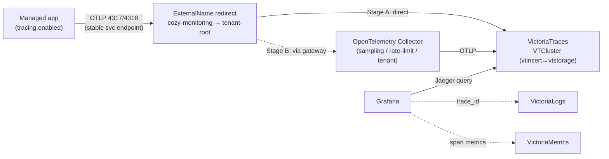

<!-- Place this file at design-proposals/distributed-tracing/README.md -->
# Distributed tracing in the Cozystack monitoring stack

- **Title:** `Distributed tracing for managed applications via OTLP and VictoriaTraces`
- **Author(s):** `@scooby87`
- **Date:** `2026-07-16`
- **Status:** Draft

## Overview

Cozystack ships two of the three observability signals out of the box — metrics (VictoriaMetrics) and logs (VictoriaLogs) — but has no supported way to collect distributed **traces**. An operator who wants to see how a request flows through a managed database or messaging cluster, or to correlate a slow span with the logs and metrics it produced, has nothing to turn on. This proposal adds the third signal: an OTLP ingest path, a VictoriaTraces backend that mirrors the existing VictoriaLogs deployment one-for-one, a Grafana traces datasource wired for trace↔logs↔metrics correlation, and a per-application opt-in toggle so a tenant enables tracing on exactly the workloads that need it.

The design is deliberately conservative: it reuses the multi-tenant topology, the operator-driven provisioning, the Grafana datasource pattern, and the values surface that metrics and logs already established, so tracing lands as "the same thing again for a third signal" rather than a new subsystem with new conventions. The backend choice — VictoriaTraces — falls out of that principle: the `VTCluster`/`VTSingle` CRDs already ship in the victoria-metrics-operator that Cozystack deploys today, so no new operator is introduced.

## Scope and related proposals

In scope: a traces backend (platform-wide and per-tenant), an OTLP ingest gateway, a Grafana datasource with correlation, and a per-app opt-in surface. Out of scope: automatic instrumentation of arbitrary tenant workloads, and tracing the internals of Virtual Machines or the Kubernetes control plane (VMs and Kubernetes are not traced by this proposal — only Cozystack-managed applications that can emit OTLP are).

- **Sibling stack:** the platform monitoring stack `packages/system/monitoring` and the per-tenant stack `packages/extra/monitoring` (wired by `packages/apps/tenant/templates/monitoring.yaml`). This proposal extends both.
- **Collection agents:** `packages/system/monitoring-agents` (fluent-bit, vmagent) — the deployment pattern the OTLP collector follows.
- **Prior art in-repo:** Harbor already exposes an internal trace config (`packages/system/harbor/charts/harbor/values.yaml`, provider `jaeger` or `otel`). It is app-local and not a platform backend; this proposal supersedes ad-hoc per-app trace endpoints with a shared destination.
- **Driver:** requested by a client (hidora) who needs request-level visibility across managed DBaaS and messaging services.

## Context

Cozystack's observability is multi-tenant with a central backend. The platform stack runs in `tenant-root` (namespace `cozy-monitoring`) and hosts VictoriaMetrics, VictoriaLogs, Grafana (via grafana-operator), Alerta and vmalert. Tenants either ship signals to the central backend (ExternalName redirects in tenant namespaces point at the root stack; vmagent stamps a `tenant:` external label) or run their own isolated stack from `packages/extra/monitoring`.

Metrics storage is declared as a list of tiers in values and rendered into VictoriaMetrics CRs — `metricsStorages` in `packages/system/monitoring/values.yaml` defines a `shortterm` (3d) and a `longterm` (14d) tier. Logs storage follows the identical shape: `logsStorages` renders one `VLCluster` per entry in `packages/system/monitoring/templates/vlogs/vlogs.yaml`, with the retention period set on `vlstorage.retentionPeriod`, `managedMetadata` labels for application ownership, a label stamped on the storage PVC claim template so the post-delete cleanup hook can find it, and a load-bearing guard that **fails the render** when the list is empty rather than silently shipping to a non-existent endpoint (the fix for issue `cozystack/cozystack#3181`).

Grafana datasources are provisioned as `GrafanaDatasource` CRs by grafana-operator, one per storage: `packages/system/monitoring/templates/vm/grafana-datasource.yaml` (type `prometheus`, per metrics tier) and `packages/system/monitoring/templates/vlogs/grafana-datasource.yaml` (type `victoriametrics-logs-datasource`, per logs storage). Every datasource attaches to Grafana through `instanceSelector: { matchLabels: { dashboards: grafana } }`.

Applications expose metrics today but there is no tracing surface. Most managed engines are scraped unconditionally through a `WorkloadMonitor` CR (clickhouse, kafka, rabbitmq, nats, mariadb) or a native operator mechanism (postgres/CNPG `enablePodMonitor`, redis via a `redis_exporter` sidecar + `VMServiceScrape`). The one app with an explicit observability toggle is foundationdb: `monitoring.enabled` in `packages/apps/foundationdb/values.yaml` gates whether its `WorkloadMonitor` renders — that toggle is the shape a `tracing.enabled` switch should copy. Note that `WorkloadMonitor` itself is not a fit for carrying tracing config: its controller (`internal/controller/workloadmonitor_controller.go`) reconciles it into `Workload` objects that track replicas/resources/operational status for the dashboard and billing surfaces — it does not emit scrape configs, and tracing opt-in therefore belongs in each app's `values.yaml`, not in `WorkloadMonitor`.

Crucially, the tracing backend needs no new operator. The victoria-metrics-operator Cozystack already runs (appVersion `v0.68.4`, `packages/system/victoria-metrics-operator`) ships the VictoriaTraces CRDs `VTCluster` and `VTSingle` (`packages/system/victoria-metrics-operator/charts/victoria-metrics-operator/crd.yaml`, CRDs `vtclusters.operator.victoriametrics.com` and `vtsingles.operator.victoriametrics.com`). `VTCluster` decomposes into `VTInsert`/`VTStorage`/`VTSelect` — a direct analog of `VLCluster`'s `vlinsert`/`vlstorage`/`vlselect` — so the render template can be lifted from `vlogs.yaml` almost verbatim.

### The problem

- "A query against my managed Postgres is slow and I can't see where the time goes — which statement, which replica, which downstream call." There is no trace to open.
- "I have a log line for a failed request and a latency spike on a dashboard, but no way to jump from either to the actual request span." The signals don't correlate.
- "My application already emits OTLP spans, but Cozystack gives me nowhere to send them." There is no OTLP endpoint and no backend.

## Goals

- Accept traces over **OTLP** (gRPC `4317` and HTTP `4318`), the standard cloud-native tracing protocol.
- Store traces in a **VictoriaTraces** backend with a **configurable retention period, defaulting to 14 days**.
- Provide a **per-application opt-in** `tracing.enabled` toggle; tracing is **off by default** and adds zero overhead until enabled.
- Provision a **Grafana traces datasource** and wire **trace↔logs↔metrics** correlation so an operator can pivot between all three signals.
- Preserve **per-tenant isolation and the central-backend topology** exactly as metrics and logs do today.
- Introduce **no new operator** and no new provisioning convention — reuse VictoriaTraces (already in vm-operator), the storage-list values shape, and the grafana-operator datasource pattern.

### Non-goals

- Auto-instrumenting arbitrary tenant workloads. This proposal wires the *transport and storage*; emitting spans is the application's job (native where the engine supports it, sidecar/agent otherwise).
- Tracing Virtual Machines or Kubernetes control-plane internals.
- Changing the existing metrics or logs pipelines.
- Mandating a sampling policy for tenant applications (the platform sets a safe default and exposes a knob).

## Design

### 1. Backend: VictoriaTraces (`tracingStorages`)

Add a `tracingStorages` list to the monitoring values, parallel to `metricsStorages` and `logsStorages`, in both `packages/system/monitoring/values.yaml` and `packages/extra/monitoring/values.yaml`:

```yaml
tracingStorages:
- name: generic
  retentionPeriod: "14d"   # configurable; default 14 days per the requirement
  storage: 10Gi
  storageClassName: ""
```

Render one `VTCluster` per entry in a new `templates/vtraces/vtraces.yaml`, lifted from `templates/vlogs/vlogs.yaml`: `managedMetadata` labels for application ownership, replica counts on `vtinsert`/`vtselect`/`vtstorage`, `vtstorage.retentionPeriod` from the entry, the storage-PVC claim-template label for the release-scoped post-delete cleanup hook, and — reusing the `cozystack/cozystack#3181` lesson — a guard that **fails the render on an empty list** so a misconfiguration is loud, not a silent black hole for spans.

```yaml
{{- range .Values.tracingStorages }}
---
apiVersion: operator.victoriametrics.com/v1
kind: VTCluster
metadata:
  name: {{ .name }}
spec:
  managedMetadata:
    labels:
      apps.cozystack.io/application.kind: Monitoring
      apps.cozystack.io/application.name: {{ $.Release.Name }}
  vtinsert:  { replicaCount: 2 }
  vtselect:  { replicaCount: 2 }
  vtstorage:
    retentionPeriod: {{ .retentionPeriod | quote }}
    replicaCount: 2
    storage:
      volumeClaimTemplate:
        metadata:
          labels:
            apps.cozystack.io/application.name: {{ $.Release.Name }}
        spec:
          {{- with .storageClassName }}
          storageClassName: {{ . }}
          {{- end }}
          resources:
            requests:
              storage: {{ .storage }}
{{- end }}
```

The monitoring HelmRelease must gate readiness on the new `VTCluster` exactly as it does for `VLCluster` today: `waitStrategy: poller` plus a `healthCheckExprs` entry that waits for the CR's `status.updateStatus == 'operational'` (see `packages/extra/monitoring/templates/helmrelease.yaml`). Without the poller gate the release flips Ready as soon as Helm applies the CR — the exact silent-black-hole failure mode that motivated `cozystack/cozystack#3181` for logs.

### 2. OTLP ingest (staged: direct-to-backend, then a collector gateway)

`vtinsert` accepts OTLP natively, so the ingest path mirrors logs one-for-one: where fluent-bit ships to `vlinsert-generic`, a traced application ships OTLP to `vtinsert-generic`. This proposal stages the ingest so the platform gets value immediately and grows into the collector the client asked for, with **no app-visible endpoint change between stages**.

**Stage A (MVP) — direct to `vtinsert`.** Applications push OTLP straight to the VictoriaTraces insert service. Add an `otel-traces` (or `vtinsert-generic`) **ExternalName redirect** to `packages/system/cozystack-basics/templates/monitoring-external-services.yaml`, alongside the existing `vlinsert-generic`/`vminsert-*` entries, pointing `*.cozy-monitoring.svc` → `*.tenant-root.svc.cluster.local`, gated on the same `_cluster.monitoring-enabled` flag (from `monitoring.rootEnabled`). This is the exact mechanism logs and metrics already use; central-vs-isolated tenants work identically with zero new machinery.

**Stage B — toggleable OpenTelemetry Collector gateway.** Add an OpenTelemetry Collector (gateway **Deployment** in `cozy-monitoring`, following the `packages/system/monitoring-agents` pattern) in front of `vtinsert` for the capabilities direct ingest can't provide: central sampling, rate-limiting, and per-`tenant` resource attribution. It is the "OpenTelemetry Collector/Agent via an option" the client explicitly requested, and it is opt-in.

- Receivers: `otlp` on gRPC `4317` and HTTP `4318`.
- Processors: `batch`, a `tail_sampling`/`probabilistic_sampler` governed by the platform default, and `resource` to stamp `tenant`.
- Exporter: OTLP to the `vtinsert` service of the `tracingStorages` backend.

Applications always target a stable in-cluster endpoint (e.g. `…cozy-monitoring.svc:4317`); flipping from Stage A to Stage B only re-points that ExternalName from `vtinsert` to the collector, so the migration is transparent to every traced app. A gateway **Deployment** (not a DaemonSet) is correct here because OTLP is push-based over the network — apps are the agents; the collector plays the centralized `vtinsert`/vmagent role, not the node-local fluent-bit role.

### 3. Grafana datasource and correlation

Add a `GrafanaDatasource` CR per `tracingStorages` entry in `templates/vtraces/grafana-datasource.yaml`, mirroring the logs datasource template and attaching through `instanceSelector: { matchLabels: { dashboards: grafana } }`. VictoriaTraces exposes a Jaeger-compatible query API, so the datasource is `type: jaeger` (or the dedicated VictoriaTraces datasource plugin, allow-listed like `victoriametrics-logs-datasource` is today) pointed at the `vtselect` service. Configure:

- **Trace → logs**: link to the VictoriaLogs datasource keyed on `trace_id`.
- **Trace → metrics**: link to the VictoriaMetrics datasource for RED-style span metrics.
- **Logs/metrics → trace**: derived fields on the existing datasources so a `trace_id` in a log or exemplar opens the trace.

### 4. Per-application opt-in

Add a `tracing` struct to each participating app's `values.yaml` using the cozyvalues-gen annotation conventions, modelled on foundationdb's `monitoring.enabled` toggle and postgres's `backup` struct:

```yaml
## @typedef {struct} Tracing - OpenTelemetry (OTLP) tracing configuration.
## @field {bool} enabled - Enable OTLP trace export from this application.
## @field {string} [endpoint] - OTLP collector endpoint. Defaults to the platform collector in cozy-monitoring.
## @field {string} [samplingRatio] - Head-sampling ratio 0.0..1.0. Defaults to the platform policy.

## @param {Tracing} tracing - OpenTelemetry tracing configuration.
tracing:
  enabled: false
  endpoint: ""
  samplingRatio: ""
```

How an app emits spans depends on the engine:

- **Native OTLP**, wired by chart config: ClickHouse (`opentelemetry_span_log`, currently disabled in `packages/apps/clickhouse/templates/clickhouse.yaml`) and NATS (native OTLP in recent versions).
- **Sidecar/agent OTLP**: Kafka and RabbitMQ (JVM/plugin agents), MariaDB, Redis and Postgres (an OpenTelemetry agent/exporter sidecar). The `tracing.enabled` toggle gates the sidecar and the `OTEL_EXPORTER_OTLP_ENDPOINT` env, defaulting to the platform collector.

### 5. Data flow



## User-facing changes

- A new `tracingStorages` block in the monitoring values (system and per-tenant), with `retentionPeriod` defaulting to 14 days.
- A new per-app `tracing.*` block; off by default.
- A Traces datasource and Explore/Traces view in Grafana, with pivot links to logs and metrics.
- A docs entry point (`docs/observability/distributed-tracing.md` in `cozystack/cozystack`) covering how to enable tracing and point an app at the collector.

## Upgrade and rollback compatibility

The change is purely additive and opt-in. Existing clusters see no behavioural change until `tracingStorages` is set and an app flips `tracing.enabled`. An empty/absent `tracingStorages` renders no `VTCluster` (guarded, so it fails loudly only if a downstream component is told to expect one — matching the logs behaviour). No data migration is required. Rollback is removing the `tracingStorages` block and the per-app toggles; trace data in VictoriaTraces PVCs is discarded on backend removal (flagged: irreversible for already-stored spans, like logs).

## Security

- **New tenant-supplied input**: the OTLP endpoint accepts spans from tenant workloads. In Stage A the shared `vtinsert` backend is the exposed surface (relying on VictoriaTraces' own limits and the per-tenant isolation of isolated stacks); Stage B's collector becomes the explicit trust boundary — enforcing per-tenant `tenant` resource attribution, rate-limits, and sampling so a noisy or hostile tenant cannot exhaust the shared backend. This hardening is the main reason to promote Stage B on a shared central backend.
- **Isolation**: central-backend mode keeps the existing tenant-labelling model; isolated mode (`packages/extra/monitoring`) keeps traces inside the tenant.
- **Transport**: OTLP endpoints should be TLS-terminated; align with the unified TLS/PKI model (`design-proposals/unified-tls-pki`) rather than minting bespoke certs.
- **RBAC**: new `VTCluster`/`GrafanaDatasource`/collector resources need the same narrowly-scoped RBAC the metrics/logs equivalents already have. No new secret classes are introduced beyond the OTLP endpoint credentials, if any.

## Failure and edge cases

- Empty `tracingStorages` while a consumer expects a backend → loud render failure (mirrors `cozystack/cozystack#3181`), never a silent span black hole.
- OTLP endpoint unreachable from an app (backend or collector down) → the app's exporter drops/retries per OTLP defaults; the app itself does not crash and serving is unaffected.
- Backend storage exhausted → oldest traces evicted per `retentionPeriod`; ingest backpressures at the receiver (`vtinsert` in Stage A, the collector in Stage B), not the app.
- `tracing.enabled: false` → no sidecar, no env, no CR: zero overhead.
- App emits OTLP but no backend deployed → the ExternalName resolves to nothing and the exporter drops/retries harmlessly; the app toggle is documented to require a `tracingStorages` backend.

## Testing

- **Unit/lint**: `helm template` + `helm lint` for the new `vtraces` templates and each app's `tracing` block; assert `VTCluster`, the collector, and the `GrafanaDatasource` render only when configured, and that an empty `tracingStorages` fails the render.
- **e2e** (Chainsaw, per `docs/agents/e2e-testing.md`): deploy the monitoring stack with a `tracingStorages` entry, deploy one app (start with a native-OTLP engine, e.g. ClickHouse) with `tracing.enabled: true`, generate activity, then assert a trace is queryable via the `vtselect` Jaeger API and visible in Grafana.
- **Manual**: verify trace→logs and trace→metrics pivots in Grafana.

## Rollout

1. **Stage A — backend + direct ingest**: `tracingStorages`/`VTCluster` in `packages/system/monitoring` (+ `packages/extra/monitoring`) with the poller readiness gate, plus the `vtinsert` ExternalName redirect in `packages/system/cozystack-basics`. Apps can push OTLP directly. No collector yet.
2. **Grafana**: traces datasource + correlation links.
3. **Per-app toggles**: start with native-OTLP engines (ClickHouse, NATS), then sidecar-based engines (Kafka, RabbitMQ, MariaDB, Redis, Postgres), one PR per app.
4. **Stage B — collector gateway**: add the toggleable OpenTelemetry Collector Deployment and re-point the ExternalName from `vtinsert` to the collector (transparent to apps). Ships sampling/rate-limiting/tenant-attribution.
5. **Docs**: enablement guide under `docs/observability/`.

## Open questions

- **VictoriaTraces maturity**: the CRDs ship in the operator, but is VictoriaTraces production-ready at the version Cozystack pins? If not, Grafana Tempo is the drop-in fallback (see Alternatives) — the collector and per-app surfaces are backend-agnostic, so only the backend template and datasource type change.
- **`VTCluster` vs `VTSingle`** as the default: cluster for HA parity with metrics/logs, or single for a lighter footprint on small clusters?
- **Sampling**: head sampling at the app vs tail sampling at the collector; what platform default? (Only relevant once Stage B lands.)
- **External OTLP exposure**: should tenants be able to push spans from outside the cluster, and if so through which ingress/Gateway path?
- **Stage-B trigger**: what concrete signal (backend load, abuse, a tenant-attribution requirement) promotes the collector gateway from optional to default?

Resolved during design (recorded here so they are not re-litigated): ingest is **staged A→B** — direct-to-`vtinsert` first, collector gateway as an opt-in second — because `vtinsert` is OTLP-native and the ExternalName redirect keeps the app-facing endpoint stable across the switch. The collector is a gateway **Deployment**, not a DaemonSet, because OTLP is push-based (apps are the agents). Tracing opt-in lives in app `values.yaml`, not `WorkloadMonitor` (operational-only).

## Alternatives considered

- **Grafana Tempo** (backend): mature, object-storage-backed (cheap retention on the seaweedfs/COSI storage Cozystack already runs), and the strongest Grafana-native correlation story. Rejected as the *primary* choice only to keep the stack single-vendor (VictoriaMetrics/Logs/Traces share one operator and one operational model). It remains the recommended fallback if VictoriaTraces proves immature — the rest of this design is unchanged by the swap.
- **Jaeger** (backend): mature and OTLP-native, but its own UI and weaker Grafana integration cut against the single-pane correlation goal, and it adds an operator/storage story Cozystack doesn't already have.
- **No collector, app → backend directly** (ingest): adopted as **Stage A**, not rejected — `vtinsert` is OTLP-native, so direct ingest is the fastest correct MVP and an exact mirror of the logs path. Its limitations (no shared trust boundary, per-tenant attribution, or central sampling/rate-limiting) are exactly what **Stage B**'s collector gateway adds later, without changing the app-facing endpoint.
- **Collector as a DaemonSet agent** (ingest topology): rejected — that node-local shape fits fluent-bit tailing log files, but OTLP traces are pushed over the network by the apps themselves, so a centralized gateway Deployment (the `vtinsert`/vmagent role) is the right shape.
- **Always-on tracing** (opt-in model): rejected — tracing overhead and storage cost must be a tenant's explicit choice; default off matches the requirement and the principle of least surprise.
