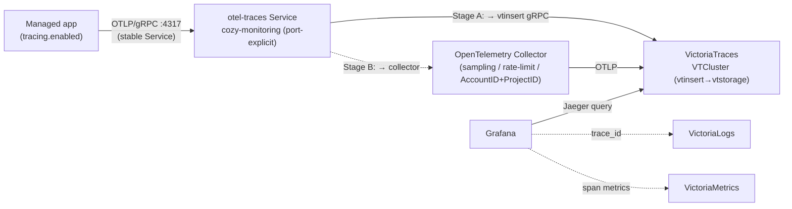

# Distributed tracing in the Cozystack monitoring stack

- **Title:** `Distributed tracing for managed applications via OTLP and VictoriaTraces`
- **Author(s):** `@scooby87`
- **Date:** `2026-07-16`
- **Status:** Review

## Overview

Cozystack ships two of the three observability signals out of the box — metrics (VictoriaMetrics) and logs (VictoriaLogs) — but has no supported way to collect distributed **traces**. An operator who wants to see how a request flows through a managed database or messaging cluster, or to correlate a slow span with the logs and metrics it produced, has nothing to turn on. This proposal adds the third signal: an OTLP ingest path, a VictoriaTraces backend that mirrors the existing VictoriaLogs deployment one-for-one, a Grafana traces datasource wired for trace↔logs↔metrics correlation, and a per-application opt-in toggle so a tenant enables tracing on exactly the workloads that need it.

The design is deliberately conservative: it reuses the multi-tenant topology, the operator-driven provisioning, the Grafana datasource pattern, and the values surface that metrics and logs already established, so tracing lands as "the same thing again for a third signal" rather than a new subsystem with new conventions. The backend choice — VictoriaTraces — falls out of that principle: the `VTCluster`/`VTSingle` CRDs already ship in the victoria-metrics-operator that Cozystack deploys today, so no new operator is introduced.

## Scope and related proposals

In scope: a traces backend (platform-wide and per-tenant), an OTLP ingest gateway, a Grafana datasource with correlation, and a per-app opt-in surface. Out of scope: automatic instrumentation of arbitrary tenant workloads, and tracing the internals of Virtual Machines or the Kubernetes control plane (VMs and Kubernetes are not traced by this proposal — only Cozystack-managed applications that can emit OTLP are).

- **Sibling stack:** the platform monitoring stack `packages/system/monitoring` and the per-tenant stack `packages/extra/monitoring` (wired by `packages/apps/tenant/templates/monitoring.yaml`). This proposal extends both.
- **Collection agents:** `packages/system/monitoring-agents` (fluent-bit, vmagent) — the deployment pattern the OTLP collector follows.
- **Prior art in-repo:** Harbor already exposes an internal trace config (`packages/system/harbor/charts/harbor/values.yaml`, provider `jaeger` or `otel`). It is app-local and not a platform backend; this proposal supersedes ad-hoc per-app trace endpoints with a shared destination.
- **Driver:** requested by a client (hidora) who needs request-level visibility across managed DBaaS and messaging services.

## Context

Cozystack's observability is multi-tenant with a central backend. The `monitoring` component (VictoriaMetrics, VictoriaLogs, Grafana via grafana-operator, Alerta, vmalert) installs into the `cozy-monitoring` namespace (`packages/core/platform/sources/monitoring.yaml`), and its backing insert/select services resolve to `*.tenant-root.svc.cluster.local`. The redirect wiring lives in `cozy-monitoring`: `packages/system/cozystack-basics/templates/monitoring-external-services.yaml` creates `ExternalName` services *there* (`vlinsert-generic`, `vminsert-shortterm`, `vminsert-longterm`) whose `externalName` targets are in `tenant-root` — so `cozy-monitoring` holds the aliases and `tenant-root` holds what they resolve to, gated on `_cluster.monitoring-enabled`. vmagent stamps a `tenant:` external label; a tenant can instead run its own isolated stack from `packages/extra/monitoring`.

Metrics storage is declared as a list of tiers in values and rendered into VictoriaMetrics CRs — `metricsStorages` in `packages/system/monitoring/values.yaml` defines a `shortterm` (3d) and a `longterm` (14d) tier. Logs storage follows the identical shape: `logsStorages` renders one `VLCluster` per entry in `packages/system/monitoring/templates/vlogs/vlogs.yaml`, with the retention period set on `vlstorage.retentionPeriod`, `managedMetadata` labels for application ownership, a label stamped on the storage PVC claim template so the post-delete cleanup hook can find it, and a load-bearing guard that **fails the render** when the list is empty rather than silently shipping to a non-existent endpoint (the fix for issue `cozystack/cozystack#3181`).

Grafana datasources are provisioned as `GrafanaDatasource` CRs by grafana-operator, one per storage: `packages/system/monitoring/templates/vm/grafana-datasource.yaml` (type `prometheus`, per metrics tier) and `packages/system/monitoring/templates/vlogs/grafana-datasource.yaml` (type `victoriametrics-logs-datasource`, per logs storage). Every datasource attaches to Grafana through `instanceSelector: { matchLabels: { dashboards: grafana } }`.

Applications expose metrics today but there is no tracing surface. Most managed engines declare a `WorkloadMonitor` CR (clickhouse, kafka, rabbitmq, nats, mariadb, redis) and/or a native operator mechanism (postgres/CNPG `enablePodMonitor`, redis's `redis_exporter` sidecar + `VMServiceScrape`). The one app with an explicit observability toggle is foundationdb: `monitoring.enabled` in `packages/apps/foundationdb/values.yaml` gates whether its `WorkloadMonitor` renders — that toggle is the shape a `tracing.enabled` switch should copy. Note that `WorkloadMonitor` itself is not a fit for carrying tracing config: its controller (`internal/controller/workloadmonitor_controller.go`) reconciles it into `Workload` objects that track replicas/resources/operational status (and query Prometheus for resource usage) for the dashboard and billing surfaces — the actual metric scrape configs are rendered by the individual app charts, not by this controller, so tracing opt-in belongs in each app's `values.yaml`, not in `WorkloadMonitor`.

Crucially, the tracing backend needs no new operator. The victoria-metrics-operator Cozystack already runs (appVersion `v0.68.4`, `packages/system/victoria-metrics-operator`) ships the VictoriaTraces CRDs `VTCluster` and `VTSingle` (`packages/system/victoria-metrics-operator/charts/victoria-metrics-operator/crd.yaml`, CRDs `vtclusters.operator.victoriametrics.com` and `vtsingles.operator.victoriametrics.com`). `VTCluster` decomposes into VTInsert/VTStorage/VTSelect components — conceptually analogous to `VLCluster`'s insert/storage/select — but note the exact spec keys differ: `VLCluster` uses `vlinsert`/`vlselect`/`vlstorage`, whereas `VTCluster` **drops the prefix** and uses `spec.insert`/`spec.select`/`spec.storage` (verified against the CRD's printer columns `.spec.insert.replicaCount` etc.). The rendered workloads/services still carry the `vt` prefix (`vtinsert-*`/`vtselect-*`/`vtstorage-*`), same as `VLCluster` yields `vlinsert-*`. So the template is *shaped* like `vlogs.yaml` but the sub-spec keys are not a verbatim copy — this is the one place the analogy misleads, and it is corrected throughout below.

### The problem

- "A query against my managed Postgres is slow and I can't see where the time goes — which statement, which replica, which downstream call." There is no trace to open.
- "I have a log line for a failed request and a latency spike on a dashboard, but no way to jump from either to the actual request span." The signals don't correlate.
- "My application already emits OTLP spans, but Cozystack gives me nowhere to send them." There is no OTLP endpoint and no backend.

## Goals

- Accept traces over **OTLP** (gRPC `4317` and HTTP `4318`), the standard cloud-native tracing protocol.
- Store traces in a **VictoriaTraces** backend with a **configurable retention period, defaulting to 14 days**.
- Provide a **per-application opt-in** `tracing.enabled` toggle; tracing is **off by default** and adds zero overhead until enabled.
- Provision a **Grafana traces datasource** and wire **trace↔logs↔metrics** correlation so an operator can pivot between all three signals.
- Preserve **per-tenant isolation and the central-backend topology** exactly as metrics and logs do today.
- Introduce **no new operator** and no new provisioning convention — reuse VictoriaTraces (already in vm-operator), the storage-list values shape, and the grafana-operator datasource pattern.

### Non-goals

- Auto-instrumenting arbitrary tenant workloads. This proposal wires the *transport and storage*; emitting spans is the application's job (native where the engine supports it, sidecar/agent otherwise).
- Tracing Virtual Machines or Kubernetes control-plane internals.
- Changing the existing metrics or logs pipelines.
- Mandating a sampling policy for tenant applications (the platform sets a safe default and exposes a knob).

## Design

### 1. Backend: VictoriaTraces (`tracingStorages`)

Add a `tracingStorages` list to the monitoring values, parallel to `metricsStorages` and `logsStorages`, in both `packages/system/monitoring/values.yaml` and `packages/extra/monitoring/values.yaml`:

```yaml
tracingStorages:
- name: generic
  retentionPeriod: "14d"           # age-based retention; default 14 days per the requirement
  retentionDiskUsageBytes: ""      # optional disk-based cap, byte quantity (e.g. "50GB"); see note below
  storageSize: 10Gi                # PVC size for vtstorage
  storageClassName: ""
  replicaCount: 2                  # component scaling, NOT data replication (see durability note)
```

Render one `VTCluster` per entry in a new `templates/vtraces/vtraces.yaml`, shaped like `templates/vlogs/vlogs.yaml` (but with `VTCluster`'s prefix-less sub-spec keys): `managedMetadata` labels for application ownership, configurable replica counts on `spec.insert`/`spec.select`/`spec.storage`, `spec.storage.retentionPeriod` from the entry, the storage-PVC claim-template label for the release-scoped post-delete cleanup hook, and the `cozystack/cozystack#3181` guard (see the absent-vs-empty contract below).

**Absent vs empty contract** (the two must not be conflated): an **absent/unset** `tracingStorages` key means "tracing disabled", and the template renders nothing and succeeds (so tracing stays opt-in and a cluster that never wanted traces is never broken). An **explicitly empty list** (`tracingStorages: []`) is a misconfiguration — a consumer asked for tracing but declared no backend — and **fails the render**, exactly like the logs `#3181` guard. Both cases must be covered by tests.

**Durability note:** `replicaCount` scales the number of `vtstorage` pods for throughput/availability of the *component*, but VictoriaTraces cluster mode does **not** replicate span data between storage nodes — losing a storage node can make some queries return partial results. This is the same durability model as `VLCluster`, and it is *not* HA data replication. Real cross-node durability requires either replication through Collectors into two independent VictoriaTraces backends or an equivalent design; this is called out in Open questions rather than solved here.

```yaml
{{- range .Values.tracingStorages }}
---
apiVersion: operator.victoriametrics.com/v1
kind: VTCluster
metadata:
  name: {{ .name }}
spec:
  managedMetadata:
    labels:
      apps.cozystack.io/application.group: apps.cozystack.io
      apps.cozystack.io/application.kind: Monitoring
      apps.cozystack.io/application.name: {{ $.Release.Name }}
  insert:  { replicaCount: {{ .replicaCount | default 2 }} }
  select:  { replicaCount: {{ .replicaCount | default 2 }} }
  storage:
    retentionPeriod: {{ .retentionPeriod | quote }}
    {{- with .retentionDiskUsageBytes }}
    retentionMaxDiskSpaceUsageBytes: {{ . | quote }}
    {{- end }}
    replicaCount: {{ .replicaCount | default 2 }}
    storage:
      volumeClaimTemplate:
        metadata:
          labels:
            apps.cozystack.io/application.name: {{ $.Release.Name }}
        spec:
          {{- with .storageClassName }}
          storageClassName: {{ . }}
          {{- end }}
          resources:
            requests:
              storage: {{ .storageSize }}
{{- end }}
```

The monitoring HelmRelease must gate readiness on the new `VTCluster` exactly as it does for `VLCluster` today: `waitStrategy: poller` plus a `healthCheckExprs` entry that waits for the CR's `status.updateStatus == 'operational'` (see `packages/extra/monitoring/templates/helmrelease.yaml`). Without the poller gate the release flips Ready as soon as Helm applies the CR — the exact silent-black-hole failure mode that motivated `cozystack/cozystack#3181` for logs.

### 2. OTLP ingest (staged: direct-to-backend, then a collector gateway)

`vtinsert` accepts OTLP natively, so the ingest path mirrors logs one-for-one: where fluent-bit ships to `vlinsert-generic`, a traced application ships OTLP to `vtinsert`. This proposal stages the ingest so the platform gets value immediately and grows into the collector the client asked for, behind **one stable app-facing endpoint** — an explicit in-cluster Service on OTLP/gRPC `4317` — so promoting Stage A→B swaps what that Service targets (backend → collector), not the app's configuration.

**Stage A (MVP) — direct to `vtinsert`.** Applications push OTLP/gRPC to the stable Service `otel-traces.cozy-monitoring.svc:4317`, which in Stage A resolves to `vtinsert`'s OTLP/gRPC listener (enabled by setting `-otlpGRPCListenAddr` on the `VTCluster`). Tenant redirection to the central stack reuses the mechanism in `packages/system/cozystack-basics/templates/monitoring-external-services.yaml` (gated on `_cluster.monitoring-enabled` from `monitoring.rootEnabled`) that logs and metrics already use — but as a **port-explicit** Service, not a bare `ExternalName`.

**OTLP service contract** (the exact ports/path matter, and a bare `ExternalName` cannot carry them): an `ExternalName` only aliases DNS; it does not remap ports or translate the OTLP/HTTP path. `vtinsert` defaults to OTLP/HTTP on port `10481` at path `/insert/opentelemetry/v1/traces`, and to OTLP/gRPC only when `-otlpGRPCListenAddr` is set (conventionally `4317`). Because the collector's OTLP/HTTP path (`/v1/traces`) differs from `vtinsert`'s, **OTLP/gRPC is the chosen stable app contract**: gRPC has no path, so the same `…:4317` Service works whether it fronts `vtinsert` (Stage A) or the collector (Stage B). The redirect is therefore an explicit ports-carrying Service (`ClusterIP` with an `externalName`-style upstream, or a small proxy), never plain DNS aliasing. OTLP/HTTP users must standardize on the collector from the start, since its ingest path is not interchangeable with `vtinsert`'s.

**Tenant routing needs headers** (the load-bearing multi-tenancy point): VictoriaTraces attributes a tenant from the `AccountID`/`ProjectID` request headers (query-string equivalents take priority); with neither set, everything lands in the default tenant `0:0`. Neither an `ExternalName` redirect nor a collector `resource` processor sets those headers. So on a shared central backend the write path must inject `AccountID`/`ProjectID` derived from authenticated workload identity — from the app's OTLP exporter, a trusted per-tenant proxy, or (Stage B) the collector's `headers_setter` extension (see below) — in addition to stamping the `tenant` resource attribute for query-time labelling. Isolated per-tenant stacks (`packages/extra/monitoring`) sidestep this by not sharing a backend.

**Stage B — toggleable OpenTelemetry Collector gateway.** Add an OpenTelemetry Collector (gateway **Deployment** in `cozy-monitoring`, following the `packages/system/monitoring-agents` pattern) in front of `vtinsert` for the capabilities direct ingest can't provide: central sampling, rate-limiting, and per-`tenant` resource attribution. It is the "OpenTelemetry Collector/Agent via an option" the client explicitly requested, and it is opt-in.

- Receivers: `otlp` on gRPC `4317` and HTTP `4318` (the collector owns these canonical ports; it translates to `vtinsert`'s `10481`/`/insert/opentelemetry/v1/traces` on export).
- Processors: `batch`, a sampler (see the affinity note), and `resource` to stamp the `tenant` attribute.
- Exporter: `otlphttp`/`otlp` to the `vtinsert` service of the `tracingStorages` backend. Per-request `AccountID`/`ProjectID` must come from the `headers_setter` extension (`from_context`, with the OTLP receiver `include_metadata: true` and the `batch` processor preserving metadata) — **static `otlphttp.headers` cannot derive per-tenant IDs** and would route every tenant to one account. A trusted per-tenant proxy is the alternative; tenants must not be able to set their own routing headers.

**Tail-sampling affinity:** tail sampling must see *all* spans of a trace on one instance, but a plain Kubernetes Service round-robins spans across collector replicas and would make sampling decisions on incomplete traces. So the sampling tier must run at a single replica, or use the two-tier pattern — a first tier with the `loadbalancingexporter` (`routing_key: traceID`) consistently hashing each trace to a fixed second-tier instance that runs `tail_sampling`. Head sampling (`probabilistic_sampler`) has no such constraint and can scale freely; the platform default and this trade-off are an Open question.

Because the app-facing contract is the fixed `otel-traces…:4317` gRPC Service, promoting Stage A→B changes only what that Service targets (`vtinsert` → collector) — a platform-side change, with no app reconfiguration (this holds for gRPC; OTLP/HTTP is not path-interchangeable, so HTTP users adopt the collector from the start). A gateway **Deployment** (not a DaemonSet) is correct here because OTLP is push-based over the network — apps are the agents; the collector plays the centralized `vtinsert`/vmagent role, not the node-local fluent-bit role.

### 3. Grafana datasource and correlation

Add a `GrafanaDatasource` CR per `tracingStorages` entry in `templates/vtraces/grafana-datasource.yaml`, mirroring the logs datasource template and attaching through `instanceSelector: { matchLabels: { dashboards: grafana } }`. VictoriaTraces exposes a Jaeger-compatible query API, so the datasource is `type: jaeger` (or the dedicated VictoriaTraces datasource plugin, allow-listed like `victoriametrics-logs-datasource` is today) pointed at the `vtselect` service. Configure:

- **Trace → logs**: link to the VictoriaLogs datasource keyed on `trace_id`.
- **Trace → metrics**: link to the VictoriaMetrics datasource for RED-style span metrics. Grafana's trace-to-metrics only *links* to pre-existing metrics — it does not generate them. So RED/span metrics need a source: the Stage-B collector's `spanmetrics` connector (recommended, produces RED metrics from spans and exports them to VictoriaMetrics), or native app instrumentation. Under Stage A (direct ingest, no collector) there are no span metrics — trace↔metrics correlation is therefore a Stage-B capability, and exemplars linking metrics→trace likewise depend on the metric producer emitting `trace_id` exemplars.
- **Logs/metrics → trace**: derived fields on the existing datasources so a `trace_id` in a log or exemplar opens the trace.

**Read-side tenant isolation** (the gap most likely to bite in central-backend mode): the write path attributes tenants via `AccountID`/`ProjectID`, but the *read* path must also scope a tenant's Grafana traces datasource to its own `AccountID`/`ProjectID` so tenant A cannot query tenant B's spans through the shared `vtselect`. This mirrors how logs/metrics rely on per-tenant labelling and/or per-tenant stacks; for traces on a shared backend it means the per-tenant `GrafanaDatasource` must carry the tenant's account/project scoping (or the tenant runs an isolated stack). This is called out explicitly in Open questions.

### 4. Per-application opt-in

Add a `tracing` struct to each participating app's `values.yaml` using the cozyvalues-gen annotation conventions, modelled on foundationdb's `monitoring.enabled` toggle and postgres's `backup` struct:

```yaml
## @typedef {struct} Tracing - OpenTelemetry (OTLP) tracing configuration.
## @field {bool} enabled - Enable OTLP trace export from this application.
## @field {string} [endpoint] - OTLP collector endpoint. Defaults to the platform collector in cozy-monitoring.
## @field {string} [samplingRatio] - Head-sampling ratio 0.0..1.0. Defaults to the platform policy.

## @param {Tracing} tracing - OpenTelemetry tracing configuration.
tracing:
  enabled: false
  endpoint: ""
  samplingRatio: ""
```

How an app emits spans depends on the engine:

- **Native OTLP**, wired by chart config: ClickHouse (`opentelemetry_span_log`, currently disabled in `packages/apps/clickhouse/templates/clickhouse.yaml`) and NATS (native OTLP in recent versions).
- **Sidecar/agent OTLP**: Kafka and RabbitMQ (JVM/plugin agents), MariaDB, Redis and Postgres (an OpenTelemetry agent/exporter sidecar). The `tracing.enabled` toggle gates the sidecar and the `OTEL_EXPORTER_OTLP_ENDPOINT` env, defaulting to the platform collector.

### 5. Data flow



## User-facing changes

- A new `tracingStorages` block in the monitoring values (system and per-tenant), with `retentionPeriod` defaulting to 14 days.
- A new per-app `tracing.*` block; off by default.
- A Traces datasource and Explore/Traces view in Grafana, with pivot links to logs and metrics.
- A docs entry point (`docs/observability/distributed-tracing.md` in `cozystack/cozystack`) covering how to enable tracing and point an app at the collector.

## Upgrade and rollback compatibility

The change is purely additive and opt-in. Existing clusters see no behavioural change until `tracingStorages` is set and an app flips `tracing.enabled`. An **absent** `tracingStorages` renders no `VTCluster` and succeeds (tracing stays off); an **explicitly empty** list fails the render per the absent-vs-empty contract. No data migration is required. Rollback is removing the `tracingStorages` block and the per-app toggles; trace data in VictoriaTraces PVCs is discarded on backend removal (flagged: irreversible for already-stored spans, like logs).

## Security

- **New tenant-supplied input**: the OTLP endpoint accepts spans from tenant workloads. In Stage A the shared `vtinsert` backend is the exposed surface (relying on VictoriaTraces' own limits and the per-tenant isolation of isolated stacks); Stage B's collector becomes the explicit trust boundary — enforcing per-tenant attribution, rate-limits, and sampling so a noisy or hostile tenant cannot exhaust the shared backend. This hardening is the main reason to promote Stage B on a shared central backend.
- **Tenant attribution must be trusted**: `AccountID`/`ProjectID` (and the `tenant` attribute) must be injected from authenticated workload identity, never accepted verbatim from a tenant that could spoof another's IDs. On the shared backend this injection belongs at a boundary the tenant cannot bypass — the per-tenant proxy or the collector — not purely in tenant-controlled app config.
- **Isolation (write and read)**: write-side attribution alone is not isolation. The **read** path must scope each tenant's Grafana traces datasource to its own `AccountID`/`ProjectID` so a shared `vtselect` cannot leak spans across tenants; central-backend mode keeps the existing tenant-labelling model, isolated mode (`packages/extra/monitoring`) keeps traces inside the tenant.
- **Transport**: OTLP endpoints should be TLS-terminated; align with the unified TLS/PKI model (`design-proposals/unified-tls-pki`) rather than minting bespoke certs.
- **RBAC**: new `VTCluster`/`GrafanaDatasource`/collector resources need the same narrowly-scoped RBAC the metrics/logs equivalents already have. No new secret classes are introduced beyond the OTLP endpoint credentials, if any.

## Failure and edge cases

- `tracingStorages` **absent/unset** → tracing disabled, template renders nothing and succeeds. `tracingStorages: []` **explicitly empty** → loud render failure (mirrors `cozystack/cozystack#3181`), never a silent span black hole. Both paths are asserted in tests.
- OTLP endpoint unreachable from an app (backend or collector down) → the app's exporter drops/retries per OTLP defaults; the app itself does not crash and serving is unaffected.
- Storage full — **age vs disk retention are independent**. `retentionPeriod` only prunes by age; it does *not* bound disk. Without a disk cap a full PVC blocks ingest *before* old traces are evicted. Set `spec.storage.retentionMaxDiskSpaceUsageBytes` (the disk-cap field the `VTCluster` CRD actually exposes — verified in the pinned operator; a percent form is *not* a CR field, only an upstream flag) via the byte-quantity `retentionDiskUsageBytes` values field, and add a PVC/disk-usage capacity alert. Covered by a PVC-exhaustion test.
- `tracing.enabled: false` → no sidecar, no env, no CR: zero overhead.
- App emits OTLP but no backend deployed → the ExternalName resolves to nothing and the exporter drops/retries harmlessly; the app toggle is documented to require a `tracingStorages` backend.
- App sets no `AccountID`/`ProjectID` → spans land in the default tenant `0:0` (visible to whoever can read that tenant). The write-boundary injection above must prevent this on a shared backend.

## Testing

- **Unit/lint**: `helm template` + `helm lint` for the new `vtraces` templates and each app's `tracing` block; assert `VTCluster`, the collector, and the `GrafanaDatasource` render only when configured; assert the **absent-vs-empty** contract (absent `tracingStorages` → renders nothing and succeeds; `tracingStorages: []` → render fails); assert `retentionDiskUsageBytes` maps to `spec.storage.retentionMaxDiskSpaceUsageBytes` when set.
- **e2e** (Chainsaw, per `docs/agents/e2e-testing.md`): deploy the monitoring stack with a `tracingStorages` entry, deploy one app (start with a native-OTLP engine, e.g. ClickHouse) with `tracing.enabled: true`, generate activity, then assert a trace is queryable via the `vtselect` query API and visible in Grafana; assert a second tenant cannot read the first tenant's spans (read-side isolation); a PVC-exhaustion case asserts ingest degrades safely with a disk cap set.
- **Manual**: verify trace→logs and (once the collector/spanmetrics land) trace→metrics pivots in Grafana.

## Rollout

1. **Stage A — backend + direct ingest**: `tracingStorages`/`VTCluster` in `packages/system/monitoring` (+ `packages/extra/monitoring`) with the poller readiness gate, plus the port-explicit `otel-traces:4317` gRPC redirect Service in `packages/system/cozystack-basics` (targeting `vtinsert`'s gRPC listener). Apps can push OTLP/gRPC directly. No collector yet.
2. **Grafana**: traces datasource + correlation links.
3. **Per-app toggles**: start with native-OTLP engines (ClickHouse, NATS), then sidecar-based engines (Kafka, RabbitMQ, MariaDB, Redis, Postgres), one PR per app.
4. **Stage B — collector gateway**: add the toggleable OpenTelemetry Collector Deployment and re-point the `otel-traces:4317` Service from `vtinsert` to the collector (no app change for gRPC clients). Ships sampling/rate-limiting and `AccountID`/`ProjectID` header injection via `headers_setter`.
5. **Docs**: enablement guide under `docs/observability/`.

## Open questions

- **VictoriaTraces maturity**: the CRDs ship in the operator, but is VictoriaTraces production-ready at the version Cozystack pins? If not, Grafana Tempo is the drop-in fallback (see Alternatives) — the collector and per-app surfaces are backend-agnostic, so only the backend template and datasource type change.
- **`VTCluster` vs `VTSingle`**: lean toward supporting **both** (as metrics/logs do) — `VTSingle` for edge/dev/small clusters to cut overhead, `VTCluster` for production. Which is the default per stack?
- **Confirm-before-implementation (upstream VictoriaTraces surface)**: the `VTCluster` spec keys (`insert`/`select`/`storage`) and the disk-cap field (`retentionMaxDiskSpaceUsageBytes`) are verified against the pinned operator CRD. Still taken on upstream faith and to be confirmed against the pinned VictoriaTraces version before building: the Grafana datasource type (`type: jaeger` against `vtselect`, or the dedicated VictoriaTraces plugin — the whole correlation UX depends on which lands); the OTLP wire details (`vtinsert` HTTP `:10481` + `/insert/opentelemetry/v1/traces`, gRPC via `-otlpGRPCListenAddr`); and the exact rendered service-name prefix (`vtinsert-*`/`vtselect-*` vs `insert-*`).
- **Read-side tenant isolation on a shared backend**: how exactly does the per-tenant Grafana datasource scope a tenant to its own `AccountID`/`ProjectID` on `vtselect`, so tenant A cannot read tenant B's spans? (Isolated per-tenant stacks avoid the question; the shared central backend does not.)
- **Sampling default**: head sampling at the app (`probabilistic_sampler`, scales freely) vs tail sampling at the collector (needs trace affinity — single replica or `loadbalancingexporter`)? Only relevant once Stage B lands.
- **Durability**: is single-instance `vtstorage` acceptable, or does the platform need cross-node span durability (collector replication into two independent backends)?
- **External OTLP exposure**: should tenants be able to push spans from outside the cluster, and if so through which ingress/Gateway path?
- **Stage-B trigger**: what concrete signal (backend load, abuse, the tenant-header requirement) promotes the collector gateway from optional to default? Note that shared-backend multi-tenancy effectively *needs* the collector (or a trusted proxy) to inject `AccountID`/`ProjectID`, so Stage B may be mandatory for a shared central backend rather than purely optional.

Resolved during design (recorded here so they are not re-litigated): ingest is **staged A→B** — direct-to-`vtinsert` first, collector gateway as an opt-in second — because `vtinsert` is OTLP-native and a **port-explicit OTLP/gRPC `:4317` Service** (not a bare `ExternalName`) keeps the app-facing endpoint stable across the switch. The collector is a gateway **Deployment**, not a DaemonSet, because OTLP is push-based (apps are the agents). Tail sampling, if used, runs single-replica or behind a `loadbalancingexporter` (`routing_key: traceID`) to stay trace-affine. The `tracingStorages` contract is absent→disabled-and-render-ok, explicit-empty→fail. Tracing opt-in lives in app `values.yaml`, not `WorkloadMonitor` (operational-only).

## Alternatives considered

- **Grafana Tempo** (backend): mature, object-storage-backed (cheap retention on the seaweedfs/COSI storage Cozystack already runs), and the strongest Grafana-native correlation story. Rejected as the *primary* choice only to keep the stack single-vendor (VictoriaMetrics/Logs/Traces share one operator and one operational model). It remains the recommended fallback if VictoriaTraces proves immature — the rest of this design is unchanged by the swap.
- **Jaeger** (backend): mature and OTLP-native, but its own UI and weaker Grafana integration cut against the single-pane correlation goal, and it adds an operator/storage story Cozystack doesn't already have.
- **No collector, app → backend directly** (ingest): adopted as **Stage A**, not rejected — `vtinsert` is OTLP-native, so direct ingest is the fastest correct MVP and an exact mirror of the logs path. Its limitations (no shared trust boundary, per-tenant attribution, or central sampling/rate-limiting) are exactly what **Stage B**'s collector gateway adds later, without changing the app-facing endpoint.
- **Collector as a DaemonSet agent** (ingest topology): rejected — that node-local shape fits fluent-bit tailing log files, but OTLP traces are pushed over the network by the apps themselves, so a centralized gateway Deployment (the `vtinsert`/vmagent role) is the right shape.
- **Always-on tracing** (opt-in model): rejected — tracing overhead and storage cost must be a tenant's explicit choice; default off matches the requirement and the principle of least surprise.
