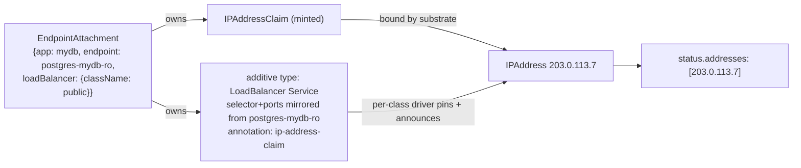

# Managed-application endpoints and `EndpointAttachment`: attaching external addresses to applications

- **Title:** `Managed-application endpoints and EndpointAttachment: attaching external addresses to applications`
- **Author(s):** `@lllamnyp`
- **Date:** `2026-07-27`
- **Status:** Draft

## Overview

A Cozystack managed application is reachable through the Services its operator already creates — Postgres has a `-rw` primary Service and a `-ro` replica Service, a managed Kubernetes cluster has an API Service, Redis has a master Service. These are the application's **endpoints**: named places a client can connect. Today the only way to publish one of them outside the cluster is the chart-level boolean `external: true|false`, which publishes exactly one chart-chosen endpoint, on exactly one address, from no particular pool, by five structurally different render mechanisms across fourteen charts.

This proposal adds **`EndpointAttachment`** (`cozystack.io/v1alpha1`, namespaced): a tenant-created resource that attaches an external address to one endpoint of one application instance. It is the AWS elastic-network-attachment shape applied to managed applications: an application has endpoints; a tenant attaches as many addresses to them as they need, each with an independent lifecycle, without ever touching the application's own Services or values. Each attachment renders one additive `type: LoadBalancer` Service and draws its address through the IP-address-management substrate (`IPAddressClass` / `IPAddressClaim` / `IPAddress`, community #35) — either minting a fresh claim or binding a pre-reserved, held address. Deleting the application garbage-collects its attachments; deleting an attachment never disturbs the application.

An **endpoint is a concept, not a resource**: for this proposal it is simply a tenant-facing Service of the application, as already enumerated by `ApplicationDefinition.spec.services` and stamped with lineage labels by the existing mutating webhook. No new metadata surface is introduced; a richer named-endpoint vocabulary is sketched as future work.

`external: true` keeps working unchanged, and its sunset is explicitly gated on an address-preserving migration path.

## Scope and related proposals

- **Builds on** community #35 (IP addresses as a first-class resource) and its implementation, the address-controller (API group `local.sdn.cozystack.io/v1alpha1`). That proposal is the **allocation half**: what an address *is* — held, moved, quota'd, enumerated. This proposal is the **exposure half**: what an address is attached *to*. The two meet at exactly one point: an attachment either names an existing `IPAddressClaim` or mints one, and consumes it via the substrate's Service annotation contract (`local.sdn.cozystack.io/ip-address-claim`). The per-class drivers own everything below that annotation — pinning, announcement, association tracking.
- **Succeeds** community #29 (structured, additive external exposure), closed in favor of the #35 direction. #29 established the goals this proposal inherits — additive multi-endpoint exposure, per-listener selection, never mutating the in-cluster baseline — but anchored them to a chart-values field whose central mechanism ("the chart renders one additive LoadBalancer Service per target") its review showed to be false for most engines, and it left the discovery-engine address write-back loop without an owner. This proposal answers both structurally: the mechanism is a controller that needs no per-engine render knowledge, and the discovery loop has a natural future owner (see *Deferred engines*).
- **Aware of** cozystack #3218, which removed `ExposureClass`/`ServiceExposure` (`network.cozystack.io`) as redundant wrappers around chart-owned Services. *Alternatives considered* explains why `EndpointAttachment` is not that mistake repeated.
- **References** `SecurityGroup` (#2922) for source-IP ACL — attachment publishes, it does not authorize connections — and the unified-TLS effort (community #19, cozystack #2811) for everything hostname/SAN/DNS-shaped, which is a non-goal here.
- **Forward-compatible with** Gateway API: the attachment's mechanism field is a discriminated union with `loadBalancer` as its only member today, so a `gateway` member can be added without an API break.

## Context

### What exists today

**The endpoints already exist.** Every managed application's operator or chart creates in-cluster Services with stable, role-bearing names: CloudNativePG's `<app>-rw` / `-ro` / `-r`, mariadb-operator's `<app>-primary` / `-secondary` (when replicated), Percona's `<app>-rs0` / `<app>-mongos`, spotahome's `rfrm-<app>` master / `rfrs-<app>` replicas, Strimzi's `<app>-kafka-bootstrap`, Kamaji's `kubernetes-<name>` API Service on 6443. Each kind's `ApplicationDefinition.spec.services` already enumerates which of these are tenant-facing, and the lineage mutating webhook stamps them with `apps.cozystack.io/application.{group,kind,name}` labels — a live, machine-readable record of "this Service is an endpoint of that application".

**The address substrate exists.** The address-controller provides `IPAddressClass` (admin, per pool), `IPAddress` (cluster-scoped inventory), and `IPAddressClaim` (the namespaced tenant API). A claim survives the workload it was attached to; consumption is one annotation on a LoadBalancer Service, translated by per-class drivers into the backend's pin mechanism. The substrate deliberately stops there: it never creates Services and never decides what an address is *for*.

**The bridge between them is `external: true|false`** — and it is the weakest piece of the platform's networking surface:

- Fourteen charts carry the boolean; it renders through **five different mechanisms** (a chart-owned extra LB Service; an in-place ClusterIP↔LoadBalancer type flip; an operator-CR field poke with a different field path per operator; a Strimzi listener; and two charts where it is not even the LoadBalancer gate).
- The in-place type flip is unsafe — Kubernetes rejects some Service type transitions — and only one chart (vm-instance) guards it with a delete-and-recreate hook; two others carry the same latent flip unguarded.
- It publishes **one** endpoint per application. Postgres `external: true` publishes the primary; there is no way to publish the read replicas, or the primary on two addresses, or anything from a chosen pool.
- There is **no address-selection surface at all**: no `loadBalancerClass`, no pool choice, no way to use a reserved address. Turning `external` off and on may change the address a customer has allow-listed.
- The boolean moonlights as the TLS default, the cert-SAN gate, and the dashboard-RBAC gate in various charts — four concerns behind one bit, differently per chart.
- Every exposure change is a Helm upgrade of the whole release.

### The problem

A tenant cannot say: *"attach a public address to my Postgres replicas"*, or *"attach this specific address I reserved last month to my new database's primary"*, or *"give this application a second address from the partner-facing pool, and take it away next week without redeploying anything"*. The endpoints exist; the addresses exist as resources; nothing connects one to the other.

## Goals

- A tenant can attach an external address to any tenant-facing Service of a managed application — as many attachments per application as they want, each with an independent lifecycle.
- Attaching and detaching never mutates the application's own Services, values, or Helm release. No type flips, no upgrade round-trips.
- An attachment can mint a fresh address from a named (or default) `IPAddressClass`, or bind a pre-reserved, held `IPAddressClaim` — the elastic-IP attach/detach experience.
- A dynamically minted address dies with its attachment; a pre-reserved address always survives detachment.
- Deleting the application garbage-collects its attachments and everything they own.
- One mechanism for every engine, with no per-chart render logic and no chart schema changes.
- `external: true|false` keeps its exact observable behavior until an address-preserving migration exists.

### Non-goals

- **Hostnames, DNS publication, certificates, SANs.** Owned by the unified-TLS effort (community #19, cozystack #2811). An attachment reports an address; making that address verifiable-by-name is out of scope.
- **In-cluster (ClusterIP) exposure.** The endpoints already are ClusterIP Services; there is nothing to add.
- **Source-IP ACL.** `SecurityGroup` (#2922) owns who may connect; attachment owns only that something is published.
- **The discovery-engine write-back loop.** Engines that advertise peer addresses in-protocol (Kafka, MongoDB replica sets, NATS) need the allocated address written back into engine configuration. Deferred, stated plainly in *Deferred engines* — not silently broken.
- **Gateway API attachment.** A future union member, not designed here.
- **Whole-IP / cozy-proxy 1:1 NAT for VMs.** vm-instance's existing `externalMethod` contract stays as-is; folding it into the union is future work.
- **Address allocation mechanics.** Entirely the substrate's (#35).

## Design

### The resource

```yaml
apiVersion: cozystack.io/v1alpha1
kind: EndpointAttachment
metadata:
  name: mydb-replicas-public
  namespace: tenant-a
spec:
  applicationRef:            # immutable; the application, in this namespace
    kind: Postgres
    name: mydb
  endpoint:
    serviceName: postgres-mydb-ro     # a tenant-facing Service of that application
  loadBalancer:              # mechanism union: exactly one member; loadBalancer is the only member today
    className: public        # mint a claim from this IPAddressClass (omit => default class)
    # claimName: held-ip     # ...or bind a pre-reserved IPAddressClaim instead (mutually exclusive with className)
status:
  phase: Attached            # Pending | Attached | Detached
  serviceName: mydb-replicas-public-x7ktq    # the rendered LoadBalancer Service (generateName)
  addresses:
    - "203.0.113.7"
  conditions:
    - type: Resolved         # applicationRef + endpoint resolve to a live, lineage-labeled Service
    - type: Provisioned      # claim bound, LB Service has its address
```

`spec.applicationRef` is immutable (CEL); retargeting is delete-and-recreate. `spec.endpoint.serviceName` is required — a struct rather than a bare string so that a future named-endpoint vocabulary (`endpoint: {name: ro}`) can join it as an alternative member. Within `loadBalancer`, `className` and `claimName` are mutually exclusive (CEL); both absent means "mint from the default class". An optional `family` (`IPv4|IPv6|Dual`, defaulting per the substrate) passes through to a minted claim.

### What the controller does

One controller, engine-agnostic, reconciling four things per attachment:

1. **Resolve.** Look up `spec.endpoint.serviceName` in the attachment's namespace and require that the Service carries lineage labels matching `spec.applicationRef` (`apps.cozystack.io/application.kind` and `.name`, stamped today by the lineage webhook from `ApplicationDefinition.spec.services`). This is the authorization seam: a tenant can attach only to Services the platform has already marked as tenant-facing endpoints of that application, never to arbitrary or foreign Services. Failure → `Resolved=False` with a reason; the attachment waits. Validation is by condition, not admission, because the Service set is dynamic (a mariadb `-secondary` Service exists only while `replicas > 1`) — eventual consistency, not admission-time races.
2. **Claim.** With `className` (or neither field): create an `IPAddressClaim` owned by the attachment — it is garbage-collected with the attachment, and the address then follows its class's reclaim policy. With `claimName`: reference the existing claim in the same namespace, owning nothing — detaching leaves the address held. This is the elastic-IP distinction: minted addresses are ephemeral conveniences, reserved addresses are durable property.
3. **Render.** Create one additive `type: LoadBalancer` Service via `generateName` (prefixed with the attachment's name), owned by the attachment and found again through an ownership label — never by name, so an attachment name can never collide with an existing Service. The Service **copies the selector and ports of the resolved endpoint Service** and stays in sync with them; this is what makes the mechanism engine-agnostic, and it is the structural answer to why #29's chart-side mechanism could not work: the controller does not need to know how CloudNativePG or mariadb-operator label their pods, it only needs to mirror the Service they already maintain. The Service carries the substrate's consumption annotation `local.sdn.cozystack.io/ip-address-claim: <claim>`; the per-class driver does the rest (pin, announce, associate). `externalTrafficPolicy: Local` and node-port allocation follow the platform's existing conventions.
4. **Report.** `status.addresses` mirrors the claim's bound addresses; `status.serviceName` names the rendered Service; conditions say why anything is missing. Nothing is fabricated client-side.



### Lifecycle and garbage collection

- **Application deleted** → the controller has stamped each attachment with an `ownerReference` to the application's HelmRelease (same namespace), so native garbage collection deletes the attachments, which deletes their rendered Services and any minted claims. Reserved claims (`claimName`) survive by construction. Orphaned attachments cannot accumulate.
- **Attachment deleted** → its Service and minted claim go with it; the application is untouched; a referenced pre-reserved claim is untouched and its address stays held.
- **Endpoint Service disappears** (e.g. mariadb scaled from 3 replicas to 1, removing `-secondary`) → the attachment **persists** with `Resolved=False`; the rendered LB Service is torn down; a minted claim is **kept**, so the address survives a scale-down bounce and reattaches when the endpoint returns. Temporary absence is a condition, not a deletion — only application deletion garbage-collects.
- **Claim already serving another attachment or Service** → the substrate's one-claim-one-workload rule applies; the attachment reports `Provisioned=False` rather than fighting for the address.

### What this replaces, and coexistence with `external`

`EndpointAttachment` subsumes what `external: true` does (publish one endpoint on one address) and everything it cannot (choose the endpoint, choose the pool, use a reserved address, attach N addresses, detach without a Helm upgrade).

The boolean nevertheless **keeps its exact legacy behavior, untouched, in every chart**. Rewriting the five legacy render paths in place would change Service identity and therefore change addresses under existing users — the precise failure this proposal exists to end. Coexistence is safe because attachments are purely additive: they never touch the Services the legacy paths render. The deprecation sequence is:

1. `EndpointAttachment` ships; `external` is documented as legacy; new exposure needs are met with attachments.
2. An address-preserving migration lands: the legacy Service's address is imported into the substrate (an `IPAddress` with a claim, per #35's adoption path), an equivalent attachment binding that claim is created, and only then is the legacy Service released. Address identity survives.
3. After a deprecation window, `external` is removed from chart schemas with a validation error pointing at attachments.

Step 2 is deliberately a gate, not a date: `external` does not sunset until migration preserves addresses.

### Deferred engines

The attachment publishes the **L4 reachability of a Service**. That is sufficient for passthrough engines — the client connects to the address and speaks the protocol (Postgres, MariaDB, Redis master, MongoDB `mongos`, OpenSearch, the initial MVP set). Two engine families need more, and are explicitly deferred rather than silently broken:

- **Discovery engines** (Kafka, MongoDB replica sets, NATS): the protocol hands clients *other* addresses (advertised listeners, `rs.conf` members, `connect_urls`), so an attachment's address must be written back into engine configuration and pods rolled. This loop is per-engine, is owned today by each operator's own external-exposure support, and is exactly the work item #29's review identified as ownerless. The attachment controller is the natural future owner (it knows the allocated address and the application), but designing per-engine write-back is out of scope here. Until then, documentation states plainly that attaching to a discovery engine's Services does not yield a working external endpoint.
- **Managed Kubernetes API**: reachable at L4 through an attachment, but the API server's certificate must include the new address in its SANs — a post-allocation write-back with in-tree precedent (the talos-reconcile job already re-patches certSANs with the live ClusterIP). A phase-2 item.

### Future work (non-binding sketches)

- **A named endpoint vocabulary.** Today an endpoint is identified by its Service name. A cleaner future shape is a small endpoint-declaration object **templated by the application chart at deploy time** — the chart knows at render time which endpoints exist (solving conditional endpoints like mariadb's replica-count-dependent `-secondary` naturally) and can name them (`ro`, `rw`, `api`) with default markers. `spec.endpoint` is a struct precisely so `{name: ro}` can be added beside `{serviceName: ...}` without a break.
- **Gateway API** as a second union member beside `loadBalancer`, attaching an address to a tenant Gateway listener instead of rendering a Service.
- **Surfacing endpoints in application status.** Deliberately not done now: application reads are projections over HelmReleases, and each cross-object lookup added to that projection makes single reads and List operations worse. If applications gain real storage, endpoint surfacing belongs there.

## User-facing changes

- Tenants gain one kind, `EndpointAttachment`: create it naming an application, one of its Services, and (optionally) an address class or a held claim; read the address from `status.addresses`. RBAC for the kind ships with the tenant namespace.
- Nothing changes for any existing application, chart value, or `external` user.
- Admins gain nothing to configure beyond what #35 already gives them (classes and pools); attachments are quotable with a stock `ResourceQuota` (`count/endpointattachments.cozystack.io`), though the scarce resource — addresses — is already bounded at the claim.

## Upgrade and rollback compatibility

Purely additive: a new CRD and a new controller; no chart schema changes, no mutation of existing objects. Rollback is deleting the controller and CRD — rendered Services and minted claims are owned by attachments and are removed with them; pre-reserved claims and everything `external`-rendered are untouched.

## Security

- **The lineage-label check is the authorization boundary for what may be exposed.** A tenant can attach only to Services in their own namespace that the platform's lineage webhook has labeled as tenant-facing endpoints of the named application. Attaching to unlabeled, system, or foreign Services fails `Resolved`. All references (`applicationRef`, `serviceName`, `claimName`) are same-namespace by construction.
- **Who may expose to which pool** is the substrate's question: `IPAddressClass` selection, claim quota, and the admission posture against raw pin annotations are #35's surface, consumed here unchanged. This proposal adds no new path to an address that the substrate does not already govern.
- **Who may connect** is `SecurityGroup`'s question (#2922). As with #29, publication carries no default-deny; the deny posture belongs to the ACL layer and its orchestrator, stated here so nobody assumes otherwise.
- The controller writes only objects it owns (the rendered Service, minted claims) plus ownerReferences on attachments; it never modifies application Services, so a compromised or buggy attachment path cannot corrupt in-cluster connectivity.

## Failure and edge cases

- **Unknown application or Service, or lineage labels missing/mismatched** → `Resolved=False` with reason; retried (eventual consistency with app deployment ordering — an attachment created seconds before its application resolves once the Service appears).
- **Class exhausted / claim never binds** → `Provisioned=False`, mirroring the claim's `Pending`; the LB Service exists but waits, exactly like any LoadBalancer without capacity.
- **Referenced claim already associated elsewhere** → `Provisioned=False`, substrate's 1:1 rule reported, no fighting.
- **Endpoint Service deleted** → LB Service torn down, minted claim retained, `Resolved=False`; reattaches on return (see *Lifecycle*).
- **Endpoint Service's selector/ports change** → mirrored on the next reconcile; the attachment follows the endpoint.
- **Attachment deleted mid-provisioning** → owned objects garbage-collect; a half-bound minted claim is deleted and its address follows class reclaim policy.
- **Two attachments, same endpoint, different classes** → both work; that is the point (one endpoint, N addresses).
- **`claimName` and `className` both set** → rejected by CEL at admission (the one shape error that is static).

## Testing

- **Unit (controller):** resolve/deny matrix over lineage labels; selector+port mirroring incl. drift; claim mint-vs-reference ownership; condition transitions; GC wiring (ownerReferences on attachment, Service, minted claim).
- **e2e (postgres, the flagship):** create app → attach `-ro` with a minted claim → external client reads from a replica on the reported address → delete attachment → address released. Then: reserve a claim → attach `-rw` with `claimName` → delete attachment → **claim still holds the address** → reattach to a different application's endpoint → same address serves the new target. That second sequence is this proposal's contract in one test.
- **e2e (mariadb):** attach `-secondary`, scale replicas 3→1 → `Resolved=False`, LB gone, claim kept; scale back → endpoint reattaches with the same address.
- **GC:** delete the application → attachments, rendered Services, minted claims all gone; referenced reserved claim survives.
- **Coexistence:** `external: true` app with an attachment alongside — legacy Service byte-identical to pre-attachment state.

## Rollout

1. CRD + controller + postgres and mariadb e2e; documentation marking `external` as legacy and the discovery-engine limitation.
2. Confirm `ApplicationDefinition.spec.services` coverage per kind (it is the endpoint enumeration); extend where kinds under-declare.
3. Address-preserving migration tooling (substrate adoption path + attachment synthesis); begin `external` deprecation window only after it lands.
4. Phase 2 candidates, each its own design: kubernetes-API certSAN write-back, discovery-engine write-back, Gateway union member, named endpoint vocabulary.

## Open questions

1. **Port subsetting.** An attachment currently mirrors all ports of the endpoint Service. Is a `ports` filter (publish 5432 but not metrics) worth having in v1, or does it invite divergence from the endpoint definition?
2. **Family/dual-stack surface.** Pass `family` through to minted claims only, or also validate it against a referenced claim's family at resolve time?
3. **Attachment identity in the dashboard.** Attachments are the user-visible record of "how is my app reachable" — does the dashboard list them per application via a label, and should the controller stamp `apps.cozystack.io/application.*` lineage labels on attachments themselves for symmetry?

## Alternatives considered

**A chart-values `expose: []` field (community #29's shape).** Rejected twice over. Structurally: its mechanism required each chart to render the exposure, which #29's review showed impossible uniformly (most engines' Services are operator-owned, and charts cannot read allocation results back). Ergonomically: it duplicates the same field and schema across every application chart, and every attach/detach is a Helm upgrade of the release. The controller-plus-Service-mirroring mechanism needs neither.

**Extending `ApplicationDefinition` with a templated endpoint catalogue.** Considered as the declaration surface (`spec.endpoints[]` with Go-template Service names beside the existing `spec.services`). Rejected for now: it grows a template-string pattern already regarded as awkward, and a static catalogue over-declares conditional endpoints (mariadb's `-secondary`, everything gated on options). The existing `spec.services` + lineage labels already enumerate tenant-facing Services live and exactly; a richer vocabulary is future work via chart-templated declarations, which get conditionality for free.

**Reviving `ServiceExposure` (removed in cozystack #3218).** That removal was correct for what `ServiceExposure` was: a wrapper that told a chart-owned Service to be `type: LoadBalancer`, redundant with the native field. `EndpointAttachment` is not a wrapper over one Service's type: it is an N-per-application attachment with independent lifecycle, claim integration (hold/move semantics that native `loadBalancerClass` cannot express), an authorization seam over which Services may be published, and additivity that never mutates the application's objects. None of that reduces to a field on an existing Service.

**Naming the rendered Service after the attachment.** Rejected for UX: a tenant naturally names an attachment after the Service it publishes (`postgres-mydb-ro`), which would then collide with the Service itself. `generateName` + ownership labels remove the collision class entirely.

**Attachment owns the endpoint Service's lifecycle (ownerRef on the Service).** Rejected: a scale-down that removes an endpoint Service would silently destroy the attachment and release a minted address — a destructive outcome from a routine operation. Absence is a condition; only application deletion collects.

**Doing nothing.** The boolean's five render paths, the unguarded type flips, the one-endpoint-one-address ceiling, and the absence of any address-selection surface remain; the substrate (#35) stays a reservation system with nothing to attach reservations to.

---

<!--
Inspired by KubeVirt enhancement proposals
(https://github.com/kubevirt/enhancements) and Kubernetes Enhancement
Proposals (KEPs).
-->
