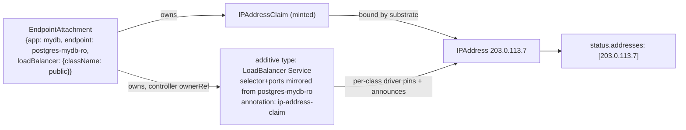

# Managed-application endpoints and `EndpointAttachment`: attaching external addresses to applications

- **Title:** `Managed-application endpoints and EndpointAttachment: attaching external addresses to applications`
- **Author(s):** `@lllamnyp`
- **Date:** `2026-07-27`
- **Status:** Draft

## Overview

A Cozystack managed application is reachable through the Services its operator already creates — Postgres has a `-rw` primary Service and a `-ro` replica Service, a managed Kubernetes cluster has an API Service, Redis has a master Service, a virtual machine has its one Service. These are the application's **endpoints**: named places a client can connect. Today the only way to publish one of them outside the cluster is the chart-level boolean `external: true|false`, which publishes exactly one chart-chosen endpoint, on exactly one address, from no particular pool, by five structurally different render mechanisms across fourteen charts.

This proposal adds **`EndpointAttachment`** (`cozystack.io/v1alpha1`, namespaced): a tenant-created resource that attaches an external address to one endpoint of one application instance. It is the AWS elastic-network-attachment shape applied to managed applications: an application has endpoints; a tenant attaches as many addresses to them as they need, each with an independent lifecycle, without ever touching the application's own Services or values. Each attachment renders one additive `type: LoadBalancer` Service and draws its address through the IP-address-management substrate (`IPAddressClass` / `IPAddressClaim` / `IPAddress`, community #35) — either minting a fresh claim or binding a pre-reserved, held address. Deleting the application garbage-collects its attachments; deleting an attachment never disturbs the application. Two consumer families are in scope from the start: managed databases (attach an address to the `-ro` replicas) and virtual machines (attach one or more public addresses to a VM, whole-IP 1:1 NAT included).

For managed databases, the platform's accepted general answer to external exposure is SNI consolidation onto the tenant Gateway's single address (external-database-exposure, community #20); an attachment is the deliberate **dedicated-address** path beside it, and *Where this sits beside SNI consolidation* draws the boundary.

An **endpoint is a concept, not a resource**: for this proposal it is simply a tenant-facing Service of the application — one carrying the lineage identity labels stamped on every managed object *and* the tenant-facing marker (`internal.cozystack.io/tenantresource: "true"`) that `ApplicationDefinition.spec.services` selects. No new metadata surface is introduced; a richer named-endpoint vocabulary is sketched as future work.

`external: true` keeps working unchanged, and its sunset is explicitly gated on an address-preserving migration path.

## Scope and related proposals

- **Builds on** community #35 (IP addresses as a first-class resource) and its implementation, the address-controller (API group `local.sdn.cozystack.io/v1alpha1`). That proposal is the **allocation half**: what an address *is* — held, moved, quota'd, enumerated. This proposal is the **exposure half**: what an address is attached *to*. The two meet at exactly one point: an attachment either names an existing `IPAddressClaim` or mints one, and consumes it via the substrate's Service annotation contract (`local.sdn.cozystack.io/ip-address-claim`). The per-class drivers own everything below that annotation — pinning, announcement, association tracking. The attachment model stays inside #35's settled cardinality rule: N addresses on one application are N attachments, each rendering its own Service consuming its own claim — several Services each with one claim, which #35 blesses — never several claims on one Service.
- **Coexists with** community #20 (external database exposure via Gateway API TLS-passthrough, **Accepted**). #20 collapses a tenant's fitting databases — same-engine instances included — onto the tenant Gateway's single LoadBalancer address, routed by SNI. This proposal supplies the dedicated addresses #20 structurally cannot, and inherits from #20 the tenant-facing-trigger obligation #20 left to #29. See *Where this sits beside SNI consolidation*.
- **Succeeds** community #29 (structured, additive external exposure), closed in favor of the #35 direction. #29 established the goals this proposal inherits — additive multi-endpoint exposure, per-listener selection, never mutating the in-cluster baseline — but anchored them to a chart-values field whose central mechanism ("the chart renders one additive LoadBalancer Service per target") its review showed to be false for most engines, and it left the discovery-engine address write-back loop without an owner. This proposal answers both structurally: the mechanism is a controller that needs no per-engine render knowledge, and the discovery loop has a natural future owner (see *Deferred engines*).
- **Aware of** cozystack #3218, which removed `ExposureClass`/`ServiceExposure` (`network.cozystack.io`) as redundant wrappers around chart-owned Services. *Alternatives considered* explains why `EndpointAttachment` is not that mistake repeated.
- **References** `SecurityGroup` (#2922) for source-IP ACL — attachment publishes, it does not authorize connections — and the unified-TLS effort (community #19, cozystack #2811) for the PKI half of the hostname story (for databases, the SNI hostname scheme itself is #20's, already decided).
- **Forward-compatible with** Gateway API by construction: the attachment's mechanism field is a discriminated union with `loadBalancer` as its only member today, and the `gateway` member is reserved for the #20 trigger (see *Where this sits beside SNI consolidation*).

## Context

### What exists today

**The endpoints already exist.** Every managed application's operator or chart creates in-cluster Services with stable, role-bearing names: CloudNativePG's `<app>-rw` / `-ro` / `-r`, mariadb-operator's `<app>-primary` / `-secondary` (when replicated), Percona's `<app>-rs0` / `<app>-mongos`, spotahome's `rfrm-<app>` master / `rfrs-<app>` replicas, Strimzi's `<app>-kafka-bootstrap`, Kamaji's `kubernetes-<name>` API Service on 6443, vm-instance's single Service (headless with a sentinel port until exposed). Each kind's `ApplicationDefinition.spec.services` already selects which of these are tenant-facing, and the lineage mutating webhook stamps two label families: the identity labels `apps.cozystack.io/application.{group,kind,name}` on **every** object resolving to a managed HelmRelease, and the tenant-facing marker `internal.cozystack.io/tenantresource: "true"` on exactly the Services `spec.services` matches — together a live, machine-readable record of "this Service is a tenant-facing endpoint of that application".

**The address substrate exists.** The address-controller provides `IPAddressClass` (admin, per pool), `IPAddress` (cluster-scoped inventory), and `IPAddressClaim` (the namespaced tenant API). A claim survives the workload it was attached to; consumption is one annotation on a LoadBalancer Service, translated by per-class drivers into the backend's pin mechanism. The substrate deliberately stops there: it never creates Services and never decides what an address is *for*.

**The bridge between them is `external: true|false`** — and it is the weakest piece of the platform's networking surface:

- Fourteen charts carry the boolean; it renders through **five different mechanisms** (a chart-owned extra LB Service; an in-place ClusterIP↔LoadBalancer type flip; an operator-CR field poke with a different field path per operator; a Strimzi listener; and two charts where it is not even the LoadBalancer gate).
- The in-place type flip is unsafe — Kubernetes rejects some Service type transitions — and only one chart (vm-instance) guards it with a delete-and-recreate hook; two others carry the same latent flip unguarded.
- It publishes **one** endpoint per application. Postgres `external: true` publishes the primary; there is no way to publish the read replicas, or the primary on two addresses, or anything from a chosen pool. A VM gets exactly one external address, ever.
- There is **no address-selection surface at all**: no `loadBalancerClass`, no pool choice, no way to use a reserved address. Turning `external` off and on may change the address a customer has allow-listed.
- The boolean moonlights as the TLS default, the cert-SAN gate, and the dashboard-RBAC gate in various charts — four concerns behind one bit, differently per chart.
- Every exposure change is a Helm upgrade of the whole release.

### The problem

A tenant cannot say: *"attach a public address to my Postgres replicas"*, or *"attach this specific address I reserved last month to my new database's primary"*, or *"give this VM a second public address"*, or *"give this application an address from the partner-facing pool, and take it away next week without redeploying anything"*. The endpoints exist; the addresses exist as resources; nothing connects one to the other.

## Goals

- A tenant can attach an external address to any tenant-facing Service of a managed application — as many attachments per application as they want, each with an independent lifecycle.
- A tenant can attach one or more public addresses to a virtual machine, including whole-IP (1:1 NAT) semantics — the live requirement the single legacy toggle cannot express.
- Attaching and detaching never mutates the application's own Services, values, or Helm release. No type flips, no upgrade round-trips.
- An attachment can mint a fresh address from a named (or default) `IPAddressClass`, or bind a pre-reserved, held `IPAddressClaim` — the elastic-IP attach/detach experience.
- A dynamically minted address dies with its attachment; a pre-reserved address always survives detachment.
- An attachment's address identity can never change under a live attachment: the fields that select the address are immutable.
- Deleting the application garbage-collects its attachments and everything they own.
- One mechanism for every engine, with no per-chart render logic and no chart schema changes.
- `external: true|false` keeps its exact observable behavior until an address-preserving migration exists.

### Non-goals

- **Hostnames, DNS publication, certificates, SANs.** The PKI half is owned by the unified-TLS effort (community #19, cozystack #2811). For managed databases the naming half — the SNI hostname scheme and the end-to-end TLS story — is already settled by #20 and is inherited by the future `gateway` member, not re-decided here. The `loadBalancer` member reports an address; making it verifiable-by-name is out of scope.
- **Designing the `gateway` union member.** Its Gateway-side mechanics are already specified by #20 (shared per-engine passthrough listeners, per-release `TLSRoute`s); wiring the attachment as #20's tenant-facing trigger is a phase-2 *Rollout* item with a named owner, not part of this MVP. Until it ships, no tenant-facing trigger for SNI exposure exists — a knowingly accepted gap, stated in *Where this sits beside SNI consolidation*.
- **In-cluster (ClusterIP) exposure.** The endpoints already are ClusterIP Services; there is nothing to add.
- **Source-IP ACL.** `SecurityGroup` (#2922) owns who may connect; attachment owns only that something is published. The per-address ACL granularity question is stated honestly in *Security*.
- **The discovery-engine write-back loop.** Engines that advertise peer addresses in-protocol (Kafka, MongoDB replica sets, NATS) need the allocated address written back into engine configuration. Deferred, stated plainly in *Deferred engines* — not silently broken.
- **An egress model for several whole-IP addresses on one VM.** Whole-IP today means both "all ports in" and "the VM egresses **as** this address"; with two whole-IP attachments the egress identity is ambiguous. v1 enforces at-most-one whole-IP Service per application (see *Design*); relaxing that needs an egress-selection model and is this proposal's one open question. It is the same case #35 defers as *several owned addresses on one consumer*.
- **Address allocation mechanics.** Entirely the substrate's (#35).

## Design

### The resource

```yaml
apiVersion: cozystack.io/v1alpha1
kind: EndpointAttachment
metadata:
  name: mydb-replicas-public
  namespace: tenant-a
spec:
  applicationRef:            # immutable; the application, in this namespace
    group: apps.cozystack.io # optional; defaults to apps.cozystack.io
    kind: Postgres
    name: mydb
  endpoint:
    serviceName: postgres-mydb-ro     # a tenant-facing Service of that application
  loadBalancer:              # mechanism union: exactly one member; loadBalancer is the only member today
    className: public        # mint a claim from this IPAddressClass (omit => default class)
    # claimName: held-ip     # ...or bind a pre-reserved IPAddressClaim instead (mutually exclusive with className)
    # family: IPv4           # IPv4 | IPv6 | Dual; passed to a minted claim, validated against a referenced one
    # ports: [5432]          # optional subset of the endpoint's ports; the only port source when the
    #                        #   endpoint has nothing meaningful to mirror (a VM's sentinel-port Service)
    # method: WholeIP        # WholeIP | PortList — VM datapath modes rendering the cozy-proxy contract
    # allowICMP: true        # PortList only
status:
  phase: Attached            # Pending | Attached | Detached — a printed summary of the conditions
  serviceName: mydb-replicas-public-x7ktq    # the rendered LoadBalancer Service (generateName)
  addresses:
    - "203.0.113.7"
  conditions:                # standard metav1.Condition list: unique type, reason, message,
    - type: Resolved         #   lastTransitionTime, observedGeneration
    - type: Provisioned      # claim bound, LB Service has its address
```

`spec.applicationRef` carries the full identity triple — `group` (defaulting to `apps.cozystack.io`), `kind`, `name` — matching the three lineage labels the resolver compares; it is immutable (CEL), and retargeting is delete-and-recreate. `spec.endpoint` is a struct rather than a bare string so that a future named-endpoint vocabulary (`endpoint: {name: ro}`) can join `serviceName` as an alternative member; `serviceName` itself is a plain string and is required today. Within `loadBalancer`, `className` and `claimName` are mutually exclusive (CEL); both absent means "mint from the default class".

**The address-identity fields are immutable.** `spec.applicationRef` and the address-source fields of the union member — `className`, `claimName`, `family` — are frozen by CEL: any change to them could silently re-mint or release the address a customer has allow-listed, the exact failure named in *What exists today*. Changing the address source is delete-and-recreate of the attachment, and keeping an address across that is precisely what a pre-reserved claim is for. The remaining fields (`ports`, `method`, `allowICMP`) are render knobs: mutable, and structurally unable to change the address.

**`status.phase` is a projection, never independent state**: `Pending` (created, not yet both resolved and provisioned), `Attached` (`Resolved` and `Provisioned` both true), `Detached` (previously attached; the endpoint Service is currently absent, so `Resolved=False`, the rendered Service is torn down, and the claim is kept — see *Lifecycle*). Everything machine-readable lives in the conditions, which follow `metav1.Condition` semantics — one entry per type, replaced in place, with `lastTransitionTime` and `observedGeneration`.

### What the controller does

One controller, engine-agnostic, reconciling four things per attachment:

1. **Resolve.** Look up `spec.endpoint.serviceName` in the attachment's namespace and require both label families the platform already stamps: the lineage identity labels `apps.cozystack.io/application.{group,kind,name}` matching `spec.applicationRef` on all three fields, **and** the tenant-facing marker `internal.cozystack.io/tenantresource: "true"`. The lineage labels alone are not sufficient authorization — the webhook stamps them on *every* object resolving to a managed HelmRelease, operator-internal and headless Services included — while the marker is `"true"` exactly on the Services `ApplicationDefinition.spec.services` selects, the platform's actual declaration of "tenant-facing". This is the authorization seam: a tenant can attach only to Services the platform has marked as tenant-facing endpoints of that application, never to arbitrary, internal, or foreign Services. Failure → `Resolved=False` with a reason; the attachment waits. Validation is by condition, not admission, because the Service set is dynamic (a mariadb `-secondary` Service exists only while `replicas > 1`) — eventual consistency, not admission-time races.
2. **Claim.** With `className` (or neither field): create an `IPAddressClaim` owned by the attachment — it is garbage-collected with the attachment, and the address then follows its class's reclaim policy; `family` passes through. With `claimName`: reference the existing claim in the same namespace, owning nothing — detaching leaves the address held; a `family` that conflicts with the referenced claim's family → `Provisioned=False` with a reason. This is the elastic-IP distinction: minted addresses are ephemeral conveniences, reserved addresses are durable property.
3. **Render.** Create one additive `type: LoadBalancer` Service via `generateName` (prefixed with the attachment's name) — so an attachment name can never collide with an existing Service. **The controller owner reference is the Service's identity:** the controller sets itself as controller owner and rediscovers the Service by that reference on every reconcile; an ownership label is stamped for indexing and diagnostics but is never trusted for adoption, because labels are mutable and can collide — a Service whose controller owner reference does not point at the attachment's UID is ignored, never adopted or updated. The Service **mirrors the resolved endpoint Service**: the selector is always the endpoint's, kept in sync by watching the endpoint Service (event-driven, not polled); ports come from the member's `ports` when set (a subset filter, and the only source when the endpoint has nothing meaningful to mirror), otherwise from the endpoint. Mirroring is what makes the mechanism engine-agnostic, and it is the structural answer to why #29's chart-side mechanism could not work: the controller does not need to know how CloudNativePG or mariadb-operator label their pods, it only needs to mirror the Service they already maintain. **The mirroring contract assumes the operator expresses instance role as pod labels under a static Service selector** — CloudNativePG does (the `-rw` selector is static; the operator relabels pods on switchover), so the flagship case holds. An operator that instead rewrites the *Service selector* on failover leaves the mirror stale for one watch-driven reconcile, during which external write traffic can land on a demoted primary; *Rollout* therefore gates each engine's documentation on verifying its selector model. The Service carries the substrate's consumption annotation `local.sdn.cozystack.io/ip-address-claim: <claim>`, and the controller sets `spec.loadBalancerClass` at creation to the value the claim's resolved `IPAddressClass` fixes — per #35 §5 that check is refusal-only and the field is immutable, so the creator must be right at creation, and this controller can be, because it reads the class first. The per-class driver does the rest (pin, announce, associate). `externalTrafficPolicy: Local` and node-port allocation follow the platform's existing conventions.
4. **Report.** `status.addresses` mirrors the claim's bound addresses; `status.serviceName` names the rendered Service; conditions say why anything is missing. Nothing is fabricated client-side. The controller also stamps the application's lineage labels (`apps.cozystack.io/application.*`) onto the attachment itself, so dashboards and tooling list an application's attachments with the same selector that finds its other objects — an attachment is an application add-on, not an application, and its presentation is the dashboard's call.

**VM datapath modes.** A vm-instance's tenant-facing Service is headless with a single sentinel port (`65535`) until exposed, so there is nothing to mirror: a VM attachment must set `ports` or `method` in the `loadBalancer` member (neither → `Provisioned=False` with a reason). `method: WholeIP` renders the existing cozy-proxy contract — the `service.kubernetes.io/service-proxy-name: cozy-proxy` label, the `networking.cozystack.io/wholeIP: "true"` annotation, and the sentinel port when `ports` is absent. `method: PortList` renders the same label with `wholeIP: "false"`, `networking.cozystack.io/allowICMP` from `allowICMP`, and requires `ports`. These are byte-for-byte the objects vm-instance's chart renders under `externalMethod` today — the datapath already exists; only this render was missing, and the enum deliberately reuses the chart's `externalMethod` vocabulary. **v1 rule: at most one whole-IP Service per application**, counting a legacy `externalMethod: WholeIP` chart Service — whole-IP means both "all ports in" *and* "the VM egresses as this address", and two whole-IP Services on one VM have no defined egress winner. The controller refuses the second with `Provisioned=False` (cross-object state, so a condition, not admission). Relaxing this needs an egress-selection model — see *Open questions*.



### Lifecycle and garbage collection

- **Application deleted** → the controller has stamped each attachment with an `ownerReference` to the application's HelmRelease (same namespace), so native garbage collection deletes the attachments, which deletes their rendered Services and any minted claims. Reserved claims (`claimName`) survive by construction. Orphaned attachments cannot accumulate.
- **Identity across delete-and-recreate is by UID, deliberately.** Kubernetes GC matches owners by UID, so the `ownerReference` binds an attachment to one application *incarnation*: recreate the application under the same name and existing attachments are collected with the old HelmRelease rather than silently re-targeting the new one — closing the reuse-after-recreate hazard by construction. The platform has no path that delete-and-recreates a tenant application's HelmRelease (the delete-and-let-the-chart-recreate migrations touch system releases only); if one ever appears, it collects attachments and minted claims with the old incarnation — and pre-reserved claims survive even that, which is one more reason durable addresses belong in claims. No finalizer or name-based fallback is added: adopting a same-name successor by name would reintroduce exactly the reuse UID anchoring exists to prevent.
- **Attachment deleted** → its Service and minted claim go with it; the application is untouched; a referenced pre-reserved claim is untouched and its address stays held.
- **Endpoint Service disappears** (e.g. mariadb scaled from 3 replicas to 1, removing `-secondary`) → the attachment **persists** and goes `Detached` (`Resolved=False`); the rendered LB Service is torn down; a minted claim is **kept**, so the address survives a scale-down bounce and reattaches when the endpoint returns. Temporary absence is a condition, not a deletion — only application deletion garbage-collects.
- **Claim already serving another attachment or Service** → the substrate's one-claim-one-workload rule applies; the attachment reports `Provisioned=False` rather than fighting for the address.

### Where this sits beside SNI consolidation (community #20)

The accepted general answer to external *database* exposure is #20: any number of a tenant's fitting databases — same-engine instances included — collapse onto the tenant Gateway's single LoadBalancer address, SNI-routed on native ports, with end-to-end TLS from the operator-issued certificate. This proposal is not that answer's replacement, and must not be read as the general path for databases. The division of labor:

- **SNI consolidation is the default for the engines it fits** (Redis, direct-TLS PostgreSQL 17+, sharded `mongos`): one address per tenant, a stable hostname per database, zero per-database address cost.
- **A dedicated address — an attachment — is the deliberate exception**: the client allow-lists an IP; the client cannot emit SNI (pre-17 Postgres clients, `redis-cli` without `--sni`); the engine's wire protocol precludes SNI entirely (MariaDB, server-speaks-first — permanently outside #20); the endpoint is not a database at all (a VM, the managed-Kubernetes API); or the tenant needs an address they can hold and move (#35's reservation semantics, which a shared Gateway address by definition cannot give one database).
- **The two meet at the trigger, and the obligation is inherited.** #20 left its tenant-facing trigger to the structured-exposure model it expected from #29; this proposal succeeded #29, so the trigger surface lands here: the `gateway` union member *is* it — an attachment whose member selects the tenant Gateway renders a per-release `TLSRoute` onto #20's shared per-engine listener (mechanics in #20 §5, not re-designed here) instead of a LoadBalancer Service. Wiring it is a phase-2 *Rollout* item. Until it ships, a tenant cannot request SNI exposure at all — this sequencing accepts that gap knowingly rather than leaving the merged design's trigger unowned.
- **The `gateway` member cannot be purely additive, and this is expected.** SNI exposure requires the operator-issued certificate to carry the external hostname SANs (#20 §6) — chart/operator cooperation, gated per engine on the unified-TLS convergence #20 already depends on. The `loadBalancer` member carries no such dependency: it is additive against any passthrough-clean engine, TLS or not. One union, two members, two honesty levels — the additive one ships first.

### What this replaces, and coexistence with `external`

`EndpointAttachment` subsumes what `external: true` does (publish one endpoint on one address) and everything it cannot (choose the endpoint, choose the pool, use a reserved address, attach N addresses, detach without a Helm upgrade).

The boolean nevertheless **keeps its exact legacy behavior, untouched, in every chart**. Rewriting the five legacy render paths in place would change Service identity and therefore change addresses under existing users — the precise failure this proposal exists to end. Coexistence is safe because attachments are purely additive: they never touch the Services the legacy paths render. The deprecation sequence is:

1. `EndpointAttachment` ships; `external` is documented as legacy; new exposure needs are met with attachments.
2. An address-preserving migration lands: the legacy Service's address is imported into the substrate (an `IPAddress` with a claim, per #35's adoption path), an equivalent attachment binding that claim is created, and only then is the legacy Service released. Address identity survives.
3. After a deprecation window, `external` is removed from chart schemas with a validation error pointing at attachments — **per chart, gated on the union actually covering that chart's semantics**: database charts once the `loadBalancer` member covers them; vm-instance once the VM datapath modes ship; discovery engines not before their write-back has an owner. No chart loses its toggle while attachments have nothing equivalent to point at.

Step 2 is deliberately a gate, not a date: `external` does not sunset until migration preserves addresses.

### Deferred engines

The attachment publishes the **L4 reachability of a Service**. That is sufficient for passthrough engines — the client connects to the address and speaks the protocol (Postgres, MariaDB, Redis master, MongoDB `mongos`, OpenSearch, the initial MVP set). Two engine families need more, and are explicitly deferred rather than silently broken:

- **Discovery engines** (Kafka, MongoDB replica sets, NATS): the protocol hands clients *other* addresses (advertised listeners, `rs.conf` members, `connect_urls`), so an attachment's address must be written back into engine configuration and pods rolled. This loop is per-engine, is owned today by each operator's own external-exposure support, and is exactly the work item #29's review identified as ownerless. (#20 defers the same families for its SNI path — the advertised-address problem is mechanism-independent.) The attachment controller is the natural future owner (it knows the allocated address and the application), but designing per-engine write-back is out of scope here. Until then, documentation states plainly that attaching to a discovery engine's Services does not yield a working external endpoint.
- **Managed Kubernetes API**: reachable at L4 through an attachment, but the API server's certificate must include the new address in its SANs — a post-allocation write-back with in-tree precedent (the talos-reconcile job already re-patches certSANs with the live ClusterIP). A phase-2 item.

### Future work (non-binding sketches)

- **A named endpoint vocabulary.** Today an endpoint is identified by its Service name. A cleaner future shape is a small endpoint-declaration object **templated by the application chart at deploy time** — the chart knows at render time which endpoints exist (solving conditional endpoints like mariadb's replica-count-dependent `-secondary` naturally) and can name them (`ro`, `rw`, `api`) with default markers. `spec.endpoint` is a struct precisely so `{name: ro}` can be added beside `{serviceName: ...}` without a break.
- **The `gateway` union member** — no longer speculative: it is the tenant-facing trigger #20 waits on, with its Gateway-side mechanics already specified there (see *Where this sits beside SNI consolidation*). Listed as future work only because it is phase 2, not because its shape is unknown.
- **Surfacing endpoints in application status.** Deliberately not done now: application reads are projections over HelmReleases, and each cross-object lookup added to that projection makes single reads and List operations worse. If applications gain real storage, endpoint surfacing belongs there. Until then, the lineage labels stamped on attachments (*Design*, step 4) are the enumeration surface.

## User-facing changes

- Tenants gain one kind, `EndpointAttachment`: create it naming an application, one of its Services, and (optionally) an address class or a held claim; read the address from `status.addresses`. RBAC for the kind ships with the tenant namespace.
- Nothing changes for any existing application, chart value, or `external` user.
- Admins gain nothing to configure beyond what #35 already gives them (classes and pools); attachments are quotable with a stock `ResourceQuota` (`count/endpointattachments.cozystack.io`), though the scarce resource — addresses — is already bounded at the claim. The quota claim works precisely because `cozystack.io` kinds are CRD-served by the kube-apiserver, where ResourceQuota admission runs (the existing `count/certificates.cert-manager.io` pattern); an aggregated-API home like `sdn.cozystack.io` would silently drop stock quota support, so the group choice is load-bearing, not cosmetic, and a future move for group consistency must re-answer quota first.

## Upgrade and rollback compatibility

Purely additive: a new CRD and a new controller; no chart schema changes, no mutation of existing objects. Rollback is deleting the controller and CRD — rendered Services and minted claims are owned by attachments and are removed with them; pre-reserved claims and everything `external`-rendered are untouched.

## Security

- **The tenant-facing-endpoint check is the authorization boundary for what may be exposed.** A tenant can attach only to Services in their own namespace whose lineage identity labels match `spec.applicationRef` on group, kind, *and* name, and which carry `internal.cozystack.io/tenantresource: "true"`. The marker is the load-bearing half: lineage labels alone also cover operator-internal and headless Services, and admitting those to a public address would leak surfaces the platform never declared tenant-facing. Attaching to unlabeled, internal, system, or foreign Services fails `Resolved`. All references (`applicationRef`, `serviceName`, `claimName`) are same-namespace by construction.
- **Who may expose to which pool** is the substrate's question: `IPAddressClass` selection, claim quota, and the admission posture against raw pin annotations are #35's surface, consumed here unchanged. This proposal adds no new path to an address that the substrate does not already govern.
- **Who may connect** is `SecurityGroup`'s question (#2922). As with #29, publication carries no default-deny; the deny posture belongs to the ACL layer and its orchestrator, stated here so nobody assumes otherwise.
- **Per-address ACL is a recognized gap, not a promise.** `SecurityGroup` attaches rules per *application* — membership labels stamped on the application's pods — so two addresses on one VM today necessarily share one rule set; an attachment's `ports` narrows exposure but is port filtering, not source-IP ACL. The per-NIC model (each address carrying its own security groups) would need `SecurityGroup` to grow an attachment-scoped target. Attachments are deliberately shaped to be viable targets — namespaced, stably named, lineage-labeled — but until #2922's model grows one, consumers must assume application-level ACL granularity.
- The controller writes only objects it owns (the rendered Service, minted claims) plus ownerReferences and lineage labels on attachments; it never modifies application Services, so a compromised or buggy attachment path cannot corrupt in-cluster connectivity.

## Failure and edge cases

- **Unknown application or Service, lineage labels missing/mismatched, or the tenant-facing marker absent** → `Resolved=False` with reason; retried (eventual consistency with app deployment ordering — an attachment created seconds before its application resolves once the Service appears).
- **An address-identity field is mutated** (`applicationRef`, `className`, `claimName`, `family`) → rejected at admission by CEL; the address a client allow-listed cannot change under a live attachment.
- **Class exhausted / claim never binds** → `Provisioned=False`, mirroring the claim's `Pending`; the LB Service exists but waits, exactly like any LoadBalancer without capacity.
- **Referenced claim already associated elsewhere** → `Provisioned=False`, substrate's 1:1 rule reported, no fighting.
- **`family` conflicts with a referenced claim's family** → `Provisioned=False` with reason; nothing is rendered against the wrong family.
- **Endpoint Service deleted** → phase `Detached`: LB Service torn down, minted claim retained, `Resolved=False`; reattaches on return (see *Lifecycle*).
- **Endpoint Service's selector or ports change** → re-mirrored on the watch-driven reconcile. For operators that rewrite the Service selector on failover this window briefly points the mirror at a demoted primary — the mirroring-contract assumption in *Design*, verified per engine in *Rollout*.
- **Endpoint has only the sentinel port and neither `ports` nor `method` is set** (a VM) → `Provisioned=False` with reason; nothing meaningful exists to publish.
- **A second whole-IP Service for one application** (a second `method: WholeIP` attachment, or one beside a legacy `externalMethod: WholeIP` Service) → refused with `Provisioned=False`; the egress identity must stay unambiguous (see *Open questions*).
- **Attachment deleted mid-provisioning** → owned objects garbage-collect; a half-bound minted claim is deleted and its address follows class reclaim policy.
- **A Service carries the ownership label but not the attachment's controller ownerReference** → ignored; the controller creates (or rediscovers) the correctly owned Service instead of adopting a stale or tenant-created one.
- **Two attachments, same endpoint, different classes** → both work; that is the point (one endpoint, N addresses).
- **`claimName` and `className` both set** → rejected by CEL at admission (a shape error that is static).

## Testing

- **Unit (controller):** resolve/deny matrix over lineage labels × the tenantresource marker (all three identity fields compared; marker absent → deny); selector+port mirroring incl. drift and `ports` subsetting; claim mint-vs-reference ownership and family validation; condition/phase transitions incl. `Detached`; GC wiring (ownerReferences on attachment, Service, minted claim); Service identity (labeled-but-unowned Service ignored, never adopted); the at-most-one-whole-IP rule.
- **e2e (postgres, the flagship):** create app → attach `-ro` with a minted claim → external client reads from a replica on the reported address → delete attachment → address released. Then: reserve a claim → attach `-rw` with `claimName` → delete attachment → **claim still holds the address** → reattach to a different application's endpoint → same address serves the new target. That second sequence is this proposal's contract in one test.
- **e2e (mariadb):** attach `-secondary`, scale replicas 3→1 → `Detached`, LB gone, claim kept; scale back → endpoint reattaches with the same address.
- **e2e (vm-instance):** attach a second public address in `PortList` mode to a VM whose chart Service is already external → both addresses reachable on their ports; attach `method: WholeIP` to a VM with no legacy whole-IP Service → all-ports reachability via cozy-proxy; a second whole-IP attachment is refused.
- **GC:** delete the application → attachments, rendered Services, minted claims all gone; referenced reserved claim survives.
- **Coexistence:** `external: true` app with an attachment alongside — legacy Service byte-identical to pre-attachment state.

## Rollout

1. CRD + controller + postgres and mariadb e2e; documentation marking `external` as legacy and the discovery-engine limitation. Per-engine gate before an engine's exposure is documented: verify its operator keeps a static Service selector with pod-label roles (the mirroring contract) — CloudNativePG verified; each further engine checked, and any selector-rewriting operator documented with the failover-window caveat or held back.
2. VM datapath modes (`method: WholeIP|PortList`) with the vm-instance e2e — the second first-class consumer, and the proof the mechanism is not database-shaped.
3. Confirm `ApplicationDefinition.spec.services` coverage per kind (it is the endpoint enumeration); extend where kinds under-declare.
4. Address-preserving migration tooling (substrate adoption path + attachment synthesis); begin `external` deprecation window only after it lands.
5. Phase 2 candidates, each its own design: the `gateway` union member (mechanics per #20 §5 — the platform's missing SNI trigger, which should come early), kubernetes-API certSAN write-back, discovery-engine write-back, named endpoint vocabulary.

## Open questions

1. **The egress model for several whole-IP addresses on one VM.** v1 enforces at-most-one whole-IP Service per application, so the question is how to relax it: mark one attachment primary-for-egress; keep egress pinned to the application's own Service and make attachment whole-IPs ingress-only; or keep the at-most-one rule permanently. This is the datapath edge of #35's deferred *several owned addresses on one consumer* case and should be settled with cozy-proxy's owners before the restriction is lifted.

## Alternatives considered

**A chart-values `expose: []` field (community #29's shape).** Rejected twice over. Structurally: its mechanism required each chart to render the exposure, which #29's review showed impossible uniformly (most engines' Services are operator-owned, and charts cannot read allocation results back). Ergonomically: it duplicates the same field and schema across every application chart, and every attach/detach is a Helm upgrade of the release. The controller-plus-Service-mirroring mechanism needs neither.

**Relying wholly on SNI consolidation (community #20).** Rejected as the *only* path, never as the default: a shared Gateway address cannot be allow-listed per database, held, or moved; MariaDB can never be SNI-routed and pre-direct-TLS Postgres clients cannot be routed today; VMs and the managed-Kubernetes API are not SNI-shaped at all. #20 stays the default answer for the engines it fits; this proposal supplies the dedicated addresses #20 structurally cannot, and the trigger #20 is waiting for.

**Extending `ApplicationDefinition` with a templated endpoint catalogue.** Considered as the declaration surface (`spec.endpoints[]` with Go-template Service names beside the existing `spec.services`). Rejected for now: it grows a template-string pattern already regarded as awkward, and a static catalogue over-declares conditional endpoints (mariadb's `-secondary`, everything gated on options). The existing `spec.services` + the labels it feeds already enumerate tenant-facing Services live and exactly; a richer vocabulary is future work via chart-templated declarations, which get conditionality for free.

**Reviving `ServiceExposure` (removed in cozystack #3218).** That removal was correct for what `ServiceExposure` was: a wrapper that told a chart-owned Service to be `type: LoadBalancer`, redundant with the native field. `EndpointAttachment` is not a wrapper over one Service's type: it is an N-per-application attachment with independent lifecycle, claim integration (hold/move semantics that native `loadBalancerClass` cannot express), an authorization seam over which Services may be published, and additivity that never mutates the application's objects. None of that reduces to a field on an existing Service.

**Naming the rendered Service after the attachment.** Rejected for UX: a tenant naturally names an attachment after the Service it publishes (`postgres-mydb-ro`), which would then collide with the Service itself. `generateName` + the controller-ownerRef identity remove the collision class entirely.

**Attachment owns the endpoint Service's lifecycle (ownerRef on the Service).** Rejected: a scale-down that removes an endpoint Service would silently destroy the attachment and release a minted address — a destructive outcome from a routine operation. Absence is a condition (`Detached`); only application deletion collects.

**Doing nothing.** The boolean's five render paths, the unguarded type flips, the one-endpoint-one-address ceiling, and the absence of any address-selection surface remain; the substrate (#35) stays a reservation system with nothing to attach reservations to; and the merged #20 keeps waiting for a tenant-facing trigger that nothing else is positioned to provide.

---

<!--
Inspired by KubeVirt enhancement proposals
(https://github.com/kubevirt/enhancements) and Kubernetes Enhancement
Proposals (KEPs).
-->
