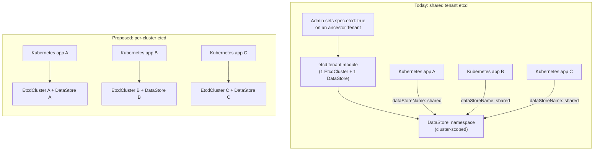

# Per-cluster etcd for tenant Kubernetes

- **Title:** `Per-cluster etcd: retire the tenant etcd module and bind etcd to the Kubernetes app`
- **Author(s):** `@myasnikovdaniil`
- **Date:** `2026-06-30`
- **Status:** Draft

## Overview

Today a tenant Kubernetes cluster does not own its datastore. etcd is a **tenant module** — an admin sets `spec.etcd: true` on a `Tenant`, which deploys one etcd cluster in that tenant's namespace and publishes a reference (`_namespace.etcd`) that is inherited down the whole tenant subtree. Every `Kubernetes` cluster created in that subtree points its Kamaji control plane at that **one shared etcd**. The result is two problems: a consumer who can only create a `Kubernetes` app cannot bring a cluster up until an admin has pre-provisioned etcd on an ancestor tenant (consumers cannot edit tenant parameters), and all clusters that do come up share a single etcd that was never meant to back more than one control plane.

This proposal **retires etcd as a tenant module and folds it into the `kubernetes` app**: each `Kubernetes` cluster provisions and owns its own etcd and its own Kamaji `DataStore`. The end state is **one etcd per one Kubernetes cluster**, etcd lifecycle bound to cluster lifecycle (delete the cluster → its etcd is gone), and no etcd running anywhere unless a cluster needs it. This costs some per-cluster resource overhead, which we accept and make tunable — production users who care about isolation already pay it by carving a child tenant per cluster today.

## Scope and related proposals

- This proposal changes the `kubernetes` app (`packages/apps/kubernetes`), the `tenant` app (`packages/apps/tenant`), the etcd chart (`packages/extra/etcd`), the etcd tenant-module definition (`packages/system/etcd-rd`), and the cluster-bootstrap defaults (`packages/system/cozystack-basics`). It does **not** touch Kamaji, the etcd-operator, or the Cluster API stack.
- **Deferred / out of scope:** replacing etcd with a SQL-backed Kamaji datastore driver (kine/PostgreSQL) per cluster — a legitimate way to cut the three-replica etcd overhead, but an orthogonal datastore-driver decision that can layer on top of the per-cluster model proposed here.
- Related in spirit to other "an app declares all of its own dependencies" cleanups; no hard ordering dependency on another proposal.

## Context

A tenant Kubernetes control plane in Cozystack runs as a Kamaji `TenantControlPlane` (rendered via a CAPI `KamajiControlPlane`) on the management cluster. Kamaji does not run etcd itself — it points each control plane at a Kamaji `DataStore`, and Cozystack supplies that datastore from a separately deployed etcd. The wiring today:

- **etcd is a tenant module.** `packages/apps/tenant/values.yaml` exposes `etcd: false`. When a `Tenant` sets it true, `packages/apps/tenant/templates/etcd.yaml` renders a `HelmRelease` (labeled `internal.cozystack.io/tenantmodule: "true"`) for the etcd chart in the tenant namespace.
- **The etcd chart owns the datastore.** `packages/extra/etcd` renders an `EtcdCluster` (`etcd.aenix.io/v1alpha1`, managed by the always-installed etcd-operator), its cert-manager CA/issuers/certs, and a Kamaji `DataStore` named after the **namespace** pointing at `etcd.<namespace>.svc:2379` (`packages/extra/etcd/templates/datastore.yaml:5-9`). `DataStore` is a **cluster-scoped** resource (`packages/system/kamaji/charts/kamaji/crds/kamaji.clastix.io_datastores.yaml:16`).
- **The reference propagates down the tenant tree.** `tenant-root` ships a hardcoded `_namespace.etcd: tenant-root` in its `cozystack-values` Secret (`packages/system/cozystack-basics/templates/cozystack-values-secret.yaml`). For nested tenants, `packages/apps/tenant/templates/namespace.yaml:22-25` inherits `_namespace.etcd` from the parent and only overrides it (to the current namespace) when *this* tenant sets `spec.etcd: true`. So every tenant in a subtree resolves `_namespace.etcd` to the nearest ancestor that owns an etcd.
- **The Kubernetes app consumes the shared reference.** `packages/apps/kubernetes/templates/cluster.yaml:21` reads `$etcd := .Values._namespace.etcd`. If it is empty, the chart renders **only** a `<release>-awaiting-etcd` ConfigMap beacon and nothing else (`cluster.yaml:168-186`). If it is set, the chart renders the cluster with `dataStoreName: "{{ $etcd }}"` on the `KamajiControlPlane` (`cluster.yaml:291`).
- **One etcd, many control planes.** Because the `DataStore` is cluster-scoped and the reference is shared subtree-wide, every `KamajiControlPlane` in the subtree carries the **same** `dataStoreName`. Kamaji multiplexes them onto the one etcd by minting a per-control-plane connection Secret (`<release>-datastore-config`) with its own credentials and key prefix — the isolation is logical (a shared Raft group, shared disk, shared `quota-backend-bytes`, shared CA), not physical.

### The problem

- *"I have access to my tenant. I create a `Kubernetes` app and it just sits there showing `awaiting-etcd`. I can't fix it — turning etcd on is a field on the Tenant, and I don't own the Tenant."* The most common first-run experience for a delegated consumer is a cluster that cannot start, blocked on a parameter they have no RBAC to set.
- *"Two teams each spun up a cluster in our tenant and now a compaction storm on one team's control plane is stalling the other's API server."* A single etcd sized and tuned once (`quota-backend-bytes`, compaction, snapshot count, PVC size, replica count) backs an unbounded number of control planes. There is no per-cluster performance envelope.
- *"Our security review flagged that all our clusters' control-plane state lives in one etcd behind one CA, reachable from every namespace in the subtree."* One etcd shared across trust boundaries is a single blast radius: one CA, one Service, one store; a noisy or compromised control plane is one logical prefix away from the others. This is not a production-grade isolation story.
- *"To get real isolation I create a separate child tenant for every cluster just so each gets its own etcd."* The isolation-conscious workaround already exists in the field — it is exactly the per-cluster etcd this proposal makes the default, minus the tenant-sprawl ceremony.

## Goals

- A consumer who can create a `Kubernetes` app can bring up a working cluster **with no admin pre-step** — no ancestor `spec.etcd: true`, no `awaiting-etcd` wait state.
- **One etcd per one Kubernetes cluster.** Each cluster's control-plane state is physically isolated in its own etcd cluster with its own CA, Service, PVCs, and tuning.
- etcd lifecycle is **bound to the cluster**: creating the `Kubernetes` app creates its etcd; deleting the app deletes its etcd, DataStore, and connection Secret.
- **No idle etcd.** With zero `Kubernetes` apps in a namespace, no `EtcdCluster` workload, PVCs, or DataStore exist there. (The cluster-wide etcd-operator stays; it is lightweight platform infrastructure and provisions nothing on its own.)
- Per-cluster etcd sizing is **tunable** from the `Kubernetes` app values (replicas, PVC size, resources), so the overhead is a knob, not a fixed tax.
- Existing shared-etcd clusters keep running across the upgrade and migrate on a controlled, documented path with no surprise data loss.

### Non-goals

- **Not** changing Kamaji, the etcd-operator, or the CAPI/KubeVirt provisioning path. Only *where* the etcd + DataStore come from changes.
- **Not** removing the etcd-operator or the etcd chart. The operator remains a default platform package; the chart is reused as the per-cluster etcd implementation rather than deleted.
- **Not** introducing a SQL/kine datastore driver to reduce overhead (deferred, see Scope).
- **Not** preserving standalone "etcd-as-a-tenant-app" as a first-class product surface. etcd ceases to be a tenant module; see Open questions for the standalone-etcd case.
- **Not** auto-migrating live control-plane data without operator opt-in — data movement between datastores is an explicit, gated step.

## Design

### Before / after



### 1. The Kubernetes app provisions its own etcd

The `kubernetes` chart renders, in the cluster's own namespace, the three things the etcd tenant module renders today — but scoped to the single cluster:

1. an `EtcdCluster` (`etcd.aenix.io/v1alpha1`) named `<release>-etcd`;
2. the cert-manager `Issuer`/CA/`Certificate` set backing that etcd's peer, server, and client TLS;
3. a cluster-scoped Kamaji `DataStore` (see naming below) pointing at `<release>-etcd.<namespace>.svc:2379`.

The `KamajiControlPlane` then sets `dataStoreName` to **its own** DataStore instead of the inherited shared reference:

```yaml
# packages/apps/kubernetes/templates/cluster.yaml  (after)
spec:
  # ...
  dataStoreName: {{ include "kubernetes.datastoreName" . }}   # was: "{{ $etcd }}"
```

To avoid duplicating the etcd templates, the `kubernetes` chart **reuses the existing `packages/extra/etcd` chart** as the implementation — preferred as a declared subchart/dependency, with the etcd values block (below) threaded into it; the fallback is a small shared library of the EtcdCluster + cert templates imported by both charts. Either way `packages/extra/etcd` remains the single source of truth for "how a Cozystack etcd is shaped."

### 2. New `etcd` values block on the Kubernetes app

The per-cluster etcd is tunable from the `Kubernetes` CR, defaulting to the current tenant-module defaults so existing sizing is preserved:

```yaml
# packages/apps/kubernetes/values.yaml  (new section)
## @param {Etcd} etcd - Control-plane etcd datastore for this cluster.
etcd:
  ## @field {int} replicas=3 - etcd replicas. Set 1 for non-HA / dev clusters.
  replicas: 3
  ## @field {quantity} size=4Gi - PVC size per replica.
  size: 4Gi
  ## @field {string} [storageClass] - StorageClass for etcd PVCs. Empty = cluster default.
  storageClass: ""
  ## @field {Resources} resources - CPU/memory per replica.
  resources:
    cpu: 1000m
    memory: 512Mi
```

This turns the overhead into an explicit, per-cluster decision: a production cluster keeps `replicas: 3`; a throwaway dev cluster can drop to `replicas: 1` and a smaller PVC.

### 3. DataStore naming (cluster-scoped uniqueness)

`DataStore` is cluster-scoped, so a per-cluster name **must** be globally unique across the management cluster. Today's name (the bare namespace) is no longer sufficient because two clusters can live in one namespace. The name becomes `<namespace>-<release>` (with a short hash suffix only if length limits bite):

```yaml
# packages/extra/etcd/templates/datastore.yaml  (after, when used per-cluster)
metadata:
  name: {{ .Release.Namespace }}-{{ .Release.Name }}
spec:
  driver: etcd
  endpoints:
  - {{ .Release.Name }}-etcd.{{ .Release.Namespace }}.svc:2379
```

The matching `kubernetes.datastoreName` helper computes the identical value so the control plane and its datastore always agree.

### 4. Removing the shared-etcd gate

The `awaiting-etcd` beacon and the `_namespace.etcd` dependency disappear from the normal path. Because the `kubernetes` app now provisions its own datastore, the `{{- if not $etcd }}` branch in `cluster.yaml:168` is no longer how a cluster waits — it renders its etcd and proceeds. During the compatibility window (Rollout) the chart still **honors an explicitly-set legacy `_namespace.etcd`** for clusters that have not yet migrated, so the switch is opt-in per cluster.

### 5. Retiring the tenant module

Once clusters are migrated:

- Remove `etcd` from `packages/apps/tenant/values.yaml` and delete `packages/apps/tenant/templates/etcd.yaml`.
- Drop the etcd tenant-module definition (`packages/system/etcd-rd`) from the tenant app catalog and remove `cozystack.etcd-application` from the tenant application source list (`packages/core/platform/sources/tenant-application.yaml`).
- Remove the hardcoded `etcd: tenant-root` and the `_namespace.etcd` propagation in `cozystack-basics` and `apps/tenant/templates/namespace.yaml`, plus the `cozy-lib.ns-etcd` helper (`packages/library/cozy-lib/templates/_cozyconfig.tpl:89-95`) and the `namespace.cozystack.io/etcd` NetworkPolicy label, after confirming no other app consumes them.

The etcd-operator (`packages/core/platform/templates/bundles/system.yaml`) and the etcd chart stay.

## User-facing changes

- **Consumers:** creating a `Kubernetes` app now yields a working cluster with no admin pre-step. A new `etcd` block on the `Kubernetes` CR exposes replicas, size, storageClass, and resources. The `awaiting-etcd` status disappears.
- **Admins:** `spec.etcd` on a `Tenant` is deprecated then removed; etcd is no longer something to pre-provision per tenant. The etcd entry leaves the app catalog as a tenant module.
- **Dashboard/observability:** each cluster shows its own etcd `WorkloadMonitor` and metrics instead of one shared etcd per subtree.
- **Docs:** the kubernetes app README already states each cluster gets "a dedicated etcd cluster ... using etcd-operator" — the docs become *true by construction*. Update the tenant docs to drop the etcd module and add the per-cluster etcd sizing guidance and the migration runbook.

## Upgrade and rollback compatibility

- **Phased and opt-in.** New clusters self-provision etcd immediately. Existing clusters keep using their shared `_namespace.etcd` DataStore until explicitly migrated, because the chart honors a legacy reference during the compatibility window (Design §4). No cluster breaks on upgrade.
- **Migration of an existing cluster** moves control-plane data from its prefix in the shared etcd to its new dedicated etcd, then flips `dataStoreName`. Kamaji supports datastore migration for a control plane; the exact mechanism for the CAPI `KamajiControlPlane` variant (live migration vs. snapshot/restore) is called out under Open questions and Testing and must be proven before the migration step is automated. Where it can be scripted idempotently, it runs through the existing platform numbered-migration hook framework (`packages/core/platform/images/migrations`, which already has etcd-touching migrations such as `16` and `22`); otherwise it is a documented, operator-gated runbook.
- **Rollback (pre-migration):** revert the `kubernetes` app to consume `_namespace.etcd`; nothing was moved, shared etcd still has the data.
- **Rollback (post-migration):** a cluster that has moved to its own etcd would have to migrate its data *back* to roll back — flag this as effectively one-way per cluster. The dedicated etcd retains a snapshot to make a reverse migration possible but non-trivial.

## Security

- **Removes a shared trust boundary.** Each cluster gets its own etcd CA, Service, certificates, and PVCs. A control plane can no longer reach another cluster's datastore: today every control plane in a subtree dials the same `etcd.<ns>.svc` (often cross-namespace, since the DataStore is cluster-scoped and the owner namespace is an ancestor); after this change the endpoint is the cluster's own in-namespace etcd. The existing `policy.cozystack.io/allow-to-etcd` control-plane pod label (`cluster.yaml:334`) is retargeted to the cluster's own etcd so NetworkPolicy stays tight.
- **No new tenant-supplied trust surface.** etcd config is bounded by the existing `Kubernetes` CR schema (replicas/size/resources); a consumer cannot point the control plane at an arbitrary external datastore.
- **Blast radius shrinks from subtree to cluster.** A compromised or resource-exhausted etcd now affects exactly one Kubernetes cluster.
- **Secrets:** per-cluster CA/peer/server/client Secrets are issued by cert-manager exactly as the tenant module does today, just one set per cluster.

## Failure and edge cases

- **Two `Kubernetes` apps in one namespace** → each renders its own `<release>-etcd` and `<namespace>-<release>` DataStore; no name collision (the previous single shared `DataStore: <namespace>` could not represent two clusters distinctly).
- **DataStore name exceeds the cluster-scoped name length limit** → fall back to `<namespace>-<release>-<hash>`; the helper enforces the limit deterministically.
- **Cluster deletion** → the delete hook (`packages/apps/kubernetes/templates/delete.yaml`) must additionally delete the `EtcdCluster`, the cluster-scoped `DataStore`, and the per-cluster cert Secrets, *after* the existing `<release>-datastore-config` finalizer cleanup (delete.yaml already handles Kamaji's datastore-secret finalizer, issue #3062). Ordering: drain the control plane → strip the datastore-config finalizer → remove EtcdCluster + DataStore.
- **etcd not Ready when Kamaji reconciles** → the control plane stays not-Ready and Flux retries, the same self-healing loop as today's asynchronous datastore readiness; no hard failure.
- **Migration interrupted mid-flight** → the new etcd retains its snapshot and the old shared etcd still holds the source prefix; the migration is re-runnable and the cluster keeps serving from whichever `dataStoreName` is currently set.
- **Legacy reference still set after migration** → the cluster's own DataStore wins; the stale `_namespace.etcd` is ignored and removed during retirement.

## Testing

- **Helm unit tests** (`packages/apps/kubernetes/tests`): assert the cluster renders `EtcdCluster <release>-etcd`, the per-cluster `DataStore` with the unique name and correct endpoint, and `dataStoreName` referencing it. Repurpose the existing `values-ci-no-etcd.yaml` scenario: "no inherited etcd" must now produce a fully-rendered cluster with its own etcd rather than the `awaiting-etcd` beacon. Add a two-clusters-in-one-namespace test asserting two distinct etcd + DataStore names.
- **etcd chart tests** (`packages/extra/etcd/tests`): assert the chart renders correctly under the per-cluster naming (release-scoped EtcdCluster/Service and `<namespace>-<release>` DataStore) as well as the legacy namespace-scoped name during the compatibility window.
- **e2e (`hack/e2e-apps/`):** create a `Kubernetes` app in a tenant with no ancestor etcd and assert it reaches Ready with its own etcd; create two clusters in one namespace and assert independent etcd Pods/PVCs; delete a cluster and assert its etcd, DataStore, and Secrets are gone and the namespace terminates cleanly.
- **Migration e2e (gating, must pass before automating the migration step):** stand up a shared-etcd cluster on the old path, run the migration, and assert the control plane stays continuously available (or within a documented brief window) and that data (a sentinel object) survives the datastore switch.

## Rollout

1. **Phase 1 — self-provisioned etcd, opt-in.** Add the `etcd` values block and per-cluster etcd/DataStore rendering to the `kubernetes` app behind a default that self-provisions for new clusters while still honoring a legacy `_namespace.etcd` reference for existing ones. Extend `delete.yaml` to reap the per-cluster etcd/DataStore. Ship docs for the new sizing knobs.
2. **Phase 2 — migration path.** Land and prove the shared→dedicated data migration (Kamaji datastore migration or snapshot/restore), as a numbered-migration hook where idempotent or a gated runbook otherwise. Provide a dashboard/CLI signal of which clusters are still on the shared etcd.
3. **Phase 3 — deprecate the tenant module.** Mark `Tenant.spec.etcd` and the etcd tenant-module catalog entry deprecated; new tenants no longer offer it. Stop hardcoding `etcd: tenant-root`.
4. **Phase 4 — remove plumbing.** Once telemetry shows no cluster on the shared etcd, delete `apps/tenant/templates/etcd.yaml`, the `etcd` tenant value, the `_namespace.etcd` propagation and `cozy-lib.ns-etcd` helper, and the `namespace.cozystack.io/etcd` label. Keep the etcd-operator and the etcd chart.

## Open questions

1. **Kamaji datastore migration mechanics for `KamajiControlPlane`.** Does the CAPI control-plane provider support a live datastore switch (Kamaji migrating data when `dataStoreName` changes), or must Phase 2 use etcd snapshot/restore of the per-control-plane prefix? This determines whether migration is zero-downtime and whether it can be a numbered-migration hook.
2. **Standalone etcd-as-an-app.** Is anyone using the etcd tenant module as a standalone datastore unrelated to Kubernetes? If so, keep `packages/extra/etcd` available as an `extra` app (decoupled from the k8s datastore role) rather than removing its catalog presence entirely.
3. **Default replicas.** Keep `replicas: 3` as the safe production default, or default to `1` for the smallest footprint and document the HA upgrade? The shared module defaulted to 3; this proposal keeps 3 but the per-cluster multiplier makes the default worth confirming.
4. **Subchart vs. shared library.** Consume `packages/extra/etcd` as a declared subchart of `kubernetes`, or factor the EtcdCluster + cert templates into a shared library both charts import? Affects values plumbing and the build.
5. **Quota interaction.** Per-cluster etcd now counts against tenant `resourceQuotas`. Should the `kubernetes` app surface the etcd footprint in its sizing/NOTES so consumers see the full cost up front?

## Alternatives considered

- **Keep etcd shared but one etcd per tenant (status quo, better documented).** Rejected: still N clusters on 1 etcd within a tenant, so it solves neither the performance-isolation nor the self-service problem. It only renames the workaround.
- **Require the consumer to create a separate `etcd` app before the Kubernetes app.** Rejected: worse UX than today (two apps, explicit ordering, a dangling etcd if the cluster is deleted) and re-exposes a tenant-module concept we are trying to remove. Folding etcd into the cluster keeps it one app and one lifecycle.
- **Per-cluster SQL/kine datastore instead of etcd.** A real way to cut the three-replica etcd overhead, but it is an orthogonal datastore-driver change layered on Kamaji and is deferred (Scope). The per-cluster *ownership* model here is a prerequisite for it either way.
- **Automatic, unconditional migration of all shared-etcd clusters on upgrade.** Rejected: moving live control-plane data is too risky to do without operator opt-in. Migration is gated and per-cluster, with the shared etcd retained until each cluster has moved.
- **Delete the etcd chart and inline everything into the kubernetes app.** Rejected: duplicates the EtcdCluster + cert-manager shapes and the etcd backup/strategy integration. Reusing `packages/extra/etcd` keeps one source of truth.

---

<!--
Inspired by KubeVirt enhancement proposals
(https://github.com/kubevirt/enhancements) and Kubernetes Enhancement
Proposals (KEPs).
-->
