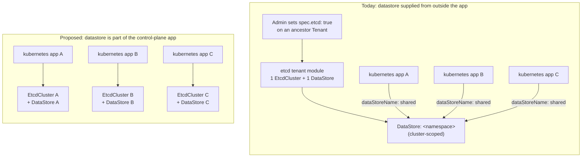

# Per-cluster etcd: the Kubernetes control-plane app owns its datastore

- **Title:** `Per-cluster etcd: give each Kubernetes control plane its own datastore`
- **Author(s):** `@myasnikovdaniil`
- **Date:** `2026-06-30` (revised `2026-08-21`)
- **Status:** Review

<!-- Revision note: second draft. It answers every open question from the first round with evidence rather than deferring them, adopts the minimal values surface argued for in review, and retargets the whole document at etcd-operator v1alpha2, which has since merged. The framing also changed: see "Scope and related proposals". -->

## Overview

A Kubernetes control plane needs a datastore. Since the control-plane / node-pool split ([`kubernetes-nodes-split`](https://github.com/cozystack/community/pull/8), Accepted), `packages/apps/kubernetes` **is** the control-plane app — it renders the Kamaji control plane, its certificates, its konnectivity, its CSI and cloud-controller satellites, and its OIDC wiring, while worker pools live in `packages/apps/kubernetes-nodes`. Everything a control plane is made of is in that chart except the one component holding all of its state. etcd is instead supplied from outside, by an admin flipping `spec.etcd: true` on an ancestor `Tenant`.

This proposal completes the control-plane app: **`apps/kubernetes` renders its own `EtcdCluster` and its own Kamaji `DataStore`, one per cluster.** A cluster's datastore becomes as much a part of the cluster as its API server — created with it, sized with it, deleted with it, isolated to it. The end state is one etcd per one Kubernetes cluster, and no etcd running anywhere that no cluster needs.

Two consequences follow, and they are consequences rather than goals. Consumers stop being blocked on an admin pre-step, because a `Kubernetes` app no longer depends on a parameter its creator has no RBAC to set. And the tenant-module *wiring* for etcd — the `Tenant.spec.etcd` bool and the `_namespace.etcd` reference propagated down the tenant tree — has nothing left to serve, so it retires. The etcd chart itself and the standalone etcd app both survive; see Resolved question 2.

## Scope and related proposals

The important framing point first, because the first review round read this proposal as a competing packaging change:

- **[community#39](https://github.com/cozystack/community/pull/39) — Fold `extra` into `apps`.** **Companion, not competitor.** #39 answers *where packages live and how a module declares itself* — it retires the `packages/extra` directory and turns "hidden from the catalog", "one per tenant", and "shared down the tenant tree" into declarative `ApplicationDefinition` capabilities. This proposal answers a different question: *what the Kubernetes control-plane app is made of.* It adds one component to one chart. The two touch disjoint files (#39 touches directory paths, `-rd` definitions, and the Tenant chart's generic capability plumbing; this proposal touches `apps/kubernetes` templates plus the etcd-specific keys in the Tenant chart), and neither blocks the other. If both land, #39 relocates the etcd chart along with everything else in `extra/` and this proposal's shared template follows it; if only one lands, both still make sense on their own. The one place they meet is that etcd is the single tenant module whose *sharing semantics we intentionally drop* — #39 keeps sharing for monitoring, seaweedfs, ingress, and gateway, which is exactly why etcd is out of its scope and in this one.
- **[community#8](https://github.com/cozystack/community/pull/8) — Control-plane / node-pool split (Accepted, `design-proposals/kubernetes-nodes-split/`).** This proposal builds directly on it. Because worker pools moved out to `apps/kubernetes-nodes`, `apps/kubernetes` is now unambiguously the control-plane chart, and "the control plane owns its datastore" is a coherent statement about it rather than a statement about a chart that also happens to manage VMs.
- **[cozystack#3179](https://github.com/cozystack/cozystack/issues/3179) — Expose only `etcd.replicas`.** Filed out of the first review round to capture the minimal-API argument. **Adopted here** (Design §2), which is what #3179 asked for; the issue is gated on this proposal and can close with it.
- **[cozystack#2859](https://github.com/cozystack/cozystack/pull/2859) / [#3270](https://github.com/cozystack/cozystack/pull/3270) — etcd-operator v1alpha2 (both merged).** The first draft was written against `etcd.aenix.io/v1alpha1`. That is now historical; this revision targets `etcd-operator.cozystack.io/v1alpha2`, the `Available` readiness condition, and the `secretRef` TLS shape throughout. No dependency remains to declare — the dependency landed.
- **[community#33](https://github.com/cozystack/community/pull/33) — ComputePlane (`packages/extra/computeplane`).** Adjacent but independent. ComputePlane wraps `apps/kubernetes`, so it inherits whatever datastore behaviour that chart has, and its README documents the `awaiting-etcd` state that Design §4 removes. It needs a docs update in Phase 3, nothing more.
- **Deferred / out of scope:** a SQL-backed Kamaji datastore driver (kine/PostgreSQL) per cluster. It is a real way to cut the three-replica etcd cost, but it is an orthogonal driver choice that layers on top of per-cluster *ownership* — the model proposed here is a prerequisite for it either way.

## Context

A tenant Kubernetes control plane runs on the management cluster as a Kamaji `TenantControlPlane`, rendered through a CAPI `KamajiControlPlane`. Kamaji does not run etcd; it points each control plane at a Kamaji `DataStore`, and Cozystack supplies that datastore from a separately deployed etcd. The wiring today:

- **etcd is a tenant module.** `packages/apps/tenant/values.yaml:8-9` exposes `etcd: false`. When a `Tenant` sets it true, `packages/apps/tenant/templates/etcd.yaml` renders a `HelmRelease` for the etcd chart in that tenant's namespace, labelled `internal.cozystack.io/tenantmodule: "true"`.
- **The etcd chart owns the datastore.** `packages/extra/etcd` renders an `EtcdCluster` (`etcd-operator.cozystack.io/v1alpha2`, `templates/etcd-cluster.yaml:11`), its cert-manager CA/issuers/certificates, and a Kamaji `DataStore` named after the **namespace** pointing at `etcd.<namespace>.svc:2379` (`templates/datastore.yaml:5-8`). `DataStore` is **cluster-scoped** (`packages/system/kamaji/charts/kamaji/crds/kamaji.clastix.io_datastores.yaml:16`).
- **Every name in that chart is the literal string `etcd`.** `EtcdCluster/etcd`; the Secrets `etcd-ca-tls`, `etcd-client-tls`, `etcd-server-tls`, `etcd-peer-tls`; the operator-owned Service `etcd`. The chart enforces this: `templates/check-release-name.yaml` calls `fail` unless `.Release.Name == .Chart.Name`. These names are load-bearing rather than cosmetic — `spec.tls` is immutable in v1alpha2 (CRD CEL `self.tls == oldSelf.tls`) and `etcd-migrate` adopts legacy clusters into exactly this `secretRef` shape, so renaming them would make every post-adoption reconcile fail. Design §1 works with this constraint instead of against it.
- **The reference propagates down the tenant tree.** `tenant-root` ships a hardcoded `_namespace.etcd: tenant-root` in its `cozystack-values` Secret (`packages/system/cozystack-basics/templates/cozystack-values-secret.yaml:17`). For nested tenants, `packages/apps/tenant/templates/namespace.yaml:28-30` inherits `_namespace.etcd` from the parent and overrides it with the current tenant only when *this* tenant sets `spec.etcd: true`; the resolved value is written to the namespace label `namespace.cozystack.io/etcd` (`namespace.yaml:86`) and into descendants' `_namespace.etcd` (`namespace.yaml:120`). Consumers read it through `cozy-lib.ns-etcd` (`packages/library/cozy-lib/templates/_cozyconfig.tpl:116-118`). So every tenant in a subtree resolves `_namespace.etcd` to the nearest ancestor that owns an etcd.
- **The control-plane app consumes the shared reference.** `packages/apps/kubernetes/templates/cluster.yaml:27` reads `$etcd := .Values._namespace.etcd`. If it is empty the chart renders **only** a `<release>-awaiting-etcd` ConfigMap beacon and nothing else (`cluster.yaml:226-244`); `templates/ingress.yaml` and `hack/admin-kubeconfig-invariant.bats` key off the same state. If it is set, the `KamajiControlPlane` carries `dataStoreName: "{{ $etcd }}"` (`cluster.yaml:422`).
- **One etcd, many control planes.** Because the `DataStore` is cluster-scoped and the reference is shared subtree-wide, every `KamajiControlPlane` in a subtree carries the **same** `dataStoreName`. Kamaji multiplexes them onto the one etcd by minting a per-control-plane connection Secret (`<release>-datastore-config`) with its own credentials and key prefix. The isolation is logical — one Raft group, one disk, one `quotaBackendBytes`, one CA — not physical.

### The problem

- *"I have access to my tenant. I create a `Kubernetes` app and it just sits there saying `awaiting-etcd`. I can't fix it — etcd is a field on the Tenant, and I don't own the Tenant."* The most common first-run experience for a delegated consumer is a cluster that cannot start, blocked on a parameter they have no RBAC to set.
- *"Two teams each spun up a cluster in our tenant, and now a compaction storm on one team's control plane is stalling the other's API server."* One etcd, sized and tuned exactly once, backs an unbounded number of control planes. There is no per-cluster performance envelope, and nothing about a cluster's own configuration can give it one.
- *"Our security review flagged that every cluster's control-plane state lives in one etcd behind one CA."* One etcd shared across trust boundaries is one blast radius. A noisy or compromised control plane is one logical key prefix away from its neighbours.
- *"To get real isolation we create a separate child tenant per cluster, just so each cluster gets its own etcd."* The workaround already exists in the field. It is precisely the per-cluster etcd this proposal makes the default, minus the tenant-sprawl ceremony.
- And the plain structural version, independent of any user story: **the control-plane chart does not contain the control plane's state.** Every other control-plane component is rendered by `apps/kubernetes` and versioned with it. The datastore is the one exception, and every problem above is downstream of that exception.

## Goals

- `apps/kubernetes` renders its own `EtcdCluster` and its own cluster-scoped `DataStore`, and points its `KamajiControlPlane` at them. One etcd per one Kubernetes cluster.
- etcd lifecycle is **bound to the cluster**: creating the app creates its etcd; deleting the app reaps its etcd, `DataStore`, certificates, and connection Secret.
- **No idle etcd.** With zero `Kubernetes` apps in a namespace, no `EtcdCluster`, PVC, or `DataStore` exists there. (The cluster-wide etcd-operator stays; it provisions nothing on its own.)
- A consumer who can create a `Kubernetes` app gets a working cluster with **no admin pre-step** — no ancestor `spec.etcd: true`, no `awaiting-etcd` wait state.
- Each cluster's control-plane state is **physically isolated**: its own Raft group, disk, quota, CA, and Service.
- The user-facing surface added is **one field** (`etcd.replicas`), matching the convention the chart already follows for its other infrastructure satellites.
- Existing shared-etcd clusters keep running across the upgrade, indefinitely and without action, and migrate only when an operator chooses to migrate them.
- The etcd chart stays a single source of truth for "how a Cozystack etcd is shaped", with no duplicated `EtcdCluster` or cert-manager templates.

### Non-goals

- **Not** changing Kamaji, the etcd-operator, the CAPI stack, or the KubeVirt provisioning path. Only *where the datastore comes from* changes.
- **Not** removing the etcd chart or the standalone etcd app (Resolved question 2).
- **Not** introducing a SQL/kine datastore driver (deferred, see Scope).
- **Not** migrating live control-plane data automatically. Data movement is operator-initiated, per cluster, and never a side effect of an upgrade (Resolved question 1).
- **Not** changing package layout, directory boundaries, or how modules declare themselves — that is [#39](https://github.com/cozystack/community/pull/39).
- **Not** re-litigating the control-plane / node-pool split; this proposal assumes it.

## Design

### Before / after


```mermaid
flowchart TD
    subgraph today["Today: datastore supplied from outside the app"]
      direction TB
      AdminT["Admin sets spec.etcd: true<br/>on an ancestor Tenant"] --> ETM["etcd tenant module<br/>1 EtcdCluster + 1 DataStore"]
      ETM --> DS["DataStore: &lt;namespace&gt;<br/>(cluster-scoped)"]
      K1["kubernetes app A"] -->|"dataStoreName: shared"| DS
      K2["kubernetes app B"] -->|"dataStoreName: shared"| DS
      K3["kubernetes app C"] -->|"dataStoreName: shared"| DS
    end

    subgraph proposed["Proposed: datastore is part of the control-plane app"]
      direction TB
      KA["kubernetes app A"] --> EA["EtcdCluster A<br/>+ DataStore A"]
      KB["kubernetes app B"] --> EB["EtcdCluster B<br/>+ DataStore B"]
      KC["kubernetes app C"] --> EC["EtcdCluster C<br/>+ DataStore C"]
    end
```

### 1. One shared template, two callers

`apps/kubernetes` needs the same three shapes the etcd chart already renders — an `EtcdCluster`, its cert-manager issuer/CA/certificate set, and a Kamaji `DataStore` — but under per-cluster names. The etcd chart cannot be consumed as a subchart to get them, for three concrete reasons established in Context: `check-release-name.yaml` hard-fails unless the release is named `etcd`; a subchart is rendered with the *parent's* `.Release.Name`, so it would fail that guard and then produce parent-named objects anyway; and the literal `etcd-{ca,client,server,peer}-tls` names cannot simply be made release-scoped, because adopted legacy clusters reference them through an immutable `spec.tls`.

So the shapes move into a **named template in `cozy-lib`, parameterised by name**, and both charts call it. `packages/library/cozy-lib` is already symlinked into both charts (`packages/apps/kubernetes/charts/cozy-lib` is a symlink, as is `packages/extra/etcd/charts/cozy-lib`), so there is no new dependency, no `charts/` vendoring step, and no build change:

```gotemplate
{{/* packages/library/cozy-lib/templates/_etcd.tpl */}}
{{- define "cozy-lib.etcd.cluster" -}}
{{/* args: (list <name> <values> <root-context>) */}}
{{- end }}
{{- define "cozy-lib.etcd.certificates" -}}{{- end }}
{{- define "cozy-lib.etcd.datastore" -}}{{- end }}
```

`packages/extra/etcd` calls them with `"etcd"` and keeps rendering byte-identical output — same `EtcdCluster/etcd`, same Secret names, same `DataStore/<namespace>`, same adoption compatibility, same immutable `spec.tls`. Nothing about the standalone chart or an adopted cluster changes. `apps/kubernetes` calls them with its own per-cluster name (§3) and gets a fresh cluster, where there is no adopted object to stay shape-compatible with and the names are therefore free.

The `KamajiControlPlane` then points at its own datastore:

```yaml
# packages/apps/kubernetes/templates/cluster.yaml:422  (after)
    dataStoreName: {{ include "kubernetes.etcdName" . | quote }}   # was: "{{ $etcd }}"
```

Extracting the templates is mechanically the largest piece of work in this proposal and is behaviour-neutral by construction: Phase 1 lands the extraction alone, and the etcd chart's existing helm-unittest suite (`packages/extra/etcd/tests/`) proves the rendered output did not move before any per-cluster code is written.

### 2. One new field: `etcd.replicas`

The `Kubernetes` CR gains exactly one etcd knob:

```yaml
# packages/apps/kubernetes/values.yaml  (new section)
## @param {Etcd} etcd - Control-plane etcd datastore for this cluster.
etcd:
  ## @field {int} replicas=3 - etcd replicas backing this cluster's control plane.
  ## 3 = HA via Raft quorum. 1 = single-member, non-HA; the chart selects a
  ## replicated StorageClass so the lone member survives node loss at the
  ## storage layer. Values other than 1 and 3 are rejected.
  replicas: 3
```

`size`, `resources`, and `storageClass` are deliberately **not** exposed, and this is the point argued in review and captured in [#3179](https://github.com/cozystack/cozystack/issues/3179). The chart already renders three infrastructure satellites with hardcoded resources and no values surface — `templates/kccm/manager.yaml`, `templates/cluster-autoscaler/deployment.yaml`, `templates/csi/deploy.yaml` — and draws a clean line between the control plane the user configures (`controlPlane.*.resourcesPreset`) and the machinery underneath it that the user does not. Per-cluster etcd belongs on the second side of that line: it is a control-plane implementation detail, not a control-plane user surface. Field data from the first review round supports this — measured on a real tenant cluster, the satellites already cost ~1360m requested CPU and ~3.85Gi requested memory, of which `kcsi-controller` alone (760m CPU, 3200Mi memory limits across six-plus sidecars) is heavier than three etcd replicas combined, and none of it is tunable. Adding a full sizing block for etcd alone would break the convention and add UX surface for a knob nobody has asked to turn.

The internal values follow today's etcd chart defaults exactly (`packages/extra/etcd/values.yaml`), so per-cluster sizing starts where shared sizing is today:

- `size: 4Gi`, with `quotaBackendBytes` derived at 95% as the chart already does. Ample for one Kamaji datastore.
- `resources: {cpu: 1000m, memory: 512Mi}`, with the existing VPA (`packages/extra/etcd/templates/vpa.yaml`) handling growth.
- `version` tracks the etcd chart, so a single bump moves both callers.
- `storageClass` is **derived from `replicas`**, resolved at platform level rather than per app: `replicas: 3` selects a local-style class, since etcd replicates through Raft and storage-layer replication underneath it is wasted write amplification; `replicas: 1` selects a replicated/DRBD-style class, so the single member survives node loss. The two class names come from `_cluster` values (e.g. `etcd-storageclass-local` and `etcd-storageclass-replicated`) rendered into `cozystack-values` the way the existing `_cluster` keys are, with an unset key falling back to the namespace's default StorageClass — the current behaviour, since the etcd chart's `storageClass` defaults to `""` today. An operator retunes their fleet in one place; a tenant does not make storage-class decisions at all.

This surface is a strict subset of the fuller `{replicas, size, storageClass, resources}` block the first draft proposed, so if a production case ever needs `size` or `resources`, widening is purely additive and breaks nothing.

`replicas` is validated to `1` or `3`. Even numbers are actively harmful for a Raft quorum (`2` tolerates zero failures while doubling cost and halving availability), and `5+` has no plausible justification for a single tenant control plane's key space.

### 3. Names, and the length budget

Two clusters can live in one namespace, so the per-cluster names must be release-scoped rather than namespace-scoped. The base name is `<release>-etcd`, and derived names are:

| Object | Name | Owner |
|---|---|---|
| `EtcdCluster` | `<release>-etcd` | this chart |
| Native Service (client + peer endpoint) | `<release>-etcd` | etcd-operator |
| Member pods | `<release>-etcd-<suffix>` | etcd-operator |
| TLS Secrets | `<release>-etcd-{server,operator-client,peer}-tls` | etcd-operator / cert-manager |
| `DataStore` (cluster-scoped) | `<namespace>-<release>` | this chart |
| Datastore endpoint | `<release>-etcd.<namespace>.svc:2379` | — |

The endpoint is the operator's native Service, which is always named after the cluster — the operator's own comment is explicit that "the operator's native headless Service is always cluster.Name" (`controllers/helpers.go:137`). The `DataStore` name must be globally unique because the resource is cluster-scoped, and `<namespace>-<release>` gives that: namespaces are unique, and release names are unique within one.

The length budget is real but bounded, and worth writing down because a review round raised it. The aggregated API caps a Helm release name at 53 characters (`maxHelmReleaseName`, `pkg/registry/apps/application/rest.go:1297-1303`), enforced as prefix-plus-name at admission. So `<release>-etcd` is at most 58 characters, which clears the 63-character DNS label limit for the Service. The one place it does not clear on its own is the member pods: the operator creates members with `GenerateName: cluster.Name + "-"` (`controllers/etcdcluster_controller.go:419`), and 58 plus a separator plus a generated suffix can exceed 63, which would produce an invalid pod hostname at the far end of the range. The chart therefore bounds the name itself rather than assuming: `kubernetes.etcdName` truncates to a budget that leaves room for the operator's longest derived name and appends a short deterministic hash of the untruncated value when it truncates. Same input, same name, every render. The `DataStore` name is a DNS subdomain (253) and is never the binding constraint.

### 4. Removing the shared-etcd gate

`$etcd` and the `awaiting-etcd` beacon leave the normal path. The chart no longer waits for an external reference, because it renders the datastore itself.

The beacon and the `_namespace.etcd` read are not deleted immediately. Through the compatibility window (Rollout Phase 1-2) the chart honours an explicitly-set `_namespace.etcd` and keeps using the shared `DataStore` when it finds one, so a cluster that exists today continues exactly as it is, indefinitely, until an operator migrates it. New clusters — including any created in a namespace whose ancestors do provide a shared etcd — provision their own. Three other consumers key off the beacon and are updated with it: `packages/apps/kubernetes/templates/ingress.yaml`, `hack/admin-kubeconfig-invariant.bats`, and the ComputePlane README's description of the wait state.

### 5. Retiring the tenant-module wiring

Once no cluster is on a shared etcd, the etcd-specific plumbing has no consumer left:

- `etcd` leaves `packages/apps/tenant/values.yaml`, and `packages/apps/tenant/templates/etcd.yaml` is deleted.
- `_namespace.etcd` propagation goes: the inherit/override block at `namespace.yaml:28-30`, the `namespace.cozystack.io/etcd` label at `:86`, the `_namespace` key at `:120`, the hardcoded `etcd: tenant-root` at `cozystack-values-secret.yaml:17`, and the `cozy-lib.ns-etcd` helper (`_cozyconfig.tpl:116-118`) — after confirming no other app reads it.
- The etcd entry leaves the *tenant-module* catalog: `cozystack.etcd-application` drops out of the tenant application source list. The etcd `ApplicationDefinition` itself stays; see Resolved question 2.

The etcd-operator and the etcd chart both stay. Note that all of this is etcd-specific plumbing, not the generic module machinery — the generic side is [#39](https://github.com/cozystack/community/pull/39)'s subject, and these edits neither help nor hinder it.

## User-facing changes

- **Consumers:** creating a `Kubernetes` app yields a working cluster with no admin pre-step. `awaiting-etcd` disappears. One new field, `etcd.replicas`, defaulting to `3`.
- **Admins:** `Tenant.spec.etcd` is deprecated and then removed; etcd stops being something to pre-provision per tenant. Existing clusters are untouched until deliberately migrated. Two new platform-level `_cluster` keys select the etcd StorageClasses fleet-wide.
- **Resource accounting:** a cluster's etcd now counts against its own tenant's `resourceQuotas` rather than an ancestor's. The chart's `NOTES.txt` and the app README state the footprint up front — three replicas at 1000m/512Mi each and a 4Gi PVC each at the default — so the cost is visible before creation, not discovered afterwards (Resolved question 5).
- **Dashboard and observability:** each cluster gets its own etcd `WorkloadMonitor`, `PodScrape`, and alert rules instead of one shared set per subtree, so etcd metrics finally attribute to a cluster.
- **Docs:** `packages/apps/kubernetes/README.md` already claims each cluster gets "a dedicated etcd cluster ... using the cozystack etcd-operator (`etcd-operator.cozystack.io/v1alpha2`)". Today that sentence is aspirational. This proposal makes it true, which is a small but honest sign that per-cluster etcd is the shape people already assume. Tenant docs drop the etcd module and gain the migration runbook.

## Upgrade and rollback compatibility

**Nothing migrates on upgrade.** New clusters self-provision. Existing clusters keep resolving `_namespace.etcd` and keep their shared `DataStore`, for as long as the operator leaves them alone. There is no automatic data movement anywhere in this proposal, and the platform never restarts a tenant's kubelets on its own initiative.

**Migrating an existing cluster** is an operator-initiated, per-cluster, scheduled-maintenance operation. The mechanism is a live datastore switch, and unlike the first draft this is now established rather than assumed — see Resolved question 1 for the evidence. The runbook:

1. Set `etcd.replicas` and let the chart create the cluster's own `EtcdCluster`, certificates, and `DataStore` alongside the shared one. Wait for `Available=True`.
2. Take a snapshot of the source etcd. This is the rollback path and is not optional.
3. Flip the cluster's `dataStoreName` to its own `DataStore`. Kamaji puts the `TenantControlPlane` into **read-only / freezing mode** while it copies, rejecting writes through an admission controller with an explicit "in freezing mode due to a maintenance mode" message. The default budget is five minutes, adjustable via the `kamaji.clastix.io/migration-timeout` annotation.
4. **Restart `kubelet.service` on every worker node of that tenant cluster.** Kamaji's own guide requires this to complete the procedure. It is the single largest cost in the runbook and the reason this is a maintenance operation rather than a platform migration: rolling a tenant's kubelets is a tenant-visible availability event that the platform must not perform unannounced. Plan it as a rolling restart within a maintenance window.
5. Verify a canary object written before the switch is readable after it, then retain the source prefix and the snapshot for a defined cool-off period before reclaiming.

**Rollback.** Before migration, trivially: revert the chart and the cluster is still on the shared etcd, because nothing moved. After migration, one-way in practice — reversing means running the same freeze-and-kubelet-restart procedure in the other direction against the retained snapshot. Step 2's snapshot exists precisely so that this is possible-but-deliberate rather than impossible.

**Numbered platform migrations.** None are needed to move data, and using one would be wrong for the reasons in step 4. If a numbered migration is added at all it is advisory — reporting which clusters still resolve a shared `_namespace.etcd`, so Phase 4 has a real signal instead of a guess. Any such migration claims **56 or higher**: `main` currently ships migrations through `55` with `targetVersion: 56`. The slot must be re-checked against `main` and against every active release branch at implementation time, not taken from this document — the first draft's "migration 49" was already stale when it was written, and bumping `targetVersion` without diffing the slot across branches is a known way to silently skip a migration.

## Security

- **Removes a shared trust boundary.** Each cluster gets its own etcd CA, Service, certificates, and PVCs. Today every control plane in a subtree dials the same `etcd.<ns>.svc` — frequently cross-namespace, because the `DataStore` is cluster-scoped and its owner is an ancestor tenant. Afterwards, a control plane dials only its own in-namespace etcd, and the `policy.cozystack.io/allow-to-etcd` pod label (`cluster.yaml:464`) retargets to it so the NetworkPolicy stays tight rather than subtree-wide.
- **Blast radius shrinks from subtree to cluster.** A compromised or resource-exhausted etcd affects exactly one Kubernetes cluster. A compaction storm no longer has neighbours.
- **No new tenant-supplied trust surface.** The only new input is an integer restricted to `1` or `3`. There is no way to point a control plane at an arbitrary external datastore, and narrowing the surface to one integer (Design §2) is what guarantees that rather than merely discouraging it.
- **Secrets:** per-cluster CA / server / peer / client Secrets are issued by cert-manager exactly as the tenant module does today, one set per cluster instead of one per subtree. Kamaji's per-control-plane `<release>-datastore-config` Secret is unchanged.
- **Residual risk during migration:** between steps 1 and 5 a cluster's data exists in two places. The retained source prefix and snapshot are a deliberate availability trade and should be reclaimed on a defined schedule rather than kept indefinitely.

## Failure and edge cases

- **Two `Kubernetes` apps in one namespace** → each renders `<release>-etcd` and `DataStore/<namespace>-<release>`; no collision. The old single `DataStore/<namespace>` could not name two clusters distinctly at all.
- **A long release name** → `kubernetes.etcdName` truncates deterministically with a hash suffix (§3), so the operator's derived pod names stay inside 63 characters. Deterministic means a re-render never renames a live object.
- **Cluster deletion, per-cluster etcd** → the delete hook additionally reaps the `EtcdCluster`, the cluster-scoped `DataStore`, and the per-cluster certificate Secrets, after the existing Step 4b that strips Kamaji's `finalizer.kamaji.clastix.io/datastore-secret` from `<release>-datastore-config` (`templates/delete.yaml`). Ordering: drain the control plane → let the `TenantControlPlane` delete → clear the datastore-secret finalizer → remove `EtcdCluster` and `DataStore`. Removing etcd before Kamaji has finished finalising would leave the controller dialling a datastore that no longer answers.
- **Cluster deletion, legacy shared etcd** → **the hook must not touch the shared `EtcdCluster` or `DataStore`.** Deleting a legacy cluster must leave them exactly as they were, because they belong to an ancestor tenant's module and back every other cluster in the subtree. The hook branches on whether *this release* owns a per-cluster `DataStore`, which is the same condition §4 uses to choose a datastore in the first place, so the two cannot disagree: own the datastore, reap it; inherit it, leave it alone. This case gets a dedicated helm-unittest assertion, because getting it wrong destroys other tenants' clusters and the blast radius justifies a test that exists purely to pin the negative.
- **etcd not `Available` when Kamaji reconciles** → the control plane stays not-ready and Flux retries. Same asynchronous-readiness loop as today, no hard failure. Note the condition is `Available` on v1alpha2, not `Ready`.
- **`replicas: 2` or another even value** → rejected by schema validation with an explanatory message, rather than silently building a quorum that tolerates no failures.
- **Migration interrupted mid-flight** → the source prefix and the step-2 snapshot both still exist; the cluster keeps serving from whichever `dataStoreName` is currently set. Re-runnable.
- **Kubelet restart skipped after migration** → worker nodes keep talking to a control plane whose datastore moved underneath it. This is the failure mode step 4 exists to prevent; the runbook treats the restart as part of the migration, not as follow-up housekeeping.
- **A stale `_namespace.etcd` left set after migration** → the cluster's own `DataStore` wins. The stale reference is inert and is removed in Phase 4.
- **Tenant quota too small for the new etcd** → the `EtcdCluster`'s pods fail admission against the namespace `ResourceQuota` and the cluster does not come up, with the quota error surfaced on status. Publishing the footprint in `NOTES.txt` is what turns this from a surprise into a precondition.

## Testing

- **`cozy-lib` extraction (Phase 1 gate):** the existing `packages/extra/etcd/tests/` suite must pass unchanged against the extracted templates, proving the standalone chart's rendered output is byte-identical. This is the guard that makes the largest mechanical change in the proposal safe.
- **Helm unit tests, `packages/apps/kubernetes/tests/`:** assert the chart renders `EtcdCluster/<release>-etcd`, the certificate set, `DataStore/<namespace>-<release>` with the `<release>-etcd.<namespace>.svc:2379` endpoint, and a `dataStoreName` that matches that `DataStore` exactly. Repurpose `tests/values-ci-no-etcd.yaml`: "no inherited etcd" must now render a complete cluster with its own etcd instead of the `awaiting-etcd` beacon. Add two clusters in one namespace and assert two distinct etcd and `DataStore` names. Assert a maximum-length release name produces names inside 63 characters, and that re-rendering it yields the same names. Assert `replicas: 2` is rejected.
- **Delete-hook tests, `tests/delete_hook_test.yaml`:** one case asserting a per-cluster etcd and `DataStore` are reaped in the documented order; one asserting a legacy cluster's shared `EtcdCluster` and `DataStore` are **not** touched.
- **e2e, `hack/e2e-apps/`:** create a `Kubernetes` app in a tenant with no ancestor etcd and assert it reaches ready with its own etcd; create two clusters in one namespace and assert independent etcd pods and PVCs; delete one and assert its etcd, `DataStore`, and Secrets are gone, the other is unaffected, and the namespace terminates cleanly.
- **Migration e2e, gating Phase 2:** stand up a cluster on the shared path, run the full runbook including the kubelet restart, and assert a canary object written before the switch is readable after it, that the freeze window stays inside the configured timeout, and that worker nodes rejoin. This is the test that decides whether the runbook ships as documented; the underlying mechanism is established (Resolved question 1) but its behaviour on a Cozystack cluster with Talos workers is not yet measured, and an operator running the runbook offered to help exercise it on a production-shaped fleet.
- **Quota interaction:** a namespace whose `ResourceQuota` cannot fit the etcd surfaces a clear quota error rather than a mute pending cluster.

## Rollout

1. **Phase 1 — extract, no behaviour change.** Move the `EtcdCluster`, certificate, and `DataStore` shapes into `cozy-lib` named templates; `packages/extra/etcd` calls them and renders byte-identical output, proven by its existing test suite. Nothing user-visible ships.
2. **Phase 2 — per-cluster etcd for new clusters.** `apps/kubernetes` renders its own etcd, certificates, and `DataStore`, adds `etcd.replicas` and the platform-level StorageClass keys, extends the delete hook with both branches, and keeps honouring an explicit `_namespace.etcd` for clusters that already have one. Ship the sizing and quota notes. Land and prove the migration runbook, including the kubelet-restart step, before documenting it as supported.
3. **Phase 3 — deprecate.** Mark `Tenant.spec.etcd` and the etcd tenant-module catalog entry deprecated; new tenants stop offering it. Stop shipping the hardcoded `_namespace.etcd: tenant-root`. Update the ComputePlane docs and anything else describing `awaiting-etcd`. Optionally add the advisory migration that reports clusters still on a shared etcd.
4. **Phase 4 — remove plumbing.** Once that signal shows no cluster on a shared etcd, delete `apps/tenant/templates/etcd.yaml`, the `etcd` tenant value, the `_namespace.etcd` propagation, the `cozy-lib.ns-etcd` helper, and the `namespace.cozystack.io/etcd` label. Keep the etcd-operator, the etcd chart, and the standalone etcd app.

Phases 1 and 2 are the proposal. Phases 3 and 4 are bookkeeping that can trail by a release or more, and Phase 4 in particular is gated on evidence rather than on a date.

## Resolved questions

The first draft left five questions open. All five are answered here; the reasoning is recorded because the answers are the substance of this revision.

**1. Does the CAPI `KamajiControlPlane` support a live datastore switch?** **Yes.** The Kamaji control-plane provider projects `KamajiControlPlane.spec.dataStoreName` onto `TenantControlPlane.spec.dataStore` from inside a `controllerutil.CreateOrUpdate` mutate function (`controllers/kamajicontrolplane_controller_tcp.go`, `if kcp.Spec.DataStoreName != "" { tcp.Spec.DataStore = kcp.Spec.DataStoreName }`), so it re-projects on **every** reconcile rather than only at creation, and the field carries no immutability marker. Changing it therefore reaches Kamaji's own datastore-migration flow. That flow is not free: Kamaji's guide states the control plane "is put in read-only mode to avoid misalignments between source and destination datastores", with a five-minute default budget under `kamaji.clastix.io/migration-timeout`, and requires "restarting the `kubelet.service` on all the tenant worker nodes" afterwards. **Decision:** migration is an operator-initiated, per-cluster, scheduled-maintenance runbook — never an unattended numbered platform migration, because the platform must not roll a tenant's kubelets unannounced. A numbered migration, if used at all, only reports which clusters remain. This also settles the related worry that #2859's choice of snapshot-and-adopt was evidence against the live path: #2859 was adopting *operator API versions* for existing etcd clusters, an unrelated problem, so it says nothing about datastore migration either way.

**2. Is anyone using etcd as a standalone app, and does it survive?** **It survives, and the question does not need answering first.** Only the *tenant-module wiring* retires — the `Tenant.spec.etcd` bool and the `_namespace.etcd` propagation. The chart and its `ApplicationDefinition` remain, so etcd stays installable as an ordinary app for any datastore purpose unrelated to a Kubernetes control plane, and no existing standalone deployment is disturbed. Deciding *which directory* it lives in and *how* it declares itself is [#39](https://github.com/cozystack/community/pull/39)'s question, not this one — which is exactly the division of labour described in Scope.

**3. Default replicas: 1 or 3?** **3.** Defaulting to `1` would ship non-HA control planes to anyone who does not read the field, which is the wrong direction for a safe default. A user who wants a throwaway cluster can set `replicas: 1` explicitly and gets a replicated StorageClass underneath it as a partial safety net (§2).

**4. Subchart or shared library?** **Shared library — named templates in `cozy-lib`, parameterised by name.** The subchart route is blocked by three concrete facts, not by taste: `packages/extra/etcd/templates/check-release-name.yaml` calls `fail` unless `.Release.Name == .Chart.Name`; a subchart renders with the parent's release name, so it fails that guard and would then emit parent-named objects; and the literal `etcd-*` Secret names cannot be made release-scoped for existing clusters, because `etcd-migrate` adopted them into an immutable `spec.tls` that references those exact names. The library route sidesteps all three, needs no `Chart.yaml` dependency or vendoring step because `cozy-lib` is already symlinked into both charts, and keeps one source of truth for the etcd shape. Cost: `cozy-lib` gains resource-emitting templates alongside its helpers, which is a mild widening of what that chart is for. Accepted, and worth it against the alternative of duplicating the `EtcdCluster` and cert-manager shapes in two places.

**5. Should the etcd footprint be surfaced?** **Yes** — in `NOTES.txt` and the app README, stated in concrete numbers rather than as a caveat (§ User-facing changes). Per-cluster etcd counts against the tenant's own quota, and with a minimal values surface this is a documentation change rather than an API one.

## Alternatives considered

- **Keep etcd shared, one per tenant, better documented.** Rejected: N clusters on one etcd within a tenant solves neither the isolation nor the self-service problem. It renames the workaround.
- **Require the consumer to create an `etcd` app before the `Kubernetes` app.** Rejected: worse than today — two apps, an explicit ordering the user must know, a dangling etcd when the cluster is deleted, and it re-exposes the very concept being retired. Also, it would leave the control-plane chart still not containing the control plane's state, which is the actual defect.
- **Expose the full `{replicas, size, storageClass, resources}` block** (the first draft's design). Rejected on review: it breaks the chart's existing convention that infrastructure satellites are hardcoded and only the control plane proper is tunable, and it adds four knobs for a component the user should not be sizing. The minimal surface is a strict subset, so growing into the fuller block later needs no breaking change ([#3179](https://github.com/cozystack/cozystack/issues/3179)).
- **Per-cluster SQL/kine datastore instead of etcd.** A genuine way to cut the three-replica cost, but an orthogonal driver decision that layers on top of per-cluster ownership rather than replacing it. Deferred.
- **Automatic migration of every shared-etcd cluster on upgrade.** Rejected twice over: moving live control-plane data without opt-in is unsafe, and the kubelet restart on every tenant worker node makes it an availability event the platform has no business triggering on its own.
- **Delete the etcd chart and inline everything into `apps/kubernetes`.** Rejected: duplicates the `EtcdCluster` and cert-manager shapes, orphans the standalone use case, and breaks the backup/snapshot integration built around the chart.
- **Wait for [#39](https://github.com/cozystack/community/pull/39) and treat etcd as one more capability migration.** Rejected, and this is the framing correction this revision makes. #39 generalises how modules are declared and where they live; the modules it covers are the ones whose *sharing must be preserved*. etcd is the one module whose sharing is the defect. Folding it into #39 would mean either holding a control-plane fix behind a repository-wide reorganisation, or expressing "this component stops being shared and moves inside another app" as a capability flag, which it is not. The two proposals are companions: one moves packages, the other completes an app.

---

<!--
Inspired by KubeVirt enhancement proposals
(https://github.com/kubevirt/enhancements) and Kubernetes Enhancement
Proposals (KEPs).
-->
