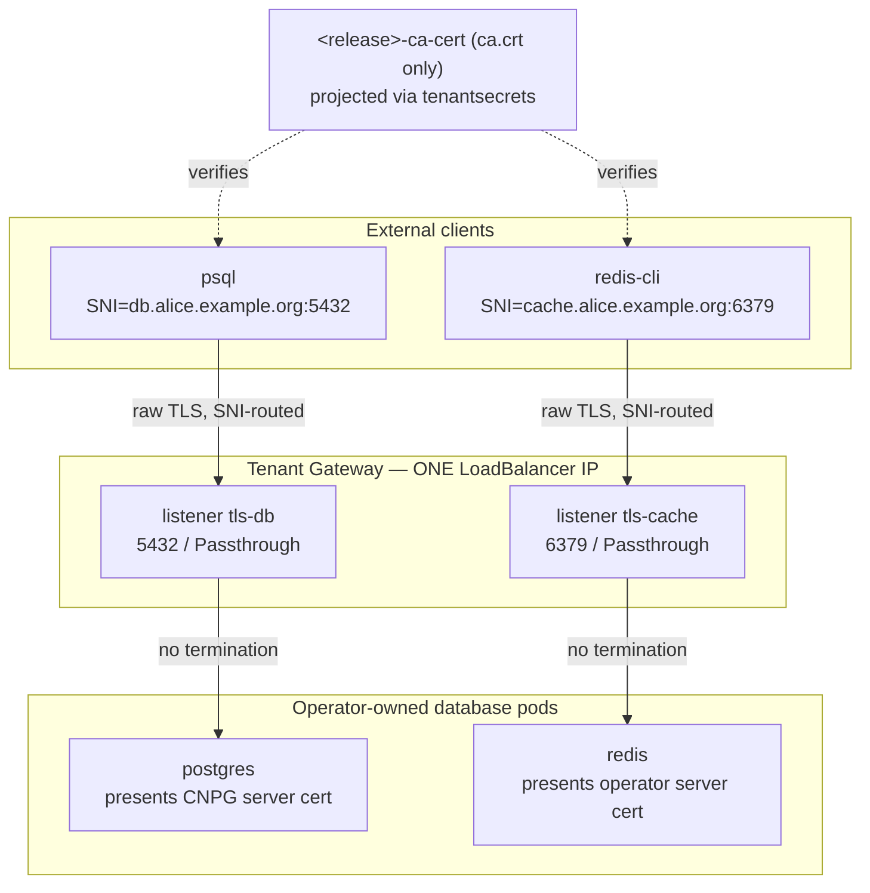

<!-- Place this file at design-proposals/external-database-exposure/README.md -->
# External database exposure via Gateway API TLS-passthrough (SNI) and end-to-end TLS

- **Title:** `External database exposure via Gateway API TLS-passthrough (SNI) and end-to-end TLS`
- **Author(s):** `@lexfrei`
- **Date:** `2026-06-24`
- **Status:** Draft

## Overview

Today every managed database a tenant exposes externally gets its own `LoadBalancer` Service, and therefore its own public IP. A tenant with ten external databases burns ten IPs, and there is no managed end-to-end TLS story that does not terminate somewhere in the middle. This proposal exposes managed databases through the Gateway API TLS-passthrough listeners that Cozystack already operates, routed by SNI on each engine's native port. Multiple databases per tenant collapse onto a single LoadBalancer IP, and because a passthrough listener never terminates TLS, the certificate the external client validates is byte-identical to the operator-issued server certificate the database already presents inside the cluster — end-to-end TLS with no second certificate, no re-encryption hop, and no private key held at the edge.

This is the design-proposal artifact required by `cozystack/cozystack#2816`, and it records the decision that issue asks for. The trade-off that issue frames is CNI mesh encryption (datapath lock-in) versus application-level TLS: this proposal chooses **application-level, operator-owned TLS carried through a non-terminating gateway** for the external leg — no edge termination, no second certificate, no private key at the edge, and no dependency on a particular CNI. The other half of that framing — in-cluster (east-west) pod-to-pod encryption, which never leaves the cluster and is necessarily datapath-specific — is recorded and executed separately under `cozystack/cozystack#2977` (PR `cozystack/cozystack#2984`); it complements this proposal rather than competing with it. It is the external-exposure half of epic `cozystack/cozystack#2811`; the certificate/PKI half is covered by the sibling proposal `design-proposals/unified-tls-pki`, on which this one depends for the trust-anchor object.

## Scope and related proposals

- **Depends on:** `design-proposals/unified-tls-pki` — provides the `<release>-ca-cert` key-free trust anchor that external clients use to verify the endpoint. This proposal does not re-specify it. It is a companion submission under the same epic, on its own branch; the path resolves once both proposals merge.
- **Umbrella:** `cozystack/cozystack#2811`. This proposal covers WS4 (`cozystack/cozystack#2815`, SNI exposure) and WS5 (`cozystack/cozystack#2816`, end-to-end TLS).
- **Referenced, not designed here:** WS6 east-west / in-cluster CNI encryption (`cozystack/cozystack#2977`, PR `cozystack/cozystack#2984`). It is complementary defense-in-depth for pod-to-pod traffic and is explicitly out of scope (see Non-goals).

All repository paths below refer to the `cozystack/cozystack` repository.

## Context

### TLS-passthrough already exists

Cozystack already runs Gateway API TLS-passthrough for layer-7 system services. The `TenantGateway` controller (`internal/controller/tenantgateway/reconciler.go`) renders, for each entry in `TenantGateway.Spec.TLSPassthroughServices`, a listener named `tls-<service>` on port 443 with `Protocol: TLS`, `Mode: Passthrough`, hostname `<service>.<apex>`, and `AllowedRoutes` restricted to `TLSRoute`. The default services are `api`, `vm-exportproxy`, and `cdi-uploadproxy`, each with a `TLSRoute` that attaches by `sectionName: tls-<service>` (for example `packages/system/cozystack-api/templates/api-tlsroute.yaml`). The platform runs Cilium 1.19.3 with Gateway API v1.5.1 CRDs and GatewayClass `cilium`; `TLSRoute` and passthrough are supported.

The mechanism this proposal needs is therefore already in production for layer-7 services. The work is to extend it to databases, which speak on native (non-443) ports.

### Each external database burns its own IP today

When a database chart sets `external: true`, it provisions a dedicated `Service` of `type: LoadBalancer`: postgres `<release>-external-write` on 5432 (`packages/apps/postgres/templates/external-svc.yaml`), redis `<release>-external-lb` on 6379 (`packages/apps/redis/templates/service.yaml`), mongodb `<release>-external` on 27017 (`packages/apps/mongodb/templates/external-svc.yaml`), kafka on 9094 plus a LoadBalancer per broker (`packages/apps/kafka/templates/kafka.yaml`), and mariadb via a `primaryService` of `type: LoadBalancer` (`packages/apps/mariadb/templates/mariadb.yaml`). Each is a separate IP from the shared MetalLB (or Cilium LB-IPAM) pool; there is no per-tenant IP isolation and no SNI multiplexing.

### The certificate hooks already exist

The external hostname is `<release>.<_namespace.host>`, where `_namespace.host` is the tenant apex. The SAN-injection hook already exists on `main` for postgres: it adds the hostname to the CNPG `Cluster` via `spec.certificates.serverAltDNSNames` in `packages/apps/postgres/templates/db.yaml`, gated by the `tls.enabled` tri-state in `_tls.tpl` (which defaults on when `external` is true). The other engines acquire the same SAN hook through the per-app TLS series tracked by the `unified-tls-pki` proposal — on `main` today redis and mariadb carry no TLS templates at all, and their certificate/SAN support lives in the open PRs `cozystack/cozystack#2729` and `cozystack/cozystack#2680`. The trust anchor (`ca.crt`) is delivered to the tenant through that same `unified-tls-pki` contract. So this proposal builds on hooks that are present for postgres and arriving for the rest — it does not invent new ones.

### The one-IP-per-tenant ceiling

Multiple per-tenant Gateways cannot share a single LoadBalancer IP on current Cilium: every Gateway claims `443/TCP`, so `lbipam.cilium.io/sharing-key` is inactive on the port collision (`packages/extra/gateway/README.md`; upstream cilium#21270, cilium#42756). Within a single Gateway, a parent and its inheriting children share one IP. `Gateway.spec.listeners` is hard-capped at 64. The practical consequence: the unit of IP sharing is one tenant Gateway, and a tenant's database fan-out draws from the 64-listener budget shared with the existing http/https/https-apex and per-child-apex wildcard listeners.

### The problem

Two concrete problems, both solved by SNI-passthrough plus certificate reuse:

1. **IPv4 scarcity.** N externally-exposed databases cost N public IPs per tenant. This does not scale, and IPs are the scarce resource.
2. **No managed end-to-end TLS.** Exposing a database externally today either lacks a managed-TLS-to-the-client story or would require terminating at the edge — which means a second certificate, a re-encryption hop, and the edge holding a private key for a database it does not own.

## Goals

- Multiple external databases per tenant share a single LoadBalancer IP, distinguished by SNI on their native ports.
- End-to-end TLS using the **same** operator-issued certificate client-side and pod-side: no edge termination, no edge-held private key, no second certificate.
- Trust established through the existing `ca.crt`-only object from `unified-tls-pki` — no new PKI, issuer, or rotation machinery.
- A minimal, auditable API surface that reuses the existing passthrough listener and SAN-injection hooks.
- Per-engine honesty: ship what fits the model, defer what does not, and say why.

### Non-goals

- **East-west / pod-to-pod CNI encryption** — separate workstream (`cozystack/cozystack#2977`, PR `cozystack/cozystack#2984`); complementary, not designed here.
- **Kafka external SNI exposure** — deferred; its per-broker advertised-address topology does not fit a single SNI entrypoint (see the matrix). Kafka keeps today's per-broker LoadBalancer behavior.
- **MongoDB non-sharded replica-set SNI exposure** — deferred; per-member LoadBalancers plus `rs.conf` rewrite are the same class of problem as Kafka. Only the sharded `mongos` topology fits.
- **Edge TLS termination / re-encryption / `BackendTLSPolicy`** — explicitly rejected; the recorded decision lands on non-terminating passthrough.
- **New PKI, issuer, or certificate-rotation machinery** — out of scope; this reuses `unified-tls-pki` entirely.
- **Multi-Gateway single-IP sharing** — out of scope until Cilium implements ListenerSet; the design targets one IP per tenant Gateway.
- **Replacing `TLSPassthroughServices`** — the existing layer-7 field stays; this adds a parallel field.
- **SNI confidentiality (ECH)** — database clients do not use ECH; hiding the external hostname is not a goal.
- **Non-Cilium GatewayClasses** — the design assumes GatewayClass `cilium`.

## Design

### 1. Listener and port model



A Gateway listener is keyed by the tuple (port, protocol, hostname/SNI). SNI-based routing therefore works on any TCP port, not only 443 — a `TLSRoute` selects its backend by hostname regardless of the listener's port. "Share one IP via SNI" and "use the native port" are orthogonal, so the design takes both: one passthrough listener per engine on its native port — `tls-<release>` on 5432 for postgres, 6379 for redis, 27017 for sharded mongo, 3306 for mariadb — each `mode: Passthrough`, hostname `<release>.<apex>`, SNI-routed via a per-release `TLSRoute`. All of a tenant's database listeners live on the one tenant Gateway and therefore share its single IP.

Native ports are chosen over forcing everything onto 443 because the latter buys nothing: it does not improve IP consolidation (SNI already does that on any port) and it breaks client ergonomics and tooling defaults (`psql -h host` assumes 5432) while still demanding direct-TLS. The all-on-443 variant is retained as a documented opt-in for operators who want a single-port firewall surface (see Alternatives).

**The Postgres caveat is load-bearing.** libpq has historically performed a StartTLS-style negotiation: it sends a plaintext `SSLRequest` and waits for the server's single-byte reply *before* the TLS `ClientHello`. There is no SNI in the first packet, so a passthrough listener cannot route it. This is resolved by `sslnegotiation=direct` (libpq, PostgreSQL 17+), which sends the `ClientHello` immediately, carrying SNI. Postgres-over-passthrough is therefore conditional on direct-TLS-capable clients and is opt-in, not default-on.

### 2. Certificate reuse is a property of passthrough (the WS5 core)

Passthrough *is* the certificate reuse. Because the Gateway in `mode: Passthrough` does not terminate TLS, it forwards the raw handshake bytes to the backend pod. The certificate the external client validates is byte-identical to the operator-issued server certificate the database already presents internally — CNPG-managed for postgres, Strimzi-managed for kafka, PSMDB-managed for mongo. There is no second certificate, no re-encryption, and no new issuance. End-to-end TLS is a consequence of not terminating, not a feature to build.

WS5 adds nothing beyond two hooks that already exist:

1. **Trust-anchor delivery** — the `<release>-ca-cert` `ca.crt`-only object from `unified-tls-pki`, projected to the tenant. The external client verifies against that `ca.crt`.
2. **SAN coverage** — the chart already injects `<release>.<apex>` into the operator-issued certificate (postgres `serverAltDNSNames` in `db.yaml`, gated by `tls.enabled`). The SAN the client's SNI will carry is already in the certificate.

Stated plainly, where this does **not** work:

- **Kafka** — the external listener advertises per-broker addresses; after bootstrap the client connects directly to each broker. A single SNI endpoint cannot represent N per-broker endpoints. Deferred.
- **MongoDB non-sharded** — one LoadBalancer per member plus an `rs.conf` rewrite; the driver reaches each member by its advertised address. A single SNI front cannot represent the replica-set topology. Only sharded `mongos` fits.
- **Clients that omit or mis-emit SNI** — a passthrough listener has no certificate to fall back to, so a missing SNI is a hard connection failure, not a downgrade. This includes pre-direct-TLS Postgres clients.

### 3. IP consolidation and its limits

The headline payoff is IPv4 scarcity relief. Today ten external databases cost ten public IPs (more for Kafka and Mongo replica sets, which add per-broker / per-member IPs). Under this proposal, N SNI-routed databases on one tenant Gateway share one IP, differentiated by SNI on their native ports. Ten databases become one IP.

The ceiling, stated honestly:

- `Gateway.spec.listeners` is capped at 64. The tenant Gateway already spends slots on the http/https/https-apex listeners, the per-child-apex wildcard listeners, and the three default passthrough services. Database listeners draw from the same budget; an operator near the cap should split a high-fanout subtree onto its own Gateway via `tenant.spec.gateway=true`, as the controller already advises.
- Multi-Gateway IP sharing is not possible today (the one-IP-per-tenant blocker above). The win is one IP per tenant Gateway. Lifting it to share an IP across Gateways depends on Cilium implementing ListenerSet (experimental in Gateway API v1.5.1, not implemented by Cilium 1.19.3).

### 4. Per-engine treatment

| Engine | Native port | Fits SNI-passthrough? | Client requirement | Recommendation |
| --- | --- | --- | --- | --- |
| Redis | 6379 | Yes — immediate TLS, no pre-TLS negotiation | `--tls` + `ca.crt`; modern client emits SNI from a hostname | default-on candidate (cleanest fit) |
| PostgreSQL (CNPG) | 5432 | Yes, only with direct-TLS | `sslnegotiation=direct` + `sslmode=verify-full` + `ca.crt` (libpq PG17+) | opt-in (pre-PG17 clients fail closed) |
| MongoDB — sharded (mongos) | 27017 | Yes — single stateless endpoint | `tls=true` + `tlsCAFile`; seed pointing at the SNI hostname | opt-in (sharded only) |
| MariaDB | 3306 | Likely — modern connectors do TLS-first with SNI | TLS connector emitting SNI + `ca.crt`; verify per connector | opt-in pending connector conformance |
| MongoDB — replica set | 27017 | No — per-member LB + `rs.conf` rewrite | n/a | deferred |
| Kafka (Strimzi) | 9094 | No — per-broker advertised addresses | n/a | deferred |

Kafka is deferred because its wire protocol redirects: the client connects to a bootstrap endpoint, receives metadata listing per-broker advertised host:port pairs, then opens direct connections to each broker. Strimzi's `type: loadbalancer` external listener provisions a LoadBalancer per broker plus a bootstrap LB precisely for this. A single SNI front cannot satisfy the per-broker fan-out. Making Kafka fit would require either per-broker SNI listeners and TLSRoutes (N listeners against the 64-listener cap, partially defeating the consolidation goal) plus rewriting Strimzi's advertised listeners, or a Kafka-aware re-advertising proxy — both out of scope. Revisit if per-broker SNI proves worth the listener budget.

### 5. API and controller extension

The trigger and listener synthesis stay in the controller; database charts do not render Gateway plumbing. Database charts already receive the `_cluster` values channel and read parts of it (for example `packages/apps/postgres/templates/db.yaml` reads `_cluster.scheduling`, and mongodb reads `_cluster["cluster-domain"]`), but they do not read the gateway-discovery keys that `cozystack-api` consumes (the gateway-enabled flag and the gateway name) and have no logic to locate the tenant Gateway. Teaching every database chart that discovery dance would duplicate it across five charts and couple application charts to networking topology. The controller already owns listener synthesis; keep it there.

The existing `TLSPassthroughServices []string` field (`api/gateway/v1alpha1/tenantgateway_types.go`) is too weak for databases — a bare service name hardcodes the layer-7 convention of port 443 and hostname `<name>.<apex>`. Add one structured field alongside it, leaving the existing field untouched for backward compatibility:

```go
// TLSPassthroughBackend declares a per-engine passthrough listener on a
// native port, SNI-routed to a backend Service.
type TLSPassthroughBackend struct {
    Name       string `json:"name"`               // listener suffix -> "tls-<name>"
    Port       int32  `json:"port"`               // native port (5432/6379/27017/3306)
    Hostname   string `json:"hostname,omitempty"` // default "<name>.<apex>"
    BackendRef ...    `json:"backendRef"`          // Service + port (cross-namespace via ReferenceGrant)
}

// TLSPassthroughBackends extends TLSPassthroughServices for engines that need
// a native (non-443) port. Each entry renders one Passthrough listener
// "tls-<name>" on .Port; a TLSRoute attaches by sectionName.
// +optional
TLSPassthroughBackends []TLSPassthroughBackend `json:"tlsPassthroughBackends,omitempty"`
```

The controller change is to extend the existing passthrough-listener loop to also iterate `TLSPassthroughBackends`, rendering each listener with the supplied `Port` instead of the hardcoded 443. The `TLSRoute` attaches by `sectionName: tls-<name>`, identical to the existing `api-tlsroute.yaml` pattern. The field is populated by the Tenant / HelmRelease orchestration layer that already knows both the tenant Gateway and the database release — not the database chart and not the human — so a database's surface stays a single `external`-adjacent toggle.

### 6. Trust-anchor and SAN flow

End to end: the chart injects the external hostname `<release>.<apex>` into the operator-issued certificate's SAN list (gated by the `tls.enabled` tri-state, which defaults on with `external`). The operator issues the server certificate with that SAN. The `ca.crt`-only object is projected to the tenant. The external client connects with SNI `<release>.<apex>` and verifies the presented certificate against that `ca.crt`. The passthrough listener forwards the raw handshake; the pod presents the SAN-matching certificate. No hop in the path terminates TLS.

## User-facing changes

A database gains an `external`-adjacent toggle to select passthrough/SNI mode. Per-engine connection recipes are documented: `psql "sslnegotiation=direct sslmode=verify-full sslrootcert=ca.crt host=<release>.<apex>"`, `redis-cli --tls --cacert ca.crt -h <release>.<apex>`, `mongosh --tls --tlsCAFile ca.crt --host <release>.<apex>`, `mysql --ssl-mode=VERIFY_IDENTITY --ssl-ca=ca.crt -h <release>.<apex>`. Kafka and non-sharded MongoDB keep today's per-LoadBalancer behavior.

## Upgrade and rollback compatibility

The default stays today's per-database LoadBalancer, so no existing external database changes its IP on upgrade. Passthrough/SNI mode is opt-in. Migrating an existing external database to SNI mode is a breaking, opt-in change — the IP changes and the client must be reconfigured (new host, direct-TLS for Postgres); it is not automatic. The existing `TLSPassthroughServices` field continues to work unchanged, and reverting the feature removes the new listener and field without touching the database's own PKI.

## Security

The edge never holds the database's private key — the central strength of passthrough over termination. SNI is sent in cleartext on TLS 1.3 except under ECH, which database clients do not use, so the external hostname `<release>.<apex>` is observable on the wire; this is no worse than DNS or SNI exposure for any TLS service, and the payload stays encrypted end-to-end. A missing or mis-emitted SNI is a hard connection failure (a passthrough listener has no certificate to fall back to) — fail-closed, which is the secure default. Cross-namespace `backendRef` requires a `ReferenceGrant`, consistent with the existing attached-namespaces model. Because trust rides the `ca.crt`-only object, clients never receive private key material.

## Failure and edge cases

- A pre-PG17 or non-direct-TLS Postgres client sends no SNI → no route → connection reset/timeout (document the symptom).
- The 64-listener budget is exceeded → the listener is rejected; mitigation is to split the high-fanout subtree onto its own Gateway.
- `tls.enabled=false` while exposing externally → certificate SAN mismatch; the tri-state should auto-enable TLS with `external`.
- An operator expects multi-Gateway IP sharing → each Gateway still gets its own IP (expected under the Cilium constraint).
- A database is deleted → its `TLSPassthroughBackends` entry and listener must be cleaned up so they do not orphan against the 64-listener cap.

## Testing

- Helm-template assertions that the certificate SAN includes `<release>.<apex>` per engine, mirroring the existing TLS test fixtures.
- A controller unit test that a `TLSPassthroughBackends` entry renders a listener on the native port with `mode: Passthrough` and `AllowedRoutes` restricted to `TLSRoute`.
- An end-to-end test per fitting engine: connect from outside the cluster with SNI and `ca.crt`, and assert that the serial of the presented certificate equals the operator-issued internal certificate — proving reuse, not re-issuance.
- A negative test: a client without SNI fails closed.

## Rollout

1. API field plus controller listener rendering, no engine wired. **Gate:** confirm Cilium 1.19.3 actually renders a working `mode: Passthrough` listener on a non-443 port (for example 5432) and routes it by SNI — the existing passthrough services all run on 443, so this is unproven on a native database port and must be validated before any engine is wired.
2. Redis (the cleanest fit, default-on candidate) behind an opt-in.
3. PostgreSQL (direct-TLS) and sharded MongoDB, opt-in.
4. MariaDB after connector-conformance validation.

Kafka and non-sharded MongoDB are explicitly out of this rollout. Each phase ships documentation, a connection recipe, and an end-to-end gate.

## Open questions

- **MariaDB / MySQL connector conformance** — do the dominant connectors (libmysqlclient, MariaDB Connector/C, JDBC, Go drivers) emit SNI and do TLS-first such that passthrough routes correctly, or does any do a server-greeting-then-STARTTLS dance like pre-direct-TLS Postgres? Default-on versus opt-in for MariaDB hinges on this.
- **Direct-TLS client floor for Postgres** — what fraction of the tenant base predates `sslnegotiation=direct`? Is a per-release attestation gate enough, given there is no graceful downgrade on a passthrough listener?
- **Cilium passthrough on a non-443 port** — the existing passthrough listeners all run on 443; whether Cilium 1.19.3's Gateway implementation honors a `mode: Passthrough` listener on a native database port (5432/6379/27017/3306) and SNI-routes it is unverified and is the single biggest implementation risk. It is the Phase 1 validation gate in Rollout.
- **TLSRoute ownership** — does the controller synthesize the `TLSRoute` alongside the listener (single source of truth, but the controller must know the backend Service), or does the database chart render it (the chart owns the backend selector, but must learn a gateway name/namespace it does not have today)? This decides whether database charts gain gateway-discovery logic.
- **Who writes `TLSPassthroughBackends`** — the orchestration layer auto-appending on `external: true` plus passthrough mode, an operator-managed explicit list, or both; and which reconciliation owns add/remove and orphaned-listener cleanup on database deletion.
- **64-listener budget accounting** — with the parent listeners, per-child-apex wildcards, default passthrough services, and N database listeners, what is the realistic per-tenant ceiling, and should the controller surface a status condition as the budget nears 64?
- **ListenerSet timeline** — multi-Gateway IP sharing is blocked on Cilium implementing ListenerSet. Do we design the field and status to be ListenerSet-ready now, or revisit when Cilium ships it? This determines whether one-IP-per-tenant is a permanent or temporary ceiling.

## Alternatives considered

- **Edge TLS termination plus re-encryption (`BackendTLSPolicy`).** Rejected: the edge holds keys, there are two certificates, and it defeats reuse. This is the recorded decision WS5 asks for — passthrough chooses application-level, CNI-agnostic TLS over edge termination.
- **All-on-443 SNI.** Mirrors the existing three services exactly with no new port plumbing, retained as a documented opt-in, but rejected as the default for the client-ergonomics and direct-TLS-everywhere tax.
- **Route-driven implicit listeners** — the controller watches `TLSRoute` objects (it already does) and auto-synthesizes a passthrough listener for any route targeting a non-443 port. Less API surface, but it inverts the explicit-intent model and makes the listener set implicit and hard to audit. Offered as a future ergonomic; the explicit field is recommended for v1.
- **Per-broker SNI for Kafka.** Rejected for now (see the matrix); revisit if the listener-budget cost is justified.
- **Status quo: a LoadBalancer per database.** The IPv4-scarcity problem this proposal exists to solve.

---

<!--
Inspired by KubeVirt enhancement proposals
(https://github.com/kubevirt/enhancements) and Kubernetes Enhancement
Proposals (KEPs).
-->
