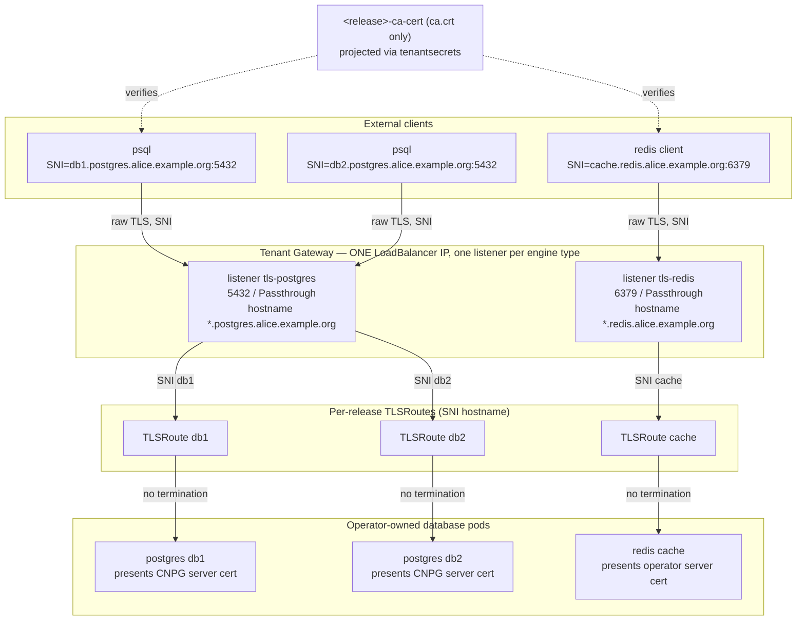

<!-- Place this file at design-proposals/external-database-exposure/README.md -->
# External database exposure via Gateway API TLS-passthrough (SNI) and end-to-end TLS

- **Title:** `External database exposure via Gateway API TLS-passthrough (SNI) and end-to-end TLS`
- **Author(s):** `@lexfrei`
- **Date:** `2026-06-24`
- **Status:** Review

## Overview

Today every managed database a tenant exposes externally gets its own `LoadBalancer` Service, and therefore its own public IP. Cross-engine consolidation of those IPs is partly achievable already — Cilium LB-IPAM can share one IP across Services whose ports do not conflict (see Context) — but nothing today can put two Postgres instances behind one IP (same port, guaranteed conflict), and nothing gives the tenant a stable, per-database hostname with a managed end-to-end TLS story that does not terminate somewhere in the middle. This proposal exposes managed databases through the Gateway API TLS-passthrough listeners that Cozystack already operates, routed by SNI on each engine's native port. Any number of databases per tenant — including multiple instances of the same engine, the case port-based IP sharing structurally cannot serve — collapse onto a single LoadBalancer IP, and because a passthrough listener never terminates TLS, the certificate the external client validates is byte-identical to the operator-issued server certificate the database already presents inside the cluster — end-to-end TLS with no second certificate, no re-encryption hop, and no private key held at the edge.

The design ships on the Cilium the platform runs today: passthrough listeners use distinct per-engine subdomain hostnames (`*.<engine>.<apex>`), which avoid the listener-hostname overlap that Cilium isolates correctly only from 1.20 onward. The flat `*.<apex>` scheme — shorter `<release>.<apex>` connection hostnames — is recorded as the refinement to adopt once the platform is on Cilium 1.20, and the SAN plan below makes that adoption additive rather than client-breaking.

This is the design-proposal artifact required by `cozystack/cozystack#2816`, and it records the decision that issue asks for. The trade-off that issue frames is CNI mesh encryption (datapath lock-in) versus application-level TLS: this proposal chooses **application-level, operator-owned TLS carried through a non-terminating gateway** for the external leg — no edge termination, no second certificate, no private key at the edge, and no dependency on a particular CNI. The other half of that framing — in-cluster (east-west) pod-to-pod encryption, which never leaves the cluster and is necessarily datapath-specific — is recorded and executed separately under `cozystack/cozystack#2977` (PR `cozystack/cozystack#2984`); it complements this proposal rather than competing with it. It is the external-exposure half of epic `cozystack/cozystack#2811`; the certificate/PKI half is covered by the sibling proposal `design-proposals/unified-tls-pki`, on which this one depends for the trust-anchor object.

## Scope and related proposals

- **Depends on:** `design-proposals/unified-tls-pki` — provides the `<release>-ca-cert` key-free trust anchor that external clients use to verify the endpoint. This proposal does not re-specify it. It is a companion submission under the same epic, on its own branch; the path resolves once both proposals merge. The dependency is **per-engine, not blanket**: an engine is exposable here only once its `ca.crt` is actually delivered under that contract, and the path differs by engine — redis self-publishes a key-free `<release>-ca-cert` through its forked operator, while postgres and mongodb obtain theirs through the extraction controller in `unified-tls-pki`. So SNI exposure for a given engine is gated on that engine's `unified-tls-pki` convergence, not merely on the contract existing.
- **Related:** `design-proposals/structured-external-exposure` (community pull request #29) — replaces the chart-level `external` boolean with a structured, additive `expose` list riding `ExposureClass` / `ServiceExposure` (`cozystack/cozystack#3081`), and lists Gateway/SNI consolidation as the forward-compatible future path. The two proposals meet at the trigger surface: once `expose` lands, "expose this database via SNI-passthrough" is naturally one `expose` entry (an exposure class or scope backed by the tenant Gateway) rather than a new chart toggle, and the per-release route rendering naturally belongs to that orchestration layer. This proposal defines the Gateway-side mechanics either trigger drives; it does not depend on `expose` landing first.
- **Umbrella:** `cozystack/cozystack#2811`. This proposal covers WS4 (`cozystack/cozystack#2815`, SNI exposure) and WS5 (`cozystack/cozystack#2816`, end-to-end TLS).
- **Referenced, not designed here:** WS6 east-west / in-cluster CNI encryption (`cozystack/cozystack#2977`, PR `cozystack/cozystack#2984`). It is complementary defense-in-depth for pod-to-pod traffic and is explicitly out of scope (see Non-goals).

All repository paths below refer to the `cozystack/cozystack` repository.

## Context

### TLS-passthrough already exists

Cozystack already runs Gateway API TLS-passthrough for layer-7 system services. The `TenantGateway` controller (`internal/controller/tenantgateway/reconciler.go`) renders, for each entry in `TenantGateway.Spec.TLSPassthroughServices`, a listener named `tls-<service>` on port 443 with `Protocol: TLS`, `Mode: Passthrough`, and hostname `<service>.<apex>`. One deliberate quirk: those listeners' `AllowedRoutes` spans **both** `HTTPRoute` and `TLSRoute` — every listener on port 443 carries the same kind set, because Cilium collapses same-port listeners whose route kinds diverge and drops the HTTP routes (`cilium/cilium#45559`; see the comment in the reconciler). The default services are `api`, `vm-exportproxy`, and `cdi-uploadproxy`, each with a `TLSRoute` that attaches by `sectionName: tls-<service>` (for example `packages/system/cozystack-api/templates/api-tlsroute.yaml`). The platform runs Cilium 1.19.5 with GatewayClass `cilium`. `TLSRoute` is GA in the Gateway API Standard channel as `gateway.networking.k8s.io/v1` since Gateway API v1.5.0; Cilium 1.19.x still consumes it from the **experimental-channel** CRD, so that CRD must be installed and the operative API version for this design is Cilium's channel, not the upstream graduation. `mode: Passthrough` TLSRoute is supported in Cilium since 1.14.

The mechanism this proposal needs is therefore already in production for layer-7 services. The work is to extend it to databases, which speak on native (non-443) ports.

### Passthrough on a native port works; the real constraint is SNI-hostname overlap

Routing a `mode: Passthrough` listener on a non-443 port is supported, not exotic: Cilium has shipped TLSRoute passthrough since 1.14, its own conformance fixtures exercise passthrough listeners on a non-443 port, and field reports route passthrough on database ports (for example a mongo `27017` case). The native port (5432/6379/27017) is not the risk.

The real constraint is **hostname overlap across listeners on one Gateway**. On every released Cilium up to and including 1.19.x, two listeners that share a hostname but differ in port — or a passthrough listener that shares a hostname with an HTTPS-terminate listener — collide and do not isolate correctly (the cross-port hostname-isolation defect; fixed on `main` by `cilium/cilium#44889`, which targets Cilium 1.20 — v1.20.0 is at `pre.3` with the final release proposed for late July 2026 — and has an open v1.19 backport, `cilium/cilium#46826`, so no release tag carries it as of this writing). A flat scheme that puts every engine-type passthrough listener on `*.<apex>` — the same hostname string the tenant Gateway's HTTPS-terminate listeners already use — walks straight into that defect. This proposal therefore defaults to **distinct per-engine subdomain hostnames** (`*.postgres.<apex>`, `*.redis.<apex>`, …), which are different hostname strings from `*.<apex>` and sidestep the overlap on the Cilium deployed today. The flat scheme is retained as the refinement to adopt once the platform runs Cilium 1.20 (see Rollout and Alternatives); the SAN plan in §6 deliberately covers both name shapes from day one so that adoption is additive, not a client migration. Note the existing wildcard DNS record also needs no change: a DNS wildcard matches across multiple labels (RFC 4592), so `db1.postgres.<apex>` already resolves through the `*.<apex>` record operators provision today.

### Each external database burns its own IP today

When a database chart sets `external: true`, it provisions a dedicated `Service` of `type: LoadBalancer`: postgres `<release>-external-write` on 5432 (`packages/apps/postgres/templates/external-svc.yaml`), redis `<release>-external-lb` on 6379 (`packages/apps/redis/templates/service.yaml`), mongodb `<release>-external` on 27017 (`packages/apps/mongodb/templates/external-svc.yaml`, rendered only in sharding mode — it fronts `mongos`; non-sharded replica sets are exposed by the Percona operator as one LoadBalancer per member), kafka on 9094 plus a LoadBalancer per broker (`packages/apps/kafka/templates/kafka.yaml`), and mariadb via a `primaryService` of `type: LoadBalancer` (`packages/apps/mariadb/templates/mariadb.yaml`). Each is a separate IP from the shared MetalLB (or Cilium LB-IPAM) pool; there is no per-tenant IP isolation and no SNI multiplexing.

One consolidation lever exists today without any Gateway involvement: Cilium LB-IPAM shares one IP across Services that carry the same `lbipam.cilium.io/sharing-key` annotation, as long as their ports do not conflict (conflicting Services are allocated an additional IP into the same sharing-key set; sharing across namespaces requires the `lbipam.cilium.io/sharing-cross-namespace` annotation on both Services). Stamped onto the per-engine LoadBalancer Services above, that would already collapse one Postgres + one Redis + one MongoDB onto one IP — with end-to-end TLS for free, since a plain LoadBalancer to the pod is already non-terminating. What sharing-key structurally cannot do is put two instances of the **same** engine behind one IP (identical port, guaranteed conflict), and it offers no hostname-based routing at all — clients dial bare IPs, and every scale-out of the same engine buys a new one. That same-engine, hostname-routed case is precisely what this proposal adds; see Alternatives.

### The certificate hooks already exist

The external hostname today is `<release>.<_namespace.host>`, where `_namespace.host` is the tenant apex. The SAN-injection hook already exists on `main` for postgres: it adds the hostname to the CNPG `Cluster` via `spec.certificates.serverAltDNSNames` in `packages/apps/postgres/templates/db.yaml`, gated on `tls.enabled` **and** `external` (the tri-state in the chart's own `_tls.tpl` resolves `tls.enabled` to the value of `external` when unset). The other engines acquire the same SAN hook through the per-app TLS series tracked by the `unified-tls-pki` proposal — on `main` today redis and mariadb carry no TLS templates at all, and their certificate/SAN support lives in the open PRs `cozystack/cozystack#2729` and `cozystack/cozystack#2680`. The trust anchor (`ca.crt`) is delivered to the tenant through that same `unified-tls-pki` contract. So this proposal builds on hooks that are present for postgres and arriving for the rest — it does not invent new ones; what changes under the subdomain scheme is the SAN value set those hooks inject (§6).

### The one-IP-per-tenant ceiling

Multiple per-tenant Gateways cannot share a single LoadBalancer IP on current Cilium: every Gateway claims `443/TCP`, so the sharing-key path is inactive on that port collision (`packages/extra/gateway/README.md`). Within a single Gateway, a parent and its inheriting children share one IP. `Gateway.spec.listeners` is hard-capped at 64 (Gateway API CRD `MaxItems`). The practical consequence: the unit of IP sharing is one tenant Gateway, and a tenant's database fan-out draws from the 64-listener budget shared with the listeners the controller already renders (in the wildcard cert modes: http, https, https-apex, and one wildcard listener per inheriting child apex; in HTTP-01 mode: one per-app listener per attached hostname, which is the fan-out that approaches the cap first).

Both halves of that ceiling now have a concrete upstream answer converging on the same release: Gateway API v1.5.0 graduated `ListenerSet` to the Standard channel (listeners defined as separate, per-namespace objects merged onto a shared Gateway, explicitly lifting the 64-listener limit), and Cilium merged its ListenerSet implementation on 2026-06-26 (`cilium/cilium#46303`, closing CFP `cilium/cilium#42756`), expected to ship in Cilium 1.20. ListenerSet consolidates many tenants' listeners onto **one shared Gateway** (and thus one IP); it does not make N separate Gateways share an IP.

### The problem

Two concrete problems, both solved by SNI-passthrough plus certificate reuse:

1. **IPv4 scarcity, specifically for same-engine fan-out and hostname-stable access.** N externally-exposed databases cost N public IPs per tenant. Port-based IP sharing (sharing-key) can consolidate across engine types but is structurally blind to the same-engine case — two Postgres instances always cost two IPs — and it routes by port on a bare IP, so there is no per-database hostname and no stable connection identity. This does not scale, and IPs are the scarce resource.
2. **No managed end-to-end TLS with a verifiable identity.** Exposing a database externally today either lacks a managed-TLS-to-the-client story or would require terminating at the edge — which means a second certificate, a re-encryption hop, and the edge holding a private key for a database it does not own.

## Goals

- Multiple external databases per tenant — including multiple instances of the same engine — share a single LoadBalancer IP, distinguished by SNI on their native ports.
- End-to-end TLS using the **same** operator-issued certificate client-side and pod-side: no edge termination, no edge-held private key, no second certificate.
- Trust established through the existing `ca.crt`-only object from `unified-tls-pki` — no new PKI, issuer, or rotation machinery.
- Ships on the Cilium the platform runs today (1.19.x); the flat-hostname refinement is additive when Cilium 1.20 arrives, not a client migration.
- A minimal, auditable API surface that reuses the existing passthrough listener and SAN-injection hooks.
- Per-engine honesty: ship what fits the model, defer what does not, and say why.

### Non-goals

- **East-west / pod-to-pod CNI encryption** — separate workstream (`cozystack/cozystack#2977`, PR `cozystack/cozystack#2984`); complementary, not designed here.
- **Kafka external SNI exposure** — deferred; its per-broker advertised-address topology needs per-broker routes plus advertised-listener coordination (see the matrix). Kafka keeps today's per-broker LoadBalancer behavior.
- **MongoDB non-sharded replica-set SNI exposure** — deferred; per-member LoadBalancers plus `rs.conf` rewrite are the same advertised-address class of problem as Kafka. Only the sharded `mongos` topology fits.
- **MariaDB SNI exposure** — not achievable at the wire-protocol level (the server speaks first; see the matrix); excluded until upstream grows a TLS-first mode.
- **Edge TLS termination / re-encryption / `BackendTLSPolicy`** — rejected after weighing (see Alternatives); the recorded decision lands on non-terminating passthrough.
- **New PKI, issuer, or certificate-rotation machinery** — out of scope; this reuses `unified-tls-pki` entirely.
- **Multi-Gateway single-IP sharing** — out of scope; the design targets one IP per tenant Gateway, with ListenerSet-based consolidation onto a shared Gateway as the future lever (see Open questions).
- **Replacing `TLSPassthroughServices`** — the existing layer-7 field stays; this adds a parallel field.
- **SNI confidentiality (ECH)** — database clients do not use ECH; hiding the external hostname is not a goal.
- **Non-Cilium GatewayClasses** — the design assumes GatewayClass `cilium`.

## Design

### 1. Listener and port model



A Gateway listener is keyed by the tuple (port, protocol, hostname/SNI), and **multiple `TLSRoute` objects can attach to one listener**, each selecting its backend by its own `spec.hostnames`. SNI-based routing therefore works on any TCP port, not only 443, and — crucially — it does not need a listener per database. The design uses **one passthrough listener per engine type**, on that engine's native port, with a per-engine wildcard hostname: `tls-postgres` on 5432 with hostname `*.postgres.<apex>`, `tls-redis` on 6379 with `*.redis.<apex>`, `tls-mongos` on 27017 with `*.mongo.<apex>` — each `mode: Passthrough`, `AllowedRoutes` limited to `TLSRoute`. Every database release of that engine then attaches a per-release `TLSRoute` carrying `spec.hostnames: ["<release>.<engine>.<apex>"]`, and the Gateway SNI-routes each connection to the right backend. All of a tenant's database listeners live on the one tenant Gateway and therefore share its single IP. (Restricting the new listeners to `TLSRoute` is safe where the 443 listeners could not be: the `cilium/cilium#45559` same-port kind-divergence collapse applies per port, and each engine listener is alone on its port.)

This keeps listener consumption at **O(engine types)** — at most four or five — rather than O(database instances). A tenant running thirty Postgres releases spends one `tls-postgres` slot, not thirty, so the 64-listener budget (§3) stops being a per-database ceiling and the consolidation goal scales with instance count, not against it.

**Why per-engine subdomains, and why the flat scheme waits.** Distinct per-engine hostnames (`*.postgres.<apex>` ≠ `*.<apex>`) keep every passthrough listener's hostname string disjoint from the HTTPS-terminate listeners', which is what makes the model work on the deployed Cilium 1.19.x — the cross-port hostname-isolation defect (Context) triggers on listeners sharing a hostname, and here none do. The flat `*.<apex>` scheme buys shorter connection hostnames (`db1.<apex>`) at the price of exactly that overlap, so it is gated on a Cilium carrying the isolation fix (1.20, or a 1.19.x patch if the open backport lands — see Open questions) and recorded as a later, additive phase: new flat-hostname listeners join the Gateway, per-release routes gain the flat hostname, and existing subdomain hostnames keep resolving and matching — nothing already connected has to move (§6 keeps both name shapes in the certificate SANs from the start). The per-release `TLSRoute` hostnames are always distinct from each other and are not the issue; the overlap risk is at the listener level. (Whether to skip the subdomain generation entirely and wait for the fixed Cilium to ship flat-only from day one is recorded as an open question — it is a scheduling call, not a design fork.) One spec note for precision: a Gateway API wildcard hostname is a *suffix* match covering one **or more** labels (`*.example.com` matches `test.example.com` and `foo.test.example.com` alike), so once a flat `*.<apex>` listener exists it also covers the subdomain-shaped names; SNI match precedence (most-specific first) keeps the routing deterministic.

Native ports are chosen over forcing everything onto 443 because the latter buys nothing: it does not improve IP consolidation (SNI already does that on any port) and it breaks client ergonomics and tooling defaults (`psql -h host` assumes 5432) while still demanding direct-TLS. The all-on-443 variant is retained as a documented opt-in for operators who want a single-port firewall surface (see Alternatives).

**The Postgres caveat is load-bearing.** libpq has historically performed a StartTLS-style negotiation: it sends a plaintext `SSLRequest` and waits for the server's single-byte reply *before* the TLS `ClientHello`. There is no SNI in the first packet, so a passthrough listener cannot route it. This is resolved by `sslnegotiation=direct` (libpq, PostgreSQL 17+), which sends the `ClientHello` immediately, carrying SNI. It comes with hard prerequisites, not preferences: the **server must also be PostgreSQL 17+**; `sslnegotiation=direct` requires `sslmode=require` or stronger; direct SSL mandates ALPN (`postgresql`); and SNI is emitted only when the client dials by **hostname** with `sslsni=1` (the default) — an IP literal carries no SNI. Driver coverage is broad by now — pgjdbc 42.7.4+, Npgsql 9.0+, node-postgres, pgx v5.7.5+, lib/pq, and psycopg linked against a libpq 17 all support direct negotiation — with stragglers (sqlx has an open request; asyncpg offers only a lower-level flag without the standard ALPN). Any client older than these, against a pre-17 server, or with `sslmode` below `require`, falls back to the legacy negotiation and cannot be SNI-routed. Postgres-over-passthrough is therefore conditional on direct-TLS-capable clients and is opt-in, not default-on.

### 2. Certificate reuse is a property of passthrough (the WS5 core)

Passthrough *is* the certificate reuse. Because the Gateway in `mode: Passthrough` does not terminate TLS, it forwards the raw handshake bytes to the backend pod. The certificate the external client validates is byte-identical to the operator-issued server certificate the database already presents internally — CNPG-managed for postgres, Strimzi-managed for kafka, PSMDB-managed for mongo. There is no second certificate, no re-encryption, and no new issuance. End-to-end TLS is a consequence of not terminating, not a feature to build.

One subtlety the "single certificate" framing hides: an external client doing `sslmode=verify-full` (or the equivalent) validates the presented certificate's SANs against the hostname it dialed. CNPG presents one server certificate across its `-rw`/`-r`/`-ro` services with no per-listener split, so the external passthrough hostname **must be in that certificate's `serverAltDNSNames`** for verify-full to pass — which is exactly what the SAN hook below injects. Engines with a per-listener certificate model (Strimzi `brokerCertChainAndKey`) could serve a different cert externally, but the fitting engines here present one server cert, so "reuse" is literal.

WS5 adds nothing beyond two hooks that already exist:

1. **Trust-anchor delivery** — the `<release>-ca-cert` `ca.crt`-only object from `unified-tls-pki`, projected to the tenant. The external client verifies against that `ca.crt`.
2. **SAN coverage** — the chart already injects the external hostname into the operator-issued certificate (postgres `serverAltDNSNames` in `db.yaml`, gated on TLS and external). Under this proposal the hook injects **both** name shapes — `<release>.<engine>.<apex>` and `<release>.<apex>` — so the certificate is valid for the subdomain scheme shipping now and the flat scheme arriving with Cilium 1.20 (§6).

Stated plainly, where this does **not** work:

- **Kafka** — the external listener advertises per-broker addresses; after bootstrap the client connects directly to each broker (see the matrix for what making it fit would take). Deferred.
- **MongoDB non-sharded** — one LoadBalancer per member plus an `rs.conf` rewrite; the driver reaches each member by its advertised address. Only sharded `mongos` fits.
- **MariaDB** — the wire protocol precludes it entirely (see the matrix).
- **Clients that omit or mis-emit SNI** — a passthrough listener has no certificate to fall back to, so a missing SNI is a hard connection failure, not a downgrade. This includes pre-direct-TLS Postgres clients.

### 3. IP consolidation and its limits

The headline payoff is IPv4 scarcity relief where no existing mechanism reaches: same-engine fan-out behind one IP, with a stable hostname per database. Cross-engine consolidation alone does not need this design — sharing-key delivers that today (Context, Alternatives). What sharing-key cannot deliver is ten Postgres instances on one IP (same port, guaranteed conflict) or any hostname-based identity; under this proposal ten SNI-routed databases of any mix share one tenant-Gateway IP, each reachable at its own name.

The ceiling, stated honestly:

- `Gateway.spec.listeners` is capped at 64. Because database listeners are **one per engine type** (§1), not one per release, their contribution to that budget is bounded by the four or five supported engines no matter how many instances a tenant runs; the per-release fan-out lands on `TLSRoute` objects, which are not capped. The remaining slots go to the http/https/https-apex listeners, the per-child-apex wildcard listeners, and the three default passthrough services. A tenant therefore approaches the cap through child-apex fan-out, not database fan-out; the controller's existing advice to split a high-fanout subtree onto its own Gateway via `tenant.spec.gateway=true` still applies there. The cap itself is on one Gateway's inline `listeners` array — `ListenerSet` (Standard channel since Gateway API v1.5.0) exists precisely to lift it, and Cilium's implementation merged on 2026-06-26 (`cilium/cilium#46303`), expected in 1.20.
- Multi-Gateway IP sharing is not possible today (the one-IP-per-tenant blocker above). The win is one IP per tenant Gateway. The future lever is ListenerSet-based consolidation of many tenants' listeners onto **one shared Gateway** (and thus one IP) — it does not make N separate Gateways share an IP. With the Cilium implementation merged and shipping in 1.20, this moves from "speculative" to "a platform-upgrade decision" (see Open questions).

### 4. Per-engine treatment

| Engine | Native port | Fits SNI-passthrough? | Client requirement | Recommendation |
| --- | --- | --- | --- | --- |
| Redis | 6379 | Yes — immediate TLS, no pre-TLS negotiation | `--tls` + `ca.crt`; library clients (go-redis, redis-py, Lettuce, node-redis) emit SNI from the hostname; `redis-cli` sends SNI **only** with an explicit `--sni` flag | cleanest fit; ships opt-in first, default-on candidate once validated |
| PostgreSQL (CNPG) | 5432 | Yes, only with direct-TLS | `sslnegotiation=direct` + `sslmode=verify-full` + `ca.crt`, hostname (not IP); libpq PG17+ **and** server PG17+ | opt-in (pre-PG17 client or server fails closed) |
| MongoDB — sharded (mongos) | 27017 | Yes — single stateless endpoint (the chart's external Service is already mongos-only) | `tls=true` + `tlsCAFile`; seed pointing at the SNI hostname | opt-in (sharded only) |
| MongoDB — replica set | 27017 | No — per-member LB + `rs.conf` rewrite | n/a | deferred |
| MariaDB | 3306 | **No — wire protocol precludes it** | n/a | excluded until upstream grows TLS-first |
| Kafka (Strimzi) | 9094 | Not in v1 — per-broker advertised addresses need per-broker routes + advertised-listener coordination | n/a | deferred |

**MariaDB (and MySQL) cannot be SNI-routed, at any client version.** The classic protocol on 3306 is server-speaks-first: the server sends a plaintext initial handshake packet, the client answers with an `SSLRequest`, and only then does the TLS handshake begin. A raw passthrough listener waits for a `ClientHello` that will never come while the client waits for a greeting the listener will never send — a mutual deadlock, not a degraded mode. No TLS-first wire mode exists in any MySQL or MariaDB release; MySQL 8.1 added client-side SNI (`MYSQL_OPT_TLS_SNI_SERVERNAME` / `--tls-sni-servername`), but that only names the server inside the eventual `ClientHello` — the plaintext preamble still precedes it, so the listener never gets to route. (The upstream feature request to allow TLS-first handshakes, MySQL bug #84849, remains open.) MySQL's X Protocol on 33060 is also STARTTLS-style (a plaintext capabilities exchange precedes TLS), so it offers no escape hatch either. Routing MariaDB by SNI would take a protocol-aware proxy that fabricates the server greeting — out of scope. MariaDB keeps its dedicated LoadBalancer; sharing-key remains the only consolidation available to it. This also closes the "MariaDB connector conformance" question the first draft left open: no connector can conform, because the server, not the client, owns the first packet.

**Kafka** is deferred as a scope decision, not an impossibility. The wire protocol redirects: the client connects to a bootstrap endpoint, receives metadata listing per-broker advertised host:port pairs, then opens direct connections to each broker. Strimzi's `type: loadbalancer` external listener provisions a LoadBalancer per broker plus a bootstrap LB precisely for this. Under the shared-listener model the Gateway-side cost of fitting Kafka is modest — one bootstrap route plus N per-broker `TLSRoute`s on the one engine listener (routes are uncapped; and since a Gateway API wildcard hostname is a multi-label suffix match, `broker-0.mykafka.kafka.<apex>` still matches the `*.kafka.<apex>` listener). The real coordination burden is on the Kafka side: every broker must advertise its own SNI hostname (Strimzi supports per-broker `advertisedHost` overrides, and its `type: ingress` listener already implements exactly this SNI-passthrough pattern against ingress-nginx), the certificate SANs must cover the per-broker names, and route lifecycle must track broker scaling. That is real integration work with an operator-owned moving part, and none of the payoff differs from the simpler engines — so it is deferred, to be revisited once the model is proven on Redis/Postgres/mongos. The same advertised-address shape applies to non-sharded MongoDB replica sets.

### 5. API and controller extension

The trigger and listener synthesis stay in the controller; database charts do not render Gateway plumbing. Database charts already receive the `_cluster` values channel and read parts of it (for example `packages/apps/postgres/templates/db.yaml` reads `_cluster.scheduling`, and mongodb reads `_cluster["cluster-domain"]`), but they do not read the gateway-discovery keys (the gateway-enabled flag and the gateway name) and have no logic to locate the tenant Gateway. Teaching every database chart that discovery dance would duplicate it across five charts and couple application charts to networking topology. The controller already owns listener synthesis; keep it there.

Two objects implement the model, at different cardinalities: one shared listener per engine type, and one `TLSRoute` per database release.

The **listener** is the new API surface. The existing `TLSPassthroughServices []string` field (`api/gateway/v1alpha1/tenantgateway_types.go`) is too weak — a bare service name hardcodes the layer-7 convention of port 443 and hostname `<name>.<apex>`. Add one structured field alongside it, leaving the existing field untouched for backward compatibility:

```go
// TLSPassthroughListener declares one shared passthrough listener for a
// database engine type, on its native port, with a wildcard SNI hostname.
// Every release of that engine attaches its own TLSRoute by SNI hostname.
//
// Validation contract (enforced by CEL / admission):
//   - Name:     DNS-1123 label; unique within the list; renders as "tls-<Name>".
//   - Port:     1..65535; unique within the list; must not collide with a
//               synthesized layer-7 listener port (443) or another entry.
//   - Hostname: optional; a valid DNS wildcard or exact hostname; defaults
//               to "*.<name>.<apex>" when empty (the per-engine subdomain
//               scheme; see §1 for why the flat "*.<apex>" form is gated
//               on Cilium 1.20).
type TLSPassthroughListener struct {
    Name     string `json:"name"`               // listener suffix -> "tls-<name>" (e.g. "postgres")
    Port     int32  `json:"port"`               // native port (5432/6379/27017)
    Hostname string `json:"hostname,omitempty"` // wildcard SNI match, default "*.<name>.<apex>"
}

// TLSPassthroughListeners renders one Passthrough listener "tls-<name>" on
// .Port per entry, AllowedRoutes restricted to TLSRoute. Independent of the
// layer-7 TLSPassthroughServices field.
// +optional
TLSPassthroughListeners []TLSPassthroughListener `json:"tlsPassthroughListeners,omitempty"`
```

The **route** is a standard Gateway API `TLSRoute` (no new type), rendered once per exposed database release: `spec.parentRefs` attaches to the shared `tls-<engine>` listener by `sectionName`, `spec.hostnames: ["<release>.<engine>.<apex>"]` carries the SNI match, and `spec.rules[].backendRefs` is a standard `BackendRef` (whose embedded `BackendObjectReference` points at the database Service on its native port, cross-namespace via `ReferenceGrant`). `TLSRoute` is GA as `gateway.networking.k8s.io/v1` since Gateway API v1.5.0, but Cilium 1.19.x consumes the experimental-channel CRD — pin to whatever API version the targeted Cilium ships, not the upstream `v1` graduation.

The controller change is to render, per `TLSPassthroughListeners` entry, one Passthrough listener on the supplied `Port` instead of the hardcoded 443, and to attach each per-release `TLSRoute` by `sectionName: tls-<name>` — the same attachment pattern as the existing `api-tlsroute.yaml`, except that many routes share one listener and the Gateway disambiguates them by SNI hostname. Both are populated by the orchestration layer that already knows the tenant Gateway and the database release — not the database chart and not the human. The natural shape of that orchestration is the structured `expose` model of `design-proposals/structured-external-exposure` (community pull request #29): an `expose` entry whose class or scope selects SNI-passthrough is the tenant-facing trigger, and the layer that reconciles `expose` entries into `ServiceExposure` objects is the same layer that renders the per-release `TLSRoute` and reference-counts the shared engine listener. Until that model lands, the interim trigger is the engine's `external`-adjacent toggle, with the same rendering responsibility held by the Tenant / HelmRelease orchestration. Either way, the engine-type listener is created on first exposure of that engine and removed once its last release is gone; per-release add/remove only touches the route, never the shared listener.

### 6. Trust-anchor and SAN flow

End to end: the chart injects the external hostnames into the operator-issued certificate's SAN list (gated on TLS and external) — under this proposal that is **both** `<release>.<engine>.<apex>` (the subdomain scheme shipping now) and `<release>.<apex>` (the flat scheme arriving with Cilium 1.20), so a later listener-scheme change never invalidates issued certificates or forces client reconfiguration. The operator issues the server certificate with those SANs. The `ca.crt`-only object is projected to the tenant. The external client connects with SNI `<release>.<engine>.<apex>` and verifies the presented certificate against that `ca.crt`. The passthrough listener forwards the raw handshake; the pod presents the SAN-matching certificate. No hop in the path terminates TLS.

## User-facing changes

A database gains an `external`-adjacent toggle to select passthrough/SNI mode (expected to become an `expose` entry once the structured-exposure model lands; see §5). Per-engine connection recipes are documented against the subdomain hostnames: `psql "sslnegotiation=direct sslmode=verify-full sslrootcert=ca.crt host=<release>.postgres.<apex>"` (libpq and server both PG17+), `redis-cli --tls --cacert ca.crt --sni <release>.redis.<apex> -h <release>.redis.<apex>` (the explicit `--sni` matters: redis-cli does not derive SNI from `-h`; library clients do), `mongosh --tls --tlsCAFile ca.crt --host <release>.mongo.<apex>`. Kafka, MariaDB, and non-sharded MongoDB keep today's per-LoadBalancer behavior.

## Upgrade and rollback compatibility

The default stays today's per-database LoadBalancer, so no existing external database changes its IP on upgrade. Passthrough/SNI mode is opt-in. Migrating an existing external database to SNI mode is a breaking, opt-in change — the IP changes and the client must be reconfigured (new host, direct-TLS for Postgres); it is not automatic. The later flat-hostname phase is additive by construction (both SANs issued from day one; subdomain hostnames keep working). The existing `TLSPassthroughServices` field continues to work unchanged, and reverting the feature removes the per-release routes and the engine-type listeners without touching the database's own PKI.

## Security

The edge never holds the database's private key — the central strength of passthrough over termination. SNI is sent in cleartext on TLS 1.3 except under ECH, which database clients do not use, so the external hostname is observable on the wire; this is no worse than DNS or SNI exposure for any TLS service, and the payload stays encrypted end-to-end. A missing or mis-emitted SNI is a hard connection failure (a passthrough listener has no certificate to fall back to) — fail-closed, which is the secure default.

Exposing a database externally with TLS explicitly off is not silently corrected: when `tls.enabled` is left unset the tri-state turns TLS on together with `external`, but an explicit `tls.enabled: false` combined with `external: true` is **rejected at admission**, so a tenant cannot stand up a plaintext external endpoint by accident, and the conflict surfaces as a clear error rather than a silent override. Where that rejection binds deserves precision: the database kinds (`apps.cozystack.io/v1alpha1` `Postgres`, `Redis`, …) are served by the **aggregated** `cozystack-api` apiserver, and the kube-apiserver proxies those writes *before* its own admission chain runs — so it is not kube-apiserver that enforces a policy there. A `ValidatingAdmissionPolicy` bound to the typed kinds still works, because `cozystack-api` is built on the generic apiserver library (`k8s.io/apiserver` `RecommendedOptions`), whose delegated admission chain includes the ValidatingAdmissionPolicy plugin — the extension apiserver evaluates cluster VAPs itself. Verified at runtime, not assumed: a scoped deny-all canary VAP matching `apps.cozystack.io` `tenants` fires on a live cluster exactly as it does on a core resource, and the existing `cozystack-tenant-host-policy` (`packages/system/cozystack-basics`) already relies on this path in production. So the rule ships as a VAP on the typed kinds, consistent with the existing tenant-isolation policies (which enforce hostname isolation — not IP restrictions — via VAPs on the Gateway API kinds and on `tenants`); registry-level validation in `cozystack-api`'s write path remains available as a belt-and-suspenders complement. Cross-namespace `backendRef` requires a `ReferenceGrant`, consistent with the existing attached-namespaces model. Because trust rides the `ca.crt`-only object, clients never receive private key material.

## Failure and edge cases

- A pre-PG17 (client or server) or non-direct-TLS Postgres client sends no SNI → no route → connection reset/timeout (document the symptom).
- Any MariaDB/MySQL client dials a passthrough listener → mutual deadlock (client waits for the server greeting, listener waits for a ClientHello) → timeout; prevented by never rendering a MariaDB listener (matrix exclusion).
- The 64-listener budget is exceeded → the listener is rejected; because listeners are one per engine type this is reached only through child-apex fan-out, and the mitigation is to split that subtree onto its own Gateway (until ListenerSet lands with Cilium 1.20).
- A flat `*.<apex>` passthrough listener is created on Cilium <1.20 → hostname overlap with the terminate listeners; routing does not isolate correctly. Prevented by the subdomain default; the flat scheme is gated on the platform reaching Cilium 1.20 (Rollout).
- An explicit `tls.enabled: false` together with `external: true` → rejected at admission by a ValidatingAdmissionPolicy on the typed kind, evaluated in `cozystack-api`'s admission chain (see Security), not silently overridden; an unset `tls` tri-state auto-enables TLS with `external`.
- An operator expects multi-Gateway IP sharing → each Gateway still gets its own IP (expected under the Cilium constraint).
- A database is deleted → its per-release `TLSRoute` is removed; the shared engine-type listener is removed only when its last release is gone, so a single deletion never orphans a listener.

## Testing

- Helm-template assertions that the certificate SAN includes both `<release>.<engine>.<apex>` and `<release>.<apex>` per engine, mirroring the existing TLS test fixtures.
- A controller unit test that a `TLSPassthroughListeners` entry renders a shared listener on the native port with `mode: Passthrough`, the `*.<name>.<apex>` default hostname, and `AllowedRoutes` restricted to `TLSRoute`, and that two per-release `TLSRoute` objects on that one listener SNI-route to their respective backends.
- An admission test that `tls.enabled: false` with `external: true` is rejected by the typed-kind ValidatingAdmissionPolicy on the aggregated path, while an unset `tls` is admitted and auto-enables; and that the listener validation contract (name/port uniqueness, port range, 443 collision) is enforced.
- An end-to-end test per fitting engine: connect from outside the cluster with SNI and `ca.crt`, and assert that the serial of the presented certificate equals the operator-issued internal certificate — proving reuse, not re-issuance.
- A negative test: a client without SNI fails closed.

## Rollout

1. API field plus controller listener rendering, no engine wired. **Gate:** on the deployed Cilium (1.19.x), stand up a `mode: Passthrough` listener on a native database port (for example 5432) with a per-engine subdomain hostname (`*.postgres.<apex>`) alongside the Gateway's terminate listeners, and confirm it SNI-routes to the right backend with exactly one Envoy filter chain. The gate validates the subdomain scheme on the version actually deployed; no part of Phase 1 depends on an unreleased Cilium.
2. Redis (the cleanest fit) behind an opt-in; default-on candidate once the gate and library-client SNI behavior are confirmed in practice.
3. PostgreSQL (direct-TLS) and sharded MongoDB, opt-in.
4. Flat-hostname refinement, gated on the platform's Cilium carrying the isolation fix (see Open questions): add `*.<apex>` passthrough listeners, extend per-release routes with the flat hostname, re-run the Phase 1 gate against the overlap case (a passthrough listener sharing `*.<apex>` with the terminate listeners, exactly one filter chain). Certificates already carry both SANs, so this phase changes no client.

Kafka, MariaDB, and non-sharded MongoDB are explicitly out of this rollout. Each phase ships documentation, a connection recipe, and an end-to-end gate.

## Open questions

- **Ship now on subdomains, or wait and ship flat-only** — the flat `*.<apex>` hostnames need a Cilium release carrying the isolation fix `cilium/cilium#44889`: 1.20 (final proposed for late July 2026), or a 1.19.x patch if the open v1.19 backport (`cilium/cilium#46826`) merges first. That leaves a genuine fork: implement the subdomain scheme now on 1.19.x and adopt flat later as the additive phase, or wait for the fixed Cilium and ship flat-only from day one — no dual scheme, no per-engine subdomain legacy to carry. Waiting may well be free in calendar terms, because engine wiring is gated on `unified-tls-pki` convergence anyway (Scope), which lands on a similar horizon. This document specifies the subdomain path as the no-wait default; the fork is a scheduling decision to settle at the next sync, not a design blocker.
- **Direct-TLS client/server floor for Postgres** — what fraction of the tenant base predates `sslnegotiation=direct` on either client (libpq PG17+, driver support) or server (PG17+)? Is a per-release attestation gate enough, given there is no graceful downgrade on a passthrough listener?
- **TLSRoute ownership and the `expose` model** — the natural owner of per-release route rendering is the orchestration layer that reconciles `expose` entries (community pull request #29), which also answers who reference-counts the shared listener down to zero. If this proposal is implemented before `expose` lands, does the interim Tenant / HelmRelease orchestration carry that logic temporarily, or do we sequence this proposal's engine wiring after `expose`?
- **64-listener budget accounting** — with the parent listeners, per-child-apex wildcards, and default passthrough services now joined by one listener per database engine type (not per instance), what is the realistic per-tenant ceiling on 1.19.x, and should the controller surface a status condition as the budget nears 64? (ListenerSet dissolves the cap once the platform is on Cilium 1.20.)
- **ListenerSet adoption** — Cilium's implementation merged upstream (2026-06-26) and ships in 1.20; Gateway API v1.5.0 carries it in Standard. Do we design this field and its status to be ListenerSet-ready now (listeners as per-namespace objects merged onto a shared Gateway, lifting both the 64 cap and the one-IP-per-tenant ceiling), or revisit after the platform's Cilium bump? This determines whether one-IP-per-tenant is a permanent or temporary ceiling.

## Alternatives considered

- **`lbipam.cilium.io/sharing-key` on the existing per-engine LoadBalancer Services.** Genuinely delivers part of the goal today: one IP across Services whose ports do not conflict, with end-to-end TLS for free (a plain LB to the pod is already non-terminating), no new API, and no controller change. Rejected as the *complete* answer, not as a mechanism: it is structurally blind to the same-engine case (two Postgres instances collide on 5432 and are allocated separate IPs into the sharing-key set), it routes by port on a bare IP so there is no per-database hostname or stable connection identity, and cross-namespace sharing needs mutual annotations. It is complementary — an operator can use sharing-key for cross-engine consolidation today, and this design for same-engine fan-out and hostname-routed access; the two do not conflict.
- **Edge TLS termination plus re-encryption (`BackendTLSPolicy`).** Weighed, not dismissed. What termination with a publicly-trusted edge certificate genuinely buys: zero client-side trust bootstrap (no `ca.crt` distribution, no `sslrootcert=`), CA-rotation blast radius contained in-cluster (an interior CA rotation never breaks an external client), and familiarity. What it costs: the edge holds a private key for a database it does not own, a second certificate whose lifecycle diverges from the operator-issued one, a re-encryption hop, and — decisively — it does **not** dissolve the hard client constraints, because a raw terminate listener still expects a TLS-first client: a legacy Postgres client still opens with a plaintext `SSLRequest` and a MariaDB client still waits for a server greeting, so the engines that are hard for passthrough are equally hard for generic edge termination (only a protocol-aware proxy changes that, which is out of scope either way). Passthrough's real cost is booked openly: every external client must obtain and pin the interior `ca.crt`, and an interior CA rotation requires external clients to re-fetch it — that is the trade `cozystack/cozystack#2816` frames ("end-to-end without terminating anywhere in between"), and this proposal records the decision in passthrough's favor with that cost stated rather than hidden.
- **Flat `*.<apex>` hostnames as the v1 default.** Shorter connection hostnames (`db1.<apex>`), but the listener hostname then overlaps the HTTPS-terminate listeners, which Cilium isolates correctly only from 1.20 (unreleased at the time of writing) — making the feature's default depend on an unreleased CNI. Adopted instead as the Phase 4 refinement once the platform is on 1.20; the dual-SAN plan (§6) makes that adoption additive. The per-engine subdomain scheme is the v1 default because it works on the Cilium actually deployed.
- **All-on-443 SNI.** Mirrors the existing three services exactly with no new port plumbing, retained as a documented opt-in, but rejected as the default for the client-ergonomics and direct-TLS-everywhere tax.
- **Route-driven implicit listeners** — the controller watches `TLSRoute` objects (it already does) and auto-synthesizes a passthrough listener for any route targeting a non-443 port. Less API surface, but it inverts the explicit-intent model and makes the listener set implicit and hard to audit. Offered as a future ergonomic; the explicit field is recommended for v1.
- **Per-broker SNI for Kafka.** Deferred, not rejected on cost grounds: routes are uncapped on the shared listener, and Strimzi natively supports the advertised-address overrides it would need — but it is real integration work against an operator-owned moving part, with no payoff the simpler engines do not already prove (see the matrix). Revisit after Redis/Postgres/mongos validate the model.
- **Status quo: a LoadBalancer per database.** The IPv4-scarcity problem this proposal exists to solve.

---

<!--
Inspired by KubeVirt enhancement proposals
(https://github.com/kubevirt/enhancements) and Kubernetes Enhancement
Proposals (KEPs).
-->
