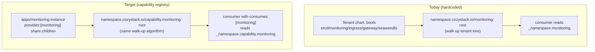

# Fold `extra` into `apps`: tenant modules as apps with visibility, cardinality, lock, and shared-provider capabilities

- **Title:** `Fold extra into apps — model tenant modules as apps with declarative capabilities`
- **Author(s):** `@myasnikovdaniil`
- **Date:** `2026-07-08`
- **Status:** Draft

## Overview

Cozystack ships packages in four buckets: `core`, `system`, `apps`, `extra`. This proposal retires the `extra` bucket. Every package currently under `packages/extra` becomes a regular `apps` package (or moves to `core`/`system` where it belongs), and the three things that actually distinguish an `extra` package from an `apps` package today — *it is hidden from the catalog*, *there is at most one per tenant*, and *it is shared down the tenant tree* — become **declarative capabilities on any app**, not a directory boundary.

The observation driving this: `extra` is not a distinct runtime mechanism. An `extra` package uses the same `PackageSource` registration, the same two chart patterns, and the same `ApplicationDefinition` as an `apps` package. The only differences are (a) a couple of dashboard/release flags and (b) the way the Tenant chart wires it up. If those differences are expressed as data on the `ApplicationDefinition`, the second bucket disappears and every app can opt into the behaviours previously reserved for `extra` — a catalog app can be a per-tenant singleton, a platform component can be hidden, and so on. This also supersedes [community#4](https://github.com/cozystack/community/pull/4) (tenant module overrides): once a module is a first-class app instance, per-tenant configuration is the instance's own values, and no override layer through the Tenant chart is needed.

etcd is deliberately **out of scope here**: it is handled by [community#25](https://github.com/cozystack/community/pull/25), which retires the etcd tenant module and folds etcd into the `kubernetes` app (one etcd per cluster). #25 is the one module where cross-tenant *sharing should be dropped*; this proposal covers the modules where sharing must be *kept* (monitoring, seaweedfs, ingress, gateway). The two proposals are complementary steps of the same direction — "retire the tenant module" — and together they retire every tenant module in `extra` (the etcd chart itself, which #25 keeps as the per-cluster implementation, is relocated by this proposal's directory unification like the rest).

## Scope and related proposals

- **[community#4](https://github.com/cozystack/community/pull/4) — Tenant module overrides (typed per-tenant `valuesOverride` objects replacing the Tenant bools, `@embed` schema embedding in cozyvalues-gen).** **Superseded by this proposal.** #4 keeps the tenant-module machinery and adds an override channel threaded through the Tenant chart; here the module *becomes* a first-class app instance, so per-tenant configuration is simply the app's own values — no embedded-schema override layer, no `@embed` directive. If this proposal is accepted, #4 should be closed as superseded.
- **[community#25](https://github.com/cozystack/community/pull/25) — Per-cluster etcd (retire the etcd tenant module, bind etcd to the `kubernetes` app).** Hard dependency in spirit, independent in code. #25 removes the single module whose sharing semantics we intentionally *drop*; this proposal keeps sharing for the rest. Note #25 keeps the etcd *chart* (`packages/extra/etcd`) alive as the per-cluster implementation (preferred as a subchart of `kubernetes`); relocating that chart out of `extra/` is part of this proposal's directory unification. After both land, nothing in `packages/extra` is a tenant module, and the directory is deleted.
- **[community#26](https://github.com/cozystack/community/issues/26) / [#27](https://github.com/cozystack/community/pull/27) → [#33](https://github.com/cozystack/community/pull/33) — ComputePlane.** **This is the live counter-direction: extend `extra` by one more module.** #27 (presets on `kind: Kubernetes`, no new kind) was closed in favour of #33, which delivers ComputePlane as an operator-owned **`extra` tenant module** (`packages/extra/computeplane`) wrapping `apps/kubernetes`, citing the `apps`-vs-`extra` split (website#594) as its packaging rationale. Because "tenant module" is a directory convention rather than a set of fields, #33 inherits the whole rigid bundle: a new parent-set bool on the Tenant chart (`computePlane`, rendered by a new `tenant/templates/computeplane.yaml`) instead of a first-class instance; no catalog presence and no per-instance tenant config — operator-fixed extras-style values with a curated-knobs escape hatch; and, because no reusable primitive exists, its own one-off `cozystack-api` visibility/mutation control (its Design §6), invented ad hoc for this module. That is the flexibility tax every module added this way pays, and #33 is concrete evidence that without this proposal `extra` keeps growing one hardcoded toggle at a time. Restated as capabilities, the posture #33 wants is a plain `apps/computeplane` with `visibility: module`, `cardinality: {scope: tenant, max: 1}`, `protection.edit: adminOnly`, `capability.share: none` (the default — #33 explicitly rejects parent-walk inheritance) — the same operator-owned, tenant-uneditable, per-tenant-singleton result, with the visibility/mutation control coming from the shared fields instead of a bespoke one. Practical note: #33 is open and the two need sequencing — either it lands first and computeplane is ported in phase 3 like the rest, or it targets `apps/` + capabilities from the start; its `placement` routing field is orthogonal and unaffected.
- **[cozystack/website#594](https://github.com/cozystack/website/pull/594) — docs explaining the current `apps` vs `extra` split (merged).** Documents the status quo accurately. If this proposal is accepted, that page must be revised (the `extra` section becomes an "app capabilities" section).

## Context

Package categories are rendered into the platform via `PackageSource` objects in `packages/core/platform/sources/<name>-application.yaml`. The relevant fact is that **`apps` and `extra` are registered identically**:

- `sources/postgres-application.yaml` → components `[apps/postgres, system/postgres-rd]`
- `sources/etcd-application.yaml` → components `[extra/etcd, system/etcd-rd]`

Both emit an `ApplicationDefinition` (the `*-rd` "resource definition" chart — a CozyRD, rendered from `packages/system/<name>-rd/cozyrds/`). Both use the same operator-backed / FluxCD-backed chart patterns. The **only** differences are:

1. **Dashboard flags on the `-rd`.** `extra` modules set `spec.dashboard.module: true` and `spec.dashboard.category: Administration`, plus the release label `internal.cozystack.io/tenantmodule: "true"` (bootbox is an exception: flags but no label). The two markers have two different consumers. The console (`packages/system/dashboard/images/console/apps/console/src/` — `routes/MarketplaceList.tsx`, `routes/ModulesPage.tsx`, `lib/app-definitions.ts`) reads the *flags*: definitions with `module: true` **and** `category: Administration` are *excluded* from the Marketplace and listed under **Administration → Modules** instead, configured per tenant. The *label* backs the `tenantmodules` aggregated API in `cozystack-api` (`pkg/registry/core/tenantmodule/rest.go`), which projects HelmReleases carrying it into the enabled-state registry that the Modules page queries. `apps` get a real `category` (`PaaS`/`IaaS`/`NaaS`) and appear in the Marketplace.

2. **Tenant wiring.** `packages/apps/tenant/values.yaml` exposes bool toggles `etcd`, `monitoring`, `ingress`, `gateway`, `seaweedfs` (`gateway` is tri-state: when the key is unset the chart auto-enables it for tenants with a derived apex, via the `tenant.gatewayEffective` helper). In `tenant/templates/namespace.yaml`, each toggle resolves a *provider* by walking up the tenant tree and writes it to a namespace label:

```gotemplate
{{- $monitoring := $parentNamespace.monitoring | default "" }}
{{- if .Values.monitoring }}
{{-   $monitoring = $tenantName }}
{{- end }}
# ...
namespace.cozystack.io/monitoring: {{ $monitoring | quote }}
```

The resolved value is the name of the nearest ancestor tenant (inclusive) that provides the module, propagated into child tenants' `_namespace.*` values. Consumer apps read `.Values._namespace.<module>` to find their provider — e.g. `apps/kubernetes` reads `_namespace.etcd` for its Kamaji `DataStore`; a child tenant without its own `monitoring` sends metrics to `_namespace.monitoring` (the parent's stack) instead of running a second copy.

**The taxonomy is already leaky**, which is evidence it is a convention, not a boundary:

- `extra/gateway` has **no `-rd`** at all — no dashboard/catalog presence; it exists purely as a Tenant toggle.
- `extra/external-dns` lives in `extra/` but its `-rd` is `category: Networking` with **no** `module` flag, **no** `tenantmodule` label and **no** Tenant toggle — it behaves like a normal app, not a tenant module.
- `extra/bootbox`'s `-rd` sets `module: true` + `category: Administration` but **omits** the `tenantmodule` release label — it is listed on the Modules page, yet its instances are invisible to the `tenantmodules` registry that reports enabled-state.
- `bootbox`/`bucket` appear under multiple package directories (`extra/bootbox` + `system/bootbox`; `apps/bucket` + `system/bucket`).

### The problem

> "I'm adding a new component. Does it go in `apps` or `extra`?"

Today the only way to answer is to internalise a convention — which is exactly why [website#594](https://github.com/cozystack/website/pull/594) had to be written. The distinction is real *behaviourally* (hidden / singleton / shared) but it is encoded as a directory plus a scattering of flags rather than as first-class, testable properties. Consequences:

- The behaviours that differ (hidden-from-catalog, one-per-tenant, shared-with-children, protected-from-deletion) are **not reusable** by a normal catalog app that legitimately wants one of them.
- The boundary is **not enforced or coherent** (gateway, external-dns above).
- Two mechanically identical packages live in two trees, doubling the "where does this go" surface for every contributor and every doc.
- The gravitational pull is toward **more** of it, not less: the newest component design ([#33](https://github.com/cozystack/community/pull/33), ComputePlane) defaults into `packages/extra` because the convention says enablers live there — another parent-set Tenant bool, another hidden module with operator-fixed values, and a bespoke visibility control invented because no reusable one exists (see Scope).

## Goals

- `packages/extra` no longer exists; each package moves to `apps` (or `core`/`system`), with no change to what it *does*.
- The `ApplicationDefinition` gains declarative fields for **visibility**, **cardinality**, **lock/protection**, and **capability provider/consumer** classes.
- The existing parent→child sharing for `monitoring` and `seaweedfs` (and `ingress`, `gateway`) behaves **identically** after migration: same nearest-ancestor-inclusive resolution, same fallback, same "child without its own X uses the parent's X".
- The dashboard renders the same set under **Administration → Modules**, driven by the visibility field instead of the `extra/` directory + `module` flag.
- A regular catalog app can opt into any capability (singleton, hidden, protected) **without changing directories**.
- Each capability is independently testable (helm-unittest / admission unit / e2e).

### Non-goals

- etcd's migration — owned by [community#25](https://github.com/cozystack/community/pull/25).
- Changing what any module does functionally.
- Redesigning dashboard information architecture beyond mapping the new visibility field onto the existing Marketplace / Modules split.
- Re-introducing multi-cluster shared etcd (explicitly removed by #25).

## Design

### 1. Directory unification

Move `packages/extra/*` into `packages/apps/*` (external-dns is already app-shaped; gateway may fold into the tenant/networking layer — see Open questions). Update the `sources/*-application.yaml` component paths and any bundle lists. This step is mechanical and behaviour-neutral on its own; the flags below carry the behaviour.

### 2. `ApplicationDefinition` capability fields (additive)

New `spec` fields, all optional with today's behaviour as the default:

```yaml
spec:
  dashboard:
    # replaces `module: true` + category:Administration + tenantmodule label
    visibility: catalog        # catalog | module | hidden
    category: PaaS             # unchanged; ignored when visibility=hidden
  cardinality:
    scope: tenant              # namespace | tenant | cluster
    max: 1                     # omit or 0 = unlimited (today's apps)
  protection:
    deletion: protect          # allow | protect  (protect = deny while referenced / platform-owned)
    edit: adminOnly            # allow | adminOnly
  capability:
    provides: [monitoring]     # named capability classes this instance offers
    consumes: [monitoring]     # classes this instance discovers a provider for
    share: none                # none | children — offer provided classes down the tenant tree
```

- **`visibility`** — `catalog` (Marketplace, today's apps), `module` (excluded from Marketplace, shown under Administration → Modules, today's `extra`), `hidden` (no dashboard surface, today's gateway). The console filter that today reads `dashboard.module === true && category === "Administration"` reads `visibility` instead. The `tenantmodules` aggregated API (`cozystack-api`, `pkg/registry/core/tenantmodule/rest.go`), which today selects HelmReleases by the hand-set `internal.cozystack.io/tenantmodule` release label, is re-keyed the same way: the platform derives the label from `visibility: module` (a platform-managed output of the field, not a per-`-rd` convention), so the registry — and the Modules page's enabled-state — keeps working unchanged through the compat window.
- **`cardinality`** — enforced at admission time in `cozystack-api`: creating an instance beyond `max` within `scope` is rejected with a clear message (`max: 1, scope: tenant` reproduces today's per-tenant singletons). Also drives a dashboard "you already have one" affordance. Caveat: only creations that pass through the aggregated API are gated — a `HelmRelease` authored directly, or one rendered by the Tenant sugar (§4), bypasses it; the enforcement point for those paths is an Open question.
- **`protection`** — `deletion: protect` denies deletion of an instance that other instances still reference (or that the platform owns), via a finalizer or validating webhook; `edit: adminOnly` gates mutation by RBAC. This makes explicit today's implicit "you can't delete the tenant's monitoring out from under its children".
- **`capability`** — the discovery primitive (next section). `share` controls the reach of `provides`: `none` (default) — the instance serves its own tenant only, today's non-shared apps (and the posture ComputePlane needs — #33 explicitly rejects parent-walk inheritance); `children` — the provided classes are offered to descendant tenants via the nearest-ancestor resolution in §3, today's shared tenant modules (monitoring, seaweedfs, ingress, gateway). `share` is meaningful only alongside `provides`. (An earlier draft floated a separate `ScopeClass` object for this; dropped — nothing in the repo has such an indirection, and one field on the definition covers every case this proposal needs.)

### 3. Shared-provider mechanism (preserves the monitoring/seaweedfs links)

This is the load-bearing part: the parent→child inheritance **must not regress**. The current implementation already *is* a provider-discovery system — it is just hardcoded to five keys in `tenant/templates/namespace.yaml`. Generalise it from a fixed set to a **capability-class registry**, keeping the exact algorithm:

1. An app instance with `capability.provides: [monitoring]` created in a tenant namespace, marked shareable (`capability.share: children`, §2), causes the platform to set on the tenant's namespace `namespace.cozystack.io/capability.monitoring: <tenantName>` and to propagate it into descendant tenants' `_namespace.capability.monitoring` — **the same label + `_namespace` propagation that exists today**, keyed by capability class instead of a hardcoded name. One honest difference: the *resolution algorithm* is unchanged, but the *writer* moves — from Helm render time into a controller. The writer specification below pins down who writes what.
2. A consumer app with `capability.consumes: [monitoring]` resolves the nearest ancestor provider from `_namespace.capability.monitoring`, with the identical nearest-ancestor-inclusive fallback (child's own provider wins; otherwise the parent's; otherwise none → the existing `awaiting-*` beacon pattern, cf. `apps/kubernetes`'s `awaiting-etcd`).

**Writer specification.** Today's writer is render-time: `tenant/templates/namespace.yaml` computes the five provider names from the Tenant chart's bools plus the parent's `_namespace.*`, stamps them as `namespace.cozystack.io/<module>` labels on the child Namespace, and writes them into the child's `cozystack-values` Secret (labelled `reconcile.fluxcd.io/watch: Enabled`); every app HelmRelease has `valuesFrom: cozystack-values` pinned by `cozystack-api` (`pkg/registry/apps/application/rest.go`) and by the ApplicationDefinition helm reconciler (`internal/controller/applicationdefinition_helmreconciler.go`), so a Secret change re-reconciles the consumers. There is no tenant reconciler in Go today, and while render time *can* observe cluster state (`namespace.yaml` already `lookup`s the parent Namespace for its ownerReference uid), it cannot *fire*: creating a provider instance in tenant X touches nothing that any descendant tenant's release watches, so a lookup-based read-back through the existing `_namespace.*` path would converge only on the periodic reconcile interval — staleness unbounded and multiplied per tree level — and would render empty under helm-unittest. The new trigger needs a controller. **The owner is a new capability reconciler in the existing `cozystack-controller`** (`cmd/cozystack-controller`) — the binary that already hosts the tenant-namespace-label-adjacent reconcilers (`internal/controller/tenantgateway` consumes `namespace.cozystack.io/gateway` and renders cross-namespace ReferenceGrants; `tenantquota`; and the ApplicationDefinition reconcilers already watch both `ApplicationDefinition`s and app HelmReleases). *Trigger → write → propagate:* watch app HelmReleases (already labelled `apps.cozystack.io/application.kind`), join to the owning `ApplicationDefinition`'s `capability.provides` + `share: children`; when a provider instance exists in tenant *X*, SSA-apply `namespace.cozystack.io/capability.<class>: X` on *X*'s namespace and on every descendant tenant namespace without a nearer provider — "descendants of *X*" is a plain label selector, because every tenant namespace already carries its full ancestor chain as `tenant.cozystack.io/<ancestor>` labels (`tenant.ancestorTenantLabels`) — and write the matching `_namespace.capability.*` values. *Values vehicle:* the controller must **not** co-write `cozystack-values` — its `_namespace.*` lives inside the single `values.yaml` stringData key that the Tenant chart re-renders wholesale, so two writers of one field would fight on every tenant upgrade. It owns a second, controller-managed Secret per tenant namespace instead (working name `cozystack-capability-values`), likewise labelled `reconcile.fluxcd.io/watch: Enabled` and appended as an optional `valuesFrom` at the same two injection points — descendant releases re-resolve on change through the identical Flux watch mechanism. Those two injection points are verified single-writer chokepoints, which makes the append well-defined: `rest.go` hardcodes `ValuesFrom: [{Secret cozystack-values}]` on every HelmRelease it emits, and the helm reconciler's `expectedValuesFrom()` + `valuesFromEqual` actively *revert* any HelmRelease whose `valuesFrom` list diverges from the expected one (the comparison covers `Optional` too) — so this is a code change at exactly those two sites, after which the same enforcement guarantees every app HelmRelease carries both references, and nothing else can add or strip entries. Merge order is safe by helm-controller's composition rules: `valuesFrom` entries deep-merge in list order (later wins), then inline `spec.values` merges last — so the capability Secret, second in the list, nests `_namespace.capability.*` under `_namespace` alongside the legacy keys without touching them (only an identical leaf key could collide, which is exactly why the capability keyspace is `capability.<class>` rather than reusing `_namespace.<module>`), and the user's own app values keep their existing precedence over both Secrets (`Values: app.Spec` in `rest.go` — inline values already outrank `cozystack-values` today, unchanged trust property). Note the Secret is load-bearing as the *trigger*, not just the vehicle: the `reconcile.fluxcd.io/watch: Enabled` label is what re-reconciles descendant releases when a value changes — a namespace label alone re-renders nothing, which is why "consumers read the capability label directly" is not a simpler alternative. Net effect on the consumer contract: consumers keep the exact `.Values._namespace.*` read pattern; only the key gains a `capability.` segment, and during the compat window both keys resolve. *Who wins during the compat window:* nobody has to — ownership is disjoint, not merged. The Tenant chart (helm-controller's field manager) stays the sole writer of the legacy label keys (`namespace.cozystack.io/monitoring`, …) and of `cozystack-values`; the capability reconciler (its own SSA field manager) is the sole writer of the `namespace.cozystack.io/capability.*` keys and of its own Secret. Disjoint label keys on the Namespace and disjoint Secret objects mean the two field managers never contend, and a Tenant-chart upgrade cannot strip labels it never owned; phase 4 is simply the Tenant chart ceasing to emit the legacy keys. (Home: **recommended `cozystack-controller`** — confirm with maintainers, but the evidence is one-sided rather than taste. That binary already registers every watch surface this reconciler needs (`cmd/cozystack-controller/main.go`): the ApplicationDefinition reconcilers that manage app HelmReleases by the `apps.cozystack.io/application.*` labels, and `tenantgateway`, which already does the exact shape of write proposed here — SSA-patching a `namespace.cozystack.io/*` label onto tenant namespaces (`ensureNamespaceLabels` / `patchNamespaceGatewayLabel`, `internal/controller/tenantgateway/reconciler.go`). `cozystack-operator` registers only the PackageSource/Package reconcilers plus `cozyvaluesreplicator`, whose target selector is `cozystack.io/system=true` (`cmd/cozystack-operator/main.go`) — platform bootstrap and system-namespace scope, with no tenant-namespace, ApplicationDefinition, or app-HelmRelease watches. The capability write path is tenantgateway-shaped, not replicator-shaped.)



Because the algorithm is unchanged, the migration is a **rename of the label keyspace**, not a redesign. During the compat window (Rollout phase 2) both label sets are present — the Tenant chart keeps rendering the legacy `namespace.cozystack.io/monitoring` keys exactly as today, the capability reconciler adds `capability.monitoring` (disjoint writers, per the writer specification above) — so unported consumers keep resolving.

### 4. Tenant chart changes

The `etcd/monitoring/ingress/gateway/seaweedfs` bools on `apps/tenant` become **sugar** that provisions the corresponding app instance with `capability.share: children` in the tenant namespace, instead of open-coding the module. The bools stay as compatibility aliases through the deprecation window (Open questions asks whether to keep them long-term). `etcd` is removed from this set by #25.

### 5. Migration

Per module, a numbered platform migration using the existing mechanism: `packages/core/platform/images/migrations/` ships sequential shell migrations (currently `1`–`51`, `migrations.targetVersion: 52` in the platform values) executed by the pre-install/pre-upgrade Helm hook Job in `packages/core/platform/templates/migration-hook.yaml`, gated on the `cozystack-version` ConfigMap in `cozy-system` (each script stamps the next version via `stamp_cozystack_version`). Each ported module ships one such migration that: (1) relabels the existing `HelmRelease` / `ApplicationDefinition` to the new `apps` identity — no redeploy of the running workload, rename identity not restart; (2) preserves the namespace capability labels, emitting both legacy + new; (3) is safe to re-run. Two precision notes against the actual mechanism: the version stamp is a **single global sequential counter**, not a per-module stamp — "per module" means one numbered cluster-wide script per ported module, run once in order, not independently gated per module; and idempotency is **authored per script, not framework-enforced** — it is required (the hook Job retries with `backoffLimit: 3` from the same `CURRENT_VERSION`, so a script may re-execute after partial progress) and it is established convention with exactly the precedent this needs: migration `29` rewrites `virtual-machine` HelmReleases into `vm-disk`/`vm-instance` in place and is explicitly marked "Idempotent: safe to re-run", and migration `30` reshapes HelmRelease values the same way.

**Do these migrations actually run in real installs?** Yes — the enablement is traceable end-to-end. `migrations.enabled: false` holds only in the base `packages/core/platform/values.yaml`; every deployment-variant overlay flips it to `true` (`values-isp-full.yaml`, `values-isp-hosted.yaml`, `values-isp-full-generic.yaml` — first two lines of each). The platform `PackageSource` hardcodes four variants (`installPlatformPackageSource`, `cmd/cozystack-operator/main.go`): `default` renders `values.yaml` alone; each `isp-*` variant layers its overlay, which the PackageSource reconciler bakes into the chart artifact's effective `values.yaml` via ArtifactGenerator copy ops (Overwrite base, then Merge overlay — `internal/operator/packagesource_reconciler.go`). Every in-repo install path selects an `isp-*` variant: the installer's example Platform Package (`packages/core/installer/example/platform.yaml`, `variant: isp-full`), e2e (`hack/e2e-install-cozystack.bats`, `variant: isp-full`), and the v0.x→v1.0 migration script, which maps legacy bundle names `paas-*` → `isp-*` (`hack/migrate-to-version-1.0.sh`). So on any normally-installed cluster the pre-upgrade hook runs the pending migrations; the only in-repo path that skips them is a platform Package with `spec.variant: default` (or unset — the Package reconciler defaults to `default`, `internal/operator/package_reconciler.go`), which nothing in the repo uses for the platform. One further mechanic that looks like a gap and is not: even with `enabled: true`, the hook Job renders only when the `cozystack-version` ConfigMap already exists with `version < targetVersion` (`migration-hook.yaml`); on a fresh install the ConfigMap is absent, so no hook runs and `cozystack-version.yaml` stamps the counter directly at `targetVersion` — fresh clusters correctly skip all migrations instead of replaying them.

## User-facing changes

- **Dashboard:** unchanged for users. Administration → Modules shows the same set, now selected by `visibility: module` rather than the `extra/` directory. The Marketplace is unchanged.
- **CRD shape:** `ApplicationDefinition` gains the optional fields above; existing definitions stay valid unchanged.
- **Contributors:** one directory (`apps`) plus a short set of declarative fields, instead of an `apps`-vs-`extra` decision. The website page that #594 added is rewritten from "two categories" to "one category + capabilities".
- **Tenant admins:** the Tenant toggles keep working during the window; the underlying object becomes a first-class, inspectable app instance.

## Upgrade and rollback compatibility

- All new `ApplicationDefinition` fields are **additive** with today's behaviour as default → existing clusters keep working before any package is ported.
- The provider-label change ships behind a **compat window** that emits both the legacy and new labels, and keeps the Tenant bools as aliases, so mixed old/new consumers resolve throughout.
- Migrations are authored idempotent and gated by the `cozystack-version` stamp (one global sequential counter — §5), and the hook is enabled in every real install variant (`isp-*` overlays — §5); a rollback to a prior platform version leaves the legacy labels in place, so consumers still resolve.
- The directory move is a git-level change, not a runtime one; running releases are relabelled, not recreated. No data-path is touched.

## Security

- **Provider labels stay platform-managed.** `namespace.cozystack.io/capability.*` must remain writable only by the platform (same trust boundary as today's `namespace.cozystack.io/monitoring`), so a tenant cannot point a capability at another tenant's provider or hijack discovery. This must be enforced in the admission/RBAC rules.
- **`protection: protect` improves posture** — it prevents accidental deletion of shared infrastructure that descendants depend on (today this is only implicit).
- No new secrets are stored or transmitted; capability discovery carries a tenant name, not credentials. Credentials continue to flow through the existing per-module secrets.

## Failure and edge cases

- Creating a second instance of a `max: 1` app → admission rejects with a cardinality message; nothing is provisioned.
- Deleting a provider still referenced by children with `deletion: protect` → denied with the list of referencing consumers (policy: deny; cascade behaviour is an Open question).
- Child enables its own `monitoring` while the parent also provides one → child becomes its own provider (nearest-ancestor-inclusive), identical to today.
- Consumer with no provider up-tree → the existing `awaiting-*` beacon pattern: the chart renders only a beacon ConfigMap with a human-readable message, the release reconciles clean (not errored), and the workload provisions on a later reconcile once a provider appears (matches `apps/kubernetes` `awaiting-etcd` today, `templates/cluster.yaml`).
- Migration runs twice → idempotent no-op.
- A package still referencing the legacy label after phase 4 → caught by e2e (metrics-routing / bucket-creation assertions) before the legacy labels are dropped.

## Testing

- **helm-unittest:** the new `ApplicationDefinition` fields render; the tenant sugar provisions the expected app instance; both legacy + new labels emitted during the compat window.
- **cozystack-api admission unit tests:** cardinality rejection at `max`; protection denial while referenced; visibility filtering.
- **e2e:** parent `monitoring` + child inheritance still routes child metrics to the parent stack; `seaweedfs` → `apps/bucket` still creates buckets; `gateway` hidden app still auto-provisions for derived-apex tenants; migration on an upgraded cluster leaves workloads Running.

## Rollout

1. **Fields + enforcement.** Add `ApplicationDefinition` visibility / cardinality / protection / capability fields and the `cozystack-api` admission logic. No behaviour change; apps opt in. Console reads `visibility` (falls back to the old `module` flag).
2. **Generalise discovery.** Ship the capability reconciler in `cozystack-controller` plus the `cozystack-capability-values` Secret and its `valuesFrom` injection; `tenant/templates/namespace.yaml` keeps rendering the five legacy keys unchanged, so both label sets are present (§3 writer specification).
3. **Port modules.** Move `extra/{monitoring,seaweedfs,ingress,gateway,external-dns,bootbox,info}` into `apps` with visibility/cardinality/capability set; Tenant bools become aliases; ship version-stamped migrations — these reliably run on real upgrades, since every in-repo install variant (`isp-*`) enables the migration hook (§5). (etcd is handled in parallel by #25.)
4. **Drop compat.** Remove legacy labels and Tenant-bool aliases; delete the `extra` bucket; revise the website docs (the section #594 added).

## Open questions

- Model tenant singletons as `cardinality.scope: tenant, max: 1`, or introduce a distinct "tenant service" flavour? (Prefer the former — fewer concepts.)
- Keep the Tenant bools as permanent ergonomic sugar, or force explicit app creation after phase 4?
- `protection`: finalizer vs validating webhook vs RBAC-only — which enforcement?
- Cardinality enforcement point: `cozystack-api` admission only sees instances created through the aggregated API; the Tenant sugar (§4) and hand-authored `HelmRelease`s do not pass through it. Enforce additionally at the `HelmRelease` level (validating webhook / policy), or treat platform-rendered releases as trusted and document the gap?
- Does `external-dns` become a normal catalog app or a `module`? Resolving its current anomaly is part of this work either way.
- Should `gateway` remain a `hidden` app or fold entirely into the tenant networking layer (it already has no `-rd`)?

## Alternatives considered

- **Keep `extra`, only fix the docs (website#594) — and keep extending it module-by-module.** This is the de-facto mainline, not a strawman: [#33](https://github.com/cozystack/community/pull/33) already adds `packages/extra/computeplane` on exactly this basis. Rejected: accurate for today but leaves the duplicated machinery, the gateway/external-dns anomalies, keeps the behaviours non-reusable by regular apps — and charges every future enabler the flexibility tax #33 is about to pay (fixed toggle-plus-hidden-module shape, no per-instance config, ad-hoc access control per module).
- **Make `extra` a hard runtime boundary (enforce the split).** Rejected: adds machinery to defend a distinction with no runtime need; the opposite of the simplification here.
- **A new CRD kind per module type.** Rejected for the same reason the ComputePlane thread ([#26](https://github.com/cozystack/community/issues/26), and [#33](https://github.com/cozystack/community/pull/33) after it superseded [#27](https://github.com/cozystack/community/pull/27)) avoids a new CRD and a new controller: prefer declarative capabilities on the existing `ApplicationDefinition` over new kinds.
- **Per-tenant etcd sharing kept as a capability here.** Rejected/deferred to [#25](https://github.com/cozystack/community/pull/25), which argues etcd should be per-cluster (no sharing) for isolation and self-service — the one module where the sharing semantics this proposal preserves are the wrong default.

---

<!-- Grounded in code as of cozystack main @ cece5c23b (v1.6.0-rc.1, 2026-07-07): packages/apps/tenant/templates/namespace.yaml + _helpers.tpl (provider resolution, ancestorTenantLabels), packages/system/*-rd/cozyrds/ (dashboard flags), packages/system/dashboard/images/console/apps/console/src/ — routes/MarketplaceList.tsx + routes/ModulesPage.tsx + lib/app-definitions.ts (visibility), pkg/registry/core/tenantmodule/rest.go (tenantmodules registry), pkg/registry/apps/application/rest.go + internal/controller/applicationdefinition_helmreconciler.go (valuesFrom: cozystack-values injection), cmd/cozystack-controller + internal/controller/{tenantgateway,tenantquota} (writer-spec home), cmd/cozystack-operator + internal/cozyvaluesreplicator (system-namespace values replication), api/v1alpha1/applicationdefinitions_types.go (CRD), packages/core/platform/sources/*-application.yaml (registration), packages/core/platform/templates/migration-hook.yaml + images/migrations/ (migration mechanism), packages/core/platform/values.yaml + values-isp-{full,hosted,full-generic}.yaml + templates/cozystack-version.yaml, cmd/cozystack-operator/main.go (installPlatformPackageSource variant table; cozy-values-namespace-selector default) + internal/operator/{package_reconciler,packagesource_reconciler}.go + packages/core/installer/example/platform.yaml + hack/e2e-install-cozystack.bats + hack/migrate-to-version-1.0.sh (migration enablement path), cmd/cozystack-controller/main.go (registered reconcilers). ComputePlane framing grounded in cozystack/community#33 (gh pr view/diff, 2026-07-15). -->
