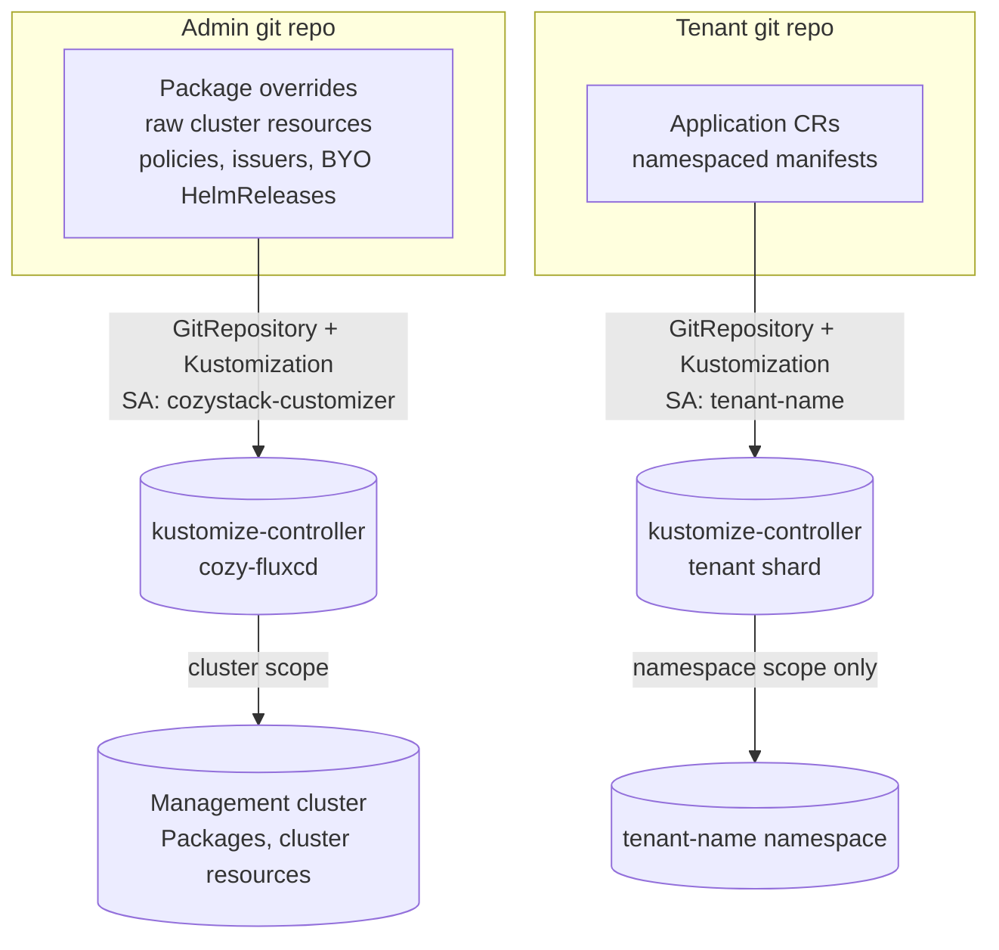

# GitOps Configuration Surfaces for Cozystack

- **Title:** `GitOps Configuration Surfaces: admin and tenant self-service from git`
- **Author(s):** `@myasnikovdaniil`
- **Date:** `2026-06-17`
- **Status:** Draft

## Overview

Cozystack ships a complete Flux control plane but exposes almost none of it to the people running the cluster. Admins configure the platform by hand-patching Package CRs and applying raw manifests with `kubectl`; tenants configure their apps through the dashboard or one-off `kubectl apply`. Both paths produce configuration drift and neither is reproducible. Meanwhile the source-controller and kustomize-controller needed to reconcile a git repository are *already running* in the management cluster — they are just not offered as a product surface.

This proposal defines a single primitive — **a reconciled GitOps surface** (`GitRepository` + `Kustomization` + a scoped `ServiceAccount`) — and instantiates it at two trust tiers: a **platform GitOps** surface for admins (cluster scope) and a **tenant GitOps** surface for tenant users (namespace scope). It also proposes an **admin override layer** so that the most common admin task — changing component parameters — does not require fighting Helm over field ownership. The first increment (the admin surface) is already prototyped in [cozystack/cozystack#2731](https://github.com/cozystack/cozystack/pull/2731).

## Scope and related proposals

- **First increment — admin surface:** [cozystack/cozystack#2731](https://github.com/cozystack/cozystack/pull/2731) (`feat(platform): add cozystack.customizer system package`) implements Tool 1, Phase 1. This proposal generalizes that PR and gives it a home in the larger model.
- **Deferred to follow-up proposals** (intentionally not designed in full here): field-ownership enforcement via `ValidatingAdmissionPolicy` / admission webhook on `packages.cozystack.io` (sketched under Security; full design is separate); and a delegated mid-tier between cluster-admin and tenant (team-scoped admins).
- This proposal should land before the tenant surface (Tool 2) is implemented, because the unifying primitive and the multitenancy-lockdown decision are shared.

## Context

Cozystack delivers everything through Flux. The relevant pieces today:

- **Management Flux is real and complete.** `internal/fluxinstall` (embedded in the cozystack-operator) installs source-controller, kustomize-controller, helm-controller, and notification-controller into the `cozy-fluxcd` namespace, watching all namespaces. An admin-created `GitRepository` + `Kustomization` in `cozy-system` reconciles today with no new controllers. API versions in use: `source.toolkit.fluxcd.io/v1`, `kustomize.toolkit.fluxcd.io/v1`, `helm.toolkit.fluxcd.io/v2`.
- **The Package CRD is the platform's config unit.** `api/v1alpha1/package_types.go` (`scope=Cluster`). A `Package` selects a variant and carries component values. Two very different lifecycles exist:
  - **The bootstrap Package** `cozystack.cozystack-platform` is **created by hand** at install time — operators copy `packages/core/installer/example/platform.yaml`, edit `spec.variant` and `spec.components.platform.values`, and `kubectl apply` it. No controller owns its spec.
  - **Downstream Packages** (`cozystack.linstor`, `cozystack.cilium`, …) are **rendered by the platform chart** (`packages/core/platform`) with `helm.sh/resource-policy: keep` and are owned by helm-controller.
- **Most admin config is Package values, not raw resources.** VM golden images live in `packages/system/vm-default-images` values; LINSTOR parameters in `packages/system/linstor` values; cert-manager `ClusterIssuer`s are driven by `packages/core/platform` values → the `cozystack-values` Secret in `cozy-system` → the `cert-manager-issuers` chart.
- **Tenants cannot self-GitOps.** A `Tenant` (`apps.cozystack.io`) produces a `tenant-<name>` namespace, a ServiceAccount named `<tenant-name>`, and `cozy:tenant:*` ClusterRoles. Tenants create curated **Application** CRs (e.g. Postgres, Kafka, VM) which the aggregated apiserver converts into HelmReleases reconciled by a sharded helm-controller (`sharding.fluxcd.io/key: tenants`). Tenants have **no RBAC for `source`/`kustomize` CRDs** and there is **no tenant-scoped source/kustomize reconciliation**. The shipped `flux-instance` sets `multitenant: false` (`packages/system/fluxcd/charts/flux-instance/values.yaml`).

### The problem

- *"I changed the LINSTOR auto-diskful timeout on a node by hand last month and now I can't remember which clusters got it."* — admin config is imperative and drifts.
- *"To set up DR I'd need to reconstruct every `kubectl patch` I ever ran."* — there is no single source of truth for cluster configuration.
- *"My team already keeps our app manifests in git. I want Cozystack to reconcile them into my tenant, but all I can do is click in the dashboard or `kubectl apply` and hope nobody else changed it."* — tenants have no GitOps path even though Flux is right there.
- *"I patched a downstream Package's values and Helm silently took the field back on the next reconcile (or I silently took Helm's)."* — patching chart-owned Packages races helm-controller because kustomize-controller hardcodes `client.ForceOwnership`.

## Goals

- Provide an opt-in, declarative GitOps surface for **admins** that reconciles an admin-owned repo into the management cluster.
- Provide an opt-in, declarative GitOps surface for **tenants** that reconciles a tenant-owned repo into that tenant's namespace, isolated to that tenant's existing RBAC.
- Make the common admin task — overriding component parameters (versions, golden-image values, LINSTOR options) — possible **without** racing helm-controller for field ownership.
- Define one shared primitive and reuse it across tiers, rather than shipping unrelated one-off tools.
- Keep all surfaces **off by default**; an operator opts in per cluster / per tenant.
- Establish an honest, documented trust model for each tier.

### Non-goals

- This proposal does **not** reduce the capability of an admin below what they already have by hand. The admin surface is a cluster-admin-equivalent credential by design.
- It does **not** fully specify the field-ownership admission policy (separate proposal).
- It does **not** introduce a per-tenant Flux *instance*; tenant reconciliation reuses the shared controllers with isolation enforced by RBAC + lockdown.
- It does **not** add multi-cluster / fleet management.

## Design

### The unifying primitive

Every use case is the same atom:

```
GitRepository + Kustomization + a scoped ServiceAccount → reconciled by cozy-fluxcd
```

Only two things vary: **(a)** the trust level of the ServiceAccount and **(b)** the isolation guarantees enforced on its Kustomization. We therefore build one parameterized chart and bind it to different SAs at different scopes.



### Tool 1 — Platform GitOps (admin, cluster scope)

Generalizes [#2731](https://github.com/cozystack/cozystack/pull/2731). A system package (`cozystack.customizer`) provisions, in `cozy-system`: a `GitRepository` pointing at an admin-owned repo (auth Secret pre-created by the admin); a `Kustomization` reconciled by a curated `cozystack-customizer` ServiceAccount; and the RBAC that SA needs.

**Trust model (explicit):** write access to the admin repo is equivalent to cluster-admin. This is not a weakening of the platform — an operator who can `kubectl patch` already has this power. The surface *legitimizes and records* what was previously done by hand. Documentation must state this plainly, so the repo and its git credentials are protected like a kubeconfig.

This tool covers admin use cases directly: changing platform parameters (UC1), managing arbitrary cluster resources outside the core API — custom `ClusterIssuer`s, LINSTOR `StoragePool`s, BYO `HelmRelease`s, `NetworkPolicy`, custom CRDs (UC3) — plus secrets-as-code, policy-as-code, environment overlays, and ultimately whole-cluster reproducibility / DR.

#### Package ownership: two classes, two stories

The single most important design point. RBAC is object-level; the contract we need is field-level. The two Package lifecycles diverge here:

| | bootstrap `cozystack.cozystack-platform` | downstream `cozystack.linstor`, … |
|---|---|---|
| Created by | hand (`kubectl apply` from the installer example) | the platform chart (`resource-policy: keep`) |
| Spec field manager | the operator — **no controller** | **helm-controller** |
| Force-ownership risk | **none** — nothing competes | **real** — claiming a chart-owned field steals it |

- **Bootstrap Package:** because no controller owns its spec, the admin repo can simply **own it**. The recommended flow is *self-adoption*: bootstrap once by hand with the customizer enabled, then commit the same Package manifest to the repo; from then on the repo is its source of truth (the standard `flux bootstrap` pattern). Use Server-Side Apply with a *partial* Package manifest to own only the fields you manage.
- **Downstream Packages:** patching them races helm-controller. We do **not** solve this by denying access (that would re-introduce hand-management of exactly the parameters admins care about). We solve it with an override layer (below) and, later, an admission policy.

#### Admin override layer (for UC1b — component parameters)

Today, changing a downstream component's parameters (e.g. `linstor.autoDiskful.minutes`, a golden-image URL, a pinned version) means patching a *chart-owned* Package — the contested case. We solve it by **splitting the override layer out of the Package into its own resource**, extending the existing API with a third kind:

| kind | owner | role |
|---|---|---|
| `PackageSource` | platform (unchanged) | charts + variants |
| `Package` | the platform chart (`resource-policy: keep`) | the reconciled, system-owned layer |
| `PackageValues` (new) | the admin repo | the human-owned override layer |

A `PackageValues` object carries per-package admin overrides; the operator merges it over the matching Package's values when it builds the HelmRelease:

```yaml
apiVersion: cozystack.io/v1alpha1
kind: PackageValues
metadata:
  name: cozystack.linstor      # 1:1 with the target Package by name
spec:
  components:
    linstor:
      values:
        autoDiskful:
          minutes: 10
```

Because the chart never writes `PackageValues` and the admin never writes the chart-owned `Package`, **there is no field for the admin and helm-controller to fight over** — the force-ownership race is removed structurally, not merely sidestepped. This is *not* a sibling `cozystack-values`-style Secret (the operator hardcodes a single `valuesFrom` and resets others); `PackageValues` is a first-class CR the operator itself merges into `hr.Spec.Values`, so it cooperates with the existing reconcile path.

The split is **additive**: with no `PackageValues` present, the operator path is byte-identical to today, so existing clusters are unaffected (see Upgrade compatibility). It also makes ownership enforceable by ordinary object-level RBAC — the admin GitOps SA gets write on `PackageValues` and read-only on `Package` — which is the discipline that keeps admins off chart-owned objects entirely, the foundation for whole-cluster reproducibility (UC5).

*Alternative — `packageOverrides` on the bootstrap Package.* The same overrides can instead be carried as a `packageOverrides.<name>` map under `spec.components.platform.values` on the hand-owned bootstrap Package, with the platform chart merging them into each downstream Package at render time. This ships with no API change (pure chart templating) and collapses all admin config into one object, but it sidesteps the race rather than removing it, gives all-or-nothing RBAC on one god-object, and pushes list-vs-map merge correctness into per-package templates. Kept as a lighter-weight fallback; since `PackageValues` is additive, `packageOverrides` could even ship first as an interim.

### Tool 2 — Tenant GitOps (tenant, namespace scope)

Delivered as a **catalog app**, not a `Tenant` API change — it is opt-in per tenant, requires no operator change, and fits the existing app model.

- New app package `packages/apps/gitops` + ApplicationDefinition in `packages/system/gitops-rd`. When a tenant instantiates it, the chart renders, in the tenant namespace, a `GitRepository` + `Kustomization` with `spec.serviceAccountName: <tenant-name>` — the tenant's **existing** SA, which already holds `cozy:tenant:admin`.
- Because reconciliation runs as the tenant SA, isolation is **RBAC-enforced by construction**: a tenant can only create what `cozy:tenant:*` permits, inside its own namespace subtree. Tenants point the surface at a repo of Application CRs and namespaced manifests.

#### Isolation hardening

A tenant must not be able to (a) reconcile into another namespace, or (b) borrow a more privileged SA. Two options, recommendation first:

1. **Dedicated tenant kustomize-controller shard** (recommended) — mirror the existing `flux-tenants` helm-controller shard. Run a kustomize-controller selecting `sharding.fluxcd.io/key: tenants`, started with `--no-cross-namespace-refs` and a default-service-account lockdown, so the restrictions apply *only* to tenant reconciliation and platform Kustomizations are unaffected. This matches a pattern Cozystack already uses.
2. **Global Flux multitenancy flags** — flip the `flux-instance` `multitenant` setting and apply `--no-cross-namespace-refs` cluster-wide. Simpler, but it constrains the platform's own Kustomizations and is a larger blast radius.

### Cross-cutting capabilities

- **Secrets-as-code:** SOPS/age decryption (the customizer already exposes a `decryption` block) for admins; per-namespace decryption keys (or external-secrets) for tenants. One design, two scopes.
- **Status surfacing:** expose `Kustomization` / `GitRepository` sync status in the dashboard via a `TenantModule`-style read-only view, so admins and tenants see drift without raw Flux access.

## User-facing changes

- **Admins:** a single `customizer.enabled` flag (plus `source`/`kustomization`/`rbac` blocks) in the platform values, off by default. When enabled, the admin manages the cluster from a git repo; component parameters are set via `PackageValues` resources.
- **Tenants:** a new **GitOps** entry in the app catalog. Instantiating it lets a tenant register a git repo that reconciles into their namespace. Sync status appears in the dashboard.
- **Docs:** a new `operations/customizer` (admin) page and a tenant GitOps how-to, including the explicit trust model and the bootstrap-vs-downstream ownership rules.

## Upgrade and rollback compatibility

- Fully **additive and opt-in**; existing clusters are unaffected until an operator enables a surface. No migration required.
- The `PackageValues` resource is additive: with none present, the operator builds HelmReleases exactly as today, so charts use their current defaults. (The `packageOverrides` alternative is equally backward compatible — absent the key, charts use their current defaults.)
- **Rollback:** disabling a surface stops emitting its resources. Note that platform Packages carry `helm.sh/resource-policy: keep`, so the customizer Package and its child objects are **not** auto-deleted on disable — teardown is a documented manual step (this is existing platform behavior, called out here so it is not surprising).
- Self-adoption of the bootstrap Package is reversible: stop reconciling it from the repo and resume hand-management; nothing about the object changes.

## Security

This is the heart of the proposal; each tier has a distinct, **explicit** trust boundary.

- **Tool 1 (admin):** repo write == cluster-admin, by design and by documentation. The curated ClusterRole in the prototype (patch-not-delete on Packages, no CRDs, etc.) is *defense against accident, not against intent* — anyone with repo write can escalate, so the docs must not over-claim a boundary. New trust surface introduced: an admin git repo + its credentials (protect like a kubeconfig), and a standing, self-healing reconciling credential whose blast radius equals an admin's.
- **Tool 1 footguns to narrow** (they cost nothing functionally): source access should not let the customizer rewrite the platform's *own* supply chain (the `cozystack-packages` OCIRepository in `cozy-system`), so scope write away from `cozy-system`; and field ownership on downstream Packages should eventually be enforced by a `ValidatingAdmissionPolicy` scoped to the customizer SA that rejects changes to fields currently managed by helm-controller (detected via `managedFields`), leaving the hand-owned bootstrap Package free. Until then, the `PackageValues` resource keeps admins off chart-owned objects entirely — they write `PackageValues`, never the chart-owned `Package` — so the contract is structurally avoided rather than merely documented.
- **Tool 2 (tenant):** the surface runs as the tenant's own SA, so it can do nothing the tenant cannot already do via the API. The new risk is **cross-namespace / SA-borrowing**, closed by the tenant shard lockdown (`--no-cross-namespace-refs`, forced `serviceAccountName`). Tenant-supplied input = the contents of a tenant-owned repo, bounded by `cozy:tenant:*`.
- **Secrets:** both tiers may pull git credentials and SOPS keys. These are admin/tenant pre-created Secrets; the platform never generates or owns them.

## Failure and edge cases

- Missing `source.url` / `kustomization.path` when enabled → chart `fail`s at render; Flux surfaces the error on HelmRelease status (already implemented in the prototype).
- Private repo without a `secretRef` → GitRepository reports auth failure on its status; no partial apply.
- Admin manifest declares a chart-owned Package field directly (bypassing `PackageValues`) → silently claimed from helm-controller until the admission policy lands; documented as advisory in the interim.
- Tenant Kustomization references a source in another namespace or a foreign SA → rejected by the tenant shard lockdown.
- Customizer disabled then re-enabled → resources re-adopt cleanly (SSA, `resource-policy: keep`); no duplicate-creation errors.
- `PackageValues` for a non-existent Package → no-op; the operator has no Package to merge it into, and merge keys for absent components are ignored.

## Testing

- **Helm unit tests** (`make unit-tests`): bundle wiring for the customizer (enabled / disabled / `disabledPackages`) — already in the prototype; add assertions that lock the RBAC surface (no `delete` on Packages, source write excluded from `cozy-system`).
- **Operator unit tests** for `PackageValues` merge precedence on at least one downstream package (e.g. linstor): map keys merge deep, list keys follow the documented policy, and an absent `PackageValues` leaves `hr.Spec.Values` byte-identical to today.
- **Helm unit tests** for the tenant `gitops` app: SA is forced to `<tenant-name>`, sourceRef is in-namespace.
- **e2e (BATS, `hack/e2e-apps/`):** enable the admin surface against a dev cluster, push a `PackageValues` change, assert the downstream HelmRelease re-renders; create a tenant `gitops` app, assert it reconciles an Application CR and is denied a cross-namespace ref.
- **Manual:** `kubectl auth can-i --as=...` matrix for both SAs (already done for the admin SA in #2731); verify the tenant SA cannot reconcile outside its namespace.

## Rollout

1. **Tool 1, Phase 1** — admin customizer system package + ownership-model docs ([#2731](https://github.com/cozystack/cozystack/pull/2731), in review). Narrow the two source/field footguns noted under Security.
2. **Tool 1, Phase 2** — the `PackageValues` admin override resource (new API kind + operator merge). Highest leverage: unblocks safe component-parameter changes (UC1b) and whole-cluster reproducibility (UC5). If the new kind needs to wait, the `packageOverrides` chart-only alternative can land first as an interim.
3. **Tool 2, Phases 1–2** — tenant `gitops` app + tenant kustomize-controller shard with lockdown. The largest user-visible win.
4. **Cross-cutting** — secrets-as-code + dashboard sync-status views.
5. **Hardening** — field-ownership `ValidatingAdmissionPolicy` (separate proposal) and policy-as-code guardrails.

## Open questions

1. **`packages/system/fluxcd` vs `internal/fluxinstall`** — is the flux-operator-managed `FluxInstance` (`multitenant: false`) a separate reconciliation path from the operator-embedded controllers? This determines exactly which instance serves tenant Kustomizations and where the lockdown flags belong.
2. **Tenant raw resources** — should the tenant SA ever hold raw `HelmRelease` / CR create rights, or stay confined to the curated Application abstraction? Affects how much of UC2 is "BYO manifests" vs "catalog apps from git."
3. **`PackageValues` merge precedence and binding** — the precedence chain (chart defaults < `cozystack-values` < `Package` < `PackageValues`) and the list-vs-map merge policy need to be fixed and documented; and `PackageValues` must bind to its target Package (1:1 by name, as drafted, vs an explicit `spec.packageRef`). Secondary: whether to also keep the `packageOverrides` chart layer as a documented convenience or drop it once `PackageValues` lands.
4. **Tenant GitOps delivery** — catalog app (recommended) vs a `spec.gitops` field on the `Tenant` CR. The app avoids an API change; the field is more discoverable.

## Alternatives considered

- **Runtime mechanism — give admins/tenants raw Flux CRDs via RBAC, no chart.** Rejected: no curated trust tiers, no isolation defaults, and tenants would need source/kustomize RBAC plus a cross-namespace lockdown anyway. The primitive-as-a-package gives a consistent UX and safe defaults for the same underlying objects.
- **Field ownership — solve UC1b with RBAC (`resourceNames` allow/deny on Packages).** Rejected: RBAC is object-level, but on a single Package the contract is field-level (admin owns `spec.components.*.values`, chart owns `spec.variant` and structural fields), and RBAC cannot express that. Splitting overrides into a separate `PackageValues` resource turns the field-level contract back into an object-level one — write `PackageValues`, read-only `Package` — which RBAC *can* enforce. Denying the chart-owned Package object outright would instead re-introduce hand-management of the parameters admins most want.
- **Override layer — `packageOverrides` on the bootstrap Package (chart-only, no API change).** The override map lives under `spec.components.platform.values` and the platform chart merges it into each downstream Package at render time. Considered as the primary mechanism and kept as a lighter-weight alternative (see the Admin override layer section): it ships without touching the API but sidesteps the force-ownership race rather than removing it, gives all-or-nothing RBAC on one god-object, and pushes merge correctness into per-package templates. `PackageValues` is preferred; `packageOverrides` remains a valid interim because it is additive and independent.
- **Field ownership — bespoke admission webhook now.** Deferred in favor of a `ValidatingAdmissionPolicy` (native, CEL, no webhook server) and, before either, the `PackageValues` split that keeps admins off the contested objects entirely.
- **Tenant isolation — flip global Flux multitenancy.** Rejected as the default: it constrains the platform's own Kustomizations. A dedicated tenant shard matches the existing `flux-tenants` pattern and limits the blast radius.
- **Tenant delivery — extend the `Tenant` CRD with a `gitops` field.** Viable, kept as an open question; the catalog app is preferred to avoid a core API change and to make the surface opt-in per tenant.
- **One monolithic tool for all cases.** Rejected: admin and tenant surfaces have fundamentally different trust models, RBAC, and isolation requirements. They share a primitive, not an implementation.

---

<!--
Inspired by KubeVirt enhancement proposals
(https://github.com/kubevirt/enhancements) and Kubernetes Enhancement
Proposals (KEPs).
-->
