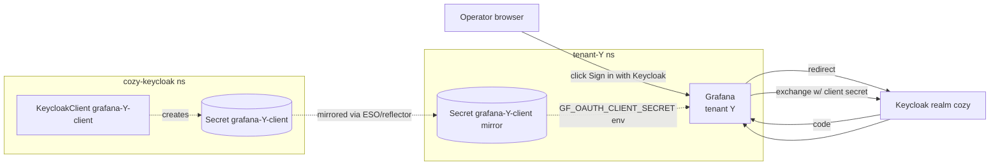

# Keycloak SSO for tenant Grafana

- **Title:** Automatic Keycloak SSO setup for Grafana of every tenant, not just `tenant-root`
- **Author(s):** `@IvanHunters`
- **Date:** 2026-06-12
- **Status:** Draft

## Overview

Cozystack's monitoring chart wires Keycloak OAuth into the root tenant's Grafana but skips it for child tenants. Operators of child tenants therefore have to share a `Secret`-managed admin password (Grafana's local user) instead of logging in with their existing platform identity. This proposal extends the monitoring chart so every tenant Grafana gets the same OAuth treatment automatically: a `KeycloakClient` is rendered, a client `Secret` is wired to the Grafana pod, and the Grafana CR carries `auth.generic_oauth` matching the host of that tenant.

The default behaviour for the root tenant stays exactly as it is today. For every non-root tenant with `monitoring: true` (and an SSO opt-in flag), the chart additionally renders the OAuth plumbing.

## Scope and related proposals

- Depends on a stable cross-tenant `Secret` plumbing pattern, which already exists for `vmagent` / `grafana-db-*` credentials in the monitoring chart.
- Does **not** depend on the labels-fix [cozystack/cozystack#2912](https://github.com/cozystack/cozystack/pull/2912) or the egress-fix [cozystack/cozystack#2910](https://github.com/cozystack/cozystack/pull/2910); those are about cross-tenant network reachability, this is about identity/SSO.
- Adjacent but distinct: tenant Dashboard SSO is already auto-configured for every tenant via `cozy-dashboard` / `dashboard-client`; the model in this proposal mirrors that wiring for Grafana.
- Out of scope: per-tenant Keycloak realm. We deliberately stay on the shared `cozy` realm.

## Context

Files involved today:

- `packages/system/monitoring/templates/grafana/grafana.yaml` — the `Grafana` CR template (operator: `grafana-operator/grafana.integreatly.org/v1beta1`). Has `spec.config.auth.generic_oauth` set unconditionally; the `redirect_uris` in the corresponding `KeycloakClient` are hard-pointed at `https://grafana.{{ ._cluster.root-host }}/login/generic_oauth`, so only the root tenant gets a working flow.
- `packages/system/monitoring/templates/keycloak-configure/configure-kk.yaml` (or wherever `grafana-client` `KeycloakClient` lives) — single `KeycloakClient` resource named `grafana-client` in `cozy-keycloak` namespace, scoped to the root host.
- `packages/system/monitoring/values.yaml` — exposes Keycloak knobs but only for the root tenant's instance.
- `_cluster.oidc-enabled: "true"` is already set on every tenant's monitoring HR, suggesting OAuth was intended to be tenant-wide but stopped one chart-edit short.

Today on a TTK production deployment the platform team carries this manual workaround per child tenant:

1. Patch `KeycloakClient grafana-client` to add the child tenant's `https://grafana.<tenant-host>/login/generic_oauth` to `redirectUris` / `webOrigins`.
2. Copy the operator-managed `grafana-client` `Secret` from `cozy-keycloak` (or `tenant-root`) into the tenant's namespace.
3. `suspend: true` the `monitoring-system` `HelmRelease` for the tenant.
4. `kubectl patch grafana grafana ... --type merge` adding the full `auth.generic_oauth` block plus the env var `GF_OAUTH_CLIENT_SECRET` referencing the copied `Secret`.

Suspending the HelmRelease freezes all other monitoring chart updates for that tenant. The chain is brittle (we saw rollout-loop bugs because env-var patches collided with the Grafana operator's reconcile loop) and unsustainable.

### The problem

- *"As a platform operator I want to open `https://grafana.<child-tenant-host>` and click Sign in with Keycloak."* Today the button is missing; the only login is local admin/password.
- *"As a tenant admin I want to grant my devs read-only access to my tenant's Grafana via my Keycloak group."* Today there is no Grafana-side OAuth at all, so the only option is to share the local admin credentials.
- *"As an SRE I want a single sign-on event audit trail across all Grafanas."* Today the root tenant's Grafana logs OAuth events; child tenants' Grafanas only show "admin logged in via password" — opaque.

## Goals

- Every tenant Grafana exposes Keycloak SSO out of the box with no manual `KeycloakClient` editing, no manual `Secret` copying, no `HelmRelease` `suspend`.
- The root tenant's wiring is unchanged in shape (it already works; this proposal must not break or churn its `KeycloakClient`).
- Role mapping for tenant Grafanas is configurable per tenant — operators can pin `Admin` to a specific Keycloak group and `Viewer` to another, or fall back to platform-wide defaults.
- The OAuth client secret rotation story matches what the dashboard client already does (operator-generated, rotated together).
- Disabling SSO for a specific tenant is a values flag away (e.g. `monitoring.grafana.oauth.enabled: false`), for compatibility with operators who only want local accounts on a sensitive tenant.

### Non-goals

- Per-tenant Keycloak realm. We stay on the shared `cozy` realm. (Per-realm isolation is a much larger discussion that would have to cover dashboard, harbor, gitlab integrations too.)
- Replacing or removing local admin authentication on tenant Grafanas. OAuth is added alongside; `disable_login_form` stays `false` so the local fallback remains available.
- Re-issuing or migrating existing tokens / sessions. Operators sign in fresh through the new flow.
- Tenant-Grafana ↔ external IdP federation. Cozystack ships only the bundled Keycloak path; bring-your-own-IdP is a separate proposal.

## Design

### Resource shape

Per non-root tenant with `monitoring: true` and `grafana.oauth.enabled: true` (default `true`), the monitoring chart renders three additional objects:

1. **`KeycloakClient grafana-<tenant>-client`** in `cozy-keycloak`, scoped to the `cozy` realm:

    ```yaml
    apiVersion: v1.edp.epam.com/v1
    kind: KeycloakClient
    metadata:
      name: grafana-{{ .Release.Namespace }}-client   # e.g. grafana-tenant-ktj-client
      namespace: cozy-keycloak
    spec:
      clientId: grafana-{{ .Release.Namespace }}      # e.g. grafana-tenant-ktj
      clientAuthenticatorType: client-secret
      enabled: true
      standardFlowEnabled: true
      defaultClientScopes: [profile, email, roles]
      realmRef:
        kind: ClusterKeycloakRealm
        name: keycloakrealm-cozy
      redirectUris:
        - https://grafana.{{ ._namespace.host }}/login/generic_oauth
      webOrigins:
        - https://grafana.{{ ._namespace.host }}
      secret: $grafana-{{ .Release.Namespace }}-client:client-secret-key
    ```

2. **`Secret grafana-<tenant>-client`** in `cozy-keycloak` (and mirrored to the tenant namespace where Grafana runs) holding the client secret. The `KeycloakClient` operator already supports a pre-existing `Secret` referenced by name + key in `spec.secret`. The chart pre-renders an empty stub on first install; the operator picks it up and writes the actual secret value back into the same `Secret` shape it uses for the existing `grafana-client`.

3. **`Grafana` CR addition** — the `spec.config.auth.generic_oauth` block plus the matching `GF_OAUTH_CLIENT_SECRET` env on the container.

    ```yaml
    spec:
      config:
        auth.generic_oauth:
          enabled: "true"
          name: Keycloak
          client_id: grafana-{{ .Release.Namespace }}
          client_secret: ${GF_OAUTH_CLIENT_SECRET}
          scopes: openid email profile
          auth_url: https://keycloak.{{ ._cluster.root-host }}/realms/cozy/protocol/openid-connect/auth
          token_url: https://keycloak.{{ ._cluster.root-host }}/realms/cozy/protocol/openid-connect/token
          api_url: https://keycloak.{{ ._cluster.root-host }}/realms/cozy/protocol/openid-connect/userinfo
          use_pkce: "true"
          allow_assign_grafana_admin: "true"
          groups_attribute_path: groups
          allowed_groups: {{ .Values.grafana.oauth.allowedGroups | quote }}
          role_attribute_path: {{ .Values.grafana.oauth.roleAttributePath | quote }}
          role_attribute_strict: "true"
      deployment:
        spec:
          template:
            spec:
              containers:
                - name: grafana
                  env:
                    - name: GF_OAUTH_CLIENT_SECRET
                      valueFrom:
                        secretKeyRef:
                          name: grafana-{{ .Release.Namespace }}-client
                          key: client-secret-key
    ```

### Groups / roles model

Default values match what the root tenant uses today (so root tenant behaviour is identical):

```yaml
grafana:
  oauth:
    enabled: true
    allowedGroups: cozystack-cluster-admin
    roleAttributePath: |
      contains(groups[*], 'cozystack-cluster-admin') && 'Admin' || 'Viewer'
```

A tenant operator can override locally:

```yaml
# Kubernetes CR / tenant values
monitoring:
  grafana:
    oauth:
      allowedGroups: cozystack-cluster-admin,grafana-tenant-ktj-viewer
      roleAttributePath: |
        contains(groups[*], 'cozystack-cluster-admin') && 'Admin'
        || contains(groups[*], 'grafana-tenant-ktj-admin') && 'Admin'
        || contains(groups[*], 'grafana-tenant-ktj-viewer') && 'Viewer'
        || ''
```

The chart does not auto-provision per-tenant Keycloak groups in this proposal. Operators who want tenant-scoped groups create them with the existing `KeycloakRealmGroup` resource; the chart's role-mapping defaults are written so they keep working if those groups are absent (the cluster-admin path still grants Admin).

### Secret plumbing

The chart needs the `grafana-<tenant>-client` `Secret` available in two places:

1. `cozy-keycloak` namespace — the `KeycloakClient` operator reads it there and writes the matching secret value into Keycloak.
2. The tenant's namespace — Grafana's pod reads it via the `GF_OAUTH_CLIENT_SECRET` env.

Two ways to wire this:

- **Option A (proposed): operator-managed in `cozy-keycloak`, projected via existing `External Secrets / Reflector`.** Cozystack already runs `external-secrets-operator` for similar cross-namespace secret plumbing. The chart renders an `ExternalSecret` (or equivalent `Reflector`-annotated mirror) so the tenant ns gets a copy automatically. No human action.
- **Option B: chart renders the same `Secret` resource in both namespaces with the same pre-generated value (`randAlphaNum 32`), without operator-managed regeneration.** Simpler, no ESO dep, but the secret is then chart-controlled rather than operator-controlled, and rotations require a chart redeploy.

Option A matches how the rest of Cozystack treats credential plumbing and is recommended. Reviewers may prefer Option B if they want zero new operator dependencies.

### Diagram



## User-facing changes

- New optional values block on the monitoring chart (and exposed through the `Kubernetes`/`Tenant` apps that consume it):

    ```yaml
    monitoring:
      grafana:
        oauth:
          enabled: true                 # default true for non-root tenants
          allowedGroups: ...
          roleAttributePath: ...
    ```

- New rendered objects per non-root tenant: one `KeycloakClient`, one `Secret` (plus mirror), no new visible Kubernetes resources on the tenant side beyond the `Secret`.
- Tenant Grafana login page now shows **Sign in with Keycloak** button next to the local form, identical UX to root Grafana.
- Docs entry under `docs/v1.5/operations/services/monitoring/setup/` — section "SSO for tenant Grafana" with the group/role defaults and how to add tenant-scoped groups.

## Upgrade and rollback compatibility

- Existing root tenant: zero change. Same `KeycloakClient`, same `Secret`, same Grafana config block.
- Existing child tenants: on first reconcile after upgrade, the chart renders the new `KeycloakClient` + `Secret` + Grafana additions. The `KeycloakClient` operator takes a few seconds to create the corresponding Keycloak client; until then Grafana's OAuth button shows but the token exchange returns `Invalid client`. The chart adds a `dependsOn` (or postSync gate) to delay the Grafana CR update until the operator reports `status.value: OK`, to avoid the transient bad-state.
- Rollback: removing the values block (`grafana.oauth.enabled: false`) drops the `KeycloakClient`, the `Secret`, and removes the env / config from Grafana on next reconcile. Local admin login keeps working throughout. Existing OAuth sessions in operator browsers go invalid; users re-login with local credentials.
- The chart does NOT delete the `Secret` from the tenant ns aggressively (avoids race with in-flight pods); reflector cleanup runs on its own schedule.

## Security

- New `KeycloakClient` per non-root tenant. Each holds its own `client_secret` — compromise of one tenant's client does not expose access to another tenant's Grafana.
- Bearer tokens stay scoped to the issuing tenant's `client_id`; cross-tenant token replay does not yield admin access (the `allowed_groups` / `role_attribute_path` evaluate fresh per Grafana).
- Same Keycloak realm (`cozy`). A misconfigured realm-level group accidentally including too many users would grant Admin on every tenant Grafana — flagged in the docs.
- Mirrored `Secret` in tenant namespace is readable by anyone with `secrets` get/list in that ns (same exposure as the existing `grafana-admin-credentials` secret today).
- No new RBAC surface introduced. No new public endpoints.

## Failure and edge cases

- *`KeycloakClient` operator reconcile fails* (e.g. realm not yet ready on a fresh install). The chart `dependsOn` (or initial `Job` waiter) blocks the Grafana CR's OAuth block from rendering until the operator reports `OK`. If the wait times out, Grafana still comes up with the legacy admin/password login (the chart degrades gracefully rather than blocking the whole tenant install).
- *Operator removes a tenant and recreates it with the same name.* Reused `clientId` would conflict with the lingering Keycloak object. The chart handles this with `cascade` cleanup: when the tenant ns is deleted, owner references propagate to the `KeycloakClient` in `cozy-keycloak`, which forces operator deletion.
- *Two child tenants pick the same `_namespace.host` (misconfiguration).* The chart short-circuits with a clear `helm` failure (`tenant host '<host>' already in use by grafana-<other-tenant>-client; redirect URIs would collide`).
- *PKCE not supported by browser (very old client).* Grafana's `use_pkce: "true"` makes this strict. Tested values keep `true`; reviewers may want a values knob to opt out, but the default is current best practice.
- *Tenant Grafana renamed mid-life.* `_namespace.host` rotation triggers a new `redirectUri` in the existing `KeycloakClient`; operator re-syncs. No manual action.

## Testing

- **Unit (helm-unittest):** assert that for `_namespace.host=foo.example.com` and `oauth.enabled: true`, the rendered output contains exactly one `KeycloakClient` with the expected `redirectUris`, exactly one `Secret`, and the Grafana CR contains both the `auth.generic_oauth` block and the `GF_OAUTH_CLIENT_SECRET` env. With `oauth.enabled: false` none of the three appear.
- **Integration:** existing monitoring chart `e2e` is extended to create a 2-level tenant, deploy monitoring, and assert that `https://grafana.<tenant-host>/login` returns 200 and contains the literal string `Sign in with Keycloak`. A follow-up assertion does a full OAuth flow with a service-account-style synthetic user and verifies the response carries a Grafana session cookie.
- **Manual smoke (RC):** spin up a 3-level hierarchy, opt every tenant into SSO, log in with a `cozystack-cluster-admin`-group user, verify Admin role on all three Grafanas; create a `grafana-tenant-X-viewer` group, add a different user, verify Viewer role on tenant X's Grafana only.

## Rollout

- **Release N (this proposal accepted):** ship the monitoring chart change behind `grafana.oauth.enabled` defaulting to `true` for non-root tenants. Document the role-mapping defaults and the override pattern.
- **Release N+1:** runbooks update — remove the manual `KeycloakClient` patching workaround from `cozystack:debug` notes; add a "rotate tenant Grafana OAuth secret" runbook (same shape as the existing dashboard one).
- No deprecations.

## Open questions

- **Default `allowedGroups` for child tenants — `cozystack-cluster-admin` (today's root behaviour) or empty (forcing operators to set it explicitly per tenant)?** Defaulting to the platform admin group is convenient but means a fresh tenant install accidentally grants full access to anyone in that platform group. Empty default is safer but adds a "why is my SSO bouncing back to Viewer with no permissions" UX bump.
- **Should the chart render a default `KeycloakRealmGroup` per tenant** (e.g. `grafana-tenant-X-admin`, `grafana-tenant-X-viewer`) and pre-seed the `roleAttributePath` with them? Convenient first-day UX but adds two more reconciled objects per tenant; not strictly needed for the proposal.
- **`Secret` mirror mechanism: ESO `ExternalSecret`, Reflector annotation, or chart-managed dual-write?** ESO is the most idiomatic but adds a runtime dependency; chart-managed dual-write is simpler but couples secret rotation to chart reconciles.
- **Should the OAuth block be wired through a `MonitoringClass` / `IdentityProvider` abstraction** so the same pattern lands automatically for any future tenant-scoped service (Argo CD, JupyterHub, etc.)? Out of scope for this proposal — flagging it as a possible follow-up theme.

## Alternatives considered

- **Single `grafana-client` `KeycloakClient` with all tenant `redirectUris` listed.** What the TTK platform did manually as a workaround. Simpler in resource count, but every secret rotation rotates for all Grafanas in lockstep, and one tenant's misconfiguration can break others' login (we hit this — adding a bad `redirectUri` invalidated the working ones). Per-tenant `KeycloakClient` is more boilerplate but each one is independent and isolated.
- **Per-tenant Keycloak realm.** Maximum isolation; entire user / group / token universe scoped to the tenant. Conflicts with the existing shared-realm model used by `dashboard-client`, `harbor`, etc. Too far a departure for a Grafana-only proposal.
- **Drop local Grafana auth entirely once OAuth is wired.** Surface area reduction, but removes the only break-glass path when Keycloak itself is down. Keep both.
- **Wire OAuth via `oauth2-proxy` sidecar in front of Grafana** instead of Grafana's native `auth.generic_oauth`. More moving parts, no upside over the native path which already works for root.
- **Generate `client_secret` chart-side (random + persistedAcrossReconciles) instead of operator-managed.** Avoids the ESO/reflector question but breaks the operator-driven rotation pattern that the rest of Cozystack uses.

---

<!--
Inspired by KubeVirt enhancement proposals
(https://github.com/kubevirt/enhancements) and Kubernetes Enhancement
Proposals (KEPs).
-->
