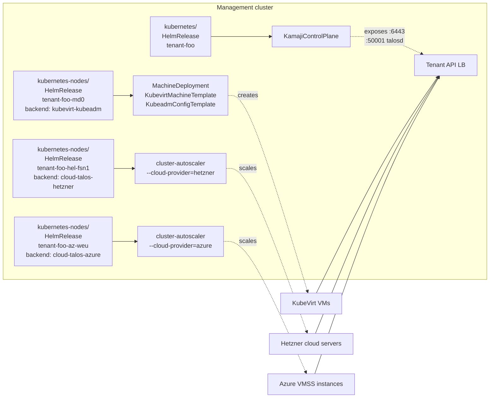

# Split the kubernetes package: extract node pools and add Talos backends

- **Title:** `Split the kubernetes package: extract node pools and add Talos backends`
- **Author(s):** `@kvaps`
- **Date:** `2026-05-04`
- **Status:** Draft

## Overview

The `kubernetes` application currently bundles a Kamaji-hosted control-plane and all worker node pools into a single Helm release. This couples two lifecycles that are becoming increasingly independent: the control-plane is a single object owned by the platform, while node pools are growing in number and variety — different locations, different infrastructure providers, different operating systems.

This proposal extracts node pools into a separate sibling application, `kubernetes-nodes`, modelled on the precedent of the `vm-instance` / `vm-disk` split. A user-facing tenant cluster is described as one `kubernetes` HelmRelease (control-plane only) plus N `kubernetes-nodes` HelmReleases (one per pool). At the same time, `kubernetes-nodes` introduces a backend abstraction so a single tenant cluster can mix KubeVirt VMs (existing kubeadm-bootstrapped flow) with Talos-on-cloud VMs (new, no Cluster API) and KubeVirt VMs running Talos (new) — joined by a Kamaji control-plane and stitched together at the network layer through the existing Kilo mesh.

## Scope and related proposals

- Companion to [`cross-cluster-tenant-mesh`](../cross-cluster-tenant-mesh/) — that proposal exposes host-cluster services (Ceph) to tenant clusters, which becomes more relevant once tenants span multiple locations.
- Migration of existing tenants is described here as a phased plan; an explicit migration utility (modelled on `migrations/29` from the `virtual-machine` → `vm-instance + vm-disk` split) will accompany the implementation but its detailed script is out of scope of this proposal.
- This proposal does **not** propose removing Cluster API immediately. It contains the architectural seam needed to remove CAPI later for non-KubeVirt backends if that becomes desirable.

## Context

### The problem

> *I want my Kubernetes control plane lifecycle to be managed independently from my worker node pools. The pools may live in different locations and be backed by different infrastructure providers (in-cluster KubeVirt VMs, cloud VMs in Hetzner or Azure), and I want first-class Talos Linux support.*

The current `kubernetes` package (under `packages/apps/kubernetes/`) carries a top-level `nodeGroups` map in `values.yaml`; each entry is rendered into a `MachineDeployment` + `KubeadmConfigTemplate` + `KubevirtMachineTemplate` + `MachineHealthCheck`. The control-plane (`KamajiControlPlane`) and the cluster-wide infrastructure objects (`Cluster`, `KubevirtCluster`, `kubevirt-ccm`, `cluster-autoscaler`) all live in the same Helm release. The chart has no notion of "location", "region" or "zone"; bootstrap is exclusively kubeadm.

This bundling has three concrete consequences that are starting to bite:

- **Coupled lifecycles.** A user wanting to add a small node pool in a second location must edit the same HelmRelease that owns the control-plane. A bad `values.yaml` change risks the entire cluster, not just one pool.
- **Single backend.** The values shape assumes everything is a KubeVirt VM joined via kubeadm. There is no clean place to plug in Talos-on-cloud-VM workers, which Cozystack already supports for the management cluster (see `/operations/multi-location/autoscaling/`).
- **No multi-location semantics.** Users currently model "different location" by hand using node labels and Kilo annotations. There is no first-class `location` knob in the kubernetes package, no per-pool placement, no provider-aware autoscaler.

### Existing primitives

- **Kamaji** for hosted control-planes (`KamajiControlPlane` CRD, `clastix.io/v1alpha1`).
- **Cluster API** with the **KubeVirt provider (CAPK)** — `KubevirtCluster`, `KubevirtMachineTemplate`. Currently the only worker backend.
- **`local-ccm`** (`github.com/cozystack/local-ccm`) deployed on the management cluster: a DaemonSet that detects ExternalIP via netlink, plus a `node-lifecycle-controller` (NLC) that deletes zombie `Node` objects after `cluster-autoscaler` scales their VMs down. Today NLC runs only against the management cluster's API; the same logic would solve zombie-node issues for tenant clusters where workers are autoscaled cloud VMs.
- **`cluster-autoscaler`** as a single Deployment per tenant kubernetes HelmRelease, in the management cluster, discovering MachineDeployments via the clusterapi provider.
- **clastix/talos-csr-signer** (a small gRPC sidecar that re-implements Talos `trustd` so that workers can fetch their Talos machine certificate from a non-Talos control-plane like Kamaji). Co-developed with CLASTIX; deployed as a sidecar inside the `KamajiControlPlane` Pod via `additionalContainers`.
- The **Sidero Metal / CAPS** path is **not** an option: the upstream project is officially deprecated and bare-metal-only, and assumes a Talos control-plane (incompatible with Kamaji).

## Goals

- A tenant cluster's worker pools live in their own HelmReleases, separate from the control-plane's HelmRelease, and can be added, removed, scaled and re-templated independently.
- A single tenant cluster can mix multiple `kubernetes-nodes` HelmReleases of different backends — for example: one KubeVirt pool on the host cluster running kubeadm (legacy compatibility), one Talos pool on Hetzner, one Talos pool on Azure — all joined by the same Kamaji control-plane.
- First-class Talos Linux support for new worker pools: machineconfig-driven bootstrap, with a system-managed template and a user-facing overlay.
- No regression for existing tenants: the current `kubevirt-kubeadm` flow remains the default, fully supported, and migrations are scripted.
- Cluster-autoscaler runs once per node pool, in the management cluster (not inside tenant nodes), driven by per-pool configuration.
- Tenant `Node` objects are cleaned up automatically when their VM is removed, regardless of backend.

### Non-goals

- Removing Cluster API entirely. CAPI remains the path for KubeVirt-backed pools; this proposal only avoids introducing it for new Talos-on-cloud backends.
- Migrating existing KubeVirt-kubeadm pools to KubeVirt-Talos. The Talos-on-KubeVirt backend is offered for new pools; existing kubeadm pools stay as-is.
- Cross-cluster service discovery, DNS, or service mirroring. Out of scope; partially addressed by the companion `cross-cluster-tenant-mesh` proposal.
- Replacing `kubevirt-ccm` inside tenant clusters. It remains in the `kubernetes` (control-plane) package and is critical for KubeVirt-backed tenants.
- Changing the on-disk shape of existing CAPI objects. Migration adopts them in place.

## Design

### Package split

Two packages replace today's monolithic `kubernetes`:

- **`kubernetes`** — control-plane only. Renders `Cluster`, `KamajiControlPlane`, `KubevirtCluster` (when needed for KubeVirt-backed pools), `kubevirt-ccm` for the tenant, addons (cert-manager, FluxCD, ingress-nginx, etc.), and the Talos signer sidecar configuration when Talos backends are in use. Does **not** render any node-pool objects.
- **`kubernetes-nodes`** — exactly one node pool per HelmRelease. Renders all backend-specific resources for that pool: for `kubevirt-*` backends, the CAPI `MachineDeployment` + bootstrap config template + infrastructure machine template + `MachineHealthCheck`; for `cloud-talos-*` backends, a `cluster-autoscaler` Deployment configured with the cloud's native provider plus the Talos machineconfig Secret consumed via cloud-init.

A tenant cluster is therefore described as `1 × kubernetes` HelmRelease + `N × kubernetes-nodes` HelmReleases. The control-plane does not hold any reference to its node pools — workers self-register against the apiserver via their bootstrap mechanism, just as they do today.

### Linkage by name

Following the `vm-instance` / `vm-disk` precedent, `kubernetes-nodes` references its parent `kubernetes` HelmRelease by **name**, not by an explicit CRD reference. The chart's `clusterName` value (e.g., `tenant-foo`) is used at template render time to:

- `lookup` the tenant's `KamajiControlPlane` and read its API endpoint, CA, and bootstrap-token data.
- Set Helm release naming convention `kubernetes-nodes-<groupName>` so that orphan detection during migration is deterministic.
- Apply labels (`apps.cozystack.io/cluster: <clusterName>`) to all rendered objects, enabling label-selector-based reconciliation in `cluster-autoscaler` and any future controllers.

If the parent control-plane is missing, the chart `fail`s the render with a clear error pointing at the expected HelmRelease name. This is the same mode of fragility present in `vm-instance/vm-disk` — accepted as a tradeoff for simplicity, with the understanding that a future iteration could move to an explicit CRD reference.

### Backend abstraction

`kubernetes-nodes` exposes a `backend.type` field that selects which set of templates is rendered. Three backends are introduced; only `kubevirt-kubeadm` is fully equivalent to today's behaviour.

#### `kubevirt-kubeadm` (existing, default)

Identical to today's flow. Renders `MachineDeployment` + `KubevirtMachineTemplate` + `KubeadmConfigTemplate` + `MachineHealthCheck`. Bootstrap via kubeadm join. Workers run a Cozystack-blessed Ubuntu/Talos-untouched image. CAPI + CAPK do all the lifecycle work; cluster-autoscaler drives scale.

This is the migration target for every existing pool.

#### `kubevirt-talos`

Renders the same CAPI/CAPK objects as above, but with a `TalosConfigTemplate` (from `cluster-api-bootstrap-provider-talos`) replacing `KubeadmConfigTemplate`. Worker VMs boot from a Talos image. Bootstrap fetches the Talos machineconfig from CAPI and joins the cluster via standard Talos PKI.

The tenant's `KamajiControlPlane` carries an `additionalContainers` entry running `clastix/talos-csr-signer` listening on UDP/50001, exposed alongside `:6443` on the tenant API LoadBalancer. This is what allows `talosctl` to operate against worker nodes whose control-plane is Kamaji rather than Talos.

This backend keeps CAPI in the loop because for KubeVirt VMs the `cluster-api-provider-kubevirt` machinery is the path of least resistance — it already handles VM lifecycle, networking, and storage attachment.

#### `cloud-talos-hetzner` and `cloud-talos-azure`

No Cluster API involvement. The pattern mirrors what Cozystack already uses for the management cluster (see `/docs/v1.3/operations/multi-location/autoscaling/`):

- A `cluster-autoscaler` Deployment is rendered into the management cluster's namespace for this tenant, configured with `--cloud-provider=hetzner` (or `azure`), `--cloud-config` referencing a Secret with cloud credentials provided in the HelmRelease values, and `autoscalingGroups` describing min/max replicas, instance type, and region.
- A `Secret` holds the Talos machineconfig (see "Talos machineconfig" below). The autoscaler injects it via the cloud's `cloud-init` / `customData` mechanism when launching new instances.
- Newly booted instances complete their Talos bootstrap against the tenant's public API endpoint (Kamaji) using the Talos token in the machineconfig, register via kubelet, and obtain their kubelet client certificate through standard CSR approval.

These backends do not use CAPI at all. There is no `Machine`, no `MachineDeployment`. The autoscaler is the source of truth for desired pool size; the cloud's API is the source of truth for actual instance state. This is the same model proven on the management cluster.

### Talos machineconfig: template + user overlay

A single Talos machineconfig per pool is generated by the `kubernetes-nodes` chart and stored as a Secret. It is constructed in two layers:

**System layer (chart-managed, not exposed to user):**

- Cluster CA, machine CA, apiserver endpoint — read at template time via `lookup` from the tenant's `KamajiControlPlane`.
- Talos token — generated once per pool, stored alongside the machineconfig.
- Kilo annotations (`kilo.squat.ai/location`, `kilo.squat.ai/persistent-keepalive`, `topology.kubernetes.io/zone`) when the pool participates in the Cozystack mesh.
- Standard Cozystack defaults: registry mirrors, kubelet flags, time servers, install disk hints.

**User layer (`backend.userMachineConfig` in values.yaml):**

- Extra kubelet args.
- Extra node labels and taints (free-form).
- Per-pool registry mirrors override.
- Extra `extensions` (talos image factory schematic).
- Anything else the user explicitly wants to pass through.

The two layers are merged at render time and the result is the machineconfig that gets injected into cloud-init or the KubevirtMachineTemplate. The user never writes raw Talos YAML for cluster-critical fields; the chart guarantees the result will join the right control-plane.

### Cluster-autoscaler — one per pool, in the management cluster

The current model (one autoscaler per tenant in the management cluster, discovering all pools via clusterapi labels) does not generalise: a `cloud-talos-hetzner` pool needs `--cloud-provider=hetzner`, a `cloud-talos-azure` pool needs `--cloud-provider=azure`, and the upstream cluster-autoscaler accepts only one cloud-provider flag per Deployment.

The new model: each `kubernetes-nodes` HelmRelease renders its own `cluster-autoscaler` Deployment, in the management cluster, scoped to its pool. The autoscaler:

- For `kubevirt-*` backends, uses `--cloud-provider=clusterapi` and watches just this pool's MachineDeployment.
- For `cloud-talos-*` backends, uses the corresponding native provider and the values-supplied `autoscalingGroups`.

Coordination across pools is left to the standard scheduler — pending pods select among pools via standard mechanisms (taints, node selectors, topology constraints).

### Tenant-side node lifecycle (NLC)

When `cluster-autoscaler` scales a `cloud-talos-*` pool down, it deletes the cloud VM. The tenant's apiserver still has a `Node` object that will linger until something deletes it. CAPI was previously the agent doing this; without CAPI, we need an equivalent.

The `node-lifecycle-controller` from `cozystack/local-ccm` is a good fit for this role. The `kubernetes-nodes` chart for `cloud-talos-*` backends renders an NLC Deployment that runs in the management cluster but uses a kubeconfig pointing to the **tenant** apiserver. It watches Node objects with the `ToBeDeletedByClusterAutoscaler:NoSchedule` taint and removes them after a configurable grace period and unreachability check.

For `kubevirt-*` backends NLC is not needed: CAPI's machine controller already removes the Node object when it deletes the Machine.

### `kubevirt-ccm` stays in the control-plane package

The Kubernetes Cloud Controller Manager for KubeVirt-backed nodes (`kubevirt-ccm`, currently in `templates/kccm/manager.yaml`) remains in the `kubernetes` package, not in `kubernetes-nodes`. It is critical for KubeVirt-backed tenants — without it, KubeVirt VMs do not get their LoadBalancer Services properly wired — and it is logically a property of the cluster, not of a particular node pool.

Tenants that have **no** KubeVirt pools at all (only `cloud-talos-*` pools) will have `kubevirt-ccm` running idle. This is acceptable cost; a future `enabled` flag in the `kubernetes` chart can disable it on demand.

## User-facing changes

- New CRD-style application `kubernetes-nodes` with `values.yaml` containing: `clusterName`, `backend.type`, `backend.<type>.*` settings, common `replicas`/`minReplicas`/`maxReplicas`, `roles`, `resources`, `userMachineConfig` (Talos backends only).
- Existing `kubernetes` `values.yaml` no longer accepts `nodeGroups` (after migration completes; during the migration window both shapes are accepted).
- New tenant-cluster pages in the dashboard list node pools as separate entities, with their backend type and current capacity.
- `cozystack` CLI gains commands to list, create, scale, and delete node pools per cluster.

## Upgrade and rollback compatibility

The migration follows the precedent of the `virtual-machine` → `vm-instance` + `vm-disk` split: a long parallel period during which both shapes work, followed by a scripted migration and eventual removal of the legacy code path.

**Phase 1 — both shapes accepted.**
- Ship `kubernetes-nodes` as a new package. Document its use for new node pools.
- The `kubernetes` chart continues to support `nodeGroups` in `values.yaml` exactly as today.
- Users can adopt `kubernetes-nodes` on a per-pool basis for new pools without touching existing ones.

**Phase 2 — migration tool.**
- A migration script (modelled on `migrations/29` for the `virtual-machine` split) walks every `kubernetes` HelmRelease with non-empty `nodeGroups`. For each `nodeGroup` it:
    1. Patches the existing `MachineDeployment`, `KubevirtMachineTemplate`, `KubeadmConfigTemplate`, and `MachineHealthCheck` with `meta.helm.sh/release-name` and `meta.helm.sh/release-namespace` annotations pointing at the new `kubernetes-nodes-<groupName>` HelmRelease.
    2. Creates the `kubernetes-nodes` HelmRelease with values copied from the source `nodeGroup`.
    3. Strips the `nodeGroup` entry from the `kubernetes` HelmRelease values.
- Critical pre-step: each affected resource is annotated `helm.sh/resource-policy: keep` first, so that the `kubernetes` chart's reconciliation does not delete it during the brief window before the new HelmRelease's first reconcile.
- The script is idempotent and safe to re-run.

**Phase 3 — legacy removal.**
- The `kubernetes` chart drops `nodeGroups` from its schema entirely. Charts that still receive it produce a clear validation error pointing at the migration tool.
- Documentation deprecates the old shape.

**Rollback.**
- During Phase 1 and Phase 2, rollback is a matter of reverting the migration: delete the `kubernetes-nodes` HelmRelease, restore the `nodeGroup` entry in `kubernetes` values, run reconcile. The migration script supports this direction explicitly.
- After Phase 3, rollback requires reinstating the legacy code path in the `kubernetes` chart. This is a hard cut and should not be done lightly; Phase 3 only ships once Phase 1 and 2 have been in production long enough to gather operational confidence.

## Security

- `kubernetes-nodes` HelmReleases run with the same RBAC as `kubernetes` HelmReleases today — they're both managed by Cozystack platform components, not by tenants. The split does not introduce new tenant-controlled inputs.
- Talos backends introduce a new credential: the per-pool `TALOS_TOKEN`, used by `clastix/talos-csr-signer` to validate worker bootstrap. Stored in a Secret in the tenant's namespace, rotated on pool re-creation.
- `cloud-talos-*` backends introduce cloud-provider credentials (Hetzner API token, Azure service principal). These are user-supplied at HelmRelease creation, stored as Secrets in the tenant's namespace, and never read by the tenant's apiserver — only by the management-cluster `cluster-autoscaler`.
- The Talos machineconfig contains the cluster CA and the bootstrap token. It is stored as a Secret accessible only to the autoscaler and the chart's render path. It is **not** exposed to the tenant's apiserver or workloads.
- `clastix/talos-csr-signer` uses a single shared `TALOS_TOKEN` per pool with no per-node identity proof. This matches upstream Talos's `trustd` model. Co-developed with CLASTIX; experimental upstream status acknowledged but accepted, given Cozystack's involvement in its development.

## Failure and edge cases

- **`kubernetes-nodes` HelmRelease created before its parent `kubernetes` HelmRelease** → chart `fail`s the render with a clear error message identifying the missing parent. No partial CAPI/autoscaler resources created.
- **Parent `kubernetes` HelmRelease deleted while children exist** → all `kubernetes-nodes` HelmReleases for that cluster fail subsequent reconciles. An admission webhook on `kubernetes` HelmRelease delete blocks the operation if any `kubernetes-nodes` references it.
- **Migration runs while autoscaler is mid-scale-out** → resource-policy `keep` annotation prevents deletion. The new HelmRelease's first reconcile picks up the in-flight `Machine` objects via the standard CAPI reconcile.
- **`cluster-autoscaler` for a `cloud-talos-*` backend fails to delete a cloud VM** (rate limit, transient API error) → instances stay up; NLC will not see the Node as `ToBeDeletedByClusterAutoscaler:NoSchedule` and will not delete the Node. Operator alerted via metrics; manual cleanup required. Documented runbook.
- **Talos-CSR-signer pod restart during worker bootstrap** → worker retries `trustd` calls with exponential backoff (Talos default). No data lost.
- **Mixed-backend tenant where one pool fails reconcile** → other pools and the control-plane are unaffected (independent HelmReleases). The cluster degrades gracefully.

## Testing

- Unit tests for chart rendering: synthetic inputs covering each backend, expected Kubernetes objects, expected absence of forbidden combinations (e.g., `userMachineConfig` for `kubevirt-kubeadm`).
- Schema validation tests for the new `kubernetes-nodes` `values.yaml` shape.
- Migration script tests: synthetic existing `kubernetes` releases with various `nodeGroups` configurations; verify idempotence, rollback, and identity preservation (Machine names, BootstrapData ownership).
- Integration tests with `kind` and a stub KubeVirt: full lifecycle of `kubevirt-kubeadm` and `kubevirt-talos` pools.
- E2E in CI for `cloud-talos-*` backends using a small Hetzner project and an Azure subscription: scale-up, scale-down, NLC behaviour on rapid scale-down.
- Failure-injection tests: kill the talos-csr-signer pod during worker join; kill the cluster-autoscaler pod mid-scale; delete a pool's cloud-credentials Secret and verify graceful degradation.

## Rollout

- **Phase 1.** Implement `kubernetes-nodes` package with `kubevirt-kubeadm` backend only. Ship as opt-in alongside the existing `kubernetes` chart with no migration required for existing pools.
- **Phase 2.** Add `kubevirt-talos` backend, including talos-csr-signer integration in the `kubernetes` (control-plane) chart.
- **Phase 3.** Add `cloud-talos-hetzner` and `cloud-talos-azure` backends, including per-pool cluster-autoscaler and tenant-side NLC.
- **Phase 4.** Ship migration script. Document the migration; encourage but don't force adoption.
- **Phase 5.** Once telemetry shows broad migration of existing tenants, remove `nodeGroups` from `kubernetes` chart's schema; ship final migration.

Each phase is independently shippable and rollback-safe.

## Open questions

1. **CAPI removal long-term.** Should we set a roadmap target for removing CAPI from `kubevirt-kubeadm` and `kubevirt-talos` backends entirely (replacing CAPK with a thin Cozystack-internal controller that creates `VirtualMachine` objects directly)? This would unify all backends under "no CAPI" and reduce a substantial dependency, but requires re-implementing what CAPK gives us today (machine lifecycle, healthchecks, status). Out of scope for this proposal but worth scoping next.
2. **Backend extension shape.** The proposed `backend.type` enum has a fixed set of values. Adding AWS, GCP, or on-prem KVM later is straightforward (new `cloud-talos-aws` etc.), but should we accept arbitrary backend identifiers and dispatch through a plugin mechanism? Probably not — the explicit enum keeps the chart auditable.
3. **Per-pool talos-csr-signer vs cluster-wide.** Currently proposed as a single sidecar in the tenant's `KamajiControlPlane` Pod (cluster-wide). Should each pool have its own token for blast-radius isolation? Operationally heavier; security gain limited because tokens already give only the right to obtain a Talos machine cert, not Kubernetes API access. Open for discussion.
4. **NLC reuse vs fork.** Should we deploy the existing `local-ccm` NLC in tenant-targeting mode, or fork it into a `tenant-nlc` package? Reuse keeps the codebase smaller; fork makes the host vs tenant deployment paths explicitly different. Likely reuse is correct.
5. **Should `kubernetes-nodes` be allowed to advertise capacity to multiple `kubernetes` clusters?** Almost certainly no, but stating it explicitly. Each pool belongs to one cluster.

## Alternatives considered

**Keep the monolithic `kubernetes` package and add `nodeGroupsBackend` discriminators.** Rejected because it would force every tenant cluster's HelmRelease to know about every backend, and growing the values shape further entangles control-plane and node-pool lifecycles. The whole reason for the split is to *separate* lifecycles, not to make the same release manage more variety.

**Sidero Metal / CAPS for Talos-on-bare-metal.** Rejected. Sidero Labs has officially deprecated Sidero Metal. Successor (Omni) is a closed-core SaaS, not a drop-in OSS CAPI provider. Sidero is also bare-metal-only and assumes a Talos control-plane, incompatible with Kamaji.

**Explicit `clusterRef` on `kubernetes-nodes` instead of name-based linkage.** Considered. Trade-off favours simplicity: name-based linkage matches the `vm-instance/vm-disk` precedent that Cozystack maintainers and users are already familiar with, and the security gain of a CRD reference is marginal because both packages are platform-controlled (not tenant-controlled). The fragility of the name-based approach is real but understood and accepted.

**Single global cluster-autoscaler per tenant with multi-cloud-provider support.** Not feasible. Upstream cluster-autoscaler accepts one `--cloud-provider` flag; supporting multiple simultaneously would require either a fork or a per-pool autoscaler. Per-pool autoscaler in the management cluster is the natural fit.

**Inline-disk-style "embedded" node pools** (each `kubernetes` HelmRelease has its node pools as a sub-section, but rendered as separate releases under the hood). Rejected because it does not actually decouple the lifecycle — a `helm upgrade` on the parent still touches all children. The split has to be at the user-visible HelmRelease level for the goals to be achieved.

**Exposing Talos machineconfig directly to users without a system layer.** Rejected because it forces every user to understand Talos machineconfig deeply, and gives them enough rope to break the join with Kamaji (wrong CA, wrong endpoint, wrong token). The template + user-overlay approach matches the ergonomics Cozystack offers everywhere else (system handles the boilerplate, user describes intent).
