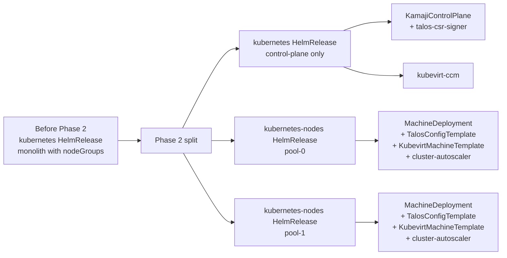

# Migrate kubernetes workers to Talos and split control-plane from node pools

- **Title:** `Migrate kubernetes workers to Talos and split control-plane from node pools`
- **Author(s):** `@kvaps`
- **Date:** `2026-05-04`
- **Status:** Draft

## Overview

A two-phase reshape of the `kubernetes` application:

1. **Phase 1 — Talos migration.** Replace the worker OS bootstrap path of the existing `kubernetes` chart from Ubuntu + `kubeadm` to Talos + `cluster-api-bootstrap-provider-talos`. The chart's user-facing API (`values.yaml`) does not change; the migration is seamless via a standard CAPI MachineDeployment rolling update.
2. **Phase 2 — Package split.** Once workers are uniformly on Talos, split the chart into `kubernetes` (control-plane only) and `kubernetes-nodes` (one HelmRelease per pool), modelled on the `vm-instance` / `vm-disk` precedent.

Hybrid clusters — workers that live outside the Cozystack management cluster (cloud autoscaler against Hetzner / Azure / AWS, BYO clusters with admin-/user-managed location ownership) — are deliberately deferred as **Phase 3** and tracked in a separate draft proposal. This document does not commit to any specific shape for that work.

## Scope and related proposals

- **Phase 3 (hybrid clusters)** lives in a separate draft proposal — link to be added once that PR is open. None of the design here forecloses Phase 3; the package split is exactly what makes Phase 3 expressible cleanly.
- **Companion: [`cross-cluster-tenant-mesh`](../cross-cluster-tenant-mesh/)** (PR #7). Independent of this proposal; relevant once tenants need to reach services across cluster boundaries.

## Context

### The current shape

The `kubernetes` package (`packages/apps/kubernetes/`) carries a top-level `nodeGroups` map in `values.yaml`. Each entry is rendered into a `MachineDeployment` + `KubeadmConfigTemplate` + `KubevirtMachineTemplate` + `MachineHealthCheck`. The control-plane (`KamajiControlPlane`) and cluster-wide infrastructure (`Cluster`, `KubevirtCluster`, `kubevirt-ccm`, `cluster-autoscaler`) live in the same Helm release. Workers are bootstrapped via kubeadm join, running an Ubuntu image.

### Existing primitives

- **Kamaji** for hosted control-planes (`KamajiControlPlane` CRD).
- **Cluster API** with the **KubeVirt provider (CAPK)** — `KubevirtCluster`, `KubevirtMachineTemplate`. Workers run as KubeVirt VMs on host nodes.
- **`cluster-api-bootstrap-provider-talos`** (CABPT) — from siderolabs. Drop-in replacement for CABPK that produces a Talos machineconfig as the bootstrap-data Secret. Works with any CAPI infra provider (CAPK included) because the infra provider does not inspect bootstrap-data content — it just injects it as cloud-init.
- **clastix/talos-csr-signer** — small gRPC sidecar reimplementing Talos's `trustd` protocol. Lets Talos workers fetch their Talos machine certificate from a non-Talos control-plane (Kamaji). Co-developed with CLASTIX.
- **`cluster-api-control-plane-provider-kamaji`** — the CAPI control-plane provider for Kamaji. Today it does **not** wire a CSR-signer sidecar into the `TenantControlPlane`. A patch is required (see Phase 1 below).

## Goals

- Workers are uniformly Talos-bootstrapped across all tenants. No Ubuntu + kubeadm path remains in the chart after Phase 1 lands.
- The migration is seamless: existing tenants pick up Talos via a CAPI MachineDeployment rolling update, with no operator intervention beyond a chart upgrade.
- A tenant cluster's control-plane lifecycle is separable from its node-pool lifecycles. Adding, scaling or replacing a pool does not touch the HelmRelease that owns the control-plane.
- The package shape is set up to accept future hybrid backends (Phase 3) without further restructuring.

### Non-goals

- **Hybrid / external-cloud workers.** Deferred to Phase 3 (separate proposal).
- **Multi-location semantics inside this proposal.** No `location` knob in `values.yaml` here; Phase 3 will introduce one if needed.
- **Removing Cluster API.** CAPI + CAPK remains the path for KubeVirt-VM workers.
- **Replacing `kubevirt-ccm` in tenant clusters.** It stays in the `kubernetes` (control-plane) package and is critical for KubeVirt-backed tenants.
- **talosctl-driven workflows beyond what the signer enables.** Phase 1 confirms `talosctl` works against migrated workers; advanced flows (system extensions, upgrades through talosctl) are follow-up.

## Phase 1 — Migrate worker bootstrap from kubeadm to Talos

### What changes

Inside the existing monolithic `kubernetes` chart:

- `KubeadmConfigTemplate` → `TalosConfigTemplate` (CABPT). The bootstrap-data Secret content changes from kubeadm cloud-init to Talos machineconfig; CAPK still injects it as cloud-init userdata into the VM.
- Base disk image referenced by `KubevirtMachineTemplate` switches from a Cozystack-built Ubuntu image to a Cozystack-built Talos image. Image build pipeline updated accordingly.
- The tenant's `KamajiControlPlane` gains a sidecar entry running `clastix/talos-csr-signer`, exposed alongside the API server on the tenant API endpoint (UDP/50001 for Talos `trustd`).
- `KamajiControlPlane` exposed-ports configuration extended to include `:50001` alongside `:6443` so the tenant API LoadBalancer Service surfaces both.

### Patch required: `cluster-api-control-plane-provider-kamaji`

The CAPI control-plane provider for Kamaji does not currently render the signer sidecar from `KamajiControlPlane` spec. The work for Phase 1 includes:

- A patch to `clastix/cluster-api-control-plane-provider-kamaji` adding a generic `additionalContainers` (or signer-specific) field that is rendered into the `TenantControlPlane` and propagated through to the resulting Deployment.
- A corresponding upstream PR. The Cozystack release of this provider runs the patched version until the PR merges; the fork window is expected to be small.

### Migration: seamless rolling update

Standard CAPI MachineDeployment rolling update — no script, no migration tool:

1. Operator pushes the chart upgrade.
2. The chart now renders the new `TalosConfigTemplate` and the new Talos-imaged `KubevirtMachineTemplate`. The `MachineDeployment`'s `template.spec.bootstrap.configRef` and `template.spec.infrastructureRef` switch to point at the new templates.
3. CAPI detects the template change, creates new Talos machines, cordons + drains old kubeadm machines, deletes them. Standard `maxSurge` / `maxUnavailable` knobs apply.

During the rollout, the tenant cluster passes through a brief mixed state: some Ubuntu + kubeadm nodes, some Talos nodes. The state is valid — both kinds of nodes register against the same Kamaji apiserver via standard kubelet CSR approval, share the same CNI (Cilium), and are indistinguishable from the apiserver's point of view. After rollout completes, every node is Talos.

### What stays the same in Phase 1

- The chart's user-facing API. `values.yaml` (`nodeGroups`, control-plane fields, etc.) is identical. Tenants do not edit anything.
- The package's structural layout. `kubernetes` is still one HelmRelease bundling control-plane + pools. Splitting happens in Phase 2.
- CAPI, CAPK, kubevirt-ccm, cluster-autoscaler, Cilium — all unchanged in role.

## Phase 2 — Split the kubernetes package

### What changes

Once Phase 1 has rolled out, the chart's internals are split into two sibling packages:

- **`kubernetes`** — control-plane only. Renders `Cluster`, `KamajiControlPlane` (with the talos-csr-signer sidecar), `KubevirtCluster`, `kubevirt-ccm`, and addons (cert-manager, FluxCD, ingress-nginx, etc.). Renders no node-pool objects.
- **`kubernetes-nodes`** — exactly one node pool per HelmRelease. Renders `MachineDeployment` + `TalosConfigTemplate` + `KubevirtMachineTemplate` + `MachineHealthCheck` for that pool. Also renders a per-pool `cluster-autoscaler` Deployment in the management cluster, scoped to this pool's `MachineDeployment`.

A tenant cluster is therefore described as `1 × kubernetes` HelmRelease + `N × kubernetes-nodes` HelmReleases. The control-plane holds no reference to its node pools — workers self-register against the apiserver via Talos bootstrap, as they already do after Phase 1.

There is no `backend.type` field in `kubernetes-nodes` values: the only backend is "kubevirt-talos", since Phase 3 (which would introduce alternative backends) is out of scope. The field will be added when Phase 3 lands.

### Linkage by name

`kubernetes-nodes` references the parent `kubernetes` HelmRelease **by name**, following the `vm-instance` / `vm-disk` precedent. The chart's `clusterName` value is used at template-render time to `lookup` the tenant's `KamajiControlPlane` for the API endpoint, CA, and bootstrap-token data. If the parent is missing, the chart `fail`s with a clear error pointing at the expected HelmRelease name. Same fragility tradeoff as in `vm-instance` / `vm-disk`, accepted for simplicity.

### Talos machineconfig: template + user overlay

Each `kubernetes-nodes` HelmRelease generates a single Talos machineconfig for its pool, stored as a Secret. Built in two layers:

**System layer** (chart-managed, not exposed to user): cluster CA, machine CA, apiserver endpoint, Talos token, kilo annotations, Cozystack defaults (registry mirrors, kubelet flags, etc.). Looked up at render time from the parent `KamajiControlPlane`.

**User layer** (`userMachineConfig` in `values.yaml`): extra kubelet args, extra labels/taints, registry mirror overrides, Talos image-factory schematic, anything else explicitly exposed by the chart.

The two layers are merged at render time; the user never writes raw Talos YAML for cluster-critical fields. The chart guarantees the machineconfig results in a worker that joins the right Kamaji control-plane.

### `kubevirt-ccm` stays in `kubernetes` package

`kubevirt-ccm` is logically a cluster-level property, not a per-pool one. It remains in the `kubernetes` package and is rendered once per tenant cluster, independent of how many `kubernetes-nodes` HelmReleases attach to it.

### Migration: monolith → split

A migration script (modelled on `migrations/29` from the `virtual-machine` split) walks every `kubernetes` HelmRelease with non-empty `nodeGroups`. For each `nodeGroup`:

1. Annotates the existing `MachineDeployment`, `TalosConfigTemplate`, `KubevirtMachineTemplate`, `MachineHealthCheck` (and the matching `cluster-autoscaler` Deployment if it's per-pool) with `helm.sh/resource-policy: keep`, so the upcoming `kubernetes` chart reconcile does not delete them.
2. Creates a new `kubernetes-nodes-<groupName>` HelmRelease with values translated from the source `nodeGroup`.
3. Patches the existing objects' `meta.helm.sh/release-name` and `meta.helm.sh/release-namespace` annotations to claim ownership for the new HelmRelease.
4. Strips the `nodeGroup` entry from the source `kubernetes` HelmRelease values.

The script is idempotent and safe to re-run. After migration, the source `kubernetes` HelmRelease's `nodeGroups` is empty and the corresponding `kubernetes-nodes` HelmReleases own the CAPI machinery.

A subsequent chart release removes `nodeGroups` from the `kubernetes` chart schema entirely; users still on the old shape get a clear validation error pointing at the migration tool.

## User-facing changes

- **End of Phase 1**: none visible — the chart's API is unchanged. Operators may notice workers running Talos in `kubectl describe node`; that's all.
- **End of Phase 2**: a new application kind `kubernetes-nodes` appears in the dashboard. Tenant cluster pages list node pools as separate entities. `cozystack` CLI gains commands for listing, creating, scaling and deleting node pools per cluster.

## Upgrade and rollback compatibility

**Phase 1 rollback** — if Talos rollout has issues, revert the chart upgrade. CAPI rolls workers back to the kubeadm template. Brief mixed-state window in both directions.

**Phase 2 rollback** — during the migration window, both shapes coexist (Phase 1-only deployments still have monolithic `kubernetes`; new deployments use the split). The migration script supports a reverse direction. After legacy removal (post-Phase 2), rollback is a hard cut.

## Security

- Talos workers introduce a per-pool `TALOS_TOKEN` used by `talos-csr-signer` to validate Talos PKI handshakes. Stored as a Secret in the tenant's namespace, rotated on pool re-creation. Shared-token model matches upstream Talos `trustd`; co-developed with CLASTIX.
- The Talos machineconfig contains the cluster CA and bootstrap token. Stored as a Secret accessible only to the chart's render path and CAPK at VM-creation time. Not exposed to tenant workloads.
- During Phase 1 rollout, kubeadm- and Talos-bootstrapped nodes share the same Kamaji control-plane and CNI. No privilege escalation between bootstrap modes.

## Failure and edge cases

- **Kamaji provider patch not in production at Phase 1 ship time** → blocks Phase 1. Either the patch lands upstream, or Cozystack runs a fork until it does.
- **Talos image pull error / image missing** → KubeVirt VM doesn't boot, CAPI shows pending machines. Documented runbook for rolling back to the previous image reference.
- **talos-csr-signer pod restart during worker bootstrap** → workers retry trustd calls with exponential backoff. No data lost.
- **Mixed-state rollout interrupted (Phase 1)** → both kubeadm and Talos nodes coexist for longer than expected. Cluster remains functional; complete rollout when issue resolves.
- **Phase 2 migration runs while pool is mid-scale-out** → `helm.sh/resource-policy: keep` annotation prevents deletion. The new HelmRelease's first reconcile picks up in-flight Machines via standard CAPI reconcile.
- **`kubernetes-nodes` HelmRelease created before its parent `kubernetes`** → chart `fail`s the render with a clear error identifying the missing parent. No partial CAPI objects created.
- **Parent `kubernetes` HelmRelease deleted while children exist** → admission webhook on `kubernetes` HelmRelease delete blocks the operation if any `kubernetes-nodes` references it.

## Testing

- **Phase 1 unit**: synthetic inputs covering Talos machineconfig generation, MachineDeployment/template shape, signer sidecar wiring.
- **Phase 1 integration**: kind + KubeVirt + Kamaji + CABPT + signer; spin up a worker, verify it joins via Talos bootstrap, verify `talosctl` works against it.
- **Phase 1 migration**: synthetic existing `kubernetes` HelmRelease running Ubuntu+kubeadm; upgrade chart; verify CAPI rolls Talos nodes in and drains kubeadm ones without losing apiserver availability.
- **Phase 2 unit**: chart rendering for `kubernetes-nodes` across various inputs; expected object shape and labels.
- **Phase 2 migration**: synthetic existing `kubernetes` HelmRelease with `nodeGroups`; run migration script; verify idempotence, ownership transfer, and that no CAPI objects are deleted in flight.

## Rollout

1. Land the Kamaji control-plane provider patch (upstream PR; vendored fork if not merged in time).
2. Ship Phase 1: build and publish the Talos image, update the chart to use CABPT + Talos templates + signer sidecar. Existing tenants pick up Talos via chart upgrade and CAPI rolling update.
3. Ship Phase 2: introduce the `kubernetes-nodes` package alongside the (now Talos-only) `kubernetes` chart. Migration script for existing `nodeGroups`. Deprecate the embedded `nodeGroups` shape.
4. Later release: remove `nodeGroups` from `kubernetes` chart schema.

## Open questions

1. **Kamaji provider patch upstream timeline.** Aim to merge into `clastix/cluster-api-control-plane-provider-kamaji`. Cozystack carries a fork in the meantime. Track issue/PR link here once filed.
2. **Per-pool talos-csr-signer vs cluster-wide.** Currently proposed as a single sidecar in the tenant's `KamajiControlPlane` Pod (cluster-wide token). Should each pool have its own token for blast-radius isolation? Operationally heavier; security gain limited because tokens only grant the right to obtain a Talos machine cert, not Kubernetes API access.
3. **kubeadm template removal timing.** Keep `KubeadmConfigTemplate` in the chart for one release after Phase 1, removed in Phase 2 since the split re-architects regardless?
4. **Talos image build pipeline.** Where does the Cozystack Talos image live, who builds it, what cadence?

## Alternatives considered

**Sidero Metal / CAPS for Talos**. Rejected. Sidero Labs has officially deprecated Sidero Metal. Successor (Omni) is closed-core SaaS, not a drop-in OSS provider. Sidero is also bare-metal-only and assumes a Talos control-plane, incompatible with Kamaji.

**Skip the split, keep the monolith after Talos migration.** Rejected as a long-term shape. Phase 1 alone is valuable as an OS migration, but stopping there leaves the chart monolithic and the road to hybrid clusters (Phase 3) blocked. The split is what enables future backends to be expressed cleanly.

**Switch to Talos and split in a single release.** Rejected as too risky. Two independent migrations bundled into one chart upgrade compounds rollback risk. Phasing them gives operators two well-understood checkpoints.

**Explicit `clusterRef` on `kubernetes-nodes` instead of name-based linkage.** Considered. Trade-off favours simplicity: name-based linkage matches the `vm-instance` / `vm-disk` precedent and the security gain is marginal because both packages are platform-controlled.

**Exposing Talos machineconfig directly to users without a system layer.** Rejected because it forces every user to understand Talos machineconfig deeply, and gives them enough rope to break the join with Kamaji (wrong CA, wrong endpoint, wrong token). The template + user-overlay approach matches the ergonomics Cozystack offers everywhere else.
