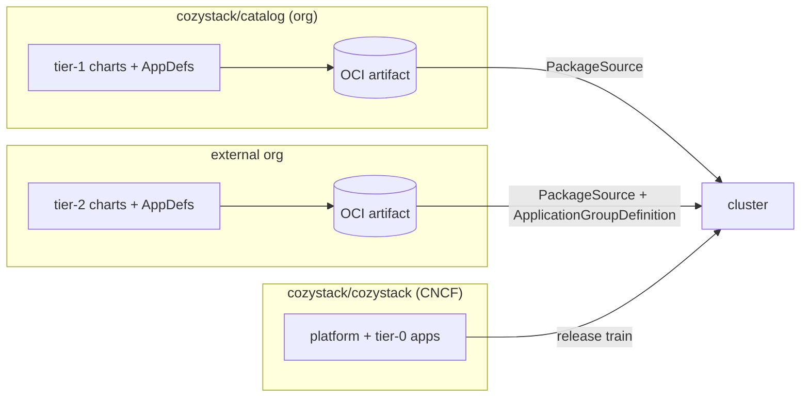

# Out-of-tree application catalogs

- **Title:** `Out-of-tree application catalogs: splitting managed apps out of the core repository`
- **Author(s):** `@lllamnyp`
- **Date:** `2026-07-24`
- **Status:** Review

## Overview

Every managed application Cozystack offers — its chart, its vendored upstream charts, its ApplicationDefinition, its dashboard metadata, its e2e suite — lives in the core `cozystack/cozystack` repository and ships on the platform's release train. This proposal splits the application catalog out of the core repository into separately hosted, separately tested catalog repositories, keeping in-tree only the applications that are part of the platform contract itself. The core platform already has almost all of the machinery this needs: `PackageSource` delivers packages from any Git or OCI source, `ApplicationDefinition` turns a chart into a served API resource at runtime, and the proposed `ApplicationGroupDefinition` (`cozystack/cozystack#3448`, draft MVP) lets an out-of-tree catalog register its own API group instead of squatting the platform's.

The motivation, in decreasing order of importance: first, the core repository is bloated with application definitions that have nothing to do with the platform, taxing review, releases, and every contributor's checkout; second, e2e runs are far too long, and platform changes pay for testing a long tail of legacy applications with little community adoption. As context rather than a settled driver: several catalog upstreams (Redis, MongoDB) ship under source-available terms, and the applicable CNCF questions are under review (`cncf/foundation#1465`); this proposal does not depend on that review's outcome, but separate hosting gives those apps a release and maintenance home independent of the project's, whatever the review concludes.

## Scope and related proposals

- **Builds on:** `cozystack/cozystack#3448` — ApplicationGroupDefinition (draft MVP): dynamic registration of custom API groups served by the cozystack apiserver, with ApplicationDefinitions selecting their group. This proposal is the primary consumer of that mechanism; the tiering and migration here work without it (out-of-tree apps can stay in the default group), but out-of-org catalogs get a clean story only with it.
- **Related:** the `cozystack/external-apps-example` repository — today's reference for third-party catalogs, still on the legacy `GitRepository` → `HelmChart` delivery path; this proposal would make a modernized version of it (on `PackageSource`) the template for every extracted catalog.
- **Related, in flight:** the in-tree Valkey replacement for Redis (`cozystack/cozystack#3406`, `cozystack/cozystack#3380`) — an independent track that proceeds regardless of this proposal.
- **Deferred:** per-catalog dashboard marketplace integration beyond what ApplicationDefinition already carries, and any change to how the platform's own system components (`packages/system`) are delivered.

## Context

A managed app in Cozystack today is spread across the core monorepo: the user-facing chart under `packages/apps/<name>` (often with vendored upstream charts under `charts/`), a generated ApplicationDefinition under `packages/system/<name>-rd/`, a per-app `PackageSource` manifest under `packages/core/platform/sources/`, operator packages under `packages/system/`, and a Chainsaw e2e suite under `hack/e2e-chainsaw/<name>/`. There are currently 23 application packages under `packages/apps` and 8 more tenant modules under `packages/extra`, backed by roughly 22 Chainsaw suites.

Delivery is already source-agnostic at the API level. `PackageSource` (cluster-scoped, `cozystack.io/v1alpha1`) points at a `GitRepository` or `OCIRepository` and declares variants/components; the platform consumes its own apps through per-app PackageSources, and nothing in the mechanism requires the source to be the core repository. `ApplicationDefinition` registers a kind served by the aggregated cozystack apiserver at runtime; `cozystack/cozystack#3448` extends this so a definition can select a custom API group registered through an `ApplicationGroupDefinition`, with `apps.cozystack.io` remaining the default and reserved namespaces (`*.cozystack.io`, `*.k8s.io`) blocked for custom groups.

CI, however, is monolithic. The e2e job boots a three-node QEMU sandbox (8 vCPU / 24 GiB per guest) on a dedicated 32-vCPU / 128-GiB runner class with a 180-minute job timeout. Test Impact Analysis (`hack/select-e2e.sh`) scopes app-only PRs to the affected suites, but any diff touching `api/`, `cmd/`, `internal/`, `packages/core/`, `packages/library/`, top-level `hack/` scripts, or the workflow itself escalates to the full suite — which is precisely the shape of every platform PR. Platform contributors therefore pay the full application tail on every iteration, including apps with little or no community adoption.

### The problem

- **Core bloat.** The application tail dominates the repository: dozens of packages, vendored upstream charts, per-app operators, presets, and dashboards all ride the platform release train, so every app fix waits for a platform release and every platform release carries app churn. Review attention, CODEOWNERS surface, and checkout size all scale with the catalog rather than with the platform.
- **E2E cost.** Full-suite runs occupy a large dedicated runner for up to three hours, and the escalation rule means platform work — the work the core repo exists for — is what pays it. A meaningful share of that wall-clock tests applications that see little adoption; there is no per-app signal cheap enough to justify gating every platform PR on, say, the FoundationDB or HTTP-cache suites.
- **Licensing (context, not a settled conclusion).** Some catalog upstreams ship under source-available terms: Redis 8.4.0 is tri-licensed RSALv2/SSPLv1/AGPLv3, Redis 7.4.7 is RSALv2/SSPLv1, MongoDB 8.0 is SSPL. These are unmodified upstream images pulled by the user's cluster at instance-creation time, not artifacts the project redistributes. The applicable CNCF framework for that shape is the proprietary-interactions guidance rather than the exception process; confirmation is pending in `cncf/foundation#1465`. Until that lands, this proposal does not rely on a licensing conclusion — the case for out-of-tree catalogs stands on repository size and e2e cost alone.

## Goals

- The core repository contains only platform code and the applications that are part of the platform contract; extracted apps live in catalog repositories with their own release cadence.
- Core-repo e2e gates on the platform tier only; each catalog repository owns and runs the e2e suites of its apps against released platform versions.
- Applications whose upstreams ship under source-available terms (at minimum Redis and MongoDB) *can* be hosted outside the core repository, and outside the `cozystack` GitHub org if maintainers so decide, without losing function for existing users — and without this proposal presupposing any licensing conclusion.
- Existing clusters upgrade without user-visible breakage: tenant `Application` resources of extracted apps keep their API group, kind, and behavior.
- A documented, repeatable catalog-repo template exists, so the third extraction is mechanical.

### Non-goals

- Changing how `packages/system` platform components or the installer are built and delivered.
- Designing per-catalog RBAC automation, marketplace curation, or a catalog discovery/registry service — follow-ups, not prerequisites.
- Deciding the final tier assignment of every app in this proposal; the mechanism and the first movers are decided here, the full roster is a maintainer decision per app.
- Hot-reloading the apiserver when catalogs register new API groups (restart-based pickup per `cozystack/cozystack#3448` is accepted for now).

## Design

### Application tiers

Applications are assigned to one of three tiers by explicit criteria rather than by history:

| Tier | Hosted | API group | e2e | Criteria |
|---|---|---|---|---|
| **0 — platform** | in-tree, `packages/apps` | `apps.cozystack.io` | gates core PRs | required by the platform or tenant lifecycle contract (e.g. `tenant`, `kubernetes`, `kubernetes-nodes`, VM primitives) |
| **1 — curated catalog** | `cozystack` org, catalog repo(s) | `apps.cozystack.io` | catalog repo CI, release-gated compat matrix | community-maintained managed apps with real adoption |
| **2 — external catalogs** | outside the org | own group via `ApplicationGroupDefinition` | external repo CI | source-available or vendor-specific upstreams, low-adoption legacy apps |

Redis and MongoDB are the first movers to tier 2: both gain a release and maintenance home independent of the platform's, and for Redis the parallel, unilateral track is the in-tree Valkey replacement already in flight (`cozystack/cozystack#3406`, `cozystack/cozystack#3380`). Tier assignment for everything else is an open question below; the default posture is that an app must argue its way *into* tier 0, not out of it.

### Catalog repository shape

A catalog repository is a modernized `external-apps-example`: app charts (with their vendored upstream charts), their ApplicationDefinition manifests, their Chainsaw suites, and a CI pipeline that publishes the packages as an OCI artifact and runs the suites against a matrix of supported Cozystack releases. A catalog is installed into a cluster as one `PackageSource` with an `OCIRepository` sourceRef; the platform reconciles its components exactly as it reconciles its own per-app sources today, and the catalog's ApplicationDefinitions register the apps' kinds with the cozystack apiserver at runtime.

### API groups and back-compat

Tier 0 and tier 1 apps keep `apps.cozystack.io`: an ApplicationDefinition delivered from *any* source may select the default group, so extraction to a tier-1 catalog changes where the packaging lives, not what tenants see — existing `Application` resources, HelmRelease labels, RBAC grants, and dashboards are untouched. Tier 2 catalogs register their own group (e.g. `apps.example.com`) through an `ApplicationGroupDefinition`; the reserved-namespace rules in `cozystack/cozystack#3448` already prevent them from claiming `*.cozystack.io`. For Redis and MongoDB specifically — existing apps with existing tenant resources — extraction keeps them in `apps.cozystack.io` even from an external repo, because moving a served kind between groups is a breaking rename; whether the default group should eventually be restricted to org-blessed catalogs is an open question.

### CI and e2e

Core-repo e2e shrinks to the tier-0 suites plus the platform conformance tests; the full-suite escalation rule keeps existing semantics but over a much smaller suite set. Each catalog repository carries the Chainsaw suites of its apps (they move with the apps — the suites are already per-app directories) and runs them in its own CI: per-PR against the latest released Cozystack, plus a scheduled run against the platform's `main` to catch breakage early in both directions. The platform repo gains a small conformance suite for the catalog contract itself: a synthetic catalog with a dummy app is installed via PackageSource, its ApplicationDefinition (and, for a custom group, its ApplicationGroupDefinition) must serve, and a resource must reconcile to a HelmRelease — so the *mechanism* is gated in-tree even though no real catalog is.

### Migration mechanics

Extraction of an app is: move its chart, appdef manifest, and Chainsaw suite to the catalog repo; publish the catalog's OCI artifact; add the catalog's `PackageSource` to the platform's default source set (tier 1) or to opt-in documentation (tier 2); delete the in-tree copies. For upgrades of existing clusters the platform release that removes an in-tree tier-2 app also ships the `PackageSource` pointing at its new home as an enabled-by-default source for one release cycle, so nothing disappears on upgrade; a later release flips it to opt-in with a deprecation notice. HelmReleases of running tenant apps are never touched by extraction — only the delivery path of the packages changes.

## User-facing changes

Tenants see nothing change for tier 0/1 apps. For tier 2 apps, cluster admins gain an explicit install step (apply the catalog's PackageSource, and its ApplicationGroupDefinition where applicable) and a heads-up release note during the transition cycle; tenant-visible kinds, specs, and dashboards stay as they are. Documentation for extracted apps moves to (or is generated from) their catalog repos, with the website linking out.

## Upgrade and rollback compatibility

Existing `Application` resources keep working across extraction: the served group and kind are unchanged, and the HelmRelease objects that back them are not touched. Upgrade is seamless for one release cycle (default-enabled PackageSource shim); rollback of an extraction is re-adding the in-tree packages, which is mechanical since the catalog repo's history preserves them. The compatibility contract catalogs pin against — ApplicationDefinition, PackageSource, and (once merged) ApplicationGroupDefinition, all `v1alpha1` today — becomes load-bearing across repos, and graduating it toward stability becomes correspondingly more urgent.

## Security

A catalog is cluster-admin-trust content: its ApplicationDefinitions cause the platform to render and apply arbitrary Helm charts, exactly as in-tree apps do today, so installing a catalog must remain (and is documented as) a cluster-admin action. Out-of-org catalogs cannot claim platform API groups (reserved-namespace validation in `cozystack/cozystack#3448`) and cannot silently shadow built-in Kubernetes groups (dotted-group requirement). Supply-chain integrity of catalog OCI artifacts (signing, provenance) is listed as an open question; nothing in this proposal weakens the existing trust model, but the split makes artifact signing worth standardizing.

## Failure and edge cases

- Catalog source unreachable → Flux surfaces the failure on the `OCIRepository`/`PackageSource` status; already-installed apps keep running from the last reconciled artifacts.
- Catalog deleted while tenant apps exist → ApplicationDefinitions vanish, the kinds stop being served, HelmReleases and workloads keep running; re-adding the catalog restores serving (same semantics as the dangling-group case in `cozystack/cozystack#3448`).
- Two catalogs ship the same kind → kinds are unique across groups; the second registration is skipped and logged (mechanism from `cozystack/cozystack#3448`); within the default group, first-write-wins as today.
- Catalog targets a newer platform than installed → the catalog's declared minimum platform version is checked at PackageSource reconciliation; the source reports not-ready instead of half-installing.
- Platform API change breaks a catalog → caught by the catalog's scheduled run against platform `main` before release, not by users after it.

## Testing

- Unit: the platform-side catalog contract (group resolution, dangling references, kind collisions) is already unit-tested under `cozystack/cozystack#3448`.
- Conformance (in-tree, gating): synthetic-catalog e2e described above — PackageSource install, ApplicationDefinition serving, group registration, resource-to-HelmRelease reconciliation.
- Per-catalog (out-of-tree): the moved Chainsaw suites, per-PR against the latest release and scheduled against `main`.
- Migration: a one-time upgrade test from the last all-in-tree release to the first split release, asserting tenant apps survive untouched.

## Rollout

1. **Phase 0 (prerequisite):** land ApplicationGroupDefinition (`cozystack/cozystack#3448`) and modernize `external-apps-example` onto PackageSource as the catalog template; add the synthetic-catalog conformance suite in-tree.
2. **Phase 1:** extract Redis and MongoDB to an external catalog repository (tier 2), with the default-enabled PackageSource shim for one release cycle; their Chainsaw suites leave the core e2e set.
3. **Phase 2:** stand up the org catalog repo (tier 1) and move the agreed tier-1 apps in batches, one release per batch, dashboards and docs following.
4. **Phase 3:** shrink core e2e to tier 0 + conformance; retire the shim PackageSources; publish the tier criteria and the catalog authoring guide as the durable contract.

## Open questions

- Final tier assignment per app — which of the 23 apps are genuinely tier 0, and which tier-2 candidates beyond Redis/MongoDB (FoundationDB? HTTP-cache? TCP-balancer?) have adoption worth the maintenance at all.
- Where tier 2 lives: a non-CNCF sibling org, per-vendor repos, or maintainers' own orgs — and who holds the keys.
- Should `apps.cozystack.io` eventually be restricted to org-blessed catalogs, with a policy hook at PackageSource or ApplicationDefinition admission?
- How the Redis extraction sequences with the in-tree Valkey replacement already in flight (`cozystack/cozystack#3406`, `cozystack/cozystack#3380`).
- Artifact signing/provenance requirements for catalogs the platform installs by default.
- Downstream surfaces that assume in-tree apps: the website's hardcoded app lists for docs generation, the dashboard console's hardcoded marketplace category list, and `terraform-provider-cozystack`'s hand-written per-app schemas all need an answer per extracted app.
- Versioning of the cross-repo contract: how long `v1alpha1` ApplicationDefinition/PackageSource shapes are guaranteed once external catalogs depend on them.

## Alternatives considered

- **Keep the monorepo, filter CI harder.** Better test-impact analysis (already in place) and label gates reduce e2e pain but do nothing for repository size or release coupling, and the full-suite escalation on platform changes is inherent to a monorepo whose platform and apps share files.
- **Feature-flag legacy apps off by default, keep them in-tree.** Reduces e2e cost but the whole catalog still rides the platform release train and dominates the repository — the primary motivations unaddressed.
- **Move only charts out, keep ApplicationDefinitions in-tree.** Splits one app across two repos and keeps the release coupling for the API-visible half; strictly worse than moving the app whole.
- **Git submodules / build-time vendoring of catalogs into release artifacts.** Re-aggregates everything at release time, so the release coupling and full-catalog testing burden return through the back door; the worst of both worlds operationally.
- **Delete low-adoption apps outright.** Frees e2e and maintenance at users' expense; extraction preserves the apps for the communities that want them while decoupling them from the platform.
