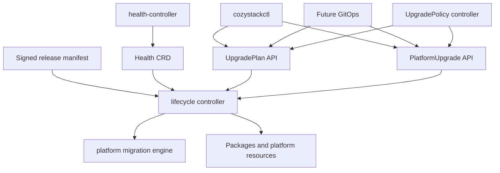

# Declarative Cozystack platform lifecycle and upgrades

- **Title:** `Declarative Cozystack platform lifecycle, upgrade planning, and unattended execution`
- **Author(s):** `@myasnikovdaniil`
- **Date:** `2026-09-04`
- **Status:** Draft

## Overview

Cozystack upgrades change a distributed platform rather than one Helm release. A safe upgrade has to identify the current state, resolve a supported target, check live infrastructure health, disclose breaking changes, execute migrations and component updates in the required order, wait for readiness, and preserve enough progress to recover after interruption. A workstation process cannot own that lifecycle reliably, and existing Helm hooks expose only individual pieces of it.

This proposal introduces a durable in-cluster lifecycle API and controller. The controller builds an immutable upgrade plan from a versioned release manifest and observed cluster state, executes an approved plan step by step, consumes the read-only `Health` API as an input to safety gates, and records progress in Kubernetes resources. A focused `cozystackctl` is one client of this API; future GitOps and unattended-upgrade policy submit the same intent without creating another execution path.

The first implementation is upgrade-first. Installation uses the same release contract and server-side convergence after a small bootstrap step, but may ship after supervised upgrades prove the controller and API.

## Scope and related proposals

- [Unified health reporting, community#64](https://github.com/cozystack/community/pull/64) defines the read-only `Health` CRD and controller that materialize current component facts. This proposal consumes those facts and does not add mutation or remediation to the health controller.
- [Platform migration engine, community#58](https://github.com/cozystack/community/pull/58) defines migration identity, ordering, tiers, and the applied-set ledger. The lifecycle controller delegates migration execution and reads its outcomes rather than defining another migration format.
- [GitOps configuration surfaces, community#16](https://github.com/cozystack/community/pull/16) is the future declarative source for platform configuration. GitOps may create lifecycle API resources, but the lifecycle controller remains the only upgrade executor.
- [Cozystack as a distribution, community#46](https://github.com/cozystack/community/pull/46) proposes independently versioned components and a distribution manifest. This proposal defines the minimum release metadata required for planning and should converge on that manifest rather than create a parallel release model.
- [Cozystack user CLI, community#51](https://github.com/cozystack/community/pull/51) is narrowed to the tenant and managed-service CLI `cozyctl`. The operator-facing `cozystackctl` described here contains lifecycle commands only and is not a general replacement for `kubectl`, Flux, or package tooling.
- [Pre-upgrade health gate, cozystack#3458](https://github.com/cozystack/cozystack/pull/3458) is existing upgrade safety work. Its checks are immediate prior art for lifecycle preflight and should move behind the same gate interface as Health-based checks when the controller is implemented.

Automated general-purpose remediation is not part of this proposal. A later proposal may define bounded remediation actions and policies against the same health facts and audit model.

## Context

Today the target platform version is changed outside a durable upgrade API. Helm reconciliation, pre-upgrade hooks, migration Jobs, Package and HelmRelease status, and live infrastructure checks collectively determine whether the transition succeeds. No single object records the resolved target artifact, the plan that was approved, the current step, or whether an interrupted operation is safe to resume.

The platform migration engine improves one critical part of this flow, but a migration ledger is not a whole-upgrade state machine. The health proposal creates a stable snapshot of actionable component facts, but it is intentionally read-only and does not decide whether a release may proceed. GitOps will eventually provide a declarative source of intent, but a reconciler applying a version change still needs a server-side component that understands upgrade ordering and failure semantics.

### The problem

An operator considering an upgrade needs answers before anything changes:

- Is the requested source-to-target path supported?
- Which resources, components, and migrations will change?
- Which breaking changes require acknowledgement or manual preparation?
- Is the current cluster healthy enough for each risky step?
- Which steps are irreversible?

During execution the operation must survive loss of the terminal, a controller restart, API interruption, and transient component failures without losing its position or silently starting a different plan. After failure it must distinguish a safe retry, a required manual action, and a point after which automatic rollback would be dishonest.

Unattended upgrades add another requirement: automation may select and execute only releases allowed by an explicit channel, maintenance window, health policy, and breaking-change policy. “Latest available” is not sufficient authorization to mutate a platform.

## User jobs

| Job | Decision enabled | Minimum result |
|---|---|---|
| Preview an upgrade | Proceed, prepare, or postpone | Compatibility, steps, affected components, migrations, breaking changes, blockers, and irreversible boundaries |
| Run a supervised upgrade | Approve one known transition | An immutable plan reference, live progress, bounded waits, and a terminal outcome |
| Recover an interrupted upgrade | Resume or intervene | Last completed step, recorded side effects, retry safety, and actionable failure reason |
| Operate an upgrade fleet | Permit safe unattended execution | Channel, window, health requirements, skew limits, and breaking-change policy |
| Audit a past upgrade | Explain what changed and why | Resolved release digest, plan digest, approvals, step outcomes, timestamps, and overrides |
| Install a new platform | Bootstrap then converge server-side | Prerequisite report, resolved release, durable installation status, and the same postflight checks as upgrade |

## Goals

- Build a complete, immutable plan before mutating platform resources.
- Make compatibility, breaking changes, migrations, health requirements, and irreversible steps machine-readable.
- Execute an approved plan inside the cluster and survive client or controller interruption.
- Make retries idempotent and record every step and override.
- Re-evaluate live health gates at execution time instead of trusting only the planning snapshot.
- Support supervised upgrades first and constrained unattended upgrades after the same state machine is proven.
- Let CLI, future GitOps, and policy automation use the same Kubernetes API and controller.
- Reuse the health-reporting and platform-migration contracts rather than duplicating their collectors or runners.
- Keep installation compatible with the same release and step model after a minimal bootstrap.

### Non-goals

- A general operator toolbox or replacement for `kubectl`, Flux, Helm, `cozypkg`, or component-native tools.
- Adding mutation, root-cause inference, or remediation to `health-controller`.
- Inferring breaking changes solely by diffing live Kubernetes objects or release artifacts.
- Promising automatic rollback across arbitrary CRD, schema, storage, or data migrations.
- Allowing unattended policy to acknowledge unknown breaking changes or irreversible manual actions.
- General-purpose self-healing. Any future remediation must use enumerated actions with separate authorization and safety policy.
- Making GitOps a prerequisite for lifecycle operation.
- Defining package-by-package release versioning independently of the distribution proposal.

## Design

### 1. Responsibility boundaries



`health-controller` is a sensor: it reads component-native sources and writes current facts with freshness deadlines. The lifecycle controller is an actor: it consumes release metadata, lifecycle intent, health facts, migration state, and resource status and may mutate the platform. They use separate Deployments, ServiceAccounts, and RBAC so a bug in an upgrade adapter cannot corrupt health reporting and a health collector never inherits platform-wide write access.

The CLI is not the control plane. It creates or reads lifecycle resources and watches their status. Closing the CLI, losing the SSH session, or running another client does not stop or fork an accepted operation.

### 2. Release contract

Every installable release publishes an immutable manifest addressed by digest. The exact artifact and component-version model should be shared with the distribution proposal, but lifecycle planning requires at least:

```yaml
apiVersion: release.cozystack.io/v1alpha1
kind: Release
metadata:
  version: v1.8.0
spec:
  artifacts:
    platform: oci://ghcr.io/cozystack/cozystack/platform@sha256:...
  compatibility:
    fromVersions: [">=1.7.0 <1.8.0"]
    kubernetes: [">=1.31 <1.34"]
    talos: [">=1.10 <1.12"]
  breakingChanges:
    - id: remove-legacy-network-mode
      summary: Legacy network mode is no longer supported
      requiresAcknowledgement: true
      action: Migrate affected clusters before applying this release
  steps:
    - id: preflight
      type: HealthGate
      policy: upgrade-default
    - id: blocking-migrations
      type: MigrationBatch
      tier: pre-apply
    - id: apply-platform
      type: ApplyRelease
      artifact: platform
    - id: wait-platform
      type: ReadinessGate
      timeout: 45m
    - id: postflight
      type: HealthGate
      policy: upgrade-postflight
```

Breaking changes are authored and reviewed with the release. Each has a stable ID, human summary, required action, and acknowledgement policy. The planner may add observed impact, such as the number of resources using a removed option, but it cannot manufacture the authoritative breaking-change list from a diff.

Step types form a versioned allowlist implemented by the lifecycle controller. The manifest contains data, never executable shell, templates, or arbitrary commands. Unknown required step types make the release unsupported rather than skipped.

The artifact digest, release metadata, source version, relevant configuration fingerprint, ordered step graph, and acknowledged breaking-change IDs contribute to the plan digest. Volatile health observations do not: health is reported in the plan snapshot and evaluated again by gates immediately before execution.

### 3. UpgradePlan API

`UpgradePlan` is namespaced in `cozy-system`. Creating it writes a planning request but does not mutate managed platform resources.

```yaml
apiVersion: lifecycle.cozystack.io/v1alpha1
kind: UpgradePlan
metadata:
  name: to-v1-8-0
  namespace: cozy-system
spec:
  target:
    ref: oci://ghcr.io/cozystack/releases:v1.8.0
  acknowledgements:
    - remove-legacy-network-mode
status:
  phase: Ready
  currentVersion: v1.7.2
  currentReleaseDigest: sha256:...
  targetVersion: v1.8.0
  targetReleaseDigest: sha256:...
  planDigest: sha256:...
  compatible: true
  healthSnapshot:
    observedAt: "2026-09-04T09:00:00Z"
    overall: Healthy
  breakingChanges: []
  blockers: []
  warnings: []
  steps: []
  conditions: []
```

Plan phases are `Pending`, `Ready`, `Blocked`, `Invalid`, and `Expired`. A blocked plan remains inspectable and says which precondition or acknowledgement is missing. `Ready` means the transition is structurally executable at planning time, not that future health gates are guaranteed to pass.

The controller resolves mutable tags to immutable digests before setting `Ready`. A plan expires when the current release or configuration fingerprint no longer matches its inputs. A new target digest always requires a new plan even if the display version is unchanged.

Plans are retained for audit for a configurable period and may be garbage-collected only when no `PlatformUpgrade` references them.

### 4. PlatformUpgrade API

`PlatformUpgrade` authorizes execution of exactly one ready plan:

```yaml
apiVersion: lifecycle.cozystack.io/v1alpha1
kind: PlatformUpgrade
metadata:
  name: v1-8-0-20260904
  namespace: cozy-system
spec:
  planRef:
    name: to-v1-8-0
  planDigest: sha256:...
  approval: Approved
  suspend: false
status:
  phase: Running
  currentStep: apply-platform
  startedAt: "2026-09-04T09:10:00Z"
  steps:
    - id: preflight
      phase: Succeeded
      startedAt: "2026-09-04T09:10:00Z"
      finishedAt: "2026-09-04T09:10:08Z"
    - id: blocking-migrations
      phase: Succeeded
    - id: apply-platform
      phase: Running
  conditions: []
```

Upgrade phases are `Pending`, `Preflighting`, `Running`, `Paused`, `Succeeded`, and `Failed`. Steps record stable reason codes, timestamps, attempts, observed resource references, and whether retry is safe. Human messages supplement structured fields and are never the only carrier of a decision.

The controller rejects execution when the referenced plan is not `Ready`, the digest differs, the source version changed, another upgrade holds the cluster lifecycle Lease, or required acknowledgements are absent. It re-evaluates all enforcing health and compatibility gates before the first mutation and before every step that declares a gate.

`spec.suspend: true` pauses before the next step boundary. It does not interrupt a migration or apply operation mid-write. Admission rejects deletion while a `PlatformUpgrade` is active, and a finalizer is a backstop against disappearance before a terminal state is recorded. An operator suspends first and resolves or resumes the operation; deletion is never presented as cancellation or rollback.

Only one `PlatformUpgrade` may be active for the cluster. A Lease prevents concurrent reconcilers, while admission and status expose the conflict to users instead of silently queueing a second operation.

### 5. Execution and recovery

The lifecycle controller persists the completion of each step before starting the next. Every executor must define an idempotency key derived from the operation UID, plan digest, and step ID. Reconciliation after a restart observes existing Jobs and resources before creating or changing anything.

Blocking migrations are delegated to the migration engine defined by community#58 and considered complete only when its ledger records the required outcomes. Background migrations may continue after the platform reaches its target version; their pending or failed state remains visible without rewriting the migration contract inside `PlatformUpgrade`.

Apply steps use Kubernetes clients or internal controller APIs, never shell out to `kubectl`, Helm, or Flux. A step that delegates to another controller records the exact desired revision and waits on that controller's structured status with a bounded timeout.

Failure policy is declared by step type and release metadata:

- A transient read or watch error retries within the step's original deadline.
- A health gate that is `Unknown`, stale, or unreadable fails closed when enforcing and records an explicit reason.
- An advisory gate records a warning and proceeds; the release manifest, not the client, decides which gates may be advisory by default.
- A failed idempotent step may be retried or resumed after its cause is removed.
- A failed irreversible step pauses for manual intervention and is never automatically rolled back.
- A client-side override is recorded in the API with actor, reason, gate IDs, and timestamp; it cannot erase the original failure.

`resume` is not a separate execution path. It clears an allowed pause or retries the current step through the same reconciler after preconditions are rechecked.

### 6. Health gates

The lifecycle controller reads `Health` objects from community#64 and treats any object past `freshUntil` as `Unknown`, regardless of its stored `overall` value. A gate selects required scopes and components and declares which states block execution.

The plan reports the health snapshot used during planning, but approval never freezes health. Execution evaluates a fresh snapshot immediately before mutation. This prevents a plan generated on a healthy cluster from bypassing a failure that appears before apply.

Checks not yet represented by `Health`, including existing pre-upgrade probes from cozystack#3458, implement the same bounded gate result contract: stable ID, state, severity, observed resources, reason, message, freshness, and retryability. As health adapters mature, duplicate one-shot collectors are removed rather than queried twice.

The lifecycle controller does not infer an unbounded causal graph or repair the failed component. It says which gate blocked which step and links the underlying Health conditions or direct check results.

### 7. Unattended upgrades

`UpgradePolicy` is optional and namespaced in `cozy-system`:

```yaml
apiVersion: lifecycle.cozystack.io/v1alpha1
kind: UpgradePolicy
metadata:
  name: stable
  namespace: cozy-system
spec:
  channel: stable
  unattended: true
  maintenanceWindow:
    schedule: "0 2 * * 6"
    duration: 4h
    timeZone: UTC
  versions:
    maxMinorSkew: 1
  healthPolicy: upgrade-default
  breakingChanges:
    allowAcknowledgementRequired: false
  irreversibleSteps:
    allow: false
```

The policy controller resolves a candidate, creates an `UpgradePlan`, and creates a `PlatformUpgrade` only if the plan is ready and every policy constraint passes inside the maintenance window. It never auto-acknowledges a breaking change, manual action, unknown step type, or forbidden irreversible step.

A policy cannot weaken release-declared mandatory gates. It may make advisory checks enforcing, narrow the channel or version range, and disable automation. Every skipped candidate and rejected plan remains visible through status without repeatedly creating failed operations.

### 8. Installation

Installation has an unavoidable bootstrap boundary because the lifecycle CRDs and controller do not exist on an empty cluster. `cozystackctl install bootstrap` therefore performs only the minimum client-owned step: validate Kubernetes reachability, resolve and verify the selected release, and server-side apply a small versioned bootstrap bundle containing lifecycle CRDs, the controller Deployment, ServiceAccount, and RBAC.

After bootstrap, `install plan` creates an `InstallationPlan`. It uses the same immutable artifact resolution, step schema, blockers, and plan-digest rules as `UpgradePlan`; the absence of an installed current release selects installation semantics. Planning does not install the remaining platform.

`install apply` creates a `PlatformInstallation` referencing the immutable plan and release digests and watches it. The controller performs prerequisite checks, installs the remaining core resources, records each step, and runs the same readiness and postflight health gates used for upgrades. Closing the CLI does not interrupt installation.

The bootstrap bundle contains no release-specific platform payload beyond the controller version needed to understand the requested release contract. Re-running bootstrap is idempotent. Upgrading the bootstrap controller itself is an explicit early step in later release plans, with compatibility guaranteed across the supported source-to-target window.

The first rollout may ship upgrade support before `PlatformInstallation`; this ordering does not change the API boundary or move platform convergence back into the client.

### 9. Operator CLI

`cozystackctl` is a focused lifecycle client:

```text
cozystackctl
├── install
│   ├── bootstrap
│   ├── plan
│   ├── apply
│   └── status
├── upgrade
│   ├── plan
│   ├── apply
│   ├── status
│   └── resume
├── version
└── completion
```

`upgrade plan` creates or reuses an identical `UpgradePlan` and waits for a terminal planning phase. `upgrade apply` creates `PlatformUpgrade` with the exact displayed digest. `upgrade status` reads the API object; `resume` changes allowed intent fields and never runs steps locally.

Human output summarizes decisions and current progress. `--output=json|yaml` emits API objects or a versioned projection to stdout, with progress and warnings on stderr. JSON watch output is newline-delimited. Stable API reasons and conditions, rather than CLI-parsed messages, define automation behavior.

The CLI holds no background lock and stores no platform credentials outside kubeconfig. It uses Kubernetes RBAC and does not become a second implementation of planning or execution.

## User-facing changes

A supervised upgrade becomes:

```console
cozystackctl upgrade plan --to v1.8.0
cozystackctl upgrade apply to-v1-8-0 --plan-digest sha256:...
cozystackctl upgrade status v1-8-0-20260904 --watch
```

The same intent can later be committed to Git as `UpgradePlan` and `PlatformUpgrade` resources. Operators may also use `kubectl get upgradeplans,platformupgrades -n cozy-system` without installing the CLI.

## Upgrade and rollback compatibility

The lifecycle API is additive. Existing version-change and Helm-hook behavior remains in place until the controller can execute the equivalent path and its result has been tested against supported source versions.

The controller supports release-contract versions explicitly. An unsupported newer contract fails during planning without modifying the platform. New optional fields are additive; new mandatory step types require a controller version that declares support.

Rollback is not modeled as deleting an upgrade or replaying its steps backwards. A downgrade is a separately planned transition and is offered only when the target release declares a supported path and every executed migration or schema change is compatible. Otherwise the operation reports that restore or documented manual recovery is required.

## Security

- The health controller remains read-only and uses a different ServiceAccount from the lifecycle controller.
- Lifecycle CRDs are writable only by explicitly authorized platform administrators, GitOps identities, and the policy controller.
- `PlatformUpgrade` admission validates the plan reference, digest, approval, and allowed acknowledgements before execution.
- Release manifests and bootstrap bundles are resolved to immutable digests and verified according to the project's artifact-signing policy before use.
- Release manifests contain data and typed step declarations only; they cannot carry shell commands or arbitrary templates.
- Controller logs, conditions, plans, and CLI output never include kubeconfig data, Secret values, bearer tokens, or registry credentials.
- Overrides are additive audit records and cannot rewrite the original failed observation.
- Unattended policy cannot widen controller RBAC or bypass mandatory release gates.

## Failure and edge cases

- **The CLI exits during an upgrade** → the in-cluster operation continues and another client can watch it.
- **The lifecycle controller restarts** → it observes the persisted step and delegated resources and resumes without duplicating side effects.
- **The release tag moves after planning** → execution still uses the resolved digest; applying a new digest requires a new plan.
- **The source version or relevant configuration changes after planning** → the plan expires and execution is rejected.
- **Health data is stale or the health controller is down** → enforcing gates become `Unknown` and block; no stored green state is trusted past `freshUntil`.
- **A component degrades between plan and apply** → the execution-time gate blocks before the first mutation.
- **A component degrades between steps** → the next declared gate pauses the operation and records the observed conditions.
- **A blocking migration fails** → the upgrade stops and exposes the migration ledger outcome; resume uses the migration engine's supported retry path.
- **An irreversible step fails after partial completion** → the operation pauses or fails with manual recovery instructions and never advertises automatic rollback.
- **Two upgrades are submitted** → one holds the lifecycle Lease and the other is rejected with a structured conflict.
- **Deletion is requested for an active operation** → admission rejects it and the finalizer prevents disappearance until the operation reaches a terminal state; deletion never cancels or rolls back work.
- **An unattended candidate contains a breaking change requiring acknowledgement** → the policy reports the candidate as blocked and performs no mutation.
- **The release manifest contains an unknown required step** → planning is `Invalid` and performs no mutation.
- **Bootstrap is applied twice** → server-side apply is idempotent and the existing installation operation is reused or reported.

## Testing

- Unit tests cover release-contract parsing, compatibility, breaking-change acknowledgements, plan hashing, step-state transitions, policy decisions, and stable reason codes.
- Controller integration tests cover API validation, single-operation locking, persisted progress, restart recovery, suspension at step boundaries, finalizers, and plan invalidation.
- Adapter tests use recorded Health objects, migration ledgers, Package and HelmRelease statuses, including stale, malformed, forbidden, and partially unavailable inputs.
- Fault-injection tests terminate the CLI and lifecycle controller during every step boundary and assert no duplicate mutation and correct resume behavior.
- Upgrade e2e covers each supported source version to the target release, at least one skipped-minor path where supported, failing preflight, blocking migration failure, readiness timeout, and postflight degradation.
- Unattended e2e verifies maintenance windows, channel selection, health blocking, breaking-change refusal, and single-operation behavior.
- Installation e2e starts with only Kubernetes access, applies bootstrap, loses the client process, and verifies server-side completion and postflight health.
- Security tests verify separate health/lifecycle RBAC, unauthorized plan and approval rejection, release digest verification, and absence of secrets in API status, events, logs, and CLI output.

## Rollout

1. **Release contract and read-only planning.** Publish immutable release metadata, add `UpgradePlan`, and compare its output with existing manual upgrade expectations without allowing execution.
2. **Supervised upgrades.** Add `PlatformUpgrade`, the lifecycle Lease, health gates, migration-engine delegation, persisted steps, and CLI plan/apply/status/resume commands. Existing upgrade entry points remain available during validation.
3. **Make the lifecycle path authoritative.** Route supported upgrades through the controller, retain compatibility tooling only as a client or emergency path, and document recovery boundaries.
4. **Unattended policy.** Add `UpgradePolicy` after supervised upgrades demonstrate restart safety and idempotency across supported version paths.
5. **Installation.** Ship the minimal bootstrap bundle and `PlatformInstallation`, then move post-bootstrap convergence into the same lifecycle engine.
6. **Future GitOps integration.** Accept lifecycle resources from the GitOps surface without changing the controller or execution semantics.

## Open questions

1. Which proposal owns the final release-manifest schema, and what minimum subset can lifecycle planning require before distribution-level component versioning lands?
2. Should lifecycle resources remain namespaced in `cozy-system` for RBAC and audit consistency, or is any object required to be cluster-scoped?
3. Which Health components and direct checks form the mandatory default preflight and postflight policies for the first supported upgrade path?
4. How are acknowledgement actor and reason represented when intent comes from GitOps rather than an interactive user?
5. Which executed states permit suspension or deletion to finish, and which require the operation object to remain protected indefinitely for recovery?
6. What is the smallest bootstrap bundle that can install a compatible lifecycle controller without embedding the platform release payload in the CLI?
7. How long are plans and completed operation records retained, and which component owns archival beyond that window?

## Alternatives considered

**Execute upgrades inside `cozystackctl`.** Rejected because the operation would depend on a workstation process, duplicate server-side state observation, and make unattended execution a second implementation rather than another source of intent.

**Add upgrade execution to `health-controller`.** Rejected because it destroys the read-only trust boundary, gives every health adapter platform-wide mutation privileges, and couples the reliability of health facts to the actor consuming them.

**Use Helm hooks as the complete lifecycle engine.** Existing hooks remain useful execution mechanisms during migration, but they do not provide a complete immutable plan, cross-release compatibility contract, durable multi-step status, policy-driven scheduling, or honest recovery semantics.

**Let Flux or future GitOps own step orchestration.** GitOps is a source of desired state, not a domain-specific upgrade state machine. It may create lifecycle CRs and observe their status, while the lifecycle controller owns ordering, gates, migrations, and recovery.

**Infer breaking changes from Kubernetes or Helm diffs.** Diffs can add observed impact to a plan but cannot determine semantic compatibility, required manual preparation, or data-migration reversibility. Authoritative breaking changes must be shipped as release metadata.

**Automatically roll back every failed upgrade.** Rejected because CRD conversion, storage changes, and data migrations are not generally reversible. A downgrade is safe only when represented as its own supported plan.

**Provide unrestricted self-healing alongside upgrades.** Rejected from this scope. Automatic repair requires action-specific preconditions, rate limits, authorization, and blast-radius controls and should not inherit trust merely because a Health condition exists.

---

<!-- Inspired by KubeVirt enhancement proposals and Kubernetes Enhancement Proposals (KEPs). -->
