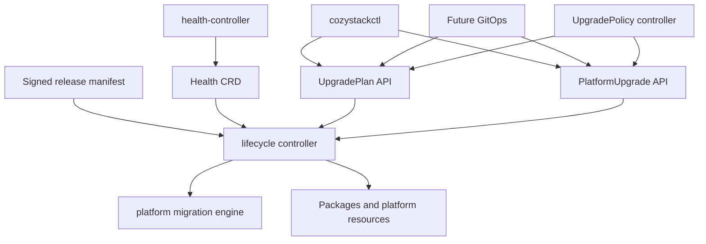

# Declarative Cozystack platform lifecycle and upgrades

- **Title:** `Declarative Cozystack platform lifecycle, upgrade planning, and unattended execution`
- **Author(s):** `@myasnikovdaniil`
- **Date:** `2026-09-04`
- **Status:** Draft

## Overview

Cozystack upgrades change a distributed platform rather than one Helm release. A safe upgrade has to identify the current state, resolve a supported target, check live infrastructure health, disclose breaking changes, execute migrations and component updates in the required order, wait for readiness, and preserve enough progress to recover after interruption. A workstation process cannot own that lifecycle reliably, and existing Helm hooks expose only individual pieces of it.

This proposal introduces a durable in-cluster lifecycle API and controller. The controller builds an immutable upgrade plan from a versioned release manifest and observed cluster state, executes an approved plan step by step, consumes the read-only `Health` API as an input to safety gates, and records progress in Kubernetes resources. A focused `cozystackctl` is one client of this API; future GitOps and unattended-upgrade policy submit the same intent without creating another execution path.

The first implementation is upgrade-first. Installation uses the same release contract and server-side convergence after a small bootstrap step, but may ship after supervised upgrades prove the controller and API.

## Scope and related proposals

- [Unified health reporting, community#64](https://github.com/cozystack/community/pull/64) defines the read-only `Health` CRD and controller that materialize current component facts. This proposal consumes those facts and does not add mutation or remediation to the health controller.
- [Platform migration engine, community#58](https://github.com/cozystack/community/pull/58) defines migration identity, ordering, tiers, and the applied-set ledger. The lifecycle controller delegates migration execution and reads its outcomes rather than defining another migration format.
- [GitOps configuration surfaces, community#16](https://github.com/cozystack/community/pull/16) is the future declarative source for platform configuration. GitOps may create lifecycle API resources, but the lifecycle controller remains the only upgrade executor.
- [Cozystack as a distribution, community#46](https://github.com/cozystack/community/pull/46) proposes independently versioned components and a distribution manifest. This proposal defines the minimum release metadata required for planning and should converge on that manifest rather than create a parallel release model.
- [Cozystack user CLI, community#51](https://github.com/cozystack/community/pull/51) is narrowed to the tenant and managed-service CLI `cozyctl`. The operator-facing `cozystackctl` described here contains lifecycle commands only and is not a general replacement for `kubectl`, Flux, or package tooling.
- [Pre-upgrade health gate, cozystack#3458](https://github.com/cozystack/cozystack/pull/3458) is existing upgrade safety work. Its checks are immediate prior art for lifecycle preflight and should move behind the same gate interface as Health-based checks when the controller is implemented.

Automated general-purpose remediation is not part of this proposal. A later proposal may define bounded remediation actions and policies against the same health facts and audit model.

## Decisions

<!-- Initial proposal; implementation decisions will be recorded under decisions/ and linked here. -->

## Context

Today the target platform version is changed outside a durable upgrade API. Helm reconciliation, pre-upgrade hooks, migration Jobs, Package and HelmRelease status, and live infrastructure checks collectively determine whether the transition succeeds. No single object records the resolved target artifact, the plan that was approved, the current step, or whether an interrupted operation is safe to resume.

The platform migration engine improves one critical part of this flow, but a migration ledger is not a whole-upgrade state machine. The health proposal creates a stable snapshot of actionable component facts, but it is intentionally read-only and does not decide whether a release may proceed. GitOps will eventually provide a declarative source of intent, but a reconciler applying a version change still needs a server-side component that understands upgrade ordering and failure semantics.

### The problem

An operator considering an upgrade needs answers before anything changes:

- Is the requested source-to-target path supported?
- Which resources, components, and migrations will change?
- Which breaking changes require acknowledgement or manual preparation?
- Is the current cluster healthy enough for each risky step?
- Which steps are irreversible?

During execution the operation must survive loss of the terminal, a controller restart, API interruption, and transient component failures without losing its position or silently starting a different plan. After failure it must distinguish a safe retry, a required manual action, and a point after which automatic rollback would be dishonest.

Unattended upgrades add another requirement: automation may select and execute only releases allowed by an explicit channel, maintenance window, health policy, and breaking-change policy. “Latest available” is not sufficient authorization to mutate a platform.

## User jobs

| Job | Decision enabled | Minimum result |
|---|---|---|
| Preview an upgrade | Proceed, prepare, or postpone | Compatibility, steps, affected components, migrations, breaking changes, blockers, and irreversible boundaries |
| Run a supervised upgrade | Approve one known transition | An immutable plan reference, live progress, bounded waits, and a terminal outcome |
| Recover an interrupted upgrade | Resume or intervene | Last completed step, recorded side effects, retry safety, and actionable failure reason |
| Schedule upgrades on a cluster | Permit safe unattended execution | Channel, window, health requirements, skew limits, and breaking-change policy |
| Audit a past upgrade | Explain what changed and why | Resolved release digest, plan digest, approvals, step outcomes, timestamps, and overrides |
| Install a new platform | Bootstrap then converge server-side | Prerequisite report, resolved release, durable installation status, and the same postflight checks as upgrade |

## Goals

- Build a complete, immutable plan before mutating platform resources.
- Make compatibility, breaking changes, migrations, health requirements, and irreversible steps machine-readable.
- Execute an approved plan inside the cluster and survive client or controller interruption.
- Make retries idempotent and record every step and override.
- Re-evaluate live health gates at execution time instead of trusting only the planning snapshot.
- Support supervised upgrades first and constrained unattended upgrades after the same state machine is proven.
- Let CLI, future GitOps, and policy automation use the same Kubernetes API and controller.
- Reuse the health-reporting and platform-migration contracts rather than duplicating their collectors or runners.
- Keep installation compatible with the same release and step model after a minimal bootstrap.

### Non-goals

- A general operator toolbox or replacement for `kubectl`, Flux, Helm, `cozypkg`, or component-native tools.
- Adding mutation, root-cause inference, or remediation to `health-controller`.
- Inferring breaking changes solely by diffing live Kubernetes objects or release artifacts.
- Promising automatic rollback across arbitrary CRD, schema, storage, or data migrations.
- Allowing unattended policy to acknowledge unknown breaking changes or irreversible manual actions.
- General-purpose self-healing. Any future remediation must use enumerated actions with separate authorization and safety policy.
- Making GitOps a prerequisite for lifecycle operation.
- Defining package-by-package release versioning independently of the distribution proposal.
- Management Kubernetes or Talos upgrades, node provisioning, drain, reboot, and storage repair. Their versions and health are compatibility inputs; changing them requires a separate executor and authorization contract.

## Design

### 1. Responsibility boundaries



`health-controller` is a sensor: it reads component-native sources and writes current facts with freshness deadlines. The lifecycle controller is an actor: it consumes release metadata, lifecycle intent, health facts, migration state, and resource status and may mutate the platform. They use separate Deployments, ServiceAccounts, and RBAC so a bug in an upgrade adapter cannot corrupt health reporting and a health collector never inherits platform-wide write access.

The optional policy controller is a third Deployment with its own ServiceAccount and restricted RBAC. It selects candidates and submits policy-bound intent but cannot use the executor's credentials or supervised recovery permissions. It is not co-located with the privileged lifecycle reconciler.

The CLI is not the control plane. It creates or reads lifecycle resources and watches their status. Closing the CLI, losing the SSH session, or running another client does not stop or fork an accepted operation.

### 2. Release contract

Every release supported by this lifecycle path must publish an immutable manifest addressed by digest. Releases without this metadata remain on the legacy path and return `UnsupportedRelease` during planning. The exact artifact and component-version model should be shared with the distribution proposal, but lifecycle planning requires at least the following fields. This is an illustrative artifact document, not a Kubernetes resource; versions, changes, and digests below are examples, not claims about published releases or supported version ranges.

```yaml
apiVersion: release.cozystack.io/v1alpha1
kind: Release
metadata:
  version: v1.8.0
spec:
  artifacts:
    platform: oci://ghcr.io/cozystack/cozystack/platform@sha256:...
  compatibility:
    lifecycleProtocol: v1alpha1
    fromVersions: [">=1.7.0 <1.8.0"]
    kubernetes: [">=1.31 <1.34"]
    talos: [">=1.10 <1.12"]
  lifecycleController:
    version: v0.2.0
    image: ghcr.io/cozystack/lifecycle-controller@sha256:...
    reads:
      planProtocols: [v1alpha1]
      operationAPIs: [lifecycle.cozystack.io/v1alpha1]
      journalEncodings: [v1]
      crdStorageVersions: [v1alpha1]
    writes:
      journalEncoding: v1
      crdStorageVersion: v1alpha1
  breakingChanges:
    - id: remove-legacy-network-mode
      summary: Legacy network mode is no longer supported
      requiresAcknowledgement: true
      action: Migrate affected clusters before applying this release
      precondition: no-legacy-network-mode
  steps:
    - id: preflight
      type: HealthGate
      policy: upgrade-default
      timeout: 5m
      disruption: None
      reversibility: NotApplicable
      safePauseAfter: true
    - id: apply-platform
      type: ApplyRelease
      artifact: platform
      timeout: 45m
      controllerUpdate: lifecycleController
      migrations:
        executionOwner: HelmPreUpgradeHook
        tier: pre-apply
        manifestDigest: sha256:...
      disruption: Possible
      reversibility: ForwardOnly
      safePauseAfter: true
    - id: wait-platform
      type: ReadinessGate
      timeout: 45m
      disruption: None
      reversibility: NotApplicable
      safePauseAfter: true
    - id: postflight
      type: HealthGate
      policy: upgrade-postflight
      timeout: 10m
      disruption: None
      reversibility: NotApplicable
      safePauseAfter: true
```

Breaking changes are authored and reviewed with the release. Each has a stable ID, human summary, required action, applicability check, and acknowledgement policy. For a multi-release hop the manifest includes the union of changes applicable to every supported source path, not just the target release notes. Acknowledgement records acceptance of a disclosed consequence; it never satisfies a machine-checkable prerequisite such as removal of incompatible resources. Unknown applicability remains visible and blocks unattended execution.

Step types and prerequisite checks form a versioned allowlist implemented by the lifecycle controller. The manifest contains data, never executable shell, templates, or arbitrary commands. Every step must declare `timeout`, `disruption`, and `reversibility`; omission makes the plan `Invalid`. Read-only gates use `None` and `NotApplicable` explicitly. Optional `retry` defaults to no retry, `safePauseAfter` to `false`, and dependencies to the preceding step in the ordered sequence. Unknown step types or unsupported protocol versions make the release unsupported rather than skipped. Irreversible does not mean non-idempotent: an irreversible executor still needs a safe replay contract or explicit manual recovery.

A safe pause boundary means the platform may remain there without the next step being dispatched, not merely that a Job has exited. Consecutive steps without such a boundary form one non-pausable segment. Every executable plan must end at a declared safe boundary. Before starting a segment, unattended execution reserves the bounded execution and stabilization budget of the entire segment within the maintenance window; suspension and policy changes take effect at its next safe boundary.

An apply step replacing the lifecycle controller must set `controllerUpdate: lifecycleController`, referencing the signed manifest descriptor above. The planner binds the currently installed controller's verified descriptor and the target descriptor into a visible replacement substep. Both readers must support the accepted plan protocol, operation API, journal encoding, and CRD storage version, including any encoding the target may write while the old controller is still a recovery option. The first path does not migrate these formats during controller replacement. Missing descriptors, incompatible read/write sets, or artifact contents inconsistent with the declaration make the plan `Invalid`; version strings alone are not evidence of compatibility.

The controller seals a canonical plan containing cluster identity (the lifecycle namespace UID), source and target digests, controller protocol, relevant configuration and inventory fingerprints, resolved artifacts, ordered steps and migration manifests, resolved gate policies, impact bounds, and required breaking-change IDs. The plan digest hashes those inputs with a versioned canonical encoding. Mutable policy names and tags are resolved before sealing. Volatile health observations are excluded: health is reported in the planning snapshot and evaluated again at execution time. No raw Secret content enters the plan; credentials are referenced, and relevant Secret UID/resourceVersion changes invalidate an unstarted plan.

### 2a. Resource coverage and impact

The planner lists installed Packages, their selected variants and dependency closure, relevant application kinds and instances, configuration sources, migration state, and the nodes and components required by compatibility checks. Each executor declares which resource kinds and fields it consumes and may change. Paginated reads must complete; `Forbidden`, a missing required API, an unknown external package contract, or an inconsistent inventory produces `CoverageIncomplete` and prevents executable planning. Optional absent components must be proven absent, not inferred from an empty failed query.

Coverage is defined by the platform-managed dependency closure and the resource selectors consumed or affected by release checks, not every object stored in Kubernetes. An unknown external package blocks only when it participates in that closure or its effects cannot be bounded for the transition. Unrelated tenant resources are reported as outside the impact report, not automatically rejected. Tenant ownership does not exempt resources from a migration or compatibility selector: for example, instances of a changed platform CRD must still be checked across tenant namespaces.

The report separates exact proposed resource changes from controller-managed effects such as a HelmRelease rollout and from effects whose membership is only known at execution. A plan for dynamic resources binds a predicate and action to an approved scope, not an invented frozen list of future Pods. Unknown effects that could change compatibility, destructive scope, or a required manual action block execution; the first supported path may conservatively reject such packages. Render/dry-run output is supplementary and cannot prove the result of Helm lookups, admission, migrations, or another controller. `plan` must expose these limits rather than claim a byte-exact diff of every eventual object.

Relevant input changes before the first mutation require a new plan. During execution, executors check the approved predicate and impact bounds against fresh inventory at their step boundary; new incompatible resources cause `InputDrift`, while expected changes produced by completed steps do not invalidate the operation itself.

### 3. UpgradePlan API

`UpgradePlan` is namespaced in `cozy-system`. Creating it writes a planning request but does not mutate managed platform resources.

```yaml
apiVersion: lifecycle.cozystack.io/v1alpha1
kind: UpgradePlan
metadata:
  name: to-v1-8-0
  namespace: cozy-system
spec:
  target:
    ref: oci://ghcr.io/cozystack/releases:v1.8.0
status:
  observedGeneration: 1
  phase: Ready
  currentVersion: v1.7.2
  currentReleaseDigest: sha256:...
  targetVersion: v1.8.0
  targetReleaseDigest: sha256:...
  planDigest: sha256:...
  compatible: true
  healthSnapshot:
    observedAt: "2026-09-04T09:00:00Z"
    overall: Healthy
  breakingChanges:
    - id: remove-legacy-network-mode
      requiresAcknowledgement: true
  blockers: []
  warnings: []
  sealedPlan: {} # Abbreviated; a real Ready plan contains the complete canonical plan.
  conditions: []
```

Plan phases are `Pending`, `Ready`, `Blocked`, `Invalid`, and `Expired`. A blocked plan remains inspectable and says which precondition is missing. Preview never requires approval: `Ready` means the plan is complete and structurally executable at planning time, and any required acknowledgements are displayed for the later apply request. It does not guarantee that execution-time health gates will pass.

`spec` is immutable after creation. Resolution pins tags once; a sealed plan and its digest cannot be recomputed in place. Only observations, conditions, and the phase may change afterwards. All lifecycle resources use the status subresource, writable only by their owning controller. Consumers require `status.observedGeneration == metadata.generation` and bind references to UID as well as name. A new target digest always requires a new plan even if the display version is unchanged.

Before an operation starts, the current release and relevant input fingerprints are revalidated under exclusive operation ownership. A mismatch expires the plan. At acceptance the controller durably copies the sealed plan and source baseline into the operation before the first side effect. Later reconciles and resume use that accepted snapshot and step-specific expectations rather than compare the partially upgraded cluster to the original source version. The namespace UID is a local cluster binding, not a globally unique identity across etcd restores; restoring a cloned cluster requires an explicit lifecycle recovery procedure before execution.

The same recovery requirement applies to an in-place etcd restore: the journal and migration ledger can roll back while external data effects survive. The required interlock is operational, outside the restored etcd: the administrator restores into an isolated recovery environment where lifecycle and delegated writers cannot reach mutation targets, and keeps them fenced until reconciling external effects with restored records. A restored Deployment replica count, policy, or API flag is not this interlock because the snapshot may erase the flag or the entire operation. Each supported deployment path must document and test how the restore environment enforces and releases that isolation before controllers resume. This proposal does not claim automatic detection of arbitrary out-of-band restores.

When an operation still exists, observed platform state ahead of or incompatible with its journal produces `Paused/ExecutionUnknown`. If the snapshot predates the operation, recovery must inventory and adopt or restore the actual state before enabling normal lifecycle execution; there is no missing operation to resume. Absence of detectable drift is not proof that a restore did not occur.

Referenced plans cannot be deleted or garbage-collected; admission and a controller-managed finalizer enforce this without owner references that could cascade-delete platform resources. Completed operations retain their accepted plan independently. Audit retention and explicit deletion after retention apply to both records.

### 4. PlatformUpgrade API

`PlatformUpgrade` authorizes execution of exactly one ready plan:

```yaml
apiVersion: lifecycle.cozystack.io/v1alpha1
kind: PlatformUpgrade
metadata:
  name: v1-8-0-20260904
  namespace: cozy-system
spec:
  planRef:
    name: to-v1-8-0
    uid: "<plan-uid>"
  planDigest: sha256:...
  acknowledgements:
    - remove-legacy-network-mode
  suspend: false
  retryNonce: 0
status:
  observedGeneration: 1
  phase: Running
  currentStep: apply-platform
  startedAt: "2026-09-04T09:10:00Z"
  steps:
    - id: preflight
      phase: Succeeded
      startedAt: "2026-09-04T09:10:00Z"
      finishedAt: "2026-09-04T09:10:08Z"
    - id: apply-platform
      phase: Running
      executionRef: {} # Stable delegate UID, baseline, and desired artifact/input digest.
  conditions: []
```

Upgrade phases are `Pending`, `Preflighting`, `Running`, `Paused`, `Succeeded`, and `Failed`. Creating the operation as an authorized identity is approval of its immutable plan UID, digest, acknowledgements, and optional policy UID; the self-declared string `approval: Approved` is not a security check. Mutable controls are `suspend`, monotonic `retryNonce`, `policyGeneration` for explicit supervised reauthorization, and a one-way `stopRequest` for recovery, each with admission validation and audited request identity. None can change the sealed plan. Step records carry stable reasons, timestamps, attempt IDs, persisted deadlines, execution references, and retry safety. Human messages supplement structured fields and are never the only carrier of a decision.

Before accepting an unstarted request the controller requires a current `Ready` plan, matching UID and digest, unchanged source baseline, exclusive operation ownership, all acknowledgements, and current authorization-policy constraints. It re-evaluates enforcing health and compatibility gates before the first mutation and the gates required by each subsequent step. Once accepted, recovery observes the current in-flight step before considering another mutation; it does not rerun a preflight that assumes the pre-upgrade topology and thereby block convergence of its own rollout.

`spec.suspend: true` pauses at the next declared safe boundary. It does not interrupt a migration or apply operation mid-write. Admission rejects deletion while a `PlatformUpgrade` owns execution, including `Succeeded` with background writers still active; its finalizer remains until ownership is safely released. An unaccepted request with no ownership claim or dispatched effects may be deleted. Deletion is serialized against claim acquisition using a controller-managed finalizer installed before attempting the claim; if a terminating request wins a concurrent claim it must release it without dispatch. An operator suspends first and resolves, resumes, or requests the supervised stop described below; deletion is never presented as cancellation or rollback.

Only one installation or upgrade may own cluster mutation. The lifecycle controller claims a fixed, controller-owned operation record using an atomic create or resourceVersion-conditional update, storing the operation UID before dispatch. The record survives controller restarts, suspension, and Lease expiry; it is not reassigned on a timer. Concurrent requests may both pass admission, but only one can win this claim. Losers receive `OperationConflict` without any platform mutation.

A separate Lease elects the controller leader; it does not fence an old process or stop a delegated Job ([client-go leader-election contract](https://pkg.go.dev/k8s.io/client-go/tools/leaderelection)). On leadership loss the reconciler cancels dispatch. Its successor resumes the same operation, observes deterministic execution identities, and uses conditional writes. Adapters must tolerate duplicate observation or dispatch of the same attempt and reject stale revision writes; executors unable to establish safe completion remain `Paused/ExecutionUnknown`. Normal ownership release requires proven quiescence and recorded outcomes. Supervised stop is the only exception for missing outcome evidence: after verified fencing, it may record that outcome explicitly as unknown and terminate as failure. Unknown writer activity never permits release; an unknown data outcome never permits a successor unless its own state prerequisites can be verified independently.

### 5. Execution and recovery

Before dispatch, the lifecycle controller persists the attempt ID, original deadline, exact desired inputs, and deterministic execution reference. Every executor uses an idempotency key derived from the operation UID, plan digest, step ID, and attempt. A crash after a write but before success status must be resolved by observing that same execution, never by assuming it did not run. Step completion is persisted before starting the next step. This is at-least-once reconciliation, not an exactly-once execution claim.

For a delegated executor, the pre-dispatch reference identifies the stable delegate object, its UID, baseline state, and desired artifact/input digest; it does not predict a Helm-assigned revision or a not-yet-created hook Job UID. The adapter correlates and records the resulting revision and Job UIDs before accepting their outcomes. It must durably copy result evidence into the attempt record before permitting retries or evidence cleanup. Missing execution objects without a recorded outcome mean `ExecutionUnknown`, not “never ran.” Successful ledger entries must be skipped on hook re-entry, and warning failures preserved without implicit retry. Hook deletion and TTL behavior must be tested against this evidence contract rather than assumed to retain Jobs indefinitely.

The lifecycle attempt key must be mapped to the delegate's submission and recovery protocol; annotating an object with the key is not fencing. Before advancing attempts, the adapter must prevent a delayed old leader from submitting an earlier attempt. This requires conditional writes to a stable execution slot with a monotonic attempt fence checked at the mutation boundary, or an equivalent proven delegate protocol. A Lease or distinct Job names alone is insufficient. An adapter lacking that protocol remains unsupported; it cannot satisfy the contract by generating a fresh Job name for every retry.

The first `ApplyRelease` adapter retains the execution ownership in [community#58](https://github.com/cozystack/community/pull/58): blocking migrations run in the platform Helm pre-upgrade hook, inside the apply step. The planner exposes the pinned pending migration sequence as substeps, but the lifecycle controller must not launch a second pre-apply runner. It observes hook Job state and the migration ledger. `on-error=abort` leaves no failure ledger entry, so the Job failure is required evidence; `on-error=warn` records `failed` and is not automatically rerun. A legacy retry loop must expose bounded attempts and quiescence before this adapter is enabled. Transferring hook ownership to another executor requires an explicit handoff that disables the old executor first.

Background migrations continue through their existing operator and ledger after release convergence. `Succeeded` means the approved synchronous steps and required postflight checks passed, with `BackgroundMigrationsPending` or failure details still reported separately. A subsequent upgrade cannot dispatch while an earlier background Job can still mutate overlapping resources; it waits for quiescence and validates the ledger. This does not turn a recorded warning failure into an automatic retry.

Apply steps use Kubernetes clients or internal controller APIs, never shell out to `kubectl`, Helm, or Flux. A step that delegates to another controller records the exact desired revision and waits on that controller's structured status with a bounded timeout.

Migration Jobs retain the migration engine's existing shell runtime; the no-shellout rule applies to the lifecycle client and reconciler, not to rewriting migration scripts. In supervised adoption mode the planner must identify the current owner of every release-selection field, quiesce competing version writers, and verify the handoff. The adapter changes the authoritative input and lets existing controllers reconcile it; it must not patch chart-owned downstream resources that Helm will overwrite. Legacy upgrade hooks, manual tools, and future GitOps must participate in the same ownership protocol or be disabled for the managed path. Detecting a competing writer pauses with `OwnershipConflict`. A cluster-admin bypass remains outside the concurrency guarantee and is an explicit recovery action.

Failure policy is declared by step type and release metadata:

- A transient read or watch error retries within the step's original deadline.
- A health gate that is `Unknown`, stale, or unreadable fails closed when enforcing and records an explicit reason.
- An advisory gate records a warning and proceeds; the release manifest, not the client, decides which gates may be advisory by default.
- Retryable failures enter `Paused`; an authorized increase of `retryNonce` creates one new attempt only after the old executor is quiescent and retry gates pass. Normal reconciliation and watch reconnection never reset a deadline or create a retry. `Failed` is terminal and cannot be resumed; it is used only after safe executor shutdown and recording partial effects. Recovery from terminal failure needs a new plan based on the observed mixed state, and is blocked if that transition is unsupported.
- A failed irreversible step pauses for manual intervention and is never automatically rolled back.
- An override may waive only a gate explicitly marked overrideable by the release. It requires a new plan with a structured waiver, reason, gate IDs, and separately authorized apply request. In the first implementation waivers are approved before acceptance, not added mid-operation. A blocked accepted operation must satisfy its existing gates or use supervised recovery; it cannot promise a waiver-based continuation. Mandatory compatibility, integrity, ownership, and input-coverage checks cannot be waived. The server records the authenticated actor and timestamp; a user-supplied actor string is never trusted. Unattended policy cannot create waivers.

`resume` is not a separate execution path. It clears an operator suspension or increments `retryNonce` for a retryable paused step through the same reconciler. The server enforces which transition is legal; clearing `suspend` alone does not retry a failed attempt. A deadline expiring during a delegated write requests safe stop and records `Paused/ExecutionUnknown` until the executor's outcome is known, rather than marking the operation terminal and releasing ownership while it still runs.

Supervised recovery also needs an exit when the current plan can no longer proceed, including a missing policy or an unsatisfied gate. A separately authorized recovery role may set a one-way `spec.stopRequest` containing a reason and evidence references; admission records the authenticated actor and disallows clearing or replacing the request. The controller prevents new segment dispatch, reaches a safe boundary or verifies adapter-specific shutdown/fencing, and snapshots known effects and any unresolved outcome. Only after verifying that no old executor can write again may it mark `Failed/StoppedForRecovery` and release ownership. A stop is not success, rollback, a waiver of quiescence, or permission to resume the old operation.

If execution evidence has been lost, administrator attestation is retained as evidence but does not by itself prove quiescence. The supported adapter's recovery runbook must establish fencing and inventory actual effects; if that cannot be verified, ownership remains held with `ExecutionUnknown` and the runbook requires out-of-band intervention. Unknown data outcomes may remain explicitly unknown in the terminal record after writers have been fenced. A new operation then needs a new plan whose mixed-state prerequisites are verifiable; normal source-version planning cannot silently adopt it. Recovery from a claim acquired before acceptance also observes possible effects before releasing it; no recorded dispatch plus verified absence of delegated work permits a rejected unstarted request to release its claim.

### 6. Health gates

The lifecycle controller reads `Health` objects from [community#64](https://github.com/cozystack/community/pull/64) and treats any object past `freshUntil` as `Unknown`, regardless of its stored `overall` value. A gate resolves its required scopes, components, nodes, and backup targets from approved inventory, then verifies coverage of that expected set. Missing objects, missing freshness fields, forbidden reads, and empty selectors with expected members are `Unknown`, never a vacuous pass. Optional absent components require positive inventory evidence of absence. Individual required facts are checked; an aggregate `overall` alone may hide an unknown target behind another component's degraded state.

The plan reports the health snapshot used during planning, but approval never freezes health. Each gate declares maximum observation age and a deadline. Post-step gates require observations newer than the step's completion and a readiness result for the desired resource UID, generation, and artifact revision. A still-fresh green observation from before rollout cannot prove postflight success. Where Health lacks revision correlation, the executor first verifies the native resource's observed revision, then requires a newer Health observation. Admission rejects incompatible changes to protected inputs where feasible; this is still a bounded observation, not an atomic guarantee that physical health cannot change immediately after a check.

Gate budgets must allow the selected provider to become ready and collect a post-step observation, including its declared refresh interval and collection timeout. An impossible budget is `Invalid`; a provider with no bounded observation contract cannot support an unattended segment. While awaiting a qualifying observation, the gate reports `ObservationPending` with health state `Unknown` and never passes. Provider unavailability, stale evidence, and observed degradation retain distinct reasons; native readiness of a replaced Health producer is checked before expecting its new observations.

Checks not yet represented by `Health`, including existing pre-upgrade probes from [cozystack#3458](https://github.com/cozystack/cozystack/pull/3458), implement the same bounded gate result contract: stable ID, state, severity, observed resources, reason, message, freshness, and retryability. A release path explicitly selects the verified provider for each check; `Health` API absence on an older supported cluster is handled by a declared direct-check provider, never silently skipped. As health adapters mature, duplicate one-shot collectors are removed rather than queried twice.

The policy separates steady-state preflight from checks meaningful during an expected rollout. A paused upgrade may already be degraded because its apply is unfinished; it must observe or recover that accepted step before demanding steady-state readiness. Backup freshness indicates age of a reported success, not proven restorability. A release requiring a recovery point must name the targets, backup evidence, and any restore-validation prerequisite separately, or block that path as unsupported.

The lifecycle controller does not infer an unbounded causal graph or repair the failed component. It says which gate blocked which step and links the underlying Health conditions or direct check results.

### 7. Unattended upgrades

`UpgradePolicy` is optional and namespaced in `cozy-system`:

```yaml
apiVersion: lifecycle.cozystack.io/v1alpha1
kind: UpgradePolicy
metadata:
  name: stable
  namespace: cozy-system
spec:
  channel: stable
  unattended: true
  maintenanceWindow:
    schedule: "0 2 * * 6"
    duration: 4h
    timeZone: UTC
  versions:
    maxMinorSkew: 1
  healthPolicy: upgrade-default
  breakingChanges:
    acknowledgementRequired: Block
  irreversibleSteps:
    allow: false
```

The policy controller resolves a candidate, creates an `UpgradePlan`, and creates a `PlatformUpgrade` only if the plan is ready and every policy constraint passes inside the maintenance window. Policy-created operations carry an immutable policy name and UID, the explicitly authorized `policyGeneration`, and the resolved candidate digest. The first version only accepts `acknowledgementRequired: Block`; it cannot be flipped to auto-approve. It never auto-acknowledges a breaking change, manual action, unknown step type, or forbidden irreversible step.

A policy cannot weaken release-declared mandatory gates. It may make advisory checks enforcing, narrow the channel or version range, and disable automation. The execution controller independently revalidates the bound policy before acceptance and before every new non-pausable segment. A deleted, disabled, replaced, or generation-changed policy prevents further dispatch at the next safe boundary; already accepted work may continue only as needed to reach that boundary, then pauses with `PolicyChanged` and requires current authorization before continuing. This also applies if a queued operation outlives the window in which it was created.

An administrator with supervised approval rights may update `policyGeneration` to the exact current generation of the same policy UID after inspecting the remaining plan. Admission records that authorization, and the executor must satisfy both the sealed plan's gates and the newly approved policy. The unattended identity cannot make this update. A missing or replaced policy cannot be rebound in place; partial execution then requires the documented recovery path. Changing a policy never rewrites executed-step history or relaxes gates frozen into the accepted plan.

The window is an execution constraint, not only a schedule for creating CRs. A non-pausable segment can start only if its full declared execution and stabilization budget fits before window end. If it overruns, the executor reaches the next declared safe boundary, reports the overrun, and dispatches no new segment outside the window. Already-running writes are not killed to satisfy the clock; the documented policy favors reaching a safe state. Automatic window/health pauses may clear when their conditions recover, but failed attempts require an explicit supervised retry; unattended mode does not repeatedly rerun a failing migration every window.

Candidate selection is deterministic within a configured trusted channel and allowed version range. Policy UID plus source and target digests identify a candidate attempt, so reconciliation cannot create duplicates. Repeatedly blocked or failed candidates remain in policy status until a relevant input changes or an administrator explicitly retries.

An input change may trigger a fresh preview but cannot authorize retry of a failed execution for the same candidate under a new operation name. That failure requires supervised retry or recovery. The unattended identity cannot increase `retryNonce`, change `suspend`, submit a stop request, or reauthorize `policyGeneration`; it can create only initial intent with default controls. Controller-owned automatic waiting conditions are separate from operator suspension and failed attempts.

### 8. Installation

Installation has an unavoidable bootstrap boundary because the lifecycle CRDs and controller do not exist on an empty cluster. `cozystackctl install bootstrap` therefore performs only the minimum client-owned step: validate Kubernetes reachability, resolve and verify the selected release, and server-side apply a small versioned bootstrap bundle containing lifecycle CRDs, the controller Deployment, ServiceAccount, and RBAC.

Bootstrap is an explicit mutation: it must show its digest and objects and support a local preview before apply. `install plan` never silently bootstraps; it returns `BootstrapRequired` if the API is absent. Bootstrap also works by applying the same verified bundle through existing installation tooling, so the CLI is optional. Only after CRDs are Established, the controller is available, and its admission endpoint is reachable may installation intent be created.

Each supported bootstrap profile declares how the controller, admission endpoint, registry access, and API access work before Cozystack provides CNI, DNS, or storage. The first profile requires those facilities from the underlying Kubernetes installation; an unsupported empty-network profile fails prerequisites rather than creating unschedulable Pods and waiting forever. Existing Talos installation paths need a tested host-network/API-endpoint bootstrap profile before adoption. Bootstrap does not install an OS, provision nodes, or change management Kubernetes.

After bootstrap, `install plan` creates an `InstallationPlan`. It uses the same immutable artifact resolution, step schema, blockers, and plan-digest rules as `UpgradePlan`. Fresh-install semantics require a complete inventory proving no existing platform or migration history; a missing version ConfigMap alone does not prove freshness. Partial installations are recovered by their existing operation UID or explicitly adopted, never treated as a new cluster. Planning does not install the remaining platform.

`install apply` creates a `PlatformInstallation` referencing the immutable plan and release digests and watches it. The controller performs prerequisite checks, installs the remaining core resources, records each step, and runs the same readiness and postflight health gates used for upgrades. Closing the CLI does not interrupt installation.

`InstallationPlan` uses the plan phases above and seals `mode: Install` with verified fresh-state inventory instead of a source release. `PlatformInstallation` binds `planRef.name`, `planRef.uid`, and `planDigest`, and uses the same operation phases, controls, attempt journal, and supervised recovery checks as `PlatformUpgrade`. These are the minimum installation contracts; the complete installation schemas and tested bootstrap profiles are prerequisites for rollout phase 5, not part of the upgrade-first API rollout.

Installation uses an explicit install step sequence, not the upgrade example with every pre-apply migration run against an empty cluster. It seeds migration state through the migration engine's fresh-install path, uses prerequisite probes for not-yet-installed components, and requires Health observations only after installing the producers. Installation and upgrade share operation ownership, approval validation, status protection, and recovery semantics.

The bootstrap bundle contains no release-specific platform payload beyond the controller version needed to understand the requested release contract. Re-running the same pinned bootstrap is idempotent and cannot silently replace an existing controller or take ownership of an existing platform. A lifecycle-controller update is a declared step only when the current planner understands the complete plan and both controller versions can read the accepted operation, CRD storage version, and execution journal. The replacement resumes the same attempt. A target needing an unknown protocol requires a supported bridge release first; it cannot solve that by asking an incompatible controller to approve its own replacement. Recovery documents how to restore the pinned compatible controller when the replacement cannot start.

These compatibility checks apply during planning even if controller replacement is embedded in an `ApplyRelease` artifact: it must appear as a declared substep with the old/new controller versions and journal compatibility recorded. An implicit replacement hidden in an apply artifact makes that path unsupported. A separate update step type is an implementation choice, not a way to exempt embedded replacements from validation.

The first rollout may ship upgrade support before `PlatformInstallation`; this ordering does not change the API boundary or move platform convergence back into the client.

### 9. Operator CLI

`cozystackctl` is a focused lifecycle client:

```text
cozystackctl
├── install
│   ├── bootstrap
│   ├── plan
│   ├── apply
│   └── status
├── upgrade
│   ├── plan
│   ├── apply
│   ├── status
│   ├── resume
│   └── stop
├── version
└── completion
```

`upgrade plan` creates or reuses an identical `UpgradePlan` and waits for `Ready`, `Blocked`, `Invalid`, or `Expired` within a timeout. `upgrade apply` creates `PlatformUpgrade` with the exact displayed UID and digest, acknowledged change IDs, and an explicit operation name. Repeating apply with the same name and identical immutable intent returns the existing operation; a different intent is `Conflict`, and a different name never bypasses operation ownership. `upgrade status` reads the API object; `resume` changes allowed intent fields and never runs steps locally.

`Invalid` and `Expired` plans are terminal previews and are never reused by a new planning request. The CLI generates a new suffixed name and prints its UID and digest; it also creates a successor when a blocked sealed plan needs different inputs. An explicit request to reuse a terminal plan returns `NewPlanRequired`, without deleting retained audit records. `upgrade stop` submits the supervised stop request and watches its outcome; it is not a client-side unlock command.

Human output summarizes decisions and current progress. `--output=json|yaml` emits API objects or a versioned projection to stdout, with progress and warnings on stderr. JSON watch output is newline-delimited. Stable API reasons and conditions, rather than CLI-parsed messages, define automation behavior.

The initial reason contract below distinguishes re-observation from permission to retry an executor. “New plan” never releases an active operation's ownership; stop/recovery must complete first. Conditions may carry these reasons alongside the phase; they are not additional phases.

| Reason | Object and phase | Permitted next action | Waivable |
|---|---|---|---|
| `CoverageIncomplete` | Plan `Blocked` | Complete coverage; new plan if sealed inputs change | No |
| `UnsupportedRelease` | Plan `Invalid` | New plan for a supported contract/path | No |
| `InputDrift` | Plan `Expired`; operation `Paused` | New plan before execution; reconcile drift or supervised stop after acceptance | No |
| `OperationConflict` | Operation `Pending` | Wait for the current owner, then revalidate the plan | No |
| `OwnershipConflict` | Operation `Paused` | Verified writer handoff/recovery | No |
| `PolicyChanged` | Operation `Paused` | Supervised reauthorization of same policy UID, or stop/recovery | No |
| `ExecutionUnknown` | Operation `Paused` | Observe existing execution or verified fencing/recovery; never blind retry | No |
| `ObservationPending` | Operation `Preflighting`, `Running`, or `Paused` | Await qualifying evidence within the original deadline; explicit retry after failed attempt | No new waiver after acceptance; only one sealed into the accepted plan |
| `StoppedForRecovery` | Operation `Failed` | New plan from verified state; never resume | No |
| `BackgroundMigrationsPending` | Operation `Succeeded` condition | Observe background work; retain ownership while writes may overlap | No |
| `NewPlanRequired` | Client/API rejection of terminal plan reuse | Create a successor plan with a new UID | No |
| `BootstrapRequired` | Client result, lifecycle API absent | Explicit approved bootstrap, then planning | No |

The CLI holds no background lock and stores no platform credentials outside kubeconfig. It uses Kubernetes RBAC and does not become a second implementation of planning or execution.

## User-facing changes

A supervised upgrade becomes:

```console
cozystackctl upgrade plan --to v1.8.0
cozystackctl upgrade apply to-v1-8-0 --plan-digest sha256:... --ack remove-legacy-network-mode --name v1-8-0-20260904
cozystackctl upgrade status v1-8-0-20260904 --watch
```

The same intent can later be committed to Git as `UpgradePlan` and `PlatformUpgrade` resources. Operators may also use `kubectl get upgradeplans,platformupgrades -n cozy-system` without installing the CLI.

## Upgrade and rollback compatibility

The lifecycle API is additive, but mutation ownership is an explicit adoption change. Existing version-change and Helm-hook behavior remains on unmanaged clusters until the controller can execute the equivalent path and its result has been tested against supported source versions. Enabling the managed path requires ownership handoff and prevention of concurrent legacy upgrades on that cluster. Leaving the legacy binaries available does not authorize them to race an active operation.

The controller supports release-contract versions explicitly. An unsupported newer contract fails during planning without modifying the platform. New optional fields are additive; new mandatory step types require a controller version that declares support.

Rollback is not modeled as deleting an upgrade or replaying its steps backwards. A downgrade is a separately planned transition and is offered only when the target release declares a supported path and every executed migration or schema change is compatible. Otherwise the operation reports that restore or documented manual recovery is required.

## Security

- The health controller remains read-only and uses a different ServiceAccount from the lifecycle controller.
- Lifecycle CRDs are restricted to the installation namespace, including controller watch scope and admission. A tenant's permission to create namespaced resources elsewhere cannot trigger platform work. Planner-only RBAC may create/read plans but cannot create operations, change policy, or write any lifecycle status or the operation-ownership record.
- `PlatformUpgrade` admission validates immutable plan UID/digest, acknowledgements, and request identity on CREATE and every UPDATE. A dedicated unattended ServiceAccount may submit only operations bound to a policy it is allowed to use; it cannot omit the policy reference, use manual acknowledgements or waivers, mutate policies, or claim another creator through spec fields. The executor independently enforces policy constraints, including when invoked without the CLI. Policy administration and supervised approval are separate privileged roles.
- Failed-attempt retries and suspension changes require supervised approval rights; stop requests require a separate recovery role. The unattended identity cannot exercise either role or bypass failed-candidate suppression with another operation name. Recovery requests cannot edit the attempt journal or directly clear operation ownership.
- Admission derives approval actor and timestamp from the authenticated request and protects the stored record from caller updates; Kubernetes audit logging supplies the request trail. A GitOps apply records the GitOps ServiceAccount as actor, with commit provenance as supplementary data rather than asserted human identity. Webhook admission fails closed for lifecycle intent and controls, and is narrowly scoped so its outage does not deny ordinary platform reconciliation or the controller Deployment's recovery.
- Release manifests and bootstrap bundles are resolved to immutable digests. The trust policy pins allowed registry/repository scopes and signing keys or issuer/subject identities independently of the artifact; a digest or an arbitrary valid signature alone is not authorization. Revocation is checked before new dispatch. Bundle and step artifacts must belong to the verified release closure; user-supplied URLs cannot cause privileged application of unrelated manifests. The initial trusted artifact and signer policy is a prerequisite for execution rollout.
- Release manifests contain data and typed step declarations only; they cannot carry shell commands or arbitrary templates.
- Controller logs, conditions, plans, and CLI output never include kubeconfig data, Secret values, bearer tokens, or registry credentials.
- Overrides are additive audit records and cannot rewrite the original failed observation.
- Unattended policy cannot widen controller RBAC or bypass mandatory release gates.

## Failure and edge cases

- **The CLI exits during an upgrade** → the in-cluster operation continues and another client can watch it.
- **The lifecycle controller restarts** → it observes the persisted step and delegated resources and resumes without duplicating side effects.
- **The release tag moves after planning** → execution still uses the resolved digest; applying a new digest requires a new plan.
- **The source version or relevant configuration changes before acceptance** → the plan expires and execution is rejected; after acceptance, recovery uses the stored baseline and expected step effects, with unrelated drift causing `Paused/InputDrift`.
- **Health data is stale or the health controller is down** → enforcing gates become `Unknown` and block; no stored green state is trusted past `freshUntil`.
- **A component degrades between plan and apply** → the execution-time gate blocks before the first mutation.
- **A component degrades between steps** → the next declared gate pauses the operation and records the observed conditions.
- **A blocking migration fails** → the apply step exposes its recorded hook Job failure even when no ledger entry was written; lost evidence is `ExecutionUnknown`, not an invented failure result. Resume respects runner retry semantics and cannot launch another runner alongside the hook.
- **An irreversible step fails after partial completion** → the operation pauses or fails with manual recovery instructions and never advertises automatic rollback.
- **Two upgrades are submitted** → only one atomically claims operation ownership; the other receives `OperationConflict`, even if both passed admission or the leader Lease later expires.
- **A timeout or leader change leaves a Job running** → preserve operation ownership and observe the same execution reference; normal retry requires a known outcome. Supervised stop may release ownership with an unknown data outcome only after verified fencing and recording terminal failure, as defined above.
- **Deletion is requested for an operation owning execution** → admission rejects it and the finalizer prevents disappearance until ownership is safely released, including background work after synchronous success; deletion never cancels or rolls back work.
- **An unattended candidate contains a breaking change requiring acknowledgement** → the policy reports the candidate as blocked and performs no mutation.
- **The release manifest contains an unknown required step** → planning is `Invalid` and performs no mutation.
- **Bootstrap is applied twice** → server-side apply is idempotent and the existing installation operation is reused or reported.
- **The version marker is lost on an existing cluster** → inventory prevents fresh-install migration seeding and reports adoption/recovery required.
- **An upgrade breaks access to the management API** → the controller cannot make progress or prove health until access returns. Recovery uses an out-of-band administrator restoring API access and, if needed, the pinned compatible controller. Neither client nor operator can guarantee unattended repair of its own unavailable control plane.

## Testing

- Unit tests cover release-contract parsing, compatibility, breaking-change acknowledgements, plan hashing, step-state transitions, policy decisions, and stable reason codes.
- Controller integration tests submit concurrent operations that both pass admission, change leaders while a hook Job runs, and verify one persistent owner. Pausing or timing out must not release ownership while delegated writes are active, including background migrations from a preceding release.
- Plan tests reject mutation of sealed inputs, name reuse with a different UID, stale observedGeneration, altered policy contents behind a stable name, and incomplete paginated inventory. Repeating apply must reuse one operation; acceptance and recovery must tolerate the operation's own version changes while rejecting unrelated input drift.
- Adapter tests use recorded Health objects, migration ledgers, Package and HelmRelease statuses, including stale, malformed, forbidden, and partially unavailable inputs.
- Fault-injection tests terminate the CLI and lifecycle controller before dispatch, after a delegated write but before status persistence, during controller replacement, and after the source version changes. They assert adoption of the same execution identity, persisted deadlines, conditional writes, and no duplicate concurrent execution. Retryable pauses and terminal failures must have different API transitions.
- Upgrade e2e covers each supported source version to the target release, at least one skipped-minor path where supported, failing preflight, blocking migration failure, readiness timeout, and postflight degradation.
- Migration integration tests assert exactly one pre-apply hook runner, surface an abort failure with an untouched ledger, preserve a recorded warn failure without automatic retry, and wait for background executor quiescence before another upgrade.
- Health tests cover a completely missing required object, a missing per-node or backup target, an empty selector, absent timestamps, stale data, and a still-fresh green observation predating the apply step. No such case may satisfy postflight; desired resource revision and post-step observation must both match.
- Unattended e2e changes or disables policy after operation creation, deletes and recreates it under the same name, lets a request wait past window end, and overruns a step budget. No new disruption starts without current policy and window validation; a failed migration is not retried every window.
- Installation e2e starts with only Kubernetes access, applies bootstrap, loses the client process, and verifies server-side completion and postflight health.
- Installation tests include missing CNI/DNS prerequisites, no Health producer before install, and a lost version marker on a populated cluster. Supported bootstrap profiles and the explicit fresh-install ledger path must be exercised before enabling installation.
- Security tests use a tenant namespace, a planner-only identity, and the unattended ServiceAccount to attempt direct status writes, plan mutation, policy removal from operation intent, forged approval identity, waivers, and policy edits. They also reject an artifact with a matching digest but untrusted signer/repository and verify that admission downtime cannot block unrelated platform recovery.
- Redaction checks cover Secret-derived configuration, credential-bearing artifact URLs, error messages, events, logs, and every structured CLI result; only approved references and non-secret evidence may be retained.
- Recovery tests remove delegated evidence, request stop from both supervised and unattended identities, and verify that an attestation alone never releases ownership. A fenced unknown outcome may terminate only as failure; the successor must verify mixed-state prerequisites. Restore exercises test isolation outside the restored etcd both when a journal regresses and when the snapshot predates the entire operation; writers cannot resume before the documented administrator recovery procedure completes.
- Adapter fault tests delay an old leader's attempt submission until after a new attempt is persisted, and delete hook evidence before observation. Stale dispatch must be rejected and missing outcomes must remain unknown. Embedded controller updates must pass journal compatibility checks during planning.
- Policy tests cover non-pausable segments that exceed a window, revocation inside a segment, provider refresh intervals longer than gate budgets, failed-candidate recreation under another name, and attempts to mutate retry/suspension controls with unattended credentials.
- CLI/API tests create successors for terminal plans without deleting the originals and check reason/phase mappings. Coverage tests allow unrelated tenant objects while still checking tenant instances affected by platform migrations.

## Rollout

1. **Release contract and read-only planning.** Publish immutable release metadata, define trusted artifacts/signers and complete impact coverage for the first supported source path, add `UpgradePlan`, and compare its output with existing manual upgrade expectations without allowing execution.
2. **Supervised upgrades.** Add `PlatformUpgrade`, persistent operation ownership and leader election, health gates, a single migration executor, persisted attempts, and CLI plan/apply/status/resume/stop commands. Enable only on paths with a verified release-field ownership handoff, fenced delegate attempts, durable result evidence, bounded legacy retry behavior, and a tested terminal-failure recovery runbook. That runbook must cover lost evidence, partial apply, and isolated etcd restore, including authorized writer fencing and either verified mixed-state forward recovery or restoration to a known baseline. Otherwise execution stays disabled and the cluster retains its existing upgrade path; read-only planning may still ship.
3. **Make the lifecycle path authoritative.** Route supported upgrades through the controller, retain compatibility tooling only as a client or emergency path, and document recovery boundaries.
4. **Unattended policy.** Add `UpgradePolicy` after supervised upgrades demonstrate restart safety and idempotency across supported version paths.
5. **Installation.** Ship the minimal bootstrap bundle and `PlatformInstallation`, then move post-bootstrap convergence into the same lifecycle engine.
6. **Future GitOps integration.** Accept lifecycle resources from the GitOps surface without changing the controller or execution semantics.

## Open questions

1. Which proposal owns the final release-manifest schema, and what minimum subset can lifecycle planning require before distribution-level component versioning lands?
2. Should lifecycle resources remain namespaced in `cozy-system` for RBAC and audit consistency, or is any object required to be cluster-scoped?
3. Which Health components and direct checks form the mandatory default preflight and postflight policies for the first supported upgrade path?
4. Which recovery paths can safely adopt a mixed-version cluster after a terminal failure? Until verified for a source path, those cases require documented manual recovery and cannot start a fresh normal upgrade.
5. Which delegated apply boundaries can pause safely, and which require completion of the entire Helm transaction? Each supported adapter must settle this before execution is enabled.
6. What is the smallest bootstrap bundle that can install a compatible lifecycle controller without embedding the platform release payload in the CLI?
7. How long are plans and completed operation records retained, and which component owns archival beyond that window?
8. Which existing release-selection fields and controllers participate in the first adoption path, and how is each competing writer quiesced? Supervised execution remains disabled on any path without this mapping and integration test.

## Alternatives considered

**Execute upgrades inside `cozystackctl`.** Rejected because the operation would depend on a workstation process, duplicate server-side state observation, and make unattended execution a second implementation rather than another source of intent.

**Add upgrade execution to `health-controller`.** Rejected because it destroys the read-only trust boundary, gives every health adapter platform-wide mutation privileges, and couples the reliability of health facts to the actor consuming them.

**Use Helm hooks as the complete lifecycle engine.** Existing hooks remain useful execution mechanisms during migration, but they do not provide a complete immutable plan, cross-release compatibility contract, durable multi-step status, policy-driven scheduling, or honest recovery semantics.

**Let Flux or future GitOps own step orchestration.** GitOps is a source of desired state, not a domain-specific upgrade state machine. It may create lifecycle CRs and observe their status, while the lifecycle controller owns ordering, gates, migrations, and recovery.

**Infer breaking changes from Kubernetes or Helm diffs.** Diffs can add observed impact to a plan but cannot determine semantic compatibility, required manual preparation, or data-migration reversibility. Authoritative breaking changes must be shipped as release metadata.

**Automatically roll back every failed upgrade.** Rejected because CRD conversion, storage changes, and data migrations are not generally reversible. A downgrade is safe only when represented as its own supported plan.

**Provide unrestricted self-healing alongside upgrades.** Rejected from this scope. Automatic repair requires action-specific preconditions, rate limits, authorization, and blast-radius controls and should not inherit trust merely because a Health condition exists.

---

<!-- Inspired by KubeVirt enhancement proposals and Kubernetes Enhancement Proposals (KEPs). -->
