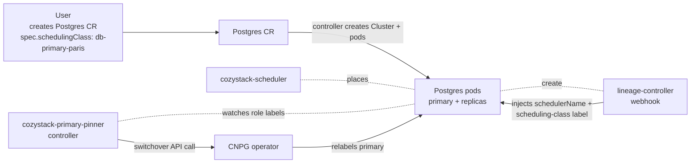

# Primary-aware SchedulingClass for clustered applications

- **Title:** Primary-aware SchedulingClass for clustered applications
- **Author(s):** @mattia-eleuteri
- **Date:** 2026-05-12
- **Status:** Draft

## Overview

Today the `SchedulingClass` CRD shipped with Cozystack v1.2.0 lets a platform operator constrain where a workload may be scheduled (`nodeSelector`, `nodeAffinity`, `podAffinity`, `topologySpreadConstraints`). The constraints apply uniformly to every pod of an attached application or tenant.

For **clustered databases and stateful workloads** (Postgres / CNPG, MongoDB / Percona, MariaDB Galera, etc.), there is a meaningful operational distinction between the **primary** (the read-write replica that serves writes) and the **standbys** (replicas serving reads / standing by for failover). Operators frequently want to place the primary on a specific tier of nodes — typically lower-latency, beefier hardware, or in a specific region close to the consuming application — while letting the standbys spread normally for redundancy. The current SchedulingClass cannot express this, because the primary role is **dynamic**: it is assigned by the database operator after election, can switch on failover, and is unknown to Kubernetes at pod-creation time.

This proposal extends the SchedulingClass CRD with an optional `primary` block and introduces a new `cozystack-primary-pinner` controller. The controller watches operator-managed role labels on pods, compares the current primary's node against the desired affinity, and triggers a **switchover** through the application operator's own API when there is a mismatch. The mechanism is opt-in, per-application, and never replaces or competes with the existing scheduler-based placement of the SchedulingClass.

## Scope and related proposals

This proposal builds on, and depends on, the per-app `schedulingClass` field reaching every managed application. Two upstream PRs ship that foundation:

- [cozystack/cozystack#2621](https://github.com/cozystack/cozystack/pull/2621) — `feat(scheduler): set scheduling-class label on mutated pods for cross-app affinity`. Promotes the existing annotation to a label, so `podAffinity.labelSelector` matches across applications.
- [cozystack/cozystack#2622](https://github.com/cozystack/cozystack/pull/2622) — `feat(apps): per-app schedulingClass field for selective workload placement`. Implements `Application.SchedulingClass()` and exposes the field on every chart that produces pods.

Once both land, a user can attach a SchedulingClass to a specific `Postgres` instance and the existing scheduler-based mechanism takes over. **This proposal addresses the last gap**: per-replica-role placement within a clustered application.

Deferred / out of scope here:
- Read-replica placement hints distinct from generic standbys (e.g. CNPG "designated primary" mid-failover) — covered by the operator-specific `role` label that this proposal consumes; no separate API is proposed.
- Non-database clustered workloads (Kafka, OpenSearch, RabbitMQ): the same mechanism could be generalised once one DB adapter is proven, but the initial scope is CNPG Postgres.

## Context

### What exists today

The Cozystack scheduling-class pipeline as of `release-1.3`:

1. **CRD**: `schedulingclasses.cozystack.io/v1alpha1`, cluster-scoped, spec fields `nodeSelector`, `nodeAffinity`, `podAffinity`, `podAntiAffinity`, `topologySpreadConstraints`. Defined in `packages/system/cozystack-scheduler/charts/cozystack-scheduler/crds/cozystack.io_schedulingclasses.yaml`.
2. **Custom scheduler**: `cozystack-scheduler` (vendored from `github.com/cozystack/cozystack-scheduler`), which replaces the in-tree `NodeAffinity`, `InterPodAffinity`, `PodTopologySpread` plugins with their `Cozystack*` equivalents. The plugins read constraints from the SchedulingClass referenced by the pod's annotation rather than from the pod's own spec, allowing operators to dictate scheduling without touching upstream charts.
3. **Webhook**: `internal/lineagecontrollerwebhook/webhook.go:209-258` mutates every new Pod: it walks the ownership chain back to the owner Application CR, reads `app.SchedulingClass()` (or falls back to the namespace label posted by the `Tenant` chart), and — if the named class exists — injects `spec.schedulerName: cozystack-scheduler`, sets the `scheduler.cozystack.io/scheduling-class` annotation, and (with PR #2621) a label of the same name.

This pipeline acts **at pod creation only**. `spec.schedulerName` is immutable once the pod is created.

### How clustered databases assign roles today

For the most common operator shipped by Cozystack, [CloudNativePG](https://github.com/cloudnative-pg/cloudnative-pg) (driving `packages/apps/postgres`):

- A `Cluster.cnpg.io` resource creates N pods (one StatefulSet-like manager per pod). At bootstrap, one pod is elected primary; the rest are streaming replicas.
- The primary's pod is labelled `cnpg.io/instanceRole: primary` (and the legacy short label `role: primary`, the one matched by Cozystack's `packages/apps/postgres/templates/external-svc.yaml:19`). The other pods carry `cnpg.io/instanceRole: replica`.
- Failovers and planned switchovers swap these labels: the chosen new primary gets the primary label, the old primary becomes a replica.
- CNPG exposes a clean **switchover API**: `kubectl cnpg promote <cluster> <pod>`, or equivalently a `Cluster.spec.replicaCluster.promotionToken` / instance-manager REST. The operator performs the switchover gracefully — checkpoint, fence, promote — typically within 5–15 seconds.

Other operators expose similar mechanisms (Percona MongoDB `rs.stepDown`, MariaDB Galera weight changes for the primary node election). For this proposal we focus on **CNPG** as the reference adapter; additional adapters can be added incrementally.

### The problem

A platform team running Cozystack for several tenants is told by one tenant:

> Our application VM and our Postgres `db` both live in tenant `acme`. Latency between them matters — keep the **primary** Postgres replica in our region. Standbys can live anywhere; the operator can replace them if a node goes down.

With the existing SchedulingClass, the operator can pin **all** the Postgres pods to that region. This works but is wasteful — losing the entire region brings down the whole replica set together, which is the opposite of what a multi-region replica set is for.

Alternatively, the operator can leave Postgres unconstrained and accept that the primary may land on the wrong region for hours until the next planned restart. There is no Cozystack-native way to say "the **primary** must be here, the standbys may roam".

## Goals

- **G1** — Express a per-application affinity that applies only to the primary replica, declaratively, through the existing SchedulingClass CRD.
- **G2** — Continuously reconcile the actual placement: if the primary moves (failover, manual demotion) and ends up outside the desired affinity, trigger a graceful switchover toward a pod that satisfies the affinity.
- **G3** — Use the application operator's own switchover API. Never delete or recreate pods directly. Never fight the scheduler.
- **G4** — Opt-in. Workloads that do not set `primary` keep behaving exactly as today.
- **G5** — Extensible by application kind. The controller has a registry of adapters (one per supported operator). CNPG (Postgres) is the reference adapter; others land as follow-ups.

### Non-goals

- **NG1** — Distinguishing among standbys (sync vs async vs cascading). The SchedulingClass already governs all pods of the application; this proposal only carves out the primary.
- **NG2** — Replacing or augmenting the cozystack-scheduler. The custom scheduler still places every pod, including the primary's pod. The controller only triggers role changes after the fact.
- **NG3** — Forcing a specific node. Affinity expressions can match any number of nodes; the controller picks one of the eligible candidates as the promotion target.
- **NG4** — Live-migrating an existing primary across nodes without a switchover. Kubernetes does not support pod migration; a switchover (with operator-driven failover) is the only correct mechanism.
- **NG5** — Acting on applications that do not expose a switchover API. If the adapter cannot perform a graceful switchover, the controller refuses to act and surfaces a warning.

## Design

### 1. CRD extension

Add a `primary` block to `SchedulingClass.spec`. Backwards-compatible — existing classes keep working without changes.

```yaml
apiVersion: cozystack.io/v1alpha1
kind: SchedulingClass
metadata:
  name: db-primary-paris
spec:
  # Existing fields — apply to ALL pods of the attached application.
  topologySpreadConstraints:
  - maxSkew: 1
    topologyKey: topology.kubernetes.io/zone
    whenUnsatisfiable: ScheduleAnyway

  # NEW — applies only to whichever pod currently holds the primary role.
  primary:
    nodeAffinity:
      requiredDuringSchedulingIgnoredDuringExecution:
        nodeSelectorTerms:
        - matchExpressions:
          - key: topology.kubernetes.io/region
            operator: In
            values: [paris]
    # Tunables (optional, sensible defaults shown).
    switchoverPolicy:
      enabled: true            # If false, the controller only emits events / metrics; it never acts.
      minObservationWindow: 60s  # Wait this long before deeming a primary "definitively misplaced" (rides through transient failovers).
      cooldown: 5m             # After a switchover, wait this long before triggering another one on the same cluster.
```

Schema additions only; no field is renamed, removed, or made required. The `primary` block is optional throughout.

### 2. New controller: `cozystack-primary-pinner`

Shipped as a system package (`packages/system/cozystack-primary-pinner`), installed by the platform alongside `cozystack-scheduler`. Opt-out via `cozystack-config`. Single deployment, leader-elected, low-frequency reconciliation loop.

#### Watch graph

- **`SchedulingClass`** (cluster-scoped) — to know which classes have a `primary` block.
- **Applications carrying a `schedulingClass`** (`Postgres`, `MongoDB`, `MariaDB`, …) — currently 20 kinds under `apps.cozystack.io/v1alpha1`. The controller maintains a dynamic registry of adapters keyed by `GroupKind`; only kinds with a registered adapter are watched.
- **Pods carrying the operator's role label** (e.g. `cnpg.io/instanceRole=primary`) — to detect role transitions promptly.

#### Reconciliation logic (per application instance)

```
read app.spec.schedulingClass  → name of the class
read schedulingClass.spec.primary  → primary affinity, or empty → no-op
read adapter[gk].discoverPrimaryPod(app)  → pod name or "no primary right now"
read pod.spec.nodeName, node.metadata.labels  → does the current primary's node satisfy primary.nodeAffinity ?
  yes → no action.
  no  → wait minObservationWindow elapsed since the pod entered the primary role; then:
         find eligible candidate pods (replicas of the same app, on nodes that satisfy the affinity)
         if at least one candidate exists:
            adapter[gk].switchover(app, target=candidate)  # graceful, operator-driven
            record event "Switched primary from <old> to <new> to satisfy SchedulingClass <name>"
            enter cooldown
         else:
            record event "No replica satisfies primary affinity; not acting"
            do not switch over
```

The controller never sets `spec.nodeName`, never deletes the primary pod, never fences anything. The switchover is **delegated** to the application operator's own API.

#### Adapter contract (Go interface sketch)

```go
type PrimaryAdapter interface {
    // GroupKind returns the application kind this adapter handles.
    GroupKind() schema.GroupKind

    // DiscoverPrimaryPod returns the current primary pod for the application,
    // or "" if the cluster is unhealthy / has no primary yet.
    DiscoverPrimaryPod(ctx context.Context, app *unstructured.Unstructured) (string, error)

    // EligibleCandidates returns the names of pods that could become primary.
    // The controller filters this list by node affinity.
    EligibleCandidates(ctx context.Context, app *unstructured.Unstructured) ([]string, error)

    // Switchover triggers the operator's switchover API toward target.
    // The call is expected to be graceful and (typically) synchronous.
    Switchover(ctx context.Context, app *unstructured.Unstructured, target string) error
}
```

#### CNPG adapter (reference implementation)

- `DiscoverPrimaryPod` — list pods with `cnpg.io/cluster=<app>` and `cnpg.io/instanceRole=primary`.
- `EligibleCandidates` — list pods with `cnpg.io/cluster=<app>` and `cnpg.io/instanceRole in (replica, standby)`.
- `Switchover` — patch `Cluster.spec.replicaCluster.promotionToken` or call the instance-manager REST `/pg/switchover`, depending on CNPG version. Mirrors what `kubectl cnpg promote` does internally.

#### Subsequent adapters (follow-up PRs, not part of this proposal)

- Percona MongoDB (`psmdb.percona.com/v1.PerconaServerMongoDB`).
- MariaDB Galera (`mariadb.mariadb.com/v1alpha1.MariaDB`).
- Kafka KRaft controller quorum.

### 3. Wiring with the scheduler

No changes to `cozystack-scheduler`. The scheduler keeps placing every pod (primary or not) using the SchedulingClass's "global" constraints (`nodeAffinity`, `podAffinity`, `topologySpreadConstraints`). The `primary` block is **invisible** to the scheduler — it is only consumed by the primary-pinner controller.

This separation matters: the scheduler is a synchronous placement decision at pod creation; the primary-pinner is an asynchronous role-reconciliation loop. Mixing the two responsibilities into the scheduler would force `schedulerName` mutability, which Kubernetes does not allow.

### 4. Architecture diagram



## User-facing changes

- **New optional field** `SchedulingClass.spec.primary` in the existing CRD. Existing classes and existing tenant configurations keep working unchanged.
- **New system package** `cozystack-primary-pinner` shipped enabled by default once GA. Users who do not author a `primary` block see no behavioural change.
- **Dashboard**: the existing SchedulingClass dropdown (in the Tenant form, see `internal/controller/dashboard/customformsoverride.go:248-254`) is unchanged. A future UI improvement could surface the `primary` block as a separate section but is not part of this proposal.
- **CLI / docs**: a new operations guide under `cozystack/cozystack-website` documenting the field, a worked CNPG example, and the failure modes.

## Upgrade and rollback compatibility

- **Upgrade**: the CRD change is additive. Existing SchedulingClass CRs remain valid. The new controller, on first start, lists all SchedulingClasses, finds none with `primary` set (initial state), and stays idle.
- **Rollback**: remove the controller deployment. The `primary` field in the CRD becomes inert (the scheduler ignores it, only the controller consumed it). Manifests that already set `primary` are not rejected by the API server; they are simply not reconciled.
- **CRD versioning**: stays at `v1alpha1`; no conversion webhook needed.
- **Pod-side**: zero changes. No mutating-webhook change, no scheduler change, no chart change.

## Security

- **New RBAC surface** for `cozystack-primary-pinner`:
  - `get`, `list`, `watch` on `Pod` (across all namespaces), on `Node`, on `SchedulingClass`.
  - `get`, `list`, `watch` on each application kind whose adapter is registered (cluster-wide).
  - `create`, `update`, `patch` on `Event` (to surface decisions).
  - Adapter-specific verbs to perform the switchover — for CNPG: `update`/`patch` on `clusters.cnpg.io`, or POST against the instance-manager Service. Each adapter documents its own footprint.
- **No new tenant-supplied input.** The `primary` field is on a cluster-scoped CR authored by the platform operator, exactly like the rest of the SchedulingClass.
- **No new secrets.** Switchover calls go through the in-cluster operator API, authenticated by the controller's ServiceAccount.
- **Trust boundary.** A misconfigured `primary` block does not weaken any existing boundary: at worst, the controller refuses to switchover (no eligible candidate), emits a Warning event, and the cluster stays in its current state.

## Failure and edge cases

- **Cluster has no primary** (mid-bootstrap, mid-failover, all-pods-down) → controller treats as no-op, retries on next watch event.
- **No replica satisfies the affinity** (e.g. region drained) → no switchover, Warning event, alert-worthy metric. The cluster keeps running on its current (off-affinity) primary; availability is preserved.
- **Affinity becomes unsatisfiable for the current primary because the operator changed labels on the node** → triggers the switchover loop; same path as the "primary moved" case.
- **Switchover loop / flapping** → guarded by `cooldown` (default 5 minutes). If a switchover is attempted and the new primary lands on the wrong node again, the controller waits the cooldown before retrying.
- **Switchover API returns an error** → record event, increment counter, retry with exponential backoff capped at `cooldown`.
- **Application operator does not implement a graceful switchover** (no adapter registered) → controller does not watch that kind. No fallback to pod-deletion or pod-eviction.
- **Two SchedulingClasses target the same Application** (impossible today: `spec.schedulingClass` is a single string) → not applicable; the field is single-valued by design.
- **Controller crash / restart mid-switchover** → switchovers are idempotent at the operator level (a second `promote` for an already-elected primary is a no-op). On restart, the controller re-evaluates from the current state.
- **`switchoverPolicy.enabled: false`** → controller only records events / metrics; useful for dry-run rollouts.

## Testing

- **Unit (per adapter)**: with fake `dynamic` and fake `client`, assert `DiscoverPrimaryPod`, `EligibleCandidates`, and `Switchover` translate the inputs into the expected API calls (Patch shape for the Cluster CR / call path for the instance-manager REST). Reuse the patterns already in `internal/backupcontroller/cnpgstrategy_controller_test.go`.
- **Unit (controller core)**: with a fake adapter, assert:
  - No-op when `primary` is not set.
  - No-op when the current primary already satisfies the affinity.
  - Switchover triggered to a specific candidate when current primary is off-affinity.
  - Cooldown honoured.
  - Warning event when no eligible candidate exists.
  - `switchoverPolicy.enabled: false` dry-run.
- **Integration (envtest)**: spin up the CRD, the controller, and a fake CNPG adapter. Drive the role labels manually; assert events.
- **E2E (kind / Hikube sandbox)**: deploy CNPG, a Postgres cluster, attach a SchedulingClass with `primary.nodeAffinity` selecting a labelled subset of nodes. Verify the primary lands on (or migrates to) one of those nodes. Drain that node and verify the controller follows the cluster's new primary back into affinity.

## Rollout

- **v1.4 (target)** — Land CRD extension, controller framework, **CNPG adapter** as the reference. Ship the controller as an opt-out system package, default `switchoverPolicy.enabled: true` per class.
- **v1.5** — MongoDB (Percona) adapter. Hardening based on Hikube production feedback.
- **v1.6** — MariaDB Galera + Kafka KRaft adapters. Dashboard surfacing (optional).
- **Promotion to `v1beta1`** of the SchedulingClass CRD once the API surface is exercised across two or more adapters in production.

Nothing is deprecated.

## Open questions

- **Where does the operator switchover REST endpoint live?** For CNPG specifically, the instance-manager exposes `/pg/switchover` on each pod; the controller could either call the pod directly (more direct, requires pod network access and TLS handling) or patch the `Cluster` CR and let CNPG reconcile the request (more declarative, slightly slower). Preference is the second, but reviewers' input is welcome — there is a tradeoff between observability and dependency on CNPG-specific reconcile latency.
- **Should the controller emit a Kubernetes `PodEviction`-style status on the demoted pod** to make the cause visible to the user, or stick to `Events` on the application CR? Lean toward Events on the application CR only — the pod is not evicted, just demoted.
- **Should `switchoverPolicy.enabled` default to `false` for the first release** (require explicit opt-in per class) to reduce the blast radius of bugs in early adapters? I think yes, but reviewers may prefer the opposite given the controller's defensive design.
- **Naming of the controller**: `cozystack-primary-pinner` is descriptive but database-flavoured. If we expect to extend to non-DB clustered workloads (Kafka, etc.), `cozystack-role-pinner` or `cozystack-leader-pinner` might age better. Open to bikeshed feedback.

## Alternatives considered

### Webhook-based approach (rejected — wrong layer)

Have the lineage-controller-webhook inspect role labels and inject a different `schedulerName` for the primary. **Rejected** because `spec.schedulerName` is immutable post-creation, the role is only known after election, and rewriting it would require pod recreation — disruptive on every failover.

### Per-replica `schedulingClass` field on the chart (rejected — wrong semantics)

Add `primaryReplica.schedulingClass` and `standbyReplica.schedulingClass` to each chart. **Rejected** because the role is not a chart-time concept: from CNPG / Percona / etc.'s viewpoint, all replicas are interchangeable at boot, and the operator decides primaryness afterwards. Encoding it at the chart level would mislead users into thinking "primary replica" is a stable pod identity.

### Affinity authored on the application operator's own CR (rejected — divergent UX)

Each operator exposes its own affinity spec (CNPG `Cluster.spec.affinity`, Percona `PerconaServerMongoDB.spec.replsets[].affinity`, etc.). Users could be told to write primary-specific affinity there. **Rejected** because (a) it bypasses the SchedulingClass abstraction Cozystack exists to provide, (b) CNPG's affinity applies to all pods (no primary-only knob), and (c) it forces tenants to know the underlying operator, defeating Cozystack's appeal.

### Re-scheduling via Descheduler (rejected — different scope)

Configure the Kubernetes Descheduler to evict pods that violate affinity. **Rejected** because (a) evicting the primary forces an ungraceful failover (the operator's switchover is much cleaner), (b) Descheduler operates on PodSpec affinity, not on a Cozystack SchedulingClass abstraction, and (c) introducing Descheduler is a much bigger architectural commitment.

### Custom controller deleting the primary pod (rejected — disruptive)

Have the controller `kubectl delete pod` on the primary when it sits on a non-affined node, and rely on the operator to elect a new primary on a different replica. **Rejected** — operator-driven switchover is dramatically less disruptive (no client connection drops, no checkpoint loss, sub-15s window) and is the path operators are designed to recommend.

---

<!-- Inspired by KubeVirt enhancement proposals
(https://github.com/kubevirt/community/tree/main/design-proposals) and
Kubernetes Enhancement Proposals (KEPs). -->
