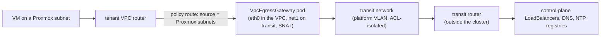

# Proxmox-backed VPC subnets

- **Title:** `Proxmox-backed VPC subnets: Proxmox VLANs as transport for Kube-OVN VPC subnets`
- **Author(s):** `@themoriarti`
- **Date:** `2026-10-07`
- **Status:** Review

## Overview

A tenant puts Proxmox VMs, including the workers of a Proxmox-backed `Kubernetes` cluster, on a subnet of its existing `VirtualPrivateCloud` by adding `proxmox: {}` to that subnet. The platform allocates a VLAN for the subnet from an admin-owned range, makes the Kube-OVN subnet a VLAN-backed logical switch of the tenant's own VPC router, carries the VLAN to the cluster nodes over one trunk NIC, and creates the CAPI IP pool that capmox takes VM addresses from. The `kubernetes` and `kubernetes-nodes` applications then refer to the subnet by name, and the bridge, VLAN tag and IP pool come from the platform, never from tenant values.

The VPC subnet stays the only thing the tenant declares. Kube-OVN implements it, `cluster-api-ipam-provider-in-cluster` allocates VM addresses, capmox creates the NICs, and Proxmox contributes only 802.1Q transport on a VLAN-aware bridge. The proposal adds no IPAM, no SDN and no tenant-facing abstraction of its own; what it adds is one controller that allocates VLANs, holds resources until their last consumer is gone, and closes one gap in how OVN treats a router port reached through a localnet port.

## Scope and related proposals

- **Parent issue: [cozystack/cozystack#3481](https://github.com/cozystack/cozystack/issues/3481).** The issue asks for the provisioning layer to be specified first, and for the rest to come as separable, reviewable pieces. The provisioning layer is in `main`: capmox and in-cluster IPAM as optional packages ([#4087](https://github.com/cozystack/cozystack/pull/4087)), the core CAPI provider manifests ([#4483](https://github.com/cozystack/cozystack/pull/4483)), the `substrate: kubevirt | proxmox` switch ([#4088](https://github.com/cozystack/cozystack/pull/4088)), and the CSI driver and cloud-controller-manager with the hypervisor token kept out of the tenant cluster ([#4089](https://github.com/cozystack/cozystack/pull/4089)). This proposal is the networking piece on top of it. It does not change how VMs are provisioned; it changes where their NICs land and where their addresses come from.
- **What it replaces.** Today a Proxmox worker pool takes a raw `bridge`, an optional `vlan` and a cluster-level `ipv4Config` range from values. That path stays for clusters that do not use a VPC. A tenant on a Proxmox-backed VPC subnet cannot set any of the three.
- **Related proposal: [cozystack/community#86](https://github.com/cozystack/community/pull/86)** (open), per-cluster infrastructure backends for tenant Kubernetes clusters, would move each infrastructure provider into its own pair of applications. If it is accepted, the `proxmox.network` and `proxmox.additionalNetworks` values below move with the Proxmox backend's applications; the `vpc` chart, the controller and the package do not depend on where they live.
- **Independent fixes, carried as the first two commits of the implementation pull request and separable into their own pull requests:** the VPC peering `localConnectIP` is rendered as a /30 (Kube-OVN parses it as a CIDR and fails the whole `Vpc` reconcile on a bare address), and the Proxmox cloud-controller-manager image moves to v0.16.1 (v0.15.0 panics at start on its own version string).
- **Deferred:**
  - Management access from the platform into tenant VMs, and narrowing tenant egress to the tenant's own control plane (see [Open questions](#open-questions)). A separate proposal.
  - Proxmox SDN as a managed integration (see [Alternatives considered](#alternatives-considered)). An admin can already point a zone at an SDN VNet that only carries the trunk; anything that makes Cozystack write SDN objects is a separate proposal.
  - Inbound reachability (EIP or DNAT) of a VM from outside its VPC. CAPI workers reach their control plane outbound, so a cluster does not need it.
  - IPv6. The split below works for dual-stack, but nothing is enabled or tested.

## Decisions

## Context

- **VPC.** `packages/apps/vpc` renders a Kube-OVN `Vpc` with one router and one `Subnet` per entry in `subnets[]`, each an overlay logical switch attached to pods through a `NetworkAttachmentDefinition`. Subnets are `private: true`, so traffic from outside a subnet needs `allowSubnets`. VPCs are connected only by explicit peering.
- **Proxmox substrate.** `packages/apps/kubernetes` and `packages/apps/kubernetes-nodes` render `ProxmoxCluster` and `ProxmoxMachineTemplate` for `substrate: proxmox`. capmox clones a VM, sets `netN` to `bridge=<bridge>,tag=<vlan>`, and gets the address from an `IPAddressClaim` against an IPAM pool. capmox has no DHCP mode, and `ProxmoxCluster.spec.ipv4Config` is still mandatory in v0.7.
- **Kube-OVN underlay.** A `ProviderNetwork` maps a node NIC into an OVS bridge, a `Vlan` names a tag on it, and a `Subnet` with `vlan:` becomes a logical switch with a localnet port carrying that tag. With `logicalGateway: true` its gateway is a port of the VPC router, not a physical router.

### The problem

- A tenant's Proxmox workers are on whatever bridge and VLAN the values name. Nothing ties that VLAN to the tenant, nothing stops two tenants from naming the same one, and nothing relates it to the tenant's VPC.
- The worker addresses come from a hand-written `ipv4Config` range per cluster. The operator keeps those ranges apart by hand, and the tenant's pods on a VPC subnet and its VMs on a VLAN are on different networks with no router between them.
- Workers need a route to their control plane, DNS, NTP and a registry. Today that is whatever the bridge's physical network provides, which is the same for every tenant.

## Goals

- The VPC subnet is the source of truth. Adding `proxmox: {}` to a subnet is the whole tenant-side change; VLAN IDs, bridges and IP pools are transport details the platform chooses and the tenant cannot set.
- Kube-OVN implements the network. A VM and a pod on the same subnet are L2 neighbours, and the tenant's VPC router routes between its subnets.
- `cluster-api-ipam-provider-in-cluster` allocates every CAPI machine address through the `IPAddressClaim`/`IPAddress` contract capmox already speaks. Kube-OVN and the CAPI pool never hand out the same address.
- capmox creates the NICs. A `KubernetesNodes` pool can have several NICs, each on a Proxmox-backed subnet of the same namespace.
- Proxmox provides VLAN-aware bridge transport only; no tenant operation changes hypervisor configuration.
- Isolation holds at every layer: one VPC router per tenant, one logical switch and one VLAN per subnet, and admission that keeps machine NICs on the namespace's own networks.
- Every step is declarative and idempotent: it reconverges after a controller restart or a Proxmox API outage, and holds the VLAN, the switch and the pool until their last consumer is gone.

### Non-goals

- No new IPAM, no VM lifecycle controller, no new tenant-facing resource and no SDN of our own.
- No Proxmox SDN apply triggered by a tenant operation. A PVE SDN apply runs `ifreload -a` on every node of the PVE cluster; that is not something a tenant should be able to cause.
- No access from VMs to the management cluster's `ClusterIP` Services.
- No change to the KubeVirt substrate or to VPCs that do not set `proxmox`.

## Design

### Objects and ownership

The work ships as an opt-in system package, `packages/system/proxmox-network` (controller, RBAC, admission policies, alerts) with its CRDs in `packages/system/proxmox-network-crds`, wired into the `iaas` bundle and off by default. It adds one API group, `proxmox.cozystack.io/v1alpha1`, with two kinds:

- `ProxmoxNetworkZone` (cluster-scoped, admin only): the zone bridge, the Kube-OVN `ProviderNetwork` that carries the trunk, the VLAN ranges the allocator may use, reserved VLANs, an optional MTU, a namespace selector, admin-only static assignments, and the egress settings (transit subnet, gateway namespace).
- `ProxmoxNetwork` (namespaced, written by the `vpc` chart, read-only to the tenant): one per Proxmox-backed subnet. The controller writes its status: VLAN, bridge, CIDR, gateway, pool usage and the conditions `VLANAllocated`, `SubnetReady`, `IPPoolReady`, `GatewayReady` and `Ready`.

```mermaid
flowchart TB
    vpc["VirtualPrivateCloud subnet<br/>(tenant: name, CIDR, proxmox: {})"]
    ks["Kube-OVN Vpc + Subnet<br/>(vlan, logicalGateway, excludeIps)"]
    pn["ProxmoxNetwork<br/>(status: vlan, bridge, pool)"]
    pool["InClusterIPPool<br/>(VM address range)"]
    vlan["Kube-OVN Vlan<br/>(allocated by the controller)"]
    zone["ProxmoxNetworkZone<br/>(bridge, VLAN ranges, trunk)"]
    pve["Proxmox VLAN-aware bridge"]
    vm["ProxmoxMachineTemplate.network<br/>(bridge, vlan, ipv4PoolRef)"]
    vpc --> ks & pn & pool
    pn --> vlan --> zone --> pve
    ks -. spec.vlan .-> vlan
    pn --> vm
    pool --> vm
```

Names are deterministic: the VPC is `vpc-<hash(ns/release)>`, a subnet `subnet-<hash(ns/vpc/name)>`, and the `Vlan`, `InClusterIPPool`, `ProxmoxNetwork` and NAD all carry the subnet's name. Any chart can compute every name from `(namespace, vpc, subnet)` without a lookup.

### VPC subnet to Kube-OVN

| VPC value | Kube-OVN `Subnet` | Why |
|---|---|---|
| `cidr` | `cidrBlock` | unchanged |
| first address | `gateway`, `logicalGateway: true` | the VPC router port is the VMs' gateway |
| `proxmox: {}` | `vlan: <subnet name>` | the `Vlan` is created by the controller; Kube-OVN retries until it exists, so no ordering is needed |
| `proxmox.vmRange` | `excludeIps: [vmRange]` | Kube-OVN never allocates a VM address |
| — | `private: false` | the subnet is routed by its own VPC router; the chart refuses `allowSubnets` on it, since Kube-OVN applies that list only through the private ACL |
| zone `mtu` | `mtu` | pods on the subnet, the egress gateway included, get the VMs' MTU |

### VLAN allocator

The controller allocates the lowest free VLAN of the zone's ranges, skipping reserved IDs, static assignments and every VLAN already used by any Kube-OVN `Vlan` on the zone's provider network, including ones it did not create. Allocation is serialised in one worker and reads `Vlan` objects uncached. The `Vlan` is named after the subnet, so a crash between creating it and writing status is harmless: the next pass adopts it and keeps its ID. Exhaustion, conflicts and a namespace outside the zone's selector surface as `VLANAllocated=False` with a reason, and as metrics.

Proxmox needs no per-VLAN configuration. Each cluster node in the provider network has one extra virtio NIC on the zone bridge, `trunks=<zone ranges>`, with no address, and Kube-OVN tags each subnet's localnet port.

### In-cluster IPAM

One value splits the subnet: `vmRange` (default: the middle half) goes to an `InClusterIPPool` with the subnet's name and to `Subnet.spec.excludeIps`; the rest is Kube-OVN's. The chart refuses a range outside the CIDR or one that contains the gateway, and the controller re-checks the split on every pass (`IPPoolReady=False/PoolOverlapsSubnet`). The pool is namespaced, so a claim resolves only in its own namespace; `GlobalInClusterIPPool` is not used. In-cluster IPAM does not check overlaps between pools, which is safe because tenants have no RBAC on `ipam.cluster.x-k8s.io` and the platform is the only writer. Each pool carries a route metric of `100 + subnet index`, so a VM with two NICs never gets two default routes with the same metric.

### CAPMOX NICs

```yaml
# Kubernetes application
proxmox:
  network: {vpc: vpc-a, subnet: workers}
# KubernetesNodes application
proxmox:
  network: {vpc: vpc-a, subnet: workers}          # net0
  additionalNetworks:
    - {name: net1, vpc: vpc-a, subnet: storage}   # net1
```

The charts look up the `ProxmoxNetwork` in the release namespace and render `ProxmoxMachineTemplate.spec.network.default` (and one `additionalDevices` entry per extra NIC) as `{bridge, vlan, mtu, ipv4PoolRef: InClusterIPPool/<subnet>}`. A network that is not `Ready` fails the render with the condition's message, so the HelmRelease shows why no machine is created. Because capmox v0.7 still requires `ProxmoxCluster.spec.ipv4Config`, the chart renders a sentinel range whose only address is the gateway, which the provider always excludes: a machine that somehow lacks `ipv4PoolRef` fails to get an address instead of taking one twice. Mixing `network.subnet` with raw `bridge`, `vlan` or `ipv4Config` is refused.

### Subnet gateway

Kube-OVN builds OVN with a patch, "northd: skip arp/nd request for lrp addresses from localnet ports" (`477695a0` on its OVN branch-25.03, present with the same condition in later Kube-OVN releases). For every router port that has neither `gateway_chassis` nor `ha_chassis_group`, it installs a priority-105 drop in the peer switch's `ls_in_arp_rsp` for ARP and ND requests that arrive through the localnet port and target the router port's addresses. Kube-OVN gives a subnet's router port neither, so a VM on the VLAN never resolves its gateway: it reaches pods on its own subnet at L2, and nothing routed. The patch exists so that not every chassis answers for a distributed router on a VLAN network; the standard OVN answer for a VLAN-backed network is a distributed gateway port, which is what this design uses.

The controller therefore turns each Proxmox-backed subnet's router port into a distributed gateway port:

- It creates an OVN `HA_Chassis_Group` named `px-<vpc>-<subnet>` with `external_ids` `owner=proxmox-network` and `network=<namespace>/<name>`, and points the router port's `ha_chassis_group` at it.
- The group holds one `HA_Chassis` for each node that has the provider network's ready label, a chassis annotation, and is not being deleted.
- Priorities come from rendezvous hashing of the VPC name with the node name, so all Proxmox router ports of one VPC share their active chassis, different VPCs spread over the trunk nodes, and a change of trunk nodes moves only the VPCs it has to.
- The active chassis claims `cr-<router port>`, answers ARP and routes for the VLAN; OVN fails over to the next priority on its own.

The key is the VPC rather than the subnet for a measured reason. If two router ports of one VPC are active on different chassis, a VM's packet to the other subnet, or to the egress gateway, crosses the Geneve tunnel. Cozystack runs Cilium's kube-proxy replacement with `genev_sys_6081` in its devices (`packages/system/cilium/values-kubeovn.yaml`), and there a LoadBalancer IP is rewritten to a backend pod address the VPC cannot reach. With per-subnet keys, a worker in one tenant never reached its control plane; with the per-VPC key it did.

The controller writes only its own groups (by `external_ids`), their chassis rows, and the `ha_chassis_group` column of its networks' router ports, and only while that column and `gateway_chassis` are empty, with an OVSDB `wait` that aborts the transaction if either changed since the read. Anything else is reported as `GatewayReady=False/ForeignGroup` and left alone. A periodic pass repairs a cleared pointer or a router port Kube-OVN recreated, and collects groups whose network is gone. It connects to the NB with Kube-OVN's client certificate, read from one Secret through a Role scoped by `resourceNames`. `ovn.manageGatewayChassis: false` removes the Role and every NB write.

This is a write to the OVN northbound database outside Kube-OVN's API, and it is meant as an interim. The target is Kube-OVN setting the group itself for `logicalGateway` underlay subnets that have a localnet port; see [Open questions](#open-questions).

Cost: all routed traffic of a VPC's Proxmox subnets passes through that VPC's active chassis, as with a centralised gateway. L2 traffic inside a VLAN does not.

### Egress



With `egress.enabled`, the `vpc` chart renders a Kube-OVN `VpcEgressGateway` that reroutes traffic from the VPC's Proxmox subnets and SNATs it onto a platform transit subnet, an underlay subnet on the same trunk. Kube-OVN places the reroute at policy priorities 29100-29150, after the routing table, so the chart adds an `allow` at priority 30500 for each `routes[].cidr` narrower than `/0`: a route to a peered VPC keeps its next hop instead of going through the gateway. Gateways of every VPC share the transit L2, so two from-lport ACLs keep each one to the router: allow from the localnet port (priority 2001), drop any other destination inside the transit CIDR (2000). They run on the sender's chassis, where `inport` tells gateways apart. The gateways run in the zone's platform namespace, because tenant namespaces enforce PodSecurity `baseline` and the gateway needs `NET_ADMIN`. Cozystack's Kube-OVN webhook turns port security on for every tenant pod; the controller turns it off only on pods whose owner chain ends at a gateway the chart rendered.

The transit router is outside the cluster. It forwards only to the control-plane LoadBalancer range, DNS, NTP and the Internet, has no route back into any VPC CIDR, and is today the only thing that stops routed traffic from one VPC to another VPC's CIDR (see [Open questions](#open-questions)).

### MTU budget

The zone `mtu` is the one number to choose. It goes onto the VM NICs, and the `vpc` chart writes it into `Subnet.spec.mtu` of every Proxmox-backed subnet, so the egress gateway's `eth0` matches the VMs. Without it, Kube-OVN gives a `logicalGateway` subnet its global overlay MTU (1400 with Geneve over 1500), and since OVN sets no `gateway_mtu` or `check_pkt_larger` on these routers and OVS drops an oversize frame silently, full-size VM egress becomes a black hole.

Tenant VLANs ride as inner tags inside an outer VLAN on the hypervisor uplink (QinQ), so the zone `mtu` is the uplink VLAN device's MTU minus 4, for example 8996 on a 9000-byte uplink; any switch on the path must pass the payload plus two tags. `transit.mtu` sets the gateways' transit side. Two limits remain: VM to an overlay pod above the overlay MTU loses UDP and ICMP (TCP survives on the MSS), and `Subnet.spec.mtu` applies at CNI ADD, so gateway pods are recreated after a change.

The uplink must carry both tags between hypervisors. On one NIC family in the reference environment, hardware VLAN insertion overwrote the inner tag on transmit, and the far bridge put every frame into VLAN 1. Turning off TX VLAN offload on the uplink's bond slaves fixed it. The operator documentation includes a two-direction check for this; the controller cannot see it.

### Admission

Three `ValidatingAdmissionPolicies` ship with the package:

- `proxmox-network-machine-binding`, on CREATE of `ProxmoxMachine` and `ProxmoxMachineTemplate`: a NIC on a zone bridge must use a (bridge, VLAN, pool) triple the controller lists in a namespace annotation, so a namespace without networks cannot reach the trunk through the raw path; no NIC may be tagged with the zone's uplink VLAN on another bridge or sit on a bridge that enslaves the uplink's parent device, since either is a trunk into the zone; in a namespace that owns networks, every NIC must be one of them.
- `proxmox-network-vm-attachments` and `proxmox-network-pod-attachments`: a KubeVirt VM, VMI or pod attaches only NADs and Kube-OVN subnets of its own namespace, through `spec.networks` and through the Multus and Kube-OVN annotations. Multus has no namespace isolation and Kube-OVN takes `logical_switch` names without a namespace check, so these policies are the guard.

They exempt `cozy-*`, `kube-system`, the release namespace, the gateway namespace and an explicit `exemptNamespaces` list.

### Lifecycle

Create: the `vpc` chart renders `Subnet`, NAD, `InClusterIPPool` and `ProxmoxNetwork`; the controller allocates the VLAN, creates the `Vlan` with a finalizer, adds a finalizer to the `Subnet`, waits for Kube-OVN to bind the switch and create the router port, writes the HA chassis group, and sets `Ready`.

Delete: the three objects stay `Terminating` until the pool holds no address and no `ProxmoxMachine`, terminating ones included, references the network. The pool count alone is not enough, because the IPAM provider releases an address as soon as its claim is deleted, which a namespace deletion does while capmox is still destroying the VM. The controller then releases the `Subnet`, deletes the HA chassis group, waits until Kube-OVN drops the subnet from `Vlan.status.subnets` (which happens only after the logical switch and its localnet port are gone), and only then deletes the `Vlan`. A VLAN is therefore never handed to another network while a switch with that tag still exists. If Kube-OVN loses the delete event, the VLAN is held for a bounded `--subnet-prune-timeout` (default 10m, timers persisted on the `Vlan`) and then released with a log line. A subnet cannot drop `proxmox` and keep its name; the chart refuses that upgrade.

The in-cluster IPAM provider's delete webhook refuses a pool with addresses in use, which left `helm uninstall` of a VPC with VMs on it stuck. The `vpc` chart annotates each pool with `ipam.cluster.x-k8s.io/skip-validate-delete-webhook`, which skips only that check; the provider's `ProtectPool` finalizer still holds the pool until its last address is released.

### Observability

The controller exports per-zone VLAN totals, per-network readiness, pool usage, consumers, deletion state, gateway readiness and chassis count, NB errors and orphaned VLANs, and the package ships a `PrometheusRule` for networks not Ready, pools above 90%, exhausted zones, orphaned VLANs, networks stuck deleting, gateways not ready and persistent NB errors.

## User-facing changes

- **Tenant, `VirtualPrivateCloud`:** `subnets[].proxmox` (`zone`, `vmRange`) and `egress` (`enabled`, `replicas`, `internalCidr`). `routes[].nextHopIP` must lie inside the VPC's own subnets, or in `169.254.0.0/16` when peers are declared.
- **Tenant, `Kubernetes`:** `proxmox.network.{vpc,subnet}`; `ipv4Config` must stay empty when it is set.
- **Tenant, `KubernetesNodes`:** `proxmox.network.{vpc,subnet}` and `proxmox.additionalNetworks[]`; changing the list rolls the pool.
- **Tenant, read-only:** `kubectl get proxmoxnetworks` shows each subnet's VLAN, bridge, pool usage and conditions.
- **Admin:** the `proxmox-network` package values (zones, provider network and trunk NIC, transit network, admission, gateway management), a VLAN-aware bridge on every hypervisor, one trunk NIC per cluster node that should carry tenant networks, and a transit router. On Talos the trunk NIC must be marked `ignore: true` in the machine config; otherwise the default link controller keeps it down while Kube-OVN reports the node ready.
- **Docs:** an operator guide on the website (install, hypervisor requirements, day-2, troubleshooting), and the dashboard and `terraform-provider-cozystack` follow the new values.

## Upgrade and rollback compatibility

- Nothing changes until the package is enabled and a subnet sets `proxmox`. Existing VPCs, the raw `bridge`/`vlan`/`ipv4Config` path and the KubeVirt substrate render as before; the chart tests pin both sides.
- The peering fix changes the rendered `localConnectIP` of existing peered VPCs from a bare address, which Kube-OVN rejects, to a /30.
- Rolling back means deleting the Proxmox-backed subnets first, which the finalizers order. Removing the package without that leaves HA chassis groups in the NB; they are labelled and can be removed with two `ovn-nbctl` commands, which the operator guide lists. The CRDs are kept on uninstall.
- A future Kube-OVN that manages `ha_chassis_group` on subnet router ports would turn each affected network `ForeignGroup` and not Ready rather than fight over the column; the upgrade path is to turn gateway management off, upgrade, and delete the `px-*` groups.

## Security

- **Tenant inputs:** only the subnet's `proxmox` block, `vmRange` and the `network` references. Tenants have no RBAC on `kubeovn.io`, `ipam.cluster.x-k8s.io`, `infrastructure.cluster.x-k8s.io` or writes to `proxmox.cozystack.io`. Charts resolve networks only in the release namespace.
- **New privilege:** the controller can write to the OVN northbound database with Kube-OVN's client certificate. OVN has no per-row authorization, so the bound is the controller's code, which writes only labelled groups and the one column; a compromised controller could rewrite the NB as Kube-OVN could. The credential is read by name through a single-Secret Role, never listed or copied, and the whole path can be switched off.
- **Port security** is disabled only on egress gateway pods the chart rendered, identified through their owner chain.
- **Hypervisor:** tenant VLANs ride inside one outer VLAN, so a guest tag on a tenant VLAN cannot reach host VLANs. That holds only while no guest NIC sits on a bridge that enslaves the uplink's parent device; admission keeps CAPI machines off such bridges, and other guests there need the hypervisor to drop guest 802.1Q/802.1ad frames.
- **L3 between VPCs:** see the first open question. Today the transit router carries that boundary.

## Failure and edge cases

- Zone exhausted, VLAN conflict, zone missing, namespace not admitted → no allocation; `VLANAllocated=False/<reason>`; charts refuse to place machines.
- IP pool exhausted → new machines wait; nothing is allocated twice; existing VMs keep working.
- Controller restart mid-allocation → the `Vlan` named after the subnet is adopted with its ID.
- OVN NB unreachable → existing groups keep working; a network whose gateway was up stays Ready for a 10-minute grace, then goes not Ready; a deleting network keeps its VLAN.
- No trunk node with a chassis, or router port not yet created → nothing written; `GatewayReady=False/NoTrunkNodes` or `RouterPortMissing`; retried.
- Active chassis's node fails → OVN moves `cr-<port>` to the next priority; routed traffic of that VPC's Proxmox subnets stops until then.
- VPC deleted under a running cluster → finalizers keep the VLAN, switch and pool, so L2 inside each VLAN keeps working, but the egress gateway and the router go, the workers lose their control plane, and a replacement machine cannot join. Delete the cluster with or before the VPC.
- `VpcEgressGateway` stuck on its finalizer after Kube-OVN deleted the router first → documented manual cleanup.
- Trunk NIC down on a node Kube-OVN still reports ready, or the inner tag lost on the uplink → not visible to the controller; the e2e preflight checks the trunk link, and the operator guide gives the two-direction tag check.

## Testing

- **Unit:** the allocator (ranges, reserved, static, exhaustion, idempotency, conflicts), the reconciler (create, adopt, delete with and without consumers, the wait for Kube-OVN to prune the `Vlan` and its timers, orphans), and the gateway logic against an in-memory OVN NB with atomic transactions and reference checks (creation, adoption, foreign groups and ports, aborted writes, priority order, trunk-node changes, drift repair, NB outage and grace, release before the VLAN, collection, management off), plus the OVSDB client's wire format and TLS.
- **Chart tests (helm-unittest):** `vpc`, `kubernetes`, `kubernetes-nodes` (both substrates, golden snapshots for the KubeVirt path), `proxmox-network` including the admission policies, and the platform bundle.
- **Chainsaw, CI subset** (`hack/e2e-chainsaw/proxmox-network`, on the standard e2e runners): needs no hypervisor. The CI nodes have a single NIC, so the suite's provider network selects no node: the zone stays not Ready and each network stops at `NoTrunkNodes`, which still shows that the controller reached the OVN NB and found the router port. It installs the `vpc` chart for two tenants with `--wait=false` and asserts VLAN allocation, exhaustion and release, the Kube-OVN `Vlan`/`Subnet` objects, the localnet tag, the pool split, the namespace annotation, a network held while an address on it is in use, and the admission denials for pods and KubeVirt VMs with a positive control for each. The gateway cells (the router port points at the group, no priority-105 drop), traffic, and the policy on capmox NICs need a trunk or the capmox CRDs and run only in the Proxmox-environment suite.
- **Chainsaw, Proxmox environment** (`hack/e2e-chainsaw/proxmox-network-env`, parked as `chainsaw-test.yaml.disabled` next to the `kubernetes-proxmox` suite and run by hand against an environment set aside for it; wiring it into `.github/workflows/e2e-proxmox.yaml` waits for that workflow's self-hosted runner): preflight of the trunk NICs; two tenants, each with two Proxmox-backed subnets, an overlay subnet and a Proxmox-backed cluster, one pool with two NICs; the isolation matrix below with a positive control for every deny; DNS, NTP, control-plane LoadBalancer and DF-sized MTU cells from the VMs; a controller restart and a capmox outage without duplicate allocations or recreated machines; a `kube-ovn-cni` restart on a trunk node; and a VPC uninstall that leaves nothing behind. No cell passes on a failed read.

| From A to B | Expected |
|---|---|
| L2 (ARP, unicast to MAC), broadcast | deny |
| L3 through A's own gateway | deny |
| A's VMs to B's egress gateway on the transit network | deny |
| A to A, same subnet, VM and pod | allow |
| A to A, another subnet of the VPC | allow |
| A to B after both declare peering | allow (not yet run) |

**Reference run.** The bash prototype of this suite ran against a two-host Proxmox VE 9 cluster with a Cozystack management cluster on Talos (Kube-OVN v1.15.10 with Cilium kube-proxy replacement), two tenants and a Proxmox-backed CAPI cluster per tenant:

| Phase | Result |
|---|---|
| preflight, VPC, control, datapath | 87 of 89 pass, 0 fail, 2 TODO |
| simulated VMs on the VLANs (gateway, overlay, egress, isolation) | 41 cells, 0 fail, 3 TODO, 2 SKIP |
| CAPI clusters on Proxmox-backed subnets | 34 of 40 pass, 0 fail, 3 TODO, 3 SKIP |
| resilience, lifecycle, teardown | 30 of 31 pass, 0 fail, 1 TODO |

The TODO cells are the open questions below (the OVN-side boundary between VPCs, a VM reaching an overlay pod on a node without the trunk, the full-size overlay MTU); the SKIPs are cells the topology could not exercise, such as gateways of two VPCs on different chassis. Chassis failover was not exercised. The run found and fixed the localnet ARP drop, the per-VPC chassis key, the gateway MTU, the IPAM delete webhook, the Talos trunk NIC and the inner-tag loss described above. It used Kube-OVN v1.15.10; Cozystack `main` now ships v1.15.26, on which the gateway cells have to be repeated.

## Rollout

1. This proposal, linked from [#3481](https://github.com/cozystack/cozystack/issues/3481).
2. The two independent fixes (peering /30, CCM v0.16.1), the first two commits of the implementation pull request, split into their own pull requests if reviewers prefer.
3. Implementation: a pull request to `cozystack/cozystack` that links this proposal and cozystack/cozystack#3481, opened as a draft until this proposal is discussed. It carries the API and controller with the opt-in package, the `vpc` chart, the `kubernetes`/`kubernetes-nodes` charts, the two Chainsaw suites and the operator document as separate commits, and can be split along them if reviewers prefer.
4. The Proxmox-environment suite moves into `.github/workflows/e2e-proxmox.yaml` once the self-hosted `proxmox` runner that workflow waits for is in place (offered in cozystack/cozystack#3481).
5. When Kube-OVN manages the gateway chassis of `logicalGateway` underlay subnets itself, gateway management in the controller is turned off and removed.

## Open questions

1. **OVN-side boundary between VPCs.** Traffic from A's Proxmox subnet to B's CIDR matches no allow, so A's router reroutes it to A's egress gateway, which SNATs it onto the transit network; only the transit router drops it. Moving the boundary into OVN needs a platform-owned list of the tenant address space (for example on the zone), which the `vpc` chart would render as a drop at priority 30400, between the route allows and the reroute. Tenant values cannot carry a boundary that protects other tenants. Is a platform-owned tenant address space acceptable, and where should it live?
2. **NB writes outside Kube-OVN as an interim.** The right fix is in Kube-OVN: set `ha_chassis_group` on the router port of a `logicalGateway` subnet that has a localnet port, ideally keyed by VPC. Until a release does that, is a narrowly scoped, switchable NB writer in a Cozystack controller acceptable, or should the feature wait?
3. **Overlay MTU and non-trunk nodes.** A VM to an overlay pod above the overlay MTU loses UDP and ICMP. A reply from an overlay pod on a node without the trunk is predicted to be lost, because it enters the VLAN switch on a chassis with no bridge mapping. Options: carry the trunk to every node that runs tenant pods, keep a Proxmox-backed VPC's overlay pods on trunk nodes, or document it as a limit.
4. **Admin access and egress narrowing.** Platform administrators need SSH, the Talos API and the tenant API server of every tenant VM, while a tenant VM should reach only its own control plane. Today the transit router lets VMs out to the Internet and to every address in the LoadBalancer range. Meeting the requirement needs a management path into each VPC and per-tenant egress narrowed to the tenant's own LoadBalancer IP, with images, DNS and NTP served from inside the platform. Proposed as a follow-up; should it block this one?
5. **The transit router.** It is an operator-provided router outside the cluster. Should Cozystack ship or specify it, or keep it a documented requirement?
6. **API group.** Is a new `proxmox.cozystack.io` group the right home for the two kinds, or should they live in an existing Cozystack group?

## Alternatives considered

### Subnet gateway

- **Kube-OVN underlay-to-overlay (`u2oInterconnection`).** Does not help: the same patch drops ARP for every address of the router port, the U2O address included.
- **A gateway pod on each VLAN.** VMs would route through a pod that sits in the VPC. Rejected: it moves routing out of the VPC router, needs a pod and its own HA per subnet, and duplicates what OVN does natively.
- **OVN `external` ports per VM.** An NB object per VM outside Kube-OVN, kept in sync with VM lifecycle. Rejected as far more NB state than one group per subnet.
- **Per-subnet chassis ranking.** Tried and rejected on evidence: ports of one VPC on different chassis send VM traffic through Geneve, where Cilium rewrites LoadBalancer IPs to pod addresses the VPC cannot reach.
- **Wait for Kube-OVN.** The preferred end state (open question 2), not available in any release today.

### Data model

- **Tenant-chosen VLAN IDs.** Rejected: the VLAN is transport the platform must own to keep tenants apart.
- **One node NIC per VLAN.** Rejected: NIC hot-plug per subnet on every node, and a cap on the number of networks; one trunk NIC with Kube-OVN tagging the localnet port does the same with no per-network hypervisor change.
- **`GlobalInClusterIPPool` per subnet.** Rejected: a cluster-scoped pool can be claimed from any namespace.
- **Addresses from Kube-OVN IPAM.** capmox speaks only the CAPI IPAM contract and has no DHCP mode, so a second allocator would be needed; the split between `excludeIps` and a namespaced pool keeps one authority per address.

### Egress

- **Kube-OVN `VpcNatGateway`.** Not evaluated live. `VpcEgressGateway` was preferred because it selects traffic by source subnet through router policies and runs several replicas with BFD.
- **A default route to a physical router on each tenant VLAN.** Rejected: it gives every tenant VLAN a router outside the VPC and bypasses the VPC router for north-south traffic.

### Proxmox transport and SDN

- **A, SDN as transport only:** an admin-created VLAN zone with one VLAN-aware VNet replaces the hand-written zone bridge. Compatible today without code changes: the zone's `bridge` names the VNet and NICs stay tagged. Optional read-only checks of the SDN zone would need an API field. Left to the operator.
- **B, one VNet per network:** either a pool of pre-created VNets per VLAN, or VNets created by the controller. Gains a PVE object per network, per-VNet ACLs and, once the nftables Proxmox firewall leaves tech preview, a VNet firewall. Rejected for now: every SDN apply runs `ifreload -a` on every PVE node with no automatic rollback, the dynamic variant would let tenant operations trigger that, and each VNet puts a host L2 interface on a tenant VLAN, which exposes the host over IPv6 link-local unless IPv6 is disabled on generated bridges. Needs its own proposal.
- **C, VXLAN zone as transport:** for nodes that cannot share an L2 segment. Not needed for a single-site deployment; VLAN-in-VXLAN for the Kube-OVN trunk is untested.

---

<!--
Inspired by KubeVirt enhancement proposals
(https://github.com/kubevirt/enhancements) and Kubernetes Enhancement
Proposals (KEPs).
-->
