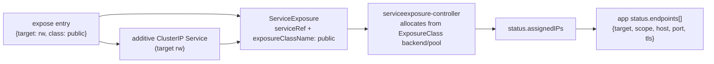

# Structured, additive external exposure for managed applications

- **Title:** `Structured, additive external exposure for managed applications`
- **Author(s):** `@kvaps`
- **Date:** `2026-06-30`
- **Status:** Draft

## Overview

Cozystack managed applications (Postgres, ClickHouse, Kafka, RabbitMQ, MariaDB, MongoDB, Redis, Kubernetes, S3 buckets) expose themselves to the outside world through a single chart-level boolean, `external: true|false`. The boolean is a dead end: it cannot publish more than one endpoint, cannot choose where the address comes from, cannot select which of an engine's listeners is published, and reports its result by mutating the in-cluster connection details in place. This proposal replaces it with a structured, additive `expose` field — a list of `{target, class}` entries that each publish one named listener through one referenced `ExposureClass`. The in-cluster `ClusterIP` Service is always present and never touched; everything in `expose` is added alongside it. The field builds entirely on primitives that are already merged: `ExposureClass` / `ServiceExposure` for address allocation (#3081), the `ca.crt`-only trust anchor for TLS (#2989), and `SecurityGroup` for source-IP ACL (#2922). The bare boolean keeps working as a deprecated alias.

## Scope and related proposals

This proposal covers only the Cozystack side — the chart-level API surface, the rendered Kubernetes objects, and the reported status. How a tenant UI, a portal, or any other orchestrator drives this API (address-pool selection policy, DNS naming, default-deny posture, billing) is out of scope and lives in the consuming layer.

- **Builds on** `ExposureClass` + `ServiceExposure` (#3081), the merged, mechanism-agnostic external-IP primitive.
- **Builds on** the unified-TLS trust-anchor contract (#2989), part of the broader unified-TLS effort (community proposal #19; #2811 / #2814).
- **References** `SecurityGroup` (#2922) for source-IP ACL, and Gateway API via Cilium (#2470) for the future SNI consolidation path.
- **Forward-compatible with, but does not implement,** Gateway/SNI endpoint consolidation (many databases behind one tenant IP, end-to-end TLS) — tracked as future work in community proposal #20 and issues #2815 / #2816, gated on Cilium 1.20.

## Context

Every managed application chart today carries `external: true|false`. When set, the chart flips its primary Service to `LoadBalancer` (or pins it onto a node address) and rewrites the connection host the application reports back. The naming and the rendered shape differ from chart to chart; the only thing they share is the binary.

In parallel, the platform has grown the primitives that make a richer model possible. `ExposureClass` is a cluster-scoped, `StorageClass`-like object: an admin defines `spec.backend` (`externalIPs` | `metallb` | `cilium` | `robotlb`) plus an address pool and L2/interface settings, and marks one as default via the `exposureclass.network.cozystack.io/is-default-class` annotation. `ServiceExposure` is the namespaced counterpart: it points at a `Service` (`spec.serviceRef`) and an `ExposureClass` (`spec.exposureClassName`), and its controller allocates the external address and reports it under `status.assignedIPs`. Cozystack already ships a merged trust anchor for TLS clients (the `ca.crt`-only `<release>-ca-cert` Secret, #2989) and a tenant firewall for source-IP ACL (`SecurityGroup`, #2922). The boolean predates all of these and uses none of them.

### The problem

- **One endpoint only.** A tenant that needs a database reachable both on a routable-private address (for its own apps) and on a public address (for an external consumer) cannot express it. `external` is one bit; it publishes one thing.
- **No choice of address source.** The boolean has no way to say "from the public pool" versus "from the private pool". Address-pool selection is invisible to the API.
- **No per-listener selection.** Engines expose several named listeners — Postgres `rw`/`ro`, ClickHouse `http`/`tcp`, RabbitMQ `amqp`/`management`. The boolean publishes a chart-chosen default and offers no way to pick.
- **Status mutates in place.** Turning on `external` rewrites the connection details the chart reports, destroying the in-cluster coordinates rather than adding to them. There is no stable list of "here is every way to reach me".
- **Inconsistent across charts.** Each chart implements the boolean its own way, so there is no single mental model and no shared status contract.

## Goals

- Publish zero or more external endpoints per application, each independently, without ever disturbing the in-cluster `ClusterIP` Service.
- Let the in-cluster baseline and routable-private and public endpoints coexist for the same application at the same time.
- Select which named listener of an engine is published (per-target), defaulting to the engine's primary listener when unspecified.
- Choose the address source by referencing an admin-defined `ExposureClass`, defaulting to the cluster's default class when unspecified.
- Report every reachable endpoint as additive, resolved status — never fabricated client-side, never destructive of the in-cluster entry.
- Keep `external: true|false` working as a deprecated alias with identical observable behavior.
- Use one consistent shape across every managed-application chart.

### Non-goals

- **Certificate issuance and PKI mechanics.** This proposal consumes the existing trust anchor (#2989); it does not define how certificates are minted or rotated.
- **Gateway / SNI routing mechanics.** Consolidating many databases behind one tenant IP with end-to-end TLS is future work (community #20, #2815 / #2816). The API here is kept forward-compatible but does not implement it.
- **ACL policy orchestration.** `expose` publishes; it does not decide who may connect, nor does it apply any default-deny. That posture is owned by the consuming orchestrator (see Security).
- **`ExposureClass` / address-pool provisioning.** Defining classes and pools is a cluster-admin task on the merged `ExposureClass` API (#3081), not part of an application chart.

## Design

### The `expose` field

`expose` is a list. Each entry is `{target, class}`. An absent or empty `expose` means in-cluster only — exactly today's `external: false`. The in-cluster `ClusterIP` Service is always rendered and is never modified by anything in `expose`.

```yaml
# values.yaml (postgres application)
expose:
  - target: rw
    class: private        # routable-private address, for the tenant's own apps
  - target: rw
    class: public         # public address, for an external consumer — added alongside, not instead
```

This publishes the `rw` listener twice — once from the `private` pool and once from the `public` pool — while the original in-cluster `ClusterIP` Service keeps serving unchanged. Removing an entry tears down only that endpoint; the others, and the in-cluster baseline, are untouched. This is the additive, non-disruptive property the boolean cannot provide.

### `target` — a per-engine closed enum

`target` selects which named listener to publish. It is a closed enum per engine, derived from the listeners the engine already exposes and validated per engine — the same closed-enum approach Cozystack already uses for the `kubernetes` app's `exposeMethod` field. Omitting `target` selects the engine's primary listener, which is what makes `external: true` translate to a single primary entry.

| Engine | `target` values | Primary (default) |
| --- | --- | --- |
| postgres | `rw`, `ro` | `rw` |
| clickhouse | `http`, `tcp` | `http` |
| rabbitmq | `amqp`, `management` | `amqp` |
| kafka | `bootstrap` | `bootstrap` |
| mariadb / mongodb / redis | `primary` | `primary` |
| kubernetes | `api` | `api` |
| bucket (S3) | `s3` | `s3` (always public; special-cased) |

The set is exactly what each engine can already expose — this proposal does not add new listeners, it makes the existing ones individually selectable.

### `class` — a reference to an `ExposureClass`

`class` is a reference, not a fixed API enum. It names an admin-provisioned `ExposureClass` (`network.cozystack.io/v1alpha1`, #3081), the same way a `PersistentVolumeClaim` names a `StorageClass`. By convention an admin provisions classes named `public` and `private`, but the names are arbitrary and the mechanism behind each is whatever the class's `spec.backend` selects (`externalIPs` | `metallb` | `cilium` | `robotlb`). Omitting `class` selects the cluster's default `ExposureClass`.

For each `expose` entry the chart renders two objects:

1. an additive `ClusterIP` Service for the selected `target`, and
2. a `ServiceExposure` with `spec.serviceRef` pointing at that Service and `spec.exposureClassName` set to `class`.

The `serviceexposure-controller` then allocates the external address from the class's backend and pool and reports it under `ServiceExposure.status.assignedIPs`. The chart never allocates addresses itself and never reuses `publishing.externalIPs` (that is host-ingress node-IP pinning — an orthogonal concern).



### Status

The application reports every way to reach it as `status.endpoints[]`, each entry `{target, scope, host, port, tls}` where `scope` is one of `in-cluster`, `public`, or `private`. The in-cluster entry is always present; public/private hosts are read back from the corresponding `ServiceExposure.status.assignedIPs`, never fabricated client-side. For the two-entry Postgres example above:

```yaml
status:
  endpoints:
    - target: rw
      scope: in-cluster
      host: <release>-rw.<tenant>.svc.cozy.local
      port: 5432
      tls: true
    - target: rw
      scope: private
      host: 10.0.0.5          # from the private ServiceExposure assignedIPs
      port: 5432
      tls: true
    - target: rw
      scope: public
      host: 203.0.113.7       # from the public ServiceExposure assignedIPs
      port: 5432
      tls: true
```

### Back-compat

`external: true` is defined as exactly `expose: [{target: <primary>, class: <default>}]`, and `external: false` as an empty `expose`. The bare boolean remains accepted (deprecated); when both are set, `expose` wins. The upgrade and rollback implications of this aliasing are covered below.

## User-facing changes

- Application charts gain an `expose` list field; `external` is marked deprecated in the schema but continues to work.
- Tenants describe exposure declaratively as `{target, class}` entries instead of flipping a bit, and read back every reachable endpoint from a single `status.endpoints[]` list.
- Cluster admins gain the lever that the boolean never had: which `ExposureClass` (and therefore which backend and address pool) a given endpoint draws from, selected per entry by name.

## Upgrade and rollback compatibility

Upgrading is non-breaking. Manifests using `external: true|false` keep their exact observable behavior through the alias, so no migration is required to upgrade. Tenants opt into the structured field on their own schedule; until they do, nothing changes for them. Rollback to a chart version that only understands `external` is clean for manifests that still use the boolean; a manifest that has adopted multi-entry `expose` has no single-boolean equivalent and would need to be reduced to one primary entry before downgrading — flagged here because that reduction is lossy by nature.

## Security

**TLS.** External exposure implies TLS — there is no plaintext-external combination. TLS is controlled per engine by a tri-state `tls.enabled`: unset defaults to "on when externally exposed", an explicit value always wins, and termination happens at the database pod itself (passthrough-friendly, never at an edge or gateway). External clients validate against the merged `ca.crt`-only trust anchor, the `<release>-ca-cert` Secret (#2989), surfaced through `core.cozystack.io/tenantsecrets`. TLS is already merged for Postgres, Kafka, NATS, and Qdrant; it is still converging for Redis, MongoDB, RabbitMQ, OpenSearch, and MariaDB (#2729 / #2692 / #2683 / #2682 / #2680). Until those land, the "external implies TLS" guarantee is engine-by-engine, and this convergence is in progress.

**Source-IP ACL is out of the `expose` field.** `expose` answers *what* is published; *who* may connect is answered by `SecurityGroup` (`sdn.cozystack.io`, #2922), attached to the application and carrying the allow-list (`ingress[].fromCIDR`, `fromApp`, `fromSG`, `toPorts`). This proposal references that mechanism; it does not re-implement ACL. Crucially, Cozystack core's `expose` creates only the publication object — the external Service — and does **not** itself apply any default-deny or guarantee "no public endpoint without an ACL". `SecurityGroup` is additive-allow over a blanket-allow baseline, so the deny posture and the tenant allow-list must be supplied by the consuming orchestrator (a portal or controller), not by Cozystack core. This is acceptable under the platform threat model: tenants reach Cozystack through that orchestrating layer rather than the raw API, and that layer owns the policy. The split is stated plainly here so no one assumes core enforces an invariant it does not.

## Failure and edge cases

- **`target` not in the engine's enum** → chart rejects at render; Flux surfaces the validation error on the HelmRelease status. No partial objects.
- **`class` names a non-existent `ExposureClass`** → the `ServiceExposure` stays unallocated; `status.assignedIPs` is empty, so the corresponding `status.endpoints[]` entry does not appear. The in-cluster baseline is unaffected.
- **Address pool exhausted** → `ServiceExposure` reports no `assignedIPs`; the public/private endpoint simply does not materialize in status until capacity frees up. No crash, no in-cluster impact.
- **Two entries with the same `{target, class}`** → redundant; deduplicated to a single Service/ServiceExposure pair.
- **Entry removed from `expose`** → only that Service + `ServiceExposure` are torn down; other endpoints and the in-cluster baseline persist.
- **`external` and `expose` both set** → `expose` takes precedence; the boolean is ignored (and deprecated).

## Testing

- **Unit (chart render):** `expose` entries render the expected additive `ClusterIP` Service + `ServiceExposure` pairs; the in-cluster Service is byte-for-byte unchanged; `target` enum validation rejects unknown values per engine; `external: true|false` renders identically to its `expose` equivalent.
- **Integration:** against a cluster with `public` and `private` `ExposureClass`es, a two-entry Postgres app gets two `ServiceExposure` allocations; `status.endpoints[]` reflects both `assignedIPs` plus the in-cluster entry; removing one entry tears down exactly one endpoint.
- **TLS:** for each TLS-merged engine, an externally exposed instance serves TLS terminated at the pod and validates against `<release>-ca-cert`; a plaintext-external combination is rejected.
- **Back-compat:** existing `external`-based manifests upgrade with no observable change.

## Rollout

1. Introduce `expose` alongside `external` in the managed-application charts, with `external` aliased to a single primary entry. Both shapes work; `external` is documented as deprecated.
2. Converge per-engine TLS so that "external implies TLS" holds for every engine (tracking #2729 / #2692 / #2683 / #2682 / #2680).
3. After a deprecation window, remove `external` from the chart schema; manifests still using it get a clear validation error pointing at `expose`.

## Open questions

1. **v1 scope of `target`.** Ship per-target selection from the start, or ship whole-service exposure first (all of an engine's listeners at once, as the boolean does today) with per-target as a fast follow? The API shape is the same either way; the question is how much validation/render work lands in the first cut.
2. **Default `class` ergonomics.** Relying on the cluster default `ExposureClass` is convenient but invisible in the manifest. Do we want the rendered `ServiceExposure` to record the resolved class name back into `status` so tenants can see which pool they actually landed on?
3. **Per-engine TLS convergence ordering.** Which of the still-plaintext engines block declaring "external implies TLS" as a hard, platform-wide admission rule rather than an engine-by-engine property?

## Alternatives considered

**A single `expose` struct instead of a list.** Rejected. A struct can hold one selection; it cannot express two simultaneous endpoints on the same `target` from different pools (private + public), nor give each endpoint an independent lifecycle. The list is the minimum shape that satisfies the additive, multiple-endpoint requirement.

**A raw `metallb.io/address-pool` annotation on the Service.** Rejected. That is the pre-#3081 world: mechanism-specific (MetalLB only), invisible to status, and unable to model anything but a single pool. Referencing an `ExposureClass` subsumes it — the class is mechanism-agnostic (`externalIPs` | `metallb` | `cilium` | `robotlb`), admin-governed, and already merged.

**A new platform-wide exposure CRD instead of a chart field.** Rejected for the application-facing surface. Address allocation already has its CRD (`ServiceExposure`); adding a second platform CRD between the tenant and that one would duplicate the model and split ownership. The chart field renders the existing `ServiceExposure` directly, keeping one allocation path.

**Putting ACL on the exposure field (`allowedSources: []CIDR`).** Rejected. Source-IP policy is a separate concern with its own merged primitive (`SecurityGroup`, #2922) that already models allow-lists, app-to-app, group-to-group, and port scoping. Folding a parallel CIDR list into `expose` would fork the ACL model; `expose` references `SecurityGroup` instead.

---

<!--
Inspired by KubeVirt enhancement proposals
(https://github.com/kubevirt/enhancements) and Kubernetes Enhancement
Proposals (KEPs).
-->
