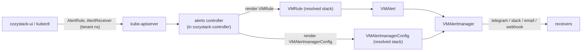

# Tenant alert management: rules and receivers

- **Title:** `Tenant alert management: rules and receivers`
- **Author(s):** `@IvanHunters`
- **Date:** `2026-10-08`
- **Status:** Draft

## Overview

Cozystack ships a working alerting stack (VMRule, vmalert, VMAlertmanager, Alerta), but a tenant cannot manage any of it: it cannot add, disable, or edit an alert rule, and it cannot say where its alerts should go. Rules require permissions on the VictoriaMetrics operator that tenants do not have, receivers are a hardcoded Alertmanager Secret plus per-instance Alerta channels, and a tenant without its own monitoring stack has no entry point at all. This is the read-write companion to the read-only metrics and logs proposals: unlike those, it is not a query passthrough, it is a management API that parses, validates, and translates tenant intent into backend objects.

This proposal introduces two tenant-facing namespaced CRDs in a new group `alerts.cozystack.io` (`AlertRule` and `AlertReceiver`) and a controller that validates them and renders the privileged backend objects (`VMRule` and `VMAlertmanagerConfig`) into the correct monitoring stack, root or per-tenant, with the tenant's namespace scope forced in so rules and routing stay isolated. The pattern is the one Cozystack already uses for tenant-facing resources reconciled into privileged objects (`backups.cozystack.io`, and `TenantGateway` for the render mechanism): a tenant writes a simple namespaced resource, and a controller holding the privileged RBAC renders the platform object the tenant may not touch directly.

## Scope and related proposals

- **Companion to the metrics (cozystack/community#94) and logs (#95) proposals.** Those are read-only query passthroughs; this is read-write management, so it has a different shape (CRDs plus a controller, not a streaming subresource).
- **Two things are managed:** alert rules (what fires) and receivers/routing (where it goes). Both are in scope.
- **Uses the shared tenancy model.** Stack resolution (root versus per-tenant) follows the same `namespace.cozystack.io/monitoring` label as metrics and logs.
- **Prerequisite platform changes.** It depends on two changes to the monitoring chart (enabling `VMAlertmanagerConfig` selection and scoping `VMAlert` rule selection); see Design and Rollout.

## Prior art

- **`TenantGateway` (the render-privileged-objects pattern).** A namespaced resource that a `cozystack-controller` reconciler renders into privileged platform objects (`Gateway`/`HTTPRoute`/`Certificate`) the requester cannot create directly, validated by CEL `XValidation` on the type. It is the precedent for the controller-renders-a-privileged-object mechanism and the CEL validation this proposal uses. (It is operator-facing, not tenant-granted; `backups.cozystack.io` below is the tenant-facing half.)
- **`backups.cozystack.io` (the tenant-facing CRD and RBAC pattern).** A tenant-facing namespaced CRD reconciled by its own controller, whose backup controller ships `cozy:backups:view` and `cozy:backups:admin` ClusterRoles labeled `rbac.cozystack.io/aggregate-to-tenant-{view,admin}`, delivering tenant CRUD without touching the tenant chart. The alerts resources and roles follow this.
- **`tenantlogrouting` (the stack-resolution pattern).** A cozystack-controller reconciler already resolves the `namespace.cozystack.io/monitoring` label to a monitoring stack. The alerts controller resolves the same way.
- **VictoriaMetrics operator (the backend).** `VMRule` carries alerting/recording rules; `VMAlertmanagerConfig`, when a `VMAlertmanager` selects it, is merged into the Alertmanager config with an operator-added namespace matcher, `continue: true` enforcement, and receiver name-prefixing, giving per-namespace routing. These are the privileged objects the controller renders.

## Decisions

<!-- Filled in as implementation proceeds; records live under this
proposal's decisions/ directory, numbered from 0001, linked newest first.
Empty while the proposal is still intent. -->

## Context

The alerting stack today:

- **Rules.** Alerting and recording rules are `VMRule` objects (plus `PrometheusRule` from some third-party charts, converted to `VMRule` by the operator). The platform rules live in `cozy-monitoring` (`packages/system/monitoring-agents/alerts/*.yaml`, `templates/vmrules.yaml`). There is no tenant-owned rule anywhere.
- **Evaluation.** `VMAlert` (`packages/system/monitoring/templates/vm/vmalert.yaml`) runs with `selectAllByDefault: true` and no `ruleSelector`/`ruleNamespaceSelector`, so it evaluates every `VMRule` in the cluster over its own `vmselect`. The platform `VMAlert` and a tenant `VMAlert` are configured identically, so a rule in any namespace is picked up by every tenant's `VMAlert`.
- **Routing and receivers.** `VMAlertmanager` points at a hardcoded `configSecret: alertmanager` (`packages/system/monitoring/templates/alerta/alerta.yaml`) and sets no `configSelector`/`selectAllByDefault`, so `VMAlertmanagerConfig` objects are ignored entirely today. The static route sends everything to a webhook into Alerta; email is the only receiver delivered directly from Alertmanager. Telegram and Slack are Alerta plugins (one chat and one webhook per Alerta instance), configured through the Monitoring app values `alerta.alerts.{telegram,slack,email}`. The route has no matcher on the owning tenant or namespace.
- **Delivery chain:** `VMAlert` to `VMAlertmanager:9093` to the Alerta webhook to the Telegram/Slack plugins; email bypasses Alerta straight from Alertmanager.
- **Root versus tenant.** The platform stack is the Monitoring app in `tenant-root`; a tenant with `tenant.spec.monitoring: true` (default `false`) gets its own `VMAlert`, `VMAlertmanager`, and Alerta. A tenant without its own stack is scraped by the root vmagent, and its alerts fire in the root stack carrying a `namespace=<its ns>` label, delivered to the root receivers.
- **Tenant RBAC.** The `cozy:tenant:*` roles carry no grant on `operator.victoriametrics.com`, so a tenant cannot create a `VMRule` or a `VMAlertmanagerConfig`.

### The problem

- A tenant wants to add an alert ("tell me when my database is almost out of disk") and choose where it goes (its own Telegram, a Slack channel, an email). There is no API for either, and no permission to use the backend objects.
- A tenant without its own monitoring stack has no entry point at all; its alerts live in the root Alertmanager with no tenant-scoped routing.
- Even internally, the stack has no per-tenant isolation: `VMAlert` evaluates all rules cluster-wide, so a rule authored for one tenant would fire in every tenant's evaluator, and the Alertmanager route has no owner matcher.

## Goals

- A tenant can create, edit, enable/disable, and delete its own alert rules through a simple namespaced CR, validated before it reaches the backend.
- A tenant can configure where its alerts go (Telegram, Slack, email, webhook) through a simple namespaced CR.
- A tenant's rules and routing are isolated: its rule only fires on its own series and only reaches its own receivers, including when it shares the root stack with other tenants.
- A tenant never gets direct access to `VMRule`/`VMAlertmanagerConfig`; a controller holds that and renders on its behalf.
- The same API works whether the tenant has its own monitoring stack or uses the root one.

### Non-goals

- Not changing what the platform's own built-in rules alert on.
- Not metrics or logs (the sibling proposals).
- Not silences/acknowledgements management in the first cut (possible follow-up).
- Not alerting for resources inside guest Kubernetes clusters.
- Not a new alert evaluation or delivery engine; it drives the existing VictoriaMetrics stack.

## Design

### 1. Shape: two tenant-facing CRDs plus a controller

A new group `alerts.cozystack.io/v1alpha1` with two namespaced, tenant-facing resources, reconciled by a new controller in `cozystack-controller` (the `TenantGateway` / `backups` controller pattern). The CR is the API; validation and translation (the "parsing") happen in CEL on the type plus the controller, not in the client.

- **`AlertRule`** (tenant-friendly): `expr` (PromQL), `for`, `severity`, `labels`, `annotations`, `enabled`. The controller renders a `VMRule` in the resolved stack.
- **`AlertReceiver`** (tenant-friendly): a destination (`telegram`/`slack`/`email`/`webhook`) plus a matcher (which severities / alert names / rules it catches). The controller renders a `VMAlertmanagerConfig` in the resolved stack.

### 2. AlertRule to VMRule, with a forced tenant scope

The controller translates an `AlertRule` into a `VMRule` group entry. It parses the `expr`, rejects it if invalid, and **injects the tenant's `namespace` label into every selector** of the expression (the same VictoriaMetrics `extra_filters`-style scoping the metrics proposal uses), so the rule can only fire on the tenant's own series. The rendered `VMRule` carries a `namespace=<ns>` label on its alerts so routing can match it. The controller sets the group's name and the owner reference back to the `AlertRule`.

### 3. AlertReceiver to VMAlertmanagerConfig

The controller renders an `AlertReceiver` into a `VMAlertmanagerConfig` with a receiver (`telegram_configs` / `slack_configs` / `email_configs` / `webhook_configs`) and a route. When a `VMAlertmanager` selects it, the operator automatically prepends a `namespace=<ns>` matcher to the config's top route, enforces `continue: true`, and prefixes receiver names, so a tenant's config can only catch and route the tenant's own alerts. This moves per-tenant Telegram/Slack delivery to Alertmanager-native receivers (one per tenant), rather than Alerta's single-channel-per-instance plugins; Alerta stays for the platform's own aggregated view. Receiver secrets (bot tokens, SMTP credentials, webhook URLs) are referenced from a `Secret` in the tenant namespace, not inlined.

### 4. Stack resolution: root or per-tenant

The controller reads `namespace.cozystack.io/monitoring` on the `AlertRule`/`AlertReceiver` namespace, which names the tenant whose monitoring stack the namespace reports to. When it names the tenant's own stack, the `VMRule`/`VMAlertmanagerConfig` are rendered there, where the tenant's `VMAlert`/`VMAlertmanager` live. When it is empty or the platform target, the tenant uses the root stack, so they are rendered into the root (`tenant-root`/`cozy-monitoring`), where the root `VMAlert`/`VMAlertmanager` pick them up, scoped by the forced `namespace` label. This is the same resolution metrics and logs use.

### 5. Isolation (closing existing gaps)

Three independent guards, because today none exists:

- **Rule evaluation.** `VMAlert` currently evaluates all rules cluster-wide, so a tenant `VMRule` would run in every tenant's evaluator. The design sets `ruleNamespaceSelector` on each `VMAlert` to its own namespace plus `cozy-monitoring` (platform rules), so a tenant's rules run only in that tenant's (or root's) evaluator. This is a monitoring-chart change (prerequisite).
- **Rule data.** Even if evaluated elsewhere, the forced `namespace` label in the expression means a rule only matches the tenant's series.
- **Routing.** The `VMAlertmanagerConfig` namespace matcher (operator-enforced) means a tenant's receivers only catch the tenant's alerts.

### 6. Validation and parsing

Structural validation is CEL on the CRD types (`XValidation`, as `TenantGateway` does), so bad shapes are rejected at admission. Semantic validation is in the controller: parse the PromQL `expr` and reject invalid expressions, enforce the namespace-scope injection, and translate the receiver into a valid backend config. This is the processing the dashboard does not have to do.

### 7. Prerequisite platform changes

- Set `configSelector`/`selectAllByDefault` on `VMAlertmanager` so `VMAlertmanagerConfig` objects are selected (today they are ignored).
- Set `ruleNamespaceSelector` on `VMAlert` so rule evaluation is scoped (today it is cluster-wide).
- The existing hardcoded `alertmanager` Secret stays as the base route for platform alerts; tenant configs are merged on top by the operator.

### 8. RBAC

Tenant-facing namespaced CRDs get aggregated ClusterRoles `cozy:alerts:view` (label `aggregate-to-tenant-view`, get/list/watch) and `cozy:alerts:admin` (label `aggregate-to-tenant-admin`, CRUD), shipped by the owning package like `cozy:backups:*`, so they reach the tenant groups through the existing bindings. The controller carries the `operator.victoriametrics.com` permissions (`vmrules`, `vmalertmanagerconfigs`) via `+kubebuilder:rbac`; the tenant never gets them directly, which also avoids the cluster-wide `VMRule` leak.

## User-facing changes

- **Dashboard:** an alert-rules editor and a receivers configuration on the tenant/application views, writing `AlertRule`/`AlertReceiver`.
- **API:** a new `alerts.cozystack.io` group with `AlertRule` and `AlertReceiver`, usable via `kubectl` and the SPA.
- **RBAC:** granted at tenant `view` (read) and `admin` (write) through existing groups.

## Upgrade and rollback compatibility

- Additive: two CRDs, a controller, two ClusterRoles. Existing clusters and the platform's own rules/receivers are unaffected.
- The two monitoring-chart changes (`VMAlertmanager` `configSelector`, `VMAlert` `ruleNamespaceSelector`) change evaluation and routing behavior and must be validated: scoping `VMAlert` means a tenant's evaluator stops seeing other namespaces' rules (intended), and enabling `configSelector` means `VMAlertmanagerConfig` objects start taking effect.
- Rollback: deleting an `AlertRule`/`AlertReceiver` garbage-collects its rendered `VMRule`/`VMAlertmanagerConfig` via owner references; removing the group and controller removes the feature and leaves the platform's static config in place.

## Security

- **Privilege separation:** the tenant writes only the simple CRs; the controller is the sole holder of `operator.victoriametrics.com` write access, so a tenant cannot craft an arbitrary `VMRule`/`VMAlertmanagerConfig` (which would otherwise leak across tenants or exfiltrate via a malicious receiver).
- **Forced scope:** the injected `namespace` label on rules and the operator-enforced namespace matcher on configs are the isolation hinges; a tenant cannot widen past its namespace.
- **Receiver secrets:** bot tokens, SMTP passwords, and webhook URLs are read from Secrets in the tenant namespace, never inlined into the CR or the rendered object's spec where another viewer could read them.
- **Expression safety:** the controller rejects an `expr` it cannot parse and bounds rule cost (evaluation interval, series) so a tenant cannot author a query that overloads `vmalert`.
- **Blast radius of the `VMAlert` change:** scoping `ruleNamespaceSelector` must include `cozy-monitoring` so platform rules keep running; a mistake there silently drops platform alerting, so it needs an explicit test.

## Failure and edge cases

- Invalid `expr`: rejected at the controller, surfaced on `AlertRule.status`, no `VMRule` rendered.
- Tenant without its own stack: resolves to the root stack; its rule/receiver render there, scoped by namespace.
- A rule that would match another tenant's series: impossible, the namespace label is injected server-side.
- Receiver secret missing: `AlertReceiver.status` reports it; no partial `VMAlertmanagerConfig`.
- `AlertRule` deleted: the rendered `VMRule` is garbage-collected by owner reference.
- Operator does not select the config (prerequisite not applied): `AlertReceiver.status` reports that routing is inactive, rather than silently doing nothing.

## Testing

- **Unit/CEL:** structural validation of `AlertRule`/`AlertReceiver`; the controller's PromQL parse and namespace-scope injection; receiver translation per channel type.
- **Integration:** the controller renders a `VMRule`/`VMAlertmanagerConfig` with the right scope and owner reference into the resolved stack; RBAC allows `cozy:alerts:admin` for the tenant and denies cross-tenant writes.
- **e2e:** a tenant's rule fires only on its own series and not in another tenant's evaluator; a tenant's receiver catches only its own alerts; platform rules keep alerting after `ruleNamespaceSelector` is scoped; deleting a CR removes its rendered object.

## Rollout

- **Phase 0 (prerequisite): make the stack tenant-aware.** Set `VMAlert` `ruleNamespaceSelector` (own namespace plus `cozy-monitoring`) and `VMAlertmanager` `configSelector`/`selectAllByDefault` in the monitoring chart, with tests that platform alerting still works.
- **Phase 1: CRDs, controller, RBAC.** Ship `alerts.cozystack.io` with `AlertRule`/`AlertReceiver`, the controller that validates and renders into the resolved stack, and the two aggregated ClusterRoles. Usable via `kubectl`.
- **Phase 2: dashboard.** Add the rule editor and receiver configuration to `cozystack-ui`.

## Open questions

The points previously open are resolved below, as decisions, or as recommendations where the implementation will confirm the detail.

- **Delivery path for per-tenant Telegram/Slack: decided Alertmanager-native receivers.** `VMAlertmanagerConfig` is the only mechanism that routes per tenant, because Alerta carries one channel per instance; the platform Alerta stays for the aggregated operator view, and per-tenant delivery moves to Alertmanager-native receivers.
- **Recording rules: decided out of scope.** `AlertRule` covers alerting rules only in the first cut; recording rules are a platform concern, and a follow-up can add them if tenants need their own.
- **Receiver secrets: decided a tenant-namespace Secret reference.** `AlertReceiver` names a `Secret` in the tenant namespace for tokens/passwords/URLs; the controller validates its presence and reads it with its own ServiceAccount, generalizing the platform's SMTP-password Secret model per tenant, and never inlines the value into the rendered object.
- **Silences/acknowledgements: decided out of the first cut.** They are a separate Alertmanager surface (the silence API, not a rule or a receiver) and are a follow-up.
- **Root `VMAlert` selector: recommended `cozy-monitoring` plus the root-reporting tenant namespaces.** The root `VMAlert` sets `ruleNamespaceSelector` to `cozy-monitoring` (platform rules) plus the namespaces whose monitoring label points at the root store (tenants without their own stack); a tenant `VMAlert` sets it to its own namespace plus `cozy-monitoring`. The exact selector form is confirmed in implementation.
- **OIDC and guest clusters: as in the metrics and logs proposals.** OIDC enabled with a flat `groups` claim and no prefix is a stated prerequisite; guest-cluster (Kamaji) alerting is out of scope, a dedicated follow-up.

## Alternatives considered

- **A synchronous aggregated-API resource in `cozystack-api`** (the `SecurityGroup` pattern: `sdn.cozystack.io/securitygroups` is served by the existing `cozystack-api`, which translates it into a `CiliumNetworkPolicy` synchronously on write and back on read, with no second server added). This is a genuine Cozystack pattern and would give synchronous validation at write time. Rejected in favor of a CRD plus a reconciling controller because alert objects need ongoing reconciliation, not only a write-time projection: the target stack must be re-resolved when a tenant enables its own monitoring, rendered objects must be repaired on drift, and status must be reported back on the tenant's resource. `backups.cozystack.io` and `TenantGateway` are the precedents for that CRD-plus-controller shape.
- **Grant tenants direct RBAC on `VMRule`/`VMAlertmanagerConfig`.** Rejected: `VMAlert` evaluates rules cluster-wide, so a tenant `VMRule` would fire in every tenant; it exposes operator internals and a malicious receiver could exfiltrate; and there is no validation or namespace scoping. The controller indirection is what makes it safe.
- **Keep Alerta as the only delivery and manage through Monitoring app values.** Rejected: values give no per-rule management and no per-tenant routing (Alerta is one channel per instance), and a tenant without its own stack has no values to set.
- **A read-write passthrough like the metrics/logs proposals.** Not applicable: alert management is stateful CRUD with validation and cross-object translation, not a query, so it is modeled as reconciled resources rather than a streaming subresource.

---

<!--
Inspired by KubeVirt enhancement proposals
(https://github.com/kubevirt/enhancements) and Kubernetes Enhancement
Proposals (KEPs).
-->
