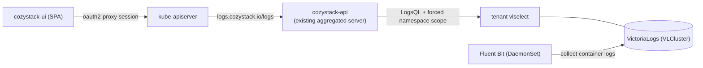
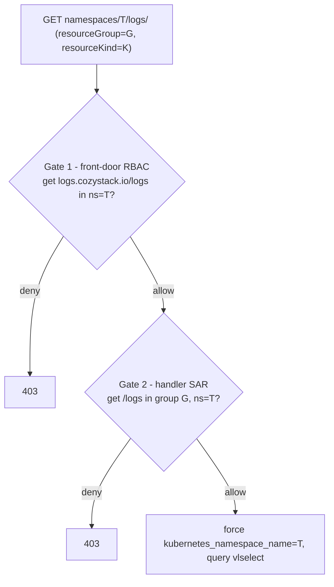

# Tenant application logs via a virtual logs resource

- **Title:** `Tenant application logs via a virtual logs resource`
- **Author(s):** `@IvanHunters`
- **Date:** `2026-10-08`
- **Status:** Draft

## Overview

Clients running managed applications, databases, and VMs on Cozystack want to read their logs in the dashboard, including the logs of a pod or application that has already been deleted (post-mortem, for incident analysis), without opening Grafana and without deploying their own monitoring stack. Today the logs are collected into VictoriaLogs, but a tenant has no way to read them: the dashboard talks only to the Kubernetes API and has no log viewer at all, and VictoriaLogs is reachable only through Grafana.

This proposal exposes logs as a **top-level virtual resource `logs` in a new `logs.cozystack.io` API group**, served by the existing `cozystack-api` aggregated API server. A client does `GET .../namespaces/<ns>/logs/<name>?resourceGroup=&resourceKind=&source=&follow=&...`; `cozystack-api` authorizes the call, builds a LogsQL query against the tenant's VictoriaLogs with a server-forced namespace scope, and streams the native VictoriaLogs NDJSON back as `text/plain` for the dashboard to render. There is **no new API server and no Kubernetes envelope in the log stream**.

This is the logs companion to the metrics proposal (`design-proposals/tenant-resource-metrics-api`). The two deliberately differ in shape, for one reason: logs must survive their parent.

## Scope and related proposals

- **Companion to the metrics proposal** (`tenant-resource-metrics-api`, cozystack/community#94). Both expose observability of `apps.cozystack.io` resources in the dashboard behind Kubernetes authorization. They differ on purpose: metrics are a **subresource** on `application` (live only, 404 after deletion is fine, RBAC comes for free); logs are a **top-level resource** (must survive deletion, so RBAC is not free). The asymmetry is explained in Design.
- **Modeled on the Cozystack portal logs API** (external: `aenix-org/cozyportal`, group `logging.portal.cozystack.io`, resource `logs`). That is a working implementation of exactly this pattern; this proposal adapts it to cozystack's tenancy and RBAC. The portal scopes by an `account`/`project` dimension; cozystack scopes by namespace, which is the only log isolation dimension it has today.
- **Complements, does not replace, Grafana.** Grafana stays the place for deep log exploration; this serves an embedded per-resource / per-namespace log view for tenants who do not run their own Grafana.
- **Alert management is a separate proposal.** Deferred.
- **Foundational dependency: per-application log labeling.** Cozystack's log collection today keeps only namespace/pod/container, not application identity (see Context); filtering logs to a specific application, rather than a whole namespace, depends on closing that gap (see Rollout).

## Prior art

- **Portal logs API (the model, external).** `aenix-org/cozyportal` serves a top-level namespaced virtual resource `logs` (group `logging.portal.cozystack.io`, no etcd) from its aggregated API server, enabled by `--serve-logging` and a VictoriaLogs endpoint. It implements `GetterWithOptions` + `Lister` + `Scoper` (no Create/Watch), decodes `LogOptions` (a `PodLogOptions` analogue) from query parameters, and returns a `ResourceStreamer` that streams VictoriaLogs NDJSON as `text/plain`. `list` cannot receive custom query parameters, so it carries them through `fieldSelector` plus an `AddFieldLabelConversionFunc`. It builds LogsQL with a scope label always prepended from the namespace and rejects an empty scope. Its authorization has two gates: a front-door kube RBAC check on `logs` in the logging group, and a custom `SubjectAccessReview` in the handler against the target resource's own group; its own delegated authorizer is short-circuited to Allow for `logs` so the thin SAR is authoritative. Because the logs resource lives in a separate group from its targets, its RBAC is not free; roles carry two rules.
- **Virtual resources in cozystack-api (the host precedent).** `cozystack-api` already serves etcd-less virtual resources (`options`, `taps` in `pkg/registry/core`) with `Lister`/`Getter`/`Watcher`/`Scoper`, and assembles its API groups (`core`/`sdn`/`apps.cozystack.io`) in one place (`pkg/apiserver/apiserver.go`). A new `logs.cozystack.io` group is added the same way, with a fourth `APIService`; no separate API server is needed. It has no `ResourceStreamer`, `GetterWithOptions`, or `SubjectAccessReview` code yet, so those are new ground.
- **Metrics proposal.** The sibling design for metrics; read it for the shared tenancy and `vmselect`/`vlselect` resolution model.

## Decisions

<!-- Filled in as implementation proceeds; records live under this
proposal's decisions/ directory, numbered from 0001, linked newest first.
Empty while the proposal is still intent. -->

## Context

- **Log store: VictoriaLogs.** The `packages/system/monitoring` chart deploys a `VLCluster` per `logsStorages` entry (default `generic`), at two levels through the same Monitoring chart: `tenant-root` hosts the platform store, and any tenant with `tenant.spec.monitoring: true` (default `false`) runs its own `VLCluster`. The read endpoint is `vlselect-<name>.<tenant-ns>.svc:9471`, queried at `/select/logsql/query`. VictoriaLogs multi-tenancy (`AccountID`/`ProjectID`) is not used: everything is written at account/project 0.
- **Collection: Fluent Bit.** A Fluent Bit DaemonSet (`packages/system/monitoring-agents`) tails container logs, Kubernetes events, and kube audit logs. The stream fields it keeps are `log_source`, `stream`, `kubernetes_pod_name`, `kubernetes_container_name`, `kubernetes_namespace_name`; other Kubernetes metadata, including pod labels (so application identity), is stripped and does not reach VictoriaLogs. Talos node logs arrive separately via a Vector collector, and guest Kubernetes clusters ship their container logs to the parent's `vlinsert`.
- **Tenancy model (shared with metrics).** Routing follows the `namespace.cozystack.io/monitoring` label: Fluent Bit routes a namespace's logs to the `VLCluster` of the nearest ancestor that has its own monitoring (the tenant itself when it does), and to `tenant-root` otherwise. Within one `VLCluster` the logs of all mapped namespaces sit together, distinguished by the `kubernetes_namespace_name` stream field. There is no account dimension, and the tenant ingress policy allows `cozy-system`, so `cozystack-api` in `cozy-system` can reach a tenant's `vlselect`.
- **Tenant RBAC and OIDC groups (shared with metrics).** Four aggregated ClusterRoles `cozy:tenant:{view,use,admin,super-admin}` (labels `rbac.cozystack.io/aggregate-to-tenant-<level>`) are bound per tenant namespace to `kind: Group` subjects `<tenant>-{view,use,admin,super-admin}` plus ancestor tenants' groups and service accounts, with the view < use < admin < super-admin rollup. The existing `apps.cozystack.io` grant in these roles is a resource wildcard; a new `logs.cozystack.io` group is not covered by it.
- **Dashboard.** `cozystack-ui` is a pure SPA (no BFF) that talks to the Kubernetes API through an in-pod nginx proxy. It has no log viewer today.

### The problem

- A tenant wants to read the logs of its database, VM, or app from the dashboard, including the logs of a pod that has already restarted or an application that was deleted during an incident. There is no log viewer and no API the SPA could call.
- Telling the client to open Grafana does not work for clients who do not run their own Grafana or monitoring stack.
- Reaching `vlselect` directly from the SPA (for example via `services/<vlselect>/proxy`) is unsafe: coarse authz and no forced namespace scope, so against a shared store it reads every mapped namespace's logs.

## Goals

- A tenant can read the logs of a resource it owns, over a chosen time window, and follow them live, rendered in the dashboard.
- Logs of a deleted pod or application remain readable (post-mortem) as long as they are within VictoriaLogs retention.
- A tenant can never read another namespace's logs, enforced server-side by a forced scope the client cannot override.
- The dashboard consumes the native VictoriaLogs NDJSON with a standard client, with no Kubernetes envelope around the stream.
- Minimal implementation: a virtual resource in the existing `cozystack-api`, not a new API server.

### Non-goals

- Not log collection, retention, or parsing changes (those stay in Fluent Bit and VictoriaLogs).
- Not alerting on logs (separate proposal).
- Not a replacement for Grafana.
- Not metrics (the sibling proposal).
- Not logs for resources inside guest Kubernetes clusters (different authorization model); out of scope.

## Design

### 1. Shape: a top-level virtual `logs` resource, and why not a subresource

Logs must survive their parent: the most valuable logs are often those of an already-deleted pod or application. A Kubernetes subresource is tied to its parent object's lifecycle and returns 404 once the parent is gone, so it cannot serve post-mortem logs. The metrics proposal could accept that (a live graph of a deleted VM is pointless); logs cannot. This is the same reason the portal's ADR-001 chose a top-level resource over a per-kind `/logs` subresource.

So logs are a **top-level namespaced virtual resource** `logs` (kind `Log`) in a new group `logs.cozystack.io/v1alpha1`, served by `cozystack-api` with no etcd, implementing `GetterWithOptions` + `Lister` + `Scoper` (no Create/Watch), following the portal's shape and cozystack's existing `options`/`taps` virtual-resource precedent.

### 2. Request and response

- **Get one object's logs:** `GET .../namespaces/<ns>/logs/<name>?resourceGroup=&resourceKind=&source=&level=&follow=&tailLines=&sinceTime=&sinceSeconds=`. The query parameters decode into a `LogOptions` (a `PodLogOptions` analogue); `<name>` identifies the target resource. The response is the VictoriaLogs NDJSON streamed as `text/plain` (a `ResourceStreamer`), with `follow` upgrading to a live tail.
- **List a namespace's logs:** `GET .../namespaces/<ns>/logs?fieldSelector=resourceGroup=...,resourceKind=...`. Because Kubernetes `list` does not pass custom query parameters, the filters travel through `fieldSelector`, which requires an `AddFieldLabelConversionFunc` for the `Log` kind (as the portal does); `metadata.name`/`metadata.namespace` are rejected there in favor of the Get path.

### 3. Tenant isolation: forced namespace scope

The handler takes the tenant from the request namespace (already authorized, see 4) and **always prepends a scope filter to the LogsQL**: `kubernetes_namespace_name="<ns>"`, the only log isolation dimension cozystack has today. A query with an empty scope is rejected. Client-supplied filters are added only on top of this forced scope, so a client cannot read another namespace's logs. This mirrors the portal (a scope label always prepended, empty scope rejected).

### 4. Authorization: two gates, and RBAC is not free

Because `logs.cozystack.io` is a new group, it is **not** covered by the existing `apps.cozystack.io` wildcard, so unlike metrics this needs an explicit grant. Two gates, following the portal:

- **Gate 1 (front-door).** The kube-apiserver authorizes `get`/`list` on `logs.cozystack.io/logs` in the request namespace by RBAC before proxying to the aggregated server (the aggregated server's own delegated re-check of this resource is removed, see Gate 2, so the front door is this kube-apiserver RBAC). This needs one new aggregated ClusterRole rule, delivered by the owning package and labeled `rbac.cozystack.io/aggregate-to-tenant-view`, so it reaches the `<tenant>-view` groups through the existing bindings (precedent: `migration-controller` ships its own tenant ClusterRoles this way).
- **Gate 2 (handler SAR).** The handler issues a `SubjectAccessReview` for the calling user against the **target** resource: `get <resourceKind-plural>/logs` in group `resourceGroup` (default `apps.cozystack.io`), namespace T. `cozystack-api`'s own delegated authorizer is short-circuited to Allow for the `logs` resource so this SAR is authoritative. The elegant part: when the target is an `apps.cozystack.io` application, `get <plural>/logs` is already covered by the existing wildcard app-read grant, so gate 2 passes for anyone who can read the application, tying "can read logs" to "can read the resource". The resource need not exist for the SAR to pass (SAR is about permission, not existence), which is exactly what makes post-mortem work: a tenant keeps `get` in namespace T after the pod is gone. `cozystack-api`'s ServiceAccount already has `system:auth-delegator`, so it can create the SAR with no new grant.

Bind gate-1 through a RoleBinding in the tenant namespace (a ClusterRoleBinding would break isolation), which the existing tenant chart already does for the aggregated roles.

### 5. vlselect resolution (shared with metrics)

The handler reads `namespace.cozystack.io/monitoring` on the request namespace: a non-empty value names the `VLCluster` holding that namespace's logs, and an empty value (the default, no dedicated store) means the logs are in the platform default store `tenant-root`, where Fluent Bit routes them. The forced namespace scope is applied in both cases.

### 6. Filtering to an application (a collection gap)

Cozystack's Fluent Bit keeps only namespace/pod/container, not application identity (pod labels are stripped), so filtering logs to one application rather than a whole namespace is not possible from the stream today. Two options, deferred to Rollout: resolve the application's pods and filter by `kubernetes_pod_name`, or enrich collection with `resource_group`/`resource_kind`/`resource_name` stream fields as the portal does. The first cut can serve namespace-scoped logs and per-pod logs.

## User-facing changes

- **Dashboard:** a log view on application / database / VM detail pages and a namespace-level log view, with follow (live tail), rendered from the VictoriaLogs NDJSON. This is the first log viewer in `cozystack-ui`.
- **API:** a new `logs.cozystack.io` group with a virtual `logs` resource, usable as `kubectl get --raw .../namespaces/<ns>/logs/<name>?...` and from the SPA.
- **RBAC:** one new aggregated ClusterRole (gate 1), reaching tenant groups automatically; gate 2 reuses the existing app-read grant.

## Upgrade and rollback compatibility

- Additive: a new API group, a new `APIService`, and one ClusterRole; existing clusters, manifests, and APIs are unaffected.
- No CRD and no stored objects. Removing the group, `APIService`, and ClusterRole removes the feature; the dashboard degrades to "no logs" (today's state).
- This introduces the first streaming virtual resource and the first in-handler `SubjectAccessReview` in `cozystack-api`, so the apiserver wiring (`ResourceStreamer`, the `LogOptions` parameter codec, the authorizer bypass) is new ground to validate in `cozystack-api` tests.

## Security

- **Forced namespace scope** is the isolation hinge: the LogsQL always carries `kubernetes_namespace_name=<ns>` server-side, and an empty scope is rejected, so a client query cannot widen past its namespace.
- **Two authorization gates:** a front-door RBAC check and a target-resource SAR; the server's own authorizer is bypassed only for the `logs` resource, so the SAR is authoritative.
- **Why not `services/proxy` to `vlselect`:** coarse authz, no forced scope, reads every mapped namespace on a shared store.
- **Query cost and safety:** `tailLines`/limit are bounded (the portal defaults to 100, caps at 10000); `follow` is incompatible with `since*`; `source`/`level` and the resource selectors are validated against an allowlist and a name grammar before entering LogsQL.
- **Platform logs:** audit and system-source logs must not be reachable through a tenant's namespace scope; restrict `source` so a tenant cannot select platform log sources.

## Failure and edge cases

- Namespace has no dedicated store (empty label): resolves to `tenant-root` where the logs are; the common case, not a failure.
- Target resource deleted: logs still stream (post-mortem) within retention; the SAR passes on permission, not existence.
- Caller lacks `get logs.cozystack.io/logs` or the target `get <plural>/logs`: 403 at the respective gate before any query.
- Client tries to drop or widen the namespace scope: impossible, it is prepended server-side.
- `follow` with a since window, or an empty scope: rejected by validation.
- `vlselect` unreachable: a backend error distinct from "no logs".

## Testing

- **Unit:** the forced `kubernetes_namespace_name` scope is always present and cannot be overridden; `LogOptions` decode from query and from `fieldSelector`; validation (name grammar, source/level allowlist, follow/since exclusivity); the `vlselect` resolver (including the empty-label `tenant-root` case).
- **Integration:** gate 1 allows `<tenant>-view` for `get logs.cozystack.io/logs` in the namespace and denies a foreign tenant; gate 2 SAR allows reading an app's logs for a user who can read the app and denies otherwise; the resource streams `text/plain` through the aggregated server.
- **e2e:** two tenants mapped to a shared `tenant-root` store; tenant A reads only A's namespace logs; a deleted pod's logs are still readable; a follow stream delivers live lines; a log view renders in the dashboard.

## Rollout

- **Phase 1: the `logs` resource in `cozystack-api`.** Add the `logs.cozystack.io` group and `APIService`, the `GetterWithOptions`/`Lister`/`ResourceStreamer` handler, the forced namespace scope, the `vlselect` resolution, the two-gate authz with the authorizer bypass, and the one aggregated ClusterRole. Usable via `kubectl --raw`. First cut serves namespace-scoped and per-pod logs.
- **Phase 2: per-application filtering.** Close the collection gap (resolve pods per application, or add `resource_*` stream fields in Fluent Bit) so logs can be filtered to one application.
- **Phase 3: dashboard.** Add a log viewer with follow to `cozystack-ui`.

## Open questions

- Resolving the target to a log selector: resolve the application's current and past pods (how, for deleted ones?) and filter by `kubernetes_pod_name`, versus enriching collection with `resource_*` stream fields.
- Parameter codec: cozystack-api uses `metav1.ParameterCodec`, while decoding `LogOptions` from the query (the portal uses a scheme-aware parameter codec) needs a codec that knows the `LogOptions` type; confirm the wiring.
- Whether `list` across a namespace is needed in the first cut, given the `fieldSelector` quirk, or whether per-object Get plus a per-namespace Get is enough.
- Should gate 2 target `<app>/logs` in `apps.cozystack.io` (free via the existing wildcard, coupling logs to app-read) or `pods/log` in core (not currently granted to tenants, would need an explicit rule)?
- The OIDC prerequisite (enabled, no group prefix), as in the metrics proposal.
- Guest-cluster (Kamaji) exclusion, as in the metrics proposal.

## Alternatives considered

- **A `logs` subresource on `application`** (symmetric with the metrics proposal). Rejected: a subresource is tied to its parent's lifecycle and returns 404 after deletion, so it cannot serve post-mortem logs, which is the main reason to read logs. The asymmetry with metrics is deliberate.
- **Reuse the portal's logs API as-is.** The portal (`logging.portal.cozystack.io`) is a separate product with its own tenancy dimension (`account`/`project`) and its own RBAC group; cozystack scopes by namespace and has its own tenant groups, so the mechanism is adopted but not the deployment.
- **A deep link to Grafana / the VictoriaLogs UI.** Low effort and good for clients who already run Grafana, but rejected as the primary because the target audience is clients who do not; worth shipping as a complementary convenience.
- **Direct `services/proxy` to `vlselect`.** Rejected: coarse authz and no forced namespace scope, so it leaks across namespaces on a shared store.
- **VictoriaLogs native multitenancy (`AccountID`/`ProjectID`).** Could isolate tenants inside one store, but cozystack writes everything at account 0 and isolates by separate stores plus namespace, so adopting it is a larger change to the whole logging pipeline; out of scope.

---

<!--
Inspired by KubeVirt enhancement proposals
(https://github.com/kubevirt/enhancements) and Kubernetes Enhancement
Proposals (KEPs).
-->
