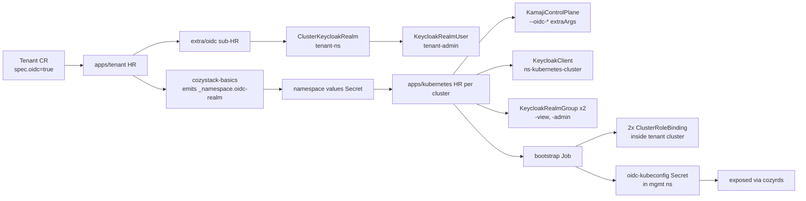

# Per-tenant Keycloak realms for tenant Kubernetes cluster OIDC

- **Title:** `Per-tenant Keycloak realms for tenant Kubernetes cluster OIDC`
- **Author(s):** `@IvanHunters`
- **Date:** `2026-06-26`
- **Status:** Draft

## Overview

Cozystack already exposes a flat `cozy` Keycloak realm that backs the management-cluster dashboard. This proposal adds OIDC to **tenant-owned Kubernetes clusters** — the clusters tenants spin up via the `kubernetes` application — using a **separate Keycloak realm per tenant**, not the flat `cozy` realm.

The choice of identity unit is the central decision in this proposal. A cozystack tenant is an organizational boundary — a customer, a team, a project — that already owns its databases, VMs, ingress, RBAC, and now its own user directory. The platform-admin realm (`cozy`) and a tenant's user directory serve different populations and different trust models; collapsing them into one realm couples a platform-internal artifact to an externally-visible tenant surface. Per-cluster token isolation is delivered by a per-cluster public client inside the tenant realm, not by a separate directory.

## Scope and related proposals

- **Implementation PR**: [`cozystack#3044`](https://github.com/cozystack/cozystack/pull/3044). Adds per-tenant realm provisioning, per-cluster client+groups, `--oidc-*` wiring on `KamajiControlPlane`, OIDC kubeconfig Secret, and dashboard exposure.
- **Companion (Grafana side)**: [`design/grafana-keycloak-tenants`](../grafana-keycloak-tenants/) (separate proposal, same realm). Same per-tenant realm reused for tenant Grafana access.
- **Deferred (separate proposal):** Bring-your-own OIDC for tenant clusters via Kubernetes structured authentication configuration. Not in this proposal; called out under Open questions.
- **Deferred (separate proposal):** Custom `client.authentication.k8s.io` exec plugin doing RFC 8693 Token Exchange. Not in this proposal; called out under Alternatives considered.

## Context

### The current shape

Today the `cozy` realm exists for management-cluster platform admins. The dashboard, ArgoCD, and a few other platform components rely on it. Groups in `cozy` are `<tenant-ns>-*` membership markers used to grant management-cluster RBAC; they do not describe end-user identities owned by a tenant.

Tenant Kubernetes clusters provisioned by the `kubernetes` app (`packages/apps/kubernetes/`) ship with **one user-facing path**: the `kubernetes-<cluster>-admin-kubeconfig` Secret that the platform mints. The Secret contains a static `cluster-admin` certificate. Any human who needs `kubectl` against the cluster takes the same cert — there is no per-user identity, no per-user audit, no MFA, no group-based RBAC.

### Existing primitives

- **EDP Keycloak Operator** (`v1.edp.epam.com/v1alpha1`) — declares `ClusterKeycloakRealm`, `KeycloakClient`, `KeycloakRealmGroup`, `KeycloakClientScope` as Kubernetes CRDs. Already vendored and running in cozystack management clusters as part of the platform stack.
- **`apps/tenant` chart** — owns the lifecycle of a tenant namespace, currently emits cozystack-basics values via a static template, exposes a flat `Tenant.spec.*` API.
- **`apps/kubernetes` chart** — renders `Cluster`, `KamajiControlPlane`, `KubevirtCluster`, MachineDeployments, addons. Accepts `oidc` values today only as no-op fields; no resources rendered.
- **`packages/extra/oidc/`** (new in cozystack#3044) — Helm chart owning the `ClusterKeycloakRealm` + bootstrap admin user for one tenant realm.
- **`KamajiControlPlane`** — Kamaji's `tcp.kamaji.clastix.io/v1alpha1` CRD allows arbitrary `--oidc-*` flags via `spec.apiServer.extraArgs`. It also supports `spec.deployment.extraVolumes` + `spec.apiServer.extraVolumeMounts`, which matter for the BYO-OIDC follow-up but not for this proposal.

### The problem

Tenant clusters need a real user identity model. Tenants need to:

- Onboard their own people without involving cozystack platform admins.
- Audit who ran `kubectl exec`.
- Bind RBAC to groups, not to a single shared certificate.
- Rotate access by disabling a user, not by rotating a cluster's kubeconfig.

And whatever shape we ship has to fit within an existing structural reality: the `cozy` realm is **not a tenant directory**. Its groups are management-cluster permission markers (`<ns>-admins`, `<ns>-users`), populated by the platform operator at tenant-creation time. Using it as the place where a tenant's engineers and customers live couples a platform-internal trust artifact to a tenant-facing user surface, and forces every tenant user lifecycle event to flow through the platform admin.

## Goals

- Tenant admins manage their own users, groups, and password / MFA policy without platform-admin involvement.
- Tenant Kubernetes clusters authenticate via OIDC against an issuer the tenant controls.
- Per-cluster token replay is impossible: a token minted for cluster A is rejected by cluster B even within the same tenant.
- Default RBAC for OIDC identities is **view + admin split, not blanket cluster-admin**. The static admin kubeconfig stays as the break-glass path.
- The full surface (realm + client + groups + RBAC + kubeconfig Secret) is declarative: `Tenant.spec.oidc=true` is enough.
- The chart's existing API stays additive — clusters without `oidc.enabled` render the same objects as on `main`.

### Non-goals

- **BYO-OIDC for tenant clusters.** Deferred; needs structured authentication configuration, which is a follow-up proposal.
- **Multi-issuer tenant clusters.** Single issuer per `KamajiControlPlane`; multi-issuer is a structured-auth-config feature.
- **Custom credential plugin / RFC 8693 token exchange.** A possible future optimization; not required to ship per-tenant realms.
- **Federation of tenant realms to external corporate IdPs.** Out of scope of this proposal. A tenant admin can configure Keycloak's standard upstream federation (LDAP, SAML, social) inside the tenant realm if they want; that's a `keycloakctl` action, not a chart change.
- **Cross-cluster SSO inside one tenant.** Each tenant cluster has its own audience; one realm login, one set of issued tokens, multiple per-cluster audiences are issued separately. Token-exchange is a separate proposal.

## Design

### Layer 1 — Per-tenant realm

When `Tenant.spec.oidc=true`, the tenant's `apps/tenant` HelmRelease renders a sub-HR pointing at `packages/extra/oidc/`. That chart owns:

- One `ClusterKeycloakRealm` CR named `tenant-<ns>` (where `<ns>` is the tenant namespace, which is realm-wide unique). The realm carries default authentication flows from the Keycloak operator and is wired to the platform's master `ClusterKeycloak`.
- One bootstrap `KeycloakRealmUser` representing the tenant admin, with credentials sourced from a Secret that already exists in the tenant namespace (`<ns>-admin-credentials`).

Realm naming is `tenant-<ns>`, not `<ns>`, to avoid the chance that a tenant namespace collides with an unrelated realm name (e.g. `cozy`, `master`, an operator-managed realm).

### Layer 2 — Realm propagation through the tenant hierarchy

Cozystack tenant namespaces form a hierarchy: a tenant with `oidc=false` inherits its parent's realm. The propagation does **not** use Helm `lookup`. It uses cozystack-basics's static namespace-values emission:

- `packages/core/cozystack-basics/templates/_namespace.tpl` emits `_namespace.oidc-realm` into the per-namespace values bundle that every chart in the namespace reads.
- The value is computed by walking up the tenant hierarchy at template-render time inside cozystack-basics: take the closest ancestor (including self) with `_cluster.oidc-enabled=true` and emit its realm name.
- `apps/kubernetes` reads `._namespace.oidc-realm` at render time. No Helm `lookup`. No re-render gap. The value is materialized into the same values Secret that already gates every other namespace-level concern (DNS suffix, ingress class, storage class).

This is the same shape as how `_namespace.dns-suffix` and `_namespace.kubelet-image-credential-provider-config` are already propagated. The OIDC realm rides the same channel.

### Layer 3 — Per-cluster public client (audience binding)

For each `Kubernetes` CR in the tenant namespace with `oidc.enabled=true`, `apps/kubernetes` renders:

- One `KeycloakClient` in `tenant-<ns>` realm with `spec.clientId: <ns>-kubernetes-<cluster>`, `publicClient: true`, PKCE required, redirect URIs limited to `http://localhost:8000` and `http://localhost:18000` (the kubelogin and oidc-login default ports).
- One `KeycloakClientScope` with an `oidc-usermodel-attribute-mapper` (audience mapper) so the issued `id_token.aud` equals the clientId.

`clientId` is realm-wide unique. Two clusters with the same short name in different namespaces get different clientIds because the namespace prefix is part of the id. The audience binding is the per-cluster isolation primitive: an id_token minted for `<ns-a>-kubernetes-prod` carries `aud: <ns-a>-kubernetes-prod`, and a different cluster's apiserver — configured with `--oidc-client-id=<ns-b>-kubernetes-prod` — rejects it. No tenant-side coordination needed.

### Layer 4 — Two-tier RBAC groups

`apps/kubernetes` renders **two** `KeycloakRealmGroup` CRs per cluster:

- `<cluster>-view` (metadata.name) with `spec.name: <ns>-kubernetes-<cluster>-view` (realm-wide unique).
- `<cluster>-admin` (metadata.name) with `spec.name: <ns>-kubernetes-<cluster>-admin`.

Tenant admin assigns Keycloak users to whichever group is appropriate through the standard Keycloak admin UI inside `tenant-<ns>`. Group membership ends up as `groups:` claim in the id_token.

Inside the tenant Kubernetes cluster, a bootstrap Job (Helm `post-install,post-upgrade` hook, ServiceAccount scoped to the tenant namespace, pod labeled `policy.cozystack.io/allow-to-apiserver: "true"` so Cilium permits the egress to the management apiserver) applies two `ClusterRoleBinding`s:

- `oidc-<cluster>-view` → `ClusterRole/view`, subject `Group: <ns>-kubernetes-<cluster>-view`.
- `oidc-<cluster>-admin` → `ClusterRole/cluster-admin`, subject `Group: <ns>-kubernetes-<cluster>-admin`.

`view` is the upstream kube-default ClusterRole — read-mostly, no secrets, no exec. `cluster-admin` is the upstream kube-default escalation. The chart **does not** invent a third role. A tenant who wants finer-grained roles authors them in their own GitOps repo and binds them to additional Keycloak groups themselves.

The static admin kubeconfig stays. It is the documented break-glass path when OIDC is misconfigured or the realm operator is down.

### Layer 5 — KCP OIDC flag wiring

`apps/kubernetes/templates/cluster.yaml` adds `spec.apiServer.extraArgs` on `KamajiControlPlane` when `oidc.enabled` AND the realm is known (cozystack-basics emitted `_namespace.oidc-realm`):

```yaml
spec:
  apiServer:
    extraArgs:
    - --oidc-issuer-url=https://keycloak.<root-host>/realms/<realm>
    - --oidc-client-id=<ns>-kubernetes-<cluster>
    - --oidc-username-claim=preferred_username
    - --oidc-groups-claim=groups
```

If `oidc.enabled=true` but cozystack-basics has not yet emitted `_namespace.oidc-realm` (because the realm hasn't reconciled yet), the chart emits a soft beacon — a `ConfigMap` named `<cluster>-awaiting-oidc-realm`, status `awaiting-oidc-realm` — and **does not** add the extraArgs. Flux re-renders on its normal interval; once the realm value lands in namespace values, the next render produces the extraArgs and triggers a `KamajiControlPlane` patch. This sidesteps the Helm lookup re-render gap completely (no lookup is involved at all).

### Layer 6 — OIDC kubeconfig Secret in management namespace

Once the bootstrap Job has applied the two CRBs inside the tenant cluster, the same Job writes a Secret in the management cluster's tenant namespace:

```yaml
apiVersion: v1
kind: Secret
metadata:
  name: kubernetes-<cluster>-oidc-kubeconfig
  namespace: <ns>
stringData:
  issuer-url: <issuer>
  client-id: <ns>-kubernetes-<cluster>
  realm: <realm>
  group-view: <ns>-kubernetes-<cluster>-view
  group-admin: <ns>-kubernetes-<cluster>-admin
  server-url: <tenant cluster API URL>
  kubeconfig: |
    apiVersion: v1
    kind: Config
    # ...embeds the cluster CA + an exec auth block calling `kubectl oidc-login`
```

`packages/system/kubernetes-rd/cozyrds/kubernetes.yaml` lists this Secret name in `spec.secrets.include[].resourceNames`, so the cozystack dashboard exposes it to tenant viewers alongside the existing admin-kubeconfig Secret. Tenant users `kubectl get secret kubernetes-<cluster>-oidc-kubeconfig -o jsonpath='{.data.kubeconfig}' | base64 -d > ~/.kube/config-<cluster>` and `kubectl oidc-login` does the rest.

### Lifecycle



- **Create**: `Tenant.spec.oidc=true` → realm appears → cozystack-basics emits realm into namespace values → all `Kubernetes` CRs in the namespace re-render with OIDC wired in on next Flux interval.
- **Inherit**: child tenant with `oidc=false` reads parent's `_namespace.oidc-realm` from its own namespace values. Same wiring as create.
- **Add a cluster**: a new `Kubernetes` CR in an OIDC-enabled tenant gets its own client+groups+CRBs+Secret automatically. No tenant-admin intervention.
- **Delete a cluster**: Helm `pre-delete` hook Job removes the per-cluster CRBs inside the tenant cluster, removes the OIDC kubeconfig Secret in the management cluster, and lets Flux garbage-collect the per-cluster `KeycloakClient` and `KeycloakRealmGroup`s.
- **Disable OIDC on a tenant**: `Tenant.spec.oidc=false` removes the `extra/oidc` sub-HR. The Keycloak operator removes the realm and its users. Per-cluster wiring on this tenant's `Kubernetes` CRs falls back to the no-OIDC render (KCP extraArgs removed; admin kubeconfig stays).

## User-facing changes

- Tenant `Kubernetes` CRD gains an `oidc.enabled` bool. Default `false`. When `true` it is a no-op until the namespace's `_namespace.oidc-realm` is populated.
- `Tenant` CRD gains a flat `spec.oidc` bool. Default `false`. When `true` the tenant gets its own realm.
- Dashboard: in an OIDC-enabled namespace, the cluster page shows a new `kubernetes-<cluster>-oidc-kubeconfig` Secret alongside the existing admin-kubeconfig Secret.
- Keycloak admin UI: the tenant admin sees a new realm `tenant-<ns>` and is the bootstrap admin of it. Group assignments for tenant users live there.

No CLI changes in this proposal. A future `cozystack` CLI command for "give me a ready-to-use OIDC kubeconfig for cluster X" is an obvious follow-up.

## Upgrade and rollback compatibility

- **Backward compatibility (no OIDC):** clusters without `oidc.enabled` render the same set of objects as on `main`. helm-unittest covers the 0-document and 0-extraArgs cases for `apps/kubernetes`.
- **Upgrade from OIDC-disabled to OIDC-enabled:** flip `Tenant.spec.oidc=true` and `Kubernetes.spec.oidc.enabled=true`. Standard HR upgrade, no migrations, no controller cooperation beyond Flux + Keycloak operator.
- **Rollback from OIDC-enabled to OIDC-disabled:** flip the bools back. Bootstrap-Job cleanup hook runs on pre-delete; the static admin kubeconfig path is untouched throughout.
- **Existing dev clusters with no realm**: chart emits the soft `awaiting-oidc-realm` beacon and keeps the KCP unmodified. Operator sees a clear status on the ConfigMap and can fix the realm out-of-band without the chart wedging.

## Security

- **Trust domains stay separate.** `cozy` realm continues to back platform-admin SSO and management-cluster RBAC. `tenant-<ns>` realms back tenant cluster auth. A compromise of a tenant realm cannot escalate into platform-admin RBAC because no group in `tenant-<ns>` is referenced from any management-cluster RoleBinding.
- **Per-cluster audience binding.** Token minted for `aud: <ns>-kubernetes-A` is rejected by cluster B's apiserver (its `--oidc-client-id` is different). No webhook required, no extra moving parts.
- **`system:authenticated` exposure.** Every OIDC-authenticated user lands in `system:authenticated` and gets the kube-default `system:discovery` / `system:basic-user` / `system:public-info-viewer` rights. This is true for **any** OIDC integration on kube-apiserver, including BYO-OIDC. The per-cluster audience binding makes this safe: the token can only reach the cluster it was issued for.
- **Bootstrap Job ServiceAccount.** Restricted to its tenant namespace + a single Role granting it write access to two specific Secret names (`kubernetes-<cluster>-admin-kubeconfig` for read, `kubernetes-<cluster>-oidc-kubeconfig` for write). Cilium egress restricted by the `policy.cozystack.io/allow-to-apiserver` label, matching the existing pattern used by cluster-autoscaler, kccm, and the CSI controller.
- **No platform-admin path into tenant data.** The platform admin can read tenant realm contents via the master Keycloak (operationally, that is the same as today for `cozy`), but RBAC inside tenant clusters is entirely driven by tenant-realm group membership, which only the tenant admin manages.

## Failure and edge cases

- **`oidc.enabled=true` but cozystack-basics hasn't emitted `_namespace.oidc-realm` yet** → chart emits `<cluster>-awaiting-oidc-realm` ConfigMap, leaves KCP unchanged. Next Flux reconcile picks up the realm value.
- **`oidc.enabled=true` but the platform-level OIDC flag is off** → chart `fail`s the render with a clear error pointing at the platform flag.
- **Realm deletion while clusters in the namespace still have `oidc.enabled=true`** → admission protection: the Keycloak operator's `ClusterKeycloakRealm` finalizer holds until child `KeycloakClient`s are gone. The tenant chart's pre-delete order is realm-last.
- **Tenant realm operator down** → realm CR stays Pending. Soft beacon ConfigMap stays. KCP unmodified. Clusters keep working via static admin kubeconfig.
- **Bootstrap Job egress blocked by Cilium policy** → Job pod is labeled `policy.cozystack.io/allow-to-apiserver: "true"`; the existing apiserver-egress allow rule (already used by cluster-autoscaler / kccm / kcsi-controller) covers it. Without the label, `kubectl apply` of the Secret times out and the Job fails — surfaced in HR status.
- **kubectl client without `oidc-login` plugin** → user sees a clear error from kubectl. Documented prerequisite alongside the kubeconfig Secret in the dashboard.
- **Two tenants try to claim the same realm name** → realm names are `tenant-<ns>`, and `<ns>` is globally unique inside a cozystack management cluster. No collision.

## Testing

- **helm-unittest** for `apps/kubernetes` covers: oidc-disabled baseline (no KCP args, no Keycloak objects, no Job); oidc-enabled but realm pending (soft beacon, no KCP args); oidc-enabled and realm ready (4-document Keycloak render — client + scope + view group + admin group; 5-document Job render — SA + Role + RB + install Job + cleanup Job).
- **helm-unittest** for `apps/tenant` covers: `Tenant.spec.oidc=false` (no oidc sub-HR), `Tenant.spec.oidc=true` (oidc sub-HR rendered, points at `extra/oidc`).
- **helm-unittest** for `extra/oidc` covers: `ClusterKeycloakRealm` shape, bootstrap admin user, default authentication flow values.
- **bats e2e** under `hack/e2e-apps/`:
  - `kubernetes-oidc.bats`: cluster with `oidc.enabled=true`; verifies KeycloakClient/groups land, KCP gets `--oidc-*` args, two CRBs land inside the tenant cluster, oidc-kubeconfig Secret exists with the expected fields, pre-delete hook removes everything.
  - `tenant-oidc.bats`: tenant with `Tenant.spec.oidc=true`; verifies realm appears, realm admin user appears, child tenants inherit via `_namespace.oidc-realm`.
  - `tenant-oidc-inheritance.bats`: child tenant with `oidc=false` under a parent with `oidc=true`; verifies the inherited realm wiring on its `Kubernetes` CRs.
- **Manual e2e on a dev cluster:** create a `Kubernetes` CR with `oidc.enabled=true` in an OIDC-enabled tenant, log into the Keycloak realm as the bootstrap admin, create a user, put them in `-view`, kubectl with the oidc kubeconfig, verify access is read-only, move user to `-admin`, verify access is cluster-admin.

## Rollout

1. cozystack release N (this PR, [`#3044`](https://github.com/cozystack/cozystack/pull/3044)): per-tenant realm via `extra/oidc`, per-cluster client+groups+RBAC, OIDC kubeconfig Secret, dashboard exposure. `Tenant.spec.oidc` and `Kubernetes.spec.oidc.enabled` ship as `false` by default; no existing cluster is affected.
2. cozystack release N+1: companion `grafana-keycloak-tenants` lands (separate proposal) — tenant Grafana reuses the same `tenant-<ns>` realm. Same client/group naming convention.
3. cozystack release N+2 onward: bring the BYO-OIDC follow-up proposal forward (structured authentication configuration on `KamajiControlPlane`). Additive to this proposal — a tenant cluster will be able to trust both the platform-provided `tenant-<ns>` realm and a tenant-provided external issuer in parallel.

## Open questions

1. **BYO-OIDC** (`--authentication-config` on `KamajiControlPlane`). The Kamaji CRD already supports `extraVolumes` + `extraVolumeMounts`, so the file-mount mechanics are not blocked. The remaining design questions are: how the chart accepts a JWTAuthenticator inline vs. by Secret reference, how the per-cluster audience binding from this proposal composes with a BYO authenticator's own audience, and whether the per-cluster audience binding is even still required when a BYO issuer is configured (depends on the tenant's own threat model). Separate proposal.
2. **Custom credential plugin for token exchange.** RFC 8693 (OAuth 2.0 Token Exchange) would let a tenant user log into the realm once and exchange that token for a per-cluster, audience-scoped token at use time. Keycloak supports it. Practical only if cozystack ships a `client.authentication.k8s.io` exec plugin; otherwise the per-cluster client-and-aud model in this proposal is already enough. Worth picking up only if multi-cluster login ergonomics become a real pain point.
3. **`cozystack` CLI**: should there be a `cozystack kubeconfig --oidc <cluster>` command that materializes the OIDC kubeconfig + prints `kubectl oidc-login setup` instructions? Likely yes, follow-up.

## Alternatives considered

**Flat `cozy` realm + per-cluster public client.** The most direct alternative to per-tenant realms: one realm contains every human, per-cluster audience binding does the isolation. Rejected for this proposal because it forces every tenant end-user into the management-cluster's platform-admin realm. Two consequences make this structural, not cosmetic: (1) the platform admin must provision and lifecycle every tenant's people (or build a sync from each tenant's source of truth into `cozy`), which is exactly the directory-management workload that a per-tenant realm sidesteps; (2) `cozy`'s existing groups already participate in management-cluster RBAC, so blending in tenant users requires careful policy work to make sure `tenant-<ns>-*` group membership in `cozy` doesn't accidentally collide with platform RBAC's `<ns>-admins` / `<ns>-users` groups. The per-tenant realm gives the tenant admin a directory they actually own, in the same way every other cozystack tenant subsystem (databases, VMs, ingress) is owned by the tenant.

**Bring-your-own OIDC as the only path.** Rejected for v1. Many tenants will not have an existing corporate IdP — internal teams, OSS deployers, individual developers running cozystack on their hardware. They need a working out-of-the-box solution. Per-tenant realms provide one without precluding BYO: the BYO follow-up is purely additive to this design (a second JWTAuthenticator entry on the same `KamajiControlPlane`).

**EKS-style flat IAM + webhook.** Rejected for cozystack. EKS-style auth is webhook-based because AWS's identity model lives outside the cluster (IAM is per AWS account, one tenant per account). Cozystack is multi-tenant inside one management cluster, which is the case EKS does not model. A central webhook on every tenant cluster's auth hot path is an HA security-critical service per cluster; per-realm audience binding gets the same isolation property without operating that service.

**RFC 8693 Token Exchange via a custom exec plugin.** Considered, deferred. Cleaner from a "single login, many clusters" perspective; the user logs into the realm and the plugin exchanges that for per-cluster audience-scoped tokens at use time, with Keycloak deciding entitlement. Shipping it depends on whether we want to maintain a `client.authentication.k8s.io` plugin in our distribution. Not required to ship per-tenant realms — they work today with stock `kubectl oidc-login`.

**Embedding the OIDC kubeconfig directly in the existing admin-kubeconfig Secret.** Considered, rejected. The admin-kubeconfig Secret is the cluster-admin certificate path used by the platform itself (kcsi-controller, kccm, cluster-autoscaler all consume it). Adding tenant-user-facing OIDC fields next to a Secret consumed by platform controllers conflates audiences. A separate `kubernetes-<cluster>-oidc-kubeconfig` Secret keeps the user-facing surface visibly distinct, and gives the dashboard a clean object to expose under cozyrds `secrets.include`.

**Single global `kubernetes` Keycloak client shared by every tenant cluster.** Rejected. Would defeat per-cluster audience isolation entirely (`aud` would match everywhere). And would mean every tenant user could mint a token usable against every other tenant's cluster — only RBAC would stand between them, and `system:authenticated` already grants something. Per-cluster client is non-negotiable; the design question is "where do the clients live", which is what the rest of this proposal answers.
