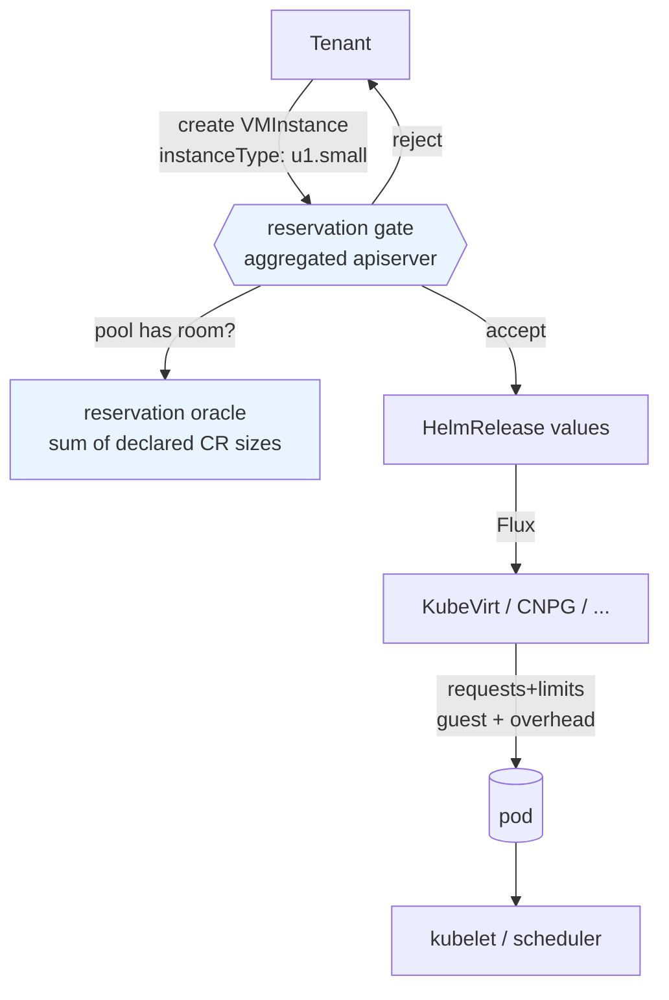

# Tenant quotas as reservation limits

- **Title:** `Tenant quotas as reservation limits`
- **Author(s):** `@mattia-eleuteri`
- **Date:** `2026-08-03`
- **Status:** Review

## Overview

A tenant quota is declared in instance-type units (`cpu: 8`, `memory: 16Gi`, the same units the tenant buys and the dashboard shows) but enforced in pod units, because the numbers are ultimately compared against `ResourceQuota.status.used`, which counts the requests and limits of virt-launcher and application pods. Those two scales do not match. A `u1.small` VM (1 vCPU / 4Gi guest) produces a virt-launcher pod that requests the guest memory **plus** KubeVirt's virtualization overhead, so a tenant whose 16Gi quota is fully allocated to declared VMs cannot start the last one. The gap is additive per VM, not proportional to the amount reserved, which is why the `--tenant-quota-buffer-percent` knob added alongside hierarchical quotas cannot be set correctly: the buffer a tenant needs ranges from roughly +6% to +183% depending only on how finely it slices its VMs.

This proposal makes **reservation** the accounting authority. A tenant's consumption becomes the sum of the sizes declared in its `apps.cozystack.io` custom resources, evaluated at admission in the aggregated apiserver, using a declarative `spec.reservation` block carried by each `ApplicationDefinition`. The hierarchical pool machinery introduced in `internal/controller/tenantquota` is kept as-is; only its usage oracle changes. The per-pod **operational** limit is unaffected: it is already set by each operator from the same instance type, and tenants cannot bypass it because they have no `create` verb on pods.

## Scope and related proposals

This proposal touches the `ApplicationDefinition` shape and the tenant contract, so it intersects several in-flight designs. In every case the interaction is composition rather than conflict, but the ordering matters.

- **[Out-of-tree app catalogs](https://github.com/cozystack/community/pull/43)** proposes splitting the managed-application catalog out of the core repository. This turns the "declarative, not Go" choice in [§2](#2-specreservation-on-applicationdefinition) from a preference into a requirement: a cost function implemented as a `switch` over kinds inside the aggregated apiserver cannot describe an application whose package lives in another repository. Reservation has to travel with the package.
- **[Fold `extra` into `apps`](https://github.com/cozystack/community/pull/39)** makes tenant modules regular applications and moves their distinguishing traits into declarative capabilities on `ApplicationDefinition`. It sets the precedent this proposal follows, per-kind behavior expressed as data on the definition rather than as a directory or a code branch, and it resolves one of the [open questions](#open-questions) below: once `monitoring`, `ingress`, `etcd` and `seaweedfs` are applications, they carry their own `reservation` block and are charged like any other application, instead of being special-cased from the Tenant's boolean flags.
- **`proposal/application-definition-versioning`** (branch on this repository, by `@kvaps`, not yet a PR) splits `ApplicationDefinition` into per-version `ApplicationSchema` objects and converts tenant-supplied values into a single **storage version** before persisting them into the HelmRelease. The two compose cleanly: reservation is evaluated against the storage form, so an application declares its reservation **once**, against the storage version, and served versions inherit it through the existing conversion. If that proposal lands first, `spec.reservation` moves to the storage-version `ApplicationSchema` with no change in semantics.
- **[Public IPs as a first-class resource](https://github.com/cozystack/community/pull/35)** would make a public address a `PublicIPClaim` rather than an implicit consequence of `external: true`. The `objects:` block in [§2](#2-specreservation-on-applicationdefinition) is the interim form: when addresses become claimable objects, `services.loadbalancers` counting should follow the claims instead of the boolean.
- **[`kubernetes-nodes-split`](../kubernetes-nodes-split/README.md)** (Accepted) is the one whose ordering matters most here. Phase 1 has landed on `main`: `KubernetesNodes` is already a registered application kind with its own `ApplicationDefinition` (`packages/system/kubernetes-nodes-rd/cozyrds/kubernetes-nodes.yaml`), carrying `minReplicas`, `maxReplicas`, `instanceType`, `resources` and `diskSize` at the top level of its values. Phase 2 ([cozystack/cozystack#3315](https://github.com/cozystack/cozystack/pull/3315), open, breaking) removes `spec.nodeGroups` from the `Kubernetes` CR and, with it, the implicit `md0` default. This proposal is markedly simpler on the far side of that change: worker-pool reservation becomes a flat block on `KubernetesNodes`, and the one awkward case in [§2](#2-specreservation-on-applicationdefinition) disappears entirely. Landing #3315 before phase 4 of the [rollout](#rollout) is preferable but not required.
- **[Database Horizontal Autoscaler](../database-horizontal-autoscaling/README.md)** lists "honor tenant quotas" as a goal and applies its decisions by patching the `Application`'s `replicas` value. This proposal defines what honoring the quota means on that path: an autoscaler scale-up is an `Update` through the same admission gate as a human edit and is rejected when the pool has no room. That is a behavioral requirement for DHA, not an optional integration.
- Any new application kind, such as the one in [`compute-plane`](../compute-plane/README.md), needs a `reservation` block to participate in quotas. By design that is a data change in the package.
- **Deferred to separate work:** the root cause of `ResourceQuota.status.used` going stale (a kube-controller-manager behavior, see [The problem](#the-problem)), drift alerting, and a remediation runbook for already-affected namespaces. This proposal removes that counter from the tenant-facing contract; it does not fix it.

## Context

A tenant declares `resourceQuotas` as a flat map of shorthand keys:

```yaml
apiVersion: apps.cozystack.io/v1alpha1
kind: Tenant
metadata: { name: acme }
spec:
  resourceQuotas:
    cpu: 8
    memory: 16Gi
    storage: 500Gi
    services.loadbalancers: "2"
```

`packages/apps/tenant/templates/quota.yaml` renders that map into a `ResourceQuota` named `tenant-quota`, plus a `LimitRange` named `tenant-range-limits`. Both objects sit under the **same** `{{- if .Values.resourceQuotas }}` guard, so a tenant with no quota also gets no default container requests.

The expansion is done by `cozy-lib.resources.flatten` → `cozy-lib.resources.sanitize` (`packages/library/cozy-lib/templates/_resources.tpl`), which applies the cluster's allocation ratios (`packages/core/platform/values.yaml`: cpu 10, memory 1, ephemeral-storage 40). The example above becomes:

```yaml
spec:
  hard:
    limits.cpu: "8"
    requests.cpu: "0.8"
    limits.memory: 16Gi
    requests.memory: "17179869184"
    requests.storage: 500Gi
    services.loadbalancers: "2"
```

Hierarchical quotas were added in v1.6.0 (`internal/controller/tenantquota`, adapted from OpenShift's `ClusterResourceQuota`). A tenant's quota is the budget for its whole sub-tree: a child that declares its own quota carves a fixed slice out of the parent's budget, a child that declares none shares the parent's remaining pool. The implementation has two halves:

- A **declaration-time gate** in the aggregated apiserver, `validateTenantResourceQuotas` in `pkg/registry/apps/application/quota.go`, called from `REST.Create` and `REST.Update`. It rejects a child whose declared quota exceeds the parent's remaining budget.
- A **runtime reconciler**, `internal/controller/tenantquota/reconciler.go`, which computes pools (`ComputePools`) and writes one controller-owned `ResourceQuota` named `tenant-quota-allocated` per member namespace, clamping each member to its share (`EnforcedHard`). Kubernetes applies the most restrictive quota in a namespace, so this binds without the controller fighting Flux over the chart-owned object.

Two properties of that code matter here, and they point in opposite directions.

**The declaration gate already speaks the reservation vocabulary.** `parseDeclaredQuotas` keeps the shorthand keys verbatim, and its doc comment is explicit:

> The quota keys are kept verbatim as the operator writes them (e.g. "cpu", "memory", "requests.storage", "count/services") — the same vocabulary the parent and every child use — so they can be compared directly. The `cozy-lib.resources.flatten` expansion into limits.\*/requests.\* is a downstream rendering concern of the tenant chart and is intentionally not applied here.

So parent/child arithmetic is already reservation arithmetic. Nothing about ratios or overhead enters it.

**Pod units enter at exactly one place: the usage oracle.** Both halves need to know what a pool currently consumes, and both read it from `ResourceQuota.status.used`:

- `parentPoolUsage` (`quota.go`) lists ResourceQuotas in each pool-member namespace and sums `status.used`.
- `snapshot` (`reconciler.go`) does the same to build `usedByNS`.
- `renderedLimitKey` (`quota.go`) exists solely to bridge the two vocabularies, mapping shorthand `memory` to the rendered `limits.memory` so that `status.used` can be read. Its doc notes the mapping is "allocation-ratio independent", which is true: ratios are multiplicative and cancel on the limit side. Overhead is additive and does not cancel.

On the KubeVirt side, `packages/apps/vm-instance` sizes a VM by `instanceType`, resolved against a `VirtualMachineClusterInstancetype` (the chart `lookup`s it in `templates/vm.yaml` and fails when it does not exist); `packages/system/kubevirt-instancetypes` ships the standard series. `packages/system/kubevirt/templates/kubevirt-cr.yaml` enables the `AutoResourceLimitsGate` feature gate, which makes virt-controller set limits on the launcher pod when the namespace carries a quota constraining `limits.*`.

Finally, the reason the operational limit needs no quota to be safe: `packages/system/cozystack-basics/templates/clusterroles.yaml` grants `cozy:tenant:admin` only `delete` on `pods`, never `create`, and no access to HelmReleases at all. Every workload a tenant can create is created through `apps.cozystack.io`, from values validated against the kind's OpenAPI schema, and sized by the operator from the declared instance type. A tenant cannot produce a pod larger than what it declared.

### The problem

> "My tenant quota says 16Gi, my VMs add up to 16Gi, and the last one will not start. The namespace has no pods in it at all."

Two distinct failures, one root cause: the quota is compared against a number that describes pods rather than reservations.

**1. Additive virtualization overhead makes a correctly-sized quota unusable.** A virt-launcher pod requests the guest memory plus KubeVirt's computed overhead, which is a function of guest memory, vCPU count and attached devices: roughly 468Mi for a small single-vCPU guest, and larger with more vCPUs or devices. It is not a percentage of the guest. Because the tenant quota is set on the guest-side numbers the tenant was sold, any tenant that allocates its full quota is unable to start its workloads. Observed on tenant `fdmp` (2026-07-15), where `resourceQuotas.memory` had been set to exactly the guest RAM.

`--tenant-quota-buffer-percent` (`cmd/cozystack-controller/main.go`, applied by `ScaleResourceList`) inflates every pool budget by a fixed percentage to keep pre-existing workloads admissible. It cannot be set correctly, because the required inflation depends on VM granularity rather than on volume. For a 16Gi memory quota, taking ~468Mi of overhead per launcher:

| Tenant shape | Actual launcher demand | Buffer required |
|---|---|---|
| 2 VMs of 8Gi | 17320Mi | +6% |
| 16 VMs of 1Gi | 23872Mi | +46% |
| 64 VMs of 256Mi | 46336Mi | +183% |

Any single value is simultaneously too tight for tenants running many small VMs, which stay blocked, and too generous for tenants running few large ones, to whom real capacity is given away. The knob is not mistuned; it is the wrong shape for the error it corrects.

**2. The pod counter goes stale, and now it does so on the admission path.** `ResourceQuota.status.used` is maintained by the kube-controller-manager quota controller and can drift permanently: deleted pods stay counted, with no recomputation. Observed repeatedly (`tenant-commoswiss-infra` 2026-08-03, `tenant-datalab` 2026-06-30, `tenant-matthieu-test` 2026-06-08). In the most recent case a namespace containing **no pods at all** reported `limits.memory: 13092Mi`, exactly 3 × 4364Mi, three ghost virt-launchers, with the last controller recomputation dated five days earlier. The tenant's real quota (16Gi) was ample; a client VM sat in `CrashLoopBackOff` for twenty minutes, and because `RerunOnFailure` applies an exponential backoff to admission failures, it did not recover on its own once the counter was reset.

Before v1.6.0 the damage was bounded to workloads in the affected namespace. Now that `parentPoolUsage` reads the same counter from the admission path, a stale counter in **any** member namespace of a pool inflates the pool's apparent usage and can forbid the creation of a legitimate sub-tenant, with an error message that blames the parent's remaining quota. A platform-level bug in a leaf namespace has become an onboarding failure.

There is also a diagnostic cost. The admission message names the quota, which points operators at "raise the quota", a workaround that over-allocates real capacity and hides the drift instead of surfacing it.

## Goals

- Adding an application consumes exactly the resources declared in its custom resource: a VM of instance type `u1.small` charges 1 CPU and 4Gi against the tenant's quota, whatever KubeVirt's launcher requests.
- A tenant whose declared workloads sum to exactly its quota can start all of them.
- Quota accounting reads no `ResourceQuota.status.used` anywhere, so counter drift cannot deny a tenant request.
- Admission rejects a create or update that would exceed the pool budget, for **every** `apps.cozystack.io` kind, on both `Create` and `Update`, charging only the delta on update.
- Hierarchical pool semantics, meaning carve-outs, unbounded children sharing an ancestor's pool and overcommit reporting, are preserved unchanged; the existing `pool_test.go` assertions keep passing untouched.
- A new application kind participates in quotas by shipping a `spec.reservation` block, with no Go change in the aggregated apiserver and no rebuild required for out-of-tree kinds.
- `--tenant-quota-buffer-percent` is no longer needed for a correctly-sized tenant to work, and is deprecated.
- Each pool reports `reserved` against `budget`, so operators can see headroom without inspecting quota objects.

### Non-goals

- Fixing the kube-controller-manager counter staleness, or alerting on it. Both remain worth doing; neither is required for this design.
- Usage-based quotas. Nothing here measures actual CPU or memory consumption, and nothing should: a reservation limit is a commercial contract, not a runtime governor.
- Evicting or resizing already-admitted workloads when a quota is lowered. Overcommit is reported, never enforced retroactively, matching today's behavior.
- Node-level capacity planning. Virtualization overhead remains real and must still be provisioned; this proposal moves it out of the tenant's quota and into platform capacity planning, where it is a property of the fleet rather than of a contract.
- Replacing the `LimitRange` or the per-pod requests and limits each operator sets. Those are the operational limit and they stay exactly as they are.

## Design

### 1. Two limits, two owners

The design rests on separating two things that the current implementation conflates.

The **reservation limit** answers "how much has this tenant been granted, and how much has it claimed?" It is denominated in instance-type units, computed from declared custom resources, and enforced at admission by the aggregated apiserver.

The **operational limit** answers "how much can this pod actually use?" It is denominated in pod requests and limits, derived from the same instance type by each operator, and enforced by the kubelet and the scheduler.



The left column is the tenant contract and only ever sees declared sizes. The right column is physical enforcement and legitimately sees overhead. The two never need to agree numerically, and the current design's central mistake is requiring them to.

This split is only sound because a tenant cannot write the right column. As noted in [Context](#context), `cozy:tenant:admin` has no `create` on pods and no access to HelmReleases; the operator derives pod sizing from the declared instance type. The reservation is therefore not an honor-system estimate of what the tenant will consume, it is a structural bound on it.

### 2. `spec.reservation` on `ApplicationDefinition`

Each application declares how to read its own size, next to the `openAPISchema` the definition already carries. The apiserver contains no per-kind knowledge.

This is the same move [PR #39](https://github.com/cozystack/community/pull/39) makes for visibility, cardinality and sharing: behavior that varies per kind becomes data on the definition rather than a branch in Go. It is also what [PR #43](https://github.com/cozystack/community/pull/43) forces, since an out-of-tree catalog cannot ship a patch to the aggregated apiserver.

```go
// api/v1alpha1/applicationdefinitions_types.go

type ApplicationDefinitionSpec struct {
    Application ApplicationDefinitionApplication `json:"application"`
    Release     ApplicationDefinitionRelease    `json:"release"`
    // Reservation declares how much this application charges against its
    // tenant's quota, read from the application's own values. Absent means the
    // kind reserves nothing.
    // +optional
    Reservation *ApplicationDefinitionReservation `json:"reservation,omitempty"`
    // ... existing fields
}

type ApplicationDefinitionReservation struct {
    // Items are compute/storage reservations, summed.
    // +optional
    Items []ReservationItem `json:"items,omitempty"`
    // Objects are object-count reservations, keyed by ResourceQuota object-count
    // name (e.g. "services.loadbalancers").
    // +optional
    Objects map[string]ReservationObject `json:"objects,omitempty"`
}

type ReservationItem struct {
    // ForEach iterates a list- or map-valued values path; every other path in
    // this item is then resolved relative to each element (map values are
    // iterated, keys are ignored). Its only in-tree consumer is the parent
    // kubernetes chart's nodeGroups map, which is transitional: once
    // cozystack/cozystack#3315 lands, pools are KubernetesNodes resources and
    // nothing in tree needs iteration. Kept because a kind with repeated sized
    // sub-objects is a shape worth supporting, but droppable if it stays unused.
    // +optional
    ForEach string `json:"forEach,omitempty"`

    // Count is a fixed multiplier (default 1) applied to both the compute and
    // the storage of this item. CountFrom reads it from an integer-valued
    // values path. At most one may be set.
    // +optional
    Count *int32 `json:"count,omitempty"`
    // +optional
    CountFrom string `json:"countFrom,omitempty"`

    // InstanceTypeFrom names a values path holding a
    // VirtualMachineClusterInstancetype name, resolved from the cluster.
    // PresetFrom names a values path holding a cozy-lib resource preset name.
    // At most one may be set.
    // +optional
    InstanceTypeFrom string `json:"instanceTypeFrom,omitempty"`
    // +optional
    PresetFrom string `json:"presetFrom,omitempty"`

    // ResourcesFrom names a values path holding an explicit {cpu, memory}
    // object. When both cpu and memory are set there it takes precedence over
    // the resolved instance type or preset. This mirrors what the charts already
    // document: kubernetes' nodeGroups[].resources says that when both are set
    // "they take precedence and instanceType is ignored for that node group
    // (the instancetype is omitted from the VM, since KubeVirt cannot override
    // an instancetype's CPU/memory)".
    // +optional
    ResourcesFrom string `json:"resourcesFrom,omitempty"`

    // StorageFrom names a values path holding a storage quantity, charged
    // against the "storage" quota key.
    // +optional
    StorageFrom string `json:"storageFrom,omitempty"`
}

type ReservationObject struct {
    // +optional
    Count *int32 `json:"count,omitempty"`
    // +optional
    CountFrom string `json:"countFrom,omitempty"`
    // WhenTrue makes the count conditional on a boolean values path.
    // +optional
    WhenTrue string `json:"whenTrue,omitempty"`
}
```

Applied to the shipped kinds:

```yaml
# packages/system/vm-instance-rd/cozyrds/vm-instance.yaml
spec:
  reservation:
    items:
      - instanceTypeFrom: instanceType
        resourcesFrom: resources
    objects:
      services.loadbalancers:
        count: 1
        whenTrue: external
```

```yaml
# packages/system/vm-disk-rd/cozyrds/vm-disk.yaml
spec:
  reservation:
    items:
      - storageFrom: storage
```

```yaml
# packages/system/postgres-rd/cozyrds/postgres.yaml
spec:
  reservation:
    items:
      - countFrom: replicas
        presetFrom: resourcesPreset
        resourcesFrom: resources
        storageFrom: size
```

```yaml
# packages/system/kubernetes-nodes-rd/cozyrds/kubernetes-nodes.yaml
# A worker pool is already its own kind on main (kubernetes-nodes-split
# phase 1), so its reservation is flat: no iteration, no chart-computed
# default. count multiplies both the compute and the storage of the item.
spec:
  reservation:
    items:
      - countFrom: maxReplicas
        instanceTypeFrom: instanceType
        resourcesFrom: resources
        storageFrom: diskSize
```

```yaml
# packages/system/kubernetes-rd/cozyrds/kubernetes.yaml
spec:
  reservation:
    items:
      - presetFrom: controlPlane.apiServer.resourcesPreset
        resourcesFrom: controlPlane.apiServer.resources
      - presetFrom: controlPlane.controllerManager.resourcesPreset
        resourcesFrom: controlPlane.controllerManager.resources
      - presetFrom: controlPlane.scheduler.resourcesPreset
        resourcesFrom: controlPlane.scheduler.resources
      - presetFrom: controlPlane.konnectivity.server.resourcesPreset
        resourcesFrom: controlPlane.konnectivity.server.resources
      # Transitional: worker pools still owned by the parent chart until
      # cozystack/cozystack#3315 removes spec.nodeGroups. Drops out then.
      - forEach: nodeGroups
        countFrom: maxReplicas
        instanceTypeFrom: instanceType
        resourcesFrom: resources
        storageFrom: diskSize
```

A kind without a `reservation` block reserves nothing, which keeps the change additive and lets the rollout proceed package by package.

**Where a values path is not enough, and why that is temporary.** The evaluator reads values, so a workload a chart synthesizes without mentioning it in the values is invisible to it. Exactly one such case exists in tree, and it is on its way out.

On `main` today, `kubernetes.nodeGroups` (`packages/apps/kubernetes/templates/_helpers.tpl`) emits a default `md0` pool with `maxReplicas: 10` whenever `.Values.nodeGroups` is empty. [cozystack/cozystack#2936](https://github.com/cozystack/cozystack/pull/2936) made that default *removable*, so it now applies only when no pool is declared and migration 47 pins it explicitly on existing clusters, but it is still emitted for a cluster that declares none. A literal read of `nodeGroups` therefore charges nothing for a cluster that can autoscale to ten workers, which is an under-charge and so a quota hole.

Two ways to close it. The narrow one is to resolve the named chart helper rather than the raw path for this single kind, which works but puts a slice of chart logic into the reservation contract. The better one is to let [`kubernetes-nodes-split`](#scope-and-related-proposals) close it: [#3315](https://github.com/cozystack/cozystack/pull/3315) removes `spec.nodeGroups` and the implicit `md0` with it, and worker pools become `KubernetesNodes` resources whose sizing sits at the top level of their own values, with nothing implicit left to resolve.

This proposal therefore does **not** introduce a general escape hatch. It keeps the evaluator a pure function of stored values, treats the `md0` default as a transitional exception covered by the per-kind unit test, and prefers ordering phase 4 of the [rollout](#rollout) after #3315 so the exception is never written. If #3315 slips, the narrow helper resolution is the fallback, scoped to one kind and one path.

The general principle is worth stating for future kinds: a chart that defaults a *sized* field in a template rather than in its values makes itself unquotable. Materializing such defaults into the values is the pattern to follow.

### 3. Resolving instance types and presets

Two size vocabularies exist and are resolved differently.

**KubeVirt instance types** are cluster objects. The resolver reads `VirtualMachineClusterInstancetype` from the API and takes `spec.cpu.guest` and `spec.memory.guest`. This covers instance types an operator adds beyond `packages/system/kubevirt-instancetypes`, and it needs no table in Go.

**cozy-lib resource presets** are a Helm-only table in `packages/library/cozy-lib/templates/_resourcepresets.tpl` (the `t1`/`c1`/`s1`/`u1`/`m1` series). Go cannot read a `.tpl`, and the aggregated apiserver does not ship the chart. This proposal ports the table into `pkg/reservation` and adds a parity test that parses `_resourcepresets.tpl` at test time and fails when the two diverge, so the chart remains the human-facing source and drift is a build failure rather than a silent quota error. An alternative, exporting the table as a ConfigMap from the platform chart, is discussed in [Alternatives](#alternatives-considered) and left as an open question.

Neither resolution applies allocation ratios and neither adds virtualization overhead. That is the whole point: the reservation is the guest-side number.

### 4. Reservation as the usage oracle

`pkg/reservation` exposes three pieces, split so that the pure arithmetic is testable without a cluster:

```go
// Resolver turns a size name into a resource list.
type Resolver interface {
    InstanceType(ctx context.Context, name string) (corev1.ResourceList, error)
    Preset(name string) (corev1.ResourceList, error)
}

// Evaluate applies a kind's reservation spec to one application's values.
// Pure apart from Resolver; no client, no cluster state.
func Evaluate(
    ctx context.Context,
    spec *v1alpha1.ApplicationDefinitionReservation,
    values map[string]any,
    r Resolver,
) (corev1.ResourceList, error)

// Aggregator sums the reservations of every application in a set of namespaces.
type Aggregator interface {
    ForNamespaces(ctx context.Context, namespaces []string) (map[string]corev1.ResourceList, error)
}
```

The two call sites change source, not shape:

| Call site | Today | After |
|---|---|---|
| `quota.go` `parentPoolUsage` | lists `ResourceQuota` per member namespace, sums `status.used`, keys via `renderedLimitKey` | lists HelmReleases per member namespace, evaluates each, sums in shorthand keys |
| `reconciler.go` `snapshot` | lists all `ResourceQuota`, builds `usedByNS` from `status.used` | builds `usedByNS` from the aggregator |

`renderedLimitKey` and its `rawQuotaKeys` companion are deleted: with both sides in shorthand there is nothing to bridge.

This also removes uncached reads from the admission path. `parentPoolUsage` today deliberately uses the direct watch client `r.w` for ResourceQuotas, with the comment that the aggregated apiserver "must not spin up a cluster-wide ResourceQuota informer just for admission". HelmReleases already have an informer, since `siblingDeclaredQuotas` uses the cached client `r.c` for them, so the new oracle reads from cache where the old one could not.

### 5. Generalizing the gate to every kind

`validateTenantResourceQuotas` returns early unless `r.kindName` is `Tenant`. It becomes two checks:

1. **Quota declaration** (Tenant only, unchanged): a child's declared quota may not exceed the parent's remaining budget.
2. **Reservation** (every kind): the reservation this write introduces, plus the pool's current reservation, may not exceed the pool's available budget.

On `Update` only the delta is charged, computed as `Evaluate(new) − Evaluate(old)`, so a no-op edit to an application already over its pool's budget is not rejected, and shrinking is always allowed. Both run inside the existing `Create`/`Update` handlers, before `createValidation`, alongside the current name and internal-key validation.

The error names the pool and the size that was requested, so the message points at the reservation rather than at an opaque quota:

```
Forbidden: spec.instanceType: reserving u1.large (4 CPU, 16Gi memory) would
exceed the remaining "memory" budget of tenant pool "tenant-acme": 12Gi
allowed, 6Gi already reserved by 3 applications, 10Gi requested
```

### 6. What the controller becomes

Feeding `usedByNS` in instance-type units while `EnforcedHard` still writes a `ResourceQuota` enforced against pods would reintroduce the same unit mismatch one level up: the clamp would be computed from reservations and applied to launcher requests. So the controller must stop being an enforcement point.

It can. Once the gate covers every kind, pool sharing between unbounded siblings is already enforced at admission, because every application create in every member namespace is checked against the pool's reservation. `EnforcedHard`, `upsertAllocatedQuota`, `gcAllocatedQuotas` and the `tenant-quota-allocated` object become redundant and are removed.

The controller becomes an observer. It publishes `reserved` against `budget` per pool, and keeps reporting `Overcommitted`, the one case no admission check can prevent, since it arises when a parent lowers its quota after children have already carved out slices.

During the flag-gated coexistence period `EnforcedHard` stays in place so the legacy path is not left without a runtime net; its removal is the last rollout step.

### 7. The `ResourceQuota` becomes a capacity guard

The chart-rendered `tenant-quota` is kept, deliberately loose, for two reasons that have nothing to do with the tenant contract:

- The `LimitRange` providing default container requests is rendered under the same `if .Values.resourceQuotas` guard. Dropping the quota would drop the defaults.
- `AutoResourceLimitsGate` only sets limits on virt-launcher pods when the namespace has a quota constraining `limits.*`. Dropping the quota would silently change the QoS class of every VM on the platform.

It cannot be made exact. An exact overhead allowance requires knowing how many VMs the tenant runs, and the quota is rendered by a Helm chart that does not know. A second quota object cannot compensate either, because Kubernetes applies the **most restrictive** quota in a namespace: an additional object can only tighten, never loosen.

So the guard is rendered from `resourceQuotas` multiplied by a wide, platform-configurable factor, and documented as a guard rather than a contract. Its imprecision is the point: it exists to stop an unbounded runaway and to keep `AutoResourceLimitsGate` armed, not to decide what a tenant may claim.

The inflation factor therefore changes role rather than disappearing. It moves from "the tenant contract must be falsified", where no value is correct, to "the guard is deliberately slack", where imprecision is the desired property. That requalification is what makes `--tenant-quota-buffer-percent` obsolete, not its literal deletion.

## User-facing changes

- `tenant.spec.resourceQuotas` keeps its shape and its meaning. It becomes exact: `memory: 16Gi` means 16Gi of guest memory, and a tenant can use all of it.
- Non-Tenant kinds gain admission errors they did not have. Previously an over-quota application was accepted and failed later as a rejected pod, surfacing as a `CrashLoopBackOff` or an unschedulable workload. Now the request is refused at the moment it is made, naming the pool and the size. This is a diagnostic improvement, but it is a new rejection surface for clients and tooling.
- **Autoscaled worker pools reserve at `maxReplicas`.** A `KubernetesNodes` pool with `maxReplicas: 10` reserves ten workers even while running zero. This is the conservative choice for capacity, and it is a visible change for tenants who set wide autoscaling bounds. See [Open questions](#open-questions).
- **Halted VMs still reserve.** A `runStrategy: Halted` VM consumes its quota, because reservation is not usage. This is intentional and central to the model, and it differs from today, where a stopped VM frees its quota.
- Tenant modules enabled by flag (`monitoring`, `ingress`, `etcd`, `seaweedfs`) reserve their components' sizes.
- Each pool reports `reserved` and `budget`, exposed for the dashboard and for billing.
- `ApplicationDefinition` gains `spec.reservation`, which matters to anyone shipping custom application kinds.

## Upgrade and rollback compatibility

The semantic change is opt-in, behind a flag on both `cozystack-api` and `cozystack-controller`. With the flag off, both oracles are compiled in and the legacy one is used, so behavior is bit-identical; the existing pool tests are the guard for that.

The upgrade has one consequence that no migration can handle automatically. Operators who inflated a tenant's quota to work around the overhead, which is the documented workaround for the failure in [The problem](#the-problem), will find that inflation is now usable reservation, so those tenants gain real capacity. A migration cannot tell which part of a declared quota was headroom and which was the intended contract. This is therefore documented rather than automated, and the `reserved`/`budget` reporting is introduced in the same release so the gap is visible before the flag is flipped.

In the other direction, reserving autoscaled worker pools at `maxReplicas` can make a write that used to succeed fail. Clusters with wide autoscaling bounds should check pool headroom before enabling the flag.

Rollback is turning the flag off, for every step except the last: retiring `tenant-quota-allocated` is irreversible in the sense that the objects are deleted, and it is deliberately sequenced after the flag has been on across a release.

## Security

- **No new tenant-supplied input.** The reservation is computed from values that already pass the kind's OpenAPI schema. Tenants gain no new field.
- **`spec.reservation` is platform-authored.** It lives on a cluster-scoped `ApplicationDefinition`, which tenants cannot write.
- **A missing or wrong reservation block under-charges a tenant**, which is a quota-escalation vector: an application kind that reserves nothing is free. This is the main new risk. It is mitigated by a completeness test asserting that every in-tree application kind has a `reservation` block, gating each rollout step, and by the fact that an absent block is a visible `0` in the pool's `reserved` report rather than a silent pass.
- **The gate must fail closed on the object being written.** Today `siblingDeclaredQuotas` deliberately skips siblings whose values do not parse, with a warning, so that "a malformed sibling must not block an unrelated tenant write". That fail-open choice is right for a sibling and wrong for the object under admission: applied to reservation it would make an unparseable custom resource free. The proposed behavior is to reject when the object being written cannot be evaluated, and to warn plus set a pool condition when another object cannot be, so the under-count is surfaced instead of hidden.
- **RBAC surface is unchanged.** The gate reads HelmReleases with the apiserver's existing service account, as it already does for siblings and pool usage.

## Failure and edge cases

- Application kind with no `reservation` block → reserves nothing; the completeness test prevents this shipping for in-tree kinds.
- `instanceType` names a `VirtualMachineClusterInstancetype` that does not exist → rejected at admission with the resolver's error, instead of later by the chart's `lookup` failure in `templates/vm.yaml`.
- Both `instanceType` and `resources` set → the evaluator charges `resources`, matching the precedence the `kubernetes` chart documents on `nodeGroups[].resources`. Note that `packages/apps/vm-instance` does not currently omit the instancetype in that case the way the `kubernetes` chart does, so the rendered `VirtualMachine` carries both and KubeVirt cannot reconcile them; tightening that chart is out of scope here but worth a separate fix, and the reservation charges the same number either way.
- Explicit `resources` with no `instanceType` → charged from `resources`, matching `virtual-machine.domainResources` in `packages/apps/vm-instance/templates/_helpers.tpl`.
- **`nodeGroups: {}` on a `kubernetes` application, while the parent chart still owns pools** → the chart emits a default `md0` group with `maxReplicas: 10`, so a literal read charges nothing for a cluster that can autoscale to ten workers. Covered by the per-kind unit test and resolved for good by [#3315](https://github.com/cozystack/cozystack/pull/3315); see [§2](#2-specreservation-on-applicationdefinition).
- **A `KubernetesNodes` pool whose name collides with a `nodeGroup` still owned by the parent** → the render already fails on ownership conflict, as its own schema documents. Reservation would have charged the pool twice, once per owner, so failing early is the correct outcome and no special case is needed.
- Concurrent creates in different member namespaces of one pool → both may pass, overshooting by at most one application. The controller reports the overshoot; nothing is evicted.
- Parent lowers its quota below existing carve-outs → `Overcommitted` reports it, as today. No retroactive enforcement.
- `vm-disk` resized upward → the `Update` path charges the delta; a downward resize releases it.
- Autoscaler (DHA or cluster-autoscaler) raises `replicas` past the pool budget → the `Update` is rejected and the autoscaler surfaces the failure, rather than the scale-up silently failing at pod admission.
- Unparseable values on the object being written → rejected. On another object in the pool → warned, pool condition set, count proceeds without it.
- Tenant with no declared quota → unbounded, draws from its nearest bounded ancestor's pool, unchanged from today.

## Testing

- **Unit, evaluator per kind:** table-driven over each package's `values.yaml` defaults and its `examples/`, asserting the exact `ResourceList` for every in-tree kind. This is where per-kind correctness is pinned.
- **Unit, preset parity:** parse `packages/library/cozy-lib/templates/_resourcepresets.tpl` and assert the Go table matches entry for entry, failing on any divergence including the deprecated flat aliases.
- **Unit, pool arithmetic:** the existing `internal/controller/tenantquota` tests must pass unmodified. Any diff there means pool semantics changed, which is out of scope.
- **Unit, delta charging:** `Update` from `u1.small` to `u1.large` charges the difference; an unrelated edit charges nothing; a shrink is always accepted.
- **Integration, admission boundary:** a pool with 8Gi accepts a 4Gi VM twice and rejects the third; the rejection names the pool and the instance type.
- **Integration, fail-closed:** an application whose values do not evaluate is rejected, and one sibling that does not evaluate does not block an unrelated write.
- **e2e, the regression this proposal exists for:** a tenant whose memory quota exactly equals the sum of its VMs' guest memory starts every one of them. This fails today by construction.
- **e2e, flag off:** behavior identical to the previous release, including the buffer percent path.

## Rollout

| Phase | Contents | Flag |
|---|---|---|
| 1 | `pkg/reservation` (resolver, evaluator, aggregator, preset table, parity test), no consumer | n/a |
| 2 | `spec.reservation` on `ApplicationDefinition`; blocks for the IaaS kinds (`vm-instance`, `vm-disk`, `kubernetes`, `kubernetes-nodes`), which carry the whole overhead problem | n/a |
| 3 | Usage oracle switchable; gate generalized to kinds that have a block; `reserved`/`budget` reporting | off by default |
| 4 | Remaining kinds, package by package, until the completeness test covers all of them | on by default |
| 5 | Guard requalified (loose factor), `EnforcedHard` / `tenant-quota-allocated` removed, `--tenant-quota-buffer-percent` deprecated, flag removed | removed |

Phases 1 to 3 form a self-contained, testable increment and are what implementation would start with. Phase 5 is only defensible once phase 4 is complete: removing the runtime net presupposes that every kind reserves.

## Open questions

- **`maxReplicas` or `minReplicas` for an autoscaled `KubernetesNodes` pool?** Reserving the maximum is safe for capacity but charges idle tenants for headroom they may never use, and it can reject writes that succeed today. Reserving the minimum matches billing intuition but lets a pool be oversubscribed by autoscaling, which pushes the failure back to pod admission, exactly what this proposal removes. A third option is to reserve the minimum and let the write that raises the count be the gate; that works for a human edit and for the [DHA](#scope-and-related-proposals), which both go through `Update`, but not for the cluster-autoscaler, which scales the live MachineDeployment without touching the CR. That asymmetry is the strongest argument for reserving the maximum.
- **Should tenant module flags reserve?** This proposal says yes, since those components consume real capacity and the tenant asked for them. It does change the effective consumption of existing tenants at flag-flip time. [PR #39](https://github.com/cozystack/community/pull/39) makes this question disappear by turning the modules into applications with their own reservation blocks; if #39 lands first, the special case is never written.
- **Where should the preset table live?** In Go with a parity test, as proposed, or exported as a ConfigMap by the platform chart so there is literally one copy. The ConfigMap adds a read dependency to the admission path; the Go table adds a test-enforced duplicate.
- **Is a deliberately loose guard quota acceptable?** The alternative is to drop it and wire the `LimitRange` and `AutoResourceLimitsGate` independently of `resourceQuotas`, which is cleaner but changes virt-launcher QoS and needs its own migration.
- **Should `storage` be charged from the declared `vm-disk` size or from the resulting PVC request?** They can differ when a chart rounds or adds a WAL volume.
- **Should charts be required to materialize sized defaults into their values?** This proposal keeps the evaluator a pure function of stored values and relies on [#3315](https://github.com/cozystack/cozystack/pull/3315) to retire the one in-tree exception. Making that a rule for all future kinds would prevent the class of hole rather than the instance, and it would equally help [`application-definition-versioning`](#scope-and-related-proposals), whose conversion is likewise a function of values.

## Alternatives considered

**Accounting basis.**
Keep pod-level accounting and compute an exact overhead allowance per pool, instead of a global percentage. This fixes the additive-overhead arithmetic and is a much smaller change, but it keeps `status.used` on the admission path, so the stale-counter failure mode and the onboarding blockage survive. It also makes the tenant's commercial contract depend on virt-launcher internals, which change between KubeVirt releases. Rejected for that coupling more than for its size.
Keep the global buffer percentage (status quo). Rejected: the required buffer varies by a factor of thirty with VM granularity, as tabulated in [The problem](#the-problem).

**Location of the cost function.**
A Go `switch` over kinds in the aggregated apiserver. Rejected: every new application kind requires an apiserver change, and out-of-tree kinds cannot participate at all.
Render the chart at admission and sum the resulting pod specs. Rejected: it needs a chart fetch and a full template render in the request path, and it yields overhead-laden numbers, reintroducing the problem this proposal removes.
A `ValidatingAdmissionPolicy` in CEL. Rejected: CEL cannot aggregate across objects, so the pool's current reservation would have to be published into a resource for the policy to read, which is strictly more machinery than evaluating it directly.

**Preset table.**
Exported as a ConfigMap by the platform chart, keeping exactly one copy of the table. Not rejected; recorded as an open question above.

**An existing quota engine: KubeVirt's Application Aware Quota.**
[AAQ](https://github.com/kubevirt/application-aware-quota) attacks the same overhead symptom and was raised in review by @Barakmor1. Its `vmiCalcConfigName: VirtualResources` mode prices a launcher by the guest size declared on the `VirtualMachineInstance` rather than by the pod's requests, and its `overhead_calculator` reads the KubeVirt CR instead of hardcoding a figure that moves between releases. On that axis it is strictly better than `--tenant-quota-buffer-percent`, and if additive overhead were the only failure described here, adopting it would beat writing anything new.

It cannot carry the tenant contract, for three reasons its extension mechanism does not reach. The accounting unit is the pod: `AaqEvaluator.GroupResource()`, `Handles` and `Matches` all delegate to the upstream pod evaluator, and the sidecar interface is `PodUsageFunc(podToEvaluate *corev1.Pod, existingPods []*corev1.Pod)`. A sidecar can therefore price a pod from the custom resource that owns it, as the built-in `VirtLauncherCalculator` already does through the VMI informer, and a Cozystack sidecar reading `spec.reservation` would be a legitimate implementation of the cost function. But there is no entry point for "a custom resource was created", so nothing charges a workload whose pods do not exist yet. A stopped VM would cost nothing, which is the opposite of a reservation.

Only schedulable resources reach that evaluation in the first place. `FilterNonScheduableResources` retains `pods`, `cpu`, `memory` and `ephemeral-storage` with their `requests.`/`limits.` forms, and the rq-controller strips everything else, `requests.storage` explicitly included, into a managed native `ResourceQuota`. A tenant's `storage` and `services.loadbalancers` would keep being counted from `status.used`, leaving that part of the quota on exactly the failure mode described in [The problem](#the-problem).

Finally, `ApplicationAwareClusterResourceQuota` selects namespaces by label or annotation, flat, so carve-outs and children sharing an ancestor's pool cannot be expressed. Off OpenShift its managed counterpart is OpenShift's own `ClusterResourceQuota`, which upstream documents as created only on that distribution, so non-schedulable resources have no cluster-scoped enforcement path there at all.

Rejected as a replacement, recorded as complementary. AAQ enforces with a scheduling gate and an event on the pod, where this design rejects the tenant's own create, which is the shape the sub-tenant declaration gate already requires. The two govern different limits in the sense of [Two limits, two owners](#1-two-limits-two-owners): should the platform later want the operational side made exact rather than merely safe, AAQ's overhead calculator is the reference to use, and nothing here forecloses it.

**Enforcement point.**
Keep `EnforcedHard` and the allocated quota alongside reservation accounting. Rejected: it computes a clamp from reservations and applies it to pod requests, mixing the two units one level above where they are mixed today.
A transactional reservation counter with optimistic concurrency, eliminating the concurrent-create overshoot. Rejected as unnecessary: once operational safety no longer depends on the counter, an overshoot bounded by one application is harmless, and it is the same trade-off the OpenShift reconciler this design descends from already accepts.
