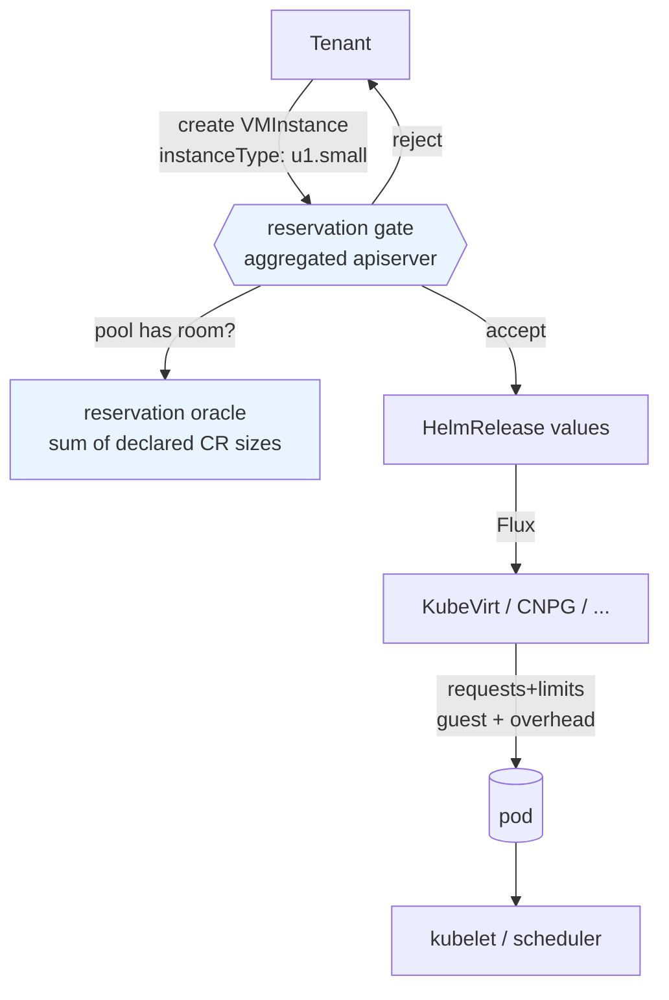

# Tenant quotas as reservation limits

- **Title:** `Tenant quotas as reservation limits`
- **Author(s):** `@mattia-eleuteri`
- **Date:** `2026-08-03`
- **Status:** Review

## Overview

A tenant quota is declared in instance-type units (`cpu: 8`, `memory: 16Gi`, the same units the tenant buys and the dashboard shows) but enforced in pod units, because the numbers are ultimately compared against `ResourceQuota.status.used`, which counts the requests and limits of virt-launcher and application pods. Those two scales do not match. A `u1.small` VM (1 vCPU / 4Gi guest) produces a virt-launcher pod that requests the guest memory **plus** KubeVirt's virtualization overhead, so a tenant whose 16Gi quota is fully allocated to declared VMs cannot start the last one. The gap is additive per VM, not proportional to the amount reserved, which is why the `--tenant-quota-buffer-percent` knob added alongside hierarchical quotas cannot be set correctly: the buffer a tenant needs ranges from roughly +6% to +183% depending only on how finely it slices its VMs.

There is a second and more basic problem behind the reported symptom: no quota gate stands in front of an ordinary application order at all. `validateTenantResourceQuotas` runs only for the `Tenant` kind, so creating a VM is checked against nothing until pod admission refuses it, minutes and several layers later.

This proposal makes **reservation** the accounting authority. A tenant's consumption becomes the sum of the sizes declared in its `apps.cozystack.io` custom resources, evaluated at admission in the aggregated apiserver, using a declarative `spec.reservation` block carried by each `ApplicationDefinition`, and the gate is generalized to every kind so that an over-quota order is refused when it is made. The hierarchical pool arithmetic in `internal/controller/tenantquota` is kept exactly as it is — `ComputePools`, carve-outs, shared pools, overcommit reporting — and what changes is the vocabulary it is fed: both the usage it counts and the budget it counts against move from rendered pod-unit `ResourceQuota` objects to declared values. The per-pod **operational** limit is unaffected: it is already set by each operator from the same instance type, and tenants cannot bypass it because they have no `create` verb on pods.

## Scope and related proposals

This proposal touches the `ApplicationDefinition` shape and the tenant contract, so it intersects several in-flight designs. In every case the interaction is composition rather than conflict, but the ordering matters.

- **[Out-of-tree app catalogs](https://github.com/cozystack/community/pull/43)** proposes splitting the managed-application catalog out of the core repository. This turns the "declarative, not Go" choice in [§2](#2-specreservation-on-applicationdefinition) from a preference into a requirement: a cost function implemented as a `switch` over kinds inside the aggregated apiserver cannot describe an application whose package lives in another repository. Reservation has to travel with the package.
- **[Fold `extra` into `apps`](https://github.com/cozystack/community/pull/39)** makes tenant modules regular applications and moves their distinguishing traits into declarative capabilities on `ApplicationDefinition`. It sets the precedent this proposal follows, per-kind behavior expressed as data on the definition rather than as a directory or a code branch, and it resolves one of the [open questions](#open-questions) below: once `monitoring`, `ingress`, `etcd` and `seaweedfs` are applications, they carry their own `reservation` block and are charged like any other application, instead of being special-cased from the Tenant's boolean flags.
- **`proposal/application-definition-versioning`** (branch on this repository, by `@kvaps`, not yet a PR) splits `ApplicationDefinition` into per-version `ApplicationSchema` objects and converts tenant-supplied values into a single **storage version** before persisting them into the HelmRelease. The two compose cleanly: reservation is evaluated against the storage form, so an application declares its reservation **once**, against the storage version, and served versions inherit it through the existing conversion. If that proposal lands first, `spec.reservation` moves to the storage-version `ApplicationSchema` with no change in semantics.
- **[Public IPs as a first-class resource](https://github.com/cozystack/community/pull/35)** would make a public address a `PublicIPClaim` rather than an implicit consequence of `external: true`. The `objects:` block in [§2](#2-specreservation-on-applicationdefinition) is the interim form: when addresses become claimable objects, `services.loadbalancers` counting should follow the claims instead of the boolean.
- **[`kubernetes-nodes-split`](../kubernetes-nodes-split/README.md)** (Accepted) has now landed in full. Phase 1 made `KubernetesNodes` a registered application kind with its own `ApplicationDefinition` (`packages/system/kubernetes-nodes-rd/cozyrds/kubernetes-nodes.yaml`), carrying `minReplicas`, `maxReplicas`, `instanceType`, `resources` and `diskSize` at the top level of its values. Phase 2 ([cozystack/cozystack#3315](https://github.com/cozystack/cozystack/pull/3315)) merged on 2026-08-26 and removed `spec.nodeGroups` from the `Kubernetes` CR, together with the implicit `md0` default. Worker-pool reservation is therefore a flat block on `KubernetesNodes` with nothing transitional about it, and no iteration over a parent's map is needed. The implicit default pool it retired did not disappear from the platform, though: it moved into the ComputePlane module, which is discussed in [§2](#2-specreservation-on-applicationdefinition).
- **[Database Horizontal Autoscaler](../database-horizontal-autoscaling/README.md)** (Accepted) does **not** pass through this gate, and an earlier revision of this proposal said it did. The accepted DHA design is entirely stock: the application chart renders a KEDA `ScaledObject` whose `scaleTargetRef` is the CNPG `Cluster`, KEDA's managed HPA drives that CR's `scale` subresource, and the chart writes `spec.instances` as a **constant seed** — `max(replicas, effectiveMin)` — that the autoscaler never writes back to (`packages/apps/postgres/templates/scaledobject.yaml`, `templates/db.yaml`, `templates/_autoscaling.tpl`). The `Application`'s `replicas` value is untouched by any scaling decision, so no `Update` ever reaches admission. This is the same asymmetry this proposal already identifies for the cluster-autoscaler on worker pools, and it takes the same answer: **when `autoscaling.enabled` is set, the reservation is `autoscaling.maxReplicas`, not `replicas`.** See [§2](#2-specreservation-on-applicationdefinition) for the `ReservationItem` shape that requires.

  DHA also needs a matching amendment. Its §4 states that "quota is not re-implemented: the HPA scales the engine CR and pod creation passes through the tenant `ResourceQuota` admission, so an over-quota scale-up simply fails to create pods". Once the namespace `ResourceQuota` stops being the tenant contract ([§7](#7-retiring-the-namespace-resourcequota)) that sentence is no longer true, and the `Pending`-independent quota alert it asks the implementation to add ([cozystack/cozystack#3954](https://github.com/cozystack/cozystack/pull/3954)) loses the signal it was keyed on. Reserving the ceiling is what replaces it: the capacity is charged when autoscaling is enabled, so the scale-up cannot be refused at all.
- Any new application kind, such as the one in [`compute-plane`](../compute-plane/README.md), needs a `reservation` block to participate in quotas. By design that is a data change in the package.
- **Deferred to separate work:** the root cause of `ResourceQuota.status.used` going stale (a kube-controller-manager behavior, see [The problem](#the-problem)), drift alerting, and a remediation runbook for already-affected namespaces. This proposal removes that counter from the tenant-facing contract; it does not fix it.

## Context

A tenant declares `resourceQuotas` as a flat map of shorthand keys:

```yaml
apiVersion: apps.cozystack.io/v1alpha1
kind: Tenant
metadata: { name: acme }
spec:
  resourceQuotas:
    cpu: 8
    memory: 16Gi
    storage: 500Gi
    services.loadbalancers: "2"
```

`packages/apps/tenant/templates/quota.yaml` renders that map into a `ResourceQuota` named `tenant-quota`, plus a `LimitRange` named `tenant-range-limits`. Both objects sit under the **same** `{{- if .Values.resourceQuotas }}` guard, so a tenant with no quota also gets no default container requests.

The expansion is done by `cozy-lib.resources.flatten` → `cozy-lib.resources.sanitize` (`packages/library/cozy-lib/templates/_resources.tpl`), which applies the cluster's allocation ratios (`packages/core/platform/values.yaml`: cpu 10, memory 1, ephemeral-storage 40). The example above becomes:

```yaml
spec:
  hard:
    limits.cpu: "8"
    requests.cpu: "0.8"
    limits.memory: 16Gi
    requests.memory: "17179869184"
    requests.storage: 500Gi
    services.loadbalancers: "2"
```

Hierarchical quotas were added in v1.6.0 (`internal/controller/tenantquota`, adapted from OpenShift's `ClusterResourceQuota`). A tenant's quota is the budget for its whole sub-tree: a child that declares its own quota carves a fixed slice out of the parent's budget, a child that declares none shares the parent's remaining pool. The implementation has two halves:

- A **declaration-time gate** in the aggregated apiserver, `validateTenantResourceQuotas` in `pkg/registry/apps/application/quota.go`, called from `REST.Create` and `REST.Update`. It rejects a child whose declared quota exceeds the parent's remaining budget.
- A **runtime reconciler**, `internal/controller/tenantquota/reconciler.go`, which computes pools (`ComputePools`) and writes one controller-owned `ResourceQuota` named `tenant-quota-allocated` per member namespace, clamping each member to its share (`EnforcedHard`). Kubernetes applies the most restrictive quota in a namespace, so this binds without the controller fighting Flux over the chart-owned object.

Two properties of that code matter here, and they point in opposite directions.

**The declaration gate already speaks the reservation vocabulary.** `parseDeclaredQuotas` keeps the shorthand keys verbatim, and its doc comment is explicit:

> The quota keys are kept verbatim as the operator writes them (e.g. "cpu", "memory", "requests.storage", "count/services") — the same vocabulary the parent and every child use — so they can be compared directly. The `cozy-lib.resources.flatten` expansion into limits.\*/requests.\* is a downstream rendering concern of the tenant chart and is intentionally not applied here.

So parent/child arithmetic is already reservation arithmetic. Nothing about ratios or overhead enters it.

**Pod units enter at exactly one place: the usage oracle.** Both halves need to know what a pool currently consumes, and both read it from `ResourceQuota.status.used`:

- `parentPoolUsage` (`quota.go`) lists ResourceQuotas in each pool-member namespace and sums `status.used`.
- `snapshot` (`reconciler.go`) does the same to build `usedByNS`.
- `renderedLimitKey` (`quota.go`) exists solely to bridge the two vocabularies, mapping shorthand `memory` to the rendered `limits.memory` so that `status.used` can be read. Its doc notes the mapping is "allocation-ratio independent", which is true: ratios are multiplicative and cancel on the limit side. Overhead is additive and does not cancel.

On the KubeVirt side, `packages/apps/vm-instance` sizes a VM by `instanceType`, resolved against a `VirtualMachineClusterInstancetype` (the chart `lookup`s it in `templates/vm.yaml` and fails when it does not exist); `packages/system/kubevirt-instancetypes` ships the standard series. `packages/system/kubevirt/templates/kubevirt-cr.yaml` enables the `AutoResourceLimitsGate` feature gate, which makes virt-controller set limits on the launcher pod when the namespace carries a quota constraining `limits.*`.

Finally, the reason the operational limit needs no quota to be safe: `packages/system/cozystack-basics/templates/clusterroles.yaml` grants `cozy:tenant:admin` only `delete` on `pods`, never `create`, and no access to HelmReleases at all. Every workload a tenant can create is created through `apps.cozystack.io`, from values validated against the kind's OpenAPI schema, and sized by the operator from the declared instance type. A tenant cannot produce a pod larger than what it declared.

### The problem

> "My tenant quota says 16Gi, my VMs add up to 16Gi, and the last one will not start. The namespace has no pods in it at all."

Three failures. The first is the one that decides where the wall stands: there is no quota gate in front of an ordinary application at all. The other two are consequences of the quota being compared against a number that describes pods rather than reservations.

**0. Nothing checks an application against a quota when it is ordered.** `validateTenantResourceQuotas` (`pkg/registry/apps/application/quota.go`) returns immediately unless `r.kindName` is `Tenant`, and its only call site in `REST.Create` sits inside `if r.kindName == "Tenant"`. Creating a `VMInstance`, a `Postgres` or a `KubernetesNodes` pool is therefore checked against no quota whatsoever; the first thing that says no is pod admission, several layers and several minutes later. Everything below decides *where* that wall stands — the overhead decides how far short of the declared figure it is, the stale counter can move it arbitrarily — but the missing gate is why it stands *behind* the order rather than in front of it. [§5](#5-generalizing-the-gate-to-every-kind) closes this, and it is the part of this proposal with the largest effect on what a tenant actually experiences: phases 1 to 3 alone turn a `CrashLoopBackOff` twenty minutes later into a refusal at the moment of the order, naming the pool and the size.

**1. Additive virtualization overhead makes a correctly-sized quota unusable.** A virt-launcher pod requests the guest memory plus KubeVirt's computed overhead, which is a function of guest memory, vCPU count and attached devices: roughly 468Mi for a small single-vCPU guest, and larger with more vCPUs or devices. It is not a percentage of the guest. Because the tenant quota is set on the guest-side numbers the tenant was sold, any tenant that allocates its full quota is unable to start its workloads. Observed on tenant `fdmp` (2026-07-15), where `resourceQuotas.memory` had been set to exactly the guest RAM.

`--tenant-quota-buffer-percent` (`cmd/cozystack-controller/main.go`, applied by `ScaleResourceList`) inflates every pool budget by a fixed percentage to keep pre-existing workloads admissible. It cannot be set correctly, because the required inflation depends on VM granularity rather than on volume. For a 16Gi memory quota, taking ~468Mi of overhead per launcher:

| Tenant shape | Actual launcher demand | Buffer required |
|---|---|---|
| 2 VMs of 8Gi | 17320Mi | +6% |
| 16 VMs of 1Gi | 23872Mi | +46% |
| 64 VMs of 256Mi | 46336Mi | +183% |

Any single value is simultaneously too tight for tenants running many small VMs, which stay blocked, and too generous for tenants running few large ones, to whom real capacity is given away. The knob is not mistuned; it is the wrong shape for the error it corrects.

And it never reached the case above. `BufferPercent` scales only `p.Available` on its way into `EnforcedHard`, which is to say only the controller-written `tenant-quota-allocated` clamp, and `Reconcile` skips any pool with no carve-outs and at most one member namespace (`if len(p.CarvedOut) == 0 && len(p.Members) <= 1 { continue }`). A lone tenant with a quota and no sub-tenants is bound purely by the chart-rendered `tenant-quota`, which the flag never touches. So the flag is not merely the wrong shape for the error; on the single-tenant namespace where the error was reported it does not apply at all. That is why phase 5 **deletes** it rather than deprecating it: there is no configuration of it that a tenant depends on.

**2. The pod counter goes stale, and now it does so on the admission path.** `ResourceQuota.status.used` is maintained by the kube-controller-manager quota controller and can drift permanently: deleted pods stay counted, with no recomputation. Observed repeatedly (`tenant-commoswiss-infra` 2026-08-03, `tenant-datalab` 2026-06-30, `tenant-matthieu-test` 2026-06-08). In the most recent case a namespace containing **no pods at all** reported `limits.memory: 13092Mi`, exactly 3 × 4364Mi, three ghost virt-launchers, with the last controller recomputation dated five days earlier. The tenant's real quota (16Gi) was ample; a client VM sat in `CrashLoopBackOff` for twenty minutes, and because `RerunOnFailure` applies an exponential backoff to admission failures, it did not recover on its own once the counter was reset.

Before v1.6.0 the damage was bounded to workloads in the affected namespace. Now that `parentPoolUsage` reads the same counter from the admission path, a stale counter in **any** member namespace of a pool inflates the pool's apparent usage and can forbid the creation of a legitimate sub-tenant, with an error message that blames the parent's remaining quota. A platform-level bug in a leaf namespace has become an onboarding failure.

There is also a diagnostic cost. The admission message names the quota, which points operators at "raise the quota", a workaround that over-allocates real capacity and hides the drift instead of surfacing it.

## Goals

- Adding an application consumes exactly the resources declared in its custom resource: a VM of instance type `u1.small` charges 1 CPU and 4Gi against the tenant's quota, whatever KubeVirt's launcher requests.
- A tenant whose declared workloads sum to exactly its quota can start all of them.
- Quota accounting reads no `ResourceQuota.status.used` anywhere, so counter drift cannot deny a tenant request.
- Admission rejects a create or update that would exceed the pool budget, for **every** `apps.cozystack.io` kind, on both `Create` and `Update`, charging only the delta on update.
- Hierarchical pool semantics, meaning carve-outs, unbounded children sharing an ancestor's pool and overcommit reporting, are preserved unchanged; the existing `pool_test.go` assertions keep passing untouched.
- A new application kind participates in quotas by shipping a `spec.reservation` block, with no Go change in the aggregated apiserver and no rebuild required for out-of-tree kinds.
- `--tenant-quota-buffer-percent` is no longer needed for a correctly-sized tenant to work, and is deleted.
- Each pool reports `reserved` against `budget` **on an API object** — the `Tenant` application's status — so the dashboard, billing and anything provisioning tenants can read headroom before ordering, rather than inferring it from quota objects or from events.

### Non-goals

- Fixing the kube-controller-manager counter staleness, or alerting on it. Both remain worth doing; neither is required for this design.
- Usage-based quotas. Nothing here measures actual CPU or memory consumption, and nothing should: a reservation limit is a commercial contract, not a runtime governor.
- Evicting or resizing already-admitted workloads when a quota is lowered. Overcommit is reported, never enforced retroactively, matching today's behavior.
- Node-level capacity planning. Virtualization overhead remains real and must still be provisioned; this proposal moves it out of the tenant's quota and into platform capacity planning, where it is a property of the fleet rather than of a contract.
- Replacing the per-pod requests and limits each operator sets. Those are the operational limit and they stay exactly as they are. The `LimitRange` also stays, but it stops being conditional on `resourceQuotas` — see [§7](#7-retiring-the-namespace-resourcequota).

## Design

### 1. Two limits, two owners

The design rests on separating two things that the current implementation conflates.

The **reservation limit** answers "how much has this tenant been granted, and how much has it claimed?" It is denominated in instance-type units, computed from declared custom resources, and enforced at admission by the aggregated apiserver.

The **operational limit** answers "how much can this pod actually use?" It is denominated in pod requests and limits, derived from the same instance type by each operator, and enforced by the kubelet and the scheduler.



The left column is the tenant contract and only ever sees declared sizes. The right column is physical enforcement and legitimately sees overhead. The two never need to agree numerically, and the current design's central mistake is requiring them to.

This split is only sound because a tenant cannot write the right column. As noted in [Context](#context), `cozy:tenant:admin` has no `create` on pods and no access to HelmReleases; the operator derives pod sizing from the declared instance type. The reservation is therefore not an honor-system estimate of what the tenant will consume, it is a structural bound on it.

### 2. `spec.reservation` on `ApplicationDefinition`

Each application declares how to read its own size, next to the `openAPISchema` the definition already carries. The apiserver contains no per-kind knowledge.

This is the same move [PR #39](https://github.com/cozystack/community/pull/39) makes for visibility, cardinality and sharing: behavior that varies per kind becomes data on the definition rather than a branch in Go. It is also what [PR #43](https://github.com/cozystack/community/pull/43) forces, since an out-of-tree catalog cannot ship a patch to the aggregated apiserver.

```go
// api/v1alpha1/applicationdefinitions_types.go

type ApplicationDefinitionSpec struct {
    Application ApplicationDefinitionApplication `json:"application"`
    Release     ApplicationDefinitionRelease    `json:"release"`
    // Reservation declares how much this application charges against its
    // tenant's quota, read from the application's own values. Absent means the
    // kind reserves nothing.
    // +optional
    Reservation *ApplicationDefinitionReservation `json:"reservation,omitempty"`
    // ... existing fields
}

type ApplicationDefinitionReservation struct {
    // Items are compute/storage reservations, summed.
    // +optional
    Items []ReservationItem `json:"items,omitempty"`
    // Objects are object-count reservations, keyed by ResourceQuota object-count
    // name (e.g. "services.loadbalancers").
    // +optional
    Objects map[string]ReservationObject `json:"objects,omitempty"`
}

type ReservationItem struct {
    // Count is the multiplier applied to both the compute and the storage of
    // this item. Absent means 1.
    // +optional
    Count *ReservationCount `json:"count,omitempty"`

    // InstanceTypeFrom names a values path holding a
    // VirtualMachineClusterInstancetype name, resolved from the cluster.
    // PresetFrom names a values path holding a cozy-lib resource preset name.
    // At most one may be set.
    // +optional
    InstanceTypeFrom string `json:"instanceTypeFrom,omitempty"`
    // +optional
    PresetFrom string `json:"presetFrom,omitempty"`

    // ResourcesFrom names a values path holding an explicit sizing object that,
    // when complete, takes precedence over the resolved instance type or preset.
    // What "complete" means and how the object's fields combine into a vCPU
    // count is NOT the same for every kind — see §3 — so ResourcesShape names
    // which of the platform's sizing shapes this path carries.
    // +optional
    ResourcesFrom string `json:"resourcesFrom,omitempty"`
    // ResourcesShape is one of "cpuMemory" (kubernetes-nodes: {cpu, memory},
    // complete when both are set) or "cpuSocketsMemory" (vm-instance:
    // {cpu, sockets, memory}, where the guest has cpu × sockets vCPUs and the
    // block is complete only when all three are set). Required with
    // ResourcesFrom.
    // +optional
    ResourcesShape string `json:"resourcesShape,omitempty"`

    // StorageFrom names a values path holding a storage quantity, charged
    // against the "storage" quota key.
    // +optional
    StorageFrom string `json:"storageFrom,omitempty"`
}

// ReservationCount resolves to a non-negative integer. It is a small recursive
// expression rather than a single path because two in-tree shapes need more
// than one: a replica count that is a product of two values (clickhouse's
// shards × replicas), and a count whose real ceiling is an autoscaler bound
// that only applies when autoscaling is on.
type ReservationCount struct {
    // Value is a literal. From reads an integer from a values path. Product
    // multiplies its members. Max takes the largest of its members. Exactly one
    // may be set.
    // +optional
    Value *int32 `json:"value,omitempty"`
    // +optional
    From string `json:"from,omitempty"`
    // +optional
    Product []ReservationCount `json:"product,omitempty"`
    // +optional
    Max []ReservationCount `json:"max,omitempty"`

    // When gates this count on a boolean values path: when it is false the
    // count resolves to zero. Inside Max that is how a conditional ceiling is
    // written — an autoscaling bound that only counts while autoscaling is on.
    // +optional
    When string `json:"when,omitempty"`
}

type ReservationObject struct {
    // +optional
    Count *ReservationCount `json:"count,omitempty"`
}
```

Applied to the shipped kinds:

```yaml
# packages/system/vm-instance-rd/cozyrds/vm-instance.yaml
spec:
  reservation:
    items:
      - instanceTypeFrom: instanceType
        resourcesFrom: resources
        resourcesShape: cpuSocketsMemory
    objects:
      services.loadbalancers:
        count:
          value: 1
          when: external
```

```yaml
# packages/system/vm-disk-rd/cozyrds/vm-disk.yaml
spec:
  reservation:
    items:
      - storageFrom: storage
```

```yaml
# packages/system/postgres-rd/cozyrds/postgres.yaml
# The count is the ceiling, not the seed: under autoscaling KEDA's HPA drives
# the CNPG Cluster's scale subresource and never writes .replicas back, so a
# count read from .replicas would charge the seed while the cluster ran up to
# autoscaling.maxReplicas standbys. A `when`-gated member of max() contributes
# zero while autoscaling is off, so the resting case still charges .replicas.
spec:
  reservation:
    items:
      - count:
          max:
            - from: replicas
            - from: autoscaling.maxReplicas
              when: autoscaling.enabled
        presetFrom: resourcesPreset
        resourcesFrom: resources
        resourcesShape: cpuMemory
        storageFrom: size
```

```yaml
# packages/system/clickhouse-rd/cozyrds/clickhouse.yaml
# Server pods are shards × replicas, which is why count is an expression and
# not a path. The three keeper pods are charged separately because they are
# sized by their own preset; the backup sidecar is not charged — see the
# platform-overhead table below.
spec:
  reservation:
    items:
      - count:
          product:
            - from: shards
            - from: replicas
        presetFrom: resourcesPreset
        resourcesFrom: resources
        resourcesShape: cpuMemory
        storageFrom: size
      - count:
          from: clickhouseKeeper.replicas
        presetFrom: clickhouseKeeper.resourcesPreset
        resourcesFrom: clickhouseKeeper.resources
        resourcesShape: cpuMemory
```

```yaml
# packages/system/kubernetes-nodes-rd/cozyrds/kubernetes-nodes.yaml
# A worker pool is its own kind since kubernetes-nodes-split phase 2, so its
# reservation is flat: no iteration and nothing chart-computed. count
# multiplies both the compute and the storage of the item. maxReplicas, not
# minReplicas: the cluster-autoscaler scales the MachineDeployment without
# touching the CR, so no Update gate ever sees a scale-up.
spec:
  reservation:
    items:
      - count:
          from: maxReplicas
        instanceTypeFrom: instanceType
        resourcesFrom: resources
        resourcesShape: cpuMemory
        storageFrom: diskSize
```

```yaml
# packages/system/kubernetes-rd/cozyrds/kubernetes.yaml
# Control plane only. spec.nodeGroups no longer exists on this kind (#3315),
# so there is nothing to iterate and no implicit pool to miss.
spec:
  reservation:
    items:
      - presetFrom: controlPlane.apiServer.resourcesPreset
        resourcesFrom: controlPlane.apiServer.resources
        resourcesShape: cpuMemory
      - presetFrom: controlPlane.controllerManager.resourcesPreset
        resourcesFrom: controlPlane.controllerManager.resources
        resourcesShape: cpuMemory
      - presetFrom: controlPlane.scheduler.resourcesPreset
        resourcesFrom: controlPlane.scheduler.resources
        resourcesShape: cpuMemory
      - presetFrom: controlPlane.konnectivity.server.resourcesPreset
        resourcesFrom: controlPlane.konnectivity.server.resources
        resourcesShape: cpuMemory
```

A kind without a `reservation` block reserves nothing, which keeps the change additive and lets the rollout proceed package by package.

**The evaluator must default the values before it reads them.** This is a correctness precondition, not a detail. The aggregated apiserver applies the kind's structural-schema defaults on the **read** path only — `applySpecDefaults` is called from `ConvertHelmReleaseToApplicationWithMonitor`, and `REST.Create` stores the tenant's spec verbatim without defaulting it. The stored HelmRelease values therefore carry only the keys the tenant actually wrote. An evaluator that reads `hr.Spec.Values` raw would charge zero for `kubernetes-nodes.maxReplicas` (schema default 10) and resolve no instance type for `kubernetes-nodes.instanceType` (default `u1.medium`) on every pool created with defaults — a systematic under-charge far larger than any synthesized-workload hole. `Evaluate` must run against the defaulted form, and the object under admission must be defaulted before it is charged too, since the gate runs before conversion.

**What a values path still cannot see.** The evaluator reads values, so a workload a chart synthesizes at template time, without a values key naming it, is invisible to it. [#3315](https://github.com/cozystack/cozystack/pull/3315) closed the `kubernetes.nodeGroups` / implicit-`md0` instance of this, but the hole moved rather than closing: the ComputePlane module now materializes the same default `md0` pool itself at template time when `nodeGroups` is empty (`packages/extra/computeplane/templates/cluster.yaml`).

Its shape there is different, and better. ComputePlane renders each pool as its own `HelmRelease` labelled `apps.cozystack.io/application.kind: KubernetesNodes`, shaped exactly like a natively created pool. An aggregator that lists labelled HelmReleases therefore *sees* the default `md0` — it is not invisible. What it does not see is the pool's size, because the module writes only `{roles, minReplicas: 0}` into that release and the schema defaults that supply `maxReplicas: 10` and `instanceType: u1.medium` are never materialized into a Helm-rendered release. This is the same defaulting requirement as the paragraph above, which is why closing it closes both.

The rule stated for future kinds therefore stands, and ComputePlane is where it should be applied: a chart that defaults a *sized* field in a template rather than in its values makes itself unquotable. Materializing `md0`'s full shape into ComputePlane's values is the fix, and it is a data change in that one chart.

**What is deliberately not reserved.** An earlier revision of this text claimed exactly one values-invisible case existed in tree. That was wrong by a wide margin: sized workloads that no values path describes are the norm rather than the exception, and none of them are being added to the evaluator. What follows is therefore not a list of holes to close but the explicit statement of where the line is drawn — everything below is **platform overhead**, provisioned as fleet capacity in the same way virtualization overhead is, and not charged to the tenant.

| Kind | Not reserved | Why the line is here |
|---|---|---|
| `redis`, `valkey`, Harbor's redis | 3 sentinel pods, each sized with the **data preset** | Fixed operator topology, not a tenant-chosen shape. It is the largest single item in this table for a small database and the one most worth revisiting. |
| `clickhouse` | one backup sidecar per server pod | Sidecar, sized by the operator. |
| `mongodb` (sharded) | config servers, mongos | Topology the chart derives; no values key names the counts. |
| `kafka` | ZooKeeper pods, entity-operator pod | Same. |
| `kubernetes` | cluster-autoscaler, cloud-controller and 4-container CSI deployments (125m/128Mi per container), plus a `talos-csr-signer` sidecar in every control-plane pod | Platform-authored control-plane machinery with fixed requests, identical for every tenant cluster. |
| every managed database | operator-injected sidecars: CNPG's barman plugin, PSMDB's backup agent, NATS reloader and exporter, the FoundationDB sidecar | Injected by an operator after the CR is written; not derivable from values at all. |
| `etcd`, `monitoring` (tenant modules) | VPA headroom — `packages/extra/etcd/templates/vpa.yaml` may raise a member to 5 CPU / 8Gi; the six VPAs in `packages/system/monitoring/templates/vpa.yaml` reach 4 CPU / 8Gi per component | A VPA ceiling is a runtime recommendation, not a reservation. Charging the ceiling would charge every tenant for headroom none of them reach at once. |
| `foundationdb` | stateless process count | The chart's own value is `-1`, "operator decides". There is nothing to read. |

The consequence for testing is the important part. A completeness test asserting that every kind *has* a `reservation` block proves nothing about whether the block is *adequate*. [Testing](#testing) therefore replaces it with a test that compares the evaluator's output against the rendered pod requests for each kind's default values, so the size of the overhead in this table is a number in CI rather than a surprise in production.

### 3. Resolving instance types and presets

Three size vocabularies exist and are resolved differently.

#### KubeVirt instance types: scalars, keyed by class

The resolver reads `VirtualMachineClusterInstancetype` from the API and takes `spec.cpu.guest` and `spec.memory.guest`. It charges **scalars**, not one quota key per type: a per-type `count/<type>` key would remove the resolution step, but it would also turn "8 CPU spendable on any shape" into a basket the tenant has to commit to in advance, and it would take the hierarchical arithmetic and the dashboards out of fungible units. `objects:` could not express it as written either, since its key is a literal and this one would have to come from a field value.

But one `cpu` key cannot hold every core. A shared vCPU under the allocation ratio and a pinned core on a CPU-manager node are not the same good, and neither are ordinary memory, pre-reserved hugepages and overcommitted memory. So the scalars are **keyed by class**, and the class is derived from the instance type's own spec, never from its name, so an operator-added type classifies itself:

| Quota key | Derived from | Shipped types that land here |
|---|---|---|
| `cpu` | `spec.cpu.dedicatedCPUPlacement` unset or false | `u1`, `m1`, `o1` |
| `dedicated-cpu` | `spec.cpu.dedicatedCPUPlacement: true` | `d1`, `cx1`, `n1`, `rt1` |
| `memory` | no `spec.memory.hugepages`, no `overcommitPercent` | `u1`, `d1` |
| `hugepages-<size>` | `spec.memory.hugepages.pageSize` | `m1`, `cx1`, `n1`, `rt1` (2Mi and 1Gi variants of each) |
| `memory` (overcommitted) | `spec.memory.overcommitPercent` | `o1` |

Two notes on that table, because an earlier sketch of it got both wrong by classifying on the series name. Hugepages are **not** a `cx1` property: `m1` is a shared-CPU series that nonetheless requests hugepages, and `n1` is a fourth dedicated series alongside `d1`/`cx1`/`rt1`. And `o1` sets `overcommitPercent: 50`, which means its launcher requests half the guest memory — the only case on the platform where the pod request is *smaller* than the reservation. Charging the guest figure for it is still right (it is what the tenant bought), but it is a distinct class because a cluster cannot sell the same physical page as both `o1` memory and `u1` memory.

**What is charged is what is stable and enumerable on the instance type.** For a dedicated type with `isolateEmulatorThread: true` — which every shipped dedicated type sets — the resolver charges `guest + 1` dedicated cores, plus any supplemental I/O thread count, reading the even-parity annotation if one is ever set. The catalog then lists the type that way: `cx1.2xlarge` is eight guest vCPUs on nine pinned cores. What KubeVirt computes at *runtime*, namely the launcher memory overhead, stays platform margin — that is the entire point of this proposal on the memory side.

The asymmetry deserves naming rather than leaving for the next reviewer to find: cores charge their overhead and memory does not. The reason is that the emulator-thread core is a fixed, declared property of the instance type, knowable before anything runs, while the launcher's memory overhead is computed by virt-controller from guest memory, vCPU count and attached devices, and moves between KubeVirt releases. The first can live in a commercial contract; the second cannot.

**Catalog and charge must share one source.** Either `pkg/reservation` is the library the dashboard calls, or the instancetype chart writes the charged figures as labels on the object and the resolver reads them, falling back to spec-derived computation for operator-added types. Two independent renderings of "what does `cx1.2xlarge` cost" will diverge. Relatedly, instance types are **immutable by policy**: editing one silently changes every tenant's reserved sum with no write to any tenant's CR.

#### cozy-lib resource presets

These are a Helm-only table in `packages/library/cozy-lib/templates/_resourcepresets.tpl` (the `t1`/`c1`/`s1`/`u1`/`m1` series). Go cannot read a `.tpl`, and the aggregated apiserver does not ship the chart.

The earlier plan was a Go copy plus a parity test that parses the `.tpl` at test time. That is the kind of test that passes on a stray comment and fails on whitespace, so it is replaced: **one side is generated from the other** at build time, so divergence is impossible rather than detected. The `.tpl` stays the human-facing source and the Go table is generated from it.

Two details of that table:

- **Ephemeral storage is charged.** Every preset carries `ephemeral-storage: 2Gi`, and the tenant quota vocabulary already has an `ephemeral-storage` key with an allocation ratio of 40. It is charged like any other scalar.
- **The deprecated flat aliases are resolved, not rejected.** `nano`…`2xlarge` do not mean what their `t1.*` namesakes mean — `medium` is 1 CPU where `t1.medium` is 2 — and migration 39 converted the values that existed. But they are still live: `_resourcepresets.tpl` merges `$legacyAliases` into `$presets`, and every shipped kind's `values.schema.json` still enumerates them (`postgres`, `kubernetes`, `redis`, …). A resolver that rejected them would fail closed against a value the kind's own OpenAPI schema admits and the chart renders, which is a regression, not a tightening. So the resolver resolves them at their legacy figures and `warnLegacyPresets` keeps warning; rejecting them becomes correct only in the release that drops them from the enums.

#### Explicit `resources` blocks

`resourcesFrom` is where a single generic reading would silently under-charge, because the platform has **two different `resources` shapes** and they do not agree on what a CPU is:

- `kubernetes-nodes.resources` is `{cpu, memory}`, complete when both are set, and the chart rejects one without the other at render time.
- `vm-instance.resources` is `{cpu, sockets, memory}`, where `cpu` is *cores per socket*: the guest has `cpu × sockets` vCPUs. A block is complete only when all three are set, and `virtual-machine.domainResources` emits nothing at all from `cpu` alone.

Reading `resources.cpu` for a `vm-instance` would therefore under-charge by the socket factor — a `{cpu: 4, sockets: 2}` VM is 8 vCPUs charged as 4. Hence `resourcesShape` on the item: the evaluator computes `cpu × sockets` for `cpuSocketsMemory` and `cpu` for `cpuMemory`.

Precedence follows each chart exactly. For `kubernetes-nodes`, a complete block wins and the instancetype is omitted from the VM. For `vm-instance`, `virtual-machine.effectiveInstanceType` already does this on `main`: a block that supplies all three replaces the matcher, and a block that supplies *some* sizing next to an `instanceType` fails the render outright rather than rendering an ambiguous VM. The evaluator mirrors that: complete block → charge the block; no block → charge the type; partial block next to a type → the chart will refuse it, so the reservation never has to guess.

Neither resolution applies allocation ratios and neither adds virtualization overhead. That is the whole point: the reservation is the guest-side number.

### 4. Reservation as the usage oracle

`pkg/reservation` is a **standalone, importable package with stable key names**, not an internal detail of the apiserver. The same function is wanted outside admission — by the dashboard, by billing, and by whatever eventually replaces the pod-unit `Workload` records — and a package only the apiserver can call forecloses that.

```go
// Resolver turns a size name into a class-keyed resource list (see §3).
type Resolver interface {
    InstanceType(ctx context.Context, name string) (corev1.ResourceList, error)
    Preset(name string) (corev1.ResourceList, error)
}

// Definitions resolves an application to the reservation spec that prices it.
// Keyed by the application's kind and group, which is exactly what the
// ApplicationKindLabel/ApplicationGroupLabel pair on every HelmRelease carries,
// so an out-of-tree kind resolves through the same path as an in-tree one.
// Schema returns the structural schema used to default the values before they
// are read (see §2); Reservation is taken from the storage version, so a kind
// declares its reservation once and served versions inherit it through the
// existing conversion.
type Definitions interface {
    For(ctx context.Context, group, kind string) (
        res *v1alpha1.ApplicationDefinitionReservation,
        schema *structuralschema.Structural,
        err error,
    )
}

// Evaluate applies a kind's reservation spec to one application's values.
// values MUST already be defaulted against the kind's schema. Pure apart from
// Resolver: no client, no cluster state.
func Evaluate(
    ctx context.Context,
    spec *v1alpha1.ApplicationDefinitionReservation,
    values map[string]any,
    r Resolver,
) (corev1.ResourceList, error)

// Aggregator sums the reservations of every application in a set of namespaces.
// "Application" means a HelmRelease carrying the ApplicationKindLabel and
// ApplicationGroupLabel; an unlabelled namespace-scoped HelmRelease is not an
// application and is not summed. Note this deliberately includes releases a
// platform chart rendered with those labels — ComputePlane's per-pool
// KubernetesNodes releases are the in-tree case (see §2) — since those consume
// the tenant's capacity exactly as a natively created pool does.
type Aggregator interface {
    ForNamespaces(ctx context.Context, namespaces []string) (map[string]corev1.ResourceList, error)
}
```

Two properties of that contract are worth stating explicitly, because both have a wrong answer that looks right:

- **The HelmRelease *is* the stored application.** `REST.Create` converts the Application to a HelmRelease and that is the only persisted copy; there is no second record that is more authoritative. Reading labelled HelmReleases is therefore reading the committed state, not a rendered derivative — Flux lag affects when *pods* appear, never what was declared. What the read does need is the defaulting step of [§2](#2-specreservation-on-applicationdefinition), because the stored values are undefaulted.
- **Both sides must move, not just usage.** `snapshot` does not only read usage from `status.used`; it also takes each tenant's declared **budget** from the chart-rendered `tenant-quota` object's `spec.hard`, in rendered key space with allocation ratios already applied — its doc comment says so, and that was a deliberate choice to avoid replicating the chart's ratio math. If `reserved` is summed in shorthand units and `budget` is left where it is, the controller compares two vocabularies. So `Declared` has to be read from the tenant's own `resourceQuotas` values, which is what the admission gate already does through `declaredQuotasFromHelmRelease`.

The call sites change source, not shape:

| Call site | Today | After |
|---|---|---|
| `quota.go` `parentPoolUsage` | lists `ResourceQuota` per member namespace, sums `status.used`, keys via `renderedLimitKey` | lists labelled HelmReleases per member namespace, defaults and evaluates each, sums in shorthand keys |
| `reconciler.go` `snapshot` (usage) | lists all `ResourceQuota`, builds `usedByNS` from `status.used` | builds `usedByNS` from the aggregator |
| `reconciler.go` `snapshot` (budget) | reads `tenant-quota.spec.hard`, rendered keys, ratios applied | reads `resourceQuotas` from the tenant HelmRelease values, shorthand keys |

`renderedLimitKey` and its `rawQuotaKeys` companion are deleted: with both sides in shorthand there is nothing to bridge.

This also removes uncached reads from the admission path. `parentPoolUsage` today deliberately uses the direct watch client `r.w` for ResourceQuotas, with the comment that the aggregated apiserver "must not spin up a cluster-wide ResourceQuota informer just for admission". HelmReleases already have an informer, since `siblingDeclaredQuotas` uses the cached client `r.c` for them, so the new oracle reads from cache where the old one could not.

The test consequence follows from the budget change and should be stated rather than discovered: `pool_test.go` passes unmodified because that package is pure arithmetic over `Tenant{Declared, ...}`, but `reconciler_test.go` does not — it builds its fixtures from rendered `ResourceQuota` objects, and those fixtures move to tenant values.

### 5. Generalizing the gate to every kind

This is the part of the proposal that changes what a tenant experiences most, because today there is no gate here at all — see failure 0 in [The problem](#the-problem). `validateTenantResourceQuotas` returns early unless `r.kindName` is `Tenant`, and its call site is itself inside `if r.kindName == "Tenant"`. It becomes two checks, and the call site loses its guard:

1. **Quota declaration** (Tenant only, unchanged): a child's declared quota may not exceed the parent's remaining budget.
2. **Reservation** (every kind): the reservation this write introduces, plus the pool's current reservation, may not exceed the pool's available budget.

On `Update` only the delta is charged, computed as `Evaluate(new) − Evaluate(old)`, so a no-op edit to an application already over its pool's budget is not rejected, and shrinking is always allowed. Both run inside the existing `Create`/`Update` handlers, before `createValidation`, alongside the current name and internal-key validation.

The error names the pool and the size that was requested, so the message points at the reservation rather than at an opaque quota:

```
Forbidden: spec.instanceType: reserving u1.large (4 CPU, 16Gi memory) would
exceed the remaining "memory" budget of tenant pool "tenant-acme": 12Gi
allowed, 6Gi already reserved by 3 applications, 10Gi requested
```

**Refuse; never admit for later retry.** An over-quota create is rejected synchronously and is not admitted in any pending or queued form. Admit-and-retry would leave a HelmRelease that Flux keeps reconciling and pods that never start — which is the original failure moved up one level, not fixed. Retry semantics belong only to platform-originated writes, and for those the answer is to reserve the ceiling (§2, `count.max`) so the write never needs to fail in the first place.

**Missing reservation blocks fail closed.** A kind whose `ApplicationDefinition` carries no `spec.reservation` reserves nothing, which for an out-of-tree catalog is a quota-escalation vector that no in-tree completeness test can reach. So "absent" is not a valid state once the gate is on: a kind must carry either a reservation block or an explicit `reservation: {exempt: true}` marker, and a definition with neither is refused at admission for that kind with an error naming the definition. The exemption is a reviewed, visible declaration rather than an omission that silently costs nothing.

**Concurrency: the real bound, and what closes the common case.** The gate is a read-check-write with no transaction, reading HelmReleases from the informer cache (`r.c`). An earlier revision of this text claimed the overshoot was bounded by one application. It is not, and the mechanism is not exotic: a burst of *sequential* creates from a single client — a script, a Terraform apply, any provisioning flow — can all observe the pre-burst sum, because the cache has not caught up with the writes the same client just made. The overshoot is bounded by the number of writes that fit inside the cache lag, and an `Update` can carry a large delta on its own. Today the controller-written `tenant-quota-allocated` eventually clamps that; this proposal removes it.

Transactional admission is not being reintroduced — that trade is discussed in [Alternatives](#alternatives-considered) and the honest semantics are best-effort. But the common case is cheap to close and phase 3 closes it: **serialize the check per pool root inside the apiserver, and re-read after the write.** A per-pool-root mutex makes concurrent writes to one pool sequential within a process, and re-reading the pool's reservation after the write (rather than trusting the pre-write snapshot) removes the cache-lag window that lets a single client's own writes go unseen. What remains uncovered is genuinely concurrent writes to one pool across apiserver replicas, which is a much narrower window than the one described above. The residual overshoot is reported by the controller and is never evicted, exactly as an `Overcommitted` pool is today.

### 6. What the controller becomes

Feeding `usedByNS` in instance-type units while `EnforcedHard` still writes a `ResourceQuota` enforced against pods would reintroduce the same unit mismatch one level up: the clamp would be computed from reservations and applied to launcher requests. So the controller must stop being an enforcement point.

It can. Once the gate covers every kind, pool sharing between unbounded siblings is already enforced at admission, because every application create in every member namespace is checked against the pool's reservation. `EnforcedHard`, `upsertAllocatedQuota`, `gcAllocatedQuotas` and the `tenant-quota-allocated` object become redundant and are removed.

The controller becomes an observer. It publishes `reserved` against `budget` per pool, and keeps reporting `Overcommitted`, the one case no admission check can prevent, since it arises when a parent lowers its quota after children have already carved out slices.

**Where those numbers live.** Today `recordOvercommit` emits a Kubernetes `Event` on the namespace and nothing else, which nothing can read programmatically and which expires. `reserved` and `budget` are a **status on an API object**, and the natural home is the `Tenant` application's status: it is the object that owns the pool, it is already served by the aggregated API, and both the dashboard and anything provisioning tenants can then read a pool's headroom *before* ordering into it rather than discovering it in a rejection. `Overcommitted` becomes a condition there, with the event kept as a secondary signal.

**Coexistence is mutually exclusive, not additive.** During the flag-gated period `EnforcedHard` stays in place so the legacy path is not left without a runtime net — but only for the legacy path. Whenever the reservation oracle is active for a pool, the controller writes no `tenant-quota-allocated` object for that pool's members and garbage-collects any it previously wrote. The two must never be on together: `EnforcedHard` computed from reservations and applied as a pod-unit `ResourceQuota` clamp is precisely the unit mismatch this proposal exists to remove, reintroduced one level up.

### 7. Retiring the namespace `ResourceQuota`

An earlier revision kept the chart-rendered `tenant-quota`, inflated by a wide factor, as a "deliberately slack guard". It was kept for two reasons that have nothing to do with the tenant contract: the `LimitRange` providing default container requests sits under the same `{{- if .Values.resourceQuotas }}` guard, and `AutoResourceLimitsGate` only sets limits on virt-launcher pods when the namespace has a quota constraining `limits.*`.

Keeping it is the wrong answer, and the reason is structural rather than aesthetic. Once the gate covers every kind, **the only pods in a tenant namespace are platform-authored**: `cozy:tenant:admin:base` grants `delete` on pods and nothing else, no `create`, and no access to HelmReleases at all, so every pod in the namespace was put there by a chart or an operator. Platform-authored pods should be bounded by platform-authored ceilings — the presets and the VPA `maxAllowed` values that already exist — not by a per-tenant quota that happens to count them. Physical capacity is the scheduler's business; sellable capacity is the root tenant's budget, which the hierarchical arithmetic already forces every carve-out to sum to. The margin between those two is the platform's, and that is a cleaner statement of "overhead is capacity planning" than a slack factor on a quota object, which would leave a second, differently-denominated limit in the namespace for someone to trip over.

A loose guard is also not harmless. `tenant-quota` is a real `ResourceQuota` enforced against `status.used`, so it keeps the stale-counter failure mode of [The problem](#the-problem) alive in the namespace, just with more headroom before it bites — and it would contradict the goal that a tenant charged exactly to its quota can start everything it declared.

So **phase 5 deletes `tenant-quota`** and re-homes the two things that were riding on it:

- **The `LimitRange` renders unconditionally.** It is doing real work independently of any quota: several platform-authored workloads ship with no resources at all and rely on its defaults — the `mariadb` and `clickhouse` backup CronJobs, the `vm-disk` pre-install PVC-resize hook Job. Today a tenant with no `resourceQuotas` already gets no defaults for those, which is a pre-existing inconsistency this change also fixes.
- **Launcher limits are given up, deliberately.** With no quota constraining `limits.*` in the namespace, `AutoResourceLimitsGate` goes inert. On CPU this costs nothing: an 8 vCPU guest is eight QEMU threads and cannot exceed eight cores, and dedicated-CPU instance types already get requests equal to limits from KubeVirt for the CPU manager. What the gate actually adds is a **memory** limit on shared-CPU launchers, and losing it moves those pods from `Burstable`-with-a-limit to `Burstable`-without-one. That is an accepted trade, stated here rather than left implicit.

**One interaction must be tested on a dev cluster before phase 5 ships.** With the gate inert, a shared-CPU launcher arrives with a multi-gigabyte memory *request* and no limit. The `LimitRange`'s container `default.memory: 128Mi` would then be applied as that pod's limit, and pod validation rejects a limit below the request — so every shared-CPU VM in the namespace would fail admission. Today this can never happen, precisely because the quota and the `LimitRange` are under the same conditional and the gate is therefore always armed wherever the `LimitRange` exists. Unconditional rendering breaks that coupling. The `LimitRange` needs either a container default that does not apply to launchers, or no memory limit default at all; which of those is correct is an implementation decision for phase 5, but it is a blocking one.

This also removes the last reason to keep the inflation factor in any form, which is why [`--tenant-quota-buffer-percent`](#the-problem) is deleted in phase 5 rather than requalified.

## User-facing changes

- `tenant.spec.resourceQuotas` keeps its shape and its meaning. It becomes exact: `memory: 16Gi` means 16Gi of guest memory, and a tenant can use all of it.
- Non-Tenant kinds gain admission errors they did not have. Previously an over-quota application was accepted and failed later as a rejected pod, surfacing as a `CrashLoopBackOff` or an unschedulable workload. Now the request is refused at the moment it is made, naming the pool and the size. This is a diagnostic improvement, but it is a new rejection surface for clients and tooling.
- **Anything an autoscaler can raise without writing the CR reserves at its ceiling.** A `KubernetesNodes` pool with `maxReplicas: 10` reserves ten workers even while running zero, and a `Postgres` with `autoscaling.enabled` reserves `autoscaling.maxReplicas` instances even while resting at `replicas`. This is the conservative choice for capacity and it is a visible change for tenants who set wide bounds — but it is not merely conservative: in both cases the scaling actuator writes a scale subresource, never the application CR, so there is no write for an admission gate to catch and reserving the ceiling is the only correct answer.
- **Halted VMs still reserve.** A `runStrategy: Halted` VM consumes its quota, because reservation is not usage. This is intentional and central to the model, and it differs from today, where a stopped VM frees its quota.
- Tenant modules enabled by flag (`monitoring`, `ingress`, `etcd`, `seaweedfs`) reserve their components' sizes, excluding the VPA headroom listed under [§2](#2-specreservation-on-applicationdefinition).
- Each pool's `reserved` and `budget` appear on the `Tenant` application's status, readable before ordering.
- `tenant-quota` is deleted from tenant namespaces in phase 5; the `LimitRange` stays and becomes unconditional. Shared-CPU virt-launcher pods lose their memory limit.
- `ApplicationDefinition` gains `spec.reservation`, which matters to anyone shipping custom application kinds — and once the gate is on, a definition with neither a reservation block nor an explicit exemption is refused.

## Upgrade and rollback compatibility

The semantic change is opt-in, behind a flag on both `cozystack-api` and `cozystack-controller`. With the flag off, both oracles are compiled in and the legacy one is used, so behavior is bit-identical; the existing pool tests are the guard for that.

The upgrade has one consequence that no migration can handle automatically. Operators who inflated a tenant's quota to work around the overhead, which is the documented workaround for the failure in [The problem](#the-problem), will find that inflation is now usable reservation, so those tenants gain real capacity. A migration cannot tell which part of a declared quota was headroom and which was the intended contract. This is therefore documented rather than automated, and the `reserved`/`budget` reporting is introduced in the same release so the gap is visible before the flag is flipped.

In the other direction, reserving at the autoscaling ceiling can make a write that used to succeed fail. This applies to two populations, not one: clusters with wide `KubernetesNodes` bounds, and any database with `autoscaling.enabled` whose `autoscaling.maxReplicas` is well above its resting `replicas`. Both should be checked against pool headroom before the flag is enabled, and the `reserved`/`budget` status shipped in the same release is what makes that checkable.

Rollback is turning the flag off, for every step except the last. Phase 5 is irreversible in the ordinary sense that objects are deleted — `tenant-quota-allocated`, and now `tenant-quota` itself — and it is deliberately sequenced after the flag has been on across a release. The `LimitRange`/launcher-limit interaction described in [§7](#7-retiring-the-namespace-resourcequota) must be resolved on a dev cluster before that phase ships; it is the one step that can break running VMs rather than merely rejecting new writes.

## Security

- **No new tenant-supplied input.** The reservation is computed from values that already pass the kind's OpenAPI schema. Tenants gain no new field.
- **`spec.reservation` is platform-authored.** It lives on a cluster-scoped `ApplicationDefinition`, which tenants cannot write.
- **A missing or wrong reservation block under-charges a tenant**, which is a quota-escalation vector: an application kind that reserves nothing is free. This is the main new risk, and an in-tree completeness test cannot mitigate it, because an out-of-tree catalog is exactly where an omitted block would appear. So the mitigation is structural: once the gate is on, a definition carrying neither a `reservation` block nor an explicit `reservation: {exempt: true}` marker is refused for that kind, so a zero charge is always a reviewed declaration rather than an omission. A *wrong* block remains possible, and the mitigation for that is the rendered-requests comparison test in [Testing](#testing), which makes each kind's uncharged overhead a number in CI.
- **A stale evaluation must not become a free application.** When an already-stored sibling cannot be evaluated — a resolver failure, an instance type deleted out from under it — the pool's count must not silently drop by that application's charge, which would hand the next writer headroom that does not exist. The sibling retains its last successfully evaluated reservation, and the pool condition records that the figure is stale.
- **The reservation contract must not change an existing application's charge retroactively.** `spec.reservation` lives on a platform-authored definition, so editing it, or editing a referenced preset or instance type, re-prices every stored application of that kind with no tenant write anywhere. Instance types are therefore immutable by policy ([§3](#3-resolving-instance-types-and-presets)), presets change only through the generated table, and a change to a kind's `reservation` block is treated as a migration with an explicit re-pricing step rather than as an ordinary package bump. This is the same class of problem `application-definition-versioning` handles for values, and if that proposal lands first the reservation block inherits its storage-version discipline for free.
- **The gate must fail closed on the object being written.** Today `siblingDeclaredQuotas` deliberately skips siblings whose values do not parse, with a warning, so that "a malformed sibling must not block an unrelated tenant write". That fail-open choice is right for a sibling and wrong for the object under admission: applied to reservation it would make an unparseable custom resource free. The proposed behavior is to reject when the object being written cannot be evaluated, and to warn plus set a pool condition when another object cannot be, so the under-count is surfaced instead of hidden.
- **RBAC surface is unchanged.** The gate reads HelmReleases with the apiserver's existing service account, as it already does for siblings and pool usage.

## Failure and edge cases

- Application kind whose definition has neither a `reservation` block nor an `exempt` marker → refused once the gate is on, rather than reserving nothing.
- Stored values missing a key the reservation reads → the schema default is materialized first (see [§2](#2-specreservation-on-applicationdefinition)); an absent key with no default resolves to zero for that item only.
- `instanceType` names a `VirtualMachineClusterInstancetype` that does not exist → rejected at admission with the resolver's error, instead of later by the chart's `lookup` failure in `templates/vm.yaml`.
- Both `instanceType` and a **complete** `resources` block set → the evaluator charges `resources`. On `main` the `vm-instance` chart already agrees: `virtual-machine.effectiveInstanceType` omits the matcher once `resources` sizes the VM, so the rendered `VirtualMachine` no longer carries both. (An earlier revision of this text said the chart still rendered both and KubeVirt could not reconcile them; that was true of an older chart and is not true now.)
- Both set, but the `resources` block is **partial** → the chart fails the render and names both sides, so no such application can exist to be charged. The evaluator does not need a rule for it.
- `vm-instance` `resources` with `cpu` but no `sockets` → `domainResources` emits no `domain.cpu` at all, so the instance type sizes the VM; the evaluator charges the instance type, matching the chart.
- **ComputePlane with no declared `nodeGroups`** → the module materializes an `md0` pool at template time as its own labelled `KubernetesNodes` HelmRelease, which the aggregator counts — but that release carries only `{roles, minReplicas: 0}`, so its size comes entirely from schema defaults. Correct only once the evaluator defaults its inputs; see [§2](#2-specreservation-on-applicationdefinition).
- Concurrent or rapid sequential creates into one pool → may overshoot by more than one application (see [§5](#5-generalizing-the-gate-to-every-kind)); per-pool-root serialization plus a post-write re-read closes the single-client case, the controller reports whatever remains, and nothing is evicted.
- Parent lowers its quota below existing carve-outs → `Overcommitted` reports it, as today. No retroactive enforcement.
- `vm-disk` resized upward → the `Update` path charges the delta; a downward resize releases it.
- **Cluster-autoscaler scales a `KubernetesNodes` pool, or KEDA's HPA scales a CNPG `Cluster`** → neither writes the application CR, so no `Update` reaches the gate and none is rejected. Both are covered by having reserved the ceiling at declaration time, which is why the ceiling is what is charged.
- A human edit raising `maxReplicas` or `autoscaling.maxReplicas` past the pool budget → *that* is an `Update`, and it is rejected with the delta named. Raising the ceiling is where the capacity conversation happens.
- Unparseable values on the object being written → rejected. On another object in the pool → warned, pool condition set, and that object keeps its last known reservation rather than dropping to zero.
- Tenant with no declared quota → unbounded, draws from its nearest bounded ancestor's pool, unchanged from today.

## Testing

- **Unit, evaluator per kind:** table-driven over each package's `values.yaml` defaults and its `examples/`, asserting the exact `ResourceList` for every in-tree kind. This is where per-kind correctness is pinned.
- **Unit, overhead against rendered pods — the test that replaces the completeness test.** For each kind, render the chart with its default values and sum the resulting pod requests, then compare against the evaluator's output for the same values. The test does not assert equality: the difference *is* the platform overhead tabulated in [§2](#2-specreservation-on-applicationdefinition), and the assertion is against a checked-in expected figure per kind. A change that silently grows a kind's uncharged footprint — a new sidecar, a bumped sentinel preset — then fails CI and has to be acknowledged in the table. A test asserting merely that every kind *has* a `reservation` block would prove nothing about whether the block is adequate, which is why it is not the gate.
- **Unit, defaulting:** an application whose stored values omit every optional key evaluates to the same `ResourceList` as one that writes the schema defaults explicitly. This is the regression guard for the read-path-only defaulting described in [§2](#2-specreservation-on-applicationdefinition), including a ComputePlane-shaped `KubernetesNodes` release carrying only `{roles, minReplicas}`.
- **Unit, instance-type classification:** every type in `packages/system/kubevirt-instancetypes` classifies to the expected quota key from its spec alone, covering the cases a name-based rule gets wrong — `m1` (shared CPU, hugepages), `n1` (dedicated, hugepages), `o1` (`overcommitPercent`) — and a dedicated type with `isolateEmulatorThread` charges `guest + 1` cores.
- **Unit, preset table:** the Go table is *generated* from `_resourcepresets.tpl` rather than compared against it, so the test is that the generator's output is committed and up to date (a `go generate` diff check), not a parser that can pass on a comment. Separately: every legacy flat alias resolves at its legacy figure rather than being rejected, since the shipped `values.schema.json` enums still accept them.
- **Unit, pool arithmetic:** the existing `pool_test.go` must pass unmodified. Any diff there means pool semantics changed, which is out of scope. `reconciler_test.go` does change, because the budget source moves from the rendered `tenant-quota` to tenant values ([§4](#4-reservation-as-the-usage-oracle)).
- **Unit, delta charging:** `Update` from `u1.small` to `u1.large` charges the difference; an unrelated edit charges nothing; a shrink is always accepted.
- **Unit, autoscaling ceiling:** a `Postgres` with `autoscaling.enabled` charges `autoscaling.maxReplicas`; the same object with autoscaling off charges `replicas`; `clickhouse` charges `shards × replicas` plus its keepers.
- **Integration, admission boundary:** a pool with 8Gi accepts a 4Gi VM twice and rejects the third; the rejection names the pool and the instance type.
- **Integration, fail-closed:** an application whose values do not evaluate is rejected, and one sibling that does not evaluate does not block an unrelated write.
- **e2e, the regression this proposal exists for:** a tenant whose memory quota exactly equals the sum of its VMs' guest memory starts every one of them. This fails today by construction.
- **e2e, the gate that did not exist:** creating a `VMInstance` that exceeds the tenant's pool is refused by the API call itself, with the pool and the size in the error. Today that create succeeds and the VM never starts.
- **e2e, phase 5 launcher admission:** with `tenant-quota` deleted and the `LimitRange` unconditional, a shared-CPU VM starts. This is the interaction described in [§7](#7-retiring-the-namespace-resourcequota) — a `default.memory` of 128Mi applied as a limit below a multi-gigabyte request would fail pod validation — and it gates the phase.
- **e2e, flag off:** behavior identical to the previous release, including the buffer percent path.

## Rollout

| Phase | Contents | Flag |
|---|---|---|
| 1 | `pkg/reservation` as a standalone importable package (resolver with class keys, evaluator, aggregator, generated preset table), plus schema defaulting of its inputs. No consumer | n/a |
| 2 | `spec.reservation` on `ApplicationDefinition`; blocks for the IaaS kinds (`vm-instance`, `vm-disk`, `kubernetes`, `kubernetes-nodes`), which carry the whole overhead problem. ComputePlane's `md0` default materialized into its values | n/a |
| 3 | Usage oracle and budget source switchable; gate generalized to kinds that have a block, with per-pool-root serialization and post-write re-read; `reserved`/`budget` on `Tenant` status | off by default |
| 4 | Remaining kinds, package by package, until every kind carries a block or an explicit exemption; the rendered-requests overhead figures checked in per kind | on by default |
| 5 | `tenant-quota` deleted and the `LimitRange` re-homed unconditionally; `EnforcedHard` / `tenant-quota-allocated` removed; `--tenant-quota-buffer-percent` deleted; flag removed | removed |

Phases 1 to 3 form a self-contained, testable increment and are what implementation would start with — and they are already the bulk of the user-visible win, since they are what puts a gate in front of an ordinary application order for the first time. Phase 5 is only defensible once phase 4 is complete: removing the runtime net presupposes that every kind reserves, and it additionally depends on resolving the `LimitRange`/launcher-limit interaction in [§7](#7-retiring-the-namespace-resourcequota) on a dev cluster.

## Open questions

Several questions this proposal opened have been closed in review and are recorded here as settled rather than open:

- **`maxReplicas`, not `minReplicas`, for anything an autoscaler can raise without writing the CR.** Settled. The argument that decided it is that neither actuator writes the application CR — the cluster-autoscaler scales the MachineDeployment, KEDA's HPA scales the CNPG `Cluster`'s scale subresource — so there is no `Update` for a gate to see, and reserving the minimum would push the failure back to pod admission, which is what this proposal removes. It does charge idle tenants for headroom; that is the accepted cost.
- **Instance types: resolve to scalars, keyed by class.** Settled, over the alternative of charging the type itself as a `count/<type>`-style key. The per-type key removes the resolution step and makes an unresolvable type impossible to under-charge, but it loses fungibility inside a class and cannot be expressed by `objects:` anyway, whose key is a literal. Class keys keep the pool arithmetic and the dashboards in fungible units while still failing closed on an unresolvable type. See [§3](#3-resolving-instance-types-and-presets).
- **Preset table: generate, do not compare.** Settled. A parity test that parses the `.tpl` is fragile in both directions; generating the Go table from the chart makes divergence impossible rather than detected. The ConfigMap alternative is still recorded in [Alternatives](#alternatives-considered) but is not needed once the table is generated.
- **The guard quota is dropped, not loosened.** Settled; see [§7](#7-retiring-the-namespace-resourcequota) for the reasoning and for the two things that had to be re-homed.
- **Sized defaults belong in values.** Settled as a rule for all kinds, not just as a workaround for one. [#3315](https://github.com/cozystack/cozystack/pull/3315) retired the `kubernetes` instance, ComputePlane is where it now applies, and the same rule helps [`application-definition-versioning`](#scope-and-related-proposals), whose conversion is likewise a function of values.

What remains genuinely open:

- **Should tenant module flags reserve?** This proposal says yes, since those components consume real capacity and the tenant asked for them. It does change the effective consumption of existing tenants at flag-flip time. [PR #39](https://github.com/cozystack/community/pull/39) makes this question disappear by turning the modules into applications with their own reservation blocks; if #39 lands first, the special case is never written.
- **Should `storage` be charged from the declared `vm-disk` size or from the resulting PVC request?** They can differ when a chart rounds or adds a WAL volume.
- **Should the redis/valkey sentinels be charged after all?** They are the largest single entry in the platform-overhead table in [§2](#2-specreservation-on-applicationdefinition): three pods at the data preset, which for a small `redis` is more than the data pods themselves. They are also perfectly expressible — a second item with `count: {value: 3}` and the same `presetFrom` — so the only reason not to charge them is the principle that fixed operator topology is platform overhead. That principle is right in general and possibly wrong at this magnitude.
- **How is a change to a `reservation` block rolled out?** [Security](#security) says it is a migration with an explicit re-pricing step rather than an ordinary package bump, but what that step *does* to a tenant already over the new figure is not specified, and "evict nothing, report overcommit" may not be a sufficient answer when the platform, not the tenant, caused the change.

## Alternatives considered

**Accounting basis.**
Keep pod-level accounting and compute an exact overhead allowance per pool, instead of a global percentage. This fixes the additive-overhead arithmetic and is a much smaller change, but it keeps `status.used` on the admission path, so the stale-counter failure mode and the onboarding blockage survive. It also makes the tenant's commercial contract depend on virt-launcher internals, which change between KubeVirt releases. Rejected for that coupling more than for its size.
Keep the global buffer percentage (status quo). Rejected: the required buffer varies by a factor of thirty with VM granularity, as tabulated in [The problem](#the-problem).

**Location of the cost function.**
A Go `switch` over kinds in the aggregated apiserver. Rejected: every new application kind requires an apiserver change, and out-of-tree kinds cannot participate at all.
Render the chart at admission and sum the resulting pod specs. Rejected: it needs a chart fetch and a full template render in the request path, and it yields overhead-laden numbers, reintroducing the problem this proposal removes.
A `ValidatingAdmissionPolicy` in CEL. Rejected: CEL cannot aggregate across objects, so the pool's current reservation would have to be published into a resource for the policy to read, which is strictly more machinery than evaluating it directly.

**Preset table.**
Exported as a ConfigMap by the platform chart, keeping exactly one runtime copy of the table. Rejected now that the Go table is *generated* from `_resourcepresets.tpl` rather than hand-maintained beside it: generation already makes divergence impossible, and the ConfigMap would add a read dependency to the admission path to solve a problem that no longer exists.
A hand-written Go table with a parity test that parses the `.tpl` at test time was the earlier proposal. Rejected: a test that parses a Helm template is fragile in both directions — it can pass on a stray comment and fail on whitespace — and detecting divergence is strictly worse than making it impossible.

**An existing quota engine: KubeVirt's Application Aware Quota.**
[AAQ](https://github.com/kubevirt/application-aware-quota) attacks the same overhead symptom and was raised in review by @Barakmor1. Its `vmiCalcConfigName: VirtualResources` mode prices a launcher by the guest size declared on the `VirtualMachineInstance` rather than by the pod's requests, and its `overhead_calculator` reads the KubeVirt CR instead of hardcoding a figure that moves between releases. On that axis it is strictly better than `--tenant-quota-buffer-percent`, and if additive overhead were the only failure described here, adopting it would beat writing anything new.

It cannot carry the tenant contract, for three reasons its extension mechanism does not reach. The accounting unit is the pod: `AaqEvaluator.GroupResource()`, `Handles` and `Matches` all delegate to the upstream pod evaluator, and the sidecar interface is `PodUsageFunc(podToEvaluate *corev1.Pod, existingPods []*corev1.Pod)`. A sidecar can therefore price a pod from the custom resource that owns it, as the built-in `VirtLauncherCalculator` already does through the VMI informer, and a Cozystack sidecar reading `spec.reservation` would be a legitimate implementation of the cost function. But every entry point is a pod event — AAQ invokes sidecars during pod evaluation and gates pods with scheduling gates — and there is none for "a custom resource was created, changed or deleted". Two consequences follow, and they are the same defect seen from two sides. Nothing charges a workload whose pods do not exist yet, so a stopped VM would cost nothing, which is the opposite of a reservation. And nothing re-evaluates a workload whose *reservation changed without its pods changing*: a tenant shrinking a declared size, or deleting a custom resource whose pods are still terminating, leaves AAQ's recorded usage stale until some unrelated pod event happens to refresh it. A reservation model needs the custom-resource write itself to be the accounting event, which is exactly what admission in the aggregated apiserver already is.

Only schedulable resources reach that evaluation in the first place. `FilterNonScheduableResources` retains `pods`, `cpu`, `memory` and `ephemeral-storage` with their `requests.`/`limits.` forms, and the rq-controller strips everything else, `requests.storage` explicitly included, into a managed native `ResourceQuota`. A tenant's `storage` and `services.loadbalancers` would keep being counted from `status.used`, leaving that part of the quota on exactly the failure mode described in [The problem](#the-problem).

Finally, `ApplicationAwareClusterResourceQuota` selects namespaces by label or annotation, flat, so carve-outs and children sharing an ancestor's pool cannot be expressed. Off OpenShift its managed counterpart is OpenShift's own `ClusterResourceQuota`, which upstream documents as created only on that distribution, so non-schedulable resources have no cluster-scoped enforcement path there at all.

Rejected as a replacement, recorded as complementary. AAQ enforces with a scheduling gate and an event on the pod, where this design rejects the tenant's own create, which is the shape the sub-tenant declaration gate already requires. The two govern different limits in the sense of [Two limits, two owners](#1-two-limits-two-owners): should the platform later want the operational side made exact rather than merely safe, AAQ's overhead calculator is the reference to use, and nothing here forecloses it.

**Enforcement point.**
Keep `EnforcedHard` and the allocated quota alongside reservation accounting. Rejected: it computes a clamp from reservations and applies it to pod requests, mixing the two units one level above where they are mixed today.
A transactional reservation counter with optimistic concurrency, eliminating the concurrent-create overshoot entirely. Rejected, but on narrower grounds than an earlier revision claimed: that revision argued the overshoot was bounded by one application and therefore harmless, which is not true (see [§5](#5-generalizing-the-gate-to-every-kind)). The actual argument is that admission is best-effort by construction here — it is the same trade-off the OpenShift reconciler this design descends from accepts, and a transactional counter would need a new cluster-scoped object written on every application create, on the admission path — while the case that actually occurs, a single client's burst outrunning its own informer cache, is closed by per-pool-root serialization and a post-write re-read at a fraction of the cost. What remains uncovered is concurrent writes to one pool across apiserver replicas, reported rather than prevented.
