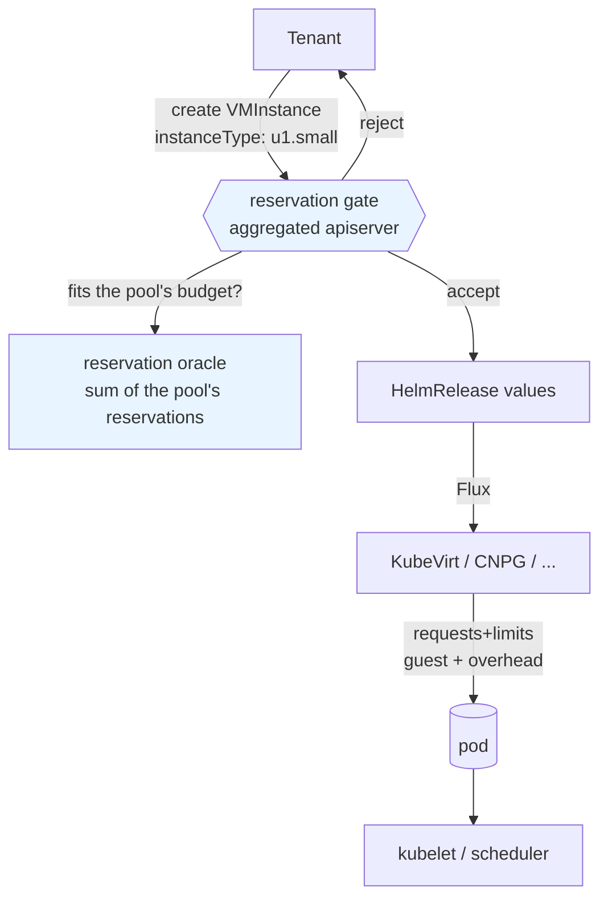

# Tenant quotas as reservation limits

- **Title:** `Tenant quotas as reservation limits`
- **Author(s):** `@mattia-eleuteri`
- **Date:** `2026-08-03`
- **Status:** Accepted

## Overview

A tenant quota is declared in instance-type units (`cpu: 8`, `memory: 16Gi`, the units a tenant sizes its applications in) but enforced in pod units, because the numbers are ultimately compared against `ResourceQuota.status.used`, which counts the requests and limits of virt-launcher and application pods. Those two scales do not match. A `u1.small` VM (1 vCPU / 4Gi guest) produces a virt-launcher pod that requests the guest memory **plus** KubeVirt's virtualization overhead, so a tenant whose 16Gi quota is fully allocated to declared VMs cannot start the last one. The gap is additive per VM, not proportional to the amount reserved, which is why the `--tenant-quota-buffer-percent` knob added alongside hierarchical quotas cannot be set correctly: the buffer a tenant needs ranges from roughly +6% to +183% depending only on how finely it slices its VMs.

There is a second and more basic problem behind the reported symptom: no quota gate stands in front of an ordinary application order at all. `validateTenantResourceQuotas` runs only for the `Tenant` kind, so creating a VM is checked against nothing until pod admission refuses it, minutes and several layers later.

This proposal makes the **reservation** the accounting authority. What a tenant's pool has consumed becomes the sum of the reservations of the `apps.cozystack.io` applications in it, evaluated from their declared values when they are written, and the gate is generalized to every kind so that an order that does not fit the budget is refused when it is made. The hierarchical pool arithmetic in `internal/controller/tenantquota` is kept exactly as it is — `ComputePools`, carve-outs, shared pools, overcommit reporting — and what changes is the vocabulary it is fed: both what a pool has consumed and the budget it counts against move from rendered pod-unit `ResourceQuota` objects to declared values. The per-pod **operational** limit is unaffected: it is already set by each operator from the same instance type. Tenants have no `create` verb on pods, but three other paths still let them put a sized workload in their namespace without passing the gate ([Context](#context)). Today `tenant-quota` bounds them, so [§7](#7-retiring-the-namespace-resourcequota) closes all three before phase 5 deletes it.

### Terminology

Three words carry the whole proposal and are used in exactly one sense each:

- A **reservation** is the figure an application consumes: a class-keyed resource list computed from its declared values, before anything runs.
- A **budget** is the limit a tenant was granted, declared in its `resourceQuotas`.
- An application **consumes**, or **counts against**, a **pool**: the budget of the nearest ancestor tenant that declares one, shared with every other application in that pool's member namespaces.

A change to the rule that computes a kind's reservation is a **re-evaluation**.

## Scope and related proposals

This proposal is about quotas: what a declared application consumes from a tenant's budget, decided when the object is written. It touches the `ApplicationDefinition` shape and the tenant contract, so it intersects several in-flight designs. In every case the interaction is composition rather than conflict, but the ordering matters.

- **[Out-of-tree app catalogs](https://github.com/cozystack/community/pull/43)** proposes splitting the managed-application catalog out of the core repository. This turns the "declarative, not Go" choice in [§2](#2-consumption-declared-on-the-applicationdefinition) from a preference into a requirement: an evaluator implemented as a `switch` over kinds inside the aggregated apiserver cannot describe an application whose package lives in another repository. How a kind consumes has to travel with the package.
- **[Fold `extra` into `apps`](https://github.com/cozystack/community/pull/39)** makes tenant modules regular applications and moves their distinguishing traits into declarative capabilities on `ApplicationDefinition`. It sets the precedent this proposal follows, per-kind behavior expressed as data on the definition rather than as a directory or a code branch. Tenant modules are platform, with one exception, monitoring's storage ([§2](#2-consumption-declared-on-the-applicationdefinition)). That one figure needs a gate when a module appears, which #39 provides by turning the module into an order; [§5](#5-generalizing-the-gate-to-every-kind) states the fallback if #39 stalls.
- **`proposal/application-definition-versioning`** (branch on this repository, by `@kvaps`, not yet a PR) splits `ApplicationDefinition` into per-version `ApplicationSchema` objects and converts tenant-supplied values into a single **storage version** before persisting them into the HelmRelease. The two compose cleanly: a reservation is evaluated against the storage form, so a kind declares its consumption **once**, against the storage version, and served versions inherit it through the existing conversion. If that proposal lands first, the declaration moves to the storage-version `ApplicationSchema` with no change in semantics.
- **[Public IPs as a first-class resource](https://github.com/cozystack/community/pull/35)** would make a public address a `PublicIPClaim` rather than an implicit consequence of `external: true`. Counting `services.loadbalancers` from that boolean is the interim form: when addresses become claimable objects, the count should follow the claims instead.
- **[`kubernetes-nodes-split`](../kubernetes-nodes-split/README.md)** (Accepted) has now landed in full. Phase 1 made `KubernetesNodes` a registered application kind with its own `ApplicationDefinition` (`packages/system/kubernetes-nodes-rd/cozyrds/kubernetes-nodes.yaml`), carrying `minReplicas`, `maxReplicas`, `instanceType`, `resources` and `diskSize` at the top level of its values. Phase 2 ([cozystack/cozystack#3315](https://github.com/cozystack/cozystack/pull/3315)) merged on 2026-08-26 and removed `spec.nodeGroups` from the `Kubernetes` CR, together with the implicit `md0` default. A worker pool's reservation is therefore read from the values of one flat kind, with nothing transitional about it and no iteration over a parent's map. The implicit default pool it retired did not disappear from the platform, though: it moved into the ComputePlane module, which is discussed in [§2](#2-consumption-declared-on-the-applicationdefinition).
- **[Database Horizontal Autoscaler](../database-horizontal-autoscaling/README.md)** (Accepted) does **not** pass through this gate, and an earlier revision of this proposal said it did. The accepted DHA design is entirely stock: the application chart renders a KEDA `ScaledObject` whose `scaleTargetRef` is the CNPG `Cluster`, KEDA's managed HPA drives that CR's `scale` subresource, and the chart writes `spec.instances` as a **constant seed** — `max(replicas, effectiveMin)` — that the autoscaler never writes back to (`packages/apps/postgres/templates/scaledobject.yaml`, `templates/db.yaml`, `templates/_autoscaling.tpl`). The `Application`'s `replicas` value is untouched by any scaling decision, so no `Update` ever reaches admission. This is the same asymmetry this proposal already identifies for the cluster-autoscaler on worker pools, and it takes the same answer: **when `autoscaling.enabled` is set, the reservation is taken at `autoscaling.maxReplicas`, not `replicas`.** [§2](#2-consumption-declared-on-the-applicationdefinition) lists this among the things a kind's declaration must be able to express.

  DHA also needs a matching amendment. Its §4 states that "quota is not re-implemented: the HPA scales the engine CR and pod creation passes through the tenant `ResourceQuota` admission, so an over-quota scale-up simply fails to create pods". Once the namespace `ResourceQuota` stops being the tenant contract ([§7](#7-retiring-the-namespace-resourcequota)) that sentence is no longer true, and the `Pending`-independent quota alert it asks the implementation to add ([cozystack/cozystack#3954](https://github.com/cozystack/cozystack/pull/3954)) loses the signal it was keyed on. Reserving the ceiling is what replaces it: the capacity counts against the pool as soon as autoscaling is enabled, so the scale-up cannot be refused at all.
- **[Per-cluster etcd](https://github.com/cozystack/community/pull/25)** moves etcd out of the tenant modules and into `apps/kubernetes`, which renders its own `EtcdCluster` per cluster and exposes only `etcd.replicas`, with member size fixed by the chart. That puts etcd on the platform side of the line this proposal draws: like the chart's other satellites (CSI, cloud-controller, cluster-autoscaler), its members are platform overhead and `etcd.replicas` does not change a cluster's reservation. The shared `Etcd` tenant module it replaces is platform too, like every tenant module ([§2](#2-consumption-declared-on-the-applicationdefinition)).
- Any new application kind, such as the one in [`compute-plane`](../compute-plane/README.md), needs to declare its consumption to participate in quotas. By design that is a data change in the package.
- **Deferred to separate work:** the root cause of `ResourceQuota.status.used` going stale (a kube-controller-manager behavior, see [The problem](#the-problem)), drift alerting, and a remediation runbook for already-affected namespaces. This proposal removes that counter from the tenant-facing contract; it does not fix it.

## Context

A tenant declares `resourceQuotas` as a flat map of shorthand keys:

```yaml
apiVersion: apps.cozystack.io/v1alpha1
kind: Tenant
metadata: { name: acme }
spec:
  resourceQuotas:
    cpu: 8
    memory: 16Gi
    storage: 500Gi
    services.loadbalancers: "2"
```

`packages/apps/tenant/templates/quota.yaml` renders that map into a `ResourceQuota` named `tenant-quota`, plus a `LimitRange` named `tenant-range-limits`. Both objects sit under the **same** `{{- if .Values.resourceQuotas }}` guard, so a tenant with no quota also gets no default container requests.

The expansion is done by `cozy-lib.resources.flatten` → `cozy-lib.resources.sanitize` (`packages/library/cozy-lib/templates/_resources.tpl`), which applies the cluster's allocation ratios (`packages/core/platform/values.yaml`: cpu 10, memory 1, ephemeral-storage 40). The example above becomes:

```yaml
spec:
  hard:
    limits.cpu: "8"
    requests.cpu: "0.8"
    limits.memory: 16Gi
    requests.memory: "17179869184"
    requests.storage: 500Gi
    services.loadbalancers: "2"
```

Hierarchical quotas were added in v1.6.0 (`internal/controller/tenantquota`, adapted from OpenShift's `ClusterResourceQuota`). A tenant's quota is the budget for its whole sub-tree: a child that declares its own quota carves a fixed slice out of the parent's budget, a child that declares none shares the parent's remaining pool. The implementation has two halves:

- A **declaration-time gate** in the aggregated apiserver, `validateTenantResourceQuotas` in `pkg/registry/apps/application/quota.go`, called from `REST.Create` and `REST.Update`. It rejects a child whose declared quota exceeds the parent's remaining budget.
- A **runtime reconciler**, `internal/controller/tenantquota/reconciler.go`, which computes pools (`ComputePools`) and writes one controller-owned `ResourceQuota` named `tenant-quota-allocated` per member namespace, clamping each member to its share (`EnforcedHard`). Kubernetes applies the most restrictive quota in a namespace, so this binds without the controller fighting Flux over the chart-owned object.

Two properties of that code matter here, and they point in opposite directions.

**The declaration gate already speaks the reservation vocabulary.** `parseDeclaredQuotas` keeps the shorthand keys verbatim, and its doc comment is explicit:

> The quota keys are kept verbatim as the operator writes them (e.g. "cpu", "memory", "requests.storage", "count/services") — the same vocabulary the parent and every child use — so they can be compared directly. The `cozy-lib.resources.flatten` expansion into limits.\*/requests.\* is a downstream rendering concern of the tenant chart and is intentionally not applied here.

So parent/child arithmetic is already reservation arithmetic. Nothing about ratios or overhead enters it.

**Pod units enter at exactly one place: the usage oracle.** Both halves need to know what a pool currently consumes, and both read it from `ResourceQuota.status.used`:

- `parentPoolUsage` (`quota.go`) lists ResourceQuotas in each pool-member namespace and sums `status.used`.
- `snapshot` (`reconciler.go`) does the same to build `usedByNS`.
- `renderedLimitKey` (`quota.go`) exists solely to bridge the two vocabularies, mapping shorthand `memory` to the rendered `limits.memory` so that `status.used` can be read. Its doc notes the mapping is "allocation-ratio independent", which is true: ratios are multiplicative and cancel on the limit side. Overhead is additive and does not cancel.

On the KubeVirt side, `packages/apps/vm-instance` sizes a VM by `instanceType`, resolved against a `VirtualMachineClusterInstancetype` (the chart `lookup`s it in `templates/vm.yaml` and fails when it does not exist); `packages/system/kubevirt-instancetypes` ships the standard series. `packages/system/kubevirt/templates/kubevirt-cr.yaml` enables the `AutoResourceLimitsGate` feature gate, which makes virt-controller set limits on the launcher pod when the namespace carries a quota constraining `limits.*`.

Finally, which workloads a tenant can create without going through `apps.cozystack.io`. `packages/system/cozystack-basics/templates/clusterroles.yaml` grants `cozy:tenant:admin` only `delete` on `pods`, never `create`, and no access to HelmReleases at all. That does not make `apps.cozystack.io` the only way in, though. Three paths reach a sized workload around it, and today the only thing bounding each of them is `tenant-quota`:

- **Raw VirtualMachines.** `cozy:tenant:super-admin:base` grants `'*'` on `kubevirt.io/virtualmachines`, and `packages/apps/tenant/templates/tenant.yaml` binds `cozy:tenant:super-admin` in the tenant namespace. A tenant super-admin can therefore create a `VirtualMachine` of any size. It is neither an aggregated-API object nor a labelled HelmRelease, so neither the gate nor the pool sum sees it. The same verbs let a super-admin edit the `VirtualMachine` rendered by a `vm-instance` release and raise its guest size above what was reserved.
- **Restores.** `cozy:backups:admin` (`packages/system/backup-controller/templates/tenant-clusterroles.yaml`) aggregates into `cozy:tenant:admin` and grants `create` on `restorejobs`. The Velero strategy (`internal/backupcontroller/velerostrategy_controller.go`) restores `VMInstance` and `VMDisk` HelmReleases directly, and `postRestoreRename` writes a copy under a new name with the client. Neither write passes the aggregated apiserver. A copy restore is a new application, and an in-place restore brings back the size as it was backed up. Both are labelled, so the pool sum counts them, but no gate refused them first.
- **Imports.** `cozy:migration:admin` grants `create` on `vmimporttasks`, also at admin level. The migration controller creates its `VMDisk` and `VMInstance` objects through the aggregated API, so those writes are gated. But Forklift fills each disk's DataVolume in the tenant namespace *before* the `VMDisk` that adopts it exists (`internal/migrationcontroller/handoff.go`). An import the gate would refuse at handoff has already written its storage by then.

Everything else a tenant creates goes through `apps.cozystack.io`, from values validated against the kind's OpenAPI schema, and sized by the operator from the declared instance type. [§7](#7-retiring-the-namespace-resourcequota) closes the three paths above. That is what makes the claim *a tenant cannot produce a workload larger than what it declared* true rather than nearly true.

### The problem

> "My tenant quota says 16Gi, my VMs add up to 16Gi, and the last one will not start. The namespace has no pods in it at all."

Three failures. The first is the one that decides where the wall stands: there is no quota gate in front of an ordinary application at all. The other two are consequences of the quota being compared against a number that describes pods rather than reservations.

**0. Nothing checks an application against a quota when it is ordered.** `validateTenantResourceQuotas` (`pkg/registry/apps/application/quota.go`) returns immediately unless `r.kindName` is `Tenant`, and its only call site in `REST.Create` sits inside `if r.kindName == "Tenant"`. Creating a `VMInstance`, a `Postgres` or a `KubernetesNodes` pool is therefore checked against no quota whatsoever; the first thing that says no is pod admission, several layers and several minutes later. Everything below decides *where* that wall stands — the overhead decides how far short of the declared figure it is, the stale counter can move it arbitrarily — but the missing gate is why it stands *behind* the order rather than in front of it. [§5](#5-generalizing-the-gate-to-every-kind) closes this, and it is the part of this proposal with the largest effect on what a tenant actually experiences: phases 1 to 3 alone turn a `CrashLoopBackOff` twenty minutes later into a refusal at the moment of the order, naming the pool and the size.

**1. Additive virtualization overhead makes a correctly-sized quota unusable.** A virt-launcher pod requests the guest memory plus KubeVirt's computed overhead, which is a function of guest memory, vCPU count and attached devices: roughly 468Mi for a small single-vCPU guest, and larger with more vCPUs or devices. It is not a percentage of the guest. Because the tenant quota is set on the guest-side numbers the tenant declares, any tenant that allocates its full quota is unable to start its workloads. Observed on tenant `fdmp` (2026-07-15), where `resourceQuotas.memory` had been set to exactly the guest RAM.

`--tenant-quota-buffer-percent` (`cmd/cozystack-controller/main.go`, applied by `ScaleResourceList`) inflates every pool budget by a fixed percentage to keep pre-existing workloads admissible. It cannot be set correctly, because the required inflation depends on VM granularity rather than on volume. For a 16Gi memory quota, taking ~468Mi of overhead per launcher:

| Tenant shape | Actual launcher demand | Buffer required |
|---|---|---|
| 2 VMs of 8Gi | 17320Mi | +6% |
| 16 VMs of 1Gi | 23872Mi | +46% |
| 64 VMs of 256Mi | 46336Mi | +183% |

Any single value is simultaneously too tight for tenants running many small VMs, which stay blocked, and too generous for tenants running few large ones, to whom real capacity is given away. The knob is not mistuned; it is the wrong shape for the error it corrects.

And it never reached the case above. `BufferPercent` scales only `p.Available` on its way into `EnforcedHard`, which is to say only the controller-written `tenant-quota-allocated` clamp, and `Reconcile` skips any pool with no carve-outs and at most one member namespace (`if len(p.CarvedOut) == 0 && len(p.Members) <= 1 { continue }`). A lone tenant with a quota and no sub-tenants is bound purely by the chart-rendered `tenant-quota`, which the flag never touches. So the flag is not merely the wrong shape for the error; on the single-tenant namespace where the error was reported it does not apply at all. That is why phase 5 **deletes** it rather than deprecating it: there is no configuration of it that a tenant depends on.

**2. The pod counter goes stale, and now it does so on the admission path.** `ResourceQuota.status.used` is maintained by the kube-controller-manager quota controller and can drift permanently: deleted pods stay counted, with no recomputation. Observed repeatedly (`tenant-commoswiss-infra` 2026-08-03, `tenant-datalab` 2026-06-30, `tenant-matthieu-test` 2026-06-08). In the most recent case a namespace containing **no pods at all** reported `limits.memory: 13092Mi`, exactly 3 × 4364Mi, three ghost virt-launchers, with the last controller recomputation dated five days earlier. The tenant's real quota (16Gi) was ample; a client VM sat in `CrashLoopBackOff` for twenty minutes, and because `RerunOnFailure` applies an exponential backoff to admission failures, it did not recover on its own once the counter was reset.

Before v1.6.0 the damage was bounded to workloads in the affected namespace. Now that `parentPoolUsage` reads the same counter from the admission path, a stale counter in **any** member namespace of a pool inflates the pool's apparent usage and can forbid the creation of a legitimate sub-tenant, with an error message that blames the parent's remaining quota. A platform-level bug in a leaf namespace has become an onboarding failure.

The diagnosis suffers too. The admission message names the quota, which points operators at "raise the quota", a workaround that over-allocates real capacity and hides the drift instead of surfacing it.

## Goals

- Adding an application consumes exactly its reservation: a VM of instance type `u1.small` counts 1 CPU and 4Gi against its pool, whatever KubeVirt's launcher requests.
- A tenant whose reservations sum to exactly its budget can start all of them.
- Quota accounting reads no `ResourceQuota.status.used` anywhere, so counter drift cannot deny a tenant request.
- Admission rejects a create or update that would exceed the pool budget, for **every** `apps.cozystack.io` kind, on both `Create` and `Update`, counting only the delta on update.
- Hierarchical pool semantics, meaning carve-outs, unbounded children sharing an ancestor's pool and overcommit reporting, are preserved unchanged; the existing `pool_test.go` assertions keep passing untouched.
- A new application kind participates in quotas by declaring its consumption on its definition, with no Go change in the aggregated apiserver and no rebuild required for out-of-tree kinds.
- `--tenant-quota-buffer-percent` is no longer needed for a correctly-sized tenant to work, and is deleted.
- Each pool reports `reserved` against `budget` **on an API object** — the `Tenant` application's status — so a tenant, or anything provisioning tenants, can read a pool's headroom before ordering into it rather than inferring it from quota objects or from events.

### Non-goals

- Fixing the kube-controller-manager counter staleness, or alerting on it. Both remain worth doing; neither is required for this design.
- Usage-based quotas. Nothing here measures actual CPU or memory consumption, and nothing should: a reservation is a claim on a budget made when the object is written, not a runtime governor.
- Metering. Measuring consumption over time is a different concern, owned by whoever operates the platform; [§4](#4-reservation-as-the-usage-oracle) states the one point where it touches this design.
- Evicting or resizing already-admitted workloads when a quota is lowered. Overcommit is reported, never enforced retroactively, matching today's behavior.
- Node-level capacity planning. Virtualization overhead remains real and must still be provisioned; this proposal moves it out of the tenant's quota and into platform capacity planning, where it is a property of the fleet rather than of a tenant's budget.
- Replacing the per-pod requests and limits each operator sets. Those are the operational limit and they stay exactly as they are. The `LimitRange` also stays, but it stops being conditional on `resourceQuotas` — see [§7](#7-retiring-the-namespace-resourcequota).
- Introducing quota keys. The keys are the platform's; this proposal defines how a kind consumes them. The instance-type classes in [§3](#3-environment-instance-types-and-presets) are the one place it has to name keys at all.

## Design

### 1. Two limits, two owners

The design rests on separating two things that the current implementation conflates.

The **reservation limit** answers "how much has this tenant been granted, and how much has it claimed?" It is denominated in instance-type units, computed from declared custom resources, and enforced at admission by the aggregated apiserver.

The **operational limit** answers "how much can this pod actually use?" It is denominated in pod requests and limits, derived from the same instance type by each operator, and enforced by the kubelet and the scheduler.


```mermaid
flowchart TD
    T[Tenant] -- "create VMInstance<br/>instanceType: u1.small" --> GATE{{"reservation gate<br/>aggregated apiserver"}}
    GATE -- "fits the pool's budget?" --> AGG["reservation oracle<br/>sum of the pool's reservations"]
    GATE -- reject --> T
    GATE -- accept --> HR[HelmRelease values]
    HR -- Flux --> OP[KubeVirt / CNPG / ...]
    OP -- "requests+limits<br/>guest + overhead" --> POD[(pod)]
    POD --> NODE[kubelet / scheduler]

    style GATE fill:#e8f4ff
    style AGG fill:#e8f4ff
```

The left column is the tenant contract and only ever sees reservations. The right column is physical enforcement and legitimately sees overhead. The two never need to agree numerically, and the current design's central mistake is requiring them to.

This split is only sound if a tenant cannot write the right column. `cozy:tenant:admin` has no `create` on pods and no access to HelmReleases, and the operator derives pod sizing from the declared instance type. But [Context](#context) lists three paths that reach the right column today: raw `VirtualMachines`, restores and imports. Until [§7](#7-retiring-the-namespace-resourcequota) closes them, `tenant-quota` is what bounds them. Once they are closed, the reservation is not an honor-system estimate of what the tenant will consume. It is a structural bound on it.

### 2. Consumption declared on the `ApplicationDefinition`

Each kind declares how its reservation is computed from its own values, on its `ApplicationDefinition`, next to the `openAPISchema` the definition already carries. The apiserver contains no per-kind knowledge.

This is the same move [PR #39](https://github.com/cozystack/community/pull/39) makes for visibility, cardinality and sharing: behavior that varies per kind becomes data on the definition rather than a branch in Go. It is also what [PR #43](https://github.com/cozystack/community/pull/43) forces, since an out-of-tree catalog cannot ship a patch to the aggregated apiserver.

**The contract is the evaluator's, not the declaration's shape.** An **evaluator** takes an application's defaulted values and a snapshot of the environment, and returns that application's reservation as a class-keyed resource list. It is:

- **deterministic** for a given values-and-environment pair;
- **kind-agnostic** in Go: everything that differs between kinds is read from the definition;
- **fail-closed** on anything it cannot resolve — an unknown instance type, a value of the wrong type, an expression that does not evaluate — returning an error rather than a smaller figure;
- **importable** outside the apiserver ([§4](#4-reservation-as-the-usage-oracle)).

The **environment** is the set of cluster objects a kind's definition may reference. Instance types are already such objects; [§3](#3-environment-instance-types-and-presets) adds presets.

How a kind expresses its consumption on its definition is a definition-level concern this proposal does not fix. [Appendix A](#appendix-a-non-normative-sketch-of-a-declaration) sketches one shape. Whatever shape the implementation chooses has to be able to express what the in-tree kinds already need, which this design has established and which the tests in [Testing](#testing) pin:

- **A count that is a product of values.** ClickHouse runs `shards × replicas` server pods, plus its keepers sized by their own preset.
- **A count whose ceiling is an autoscaler bound.** `KubernetesNodes` reserves `maxReplicas`, because the cluster-autoscaler scales the MachineDeployment without touching the CR; `Postgres` reserves `autoscaling.maxReplicas` when `autoscaling.enabled` is set, and `replicas` otherwise, for the DHA reason given in [Scope](#scope-and-related-proposals).
- **The chart's own precedence between a named size and an explicit override**, which differs between chart families. cozy-lib fills a preset **per key**: `resources: {cpu: "1"}` on top of `t1.nano` renders 1 CPU and 128Mi, and the Postgres schema admits exactly that partial block. `vm-instance` instead treats `resources` as all-or-nothing against `instanceType`, and its `resources.cpu` is cores per socket, so a `{cpu: 4, sockets: 2, memory}` block is 8 vCPUs. No single precedence rule covers both, which is why the precedence is written per kind by the chart author who knows it rather than fixed here.
- **An object count from a boolean.** `vm-instance` with `external: true` consumes one `services.loadbalancers`.
- **An explicit exemption.** A kind that consumes nothing says so (see [§5](#5-generalizing-the-gate-to-every-kind)).

**The evaluator must default the values before it reads them.** This is a correctness precondition, not a detail. The aggregated apiserver applies the kind's structural-schema defaults on the **read** path only — `applySpecDefaults` is called from `ConvertHelmReleaseToApplicationWithMonitor`, and `REST.Create` stores the tenant's spec verbatim without defaulting it. The stored HelmRelease values therefore carry only the keys the tenant actually wrote. An evaluator that read `hr.Spec.Values` raw would count zero for `kubernetes-nodes.maxReplicas` (schema default 10) and resolve no instance type for `kubernetes-nodes.instanceType` (default `u1.medium`) on every pool created with defaults — a systematic under-count far larger than any synthesized-workload hole. The evaluator runs against the defaulted form, and the object under admission is defaulted before it is evaluated too, since the gate runs before conversion.

**What a values path still cannot see.** The evaluator reads values, so a workload a chart synthesizes at template time, without a values key naming it, is invisible to it. [#3315](https://github.com/cozystack/cozystack/pull/3315) closed the `kubernetes.nodeGroups` / implicit-`md0` instance of this, but the hole moved rather than closing: the ComputePlane module now materializes the same default `md0` pool itself at template time when `nodeGroups` is empty (`packages/extra/computeplane/templates/cluster.yaml`).

Its shape there is different, and better. ComputePlane renders each pool as its own `HelmRelease` labelled `apps.cozystack.io/application.kind: KubernetesNodes`, shaped exactly like a natively created pool. An aggregator that lists labelled HelmReleases therefore *sees* the default `md0` — it is not invisible. What it does not see is the pool's size, because the module writes only `{roles, minReplicas: 0}` into that release and the schema defaults that supply `maxReplicas: 10` and `instanceType: u1.medium` are never materialized into a Helm-rendered release. This is the same defaulting requirement as the paragraph above, which is why closing it closes both.

The rule stated for future kinds therefore stands, and ComputePlane is where it should be applied: a chart that defaults a *sized* field in a template rather than in its values makes itself unquotable. Materializing `md0`'s full shape into ComputePlane's values is the fix, and it is a data change in that one chart.

**What is deliberately not reserved.** An earlier revision of this text claimed exactly one values-invisible case existed in tree. That was wrong by a wide margin: sized workloads that no values path describes are the norm rather than the exception, and none of them are being added to any kind's reservation. What follows is therefore not a list of holes to close but the explicit statement of where the line is drawn — everything below is **platform overhead**, provisioned as fleet capacity in the same way virtualization overhead is, and not counted against the tenant's budget.

| Kind | Not reserved | Why the line is here |
|---|---|---|
| `redis`, `valkey`, Harbor's redis | 3 sentinel pods | Fixed operator topology, not a tenant-chosen shape. Today the charts size each sentinel at the **data preset** (`packages/apps/redis/templates/redisfailover.yaml`), for no reason a sentinel needs, so three unreserved pods scale with the tenant's choice of preset. That is a chart defect: sized with a small fixed preset, the sentinels become fixed overhead like the CSI deployments below, and the principle holds without an exception. The chart change is part of phase 4. |
| `clickhouse` | one backup sidecar per server pod | Sidecar, sized by the operator. |
| `mongodb` (sharded) | config servers, mongos | Topology the chart derives; no values key names the counts. |
| `kafka` | ZooKeeper pods, entity-operator pod | Same. |
| `kubernetes` | cluster-autoscaler, cloud-controller and 4-container CSI deployments (125m/128Mi per container), a `talos-csr-signer` sidecar in every control-plane pod, and, once [#25](https://github.com/cozystack/community/pull/25) lands, the cluster's own etcd members | Platform-authored control-plane machinery with fixed sizes, identical for every tenant cluster of a given `etcd.replicas`. |
| every managed database | operator-injected sidecars: CNPG's barman plugin, PSMDB's backup agent, NATS reloader and exporter, the FoundationDB sidecar | Injected by an operator after the CR is written; not derivable from values at all. |
| tenant modules: `monitoring`, `ingress`, `etcd`, `seaweedfs` | all compute, and all storage except monitoring's | A module is platform that makes the tenant's applications work — their ingress, their monitoring, their control planes' datastore, their object storage — not an application the tenant runs for its own sake. Its compute, including VPA growth (`packages/extra/etcd/templates/vpa.yaml` up to 5 CPU / 8Gi per member, the six VPAs in `packages/system/monitoring/templates/vpa.yaml` up to 4 CPU / 8Gi per component), is fleet capacity, and `Ingress`, `Etcd` and `SeaweedFS` declare an explicit exemption. The exception is **monitoring's storage**: its volumes (`metricsStorages`, `logsStorages`, alerta, grafana's database) are declared in values and hold the tenant's own metrics and logs for the retention the tenant keeps, so `Monitoring` reserves its declared storage and nothing else. |
| `foundationdb` | stateless process count | The chart's own value is `-1`, "operator decides". There is nothing to read. |
| storage-backed kinds | anything a chart rounds or adds beyond the declared size, such as a WAL volume | Storage is reserved at the **declared** size, by the same rule as launcher memory overhead: what the chart adds is platform margin. |

The consequence for testing is the important part. A completeness test asserting that every kind *has* a declaration proves nothing about whether it is *adequate*. [Testing](#testing) therefore replaces it with a test that compares the evaluator's output against the rendered pod requests for each kind's default values, so the size of the overhead in this table is a number in CI rather than a surprise in production.

### 3. Environment: instance types and presets

#### KubeVirt instance types: scalars, keyed by class

An instance type resolves from the `VirtualMachineClusterInstancetype` in the environment, from its `spec.cpu.guest` and `spec.memory.guest`. It resolves to **scalars**, not one quota key per type: a per-type `count/<type>` key would remove the resolution step, but it would also turn "8 CPU spendable on any shape" into a basket the tenant has to commit to in advance, and it would take the hierarchical arithmetic out of fungible units.

But one `cpu` key cannot hold every core. A shared vCPU under the allocation ratio and a pinned core on a CPU-manager node are not the same capacity, and neither are ordinary memory, pre-reserved hugepages and overcommitted memory. So the scalars are **keyed by class**, and the class is derived from the instance type's own spec, never from its name, so an operator-added type classifies itself:

| Quota key | Derived from | Shipped types that land here |
|---|---|---|
| `cpu` | `spec.cpu.dedicatedCPUPlacement` unset or false | `u1`, `m1`, `o1` |
| `dedicated-cpu` | `spec.cpu.dedicatedCPUPlacement: true` | `d1`, `cx1`, `n1`, `rt1` |
| `memory` | no `spec.memory.hugepages`, no `overcommitPercent` | `u1`, `d1` |
| `hugepages-<size>` | `spec.memory.hugepages.pageSize` | `m1`, `cx1`, `n1`, `rt1` (2Mi and 1Gi variants of each) |
| `overcommitted-memory` | `spec.memory.overcommitPercent` | `o1` |

These class keys are the one place this proposal names quota keys, because an instance type has to land on some key and the classes differ in kind; their names are the platform's to fix, and nothing else is added. Two notes on the table, because an earlier sketch of it got both wrong by classifying on the series name. Hugepages are **not** a `cx1` property: `m1` is a shared-CPU series that nonetheless requests hugepages, and `n1` is a fourth dedicated series alongside `d1`/`cx1`/`rt1`. And `o1` sets `overcommitPercent: 50`, which means its launcher requests half the guest memory — the only case on the platform where the pod request is *smaller* than the reservation. Reserving the guest figure for it is still right, since it is what the tenant declared, and it gets its own key, as hugepages have, because a cluster cannot grant the same physical page as both `o1` memory and `u1` memory. A budget that does not mention `overcommitted-memory` grants none of it.

**What is reserved is what is stable and enumerable on the instance type.** For a dedicated type with `isolateEmulatorThread: true` — which every shipped dedicated type sets — the reservation is `guest + 1` dedicated cores, plus any supplemental I/O thread count, reading the even-parity annotation if one is ever set: `cx1.2xlarge` is eight guest vCPUs on nine pinned cores. The reason is capacity. A pinned core nobody else can be given has to come out of someone's budget, and since the figure is a property of the type, the catalog shows it, so a tenant can predict what an order will consume before making it. What KubeVirt computes at *runtime*, namely the launcher memory overhead, stays platform margin — that is the entire point of this proposal on the memory side.

The asymmetry deserves naming rather than leaving for the next reviewer to find: cores include their overhead and memory does not. The emulator-thread core is a fixed, declared property of the instance type, knowable before anything runs; the launcher's memory overhead is computed by virt-controller from guest memory, vCPU count and attached devices, and moves between KubeVirt releases. Only the first is something a tenant can predict before ordering.

**The catalog and the evaluator read the same figure.** What the instance-type catalog shows a tenant must be what the evaluator computes, so both come from the evaluator ([§4](#4-reservation-as-the-usage-oracle)); two independent renderings of "what does `cx1.2xlarge` consume" will diverge. Relatedly, instance types are **immutable by policy**: editing one silently re-evaluates every application that references it with no write to any tenant's CR. A changed type is shipped under a new name, or rolled out as a re-evaluation ([Security](#security)).

#### cozy-lib resource presets

Today the presets are a Helm-only table in `packages/library/cozy-lib/templates/_resourcepresets.tpl` (the `t1`/`c1`/`s1`/`u1`/`m1` series). Go cannot read a `.tpl`, and the aggregated apiserver does not ship the chart.

*Implementation note, not a condition of this proposal:* presets should become environment objects too, shipped by the platform and looked up by cozy-lib at render time the way the VM charts already `lookup` instance types. The chart and the evaluator then read the same object, and no Go copy of the table exists to be generated, compared or kept in step. A preset object is immutable by the same policy as an instance type.

Two properties hold however presets are resolved:

- **Only budgeted keys are reserved.** Every preset also carries `ephemeral-storage: 2Gi`; no tenant quota bounds it today, so it is not part of any reservation, and this proposal does not add it.
- **The deprecated flat aliases resolve, they are not rejected.** `nano`…`2xlarge` do not mean what their `t1.*` namesakes mean — `medium` is 1 CPU where `t1.medium` is 2 — and migration 39 converted the values that existed. But they are still live: `_resourcepresets.tpl` merges `$legacyAliases` into `$presets`, and seventeen shipped kinds' `values.schema.json` still enumerate them (`postgres`, `kubernetes`, `redis`, …). An evaluator that rejected them would fail closed against a value the kind's own OpenAPI schema admits and the chart renders, which is a regression, not a tightening. So they resolve at their legacy figures and `warnLegacyPresets` keeps warning; rejecting them becomes correct only in the release that drops them from the enums.

Neither resolution applies allocation ratios and neither adds virtualization overhead. That is the whole point: the reservation is the guest-side number.

### 4. Reservation as the usage oracle

The evaluator is a **standalone, importable package** (`pkg/reservation`) with stable key names, not an internal detail of the apiserver. Metering, if and when the platform operator builds it, reads the same evaluator and adds time and operational state on top, so the two can never disagree about what an application is.

The pool's figure is the sum of the reservations of every application in its member namespaces, where "application" means a HelmRelease carrying the `ApplicationKindLabel` and `ApplicationGroupLabel`. An unlabelled namespace-scoped HelmRelease is not an application and is not summed. This deliberately includes releases a platform chart rendered with those labels — ComputePlane's per-pool `KubernetesNodes` releases are the in-tree case — since those consume the tenant's capacity exactly as a natively created application does. Tenant modules are labelled too; `Monitoring` contributes its storage and the others the zero their exemption declares. Each application's definition is found by that kind-and-group pair, so an out-of-tree kind resolves through the same path as an in-tree one, and its declaration is taken from the storage version.

Two properties of that contract are worth stating explicitly, because both have a wrong answer that looks right:

- **The HelmRelease *is* the stored application.** `REST.Create` converts the Application to a HelmRelease and that is the only persisted copy; there is no second record that is more authoritative. Reading labelled HelmReleases is therefore reading the committed state, not a rendered derivative — Flux lag affects when *pods* appear, never what was declared. What the read does need is the defaulting step of [§2](#2-consumption-declared-on-the-applicationdefinition), because the stored values are undefaulted.
- **Both sides must move, not just usage.** `snapshot` does not only read usage from `status.used`; it also takes each tenant's **budget** from the chart-rendered `tenant-quota` object's `spec.hard`, in rendered key space with allocation ratios already applied — its doc comment says so, and that was a deliberate choice to avoid replicating the chart's ratio math. If `reserved` is summed in shorthand units and `budget` is left where it is, the controller compares two vocabularies. So `Declared` has to be read from the tenant's own `resourceQuotas` values, which is what the admission gate already does through `declaredQuotasFromHelmRelease`.

The call sites change source, not shape:

| Call site | Today | After |
|---|---|---|
| `quota.go` `parentPoolUsage` | lists `ResourceQuota` per member namespace, sums `status.used`, keys via `renderedLimitKey` | sums the reservations of the labelled HelmReleases per member namespace, in shorthand keys |
| `reconciler.go` `snapshot` (usage) | lists all `ResourceQuota`, builds `usedByNS` from `status.used` | builds `usedByNS` from the same sum |
| `reconciler.go` `snapshot` (budget) | reads `tenant-quota.spec.hard`, rendered keys, ratios applied | reads `resourceQuotas` from the tenant HelmRelease values, shorthand keys |

`renderedLimitKey` and its `rawQuotaKeys` companion are deleted: with both sides in shorthand there is nothing to bridge.

This also removes uncached reads from the admission path. `parentPoolUsage` today deliberately uses the direct watch client `r.w` for ResourceQuotas, with the comment that the aggregated apiserver "must not spin up a cluster-wide ResourceQuota informer just for admission". HelmReleases already have an informer, since `siblingDeclaredQuotas` uses the cached client `r.c` for them, so the new oracle reads from cache where the old one could not.

The test consequence follows from the budget change and should be stated rather than discovered: `pool_test.go` passes unmodified because that package is pure arithmetic over `Tenant{Declared, ...}`, but `reconciler_test.go` does not — it builds its fixtures from rendered `ResourceQuota` objects, and those fixtures move to tenant values.

### 5. Generalizing the gate to every kind

This is the part of the proposal that changes what a tenant experiences most, because today there is no gate here at all — see failure 0 in [The problem](#the-problem). `validateTenantResourceQuotas` returns early unless `r.kindName` is `Tenant`, and its call site is itself inside `if r.kindName == "Tenant"`. It becomes two checks, and the call site loses its guard:

1. **Quota declaration** (Tenant only, unchanged): a child's declared quota may not exceed the parent's remaining budget.
2. **Reservation** (every kind): the reservation this write introduces, plus what the pool already consumes, may not exceed the pool's budget.

On `Update` only the delta counts, computed as the new reservation minus the old one, so a no-op edit to an application whose pool is already over budget is not rejected, and shrinking is always allowed. Both run inside the existing `Create`/`Update` handlers, before `createValidation`, alongside the current name and internal-key validation.

The error names the pool and the size that was requested, so the message points at the reservation rather than at an opaque quota:

```
Forbidden: spec.instanceType: reserving u1.large (4 CPU, 16Gi memory) would
exceed the remaining "memory" budget of tenant pool "tenant-acme": 12Gi
allowed, 6Gi already reserved by 3 applications, 10Gi requested
```

**Refuse; never admit for later retry.** An order that does not fit is rejected synchronously and is not admitted in any pending or queued form. Admit-and-retry would leave a HelmRelease that Flux keeps reconciling and pods that never start — which is the original failure moved up one level, not fixed. Retry semantics belong only to platform-originated writes, and for those the answer is to reserve the ceiling ([§2](#2-consumption-declared-on-the-applicationdefinition)) so the write never needs to fail in the first place.

**Missing declarations fail closed.** A kind whose `ApplicationDefinition` declares no consumption would reserve nothing, which for an out-of-tree catalog is a quota-escalation vector that no in-tree completeness test can reach. So "absent" is not a valid state once the gate is on: a kind must either declare its consumption or declare an explicit exemption, and a definition with neither is refused at admission for that kind with an error naming the definition. The exemption is a reviewed, visible declaration rather than an omission that silently consumes nothing.

**Tenant modules.** `monitoring`, `ingress`, `etcd` and `seaweedfs` are rendered by the tenant chart as labelled application releases of their own kinds (`packages/apps/tenant/templates/*.yaml`, kinds `Monitoring`, `Ingress`, `Etcd`, `SeaweedFS`), in the tenant's own namespace and sized by their charts' defaults. They are platform and consume nothing, except monitoring's declared storage ([§2](#2-consumption-declared-on-the-applicationdefinition)), which is counted from the `Monitoring` release like any application. What that one figure lacks is a gate: the write that brings it into existence is a `Tenant` update setting `monitoring: true`, not an order for the module. [PR #39](https://github.com/cozystack/community/pull/39) turns that into an order through the apiserver, gated like any other. **If #39 stalls**, the gate on a `Tenant` create or update that newly enables `monitoring` counts the module's declared storage, evaluated on its defaulted values, against the tenant's own pool. That is a check at the gate only: the pool's figure still comes from the `Monitoring` release once it exists, so nothing is counted twice. The rule is removed when #39 lands. Phase 4 cannot complete without one of the two.

**Concurrency: the real bound, and what closes the common case.** The gate is a read-check-write with no transaction, reading HelmReleases from the informer cache (`r.c`). An earlier revision of this text claimed the overshoot was bounded by one application. It is not, and the mechanism is not exotic: a burst of *sequential* creates from a single client — a script, a Terraform apply, any provisioning flow — can all observe the pre-burst sum, because the cache has not caught up with the writes the same client just made. The overshoot is bounded by the number of writes that fit inside the cache lag, and an `Update` can carry a large delta on its own. Today the controller-written `tenant-quota-allocated` eventually clamps that; this proposal removes it.

Transactional admission is not being reintroduced — that trade is discussed in [Alternatives](#alternatives-considered) and the honest semantics are best-effort. But the common case is cheap to close and phase 3 closes it: **serialize the check per pool root inside the apiserver, and re-read after the write.** A per-pool-root mutex makes concurrent writes to one pool sequential within a process, and re-reading the pool's figure after the write (rather than trusting the pre-write snapshot) removes the cache-lag window that lets a single client's own writes go unseen. What remains uncovered is genuinely concurrent writes to one pool across apiserver replicas — the chart ships two — which is a much narrower window than the one described above. The residual overshoot is reported by the controller and is never evicted, exactly as an `Overcommitted` pool is today. If that residual ever matters, the fallback is running the apiserver as a single replica, not a transactional counter.

### 6. What the controller becomes

Feeding `usedByNS` in instance-type units while `EnforcedHard` still writes a `ResourceQuota` enforced against pods would reintroduce the same unit mismatch one level up: the clamp would be computed from reservations and applied to launcher requests. So the controller must stop being an enforcement point.

It can. Once the gate covers every kind, pool sharing between unbounded siblings is already enforced at admission, because every application create in every member namespace is checked against the pool's budget. `EnforcedHard`, `upsertAllocatedQuota`, `gcAllocatedQuotas` and the `tenant-quota-allocated` object become redundant and are removed.

The controller becomes an observer. It publishes `reserved` against `budget` per pool, and keeps reporting `Overcommitted`, the one case no admission check can prevent, since it arises when a parent lowers its quota after children have already carved out slices, or when a re-evaluation raises what a pool consumes.

**Where those numbers live.** Today `recordOvercommit` emits a Kubernetes `Event` on the namespace and nothing else, which nothing can read programmatically and which expires. `reserved` and `budget` are a **status on an API object**, and the natural home is the `Tenant` application's status: it is the object that owns the pool, and it is already served by the aggregated API. An `Application` is a projection of a HelmRelease with no store of its own, so the figures are persisted on the HelmRelease and projected on read:

- **The controller writes them as annotations on the `Tenant`'s HelmRelease** — `reserved`, `budget`, and the `Overcommitted` condition with its reason and timestamp — under a key outside the `apps.cozystack.io-` prefix. That prefix is how `REST` maps a tenant's own `Application` annotations onto the HelmRelease (`addPrefixedMap`/`filterPrefixedMap` in `pkg/registry/apps/application/rest.go`), so a key outside it can neither be written by the tenant nor leak back into the `Application`'s metadata.
- **The apiserver projects them into `Tenant.status`** on every read, in the same block of `ConvertHelmReleaseToApplication` that already computes `status.namespace` and `status.externalIPsCount` for the `Tenant` kind. `Overcommitted` becomes a condition there, with the event kept as a secondary signal.
- **`REST.Update` carries them over from the live object.** `Update` rebuilds the HelmRelease from the `Application` and would otherwise drop them on every tenant edit until the next reconcile. It already does exactly this for the flux shard label, for the same reason.

**Coexistence is mutually exclusive, not additive.** During the flag-gated period `EnforcedHard` stays in place so the legacy path is not left without a runtime net — but only for the legacy path. Whenever the reservation oracle is active for a pool, the controller writes no `tenant-quota-allocated` object for that pool's members and garbage-collects any it previously wrote. The two must never be on together: `EnforcedHard` computed from reservations and applied as a pod-unit `ResourceQuota` clamp is precisely the unit mismatch this proposal exists to remove, reintroduced one level up.

### 7. Retiring the namespace `ResourceQuota`

An earlier revision kept the chart-rendered `tenant-quota`, inflated by a wide factor, as a "deliberately slack guard". It was kept for two reasons that have nothing to do with the tenant contract: the `LimitRange` providing default container requests sits under the same `{{- if .Values.resourceQuotas }}` guard, and `AutoResourceLimitsGate` only sets limits on virt-launcher pods when the namespace has a quota constraining `limits.*`.

Keeping it is the wrong answer, and the reason is structural rather than aesthetic. Suppose the gate covers every kind and the three paths in [Context](#context) are closed, as [below](#prerequisite-no-sized-workload-around-the-gate) describes. Then **the only pods in a tenant namespace are platform-authored**, each put there by a chart or an operator from something the gate admitted. Platform-authored pods should be bounded by platform-authored ceilings — the presets and the VPA `maxAllowed` values that already exist — not by a per-tenant quota that happens to count them. Physical capacity is the scheduler's business; grantable capacity is the root tenant's budget, which the hierarchical arithmetic already forces every carve-out to sum to. The margin between those two is the platform's, and that is a cleaner statement of "overhead is capacity planning" than a slack factor on a quota object, which would leave a second, differently-denominated limit in the namespace for someone to trip over.

A loose guard is also not harmless. `tenant-quota` is a real `ResourceQuota` enforced against `status.used`, so it keeps the stale-counter failure mode of [The problem](#the-problem) alive in the namespace, just with more headroom before it bites — and it would contradict the goal that a tenant whose reservations sum to exactly its budget can start everything it declared.

So **phase 5 deletes `tenant-quota`** and re-homes the two things that were riding on it:

- **The `LimitRange` renders unconditionally.** It is doing real work independently of any quota: several platform-authored workloads ship with no resources at all and rely on its defaults — the `mariadb` and `clickhouse` backup CronJobs, the `vm-disk` pre-install PVC-resize hook Job. Today a tenant with no `resourceQuotas` already gets no defaults for those, which is a pre-existing inconsistency this change also fixes.
- **Launcher limits are given up, deliberately.** With no quota constraining `limits.*` in the namespace, `AutoResourceLimitsGate` goes inert. On CPU nothing is lost: an 8 vCPU guest is eight QEMU threads and cannot exceed eight cores, and dedicated-CPU instance types already get requests equal to limits from KubeVirt for the CPU manager. What the gate actually adds is a **memory** limit on shared-CPU launchers, and losing it moves those pods from `Burstable`-with-a-limit to `Burstable`-without-one. That is an accepted trade, stated here rather than left implicit.

**One interaction must be tested on a dev cluster before phase 5 ships.** With the gate inert, a shared-CPU launcher arrives with a multi-gigabyte memory *request* and no limit. The `LimitRange`'s container `default.memory: 128Mi` would then be applied as that pod's limit, and pod validation rejects a limit below the request — so every shared-CPU VM in the namespace would fail admission. Today this can never happen, precisely because the quota and the `LimitRange` are under the same conditional and the gate is therefore always armed wherever the `LimitRange` exists. Unconditional rendering breaks that coupling. The `LimitRange` needs either a container default that does not apply to launchers, or no memory limit default at all; which of those is correct is an implementation decision for phase 5, but it is a blocking one.

This also removes the last reason to keep the inflation factor in any form, which is why [`--tenant-quota-buffer-percent`](#the-problem) is deleted in phase 5 rather than requalified.

#### Prerequisite: no sized workload around the gate

Phase 5 deletes the only bound on the three paths in [Context](#context), so each is closed first. Phases 1 to 4 do not depend on this, because `tenant-quota` still binds there.

**Raw VirtualMachines: the super-admin grant becomes read-only.** `cozy:tenant:super-admin:base` drops its `'*'` rule on `kubevirt.io/virtualmachines`. The super-admin role keeps only the `get` and `list` that `cozy:tenant:admin:base` grants and aggregation folds in. It loses `update` and `patch` along with `create`. On a chart-rendered VM, the size lives in `spec.template.spec.domain` and `spec.instancetype`, and a policy allowing "every field but those" would have to follow KubeVirt's spec from release to release. Every legitimate write already has a narrower route:

- power operations: the `virtualmachines/start|stop|restart` subresources, granted at `use` level;
- console, VNC and port-forward: the `virtualmachineinstances` subresources, also at `use` level;
- sizing, disks and networking: `vm-instance` values, through the gate;
- deletion: deleting the `VMInstance`.

The `'*'` is a bug rather than a design choice. It arrived in cozystack/cozystack#516 in December 2024, together with a `'*'` on `helmreleases` that has since been removed, and nothing in tree depends on a tenant writing a raw `VirtualMachine`. The narrowing therefore lands on `main` as its own change, with the write-verb allowlist e2e below beside it, without waiting for this design. This subsection only states the dependency: phase 4 requires that change to have landed. The other option is keeping a namespace quota for workloads that are not applications. It cannot be expressed. `ResourceQuota` scopes select pods by priority class, QoS class or termination, never by owner. A quota that bounds a raw launcher therefore also counts every chart-rendered launcher, with its overhead and its `status.used`, and that is `tenant-quota` again. Scoping by priority class does not help either, because a raw VM can name the class a chart uses.

Narrowing the grant stops new writes. It does not touch a raw VM that already exists. So the phase-5 upgrade lists the `kubevirt.io` `VirtualMachines` in tenant namespaces that no labelled HelmRelease owns, and reports them before `tenant-quota` is deleted, the same way the re-evaluation migration reports pools ([Security](#security)). The operator then decides, per VM, whether to adopt it into a `VMInstance` or delete it. Once the quota is gone, such a VM is unreserved and unbounded.

**Restores and imports: checked against the pool before they write.** Both are platform-originated writes on a tenant's behalf. §5's rule for those is to make sure the write never needs to fail, so both controllers import `pkg/reservation` ([§4](#4-reservation-as-the-usage-oracle)) and check before acting:

- **Restore.** Before the restored release can reach Flux, the restore controller evaluates the application as it was backed up. It checks the full reservation for a copy, and the delta against the live object for an in-place restore. If it does not fit, the `RestoreJob` fails with the gate's message. Where the backed-up values are read from is an implementation choice. Recording the application's values in the `Backup`'s status at backup time is the simplest source, and the restore then never has to open the Velero archive to decide.
- **Import.** Before creating the Forklift plan, the migration controller evaluates the `VMDisk`s and `VMInstance`s the import will produce, from the source inventory it already reads for their sizes. If they do not fit, the `VMImportTask` fails before any DataVolume is filled. The gated creates at handoff remain the authoritative check. The early one only makes sure no storage is written for an import the gate would refuse.

Both checks run outside the apiserver's per-pool lock, so they share the cross-replica residual of [§5](#5-generalizing-the-gate-to-every-kind). What overshoots is reported as `Overcommitted`, never evicted.

**Keeping it closed.** These three paths were found by reading the roles, and the next one would be found the same way, too late. So the e2e suite enumerates the write verbs of a tenant super-admin, with `kubectl auth can-i --list` in a tenant namespace, after every aggregated role is folded in. It compares them against a checked-in allowlist of groups and resources. A new write path to a sized resource then fails CI and has to be stated here.

## User-facing changes

- `tenant.spec.resourceQuotas` keeps its shape and its meaning. It becomes exact: `memory: 16Gi` means 16Gi of guest memory, and a tenant can use all of it.
- Non-Tenant kinds gain admission errors they did not have. Previously an over-quota application was accepted and failed later as a rejected pod, surfacing as a `CrashLoopBackOff` or an unschedulable workload. Now the request is refused at the moment it is made, naming the pool and the size. This is a diagnostic improvement, but it is a new rejection surface for clients and tooling.
- **Anything an autoscaler can raise without writing the CR reserves at its ceiling.** A `KubernetesNodes` pool with `maxReplicas: 10` reserves ten workers even while running zero, and a `Postgres` with `autoscaling.enabled` reserves `autoscaling.maxReplicas` instances even while resting at `replicas`. This is the conservative choice for capacity and it is a visible change for tenants who set wide bounds — but it is not merely conservative: in both cases the scaling actuator writes a scale subresource, never the application CR, so there is no write for an admission gate to catch and reserving the ceiling is the only correct answer.
- **Halted VMs still reserve.** A `runStrategy: Halted` VM consumes its reservation, because a reservation is not usage. This is intentional and central to the model, and it differs from today, where a stopped VM frees its quota.
- Tenant modules enabled by flag (`monitoring`, `ingress`, `etcd`, `seaweedfs`) are platform overhead and consume nothing from the tenant's budget, except monitoring's storage, which does (see [§2](#2-consumption-declared-on-the-applicationdefinition)).
- Each pool's `reserved` and `budget` appear on the `Tenant` application's status, readable before ordering.
- `tenant-quota` is deleted from tenant namespaces in phase 5; the `LimitRange` stays and becomes unconditional. Shared-CPU virt-launcher pods lose their memory limit.
- **Tenant super-admins lose write access to raw `kubevirt.io` `VirtualMachines`.** They keep read access, power, console and port-forward. Creating, resizing and deleting a VM goes through `VMInstance` ([§7](#prerequisite-no-sized-workload-around-the-gate)). Existing raw VMs keep running, and the phase-5 upgrade reports them.
- A `RestoreJob` or `VMImportTask` that would exceed the pool fails with the same message as the gate, instead of producing an application that never starts.
- `ApplicationDefinition` gains a declaration of the kind's consumption, which matters to anyone shipping custom application kinds — and once the gate is on, a definition that declares neither its consumption nor an explicit exemption is refused.

## Upgrade and rollback compatibility

The semantic change is opt-in, behind a flag on both `cozystack-api` and `cozystack-controller`. With the flag off, both oracles are compiled in and the legacy one is used, so behavior is bit-identical; the existing pool tests are the guard for that.

The upgrade has one consequence that no migration can handle automatically. Operators who inflated a tenant's quota to work around the overhead, which is the documented workaround for the failure in [The problem](#the-problem), will find that inflation is now usable budget, so those tenants gain real capacity. A migration cannot tell which part of a declared quota was headroom and which was the intended budget. This is therefore documented rather than automated, and the `reserved`/`budget` reporting is introduced in the same release so the gap is visible before the flag is flipped.

In the other direction, reserving at the autoscaling ceiling can make a write that used to succeed fail. This applies to two populations, not one: clusters with wide `KubernetesNodes` bounds, and any database with `autoscaling.enabled` whose `autoscaling.maxReplicas` is well above its resting `replicas`. Both should be checked against pool headroom before the flag is enabled, and the `reserved`/`budget` status shipped in the same release is what makes that checkable.

Rollback is turning the flag off, for every step except the last. Phase 5 is irreversible in the ordinary sense that objects are deleted — `tenant-quota-allocated`, and now `tenant-quota` itself — and it is deliberately sequenced after the flag has been on across a release. The `LimitRange`/launcher-limit interaction described in [§7](#7-retiring-the-namespace-resourcequota) must be resolved on a dev cluster before that phase ships; it is the one step that can break running VMs rather than merely rejecting new writes. The same phase leaves any raw `VirtualMachine` a super-admin created before the grant was narrowed unbounded. It is reported before `tenant-quota` is deleted, for the operator to adopt or remove, and nothing deletes it automatically.

## Security

- **No new tenant-supplied input.** The reservation is computed from values that already pass the kind's OpenAPI schema. Tenants gain no new field.
- **The declaration is platform-authored.** It lives on a cluster-scoped `ApplicationDefinition`, which tenants cannot write. The figures the controller persists live under an annotation key outside the prefix through which tenants' own annotations reach the HelmRelease ([§6](#6-what-the-controller-becomes)), so a tenant cannot write them either.
- **A missing or wrong declaration under-counts a tenant**, which is a quota-escalation vector: an application kind that reserves nothing is free. This is the main new risk, and an in-tree completeness test cannot mitigate it, because an out-of-tree catalog is exactly where an omitted declaration would appear. So the mitigation is structural: once the gate is on, a definition that declares neither its consumption nor an explicit exemption is refused for that kind, so a zero reservation is always a reviewed declaration rather than an omission. A *wrong* declaration remains possible, and the mitigation for that is the rendered-requests comparison test in [Testing](#testing), which makes each kind's unreserved overhead a number in CI.
- **A stale evaluation must not become a free application.** When an already-stored sibling cannot be evaluated — a resolver failure, an instance type deleted out from under it — the pool's figure must not silently drop by that application's reservation, which would hand the next writer headroom that does not exist. The sibling retains its last successfully evaluated reservation, and the pool condition records that the figure is stale.
- **A re-evaluation is a migration, never a side effect.** A kind's declaration lives on a platform-authored definition, so editing it, or editing a referenced preset or instance type, re-evaluates every stored application of that kind with no tenant write anywhere. Instance types and presets are therefore immutable by policy ([§3](#3-environment-instance-types-and-presets)), and a change to a kind's declaration is shipped as a migration with an explicit re-evaluation step rather than as an ordinary package bump. A tenant the re-evaluation leaves over budget gets the answer a pool already gives a parent that lowers its quota: nothing is evicted, the pool reports `Overcommitted`, and no new order is admitted into it until the tenant shrinks or the operator raises the budget. The migration reports which tenants will go over **before** it applies, and that report is what the operator communicates from. This is the same class of problem `application-definition-versioning` handles for values, and if that proposal lands first the declaration inherits its storage-version discipline for free.
- **The gate must fail closed on the object being written.** Today `siblingDeclaredQuotas` deliberately skips siblings whose values do not parse, with a warning, so that "a malformed sibling must not block an unrelated tenant write". That fail-open choice is right for a sibling and wrong for the object under admission: applied to reservation it would make an unparseable custom resource free. The proposed behavior is to reject when the object being written cannot be evaluated, and to warn plus set a pool condition when another object cannot be, so the under-count is surfaced instead of hidden.
- **RBAC surface shrinks; nothing is granted.** The gate reads HelmReleases with the apiserver's existing service account, as it already does for siblings and pool usage. The one RBAC change is a removal: tenant super-admins lose write verbs on `kubevirt.io/virtualmachines`, because a raw VM is sized outside any reservation and phase 5 removes the quota that bounds it today ([§7](#prerequisite-no-sized-workload-around-the-gate)). The e2e allowlist of tenant write verbs keeps the next such path from going unnoticed.

## Failure and edge cases

- Application kind whose definition declares neither its consumption nor an exemption → refused once the gate is on, rather than reserving nothing.
- Stored values missing a key the declaration reads → the schema default is materialized first (see [§2](#2-consumption-declared-on-the-applicationdefinition)); an absent key with no default contributes zero for that term only.
- `instanceType` names a `VirtualMachineClusterInstancetype` that does not exist → rejected at admission with the evaluator's error, instead of later by the chart's `lookup` failure in `templates/vm.yaml`.
- `vm-instance` with both `instanceType` and a **complete** `resources` block (`cpu`, `sockets` and `memory`) → the reservation is the block, `cpu × sockets` vCPUs. On `main` the chart agrees: `virtual-machine.effectiveInstanceType` omits the matcher once `resources` sizes the VM.
- `vm-instance` with both set but a **partial** `resources` block → the chart fails the render and names both sides, so no such application can exist to be evaluated.
- `vm-instance` `resources` with `cpu` but no `sockets` → `domainResources` emits no `domain.cpu` at all, so the instance type sizes the VM and is what is reserved, matching the chart.
- A cozy-lib kind with a **partial** `resources` block on a preset (`resources: {cpu: "1"}` on `t1.nano`) → the reservation follows the chart's per-key fill: 1 CPU and the preset's 128Mi.
- **ComputePlane with no declared `nodeGroups`** → the module materializes an `md0` pool at template time as its own labelled `KubernetesNodes` HelmRelease, which the aggregator counts — but that release carries only `{roles, minReplicas: 0}`, so its size comes entirely from schema defaults. Correct only once the evaluator defaults its inputs; see [§2](#2-consumption-declared-on-the-applicationdefinition).
- Concurrent or rapid sequential creates into one pool → may overshoot by more than one application (see [§5](#5-generalizing-the-gate-to-every-kind)); per-pool-root serialization plus a post-write re-read closes the single-client case, the controller reports whatever remains, and nothing is evicted.
- Parent lowers its quota below existing carve-outs → `Overcommitted` reports it, as today. No retroactive enforcement.
- A re-evaluation raises a pool above its budget → same answer: `Overcommitted`, nothing evicted, new orders refused until it fits; the migration's pre-apply report names the pool.
- `vm-disk` resized upward → the `Update` path counts the delta; a downward resize releases it.
- **Cluster-autoscaler scales a `KubernetesNodes` pool, or KEDA's HPA scales a CNPG `Cluster`** → neither writes the application CR, so no `Update` reaches the gate and none is rejected. Both are covered by having reserved the ceiling at declaration time, which is why the ceiling is what is reserved.
- A human edit raising `maxReplicas` or `autoscaling.maxReplicas` past the pool budget → *that* is an `Update`, and it is rejected with the delta named. Raising the ceiling is where the capacity conversation happens.
- Unparseable values on the object being written → rejected. On another object in the pool → warned, pool condition set, and that object keeps its last known reservation rather than dropping to zero.
- Tenant with no declared quota → unbounded, draws from its nearest bounded ancestor's pool, unchanged from today.
- Tenant super-admin creates or patches a `kubevirt.io` `VirtualMachine` → forbidden by RBAC once the grant is narrowed. A raw VM created before that keeps running, and the phase-5 upgrade reports it as unowned.
- Copy restore of a `VMInstance` into a pool without room, or an in-place restore of a larger backed-up size → the `RestoreJob` fails before the release reaches Flux, naming the pool and the size.
- `VMImportTask` whose source VMs do not fit the pool → fails before the Forklift plan is created, so no DataVolume is filled.

## Testing

- **Unit, evaluator per kind:** table-driven over each package's `values.yaml` defaults and its `examples/`, asserting the exact `ResourceList` for every in-tree kind. This is where per-kind correctness is pinned, including the cases [§2](#2-consumption-declared-on-the-applicationdefinition) lists: a `vm-instance` `{cpu: 4, sockets: 2}` block reserves 8 vCPUs; a `postgres` with `resources: {cpu: "1"}` on `t1.nano` reserves 1 CPU and 128Mi; `clickhouse` reserves `shards × replicas` server pods plus its keepers; `vm-instance` with `external: true` reserves one `services.loadbalancers`; `monitoring` on its defaults reserves its declared storage and no compute, and `Ingress`, `Etcd` and `SeaweedFS` evaluate to their explicit exemption.
- **Unit, overhead against rendered pods — the test that replaces the completeness test.** For each kind, render the chart with its default values and sum the resulting pod requests, then compare against the evaluator's output for the same values. The test does not assert equality: the difference *is* the platform overhead tabulated in [§2](#2-consumption-declared-on-the-applicationdefinition), and the assertion is against a checked-in expected figure per kind. A change that silently grows a kind's unreserved footprint — a new sidecar, a sentinel moved back onto the data preset — then fails CI and has to be acknowledged in the table. A test asserting merely that every kind *has* a declaration would prove nothing about whether it is adequate, which is why it is not the gate.
- **Unit, defaulting:** an application whose stored values omit every optional key evaluates to the same `ResourceList` as one that writes the schema defaults explicitly. This is the regression guard for the read-path-only defaulting described in [§2](#2-consumption-declared-on-the-applicationdefinition), including a ComputePlane-shaped `KubernetesNodes` release carrying only `{roles, minReplicas}`.
- **Unit, instance-type classification:** every type in `packages/system/kubevirt-instancetypes` classifies to the expected quota key from its spec alone, covering the cases a name-based rule gets wrong — `m1` (shared CPU, hugepages), `n1` (dedicated, hugepages), `o1` (`overcommitted-memory`) — and a dedicated type with `isolateEmulatorThread` reserves `guest + 1` cores.
- **Unit, presets:** every preset the shipped schemas admit resolves, every legacy flat alias at its legacy figure rather than being rejected, and the evaluator resolves each one to the same figure the chart renders. If presets become environment objects ([§3](#3-environment-instance-types-and-presets)), that last assertion holds by construction, since both read the same object.
- **Unit, pool arithmetic:** the existing `pool_test.go` must pass unmodified. Any diff there means pool semantics changed, which is out of scope. `reconciler_test.go` does change, because the budget source moves from the rendered `tenant-quota` to tenant values ([§4](#4-reservation-as-the-usage-oracle)).
- **Unit, delta counting:** `Update` from `u1.small` to `u1.large` counts the difference; an unrelated edit counts nothing; a shrink is always accepted.
- **Unit, autoscaling ceiling:** a `Postgres` with `autoscaling.enabled` reserves `autoscaling.maxReplicas`; the same object with autoscaling off reserves `replicas`.
- **Unit, status persistence:** the pool annotations on a `Tenant`'s HelmRelease survive a tenant `Update` of that `Tenant`, are projected into `Tenant.status`, and an `Application` annotation crafted to collide with them lands under the `apps.cozystack.io-` prefix instead.
- **Integration, admission boundary:** a pool with 8Gi accepts a 4Gi VM twice and rejects the third; the rejection names the pool and the instance type.
- **Integration, fail-closed:** an application whose values do not evaluate is rejected, and one sibling that does not evaluate does not block an unrelated write.
- **Integration, re-evaluation:** a migration that raises a kind's reservation reports the tenants it will push over budget before applying, and after applying those pools are `Overcommitted` and refuse new orders without evicting anything.
- **e2e, the regression this proposal exists for:** a tenant whose memory quota exactly equals the sum of its VMs' guest memory starts every one of them. This fails today by construction.
- **e2e, the gate that did not exist:** creating a `VMInstance` that exceeds the tenant's pool is refused by the API call itself, with the pool and the size in the error. Today that create succeeds and the VM never starts.
- **e2e, phase 5 launcher admission:** with `tenant-quota` deleted and the `LimitRange` unconditional, a shared-CPU VM starts. This is the interaction described in [§7](#7-retiring-the-namespace-resourcequota) — a `default.memory` of 128Mi applied as a limit below a multi-gigabyte request would fail pod validation — and it gates the phase.
- **e2e, flag off:** behavior identical to the previous release, including the buffer percent path.
- **e2e, no path around the gate:** a tenant super-admin's `create` and `patch` on a `kubevirt.io` `VirtualMachine` are forbidden; a copy `RestoreJob` and a `VMImportTask` that exceed the pool fail with the gate's message, and the import leaves no DataVolume behind; and the write verbs `kubectl auth can-i --list` reports for a tenant super-admin match the checked-in allowlist. This gates phase 5 together with the launcher-admission test.

## Rollout

| Phase | Contents | Flag |
|---|---|---|
| 1 | `pkg/reservation` as a standalone importable package — the evaluator, environment resolution with class keys, the aggregator — plus schema defaulting of its inputs. No consumer | n/a |
| 2 | Consumption declared on `ApplicationDefinition`, for the IaaS kinds first (`vm-instance`, `vm-disk`, `kubernetes`, `kubernetes-nodes`), which carry the whole overhead problem. ComputePlane's `md0` default materialized into its values | n/a |
| 3 | Usage oracle and budget source switchable; gate generalized to kinds that declare their consumption, with per-pool-root serialization and post-write re-read; `reserved`/`budget` persisted on the `Tenant`'s HelmRelease and projected into its status | off by default |
| 4 | Remaining kinds, package by package, until every kind declares its consumption or an explicit exemption; redis, valkey and Harbor's redis sentinels moved to a small fixed preset; exemptions on the tenant module kinds except `Monitoring`, which reserves its storage, and its gate (via #39 or the fallback in [§5](#5-generalizing-the-gate-to-every-kind)); the rendered-requests overhead figures checked in per kind; the [§7 prerequisites](#prerequisite-no-sized-workload-around-the-gate): super-admin write verbs on `kubevirt.io/virtualmachines` removed (landed on `main` independently, with the tenant write-verb allowlist in e2e), restore and import checked against the pool | on by default |
| 5 | Unowned raw `VirtualMachines` in tenant namespaces reported; then `tenant-quota` deleted and the `LimitRange` re-homed unconditionally; `EnforcedHard` / `tenant-quota-allocated` removed; `--tenant-quota-buffer-percent` deleted; flag removed | removed |

Phases 1 to 3 form a self-contained, testable increment and are what implementation would start with — and they are already the bulk of the user-visible win, since they are what puts a gate in front of an ordinary application order for the first time. Phase 5 is only defensible once phase 4 is complete. Removing the runtime net presupposes two things: every kind reserves, and no sized workload reaches a tenant namespace around the gate. Phase 4 delivers both. Phase 5 additionally depends on resolving the `LimitRange`/launcher-limit interaction in [§7](#7-retiring-the-namespace-resourcequota) on a dev cluster.

## Open questions

Every question this proposal opened has been settled in review and is recorded here:

- **`maxReplicas`, not `minReplicas`, for anything an autoscaler can raise without writing the CR.** Neither actuator writes the application CR — the cluster-autoscaler scales the MachineDeployment, KEDA's HPA scales the CNPG `Cluster`'s scale subresource — so there is no `Update` for a gate to see, and reserving the minimum would push the failure back to pod admission, which is what this proposal removes. It counts idle headroom against the pool; that is the accepted trade.
- **Instance types resolve to scalars, keyed by class**, over the alternative of a per-type `count/<type>`-style key, which loses fungibility inside a class. `o1` gets its own `overcommitted-memory` key, consistent with hugepages. See [§3](#3-environment-instance-types-and-presets).
- **How a kind expresses its consumption is not fixed by this proposal.** The evaluator's contract is ([§2](#2-consumption-declared-on-the-applicationdefinition)); [Appendix A](#appendix-a-non-normative-sketch-of-a-declaration) sketches one shape.
- **Presets** are resolved from the same source the chart renders from; making them platform-shipped environment objects is the implementation direction ([§3](#3-environment-instance-types-and-presets)).
- **The guard quota is dropped, not loosened.** See [§7](#7-retiring-the-namespace-resourcequota) for the reasoning and for the two things that had to be re-homed.
- **Sized defaults belong in values**, as a rule for all kinds. [#3315](https://github.com/cozystack/cozystack/pull/3315) retired the `kubernetes` instance, ComputePlane is where it now applies, and the same rule helps [`application-definition-versioning`](#scope-and-related-proposals), whose conversion is likewise a function of values.
- **Redis and Valkey sentinels** are not reserved; their magnitude is a chart defect, fixed by sizing them with a small fixed preset ([§2](#2-consumption-declared-on-the-applicationdefinition)).
- **A re-evaluation that leaves a tenant over budget** evicts nothing, reports `Overcommitted` and refuses new orders, and the migration reports the affected tenants before it applies ([Security](#security)).
- **Storage is reserved at the declared size**, not the resulting PVC; what a chart adds is platform margin.
- **Tenant modules are platform**, except monitoring's storage, which is reserved: the modules exist to make the tenant's applications work, but monitoring's volumes hold the tenant's own data for the retention it keeps. Etcd stays on the platform side after [#25](https://github.com/cozystack/community/pull/25) makes it per-cluster. The one gate this needs comes from #39, with a stated fallback if it stalls ([§5](#5-generalizing-the-gate-to-every-kind)).
- **`Tenant` status persists** as annotations on the `Tenant`'s HelmRelease, projected on read ([§6](#6-what-the-controller-becomes)).
- **Workloads that bypass the gate are closed, not quota-bounded.** Raw VMs, restores and imports are closed before phase 5: the super-admin VM grant becomes read-only, and the restore and import controllers check the pool before they write. A namespace quota for non-application workloads was the other option. It cannot select pods by owner, so it would be `tenant-quota` again ([§7](#prerequisite-no-sized-workload-around-the-gate)).

The one decision still to make is an implementation one and blocks phase 5 only: whether the unconditional `LimitRange` drops its container memory-limit default or scopes it away from virt-launcher pods ([§7](#7-retiring-the-namespace-resourcequota)).

## Alternatives considered

**Accounting basis.**
Keep pod-level accounting and compute an exact overhead allowance per pool, instead of a global percentage. This fixes the additive-overhead arithmetic and is a much smaller change, but it keeps `status.used` on the admission path, so the stale-counter failure mode and the onboarding blockage survive. It also makes the tenant contract depend on virt-launcher internals, which change between KubeVirt releases. Rejected for that coupling more than for its size.
Keep the global buffer percentage (status quo). Rejected: the required buffer varies by a factor of thirty with VM granularity, as tabulated in [The problem](#the-problem).

**Location of the evaluator.**
A Go `switch` over kinds in the aggregated apiserver. Rejected: every new application kind requires an apiserver change, and out-of-tree kinds cannot participate at all.
Render the chart at admission and sum the resulting pod specs. Rejected: it needs a chart fetch and a full template render in the request path, and it yields overhead-laden numbers, reintroducing the problem this proposal removes.
A `ValidatingAdmissionPolicy` in CEL. Rejected: CEL cannot aggregate across objects, so the pool's current figure would have to be published into a resource for the policy to read, which is strictly more machinery than evaluating it directly. (Using CEL to express *one application's* consumption, as [Appendix A](#appendix-a-non-normative-sketch-of-a-declaration) sketches, is a different question: there it is evaluated per object by the evaluator, and the aggregation stays in Go.)
A typed declaration language on the definition, with one field per size vocabulary (`instanceTypeFrom`, `presetFrom`, `resourcesFrom` with a `resourcesShape`, and a recursive count expression). This was the previous revision's normative text. Rejected: it hardcoded three size vocabularies, each with a resolution rule and a precedence rule taken from one chart family, and it was already wrong for the other one — its rule that a complete block wins and otherwise the preset applies would have reserved `t1.nano`'s 250m for a Postgres pod that renders at 1 CPU, because cozy-lib fills a preset per key. `resourcesShape` had been added to patch one such mismatch and this was a second, the sign that the shape was wrong rather than incomplete.

**Preset resolution.**
A hand-written Go table with a parity test that parses `_resourcepresets.tpl` at test time. Rejected: a test that parses a Helm template is fragile in both directions — it can pass on a stray comment and fail on whitespace — and detecting divergence is strictly worse than making it impossible.
A Go table generated from `_resourcepresets.tpl` at build time. Superseded rather than rejected outright: it makes the two copies agree, but they are still two copies, and the evaluator and the chart still read different things. Presets as platform-shipped environment objects, looked up by both ([§3](#3-environment-instance-types-and-presets)), leave one copy.

**An existing quota engine: KubeVirt's Application Aware Quota.**
[AAQ](https://github.com/kubevirt/application-aware-quota) attacks the same overhead symptom and was raised in review by @Barakmor1. Its `vmiCalcConfigName: VirtualResources` mode counts a launcher by the guest size declared on the `VirtualMachineInstance` rather than by the pod's requests, and its `overhead_calculator` reads the KubeVirt CR instead of hardcoding a figure that moves between releases. On that axis it is strictly better than `--tenant-quota-buffer-percent`, and if additive overhead were the only failure described here, adopting it would beat writing anything new.

It cannot carry the tenant contract, for three reasons its extension mechanism does not reach. The accounting unit is the pod: `AaqEvaluator.GroupResource()`, `Handles` and `Matches` all delegate to the upstream pod evaluator, and the sidecar interface is `PodUsageFunc(podToEvaluate *corev1.Pod, existingPods []*corev1.Pod)`. A sidecar can therefore count a pod from the custom resource that owns it, as the built-in `VirtLauncherCalculator` already does through the VMI informer, and a Cozystack sidecar calling the evaluator would be a legitimate implementation of it. But every entry point is a pod event — AAQ invokes sidecars during pod evaluation and gates pods with scheduling gates — and there is none for "a custom resource was created, changed or deleted". Two consequences follow, and they are the same defect seen from two sides. Nothing counts a workload whose pods do not exist yet, so a stopped VM would consume nothing, which is the opposite of a reservation. And nothing re-evaluates a workload whose *reservation changed without its pods changing*: a tenant shrinking a declared size, or deleting a custom resource whose pods are still terminating, leaves AAQ's recorded usage stale until some unrelated pod event happens to refresh it. A reservation model needs the custom-resource write itself to be the accounting event, which is exactly what admission in the aggregated apiserver already is.

Only schedulable resources reach that evaluation in the first place. `FilterNonScheduableResources` retains `pods`, `cpu`, `memory` and `ephemeral-storage` with their `requests.`/`limits.` forms, and the rq-controller strips everything else, `requests.storage` explicitly included, into a managed native `ResourceQuota`. A tenant's `storage` and `services.loadbalancers` would keep being counted from `status.used`, leaving that part of the quota on exactly the failure mode described in [The problem](#the-problem).

Finally, `ApplicationAwareClusterResourceQuota` selects namespaces by label or annotation, flat, so carve-outs and children sharing an ancestor's pool cannot be expressed. Off OpenShift its managed counterpart is OpenShift's own `ClusterResourceQuota`, which upstream documents as created only on that distribution, so non-schedulable resources have no cluster-scoped enforcement path there at all.

Rejected as a replacement, recorded as complementary. AAQ enforces with a scheduling gate and an event on the pod, where this design rejects the tenant's own create, which is the shape the sub-tenant declaration gate already requires. The two govern different limits in the sense of [Two limits, two owners](#1-two-limits-two-owners): should the platform later want the operational side made exact rather than merely safe, AAQ's overhead calculator is the reference to use, and nothing here forecloses it.

**Enforcement point.**
Keep `EnforcedHard` and the allocated quota alongside reservation accounting. Rejected: it computes a clamp from reservations and applies it to pod requests, mixing the two units one level above where they are mixed today.
A transactional reservation counter with optimistic concurrency, eliminating the concurrent-create overshoot entirely. Rejected, but on narrower grounds than an earlier revision claimed: that revision argued the overshoot was bounded by one application and therefore harmless, which is not true (see [§5](#5-generalizing-the-gate-to-every-kind)). The actual argument is that admission is best-effort by construction here — it is the same trade-off the OpenShift reconciler this design descends from accepts, and a transactional counter would need a new cluster-scoped object written on every application create, on the admission path — while the case that actually occurs, a single client's burst outrunning its own informer cache, is closed by per-pool-root serialization and a post-write re-read, with no new object at all. What remains uncovered is concurrent writes to one pool across apiserver replicas, reported rather than prevented; if it ever matters, a single apiserver replica closes it.

## Appendix A: non-normative sketch of a declaration

Nothing in this appendix is part of the proposal. It shows one shape that satisfies the contract in [§2](#2-consumption-declared-on-the-applicationdefinition): a CEL expression per quota key on the definition, evaluated against the defaulted `values`, with a small library of environment functions. A new size vocabulary is then a new function rather than a new field, and the precedence between a named size and an override is written by the chart author, in the expression, rather than fixed by the platform.

Environment functions in this sketch: `instanceType(name)` and `preset(name)` return a class-keyed map of quantities resolved from environment objects (absent class → zero), and `quantity(s)` parses a Kubernetes quantity.

```yaml
# packages/system/postgres-rd/cozyrds/postgres.yaml — sketch
spec:
  consumption:
    let:
      count: >-
        values.autoscaling.enabled
          ? max(values.replicas, values.autoscaling.maxReplicas)
          : values.replicas
    # cozy-lib fills the preset per key, so each key is overridden independently.
    cpu: >-
      count * (has(values.resources.cpu)
        ? quantity(values.resources.cpu)
        : preset(values.resourcesPreset).cpu)
    memory: >-
      count * (has(values.resources.memory)
        ? quantity(values.resources.memory)
        : preset(values.resourcesPreset).memory)
    storage: count * quantity(values.size)
```

```yaml
# packages/system/vm-instance-rd/cozyrds/vm-instance.yaml — sketch
spec:
  consumption:
    let:
      # vm-instance treats resources as all-or-nothing, and cpu is per socket.
      sized: >-
        has(values.resources.cpu) && has(values.resources.sockets)
          && has(values.resources.memory)
      it: instanceType(values.instanceType)
    cpu: "sized ? int(values.resources.cpu) * int(values.resources.sockets) : it.cpu"
    dedicated-cpu: "sized ? 0 : it['dedicated-cpu']"
    memory: "sized ? quantity(values.resources.memory) : it.memory"
    hugepages-2Mi: "sized ? 0 : it['hugepages-2Mi']"
    hugepages-1Gi: "sized ? 0 : it['hugepages-1Gi']"
    overcommitted-memory: "sized ? 0 : it['overcommitted-memory']"
    services.loadbalancers: "values.external ? 1 : 0"
```

```yaml
# a kind that consumes nothing says so
spec:
  consumption:
    exempt: true
```

## Appendix B: implementation notes

Also non-normative; recorded so the implementation does not have to rediscover them.

- **Store the evaluated figure at write time.** The gate stores each application's evaluated reservation on its HelmRelease when it admits the write, under the same tenant-unwritable annotation scheme as the pool figures in [§6](#6-what-the-controller-becomes), and the pool sums stored figures rather than re-evaluating every sibling on every admission. That gives the stale-sibling rule in [Security](#security) a place to keep "the last successful evaluation", makes a re-evaluation an explicit migration over stored figures, and takes environment resolution off the admission path for everything but the object being written. Releases rendered by a platform chart rather than admitted through the apiserver (ComputePlane pools, the `Monitoring` module) carry no stored figure, so the controller evaluates and stores theirs.
- **Cross-replica writes.** The apiserver chart ships two replicas, so per-pool serialization inside one process leaves cross-replica writes uncovered, as [§5](#5-generalizing-the-gate-to-every-kind) says. If that residual ever matters, the honest fallback is a single replica, not a transactional counter.
