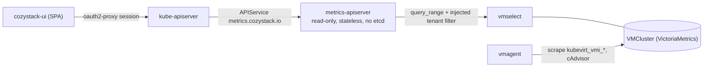
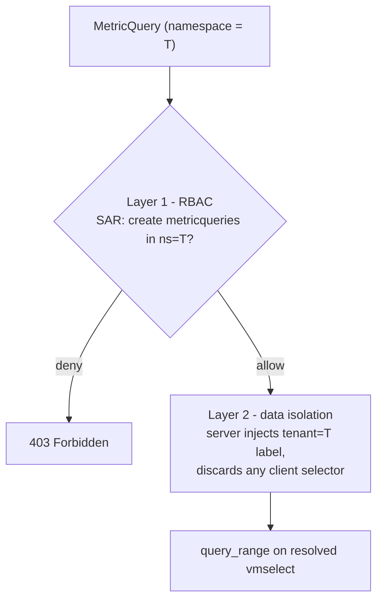
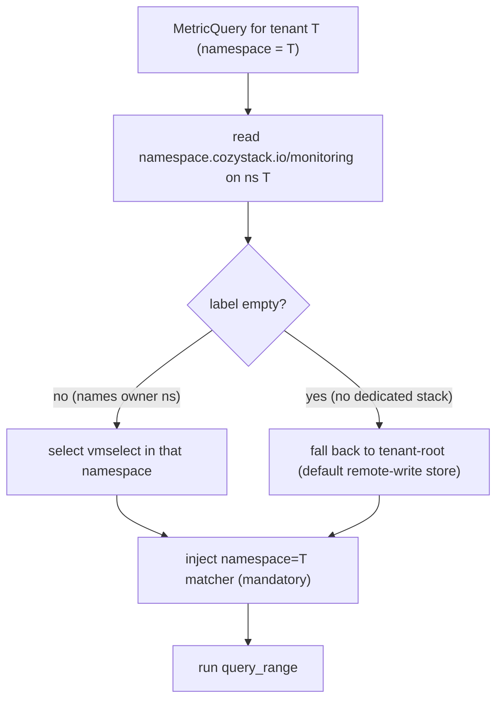

# Read-only aggregation API for tenant resource-consumption metrics

- **Title:** `Read-only aggregation API for tenant resource-consumption metrics`
- **Author(s):** `@IvanHunters`
- **Date:** `2026-10-07`
- **Status:** Draft

## Overview

Cozystack collects rich time-series metrics (CPU, memory, storage, and, once scraped, per-VM network) in VictoriaMetrics, but there is no way for the dashboard to show a tenant their own consumption graphs. The console is a pure SPA that talks only to the Kubernetes API (no backend), and it has neither a query path into VictoriaMetrics nor an authorization model that would let a tenant read only their own series. Today a VM-instance detail page shows status, workloads, and a VNC console, but no CPU/RAM/network graph over time.

This proposal introduces a small **read-only aggregation API server** registered as a Kubernetes `APIService` under a new group `metrics.cozystack.io`. A client creates a `MetricQuery` object scoped to a tenant namespace; the server authorizes it through normal Kubernetes RBAC, resolves which VictoriaMetrics instance holds that tenant's data, injects a mandatory tenant filter into the PromQL, runs a range query, and returns the series in the response. The server has **no storage of its own**: the durable store is VictoriaMetrics, and the API is a thin, authorizing, tenant-isolating read path on top of it.

The design deliberately reuses the pattern of the existing cozystack aggregation API (`apps.cozystack.io`) and the delegated-authz mechanism, so the dashboard reaches it over the same path and auth it already uses for everything else.

## Scope and related proposals

- **Complements, does not replace, Grafana.** Grafana stays the place for deep, ad-hoc exploration. This API serves the narrow, embedded, per-resource graphs the dashboard needs, with tenant isolation enforced server-side.
- **Related to `component-health-reporting`** (same repo). That proposal answers "what is broken right now" as facts in a CRD; this one answers "how much is this resource consuming over time" as series. They are complementary and share the same tenant-scoping philosophy.
- **Billing is out of scope.** A separate metering/billing effort exists outside this repo (the `billing.aenix.io` aggregation API). It is referenced here only as a **pattern** (a storage-less, query-in/result-out aggregation server). This proposal does not depend on it, does not reuse its code, and does not produce invoices or prices.
- **Alert management is a separate, future proposal.** Enabling/disabling alert rules and managing where alerts are delivered is read-write and stateful, and belongs in its own design. It is explicitly deferred (see Non-goals).

## Prior art

- **cozystack aggregation API (reuse the mechanism).** `cozystack-api` (`packages/system/cozystack-api`) is already a Kubernetes aggregated API server for `apps.cozystack.io` / `core.cozystack.io` / `sdn.cozystack.io`, using delegated authentication and authorization (`RecommendedOptions`, `auth-delegator` / `auth-reader`). For `apps.cozystack.io` the authorization is ordinary Kubernetes RBAC evaluated by the kube-apiserver. This proposal adds a new aggregated API server following the same shape.
- **Server-side tenant filtering (reuse the pattern).** The `tenantnamespaces` resource in `cozystack-api` is readable by all `system:authenticated` users and filters the result server-side by walking the RoleBindings in each namespace, with a bypass for `system:masters` and `cozystack-cluster-admin`. From it this proposal borrows the `system:masters` / `cozystack-cluster-admin` bypass and the namespace-scoping philosophy. For authorization itself it does not use the "any binding present" walk; it uses the delegated-RBAC model (a verb-specific `SubjectAccessReview`, like `apps.cozystack.io`), which is strictly more specific (see Design, Layer 1).
- **Storage-less query-in/result-out aggregation server (reuse the shape).** The external `billing.aenix.io` API server runs with `Etcd = nil`, exposes a single resource, implements only `Create`, and returns the computed report in the same object. It authorizes each call with an explicit `SubjectAccessReview` against `query.tenant`. We adopt this shape but fix one known gap: that server authorizes only the top-level tenant and then widens the selection to sub-tenants by regex without authorizing them. We authorize each namespace we read (see Design).
- **Existing usage surface in the console (consumer).** The admin "Capacity" pages (`cozystack-ui`) already poll `metrics.k8s.io` for instantaneous node usage and render gauges; there is no time-series graph and no per-tenant, per-VM view. This API is what a per-VM graph would read from.

## Decisions

<!-- Filled in as implementation proceeds; records live under this
proposal's decisions/ directory, numbered from 0001, linked newest first.
Empty while the proposal is still intent. -->

## Context

Today, the relevant pieces are:

- **Metrics stack: VictoriaMetrics** (not Prometheus). The `victoria-metrics-operator` runs with the Prometheus-CRD converter enabled; `monitoring-agents` runs a cluster-wide `vmagent` (`selectAllByDefault: true`) scraping cAdvisor, kubelet, node-exporter, kube-state-metrics, and the control plane, remote-writing into the `tenant-root` VMCluster by default (`packages/core/platform/templates/bundles/system.yaml`, `global.target`).
- **Per-tenant monitoring is optional.** `tenant.spec.monitoring` (default `false`, `packages/apps/tenant/values.yaml`) deploys a full per-tenant stack (VMCluster, vmagent, Grafana, Alerta) into the tenant namespace. Isolation is by the namespace label `namespace.cozystack.io/monitoring` (`packages/apps/tenant/templates/namespace.yaml`). A tenant **without** its own monitoring inherits the parent's label, so its series live in an ancestor's VMCluster, ultimately `tenant-root`, a store shared by many tenants.
- **Read endpoint.** Each VMCluster exposes a Prometheus-compatible read API at `vmselect-<name>.<ns>.svc:8481/select/0/prometheus/` (`packages/system/monitoring/templates/vm/grafana-datasource.yaml`). VictoriaMetrics multitenancy (`/insert/<accountID>`) is **not** used; everything is accountID 0, so isolation today is "separate instances plus NetworkPolicy", not a tenant dimension inside one store.
- **Tenant RBAC and OIDC groups.** The tenant chart binds four aggregated ClusterRoles `cozy:tenant:{view,use,admin,super-admin}` (labels `rbac.cozystack.io/aggregate-to-tenant-<level>`, `packages/system/cozystack-basics/templates/clusterroles.yaml`) in the tenant namespace, to `kind: Group` subjects named `<tenant>-{view,use,admin,super-admin}` plus the service accounts of ancestor tenants (`cozy-lib` `_rbac.tpl`). The Keycloak operator creates exactly those per-tenant groups (`packages/apps/tenant/templates/keycloakgroups.yaml`); the OIDC `groups` claim is used **without** a group prefix, so RoleBindings reference the group names directly.
- **Dashboard.** `cozystack-ui` is a pure SPA (no BFF). In production an in-pod nginx proxies `/api`, `/apis`, `/k8s` to `kubernetes.default.svc`. In an OIDC deployment (`oidc.enabled: true`, which this proposal's group-based authz assumes) an oauth2-proxy sits in front and the SPA relies on its session cookie; with OIDC off a built-in token-proxy serves the same paths. There is no charting library, no Prometheus proxy, and no Grafana embed in the bundle.

### The problem

- A tenant opens a VM-instance page in the dashboard and wants to see "how much CPU / RAM / network has this VM been using for the last hour". There is no such graph, and no API the SPA could call to build one.
- The obvious shortcut, letting the SPA reach `vmselect` directly (for example through the kube-apiserver `services/<vmselect>/proxy` subresource), is unsafe: `services/proxy` authorizes coarsely and does **not** constrain the PromQL. For a tenant whose data lives in the shared `tenant-root` VMCluster, proxy access reads **every** tenant's series. The shortcut is only safe when each tenant has its own isolated `vmselect`, which is the optional, off-by-default case.
- `workloads.cozystack.io` `status.resources` is a mix of categories, not a usage time-series: CPU and memory come from summed container **requests** (allocation), PVC entries from the bound volume's `status.capacity`, MetalLB from the allocated IP count, and only S3 size is **measured** (queried from SeaweedFS bucket metrics). It carries no CPU/RAM usage over time, so it cannot answer "actual CPU used over time".

## Goals

- A tenant user can retrieve time-series consumption for a resource they own (VM instance, pod, or their namespace in aggregate), scoped to a time range and step, and the dashboard renders it as a graph.
- A tenant user can **never** read another tenant's series, including when both tenants' data lives in the same shared VMCluster. This is enforced server-side, not by trusting the client's query.
- Authorization reuses the existing tenant RBAC and Keycloak groups with **no new groups** and **no change to the tenant chart's bindings**: adding one labeled ClusterRole is sufficient.
- The API server is **stateless** (no etcd, no database), horizontally scalable, and adds no durable copy of metrics.
- A parent tenant can read a child tenant's series exactly when existing RBAC already grants the parent access to the child's namespace, and not otherwise.

### Non-goals

- Not billing, metering, pricing, or invoices.
- Not alert-rule management or alert-routing configuration (separate proposal).
- Not a general-purpose PromQL endpoint: callers choose a metric from a fixed catalog, they do not submit arbitrary PromQL.
- Not a replacement for Grafana or for `metrics.k8s.io`.
- Not a new durable store or downsampling engine; retention and downsampling stay in VictoriaMetrics.
- Not metrics for resources **inside** guest Kubernetes clusters (Kamaji). This API serves management-cluster tenant resources (VM instances are management-cluster workloads). Guest-internal observability has a different authorization model (per-user email bindings) and is out of scope.

## Design

### 1. Component placement and data flow

The new server is a thin, read-only aggregation API server. The SPA reaches it through the same kube-apiserver path and session it already uses; the server does the tenant isolation that a raw proxy cannot.



### 2. API resource

A single namespaced resource `MetricQuery` in `metrics.cozystack.io/v1alpha1`. The resource is namespaced so that the namespace is the tenant scope and ordinary RBAC applies to it. Following the storage-less pattern, only `create` is implemented: the client submits a query, the server fills `status` in the response, and nothing is persisted.

```yaml
apiVersion: metrics.cozystack.io/v1alpha1
kind: MetricQuery
metadata:
  namespace: tenant-acme          # tenant scope; authz is evaluated against this
spec:
  target:
    kind: VMInstance              # VMInstance | Pod | Namespace
    name: my-vm                   # ignored when kind=Namespace
  metric: cpu-usage               # from the fixed catalog, see 4
  range:
    start: "2026-10-07T10:00:00Z"
    end:   "2026-10-07T11:00:00Z"
    step:  "30s"
status:
  series:
    - labels: { instance: "my-vm" }
      points:
        - { t: 1696672800, v: 0.42 }
        - { t: 1696672830, v: 0.44 }
  warnings: []                     # for example: tenant has no monitoring stack
```

Why `create` rather than a custom subresource or `get`: it mirrors `SubjectAccessReview` and the existing billing pattern, it carries a structured request body without encoding everything into a URL, and it makes the RBAC verb (`create metricqueries` in the tenant namespace) unambiguous. The server never writes the object anywhere.

### 3. Authorization: two independent layers

RBAC answers only "may this user issue a query in the context of tenant T". It does **not** decide which series come back. These are two separate concerns and must not be conflated.



**Layer 1 (RBAC).** The aggregated server delegates to the kube-apiserver with a `SubjectAccessReview` for the authenticated user (and their OIDC groups): `{verb: create, group: metrics.cozystack.io, resource: metricqueries, namespace: T}`. The grant is a single aggregated ClusterRole:

```yaml
apiVersion: rbac.authorization.k8s.io/v1
kind: ClusterRole
metadata:
  name: cozy:tenant:view:metrics-apiserver
  labels:
    rbac.cozystack.io/aggregate-to-tenant-view: "true"
rules:
  - apiGroups: ["metrics.cozystack.io"]
    resources: ["metricqueries"]
    verbs: ["create"]
```

Because this aggregates into `cozy:tenant:view`, and the tenant chart already binds `cozy:tenant:view` in each tenant namespace to the group `<tenant>-view` (and, through the `cozy-lib` level hierarchy view < use < admin < super-admin, to the higher groups and to ancestor tenants), every level and every ancestor gets the permission automatically. No new Keycloak group, no change to the tenant chart. Reading metrics is granted at `view`.

**Layer 2 (data isolation).** The server takes the tenant from `metadata.namespace` (already authorized in layer 1) and **injects** the tenant label into the PromQL itself. The label is the per-series `namespace` label (the same dimension series already carry and that billing keys tenants on). Client-provided label matchers are not trusted; the only selectors that reach VictoriaMetrics are the ones the server builds. The isolation invariant, and the crux of this whole design, is that every series in a shared store is attributable to exactly one tenant namespace and that `namespace` label is server-controlled, never tenant-settable; phase 0 must confirm the preferred KubeVirt per-VMI metrics and every fallback source carry it with the resource's own namespace value. This is what makes a shared `tenant-root` VMCluster safe.

**Hierarchy (sub-tenants).** When a parent reads a child tenant, the request's namespace is the child's namespace, and layer 1 authorizes it directly: the `cozy-lib` bindings already place the parent's group into the child namespace, so "parent may read child" falls out of real RBAC rather than a regex. There is no separate `includeSubTenants` flag that widens the query past what RBAC checked.

**Platform bypass.** Mirroring `tenantnamespaces`, the groups `system:masters` and `cozystack-cluster-admin` bypass tenant resolution and may query any tenant, for admin dashboards.

### 4. Metric catalog and query construction

Callers pick a metric from a fixed catalog; the server owns the PromQL template and fills in the target and the tenant filter. This keeps the surface small, keeps PromQL out of tenant hands, and lets query cost be bounded.

Initial catalog (per `target.kind`):

| metric | meaning | preferred source | fallback source available today |
| --- | --- | --- | --- |
| `cpu-usage` | CPU seconds per second | KubeVirt per-VMI CPU metric | `rate(container_cpu_usage_seconds_total{pod=~"virt-launcher-<vm>-.*"}[...])` |
| `memory-usage` | working-set bytes | KubeVirt per-VMI memory metric | `container_memory_working_set_bytes{...}` |
| `network-rx` / `network-tx` | bytes/s received / transmitted | KubeVirt per-VMI network metrics | none per-VM today (see Rollout) |
| `disk-usage` | PVC used/requested bytes | KubeVirt / KSM | `kube_persistentvolumeclaim_resource_requests_storage_bytes{...}` |

The exact KubeVirt metric names are **not pinned in this proposal**: they are a third-party contract and must be confirmed against the KubeVirt metrics reference during implementation, not guessed here. Per-VM network is the one category with no usable source today (see Rollout, phase 0).

Consumption means **measured usage**, not requests. The requested-resource data in `workloads.cozystack.io` `status.resources` (container CPU/memory requests) is a separate concern and may later be offered as an overlay ("requested vs used"), but the graphs this proposal targets are actual usage.

### 5. Tenant-to-vmselect resolution



The server reads the `namespace.cozystack.io/monitoring` label on the tenant's own namespace. That label is set at tenant-render time to the namespace of the nearest ancestor that has monitoring enabled (the tenant itself when it has its own stack), and is the empty string when no ancestor enables monitoring, which is the default (`tenant.spec.monitoring` is `false` by default). So resolution is a direct read with no ancestry walk: a non-empty label names the VMCluster that holds the tenant's data and the server selects that `vmselect` Service; an empty label means the tenant has no dedicated stack and its series live in the platform default store `tenant-root` (the hardcoded `monitoring-agents` remote-write target), which the resolver uses as the fallback. Which storage to hit for a given range (shortterm vs longterm) is an open question (see Open questions). The `namespace=<T>` matcher is injected unconditionally; it is redundant for an isolated per-tenant store but mandatory for the shared one, and always injecting it removes a "which store am I in" mistake.

### 6. Statelessness and caching

The server keeps **no durable state**. VictoriaMetrics already persists series, enforces retention, and has its own query cache, so a second store would only add a consistency problem.

- **No persistent or shared cache** (no Redis, no sidecar DB). Duplicating a store that is already durable buys nothing and fights graph freshness.
- **Optional in-process request coalescing** (singleflight): identical concurrent queries from dashboard polling collapse into one upstream `query_range`. This is per-replica, short-lived, and does not change the stateless deployment model.
- **Heavy or long-range aggregations** are handled by VictoriaMetrics recording rules, not by a bespoke cache in this server.
- **Query-cost limits** (allowlisted metrics, bounded `step`, max range, max points) protect `vmselect` from expensive queries without caching.

### 7. Deployment

A new package `packages/system/metrics-apiserver` (name TBD) ships:

- the Deployment (2+ replicas, stateless) and Service,
- the `APIService` for `v1alpha1.metrics.cozystack.io` with delegated authn/authz (`auth-delegator` ClusterRoleBinding, `auth-reader` RoleBinding), mirroring `cozystack-api`,
- the single aggregated ClusterRole from section 3.

It runs in the management cluster alongside `cozystack-api`.

## User-facing changes

- **Dashboard:** a consumption graph section on the VM-instance detail page (CPU / RAM / network over a selectable range), and potentially a tenant-overview consumption panel. This requires adding a charting approach to `cozystack-ui`, which currently has none.
- **API:** a new API group `metrics.cozystack.io` with one resource, `metricqueries`, usable via `kubectl create -f query.yaml -o yaml` as well as from the SPA.
- **RBAC:** granted automatically at tenant `view` and above through existing groups; administrators see no new group to manage.

## Upgrade and rollback compatibility

- Purely additive. Existing clusters, manifests, and APIs are unaffected.
- No CRD and no stored objects, so there is nothing to migrate and nothing to leave behind. Removing the `APIService` and the package cleanly removes the feature; in-flight queries simply start failing with the API group gone, and the dashboard degrades to "no graph" (the same state as today).
- The phase-0 scrape change (collecting `kubevirt_vmi_*`) is an independent, reversible monitoring change.

## Security

- **New trust boundary:** the server issues PromQL to `vmselect` on behalf of users. The whole point of layer 2 is that the server, not the user, decides the tenant filter. Client label selectors are never forwarded verbatim.
- **Tenant-supplied input** is limited to a namespace (authorized by RBAC), a target kind/name, a metric from a fixed catalog, and a bounded range/step. There is no free-form PromQL, which removes both the cross-tenant read risk and the expensive-query risk inherent in a raw proxy.
- **Input sanitization.** `target.name` is validated against the Kubernetes resource-name grammar before it is interpolated into any PromQL matcher (for example the `virt-launcher-<vm>-.*` pod selector), so a tenant cannot inject regex metacharacters to widen the selection. Cross-tenant reads stay impossible regardless, because the server's `namespace` matcher is ANDed into every query; sanitization closes the narrower within-tenant widening.
- **Why not `services/proxy` to `vmselect`:** it authorizes coarsely and cannot inject a tenant filter, so against the shared `tenant-root` VMCluster it leaks every tenant's series. Rejected for that reason (see Alternatives).
- **New RBAC surface:** one aggregated ClusterRole granting `create` on `metricqueries`. No new secrets are stored or transmitted; the server uses its own ServiceAccount to reach `vmselect` and delegated authn to identify callers.

## Failure and edge cases

- Tenant has **no** monitoring stack anywhere in its ancestry: resolver finds no `vmselect`; return an empty `status.series` with a `warning`, not an error, so the dashboard shows "no data" rather than a failure.
- `vmselect` unreachable or returns an error: surface it in `status` so the client can distinguish "no data" from "backend down".
- Caller requests a tenant namespace they cannot access: layer 1 denies with 403 before any query runs.
- Caller tries to widen the query with extra label selectors: ignored; only the server-built selector reaches `vmselect`.
- Range or step out of bounds: rejected by validation with a clear message.
- VM has restarted (new `virt-launcher` pod): the fallback cadvisor query uses a pod regex per VM, so the series spans restarts; the preferred KubeVirt per-VMI metric is restart-stable by construction.

## Testing

- **Unit:** tenant-label injection builds the expected PromQL and cannot be overridden by client input; the resolver reads the inherited `namespace.cozystack.io/monitoring` label and selects the named vmselect, falling back to `tenant-root` when the label is empty; the metric catalog maps to the expected templates; range/step validation.
- **Integration:** the `SubjectAccessReview` path allows `<tenant>-view` in the tenant namespace and denies a foreign tenant; `system:masters` / `cozystack-cluster-admin` bypass.
- **e2e:** two tenants on a shared `tenant-root` store; tenant A's query returns only A's series and never B's; a parent reading a child succeeds, a sibling reading a sibling fails; a VM graph renders end to end in the dashboard.

## Rollout

- **Phase 0 (prerequisite): scrape per-VM metrics.** Confirm on a live cluster whether `kubevirt_vmi_*` (cpu/memory/network/storage) are actually collected (`kubectl get vmservicescrape -n tenant-root`), and if not, add the scrape so the data exists. Per-VM network is the blocking gap today. This phase has value on its own (Grafana can use the data immediately).
- **Phase 1: API server + RBAC.** Ship `packages/system/metrics-apiserver`, the `APIService`, and the aggregated ClusterRole. The API is usable via `kubectl`.
- **Phase 2: dashboard.** Add charts to the VM-instance page in `cozystack-ui`.

## Open questions

- Resource and package naming: `MetricQuery` vs a more specific name; package name under `packages/system`.
- Should `target.kind: Namespace` (tenant-wide aggregate) be in the first cut, or only `VMInstance` / `Pod`?
- Range-based storage selection: when a tenant has both shortterm and longterm VMClusters, how does the server pick (by requested range, or always longterm)?
- Should allocation ("requested") be offered as an overlay next to usage in the same response, or kept entirely separate?
- Exact KubeVirt metric names and their availability in the shipped KubeVirt version (to be pinned against the KubeVirt metrics reference in phase 0).
- Confirm the guest-cluster (Kamaji) exclusion is acceptable, or scope a follow-up for guest-internal metrics.

## Alternatives considered

- **SPA proxies to `vmselect` via `services/proxy`.** Simplest to build and returns native Prometheus JSON, but authorizes coarsely and cannot inject a tenant filter, so it leaks across tenants on the shared store. Rejected on isolation grounds; it is the central reason a server-side filtering API is needed.
- **Embed Grafana (iframe) per tenant.** Reuses existing dashboards, but couples the console to Grafana auth/session, only works where a per-tenant Grafana exists, and gives no control over the embedded surface. Heavier and less integrated than a small API plus native charts.
- **Extend the external `billing.aenix.io` server.** It is billing-oriented, returns scalar aggregates over a window (via `integrate(...)`), not time-series, and uses allocation, not usage. Wrong shape for graphs, and mixing read-only graph queries into a billing surface is the scope creep this proposal avoids.
- **Client submits arbitrary PromQL.** Maximum flexibility, but reintroduces the expensive-query and injection risks and makes tenant isolation a PromQL-rewriting problem. Rejected in favor of a fixed catalog.
- **VictoriaMetrics native multitenancy (`accountID`).** Could isolate tenants inside one store, but cozystack does not use it today (everything is accountID 0), and adopting it is a larger change to the whole monitoring stack. Out of scope; label injection achieves isolation without restructuring storage.

---

<!--
Inspired by KubeVirt enhancement proposals
(https://github.com/kubevirt/enhancements) and Kubernetes Enhancement
Proposals (KEPs).
-->
